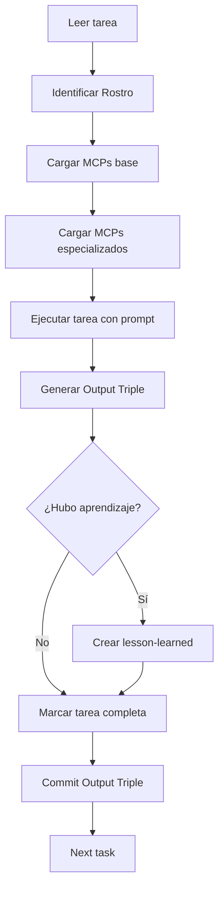

# Best Practices: Spec Workflow with DAATH-ZEN Integration

```yaml
---
id: "steering-best-practices"
version: "1.0.0"
date: "2026-01-08"
applies_to: "spec-workflow-mcp + DAATH-ZEN"
---
```

---

## Principio Central

> **Cada tarea en tasks.md es una micro-invocación de un Rostro DAATH-ZEN.**
> No es "código genérico" — es un proceso con actor, MCPs y Output Triple.

---

## 1. Estructura de Tarea Completa

### Formato Base (spec-workflow-mcp compliant):

```markdown
- [ ] 1.1. [Action Verb] + [Object] + [Context]
  - File: path/to/files
  - _Requirements: REQ-X, REQ-Y_
  - _Rostro: ROSTRO-NAME_
  - _MCPs: base=[neo4j, memory] | specialized=[tool1, tool2]_
  - _Lesson: task-1.1-lesson.md_
  - _Prompt: Role: X | Task: Y | Restrictions: Z | Success: W_
```

### Ejemplo Completo:

```markdown
- [ ] 1.1. Fix all nucleo-investigacion references
  - File: *.md, *.py, docker-compose.yml
  - _Requirements: REQ-1_
  - _Rostro: MELQUISEDEC_
  - _MCPs: base=[neo4j, memory] | specialized=[filesystem, sequential-thinking]_
  - _Lesson: lessons-learned/task-1.1-fix-references.md_
  - _Prompt: Role: MELQUISEDEC Classifier | Task: Scan all files for 'nucleo-investigacion' references, classify by type (import, link, config), prioritize fixes | Restrictions: Don't break working imports | Success: All references updated, no broken links_
```

---

## 2. MCPs por Tipo de Tarea

### 2.1. Tareas de Clasificación (MELQUISEDEC)
**Base**: `neo4j`, `memory`
**Especializados**: `filesystem`, `sequential-thinking`, `brave-search`

**Casos**:
- Escanear inbox de issues
- Clasificar documentos
- Priorizar tareas

### 2.2. Tareas de Investigación (HYPATIA)
**Base**: `neo4j`, `memory`
**Especializados**: `brave-search`, `arxiv`, `firecrawl`, `markitdown`, `context7`

**Casos**:
- Buscar papers académicos
- Extraer información de webs
- Convertir PDFs a markdown

### 2.3. Tareas de Análisis (SALOMON)
**Base**: `neo4j`, `memory`
**Especializados**: `sequential-thinking`, `perplexity`

**Casos**:
- Comparar alternativas
- Tomar decisiones fundamentadas
- Análisis de trade-offs

### 2.4. Tareas de Diseño/Refactoring (MORPHEUS)
**Base**: `neo4j`, `memory`
**Especializados**: `filesystem`, `sequential-thinking`, `python-refactoring`

**Casos**:
- Diseñar templates
- Refactorizar código
- Crear esquemas

### 2.5. Tareas de Publicación (ALMA)
**Base**: `neo4j`, `memory`
**Especializados**: `filesystem`, `git`, `github`

**Casos**:
- Commit changes
- Push to remote
- Create releases

---

## 3. Lessons-Learned al Finalizar Tarea

### 3.1. Cuándo Crear una Lesson

**SÍ crear lesson si**:
- ✅ Encontraste un problema inesperado
- ✅ Descubriste un patrón reutilizable
- ✅ La solución puede generalizarse
- ✅ El prompt podría mejorarse

**NO crear lesson si**:
- ❌ Tarea trivial sin aprendizaje
- ❌ Solución ya documentada
- ❌ Caso muy específico no generalizable

### 3.2. Template de Lesson (Simplificado)

```markdown
# Lesson: [Task ID] - [Brief Title]

## Context
- **Task**: 1.1 Fix references
- **Rostro**: MELQUISEDEC
- **Problem**: [What went wrong or could improve]

## Solution Applied
[What you did to solve it]

## Improvement Proposed
**Current Prompt Issue**:
[What was unclear or missing in the prompt]

**Suggested Addition**:
[Specific text to add to prompt TYPE]

## Validation
- Confidence: 0.XX
- Status: proposed
- Apply to: daath-zen-melquisedec-vX.Y.Z
```

### 3.3. Ubicación de Lessons

```
.spec-workflow/
└── specs/
    └── {spec-name}/
        ├── requirements.md
        ├── design.md
        ├── tasks.md
        └── lessons-learned/        # ← Nuevo
            ├── task-1.1-lesson.md
            ├── task-1.2-lesson.md
            └── summary.yaml        # Aggregado al finalizar spec
```

---

## 4. Workflow Completo de una Tarea



---

## 5. Patrón de Spec Completo

### 5.1. Estructura de Spec

```
.spec-workflow/specs/{spec-name}/
├── requirements.md       # User stories + acceptance criteria
├── design.md             # Architecture decisions + diagrams
├── tasks.md              # Executable tasks with rostros + MCPs
├── approvals/            # Approval flow (optional)
└── lessons-learned/      # Post-execution learning
    ├── task-X.X-lesson.md
    └── summary.yaml      # Aggregated lessons
```

### 5.2. Criterios para Nuevo Spec

**Crear spec cuando**:
- ✅ Feature completa (no single task)
- ✅ Múltiples tareas relacionadas (3+)
- ✅ Requiere coordinación entre rostros
- ✅ Produce artefactos versionables

**No crear spec si**:
- ❌ Single task independiente
- ❌ Hotfix o bugfix trivial
- ❌ Tarea operativa sin diseño

---

## 6. Integration with Git Workflow

### 6.1. Branch Strategy

```
main
├── spec/monorepo-improvements-v1.1.0  # Feature branch per spec
│   └── task/1.1-fix-references        # Optional sub-branch per task
└── spec/git-push-workflow-v1.0.0      # Another spec
```

### 6.2. Commit Message Format

```
<type>(<spec>): <task-id> <brief-description>

Spec: {spec-name}
Task: {task-id}
Rostro: {rostro-name}
MCPs: {mcps-used}
Lesson: {lesson-file or N/A}

[Optional body describing details]
```

**Example**:
```
feat(monorepo-improvements): 1.1 Fix nucleo-investigacion references

Spec: monorepo-improvements-v1.1.0
Task: 1.1
Rostro: MELQUISEDEC
MCPs: neo4j, memory, filesystem, sequential-thinking
Lesson: lessons-learned/task-1.1-lesson.md

- Scanned 47 files
- Fixed 23 references
- Updated imports in 8 Python files
- Created lesson on reference classification patterns
```

---

## 7. Dashboard Integration

### 7.1. Task Status Mapping

| Checkbox | Status | Rostro Action |
|----------|--------|---------------|
| `- [ ]` | Pending | Not started |
| `- [-]` | In Progress | Rostro executing |
| `- [x]` | Completed | Output Triple generated |

### 7.2. Extension Commands

```bash
# View tasks in VS Code
Cmd+Shift+P → "Spec Workflow: Show Tasks"

# Mark task in progress
Right-click task → "Start Task"

# Complete task
Right-click task → "Complete Task"

# View lessons
Right-click spec → "View Lessons Learned"
```

---

## 8. Patrones DAATH-ZEN Emergentes

A medida que se completen specs, identificar patrones reutilizables:

### 8.1. Crear Template de Patrón

```
_templates/daath-zen-patterns/
├── daath-zen-refactoring.md      # Patrón para refactoring tasks
├── daath-zen-git-workflow.md     # Patrón para git operations
├── daath-zen-research.md         # Patrón para investigación
└── README.md                     # Índice de patrones
```

### 8.2. Criterios para Nuevo Patrón

- ✅ Usado en 3+ specs diferentes
- ✅ Alta confianza (>0.80) en lessons
- ✅ Generalizable a múltiples dominios
- ✅ Reduce tiempo de ejecución significativamente

---

## 9. Métricas de Calidad

### 9.1. Por Tarea
- Tiempo de ejecución
- Número de MCPs usados
- Lessons generadas
- Confianza de lessons

### 9.2. Por Spec
- Tareas completadas / totales
- Cobertura de rostros (diversidad)
- Lessons de alta confianza generadas
- Patrones emergentes identificados

### 9.3. Agregado (Monorepo)
- Total specs activos
- Patrones DAATH-ZEN consolidados
- Knowledge graph growth (nodos/relaciones)
- Reusabilidad de lessons

---

## 10. Checklist de Calidad

### Antes de crear spec:
- [ ] Tiene 3+ tareas relacionadas
- [ ] Requiere coordinación entre rostros
- [ ] Produce artefactos versionables
- [ ] Steering docs están actualizados

### Al escribir tasks.md:
- [ ] Cada tarea tiene Rostro asignado
- [ ] MCPs base + especializados especificados
- [ ] Lesson field incluido (o N/A)
- [ ] Prompt completo (Role | Task | Restrictions | Success)
- [ ] File paths específicos

### Al completar tarea:
- [ ] Output Triple generado (Cypher + Markdown + Lesson)
- [ ] Lesson creada si aplica
- [ ] Commit con formato estándar
- [ ] Task marcada como [x] completada

### Al cerrar spec:
- [ ] Todas las tareas [x] completadas
- [ ] Lessons agregadas en summary.yaml
- [ ] Patrones identificados documentados
- [ ] Branch mergeada a main
- [ ] Tag de versión creado

---

## Resumen: 3 Niveles de Integración

| Nivel | Tool | Propósito | Output |
|-------|------|-----------|--------|
| **1. Spec** | spec-workflow-mcp | Planificar y ejecutar features | tasks.md → Código |
| **2. Rostros** | DAATH-ZEN | Ejecutar tareas con contexto | Output Triple |
| **3. Lessons** | Autopoiesis | Aprender y mejorar prompts | Patrones emergentes |

**Ciclo virtuoso**:
```
Spec → Task → Rostro → Output Triple → Lesson → Pattern → Mejor Spec
```

