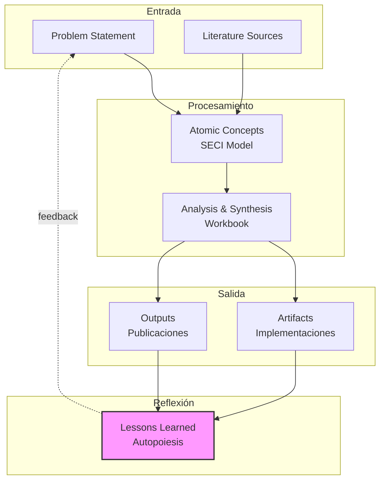
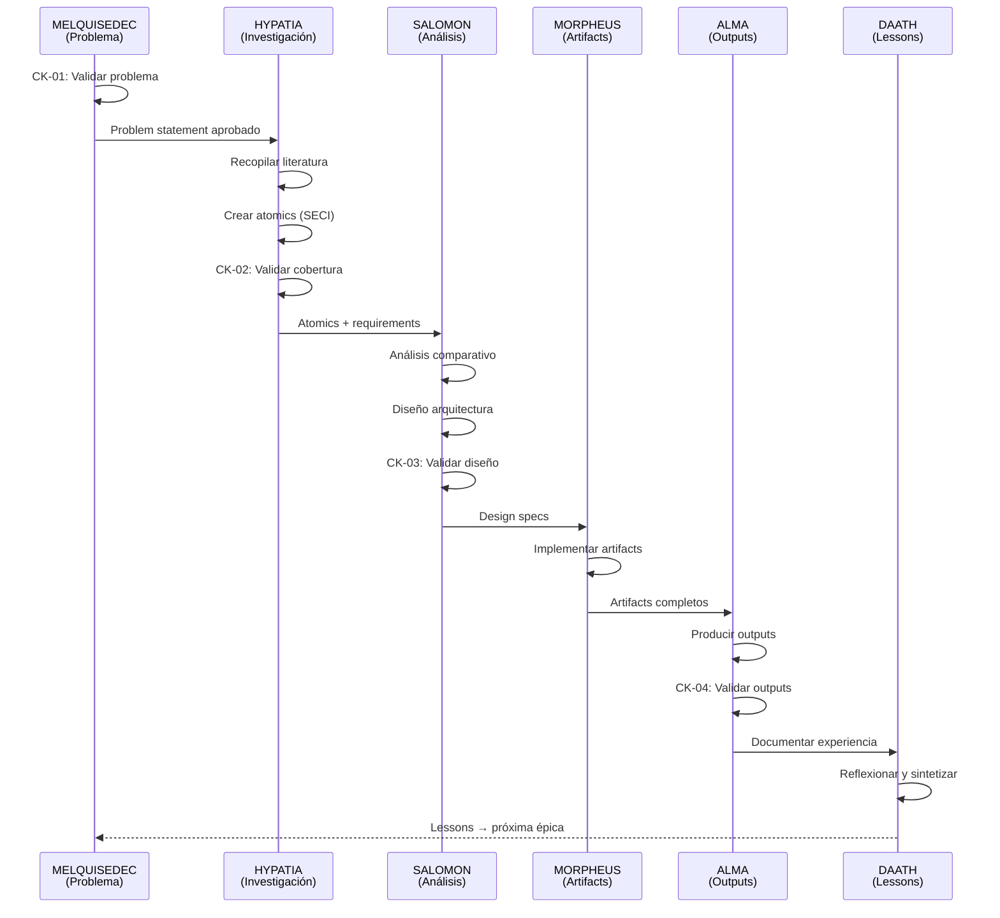
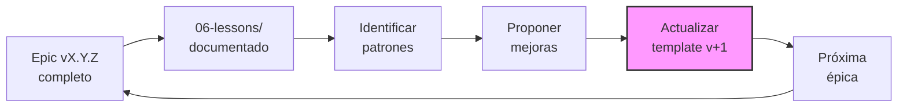

# Design Specification

<!-- HKM Metadata -->
---
hkm_type: concept
epistemic_level: concept
title: "Design - [TÍTULO_ÉPICA]"
created: YYYY-MM-DD
updated: YYYY-MM-DD
tags: [design, architecture, research, specification]
synthesis_from:
  - requirements.md
  - 01-literature/
  - 02-atomics/
---

## 1. Resumen Ejecutivo

### 1.1. Problema y Solución

**Problema**: [Síntesis de problem_statement de requirements.md]

**Solución Propuesta**: [Descripción de alto nivel de la arquitectura/diseño que resuelve el problema]

### 1.2. Decisiones de Diseño Clave

| ID | Decisión | Alternativas Consideradas | Justificación |
|----|----------|---------------------------|---------------|
| DD-01 | [Decisión arquitectónica 1] | A, B, C | [Razón basada en criterios] |
| DD-02 | [Decisión tecnológica 2] | A, B, C | [Razón basada en criterios] |
| DD-03 | [Decisión metodológica 3] | A, B, C | [Razón basada en criterios] |

### 1.3. Trade-offs Principales

- **Trade-off 1**: [Beneficio vs Costo]
- **Trade-off 2**: [Simplicidad vs Flexibilidad]
- **Trade-off 3**: [Velocidad vs Precisión]

## 2. Arquitectura Conceptual

### 2.1. Modelo de Alto Nivel



### 2.2. Componentes Principales

#### 2.2.1. Input Layer (00-problem + 01-literature)

**Responsabilidad**: Capturar problema y recopilar conocimiento externo

**Componentes**:
- `problem-statement.md`: Definición formal del problema
- `01-literature/sources/`: Papers, libros, documentación técnica
- `01-literature/references.bib`: BibTeX references

**Interfaces**:
- **Input**: URLs, DOIs, archivos PDF/MD
- **Output**: Documentos estructurados con HKM headers

**Tecnologías**:
- Zotero / Mendeley para gestión bibliográfica
- Firecrawl MCP para web scraping
- Markitdown MCP para conversión PDF→MD

#### 2.2.2. Processing Layer (02-atomics + 03-workbook)

**Responsabilidad**: Sintetizar conceptos y diseñar solución

**Componentes (02-atomics/)**:
- `socialization/`: Observaciones y experiencias directas (SECI-S)
- `externalization/`: Conceptos explicitados desde tácito (SECI-E)
- `combination/`: Síntesis de conceptos explícitos (SECI-C)
- `internalization/`: Aprendizajes incorporados (SECI-I)

**Componentes (03-workbook/)**:
- `analysis/`: Análisis comparativo, evaluaciones
- `design/`: Arquitecturas, modelos, diagramas
- `decisions/`: ADRs (Architecture Decision Records)

**Interfaces**:
- **Input**: Atomics + requirements.md
- **Output**: Diseño validado, ADRs, diagramas

**Tecnologías**:
- Sequential Thinking MCP para análisis paso a paso
- Smart Thinking MCP para síntesis y conexiones
- Mermaid/PlantUML para diagramas

#### 2.2.3. Output Layer (04-artifacts + 05-outputs)

**Responsabilidad**: Implementar y publicar resultados

**Componentes (04-artifacts/)**: [DIVERGENTE según type]
- **Research**: Notebooks, scripts de análisis, modelos ML
- **App**: Código fuente, APIs, interfaces
- **Social-Project**: Metodologías, guías, instrumentos

**Componentes (05-outputs/)**: [DIVERGENTE según type]
- **Research**: Papers, reportes técnicos, visualizaciones
- **App**: Documentación de usuario, releases
- **Social-Project**: Informes, presentaciones, recursos educativos

**Interfaces**:
- **Input**: Design specs de 03-workbook/
- **Output**: Artefactos funcionales + documentación

**Tecnologías**:
- Python + Jupyter para research
- Docker + GitHub Actions para apps
- LaTeX + Markdown para outputs

#### 2.2.4. Feedback Layer (06-lessons)

**Responsabilidad**: Capturar aprendizajes y mejorar template (P2)

**Componentes**:
- `checkpoint-lessons/`: Aprendizajes por CK-01 a CK-04
- `technical-lessons/`: Issues técnicos y soluciones
- `methodological-lessons/`: Mejoras al proceso
- `template-improvements.md`: Sugerencias al template

**Interfaces**:
- **Input**: Experiencias de todas las fases
- **Output**: Lessons documentados → próxima iteración

**Tecnologías**:
- Smart Thinking MCP para reflexión y conexiones
- Git para versionado de lessons

### 2.3. Flujo de Datos



## 3. Arquitectura Técnica

### 3.1. Stack Tecnológico (Hybrid Approach)

Basado en `comparative-analysis.md` y `llamaindex.md` Chapter 10:

```
┌─────────────────────────────────────────────────────┐
│              LangChain Layer (Orchestration)         │
│  - Agents, Chains, Conversational Logic              │
│  - Score: 8.0/10 para orchestration                  │
└──────────────────┬──────────────────────────────────┘
                   │ LangChainRetrieverTool wrapper
┌──────────────────▼──────────────────────────────────┐
│             LlamaIndex Layer (Retrieval)             │
│  - Query Engines, Retrievers, Reranking              │
│  - Score: 8.6/10 para retrieval                      │
└──────────────────┬──────────────────────────────────┘
                   │ Neo4jVectorIndex
┌──────────────────▼──────────────────────────────────┐
│             Neo4j 5.15+ (Unified Storage)            │
│  - Graph: HKM relationships                          │
│  - Vector: Embeddings para similarity search         │
│  - Cypher queries + Vector Index                     │
└─────────────────────────────────────────────────────┘
```

**Justificación**:
- **Neo4j**: Almacenamiento unificado para grafo + vectores (vs. separar Chroma/Pinecone)
- **LlamaIndex**: Mejor para retrieval complejo (reranking, query transformation)
- **LangChain**: Mejor para orchestration y agents conversacionales
- **Integración**: LlamaIndex retriever wraps as LangChain Tool (llamaindex.md#370-440)

### 3.2. Persistencia Triple (P6: Trazabilidad)

```
Markdown (.md)  ←─sync─→  Neo4j Graph  ←─sync─→  Vector Embeddings
     │                          │                        │
     └──────────────────────────┴────────────────────────┘
              validate-triple-coherence.py
```

**Sincronización**:
1. **MD → Neo4j**: `sync-hkm-to-neo4j.py` parsea HKM headers → crea nodos + rels
2. **Neo4j → Vector**: Neo4j genera embeddings automáticamente (vector index)
3. **Validación**: `validate-triple-coherence.py` verifica coherencia 3-way

### 3.3. HKM Integration

**Header Structure** (docs/manifiesto/02-arquitectura/03-templates-hkm.md):

```yaml
---
hkm_type: source | concept | workbook | artifact | output | lesson
epistemic_level: source | concept | workbook | artifact | output | lesson
title: "Título descriptivo"
created: YYYY-MM-DD
updated: YYYY-MM-DD
tags: [tag1, tag2, tag3]
synthesis_from:  # Solo para concept+ levels
  - path/to/source1.md
  - path/to/source2.md
---
```

**Neo4j Mapping**:
```cypher
// sync-hkm-to-neo4j.py crea:
CREATE (n:HKMNode {
  type: 'source',
  level: 'source',
  title: 'Título',
  path: '01-literature/paper123.md',
  created: datetime('2026-01-09'),
  tags: ['research', 'ml']
})

// Y relaciones:
MATCH (concept:HKMNode {path: '02-atomics/seci-model.md'})
MATCH (source:HKMNode {path: '01-literature/nonaka1995.md'})
CREATE (concept)-[:SYNTHESIZED_FROM]->(source)
```

## 4. Diseño Metodológico

### 4.1. Design Science Research (DSR) Integration

Este template implementa las 3 fases DSR:

| Fase DSR | Carpetas | Rostros DAATH-ZEN | Checkpoint |
|----------|----------|-------------------|------------|
| **1. Problem Identification** | 00-problem/ | MELQUISEDEC | CK-01 |
| **2. Solution Design** | 01-literature/<br/>02-atomics/<br/>03-workbook/ | HYPATIA<br/>SALOMON | CK-02<br/>CK-03 |
| **3. Evaluation** | 04-artifacts/<br/>05-outputs/ | MORPHEUS<br/>ALMA | CK-04 |

### 4.2. SECI Model (Atomic Knowledge)

Implementación en `02-atomics/`:

```
02-atomics/
├── socialization/       # SECI-S: Tácito → Tácito
│   └── observation-X.md   # Experiencias directas, observaciones
├── externalization/     # SECI-E: Tácito → Explícito
│   └── concept-X.md       # Conceptos articulados desde intuición
├── combination/         # SECI-C: Explícito → Explícito
│   └── synthesis-X.md     # Combinación de conceptos explícitos
└── internalization/     # SECI-I: Explícito → Tácito
    └── lesson-X.md        # Aprendizajes incorporados
```

### 4.3. Zettelkasten Principles

**Atomicidad**: Cada nota en `02-atomics/` representa UN concepto

**Conexiones**: Smart Thinking MCP genera connections en graph

**Emergencia**: Synthesis emerge de conexiones (no planificación top-down)

## 5. Patterns y Best Practices

### 5.1. Naming Conventions

**Archivos**:
- `kebab-case.md` para documentos
- Prefijos por tipo: `source-`, `concept-`, `analysis-`, `artifact-`, `output-`, `lesson-`
- Versionado semántico en nombres críticos: `design-v1.2.0.md`

**HKM Types**:
- `source` → 01-literature/
- `concept` → 02-atomics/
- `workbook` → 03-workbook/
- `artifact` → 04-artifacts/
- `output` → 05-outputs/
- `lesson` → 06-lessons/

### 5.2. Checkpoint Validation Strategy

**CK-01 (Problema)**:
- [ ] Problem statement claro y medible
- [ ] Success criteria definidos
- [ ] Stakeholders identificados
- [ ] Approval: [Investigador Principal]

**CK-02 (Investigación)**:
- [ ] Mínimo [N] fuentes primarias documentadas
- [ ] Mínimo [N] conceptos atómicos en 02-atomics/
- [ ] validate-metadata.py pasa sin errores
- [ ] Approval: [HYPATIA / Revisor]

**CK-03 (Análisis)**:
- [ ] Diseño completo en 03-workbook/design/
- [ ] ADRs documentando decisiones clave
- [ ] Diagramas de arquitectura (Mermaid/PlantUML)
- [ ] Approval: [SALOMON / Arquitecto]

**CK-04 (Implementación+Outputs)**:
- [ ] Artifacts funcionales en 04-artifacts/
- [ ] Outputs listos para publicación en 05-outputs/
- [ ] validate-triple-coherence.py pasa sin errores
- [ ] Mínimo 1 lesson por checkpoint en 06-lessons/
- [ ] Approval: [MORPHEUS+ALMA / Equipo completo]

### 5.3. Divergent Workflows

**Post-SALOMON (CK-03)**, los workflows divergen según `type` en ISSUE.yaml:

#### 5.3.1. Research Type

**04-artifacts/**:
```
04-artifacts/
├── notebooks/           # Jupyter notebooks de análisis
├── scripts/             # Scripts Python/R
├── models/              # Modelos ML/estadísticos
└── data/                # Datasets procesados
```

**05-outputs/**:
```
05-outputs/
├── papers/              # Artículos académicos (LaTeX/MD)
├── reports/             # Reportes técnicos
├── visualizations/      # Gráficas, dashboards
└── presentations/       # Slides
```

#### 5.3.2. App Type

**04-artifacts/**:
```
04-artifacts/
├── src/                 # Código fuente
├── tests/               # Test suite
├── docs/                # Documentación técnica
└── infrastructure/      # Docker, K8s, CI/CD
```

**05-outputs/**:
```
05-outputs/
├── user-docs/           # Documentación de usuario
├── releases/            # Release notes, binarios
├── demos/               # Videos, screenshots
└── api-docs/            # API reference
```

#### 5.3.3. Social-Project Type

**04-artifacts/**:
```
04-artifacts/
├── methodologies/       # Guías metodológicas
├── instruments/         # Encuestas, formatos, plantillas
├── tools/               # Herramientas de facilitación
└── resources/           # Material educativo
```

**05-outputs/**:
```
05-outputs/
├── reports/             # Informes de proyecto
├── training/            # Material de capacitación
├── outreach/            # Material de difusión
└── impact/              # Métricas de impacto
```

## 6. Context & Memory Management

### 6.1. Smart Thinking Integration

**Session Management**:
```yaml
# ISSUE.yaml → workflow.autopoiesis.context_management
session_id: "mk7du8d29yen8x0nnk"  # Asignado por smart-thinking MCP
memory_enabled: true
context_persistence: .spec-workflow/context/
```

**Memory Storage**:
```
.spec-workflow/context/
├── session-[ID].json        # Smart thinking session
├── thoughts-graph.json      # Grafo de pensamientos
├── connections.json         # Conexiones entre thoughts
└── relevant-memories.json   # Memorias relevantes
```

**Usage**:
- **Sequential Thinking**: Para análisis paso a paso (CK-01 problema, CK-03 diseño)
- **Smart Thinking**: Para síntesis y conexiones (CK-02 atomics, reflexión)
- **Reasoning Branches**: Solo si se requieren alternativas paralelas

### 6.2. Reasoning Branches

**Cuándo usar**:
- Explorar múltiples diseños arquitectónicos
- Comparar alternativas metodológicas
- Validar hipótesis paralelas

**Estructura**:
```
.spec-workflow/context/
└── branches/
    ├── main/                # Línea principal
    ├── branch-alt-stack/    # Alternativa tecnológica
    └── branch-alt-method/   # Alternativa metodológica
```

## 7. Autopoietic Feedback Loop

### 7.1. Lessons → Template Evolution



### 7.2. Lesson Structure

**Archivo**: `06-lessons/lesson-[TEMA]-[FECHA].md`

```markdown
---
hkm_type: lesson
epistemic_level: lesson
title: "Lesson: [TEMA]"
checkpoint: CK-XX
created: YYYY-MM-DD
tags: [lesson, autopoiesis, improvement]
---

## 1. Contexto

[¿Qué estábamos haciendo?]

## 2. Problema/Observación

[¿Qué funcionó mal o podría mejorar?]

## 3. Análisis

[¿Por qué ocurrió?]

## 4. Solución Implementada

[¿Qué hicimos para resolverlo?]

## 5. Impacto

[¿Qué cambió? ¿Qué mejora medible obtuvimos?]

## 6. Aplicabilidad

- [ ] Específico de esta épica
- [ ] Aplicable a épicas similares
- [x] Debe incorporarse al template

## 7. Propuesta de Mejora al Template

[Cambio específico a research-autopoietic-template/]
```

## 8. Validation & Testing

### 8.1. Validation Scripts

**validate-metadata.py** (P3: HKM Compliance):
```python
# Verifica que todos los .md tengan headers HKM válidos
python packages/daath-toolkit/validators/validate-metadata.py \
  --path apps/research-X/
```

**validate-triple-coherence.py** (P6: Trazabilidad):
```python
# Verifica coherencia MD ↔ Graph ↔ Vector
python scripts/validate-triple-coherence.py \
  --epic apps/research-X/ \
  --neo4j-uri bolt://localhost:7687
```

**sync-hkm-to-neo4j.py** (P6: Graph Sync):
```python
# Sincroniza MD → Neo4j
python scripts/sync-hkm-to-neo4j.py \
  --epic-path apps/research-X/ \
  --neo4j-uri bolt://localhost:7687
```

### 8.2. Testing Checklist

**Pre-CK-01**:
- [ ] ISSUE.yaml válido (estructura correcta)
- [ ] requirements.md con [N] objectives SMART
- [ ] design.md con arquitectura conceptual

**Pre-CK-02**:
- [ ] [N] fuentes en 01-literature/ con HKM headers
- [ ] [N] atomics en 02-atomics/ con synthesis_from

**Pre-CK-03**:
- [ ] Diseño completo en 03-workbook/design/
- [ ] [N] ADRs documentando decisiones

**Pre-CK-04**:
- [ ] Artifacts funcionales en 04-artifacts/
- [ ] Outputs listos en 05-outputs/
- [ ] validate-triple-coherence.py pasa

**Post-CK-04**:
- [ ] Mínimo 1 lesson por checkpoint
- [ ] template-improvements.md creado
- [ ] Git tag vX.Y.Z creado
- [ ] archive-epic.sh ejecutado

## 9. Referencias

### 9.1. Documentación Fundacional

- **HKM Standard**: [docs/manifiesto/02-arquitectura/03-templates-hkm.md](../../docs/manifiesto/02-arquitectura/03-templates-hkm.md)
- **DAATH-ZEN Format**: [archive/tasks.md](../../archive/tasks.md)
- **Principios P1-P7**: [docs/manifiesto/01-fundamentos/](../../docs/manifiesto/01-fundamentos/)

### 9.2. Arquitectura Técnica

- **Hybrid Stack Analysis**: [apps/research-neo4j-llamaindex-architecture/01-design/comparative-analysis.md](../../apps/research-neo4j-llamaindex-architecture/01-design/comparative-analysis.md)
- **LlamaIndex Integration**: [references/llamaindex.md#chapter-10](../../references/llamaindex.md)
- **Neo4j Vector Index**: [Neo4j 5.15+ Vector Search](https://neo4j.com/docs/cypher-manual/current/indexes-for-vector-search/)

### 9.3. Scripts y Herramientas

- **Sync Scripts**: [scripts/](../../scripts/)
- **DAATH Toolkit**: [packages/daath-toolkit/](../../packages/daath-toolkit/)
- **Spec Workflow MCP**: [MCP Spec Workflow 2](https://github.com/context7/spec-workflow-mcp)

---

## 10. Decisiones Pendientes

| ID | Decisión | Opciones | Deadline | Responsable |
|----|----------|----------|----------|-------------|
| DP-01 | [Decisión pendiente 1] | A, B, C | [Fecha] | [Nombre] |
| DP-02 | [Decisión pendiente 2] | A, B, C | [Fecha] | [Nombre] |

---

**Última actualización**: YYYY-MM-DD
**Versión**: 1.0.0
**Estado**: Draft → Review → Approved
**Siguiente Checkpoint**: CK-03
