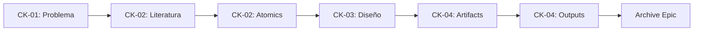

# Requirements Specification

<!-- HKM Metadata -->
---
hkm_type: source
epistemic_level: source
title: "Requirements - [TÍTULO_ÉPICA]"
created: YYYY-MM-DD
updated: YYYY-MM-DD
tags: [requirements, research, specification]
---

## 1. Contexto

### 1.1. Problema Central

[Descripción detallada del problema que se busca resolver. Debe alinearse con `problem_statement` en ISSUE.yaml]

### 1.2. Justificación

- **¿Por qué es importante?**: [Explicar relevancia]
- **¿Qué se ha hecho antes?**: [Estado del arte breve]
- **¿Qué vacío llena esta investigación?**: [Gap identificado]

### 1.3. Alcance

**Dentro del alcance:**
- [Elemento 1]
- [Elemento 2]
- [Elemento 3]

**Fuera del alcance:**
- [Elemento 1]
- [Elemento 2]

## 2. Objetivos

### 2.1. Objetivo General

[Un objetivo claro y medible que responde a problem_statement]

### 2.2. Objetivos Específicos

1. **OE-01**: [Objetivo específico 1 - SMART]
2. **OE-02**: [Objetivo específico 2 - SMART]
3. **OE-03**: [Objetivo específico 3 - SMART]

### 2.3. Criterios de Éxito

Mapeo a `success_criteria` en ISSUE.yaml:

| ID | Criterio | Métrica | Valor Objetivo |
|----|----------|---------|----------------|
| CS-01 | [Criterio 1] | [Métrica cuantitativa] | [Valor específico] |
| CS-02 | [Criterio 2] | [Métrica cualitativa] | [Descripción validación] |
| CS-03 | [Criterio 3] | [Métrica temporal] | [Timeline] |

## 3. Requirements Funcionales

### 3.1. Investigación (01-literature + 02-atomics)

| ID | Requirement | Prioridad | Checkpoint |
|----|-------------|-----------|------------|
| RF-01 | Identificar [N] fuentes primarias sobre [tema] | P0 | CK-02 |
| RF-02 | Extraer [N] conceptos atómicos con SECI | P0 | CK-02 |
| RF-03 | Sintetizar conceptos en [N] notas Zettelkasten | P1 | CK-02 |

### 3.2. Análisis (03-workbook)

| ID | Requirement | Prioridad | Checkpoint |
|----|-------------|-----------|------------|
| RF-04 | Realizar análisis comparativo de [N] enfoques | P0 | CK-03 |
| RF-05 | Diseñar arquitectura/modelo con diagramas | P0 | CK-03 |
| RF-06 | Validar diseño con [criterio específico] | P1 | CK-03 |

### 3.3. Artifacts (04-artifacts)

| ID | Requirement | Prioridad | Checkpoint |
|----|-------------|-----------|------------|
| RF-07 | Implementar [artefacto 1: código/modelo/prototipo] | P0 | CK-04 |
| RF-08 | Documentar [artefacto 2: arquitectura/diseño] | P1 | CK-04 |
| RF-09 | Validar artefactos con [test/experimento] | P0 | CK-04 |

### 3.4. Outputs (05-outputs)

| ID | Requirement | Prioridad | Checkpoint |
|----|-------------|-----------|------------|
| RF-10 | Producir [output 1: paper/reporte/articulo] | P0 | CK-04 |
| RF-11 | Generar visualizaciones/diagramas finales | P1 | CK-04 |
| RF-12 | Preparar presentación/demo final | P2 | CK-04 |

## 4. Requirements No Funcionales

### 4.1. Calidad y Validación (P5)

| ID | Requirement | Criterio de Aceptación |
|----|-------------|------------------------|
| RNF-01 | **Trazabilidad (P6)**: Todos los conceptos en 02-atomics/ deben tener fuente en 01-literature/ | validate-triple-coherence.py pasa sin errores |
| RNF-02 | **HKM Compliance (P3)**: Todos los archivos .md tienen headers HKM válidos | validate-metadata.py pasa sin errores |
| RNF-03 | **Checkpoints (P5)**: Cada checkpoint requiere validación explícita antes de avanzar | CK-0X.completed = true en ISSUE.yaml |

### 4.2. Reproducibilidad

| ID | Requirement | Criterio de Aceptación |
|----|-------------|------------------------|
| RNF-04 | **Versionado**: Epic versionado en Git con tags semánticos | Git tag v1.0.0 al completar CK-04 |
| RNF-05 | **Documentación**: README.md con setup completo y guía de uso | Otro investigador puede replicar en <2h |
| RNF-06 | **Datos**: Fuentes en references/ o links permanentes | 100% de referencias accesibles |

### 4.3. Autopoiesis (P2)

| ID | Requirement | Criterio de Aceptación |
|----|-------------|------------------------|
| RNF-07 | **Lessons Learned**: Documentar [N] aprendizajes en 06-lessons/ | Mínimo 1 lesson por checkpoint |
| RNF-08 | **Template Evolution**: Sugerir mejoras al template autopoietic | 06-lessons/template-improvements.md creado |

## 5. Constraints y Dependencias

### 5.1. Constraints Técnicos

- **Tecnologías**: [Stack específico: Python 3.11+, Neo4j 5.15+, LlamaIndex 0.9+]
- **Plataformas**: [Docker, VS Code, GitHub]
- **Recursos**: [Hardware: RAM, GPU; Servicios: APIs, licencias]

### 5.2. Dependencias Externas

| ID | Dependencia | Tipo | Riesgo | Mitigación |
|----|-------------|------|--------|------------|
| DEP-01 | [API/Servicio externo] | API | Alto | Cachear responses |
| DEP-02 | [Dataset/Corpus] | Datos | Medio | Backup local |
| DEP-03 | [Librería específica] | Software | Bajo | Pin version |

### 5.3. Dependencias Internas

- **HKM Standard**: `docs/manifiesto/02-arquitectura/03-templates-hkm.md`
- **DAATH-ZEN Format**: `archive/tasks.md` (95% coherence)
- **Hybrid Stack**: `apps/research-neo4j-llamaindex-architecture/01-design/`
- **Sync Scripts**: `packages/daath-toolkit/validators/`, `scripts/`

## 6. Stakeholders y Roles

| Rol | Nombre | Responsabilidad |
|-----|--------|-----------------|
| **MELQUISEDEC** (Problema) | [Investigador Principal] | Define problema y valida CK-01 |
| **HYPATIA** (Investigación) | [Investigador/IA] | Recopila literatura, crea atomics (CK-02) |
| **SALOMON** (Análisis) | [Analista/Arquitecto] | Diseña solución, valida CK-03 |
| **MORPHEUS** (Implementación) | [Desarrollador/IA] | Implementa artifacts (CK-04) |
| **ALMA** (Publicación) | [Editor/Comunicador] | Produce outputs (CK-04) |
| **DAATH** (Reflexión) | [Todos] | Documenta lessons (06-lessons/) |

## 7. Timeline y Milestones

### 7.1. Fases y Checkpoints

| Fase | Checkpoint | Duración Estimada | Entregables |
|------|------------|-------------------|-------------|
| **1. Problema** | CK-01 | [N días] | requirements.md, problem-statement.md |
| **2. Investigación** | CK-02 | [N días] | [N] sources, [N] atomics |
| **3. Análisis** | CK-03 | [N días] | design.md, arquitectura.md, análisis.md |
| **4. Implementación+Outputs** | CK-04 | [N días] | artifacts/, outputs/, lessons/ |

### 7.2. Critical Path

## 8. Risks y Mitigaciones

| ID | Riesgo | Probabilidad | Impacto | Mitigación |
|----|--------|--------------|---------|------------|
| R-01 | [Riesgo técnico 1] | Alta/Media/Baja | Alto/Medio/Bajo | [Estrategia específica] |
| R-02 | [Riesgo de alcance 2] | Media | Alto | [Estrategia específica] |
| R-03 | [Riesgo de recursos 3] | Baja | Medio | [Estrategia específica] |

## 9. Acceptance Criteria

### 9.1. Definition of Done (DoD)

Un epic está **DONE** cuando:

- [ ] Todos los checkpoints CK-01 a CK-04 están completados
- [ ] Todos los requirements funcionales P0 están implementados
- [ ] validate-triple-coherence.py pasa sin errores
- [ ] validate-metadata.py pasa sin headers HKM inválidos
- [ ] Al menos 1 lesson documentado en 06-lessons/ por checkpoint
- [ ] Git tag vX.Y.Z creado con archive-epic.sh
- [ ] README.md con instrucciones de reproducción
- [ ] Epic sincronizado a Neo4j (sync-hkm-to-neo4j.py)

### 9.2. Review y Approval

**Revisor**: [Nombre]
**Fecha Planificada**: [YYYY-MM-DD]
**Aprobación**: [ ] Sí / [ ] No / [ ] Needs Revision

---

## Referencias

- **HKM Standard**: [docs/manifiesto/02-arquitectura/03-templates-hkm.md](../../docs/manifiesto/02-arquitectura/03-templates-hkm.md)
- **DAATH-ZEN Format**: [archive/tasks.md](../../archive/tasks.md)
- **Principios P1-P7**: [docs/manifiesto/01-fundamentos/](../../docs/manifiesto/01-fundamentos/)
- **Hybrid Stack**: [apps/research-neo4j-llamaindex-architecture/01-design/](../../apps/research-neo4j-llamaindex-architecture/01-design/)

---

**Última actualización**: YYYY-MM-DD
**Versión**: 1.0.0
**Estado**: Draft → Review → Approved
