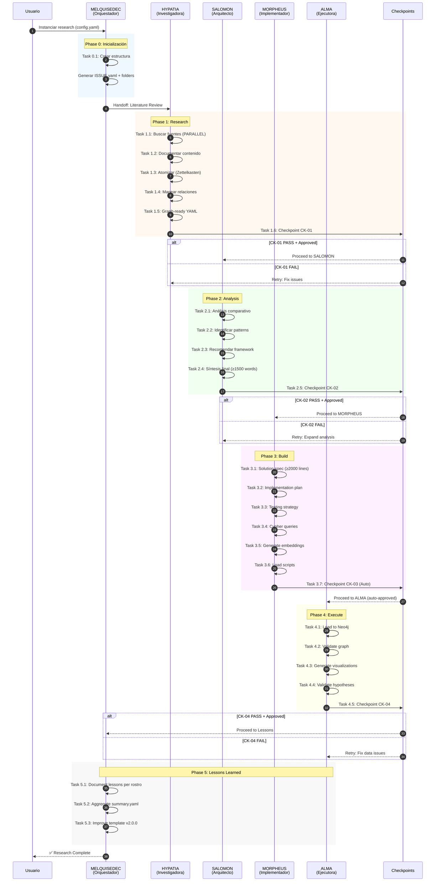
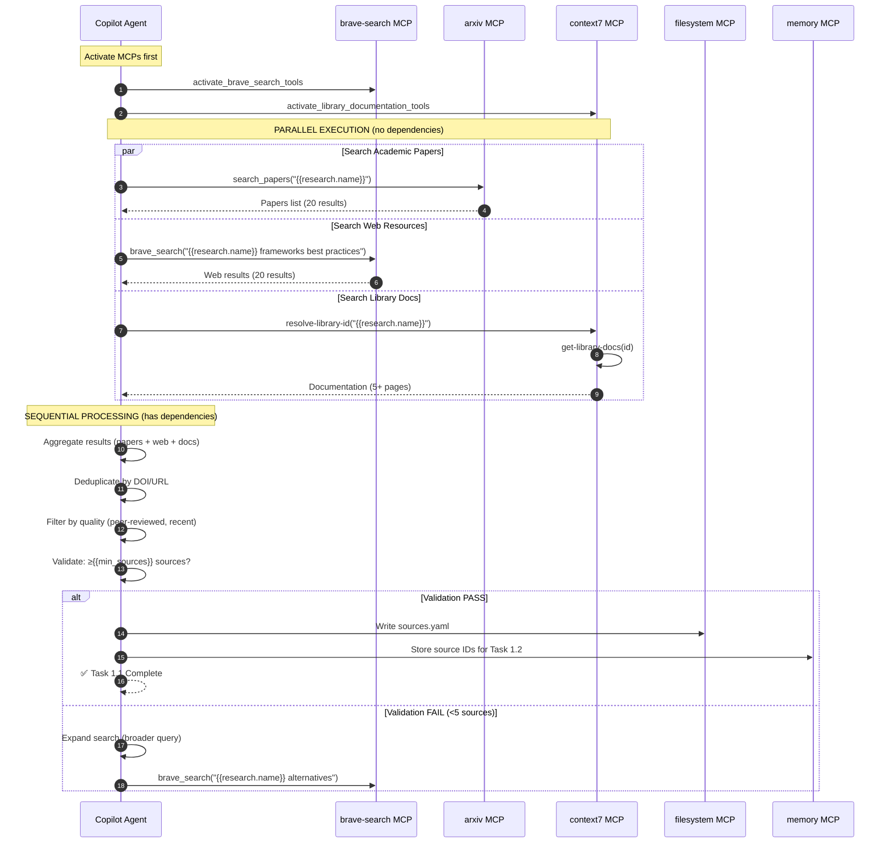
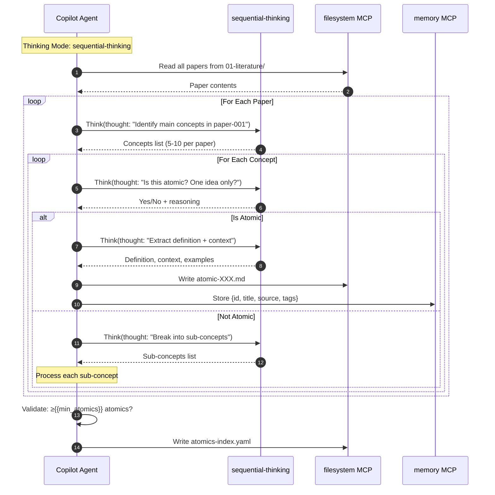
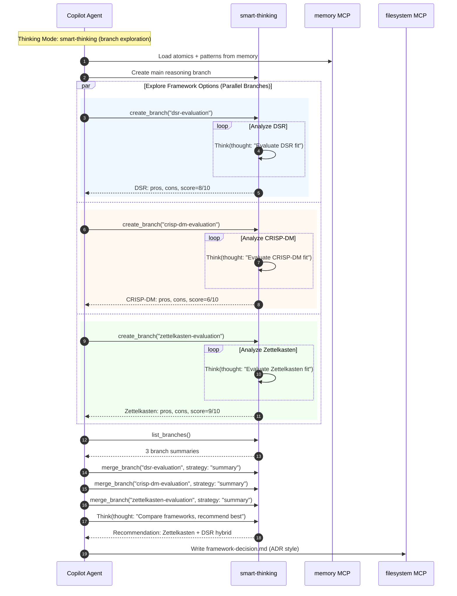
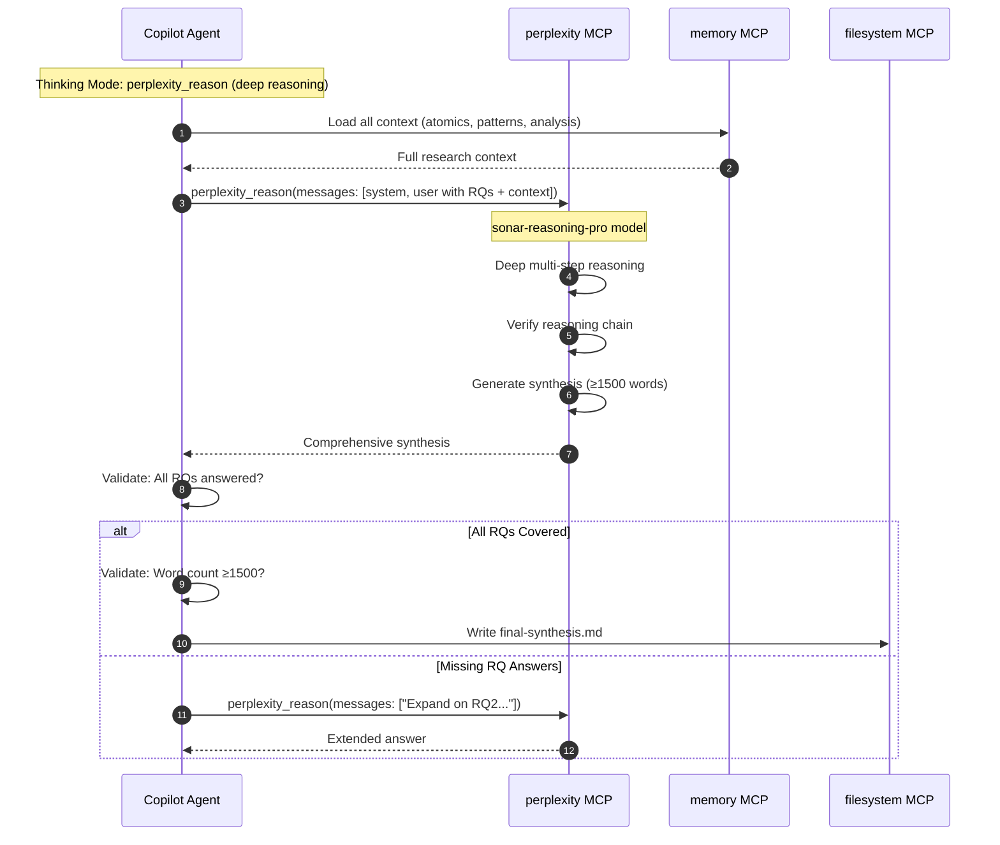
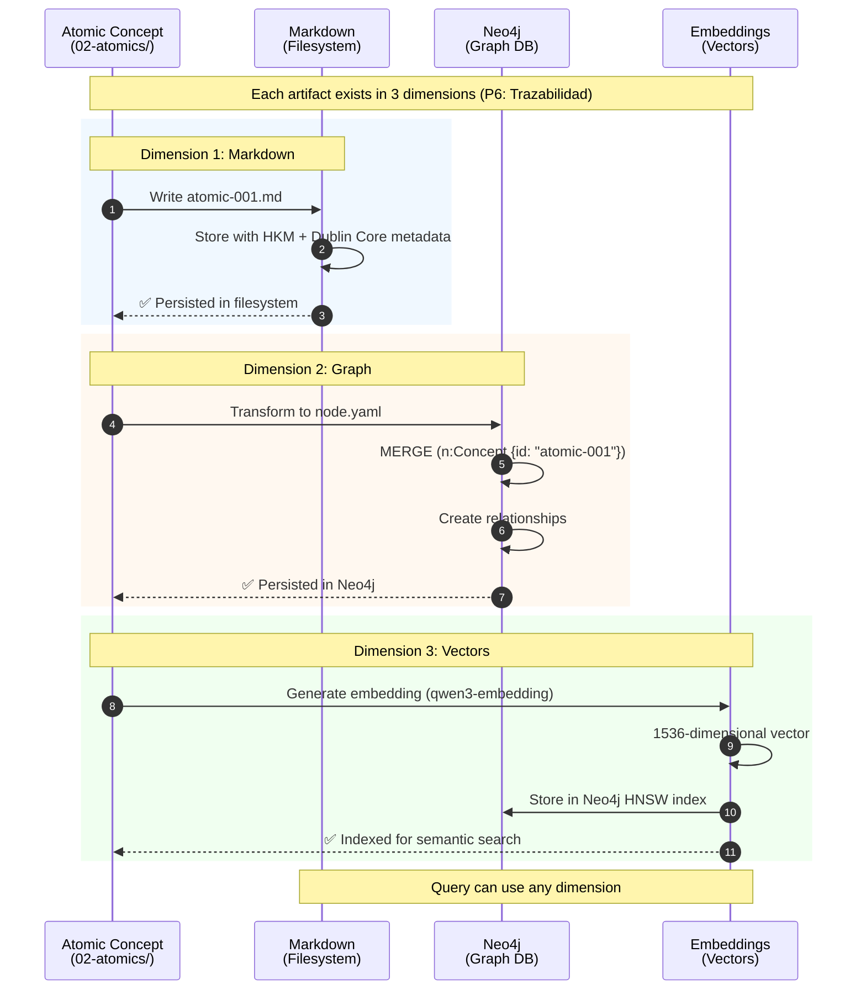
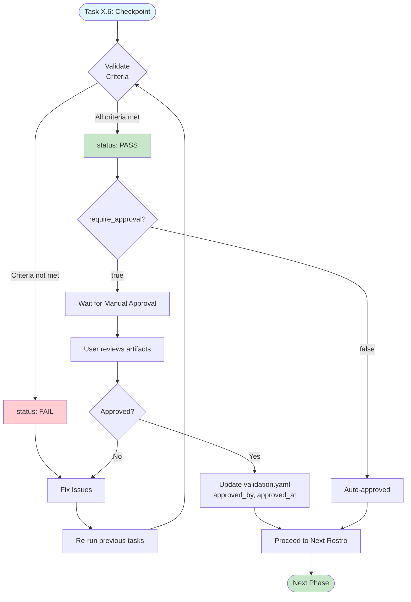
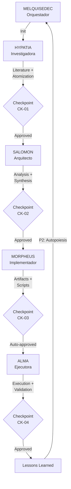

# Spec-Issue Template: Research Methodology

> **Template ID**: `research-methodology-template`
> **Version**: `1.1.0`
> **Created**: `2025-01-20`
> **Updated**: `2026-01-09`
> **Owner**: MELQUISEDEC
> **Purpose**: Generic, configurable spec-issue for formal research methodology investigations

---

## 🎯 Propósito

Esta plantilla implementa un **spec-issue configurable** para realizar investigaciones formales de **revisión de contenido científico/académico**, aplicando los principios MELQUISEDEC:

- ✅ **P1 - Síntesis Metodológica**: Combina DSR + Zettelkasten + Triple Output (no inventamos, adaptamos)
- ✅ **P2 - Autopoiesis**: Lessons learned automáticos → v2.0.0 del template
- ✅ **P3 - Issue-Driven**: Todo inicia con ISSUE.yaml (HKM + Dublin Core metadata)
- ✅ **P5 - Validación Continua**: 4 checkpoints con criterios explícitos
- ✅ **P6 - Trazabilidad Explícita**: Triple output (MD + Neo4j Graph + Vectors)
- ✅ **P7 - Recursión Fractal**: La estructura se repite a diferentes escalas

**¿Qué problema resuelve?**

- Unifica DSR (Design Science Research) con gestión formal de contenidos atómicos
- Automatiza la extracción de conocimiento trazable desde literatura académica
- Genera artefactos ejecutables (scripts, Cypher queries, embeddings)
- Crea grafo semántico en Neo4j con vectores para búsqueda semántica

---

## 🏗️ Arquitectura Híbrida

```
DSR Structure (phases)     +  Document Management (atoms)  →  Triple Output
├─ 00-problem              ├─ 01-literature                ├─ Markdown (filesystem)
├─ 01-design               ├─ 02-atomics                   ├─ Graph (Neo4j)
├─ 02-build                ├─ 03-workbook                  └─ Vectors (embeddings)
├─ 03-evaluate             ├─ 04-artifacts
└─ 04-lessons              ├─ 05-evaluate
                           └─ 06-lessons
```

---

## 📂 Contenido del Template

```
research-methodology-template/
├── README.md                    ← This file (entry point + diagrams)
├── config.yaml                  ← Single source of truth (parametrización)
├── requirements.md              ← WHAT + WHY (requirements phase)
├── design.md                    ← HOW (architecture design + MCP patterns)
├── tasks.md                     ← Detailed task breakdown (27 tasks) + MCP Workflows
└── _meta/                       ← Metadatos y assets de infraestructura
    ├── orchestrator.md          ← Executable workflow automation
    ├── templates/               ← Base file templates
    │   ├── ISSUE.yaml.template
    │   ├── atomic-concept.md.template
    │   ├── relationships.yaml.template
    │   └── checkpoint-validation.yaml.template
    ├── Implementation Logs/     ← Per-task execution logs
    └── lessons-learned/         ← Lessons documentation
```

---

## 📊 Diagramas de Arquitectura

### Workflow Completo: 5 Rostros DAATH-ZEN



### MCP Workflow: Task 1.1 (Parallel Search)



### MCP Workflow: Task 1.3 (Atomization with Sequential Thinking)



### MCP Workflow: Task 2.3 (Framework Recommendation with Branch Exploration)



### MCP Workflow: Task 2.4 (Final Synthesis with Deep Reasoning)



### Triple Output Pipeline



### Checkpoint Decision Flow



---

## 🚀 Quick Start: Instanciar una Investigación

### Paso 1: Copiar template y parametrizar

```powershell
# Copiar template a nueva investigación
$NewResearchName = "dsr"  # Cambiar por tu investigación
$TemplatePath = ".\.spec-workflow\specs\research-methodology-template"
$NewSpecPath = ".\.spec-workflow\specs\research-$NewResearchName"

Copy-Item -Recurse $TemplatePath $NewSpecPath
```

### Paso 2: Editar config.yaml

Abrir [config.yaml](config.yaml) y cambiar:

```yaml
research:
  name: "dsr"                            # ← ID único (slug)
  full_name: "Design Science Research"   # ← Nombre completo
  type: "formal-review"                  # ← formal-review | quick-scan | deep-dive
  version: "1.0.0"
  created: "2026-01-09"                  # ← Fecha de inicio
  owner: "MELQUISEDEC"

scope:
  research_questions:
    - "RQ1: ¿Qué es Design Science Research y cómo se estructura?"
    - "RQ2: ¿Cuáles son los artefactos típicos de DSR?"
    - "RQ3: ¿Cómo se evalúan artefactos en DSR?"

  domains:
    - "research-methodology"
    - "design-science"
    - "software-engineering"

  hypothesis:
    - "H1: DSR puede integrarse con Zettelkasten para gestión atómica"
    - "H2: Neo4j puede representar relaciones DSR efectivamente"
```

### Paso 3: Ejecutar workflow

```powershell
# Ver tasks.md para workflow MCP detallado por task
code ".\.spec-workflow\specs\research-$NewResearchName\tasks.md"

# Ejecutar Task 0.1 con orchestrator
# Ver _meta/orchestrator.md para comandos PowerShell
```

---

## 📋 Workflow DAATH-ZEN (5 Rostros)



### Resumen por Rostro

| Rostro | Phase | Tasks | Thinking Mode | Key MCPs | Checkpoint |
|--------|-------|-------|---------------|----------|------------|
| **MELQUISEDEC** | 0-Init | 0.1 | None | filesystem | None |
| **HYPATIA** | 1-Research | 1.1-1.6 | sequential-thinking | brave, arxiv, context7 | CK-01 (manual) |
| **SALOMON** | 2-Analysis | 2.1-2.5 | smart-thinking | memory, perplexity | CK-02 (manual) |
| **MORPHEUS** | 3-Build | 3.1-3.7 | None | neo4j, ollama | CK-03 (auto) |
| **ALMA** | 4-Execute | 4.1-4.5 | None | neo4j | CK-04 (manual) |
| **ALL** | 5-Lessons | 5.1-5.3 | None | filesystem | None |

---

## 🔧 MCP Orchestration Patterns

### Pattern 1: Parallel Search
**Use case**: Task 1.1 (Literature discovery)
**MCPs**: brave-search + arxiv + context7 (parallel)
**Strategy**: Execute all searches simultaneously, aggregate results

### Pattern 2: Sequential Transform
**Use case**: Task 1.3 (Atomization)
**Thinking**: sequential-thinking
**Strategy**: Process each paper sequentially, extract atomics step by step

### Pattern 3: Branch Exploration
**Use case**: Task 2.3 (Framework recommendation)
**Thinking**: smart-thinking with branches
**Strategy**: Create parallel reasoning branches, merge summaries

### Pattern 4: Deep Reasoning
**Use case**: Task 2.4 (Final synthesis)
**Thinking**: perplexity_reason
**Strategy**: Multi-step reasoning with verification

### Pattern 5: Load & Verify
**Use case**: Task 4.1-4.2 (Neo4j ingestion)
**MCPs**: neo4j (write → verify)
**Strategy**: MERGE (idempotent), then validate integrity

---

## 🔍 Example: DSR Investigation

**Scenario**: Investigar "Design Science Research" para adoptar en MELQUISEDEC.

### Estructura generada

```
apps/research-dsr/
├── ISSUE.yaml                           ← HKM + Dublin Core metadata
├── README.md
├── 00-problem/
│   └── problem-statement.md
├── 01-literature/
│   ├── sources.yaml                     ← HYPATIA: 10+ fuentes
│   └── content/
│       ├── paper-001-hevner2004.md
│       └── paper-002-peffers2007.md
├── 02-atomics/
│   ├── concepts/
│   │   ├── atomic-001-dsr-definition.md
│   │   ├── atomic-002-dsr-phases.md
│   │   └── atomic-003-build-artifact.md
│   ├── relationships.yaml
│   └── graph-ready/
│       ├── nodes.yaml
│       └── relationships.yaml
├── 03-workbook/
│   ├── comparative-analysis.md
│   ├── workflow-patterns.md
│   ├── final-synthesis.md               ← ≥1500 words
│   └── framework-decision.md            ← ADR-style
├── 04-artifacts/
│   ├── scripts/
│   │   ├── load_to_neo4j.py
│   │   └── generate_embeddings.py
│   ├── cypher/
│   │   ├── create_nodes.cypher
│   │   └── create_relationships.cypher
│   ├── embeddings/
│   │   └── vectors.json
│   └── solution-spec.md                 ← ≥2000 lines
├── 05-evaluate/
│   ├── graph-validation.md
│   ├── hypothesis-validation.md
│   └── visualizations/
├── 06-lessons/
│   └── summary.yaml
└── .melquisedec/
    ├── hypatia_validation.yaml
    ├── salomon_validation.yaml
    ├── morpheus_validation.yaml
    └── alma_validation.yaml
```

---

## 🎛️ Configuración Avanzada

### Quality Metrics (config.yaml)

```yaml
quality:
  metrics:
    min_sources: 5                      # Mínimo fuentes para HYPATIA
    min_peer_reviewed: 3                # Mínimo papers peer-reviewed
    min_atomics: 20                     # Mínimo atomic concepts
    min_patterns: 5                     # Mínimo patterns identificados
    min_synthesis_words: 1500           # Mínimo palabras en síntesis
    min_solution_spec_lines: 2000       # Mínimo líneas en solution-spec
    min_test_coverage: 80               # Mínimo % test coverage
```

### MCP Tools Required (config.yaml)

```yaml
required_mcps:
  base:
    - neo4j              # Graph database
    - memory             # Context management
    - filesystem         # File operations

  specialized:
    - brave-search       # Web search
    - arxiv              # Academic papers
    - context7           # Library docs
    - perplexity         # Deep research

  thinking:
    - sequential-thinking  # Step-by-step analysis
    - smart-thinking       # Branch exploration

  optional:
    - github-search      # Code examples
    - markitdown         # Format conversion
```

---

## 🧪 Testing & Validation

### Task-level Validation

Cada task en [tasks.md](tasks.md) incluye:
- **MCP Workflow Strategy**: Thinking mode, parallel vs sequential, activations
- **Success Criteria**: Condiciones explícitas para PASS
- **Validation**: Comandos PowerShell para verificar output

---

## 📚 Documentation Reference

| File | Purpose | Audience |
|------|---------|----------|
| [config.yaml](config.yaml) | Single source of truth (parametrization) | All rostros |
| [requirements.md](requirements.md) | WHAT + WHY (requirements phase) | Stakeholders |
| [design.md](design.md) | HOW (architecture design + MCP patterns) | Developers |
| [tasks.md](tasks.md) | Detailed task breakdown + MCP workflows | Executors |
| [_meta/orchestrator.md](_meta/orchestrator.md) | Executable workflow automation | Operators |
| **README.md** (this file) | Usage guide + architecture diagrams | All users |

---

## 🔄 Autopoiesis (P2)

**Mejora Continua del Template**:

1. Cada investigación genera lessons learned (Task 5.1)
2. Lessons agregadas en `summary.yaml` (Task 5.2)
3. Template v2.0.0 incorpora mejoras (Task 5.3)

---

## 📞 Support

- **Issues**: Usar GitHub Issues del repositorio
- **Docs**: Ver `docs/guides/` para guías adicionales
- **Principios**: `docs/manifiesto/01-fundamentos/04-principios-fundacionales.md`

---

**Template Version**: 1.1.0
**Last Updated**: 2026-01-09
**Maintainer**: MELQUISEDEC
**Status**: ✅ Production Ready
