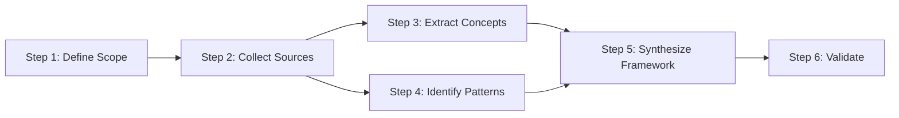

# 3-steps/ - Methodology Steps and Procedures

## Purpose

This folder contains the step-by-step breakdown of how to execute the methodology. Each step should be actionable, with clear prerequisites, deliverables, and validation criteria.

## Naming Convention

Use format: `step-{number}-{action}.md`

Examples:
- `step-001-define-scope.md`
- `step-002-collect-sources.md`
- `step-003-extract-concepts.md`

## Step Template

```markdown
---
step_id: "{number}"
step_name: "{Action} + {Object} + {Context}"
order: {execution order number}
duration: "{hours} hours"
prerequisites: ["step-{n}", "resource-x"]
deliverables: ["output-1", "output-2"]
validates: ["extract-{n}", "canvas-{m}"]
---

# Step {Number}: {Action} + {Object} + {Context}

## Purpose

{Why this step exists - what problem it solves or knowledge it creates}

## Prerequisites

**Required Inputs:**
- {Input 1}: {From where}
- {Input 2}: {From where}

**Required Knowledge:**
- Understanding of {concept from 2-extracts/}
- Familiarity with {tool or technique}

**Required Tools:**
- {Tool 1} - {Purpose}
- {Tool 2} - {Purpose}

## Procedure

### 1. {Sub-task 1}

{Detailed instructions for first sub-task}

```bash
# Example command if applicable
command --flag value
```

**Expected Output:** {What you should see}

### 2. {Sub-task 2}

{Detailed instructions for second sub-task}

**Decision Point:** If {condition}, then {action A}, else {action B}

### 3. {Sub-task 3}

{Detailed instructions for third sub-task}

**Quality Check:** Verify {criterion}

## Deliverables

1. **{Deliverable 1}**
   - Location: `{path/to/file}`
   - Format: {file format}
   - Content: {what it contains}

2. **{Deliverable 2}**
   - Location: `{path/to/file}`
   - Format: {file format}
   - Content: {what it contains}

## Validation

### Success Criteria

- [ ] {Criterion 1} - {How to verify}
- [ ] {Criterion 2} - {How to verify}
- [ ] {Criterion 3} - {How to verify}

### Validation Commands

```bash
# Command to verify deliverable 1
test-command deliverable-1.txt

# Command to verify deliverable 2
validate-tool --check deliverable-2.yaml
```

### Expected Results

{What validation should show if step completed correctly}

## Common Issues

### Issue 1: {Problem}
**Symptoms:** {What you'll see}
**Cause:** {Why it happens}
**Solution:** {How to fix}

### Issue 2: {Problem}
**Symptoms:** {What you'll see}
**Cause:** {Why it happens}
**Solution:** {How to fix}

## Time Estimate

- **Minimum:** {hours} hours (if all goes well)
- **Expected:** {hours} hours (realistic estimate)
- **Maximum:** {hours} hours (if complications arise)

## Related

- **Concepts:** `extract-{n}`, `extract-{m}` (from 2-extracts/)
- **Visualizations:** `canvas-{x}.md` (from 4-canvas/)
- **Next Step:** `step-{number+1}-{action}.md`
- **Parallel Steps:** `step-{other}-{action}.md` (can be done simultaneously)

## Notes

{Any additional context, tips, or warnings}

## Example Execution

{Walk through a concrete example of executing this step}

**Input:** {Starting state}

**Actions:**
1. {What was done}
2. {What was done}
3. {What was done}

**Output:** {Ending state}

**Time Taken:** {actual hours} hours
```

## Best Practices

1. **Actionable language** - Use verbs (Define, Collect, Analyze, Create)
2. **Clear prerequisites** - Don't assume prior knowledge
3. **Explicit deliverables** - Specify formats and locations
4. **Validation criteria** - How to know when done
5. **Time estimates** - Include min/expected/max
6. **Error handling** - Document common issues and solutions
7. **Examples** - Concrete walkthroughs help understanding

## Step Sequence

Steps should be ordered logically:

1. **Initialization steps** - Setup, scope definition, resource gathering
2. **Research steps** - Literature review, concept extraction
3. **Analysis steps** - Pattern identification, relationship mapping
4. **Synthesis steps** - Framework creation, documentation
5. **Validation steps** - Quality checks, peer review
6. **Publication steps** - Finalization, distribution

## Dependencies

Show dependencies between steps:



Include this diagram in `4-canvas/workflow-dependencies.md`

## Target: 5-8 Major Steps

Break methodology into manageable chunks:
- Not too granular (50 micro-steps = overwhelming)
- Not too coarse (2 mega-steps = unclear)
- Aim for 5-8 major steps, each 2-6 hours

## Cross-Referencing

Each step should reference:
- **Extracts** (2-extracts/): Concepts used in this step
- **Canvas** (4-canvas/): Visual representations of this step
- **Tasks** (tasks/): Atomic tasks implementing this step
- **Outputs** (6-outputs/): Where deliverables go in final spec

## Validation Checklist

Before moving to 4-canvas/:
- [ ] All steps have clear purpose
- [ ] Prerequisites documented
- [ ] Deliverables specified with formats
- [ ] Validation criteria defined
- [ ] Time estimates provided
- [ ] Common issues documented
- [ ] Example executions included
- [ ] Dependencies between steps clear
