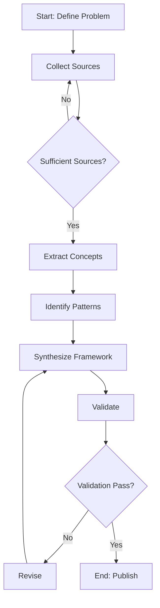
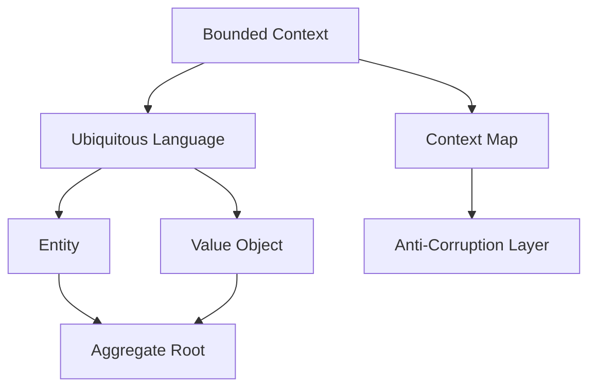
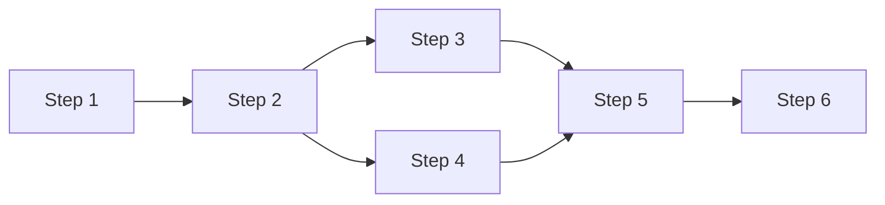
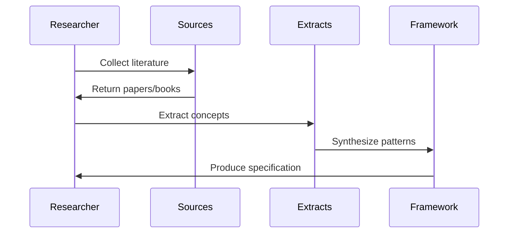
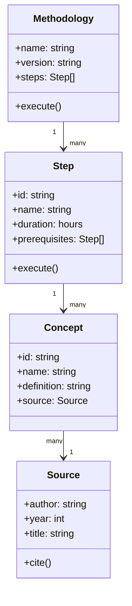
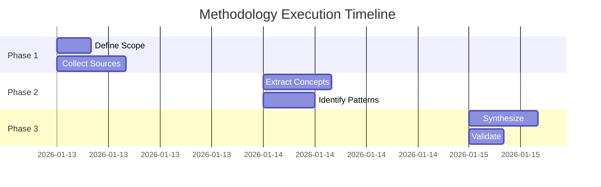

# 4-canvas/ - Visual Models and Diagrams

## Purpose

This folder contains visual representations of the methodology: workflows, conceptual models, process flows, and relationship diagrams. Visualizations make complex concepts accessible and provide at-a-glance understanding.

## File Types

### Mermaid Diagrams (Preferred)
Use Mermaid markdown for version-controllable diagrams:
- Flowcharts
- Sequence diagrams
- Class diagrams
- State diagrams
- Entity-relationship diagrams
- Gantt charts

### Other Formats
- PNG/SVG for hand-drawn sketches
- PlantUML for complex UML diagrams
- Graphviz for graph structures

## Common Visualizations

### 1. Methodology Workflow
**File:** `workflow-overview.md`

Shows end-to-end methodology execution:



### 2. Concept Relationships
**File:** `concept-map.md`

Shows how extracted concepts relate:



### 3. Step Dependencies
**File:** `step-dependencies.md`

Shows execution order and parallelism:



### 4. Data Flow
**File:** `data-flow.md`

Shows how information flows through methodology:



### 5. Conceptual Model
**File:** `conceptual-model.md`

Shows domain entities and relationships:



### 6. Timeline/Gantt
**File:** `timeline.md`

Shows temporal sequencing:



## Best Practices

1. **Keep it simple** - Don't overcomplicate diagrams
2. **Label everything** - Nodes, edges, sections
3. **Use consistent notation** - Same shapes mean same things
4. **Include legends** - Explain symbols and colors
5. **Show directionality** - Arrows indicate flow
6. **Group related items** - Use subgraphs or sections
7. **Provide context** - Title and description for each diagram

## Naming Convention

Use descriptive names:
- `workflow-{aspect}.md` - Process flows
- `concept-{focus}.md` - Concept maps
- `model-{domain}.md` - Domain models
- `sequence-{interaction}.md` - Sequence diagrams
- `state-{entity}.md` - State machines
- `timeline-{phase}.md` - Gantt charts

## Template Structure

```markdown
---
diagram_type: "{flowchart|sequence|class|state|gantt}"
subject: "{What this diagram shows}"
related_steps: ["step-{n}", "step-{m}"]
related_extracts: ["extract-{x}", "extract-{y}"]
---

# {Diagram Title}

## Purpose

{Why this visualization exists and what it clarifies}

## Legend

- **{Shape/Color}**: {Meaning}
- **{Arrow type}**: {Meaning}
- **{Section}**: {Meaning}

## Diagram

```mermaid
{diagram code}
```

## Description

{Narrative explanation of what diagram shows}

### Key Elements

- **{Element 1}**: {What it represents}
- **{Element 2}**: {What it represents}

### Relationships

- **{Relationship 1}**: {What it means}
- **{Relationship 2}**: {What it means}

## Related

- Steps: `3-steps/step-{n}-{action}.md`
- Concepts: `2-extracts/extract-{x}-{concept}.md`
- Other diagrams: `canvas-{other}.md`

## Notes

{Additional context, assumptions, or caveats}
```

## Target: 4-6 Visualizations

Quality over quantity:
- 1 overall workflow
- 1-2 concept maps
- 1 step dependency diagram
- 1-2 domain/data models
- Optional: timeline, sequence diagrams

## Tools

**Online Editors:**
- Mermaid Live Editor: https://mermaid.live/
- PlantUML Online: https://www.plantuml.com/plantuml/
- Graphviz Visual Editor: http://magjac.com/graphviz-visual-editor/

**VS Code Extensions:**
- Markdown Preview Mermaid Support
- PlantUML
- Graphviz Preview

## Validation

Before moving to 5-analysis-connection/:
- [ ] All diagrams render correctly
- [ ] Legends included where needed
- [ ] Consistent notation across diagrams
- [ ] Cross-references to steps and extracts
- [ ] Descriptive text accompanies each diagram
- [ ] Complex diagrams broken into simpler views
