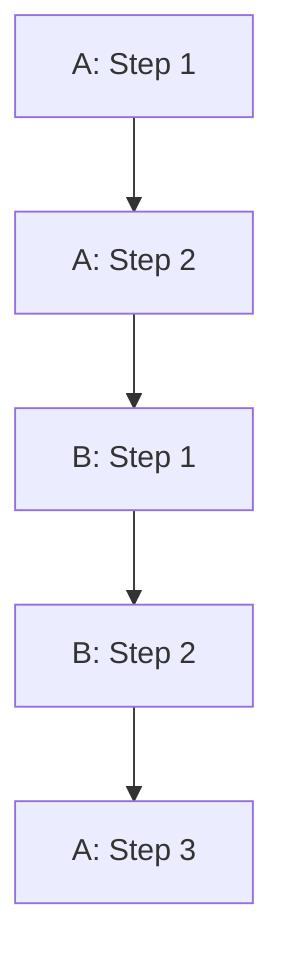

# 5-analysis-connection/ - Integration Analysis with Other Methodologies

## Purpose

This folder contains analysis documents that map this methodology to other related methodologies, creating semantic bridges and identifying concept equivalences. This enables cross-methodology understanding and integration.

**NOTE:** This folder was renamed from `5-aleia-integration/` to better reflect its purpose as analysis-connection between methodologies, not system integration.

## Focus: Semantic Connections

This folder focuses on **conceptual** connections between methodologies:
- Concept equivalences (e.g., "Bounded Context" in DDD ≈ "Module" in others)
- Pattern mappings (similar solutions in different domains)
- Workflow alignments (where methodologies overlap or complement)
- Terminology bridges (different terms for same concepts)

NOT focused on:
- System integration (technical connections between software components)
- Data integration (combining datasets or databases)
- Tool integration (connecting different software tools)

## Common Documents

### 1. Concept Equivalence Matrix
**File:** `equivalence-matrix.md`

Maps concepts from this methodology to concepts in related methodologies:

```markdown
---
methodology_a: "{This Methodology}"
methodology_b: "{Other Methodology}"
---

# Concept Equivalence Matrix

## Purpose

Maps conceptual equivalences between {Methodology A} and {Methodology B} to enable cross-methodology understanding.

## Equivalences

| {Methodology A} | {Methodology B} | Equivalence Type | Notes |
|----------------|----------------|-----------------|-------|
| {Concept A1} | {Concept B1} | Direct | Same definition, different name |
| {Concept A2} | {Concept B2} | Partial | Overlapping but not identical |
| {Concept A3} | - | Unique | No equivalent in B |
| - | {Concept B3} | Unique | No equivalent in A |

## Equivalence Types

**Direct** - Concepts have same definition and usage
**Partial** - Concepts overlap but have differences
**Subset** - One concept is a subset of the other
**Superset** - One concept is broader than the other
**Related** - Concepts are related but distinct
**Unique** - Concept exists in only one methodology

## Examples

### Example 1: {Concept A1} ≈ {Concept B1} (Direct)

**{Methodology A} Definition:**
> {Definition from extract-{n}}

**{Methodology B} Definition:**
> {Definition from other source}

**Analysis:** These concepts are directly equivalent because {reasoning}.

### Example 2: {Concept A2} ⊃ {Concept B2} (Partial)

**{Methodology A} Definition:**
> {Definition}

**{Methodology B} Definition:**
> {Definition}

**Analysis:** A2 partially contains B2, but A2 includes {additional aspects}.

## Usage

When applying {Methodology A}:
- If you know {Concept B1}, treat it as {Concept A1}
- If you're familiar with {Methodology B}, map concepts using this matrix
- Where concepts don't align, be explicit about differences

## Related

- This methodology extracts: `2-extracts/`
- Other methodology documentation: `{path}`
```

### 2. Pattern Crosswalk
**File:** `pattern-crosswalk.md`

Maps patterns between methodologies:

```markdown
# Pattern Crosswalk

## {Methodology A} ↔ {Methodology B}

| Pattern (A) | Pattern (B) | Similarity | Context Differences |
|------------|------------|-----------|-------------------|
| {Pattern A1} | {Pattern B1} | High | {Where they diverge} |
| {Pattern A2} | {Pattern B2} | Medium | {Significant differences} |
| {Pattern A3} | - | - | Unique to A |

## When to Use Which

**Use {Methodology A} when:**
- {Context 1}
- {Context 2}

**Use {Methodology B} when:**
- {Context 1}
- {Context 2}

**Combine A + B when:**
- {Context where both apply}
```

### 3. Workflow Alignment
**File:** `workflow-alignment.md`

Shows where methodology workflows overlap or complement:

```markdown
# Workflow Alignment

## Parallel Steps

| {Methodology A} Step | {Methodology B} Step | Alignment |
|---------------------|---------------------|-----------|
| Step 1: {Action} | Step 1: {Action} | Same |
| Step 2: {Action} | Step 3: {Action} | Reordered |
| Step 3: {Action} | - | Unique to A |

## Sequential Integration



**Usage:** Execute A Steps 1-2, then B Steps 1-2, then A Step 3.

## Complementary Phases

**{Methodology A}** excels at {phase}
**{Methodology B}** excels at {phase}

**Combined approach:** Use A for {phase}, then B for {phase}.
```

### 4. Terminology Bridge
**File:** `terminology-bridge.md`

Dictionary of terms across methodologies:

```markdown
# Terminology Bridge

## Terms from {Methodology A}

### {Term A1}
- **In {Methodology B}:** {Term B1}
- **In {Methodology C}:** {Term C1}
- **Common Ground:** {What they all mean}

### {Term A2}
- **In {Methodology B}:** {Term B2}
- **In {Methodology C}:** No direct equivalent
- **Explanation:** {Why unique}

## Usage

When reading {Methodology A} literature and you know {Methodology B}:
- Translate {Term A1} → {Term B1}
- Translate {Term A2} → {Term B2}

When explaining {Methodology A} to {Methodology B} practitioners:
- Use familiar term {Term B1} when introducing {Term A1}
- Highlight where terminologies diverge
```

### 5. Integration Scenarios
**File:** `integration-scenarios.md`

Concrete scenarios combining methodologies:

```markdown
# Integration Scenarios

## Scenario 1: {Use Case}

**Problem:** {What needs to be solved}

**Combined Approach:**
1. Use {Methodology A} to {accomplish what}
2. Then apply {Methodology B} to {accomplish what}
3. Validate using {Methodology A} criteria

**Rationale:** {Why this combination works}

**Example:** {Concrete walkthrough}

## Scenario 2: {Use Case}

{Similar structure}
```

## Best Practices

1. **Be explicit about differences** - Don't force equivalences that don't exist
2. **Provide examples** - Abstract mappings need concrete illustrations
3. **Show when to use which** - Help practitioners choose
4. **Document non-equivalences** - Unique concepts matter
5. **Cite both sides** - Reference source extracts from both methodologies
6. **Test mappings** - Verify equivalences with practitioners of both methodologies
7. **Update as needed** - Mappings evolve with understanding

## Target Documents

Minimum:
- 1 equivalence matrix (maps core concepts)
- 1 workflow alignment (shows execution overlaps)

Comprehensive:
- Equivalence matrix
- Pattern crosswalk
- Workflow alignment
- Terminology bridge
- Integration scenarios (2-3)

## Related

Should reference:
- **This methodology:** `2-extracts/` (your concepts)
- **This methodology:** `3-steps/` (your workflow)
- **Other methodology:** Documentation or workbook
- **Cross-methodology:** Research papers comparing approaches

## Validation

Before moving to 6-outputs/:
- [ ] At least one equivalence matrix created
- [ ] Equivalences are bidirectional (A→B and B→A)
- [ ] Non-equivalences documented (unique concepts)
- [ ] Examples provided for complex mappings
- [ ] Practical integration guidance included
- [ ] Both methodologies cited properly

## Example: DDD ↔ Ontology Engineering

```markdown
| DDD Concept | Ontology Engineering | Equivalence | Notes |
|------------|---------------------|------------|-------|
| Bounded Context | Ontology Module | Partial | Both define boundaries, but BC is software-focused |
| Ubiquitous Language | Controlled Vocabulary | Partial | Both enforce consistent terminology |
| Aggregate | Concept Hierarchy Root | Related | Similar structural role |
| Entity | Named Individual | Direct | Both represent identifiable things |
| Value Object | Data Property | Partial | Value objects are richer |
```

This type of analysis enables teams familiar with one methodology to quickly understand another through conceptual bridges.
