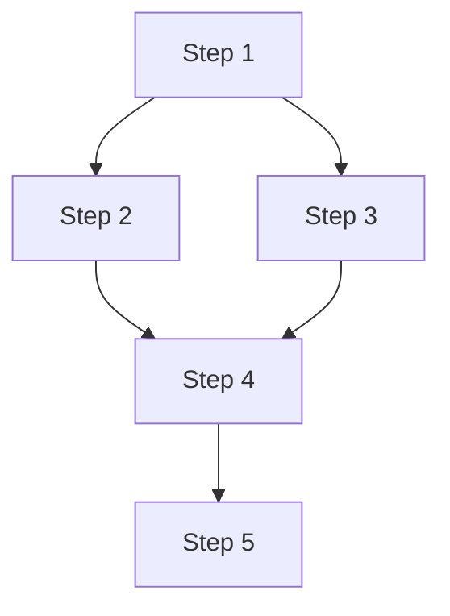

# 6-outputs/ - Final Deliverables

## Purpose

This folder contains the final outputs of the methodology research: the complete SPECIFICATION.yaml, the ROADMAP.md execution plan, and the PROGRESS.md tracking template. These are the artifacts that make the methodology executable.

## Required Files

### 1. {METHODOLOGY-NAME}-SPECIFICATION.yaml

**Purpose:** Complete, structured specification of the methodology

**Template:**

```yaml
---
# ============================================================================
# METHODOLOGY SPECIFICATION
# ============================================================================

metadata:
  title: "{Methodology Name}"
  version: "1.0.0"
  author: "{Agent Name}"
  date: "{YYYY-MM-DD}"
  spec_issue: "SPEC-{number}"
  spec_owner: "{Agent Name}"
  status: "validated"

# ============================================================================
# OVERVIEW
# ============================================================================

overview:
  purpose: |
    {Multi-line description of why this methodology exists and what problems
    it solves. Be specific about the value proposition.}

  scope:
    included:
      - {What is covered}
      - {What is included}
    excluded:
      - {What is NOT covered}
      - {Out of scope items}

  target_audience:
    - {Who uses this methodology}
    - {Prerequisites for users}

  domains:
    - {Application domain 1}
    - {Application domain 2}

# ============================================================================
# FOUNDATION
# ============================================================================

foundation:
  theoretical_basis:
    - source: "{Author Year}"
      concept: "{Key foundational concept}"
      extract: "2-extracts/extract-{number}-{concept}.md"
      description: "{Why this concept is foundational}"

    - source: "{Author Year}"
      concept: "{Another key concept}"
      extract: "2-extracts/extract-{number}-{concept}.md"
      description: "{Why this matters}"

  key_principles:
    - principle: "{Principle 1}"
      description: "{What it means}"
      source: "{Where it comes from}"

    - principle: "{Principle 2}"
      description: "{What it means}"
      source: "{Where it comes from}"

# ============================================================================
# METHODOLOGY STEPS
# ============================================================================

steps:
  - id: "step-001"
    name: "{Action} + {Object} + {Context}"
    description: |
      {Multi-line description of what happens in this step and why it's
      necessary. Be specific about the transformation that occurs.}

    inputs:
      - name: "{Input 1}"
        type: "{document|data|resource}"
        source: "{Where it comes from}"
        required: true

      - name: "{Input 2}"
        type: "{document|data|resource}"
        source: "{Where it comes from}"
        required: false

    outputs:
      - name: "{Output 1}"
        type: "{document|data|resource}"
        location: "{Where it goes}"
        format: "{file format}"

      - name: "{Output 2}"
        type: "{document|data|resource}"
        location: "{Where it goes}"
        format: "{file format}"

    duration: "{hours} hours"

    procedure:
      file: "3-steps/step-001-{action}.md"
      summary: |
        {Brief summary of procedure - full details in step file}

    validation:
      criteria:
        - "{Validation criterion 1}"
        - "{Validation criterion 2}"
      method: "{How to validate}"

    dependencies:
      - "step-{predecessor}"

    related_concepts:
      - "extract-{number}" # from 2-extracts/

    visualization:
      - "4-canvas/workflow-{aspect}.md"

  - id: "step-002"
    # ... (same structure for each step)

# ============================================================================
# CONCEPTS AND PATTERNS
# ============================================================================

concepts:
  core:
    - id: "concept-001"
      name: "{Concept Name}"
      extract: "2-extracts/extract-{number}-{concept}.md"
      category: "core"
      description: "{Brief description}"

    - id: "concept-002"
      name: "{Concept Name}"
      extract: "2-extracts/extract-{number}-{concept}.md"
      category: "core"
      description: "{Brief description}"

  patterns:
    - id: "pattern-001"
      name: "{Pattern Name}"
      extract: "2-extracts/extract-{number}-{pattern}.md"
      category: "pattern"
      description: "{Brief description}"

# ============================================================================
# EXECUTION GUIDANCE
# ============================================================================

execution:
  prerequisites:
    knowledge:
      - "{Required knowledge area 1}"
      - "{Required knowledge area 2}"

    resources:
      - "{Required resource 1}"
      - "{Required resource 2}"

    tools:
      - name: "{Tool 1}"
        purpose: "{What it's used for}"
        optional: false

      - name: "{Tool 2}"
        purpose: "{What it's used for}"
        optional: true

  estimated_duration:
    minimum: "{hours} hours"
    expected: "{hours} hours"
    maximum: "{hours} hours"

  phases:
    - phase: "1"
      name: "{Phase Name}"
      steps: ["step-001", "step-002"]
      duration: "{hours} hours"
      deliverables: ["{deliverable-1}", "{deliverable-2}"]

    - phase: "2"
      name: "{Phase Name}"
      steps: ["step-003", "step-004", "step-005"]
      duration: "{hours} hours"
      deliverables: ["{deliverable-3}"]

  parallel_execution:
    - steps: ["step-002", "step-003"]
      note: "These can be done simultaneously"

# ============================================================================
# VALIDATION
# ============================================================================

validation:
  completeness_criteria:
    - id: "VAL-001"
      description: "{What to check}"
      method: "{How to check}"
      acceptance: "{What constitutes pass}"

    - id: "VAL-002"
      description: "{What to check}"
      method: "{How to check}"
      acceptance: "{What constitutes pass}"

  quality_criteria:
    - metric: "{Quality metric 1}"
      threshold: "{Acceptable value}"

    - metric: "{Quality metric 2}"
      threshold: "{Acceptable value}"

# ============================================================================
# INTEGRATION
# ============================================================================

integration:
  related_methodologies:
    - name: "{Other Methodology}"
      relationship: "{complementary|alternative|prerequisite}"
      integration_doc: "5-analysis-connection/equivalence-matrix.md"
      notes: "{How they relate}"

  cross_methodology_concepts:
    - this_methodology: "{Concept in this methodology}"
      other_methodology: "{Equivalent concept}"
      equivalence_type: "{direct|partial|related}"

# ============================================================================
# REFERENCES
# ============================================================================

references:
  primary_sources:
    - citation: "{Author, A. (Year). Title. Publisher.}"
      file: "1-sources/academic-papers/{filename}.md"
      key_contribution: "{What this source provided}"

    - citation: "{Author, B. (Year). Title. Publisher.}"
      file: "1-sources/books/{filename}.md"
      key_contribution: "{What this source provided}"

  standards:
    - citation: "{ISO/IEEE Standard Number (Year). Title.}"
      file: "1-sources/standards/{filename}.md"
      relevance: "{Why this standard matters}"

  related_work:
    - citation: "{Author, C. (Year). Title. Journal.}"
      relationship: "{How it relates}"

# ============================================================================
# METADATA
# ============================================================================

dublin_core:
  dc:title: "{Methodology Name} Specification"
  dc:creator: "{Agent Name}"
  dc:date: "{YYYY-MM-DD}"
  dc:description: "Complete specification of {methodology name} methodology"
  dc:subject: "methodology, {domain}, {approach}"
  dc:type: "Specification"
  dc:format: "application/yaml"
  dc:identifier: "spec-{methodology-id}"
  dc:language: "en"
  dc:source: "workbooks/wb-{methodology-name}/"

# ============================================================================
# CHANGELOG
# ============================================================================

changelog:
  - version: "1.0.0"
    date: "{YYYY-MM-DD}"
    author: "{Agent Name}"
    changes:
      - "Initial specification"
      - "Based on research in workbook wb-{methodology-name}/"
```

**Best Practices:**
- Complete all sections - no TODOs or placeholders
- Cross-reference all extracts, steps, canvas files
- Provide concrete values, not abstract descriptions
- Include actual time estimates from execution
- Document all sources with proper citations

**Size Target:** 400-600 lines for comprehensive methodology

---

### 2. {METHODOLOGY-NAME}-ROADMAP.md

**Purpose:** Step-by-step execution plan with timeline

**Template:**

```markdown
---
title: "{Methodology Name} Execution Roadmap"
version: "1.0.0"
date: "{YYYY-MM-DD}"
spec_reference: "{METHODOLOGY-NAME}-SPECIFICATION.yaml"
---

# {Methodology Name} Execution Roadmap

## Purpose

This roadmap provides a step-by-step guide for executing the {methodology name} methodology, including timeline, milestones, and dependencies.

## Overview

**Total Duration:** {hours} hours ({days} days at {hours/day} hours per day)

**Phases:** {number}

**Critical Path:** {Identify steps on critical path}

## Prerequisites

Before starting:
- [ ] {Prerequisite 1}
- [ ] {Prerequisite 2}
- [ ] {Prerequisite 3}

Verify using:
```bash
# Verification commands
check-prerequisite-1
check-prerequisite-2
```

## Phase 1: {Phase Name} ({hours} hours)

**Objective:** {What this phase accomplishes}

**Deliverables:**
- {Deliverable 1}
- {Deliverable 2}

### Step 1.1: {Action}

**Duration:** {hours} hours

**Input:**
- {Input 1}
- {Input 2}

**Procedure:**
1. {Sub-step 1}
2. {Sub-step 2}
3. {Sub-step 3}

**Output:**
- {Output 1}: `{path/to/output}`

**Validation:**
```bash
# Validate completion
validate-step-1.1
```

**Success Criteria:**
- [ ] {Criterion 1}
- [ ] {Criterion 2}

**Reference:** See `3-steps/step-001-{action}.md` for details

---

### Step 1.2: {Action}

{Same structure}

---

## Phase 2: {Phase Name} ({hours} hours)

{Same structure as Phase 1}

---

## Milestones

| Milestone | Completion | Criteria |
|-----------|-----------|----------|
| M1: {Name} | End of Phase 1 | {What must be complete} |
| M2: {Name} | End of Phase 2 | {What must be complete} |
| M3: {Name} | End of Phase 3 | {What must be complete} |

## Timeline

```mermaid
gantt
    title {Methodology Name} Execution Timeline
    dateFormat YYYY-MM-DD
    section Phase 1
    Step 1.1       :{start-date}, {duration}h
    Step 1.2       :{start-date}, {duration}h
    section Phase 2
    Step 2.1       :{start-date}, {duration}h
    Step 2.2       :{start-date}, {duration}h
```

## Dependencies



## Resource Requirements

| Phase | Personnel | Tools | Duration |
|-------|-----------|-------|----------|
| Phase 1 | {Agent} | {Tools} | {hours}h |
| Phase 2 | {Agent} | {Tools} | {hours}h |

## Risk Management

### Risk 1: {Risk Description}
- **Probability:** {Low|Medium|High}
- **Impact:** {Low|Medium|High}
- **Mitigation:** {How to prevent or handle}

### Risk 2: {Risk Description}
- **Probability:** {Low|Medium|High}
- **Impact:** {Low|Medium|High}
- **Mitigation:** {How to prevent or handle}

## Success Metrics

| Metric | Target | Measurement |
|--------|--------|-------------|
| {Metric 1} | {Value} | {How measured} |
| {Metric 2} | {Value} | {How measured} |

## Final Deliverable

**Location:** `{path/to/final/output}`

**Contents:**
- {Item 1}
- {Item 2}
- {Item 3}

**Validation:**
```bash
# Final validation
validate-final-deliverable
```

## References

- Specification: `{METHODOLOGY-NAME}-SPECIFICATION.yaml`
- Steps: `3-steps/step-*.md`
- Visualizations: `4-canvas/*.md`
```

---

### 3. {METHODOLOGY-NAME}-PROGRESS.md

**Purpose:** Template for tracking execution progress

**Template:**

```markdown
---
title: "{Methodology Name} Execution Progress"
start_date: "{YYYY-MM-DD}"
spec_reference: "{METHODOLOGY-NAME}-SPECIFICATION.yaml"
roadmap_reference: "{METHODOLOGY-NAME}-ROADMAP.md"
status: "in-progress"
---

# {Methodology Name} Execution Progress

## Execution Summary

| Field | Value |
|-------|-------|
| **Status** | {not-started|in-progress|blocked|completed} |
| **Start Date** | {YYYY-MM-DD} |
| **Target Completion** | {YYYY-MM-DD} |
| **Actual Completion** | {YYYY-MM-DD or TBD} |
| **Executor** | {Agent Name} |
| **Estimated Hours** | {hours} |
| **Actual Hours** | {hours spent} |

## Phase Progress

### Phase 1: {Phase Name}

| Step | Status | Est. | Actual | Completion Date | Notes |
|------|--------|------|--------|----------------|-------|
| 1.1 {Action} | ✅ | 2h | 2.5h | 2026-01-13 | {Any notes} |
| 1.2 {Action} | 🔄 | 4h | 3h | TBD | Currently working |
| 1.3 {Action} | ⏳ | 2h | - | TBD | Not started |

**Phase Status:** 🔄 In Progress (33% complete)

### Phase 2: {Phase Name}

| Step | Status | Est. | Actual | Completion Date | Notes |
|------|--------|------|--------|----------------|-------|
| 2.1 {Action} | ⏳ | 3h | - | TBD | Blocked by 1.3 |
| 2.2 {Action} | ⏳ | 5h | - | TBD | Not started |

**Phase Status:** ⏳ Not Started

## Deliverables Status

| Deliverable | Status | Location | Notes |
|-------------|--------|----------|-------|
| {Deliverable 1} | ✅ | `{path}` | Complete |
| {Deliverable 2} | 🔄 | `{path}` | In progress |
| {Deliverable 3} | ⏳ | `{path}` | Pending |

## Blockers

1. **{Blocker 1}**
   - Impact: {High|Medium|Low}
   - Affects: Step {number}
   - Resolution: {Plan to resolve}
   - Status: {Open|Resolved}

## Lessons Learned

### What Went Well
- {Positive observation 1}
- {Positive observation 2}

### What Could Be Improved
- {Improvement 1}
- {Improvement 2}

### Adjustments Made
- {Adjustment 1}: {Why}
- {Adjustment 2}: {Why}

## Time Tracking

| Date | Hours | Activity | Notes |
|------|-------|----------|-------|
| 2026-01-13 | 2.5h | Step 1.1 | {Notes} |
| 2026-01-13 | 3.0h | Step 1.2 | {Notes} |
| **Total** | **5.5h** | | |

## Validation Results

| Validation | Expected | Actual | Status |
|------------|---------|---------|--------|
| VAL-001 | {Criterion} | {Result} | ✅ Pass |
| VAL-002 | {Criterion} | {Result} | ❌ Fail |

## Next Steps

1. {Next immediate action}
2. {Following action}
3. {Third action}

## Notes

{Any additional observations, context, or important information}
```

---

## Validation Checklist

Before considering workbook complete:

**SPECIFICATION.yaml:**
- [ ] All metadata complete
- [ ] Overview section filled (purpose, scope, audience)
- [ ] Foundation documented (sources, principles)
- [ ] All steps specified with inputs/outputs/duration
- [ ] Concepts section lists all extracts
- [ ] Execution guidance complete (prerequisites, timeline)
- [ ] Validation criteria defined
- [ ] Integration section documents related methodologies
- [ ] References section complete with citations
- [ ] Dublin Core metadata present
- [ ] File size 400-600 lines

**ROADMAP.md:**
- [ ] All phases documented
- [ ] Each step has procedure summary
- [ ] Timeline diagram included
- [ ] Dependencies visualized
- [ ] Milestones defined
- [ ] Risk management section complete
- [ ] Success metrics defined
- [ ] Final deliverable specified

**PROGRESS.md:**
- [ ] Template ready for execution tracking
- [ ] All phases and steps listed
- [ ] Status tracking columns present
- [ ] Deliverables table included
- [ ] Blockers section ready
- [ ] Lessons learned template present
- [ ] Time tracking table ready

## Usage

These three files work together:

1. **SPECIFICATION.yaml** = "What" (the methodology itself)
2. **ROADMAP.md** = "How" (how to execute it)
3. **PROGRESS.md** = "Status" (tracking during execution)

When executing methodology:
1. Read SPECIFICATION.yaml to understand methodology
2. Follow ROADMAP.md to execute step-by-step
3. Update PROGRESS.md as you work

These files serve as the authoritative source for the methodology and should be kept in sync with the rest of the workbook.
