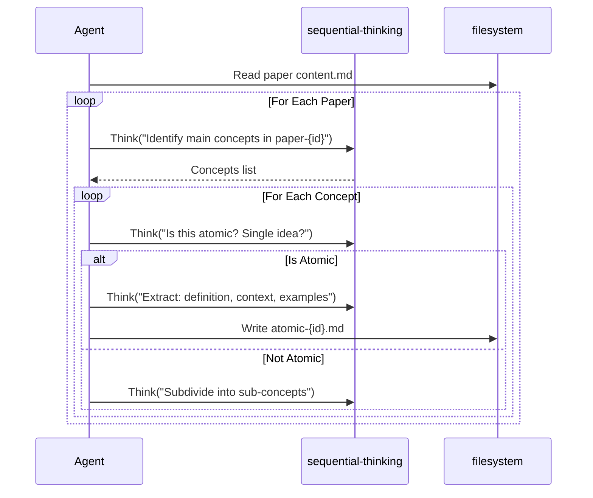
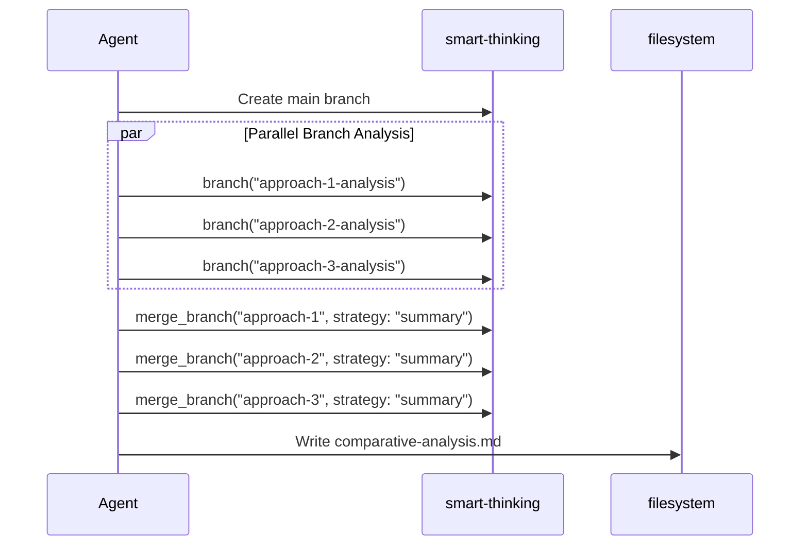

# Tasks: Research Methodology - {{research.full_name}}

> **Spec**: research-methodology-template
> **Version**: 1.1.0
> **Depends on**: [requirements.md](requirements.md) + [design.md](design.md) (Both Approved)
> **Status**: Implementation Phase

---

## 📋 Task Structure Convention

Cada tarea sigue este formato estándar:

```markdown
### X.Y. [Task Name]
- **File**: [target files]
- **Requirements**: REQ-XXX
- **Rostro**: [MELQUISEDEC|HYPATIA|SALOMON|MORPHEUS|ALMA]
- **Lesson**: _meta/Implementation Logs/task-X.Y-{name}.md

#### MCP Workflow Strategy
| Aspect | Value |
|--------|-------|
| **Thinking Mode** | sequential \| smart-thinking \| maxential \| perplexity \| none |
| **Activation** | [MCPs to activate first] |
| **Parallel** | [operations with no dependencies] |
| **Sequential** | [operations with dependencies] |
| **Error Handling** | [fallback strategy] |

#### Prompt
[Executable instructions]

#### Success Criteria
[Validation checklist]
```

---

## 0. MELQUISEDEC - Inicialización (Phase: Setup)

### 0.1. Crear estructura de investigación

- **File**: `apps/research-{{research.name}}/` (all folders)
- **Requirements**: REQ-SETUP-001, REQ-SETUP-002, REQ-SETUP-003
- **Rostro**: MELQUISEDEC (Orquestador)
- **Lesson**: _meta/Implementation Logs/task-0.1-init-structure.md

#### MCP Workflow Strategy

| Aspect | Value |
|--------|-------|
| **Thinking Mode** | none (deterministic task) |
| **Activation** | `filesystem` only |
| **Parallel** | Create all folders simultaneously |
| **Sequential** | 1. Create folders → 2. Write ISSUE.yaml → 3. Write README.md |
| **Error Handling** | If folder exists, skip (idempotent) |

#### Prompt

```
Role: Orquestador MELQUISEDEC
Task: Inicializar estructura completa de investigación

Context:
- Config: .spec-workflow/specs/research-methodology-{{research.name}}/config.yaml
- Output: apps/research-{{research.name}}/

Actions:
1. Create folder structure (from config.yaml outputs.structure):
   - 00-problem/, 01-literature/, 02-atomics/, 03-workbook/
   - 04-artifacts/, 05-evaluate/, 06-lessons/, .melquisedec/, references/

2. Create ISSUE.yaml with HKM + Dublin Core metadata:
   - id: "research-{{research.name}}"
   - title: "{{research.full_name}}"
   - type: "{{research.type}}"
   - research_questions: [from config.yaml]

3. Create README.md with:
   - Research overview
   - Folder structure explanation
   - Link to spec

Restrictions:
- NO modify config.yaml
- Use idempotent operations (mkdir -p equivalent)
```

#### Success Criteria

- [ ] All folders created per config.yaml
- [ ] ISSUE.yaml valid with HKM + Dublin Core
- [ ] README.md with overview
- [ ] .melquisedec/ initialized

---

## 1. HYPATIA - Literature Review & Atomization (Phase: Research)

### 1.1. Identificar fuentes canónicas

- **File**: `apps/research-{{research.name}}/01-literature/sources.yaml`
- **Requirements**: REQ-LIT-001, REQ-LIT-005
- **Rostro**: HYPATIA (Investigadora)
- **Lesson**: _meta/Implementation Logs/task-1.1-identify-sources.md

#### MCP Workflow Strategy

| Aspect | Value |
|--------|-------|
| **Thinking Mode** | none (search task) |
| **Activation** | `activate_brave_search_tools`, `activate_library_documentation_tools` |
| **Parallel** | arxiv + brave-search + context7 (no dependencies between searches) |
| **Sequential** | 1. Parallel search → 2. Aggregate → 3. Deduplicate → 4. Filter → 5. Write |
| **Error Handling** | If <5 sources, expand query with synonyms/alternatives |

```mermaid
sequenceDiagram
    participant A as Agent
    participant Ar as arxiv
    participant Br as brave-search
    participant C7 as context7
    participant FS as filesystem

    par Parallel Search
        A->>Ar: search_papers("{{research.name}}")
        A->>Br: brave_search("{{research.name}} best practices")
        A->>C7: resolve-library-id + get-library-docs
    end

    Ar-->>A: Papers (≤20)
    Br-->>A: Web results (≤20)
    C7-->>A: Docs

    A->>A: Aggregate + Deduplicate + Filter
    A->>FS: Write sources.yaml
```



#### Prompt

```
Role: Investigadora HYPATIA
Task: Identificar ≥{{quality.metrics.min_sources}} fuentes canónicas

Context:
- RQs: {{scope.research_questions}}
- Domains: {{scope.domains}}
- Quality: ≥{{quality.metrics.min_peer_reviewed}} peer-reviewed

Search Strategy:
1. PARALLEL: Execute all searches simultaneously
   - arxiv: "{{research.full_name}}" + related terms
   - brave-search: "{{research.full_name}} frameworks best practices"
   - context7: resolve-library-id for known libraries

2. SEQUENTIAL: Process results
   - Aggregate all results
   - Deduplicate by DOI/URL
   - Filter: peer-reviewed, recent (5 years), high-quality
   - Rank by relevance

Output Format (sources.yaml):
---
sources:
  - id: "paper-001"
    type: "paper"
    title: "Paper Title"
    authors: ["Author 1"]
    year: 2024
    doi: "10.1234/xxx"
    url: "https://..."
    peer_reviewed: true
    relevance: "high"
```

#### Success Criteria

- [ ] sources.yaml created
- [ ] ≥{{quality.metrics.min_sources}} sources listed
- [ ] ≥{{quality.metrics.min_peer_reviewed}} peer-reviewed
- [ ] All URLs verified accessible

---

### 1.2. Documentar contenido de fuentes

- **File**: `apps/research-{{research.name}}/01-literature/{type}/{id}/content.md`
- **Requirements**: REQ-LIT-002, REQ-LIT-003
- **Rostro**: HYPATIA (Investigadora)
- **Lesson**: _meta/Implementation Logs/task-1.2-document-sources.md

#### MCP Workflow Strategy

| Aspect | Value |
|--------|-------|
| **Thinking Mode** | none (extraction task) |
| **Activation** | `activate_web_content_extraction_tools` (firecrawl) |
| **Parallel** | Fetch multiple sources simultaneously (batch of 3) |
| **Sequential** | Per source: 1. Fetch → 2. Convert (markitdown) → 3. Write metadata.yaml → 4. Write content.md |
| **Error Handling** | If fetch fails, log and continue with next source |

#### Prompt

```
Role: Investigadora HYPATIA
Task: Documentar contenido completo de cada fuente

Context:
- Sources: 01-literature/sources.yaml
- Target: 01-literature/{type}/{id}/

Actions per source:
1. Create folder: {type}/{id}/
2. Create metadata.yaml (Dublin Core):
   dc:
     title, creator, date, source, identifier, subject, description, type, format, language
   hkm:
     id, is_a, permalink
3. Fetch content:
   - Papers: Use arxiv or fetch_webpage → markitdown
   - Frameworks: Fetch README + docs
4. Write content.md (clean markdown, no HTML)
5. If citations exist: Write citations.bib

Restrictions:
- Fair use: Only relevant chapters from books
- Maintain attribution and license
- Clean markdown output
```

#### Success Criteria

- [ ] Each source has folder `{type}/{id}/`
- [ ] metadata.yaml with full Dublin Core
- [ ] content.md extracted and clean
- [ ] Source field pointing to original

---

### 1.3. Atomizar conocimiento (Zettelkasten)

- **File**: `apps/research-{{research.name}}/02-atomics/concepts/{concept-id}.md`
- **Requirements**: REQ-ATOM-001, REQ-ATOM-002, REQ-ATOM-005
- **Rostro**: HYPATIA (Investigadora)
- **Lesson**: _meta/Implementation Logs/task-1.3-atomize-knowledge.md

#### MCP Workflow Strategy

| Aspect | Value |
|--------|-------|
| **Thinking Mode** | `sequential-thinking` (step-by-step analysis) |
| **Activation** | `mcp_sequential-th_sequentialthinking` |
| **Parallel** | none (requires deep reading) |
| **Sequential** | Per paper: 1. Read → 2. Think: identify concepts → 3. Think: is atomic? → 4. Write atomic |
| **Error Handling** | If concept not atomic, subdivide |



#### Prompt

```
Role: Investigadora HYPATIA (Zettelkasten specialist)
Task: Extract ≥{{quality.metrics.min_atomics}} atomic concepts

Context:
- Literature: 01-literature/{type}/{id}/content.md
- Method: One concept = one file

Thinking Process (use sequential-thinking):
1. Read each paper thoroughly
2. Think: "What are the main concepts in this paper?"
3. For each concept, Think: "Is this atomic (single idea)?"
4. If atomic: Extract definition, context, examples
5. If not atomic: Subdivide into smaller concepts

Atomic Format:
---
id: "concept-{slug}"
is_a: "concept/{category}"
title: "Concept Title"
source: "{paper|book|framework}-{id}"
tags: ["tag1", "tag2"]
related: ["concept-{id}"]
---

# [Concept Title]

## Definition
[Clear, concise definition]

## Context
[Where/when is it used?]

## Examples
[Concrete examples]

## Related Concepts
- [[concept-id]] - Relationship description

Restrictions:
- Max 500 words per atomic
- No duplicate information
- Every atomic MUST have source field
```

#### Success Criteria

- [ ] ≥{{quality.metrics.min_atomics}} atomics created
- [ ] All have HKM metadata
- [ ] All reference source original
- [ ] IDs unique and descriptive (kebab-case)

---

### 1.4. Mapear relaciones semánticas

- **File**: `apps/research-{{research.name}}/02-atomics/relationships.yaml`
- **Requirements**: REQ-ATOM-003, REQ-ATOM-004
- **Rostro**: HYPATIA (Investigadora)
- **Lesson**: _meta/Implementation Logs/task-1.4-map-relationships.md

#### MCP Workflow Strategy

| Aspect | Value |
|--------|-------|
| **Thinking Mode** | `sequential-thinking` |
| **Activation** | `activate_smart_thinking_memory_tools` (for context) |
| **Parallel** | none (requires holistic view) |
| **Sequential** | 1. Load all atomics → 2. Think: identify pairs → 3. Classify relationship type → 4. Assign weight → 5. Write |
| **Error Handling** | If ambiguous relationship, use RELATES_TO with low weight |

#### Prompt

```
Role: Investigadora HYPATIA (knowledge graph specialist)
Task: Map semantic relationships between atomics

Context:
- Atomics: 02-atomics/concepts/*.md
- Relationship types: PRECEDES, PRODUCES, PART_OF, RELATES_TO, IMPLEMENTS, EXTENDS

Thinking Process:
1. Load all atomic concepts into context
2. Think: "Which concepts are related?"
3. For each pair: Classify relationship type
4. Assign weight (0.0-1.0) based on strength
5. Document rationale

Relationship Types:
- PRECEDES: A comes before B (temporal sequence)
- PRODUCES: A generates/creates B (output)
- PART_OF: A is part of B (composition)
- RELATES_TO: A relates to B (general)
- IMPLEMENTS: A implements concept B
- EXTENDS: A extends/inherits from B

Output Format:
---
relationships:
  - source: "concept-a"
    target: "concept-b"
    type: "PRECEDES"
    weight: 1.0
    rationale: "A is prerequisite for B"
---

Restrictions:
- No redundant relations (if A→B→C exists, don't add A→C unless direct)
- Weights must reflect actual importance
```

#### Success Criteria

- [ ] relationships.yaml valid
- [ ] All relationships verified
- [ ] Format compatible with Neo4j Cypher

---

### 1.5. Generar graph-ready YAML

- **File**: `apps/research-{{research.name}}/02-atomics/graph-ready/`
- **Requirements**: REQ-ATOM-006
- **Rostro**: HYPATIA (Investigadora)
- **Lesson**: _meta/Implementation Logs/task-1.5-graph-ready.md

#### MCP Workflow Strategy

| Aspect | Value |
|--------|-------|
| **Thinking Mode** | none (transformation task) |
| **Activation** | `filesystem` only |
| **Parallel** | Generate nodes.yaml and relationships.yaml simultaneously |
| **Sequential** | 1. Read atomics → 2. Transform to YAML-LD → 3. Validate schema |
| **Error Handling** | Schema validation errors → fix and retry |

#### Prompt

```
Role: Investigadora HYPATIA
Task: Generate Neo4j-ready YAML files

Context:
- Atomics: 02-atomics/concepts/*.md
- Relationships: 02-atomics/relationships.yaml
- Target: YAML-LD format for Cypher ingestion

Actions:
1. Create graph-ready/nodes.yaml:
   nodes:
     - label: "Concept"
       properties:
         id: "concept-{slug}"
         title: "Title"
         category: "category"
         source: "paper-{id}"
         tags: ["tag1", "tag2"]

2. Create graph-ready/relationships.yaml:
   relationships:
     - source_id: "concept-a"
       target_id: "concept-b"
       type: "PRECEDES"
       properties:
         weight: 1.0

3. Validate both files against Neo4j constraints
```

#### Success Criteria

- [ ] nodes.yaml created
- [ ] relationships.yaml created
- [ ] Schemas valid for Neo4j

---

### 1.6. Checkpoint HYPATIA (CK-01)

- **File**: `apps/research-{{research.name}}/.melquisedec/hypatia_validation.yaml`
- **Requirements**: CK-01 (checkpoint config)
- **Rostro**: HYPATIA (Investigadora)
- **Lesson**: _meta/Implementation Logs/task-1.6-checkpoint-hypatia.md

#### MCP Workflow Strategy

| Aspect | Value |
|--------|-------|
| **Thinking Mode** | none (validation task) |
| **Activation** | `filesystem` only |
| **Parallel** | Count sources + Count atomics + Verify relationships (all independent) |
| **Sequential** | 1. Validate criteria → 2. Determine status → 3. Write validation file → 4. If require_approval: pause |
| **Error Handling** | If FAIL, list specific issues to fix |

#### Prompt

```
Role: Investigadora HYPATIA (self-validation)
Task: Validate literature phase completeness

Criteria (from config.yaml ck-01):
- min_sources: {{checkpoints[0].criteria.min_sources}}
- min_atomics: {{checkpoints[0].criteria.min_atomics}}
- relationships_documented: true

Validation Steps:
1. Count sources in 01-literature/sources.yaml
2. Count atomics in 02-atomics/concepts/
3. Verify relationships.yaml exists and is valid
4. Verify graph-ready/ populated

Output:
---
checkpoint: "ck-01-literature"
rostro: "HYPATIA"
phase: "01-literature"
date: "{{current_date}}"
status: "pass|fail"
criteria:
  min_sources: {{value}}
  actual_sources: {{count}}
  min_atomics: {{value}}
  actual_atomics: {{count}}
  relationships_documented: true|false
approval:
  required: {{checkpoints[0].require_approval}}
  approved_by: null
  approved_at: null
notes: "[Validation summary]"
---

Action:
- If status=fail: Block next phase, list issues
- If require_approval=true: Pause for user approval
```

#### Success Criteria

- [ ] Validation file created
- [ ] Status correctly determined
- [ ] If require_approval: waiting for user

---

## 2. SALOMON - Analysis & Synthesis (Phase: Analysis)

### 2.1. Análisis comparativo

- **File**: `apps/research-{{research.name}}/03-workbook/comparative-analysis.md`
- **Requirements**: REQ-ANA-001
- **Rostro**: SALOMON (Arquitecto)
- **Lesson**: _meta/Implementation Logs/task-2.1-comparative-analysis.md

#### MCP Workflow Strategy

| Aspect | Value |
|--------|-------|
| **Thinking Mode** | `smart-thinking` (branch exploration for alternatives) |
| **Activation** | `activate_smart_thinking_memory_tools` |
| **Parallel** | Analyze each approach in separate branches |
| **Sequential** | 1. Create branches → 2. Analyze each → 3. Merge summaries → 4. Write comparison |
| **Error Handling** | If insufficient data for comparison, request more atomics |



#### Prompt

```
Role: Arquitecto SALOMON
Task: Comparative analysis of approaches

Context:
- Atomics: 02-atomics/concepts/
- Frameworks: 01-literature/frameworks/

Thinking Process (smart-thinking with branches):
1. Identify distinct approaches from atomics
2. Create branch for each approach
3. In each branch: Evaluate against criteria
4. Merge branches with summary strategy
5. Synthesize comparison

Analysis Dimensions:
- Methodological rigor
- Adoption ease
- Tooling availability
- Documented success cases
- MELQUISEDEC compatibility

Output Structure:
# Comparative Analysis: {{research.full_name}}

## Approaches Identified
[List approaches found]

## Comparison Matrix
| Approach | Rigor | Adoption | Tooling | Success | MELQUISEDEC Fit |
|----------|-------|----------|---------|---------|-----------------|

## Pros/Cons per Approach

## Recommendations
```

#### Success Criteria

- [ ] Balanced analysis without bias
- [ ] Clear, justified criteria
- [ ] Complete comparison table

---

### 2.2. Identificar patrones

- **File**: `apps/research-{{research.name}}/03-workbook/workflow-patterns.md`
- **Requirements**: REQ-ANA-002
- **Rostro**: SALOMON (Arquitecto)
- **Lesson**: _meta/Implementation Logs/task-2.2-identify-patterns.md

#### MCP Workflow Strategy

| Aspect | Value |
|--------|-------|
| **Thinking Mode** | `sequential-thinking` |
| **Activation** | `activate_smart_thinking_memory_tools` |
| **Parallel** | none |
| **Sequential** | 1. Review atomics → 2. Think: identify recurring patterns → 3. Categorize → 4. Document |
| **Error Handling** | If <5 patterns, expand search to related domains |

#### Prompt

```
Role: Arquitecto SALOMON (pattern specialist)
Task: Extract ≥{{quality.metrics.min_patterns}} workflow patterns

Context:
- Atomics: 02-atomics/concepts/
- Literature: 01-literature/

Pattern Categories:
- Workflow patterns (step sequences)
- Best practices (recommendations)
- Anti-patterns (what to avoid)
- Integration patterns (how to integrate)

Pattern Format:
## Pattern: [Name]

**Context**: When to use
**Problem**: What problem it solves
**Solution**: How to implement
**Examples**: Concrete examples
**Trade-offs**: Pros/cons
**Related**: Other patterns
```

#### Success Criteria

- [ ] ≥{{quality.metrics.min_patterns}} patterns documented
- [ ] Clear categorization
- [ ] Concrete examples

---

### 2.3. Recomendar framework

- **File**: `apps/research-{{research.name}}/03-workbook/framework-recommendation.md`
- **Requirements**: REQ-ANA-003
- **Rostro**: SALOMON (Arquitecto)
- **Lesson**: _meta/Implementation Logs/task-2.3-framework-recommendation.md

#### MCP Workflow Strategy

| Aspect | Value |
|--------|-------|
| **Thinking Mode** | `maxential-thinking` (branch exploration + formal conclusion) |
| **Activation** | `mcp_maxential-thi_think`, `mcp_maxential-thi_branch`, `mcp_maxential-thi_complete` |
| **Parallel** | Evaluate each framework in parallel branches |
| **Sequential** | 1. think() → 2. branch() per option → 3. revise() if needed → 4. complete() with recommendation |
| **Error Handling** | If no clear winner, recommend hybrid approach |

#### Prompt

```
Role: Arquitecto SALOMON
Task: Recommend optimal framework (ADR style)

Context:
- Comparative analysis: 03-workbook/comparative-analysis.md
- Patterns: 03-workbook/workflow-patterns.md
- MELQUISEDEC principles

Thinking Process (smart-thinking):
1. Create branch for each candidate framework
2. In each branch: Score against criteria
3. Merge all branches
4. Select winner with justification

Evaluation Criteria:
- Maturity (stable version, maintained)
- Community (stars, contributors, activity)
- Documentation (complete, examples)
- Licensing (compatible)
- MELQUISEDEC compatibility (P1: Synthesis)

Output Format (ADR):
# Framework Recommendation: {{research.full_name}}

## Status: Proposed

## Context
[Why we need this]

## Decision
We recommend adopting **[Framework Name]**

## Rationale
[Detailed justification with scores]

## Alternatives Considered
- [Alt 1]: [Why not chosen]
- [Alt 2]: [Why not chosen]

## Consequences
**Positive**: ...
**Negative**: ...
**Risks**: ...

## Implementation Notes
```

#### Success Criteria

- [ ] Clear, justified recommendation
- [ ] Alternatives considered
- [ ] Consequences documented

---

### 2.4. Síntesis final

- **File**: `apps/research-{{research.name}}/03-workbook/synthesis.md`
- **Requirements**: REQ-ANA-004, REQ-ANA-005
- **Rostro**: SALOMON (Arquitecto)
- **Lesson**: _meta/Implementation Logs/task-2.4-synthesis.md

#### MCP Workflow Strategy

| Aspect | Value |
|--------|-------|
| **Thinking Mode** | `perplexity_reason` (deep multi-step reasoning) |
| **Activation** | `mcp_docker_mcp_ga_perplexity_reason` |
| **Parallel** | none (requires holistic synthesis) |
| **Sequential** | 1. Load context → 2. Deep reasoning → 3. Verify RQs answered → 4. Verify hypotheses → 5. Write |
| **Error Handling** | If RQ not answered, invoke perplexity again with focus |

```mermaid
sequenceDiagram
    participant A as Agent
    participant P as perplexity_reason
    participant FS as filesystem

    A->>A: Load all workbook context

    A->>P: perplexity_reason([<br/>  {system: "Synthesize research..."},<br/>  {user: "RQs + Hypotheses + Context"}])

    P->>P: Deep multi-step reasoning
    P->>P: Verify reasoning chain
    P-->>A: Synthesis (≥1500 words)

    A->>A: Validate: All RQs answered?
    A->>A: Validate: Hypotheses evaluated?
    A->>FS: Write synthesis.md
```



#### Prompt

```
Role: Arquitecto SALOMON
Task: Synthesize findings, answer RQs, validate hypotheses

Context:
- RQs: {{scope.research_questions}}
- Hypotheses: {{scope.hypothesis}}
- All workbook documents

Thinking Process (perplexity_reason):
Use deep reasoning to:
1. Answer each RQ with evidence
2. Validate/refute each hypothesis
3. Synthesize key findings
4. Provide actionable recommendations

Output Structure:
# Synthesis: {{research.full_name}}

## Executive Summary
[200-word overview]

## Research Questions Answered
### RQ1: [Question]
**Answer**: [Detailed answer]
**Evidence**: [References to atomics]

## Hypothesis Validation
### H1: [Hypothesis]
**Status**: Validated | Refuted | Partially Validated
**Rationale**: [Why]

## Key Findings
1. [Finding 1]
2. [Finding 2]

## Recommendations for MELQUISEDEC

## Future Work

Minimum: ≥1500 words
```

#### Success Criteria

- [ ] ≥1500 words
- [ ] All RQs answered
- [ ] All hypotheses evaluated
- [ ] Actionable recommendations

---

### 2.5. Checkpoint SALOMON (CK-02)

- **File**: `apps/research-{{research.name}}/.melquisedec/salomon_validation.yaml`
- **Requirements**: CK-02
- **Rostro**: SALOMON (Arquitecto)
- **Lesson**: _meta/Implementation Logs/task-2.5-checkpoint-salomon.md

#### MCP Workflow Strategy

| Aspect | Value |
|--------|-------|
| **Thinking Mode** | none |
| **Activation** | `filesystem` |
| **Parallel** | Verify RQs + Verify framework + Count patterns |
| **Sequential** | 1. Validate → 2. Write file → 3. If require_approval: pause |
| **Error Handling** | If FAIL, specify which criterion not met |

#### Prompt

```
Role: Arquitecto SALOMON (self-validation)
Task: Validate analysis phase completeness

Criteria (from config.yaml ck-02):
- research_questions_answered: true
- framework_recommended: true
- min_patterns: {{checkpoints[1].criteria.min_patterns}}

Validation:
1. Verify all RQs answered in synthesis.md
2. Verify framework-recommendation.md exists
3. Count patterns in workflow-patterns.md
```

#### Success Criteria

- [ ] Validation file created
- [ ] Status=pass if criteria met
- [ ] If require_approval: waiting for user

---

## 3. MORPHEUS - Artifact Creation (Phase: Build)

### 3.1. Crear solution spec

- **File**: `apps/research-{{research.name}}/04-artifacts/solution-spec.md`
- **Requirements**: REQ-ART-001
- **Rostro**: MORPHEUS (Implementador)
- **Lesson**: _meta/Implementation Logs/task-3.1-solution-spec.md

#### MCP Workflow Strategy

| Aspect | Value |
|--------|-------|
| **Thinking Mode** | none (generation task) |
| **Activation** | `filesystem`, `activate_smart_thinking_memory_tools` |
| **Parallel** | none |
| **Sequential** | 1. Load workbook → 2. Generate each section → 3. Validate line count |
| **Error Handling** | If <2000 lines, expand sections with more detail |

#### Prompt

```
Role: Implementador MORPHEUS
Task: Create formal solution spec ≥{{quality.metrics.min_solution_spec_lines}} lines

Context:
- Workbook: 03-workbook/
- Framework recommendation: 03-workbook/framework-recommendation.md

Structure (see design.md):
1. Overview
2. Architecture (with diagrams)
3. Interfaces (Python protocols)
4. Workflows (step-by-step)
5. Implementation (pseudocode/examples)
6. Testing
7. Deployment
8. Maintenance
9. References

Minimum: {{quality.metrics.min_solution_spec_lines}} lines
```

#### Success Criteria

- [ ] ≥{{quality.metrics.min_solution_spec_lines}} lines
- [ ] Detailed architecture
- [ ] Pseudocode/examples included

---

### 3.2. Implementation plan

- **File**: `apps/research-{{research.name}}/04-artifacts/implementation-plan.md`
- **Requirements**: REQ-ART-002
- **Rostro**: MORPHEUS (Implementador)
- **Lesson**: _meta/Implementation Logs/task-3.2-implementation-plan.md

#### MCP Workflow Strategy

| Aspect | Value |
|--------|-------|
| **Thinking Mode** | `sequential-thinking` |
| **Activation** | `filesystem` |
| **Parallel** | none |
| **Sequential** | 1. Identify milestones → 2. Map dependencies → 3. Estimate durations → 4. Identify risks |
| **Error Handling** | If dependencies circular, restructure milestones |

#### Prompt

```
Role: Implementador MORPHEUS
Task: Create executable implementation roadmap

Structure:
- Milestones with estimated dates
- Dependencies between tasks
- Risks identified
- Resources needed
```

#### Success Criteria

- [ ] Executable plan
- [ ] Clear milestones
- [ ] Dependencies mapped

---

### 3.3. Testing strategy

- **File**: `apps/research-{{research.name}}/04-artifacts/testing-strategy.md`
- **Requirements**: REQ-ART-003
- **Rostro**: MORPHEUS (Implementador)
- **Lesson**: _meta/Implementation Logs/task-3.3-testing-strategy.md

#### MCP Workflow Strategy

| Aspect | Value |
|--------|-------|
| **Thinking Mode** | none |
| **Activation** | `filesystem` |
| **Parallel** | none |
| **Sequential** | 1. Define test types → 2. Coverage target → 3. Tools |
| **Error Handling** | N/A |

#### Prompt

```
Role: Implementador MORPHEUS
Task: Define TDD testing strategy

Coverage Target: ≥{{quality.metrics.min_test_coverage}}%
Test Types: Unit, Integration, E2E
Tools: pytest, pytest-cov
```

#### Success Criteria

- [ ] Strategy documented
- [ ] Coverage target defined
- [ ] Tools identified

---

### 3.4. Scripts de ingesta Neo4j

- **File**: `apps/research-{{research.name}}/04-artifacts/ingestion/cypher-queries/`
- **Requirements**: REQ-ART-004, REQ-ART-006
- **Rostro**: MORPHEUS (Implementador)
- **Lesson**: _meta/Implementation Logs/task-3.4-cypher-queries.md

#### MCP Workflow Strategy

| Aspect | Value |
|--------|-------|
| **Thinking Mode** | none |
| **Activation** | `activate_neo4j_ingestion_tools` |
| **Parallel** | Generate 01-create-nodes.cypher + 02-create-relationships.cypher |
| **Sequential** | 1. Read graph-ready/ → 2. Generate Cypher → 3. Add validation queries |
| **Error Handling** | Validate Cypher syntax before writing |

#### Prompt

```
Role: Implementador MORPHEUS
Task: Generate Cypher queries for Neo4j ingestion

Context:
- Nodes: 02-atomics/graph-ready/nodes.yaml
- Relationships: 02-atomics/graph-ready/relationships.yaml

Files to create:
- 01-create-nodes.cypher
- 02-create-relationships.cypher
- 03-validate-graph.cypher

Requirements:
- Parameterized ($param)
- Idempotent (MERGE not CREATE)
- Dry-run mode support
```

#### Success Criteria

- [ ] Queries executable
- [ ] Idempotent
- [ ] Validation included

---

### 3.5. Generar embeddings

- **File**: `apps/research-{{research.name}}/04-artifacts/ingestion/embeddings/`
- **Requirements**: REQ-ART-005
- **Rostro**: MORPHEUS (Implementador)
- **Lesson**: _meta/Implementation Logs/task-3.5-generate-embeddings.md

#### MCP Workflow Strategy

| Aspect | Value |
|--------|-------|
| **Thinking Mode** | none |
| **Activation** | `filesystem` |
| **Parallel** | none (batch processing) |
| **Sequential** | 1. Read atomics → 2. Call embedding model → 3. Write JSON |
| **Error Handling** | If Ollama unavailable, document and skip |

#### Prompt

```
Role: Implementador MORPHEUS
Task: Generate embeddings for atomics

Model: {{outputs.targets.embeddings}}
Dimensions: 1536

Output: embeddings.json
{
  "embeddings": [
    {
      "id": "concept-xxx",
      "text": "[content]",
      "embedding": [0.123, ...],
      "model": "qwen3-embedding"
    }
  ]
}
```

#### Success Criteria

- [ ] Embeddings generated
- [ ] JSON valid
- [ ] Script reusable

---

### 3.6. Scripts de carga

- **File**: `apps/research-{{research.name}}/04-artifacts/ingestion/load-scripts/`
- **Requirements**: REQ-ART-004, REQ-ART-006
- **Rostro**: MORPHEUS (Implementador)
- **Lesson**: _meta/Implementation Logs/task-3.6-load-scripts.md

#### MCP Workflow Strategy

| Aspect | Value |
|--------|-------|
| **Thinking Mode** | none |
| **Activation** | `filesystem` |
| **Parallel** | Generate load_to_neo4j.py + requirements.txt + README.md |
| **Sequential** | 1. Write script → 2. Write deps → 3. Write docs |
| **Error Handling** | N/A |

#### Prompt

```
Role: Implementador MORPHEUS
Task: Create automated load scripts

Files:
- load_to_neo4j.py: Main script
- requirements.txt: Dependencies
- README.md: Usage instructions

Features:
- Dry-run mode (--dry-run)
- Progress bar (tqdm)
- Error handling
- Rollback on failure
```

#### Success Criteria

- [ ] Scripts executable
- [ ] Documented usage
- [ ] Tested locally

---

### 3.7. Checkpoint MORPHEUS (CK-03)

- **File**: `apps/research-{{research.name}}/.melquisedec/morpheus_validation.yaml`
- **Requirements**: CK-03
- **Rostro**: MORPHEUS (Implementador)
- **Lesson**: _meta/Implementation Logs/task-3.7-checkpoint-morpheus.md

#### MCP Workflow Strategy

| Aspect | Value |
|--------|-------|
| **Thinking Mode** | none |
| **Activation** | `filesystem` |
| **Parallel** | Count lines + Verify scripts + Check tests |
| **Sequential** | 1. Validate → 2. Write file |
| **Error Handling** | N/A |

#### Prompt

```
Role: Implementador MORPHEUS (self-validation)
Task: Validate artifacts

Criteria (from config.yaml ck-03):
- solution_spec_lines: {{checkpoints[2].criteria.solution_spec_lines}}
- scripts_executable: true
- tests_coverage: {{checkpoints[2].criteria.tests_coverage}}

Note: require_approval=false (auto-approved if tests pass)
```

#### Success Criteria

- [ ] Validation file created
- [ ] Status=pass if criteria met

---

## 4. ALMA - Execution & Validation (Phase: Execute)

### 4.1. Cargar atomics a Neo4j

- **File**: N/A (execution task)
- **Requirements**: REQ-EXEC-001
- **Rostro**: ALMA (Ejecutora)
- **Lesson**: _meta/Implementation Logs/task-4.1-load-neo4j.md

#### MCP Workflow Strategy

| Aspect | Value |
|--------|-------|
| **Thinking Mode** | none |
| **Activation** | `activate_knowledge_graph_management_tools` |
| **Parallel** | none |
| **Sequential** | 1. Verify Neo4j → 2. Dry-run → 3. Execute → 4. Log |
| **Error Handling** | If Neo4j down, retry 3 times then fail |

#### Prompt

```
Role: Ejecutora ALMA
Task: Load data to Neo4j

Context:
- Scripts: 04-artifacts/ingestion/load-scripts/
- Neo4j: {{outputs.targets.graph_db}}

Steps:
1. Verify Neo4j running
2. Run dry-run first
3. Execute load_to_neo4j.py
4. Verify no errors
5. Log execution
```

#### Success Criteria

- [ ] Nodes created without errors
- [ ] Relationships created
- [ ] Execution log saved

---

### 4.2. Validar grafo

- **File**: `apps/research-{{research.name}}/05-evaluate/graph-validation.md`
- **Requirements**: REQ-EXEC-002
- **Rostro**: ALMA (Ejecutora)
- **Lesson**: _meta/Implementation Logs/task-4.2-validate-graph.md

#### MCP Workflow Strategy

| Aspect | Value |
|--------|-------|
| **Thinking Mode** | none |
| **Activation** | `activate_knowledge_graph_management_tools` |
| **Parallel** | Run validation queries in parallel |
| **Sequential** | 1. Count nodes → 2. Count rels → 3. Find orphans → 4. Report |
| **Error Handling** | If orphans found, list them for manual review |

#### Prompt

```
Role: Ejecutora ALMA
Task: Validate graph integrity

Queries:
- Count nodes by label
- Count relationships by type
- Find orphan nodes
- Find broken relationships

Output: Validation report
```

#### Success Criteria

- [ ] Report generated
- [ ] Zero orphans
- [ ] Zero broken relationships

---

### 4.3. Generar visualizaciones

- **File**: `apps/research-{{research.name}}/05-evaluate/visualizations/`
- **Requirements**: REQ-EXEC-003
- **Rostro**: ALMA (Ejecutora)
- **Lesson**: _meta/Implementation Logs/task-4.3-visualizations.md

#### MCP Workflow Strategy

| Aspect | Value |
|--------|-------|
| **Thinking Mode** | none |
| **Activation** | `activate_knowledge_graph_management_tools` |
| **Parallel** | Generate multiple views |
| **Sequential** | 1. Query subgraphs → 2. Export → 3. Document |
| **Error Handling** | If export fails, use Cypher query results instead |

#### Prompt

```
Role: Ejecutora ALMA
Task: Generate graph visualizations

Tools: Neo4j Bloom or export PNG/SVG

Views:
- Complete overview
- Subgraphs by category
- Critical relationships
```

#### Success Criteria

- [ ] Visualizations generated
- [ ] PNG/SVG format
- [ ] Documented in README

---

### 4.4. Validar hipótesis

- **File**: `apps/research-{{research.name}}/05-evaluate/hypothesis-validation.md`
- **Requirements**: REQ-EXEC-004
- **Rostro**: ALMA (Ejecutora)
- **Lesson**: _meta/Implementation Logs/task-4.4-hypothesis-validation.md

#### MCP Workflow Strategy

| Aspect | Value |
|--------|-------|
| **Thinking Mode** | `sequential-thinking` |
| **Activation** | `activate_knowledge_graph_management_tools` |
| **Parallel** | none |
| **Sequential** | Per hypothesis: 1. Translate to Cypher → 2. Execute → 3. Analyze → 4. Determine status |
| **Error Handling** | If query fails, document limitation |

#### Prompt

```
Role: Ejecutora ALMA
Task: Validate initial hypotheses against graph data

Context:
- Hypotheses: {{scope.hypothesis}}

Method per hypothesis:
1. Translate to Cypher query
2. Execute query
3. Analyze results
4. Determine: Validated | Refuted | Partially Validated
```

#### Success Criteria

- [ ] All hypotheses evaluated
- [ ] Evidence documented

---

### 4.5. Checkpoint ALMA (CK-04)

- **File**: `apps/research-{{research.name}}/.melquisedec/alma_validation.yaml`
- **Requirements**: CK-04
- **Rostro**: ALMA (Ejecutora)
- **Lesson**: _meta/Implementation Logs/task-4.5-checkpoint-alma.md

#### MCP Workflow Strategy

| Aspect | Value |
|--------|-------|
| **Thinking Mode** | none |
| **Activation** | `filesystem` |
| **Parallel** | Verify graph + hypotheses + visualizations |
| **Sequential** | 1. Validate → 2. Write file → 3. If require_approval: pause |
| **Error Handling** | N/A |

#### Prompt

```
Role: Ejecutora ALMA (self-validation)
Task: Validate execution success

Criteria (from config.yaml ck-04):
- graph_populated: true
- hypothesis_validated: true
- visualizations_created: true
```

#### Success Criteria

- [ ] Validation file created
- [ ] Status=pass
- [ ] If require_approval: waiting for user

---

## 5. ALL ROSTROS - Lessons Learned (Phase: Reflect)

### 5.1. Documentar lecciones por rostro

- **File**: `apps/research-{{research.name}}/06-lessons/{rostro}-lessons.md`
- **Requirements**: REQ-LESSON-001
- **Rostro**: ALL
- **Lesson**: _meta/Implementation Logs/task-5.1-lessons-all.md

#### MCP Workflow Strategy

| Aspect | Value |
|--------|-------|
| **Thinking Mode** | `maxential-thinking` (reflection with formal conclusion) |
| **Activation** | `mcp_maxential-thi_think`, `mcp_maxential-thi_revise`, `mcp_maxential-thi_complete` |
| **Parallel** | Each rostro documents independently |
| **Sequential** | Per rostro: 1. think() reflect → 2. revise() if needed → 3. complete() lessons |
| **Error Handling** | N/A |

#### Prompt

```
Role: Each rostro
Task: Document lessons learned

Structure:
# Lessons Learned: {Rostro}

## What Worked Well
- [Lesson 1]

## Challenges Faced
- [Challenge 1]: [How resolved]

## Recommendations
- [Recommendation 1]

## Improvements for Next Iteration
- [Improvement 1]
```

#### Success Criteria

- [ ] All lessons documented
- [ ] Consistent format

---

### 5.2. Agregar summary

- **File**: `apps/research-{{research.name}}/06-lessons/summary.yaml`
- **Requirements**: REQ-LESSON-002
- **Rostro**: MELQUISEDEC (Orquestador)
- **Lesson**: _meta/Implementation Logs/task-5.2-summary-lessons.md

#### MCP Workflow Strategy

| Aspect | Value |
|--------|-------|
| **Thinking Mode** | none |
| **Activation** | `filesystem` |
| **Parallel** | none |
| **Sequential** | 1. Read all lessons → 2. Aggregate → 3. Write summary |
| **Error Handling** | N/A |

#### Prompt

```
Role: Orquestador MELQUISEDEC
Task: Aggregate lessons into summary.yaml

Output:
---
research: "{{research.name}}"
date: "{{current_date}}"
lessons:
  what_worked:
    - lesson: "..."
      rostro: "HYPATIA"
  challenges:
    - challenge: "..."
      resolution: "..."
      rostro: "SALOMON"
  improvements:
    - improvement: "..."
      priority: "high|medium|low"
---
```

#### Success Criteria

- [ ] Summary created
- [ ] Lessons categorized

---

### 5.3. Mejorar spec-issue (P2: Autopoiesis)

- **File**: `.spec-workflow/specs/research-methodology-template/v2.0.0/`
- **Requirements**: REQ-LESSON-003, REQ-LESSON-004
- **Rostro**: MELQUISEDEC (Orquestador)
- **Lesson**: _meta/Implementation Logs/task-5.3-improve-template.md

#### MCP Workflow Strategy

| Aspect | Value |
|--------|-------|
| **Thinking Mode** | `maxential-thinking` (iterative improvement with conclusion) |
| **Activation** | `mcp_maxential-thi_think`, `mcp_maxential-thi_branch`, `mcp_maxential-thi_complete` |
| **Parallel** | none |
| **Sequential** | 1. think() analyze → 2. branch() per improvement area → 3. complete() with v2.0.0 decision |
| **Error Handling** | If no significant improvements, skip version bump |

#### Prompt

```
Role: Orquestador MELQUISEDEC
Task: Improve template with lessons (P2: Autopoiesis)

Actions:
1. Analyze summary.yaml for actionable improvements
2. Create new version v2.0.0 folder
3. Apply improvements to config.yaml, tasks.md
4. Document changes in CHANGELOG.md
```

#### Success Criteria

- [ ] Template v2.0.0 created (if warranted)
- [ ] Improvements documented

---

## 📊 Progress Tracking

| Phase | Tasks | Status |
|-------|-------|--------|
| **0. Init** | 0.1 | ⚪ Pending |
| **1. HYPATIA** | 1.1-1.6 | ⚪ Pending |
| **2. SALOMON** | 2.1-2.5 | ⚪ Pending |
| **3. MORPHEUS** | 3.1-3.7 | ⚪ Pending |
| **4. ALMA** | 4.1-4.5 | ⚪ Pending |
| **5. Lessons** | 5.1-5.3 | ⚪ Pending |
| **TOTAL** | **27 tasks** | **0% Complete** |

---

## 🔧 MCP Activation Reference

### Quick Reference: Which MCPs to Activate per Phase

| Phase | Primary MCPs | Activation Tool |
|-------|-------------|-----------------|
| **Init** | filesystem | (built-in) |
| **HYPATIA** | brave-search, arxiv, context7, firecrawl | `activate_brave_search_tools`, `activate_library_documentation_tools`, `activate_web_content_extraction_tools` |
| **SALOMON** | memory, perplexity | `activate_smart_thinking_memory_tools` |
| **MORPHEUS** | neo4j, filesystem | `activate_neo4j_ingestion_tools` |
| **ALMA** | neo4j | `activate_knowledge_graph_management_tools` |
| **Lessons** | filesystem | (built-in) |

### Thinking Mode Selection Guide

| Task Type | Thinking Mode | Tool | When to Use |
|-----------|---------------|------|-------------|
| Search/Fetch | none | - | Simple data retrieval |
| Analysis | `sequential-thinking` | `mcp_sequential-th_sequentialthinking` | Step-by-step logical analysis |
| Exploration | `smart-thinking` | `mcp_ai_smithery_l_smartthinking` | Multiple alternatives to compare |
| Reasoning Chain | `maxential-thinking` | `mcp_maxential-thi_think/branch/revise/complete` | Revisable chains with formal conclusions |
| Synthesis | `perplexity_reason` | `mcp_docker_mcp_ga_perplexity_reason` | Deep reasoning with verification |
| Validation | none | - | Deterministic checks |

> **Note**: `maxential-thinking` requiere reiniciar VS Code después de activar el MCP.

---

**Document Status**: Approved → Ready for Implementation
**Next Step**: Execute `_meta/orchestrator.md` to automate workflow
**Estimated Duration**: {{timeline.estimated_duration}}
