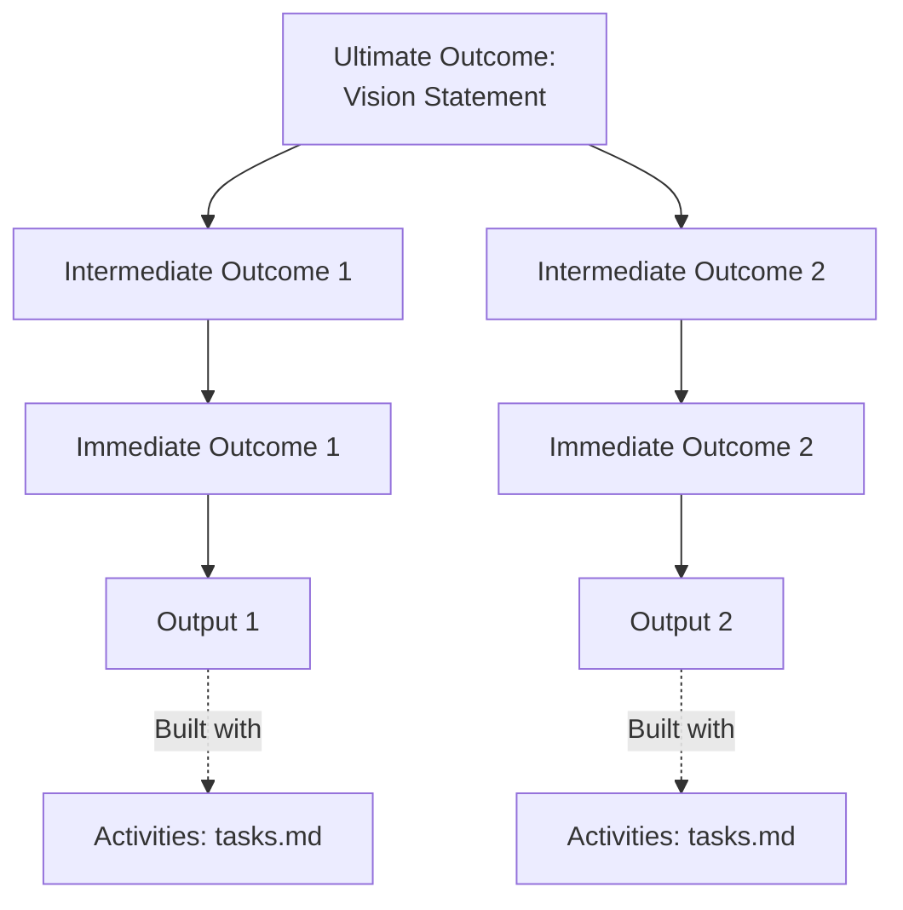

# Product Overview

## Product Purpose
[Describe the core purpose of this product/project. What problem does it solve?]

## Results Chain (Logic Model)

### Ultimate Outcome (Timeframe: 2-5 years)

**Vision**: [Quantified long-term impact statement - WHO will achieve WHAT by WHEN]

**Key Milestones**:
- **Year 1**: [Milestone with quantified metric]
- **Year 2**: [Milestone with quantified metric]
- **Year 3+**: [Ultimate outcome achieved]

---

### Intermediate Outcomes (Timeframe: 6-18 months)

**Outcome 1**: [Mid-term behavioral/condition change]
- **Type**: [Revenue/Users/Market/Cost/Strategic]
- **Metric**: [KPI] from [baseline] to [target] by [date]
- **Contributes To**: Ultimate Outcome via [causal logic statement]

**Outcome 2**: [Mid-term behavioral/condition change]
- **Type**: [Revenue/Users/Market/Cost/Strategic]
- **Metric**: [KPI] from [baseline] to [target] by [date]
- **Contributes To**: Ultimate Outcome via [causal logic statement]

---

### Immediate Outcomes (Timeframe: 3-6 months)

**Outcome 1**: [Short-term capability/knowledge change]
- **Delivered By**: [Key Feature or Output]
- **Metric**: [Leading indicator] from [baseline] to [target]
- **Supports**: Intermediate Outcome [1 or 2]

**Outcome 2**: [Short-term capability/knowledge change]
- **Delivered By**: [Key Feature or Output]
- **Metric**: [Leading indicator] from [baseline] to [target]
- **Supports**: Intermediate Outcome [1 or 2]

---

### Outputs (Deliverables)

Link to [requirements.md](../requirements.md) for detailed functional requirements.

**Key Outputs**:
- **Output 1**: [Deliverable/product/service, 1-3 months]
- **Output 2**: [Deliverable/product/service, 1-3 months]

---

### Activities & Tasks (Implementation)

Link to [tasks.md](../tasks.md) for user stories and sprint tasks.

---

### Inputs (Resources Required)

**Budget**: [Amount, if applicable]  
**Team**: [# developers × hours/week × months]  
**Infrastructure**: [Servers, databases, tools, licenses]  
**Dependencies**: [External libraries, APIs, services, data sources]

---

### Visual Logic Model

## Target Users
[Who are the primary users of this product? What are their needs and pain points?]

## Key Features
[List the main features that deliver value to users]

1. **Feature 1**: [Description]
2. **Feature 2**: [Description]
3. **Feature 3**: [Description]

## Business Objectives
[What are the business goals this product aims to achieve?]

- [Objective 1]
- [Objective 2]
- [Objective 3]

## Performance Measurement Framework (PMF)

### Key Performance Indicators (KPI)

| Level | Indicator | Baseline | Target | Timeline | Data Source | Frequency | Status |
|-------|-----------|----------|--------|----------|-------------|-----------|--------|
| **Ultimate Outcome** | [Lagging indicator - long-term impact] | [Value] | [Target] | [Year] | [Survey/Analytics] | Annual | 🔴/🟡/🟢 |
| **Intermediate Outcome 1** | [Outcome indicator - behavior/condition] | [Value] | [Target] | [Quarter] | [Tool/Logs] | Quarterly | 🔴/🟡/🟢 |
| **Intermediate Outcome 2** | [Outcome indicator - behavior/condition] | [Value] | [Target] | [Quarter] | [Tool/Logs] | Quarterly | 🔴/🟡/🟢 |
| **Immediate Outcome 1** | [Leading indicator - knowledge/skill] | [Value] | [Target] | [Month] | [Tool/Logs] | Monthly | 🔴/🟡/🟢 |
| **Immediate Outcome 2** | [Leading indicator - knowledge/skill] | [Value] | [Target] | [Month] | [Tool/Logs] | Monthly | 🔴/🟡/🟢 |
| **Output 1** | [Deliverable count/completion] | 0 | [Target] | [Month] | GitHub/Repo | Weekly | 🔴/🟡/🟢 |
| **Output 2** | [Deliverable count/completion] | 0 | [Target] | [Month] | GitHub/Repo | Weekly | 🔴/🟡/🟢 |

**Indicator Types**:
- 🔴 **Lagging**: Long-term outcome (hard to influence directly, measure annually)
- 🟡 **Outcome**: Mid-term result (influenced by outputs, measure quarterly/monthly)
- 🟢 **Leading**: Short-term activity (actionable, measure weekly/monthly)

**Status Legend**:
- 🔴 Off track (>20% below target)
- 🟡 At risk (10-20% below target)
- 🟢 On track (within 10% of target or exceeding)

---

### AARRR Metrics (if applicable)

| Stage | Metric | Current | Target | Notes |
|-------|--------|---------|--------|-------|
| **Acquisition** | [How users discover product] | [Value] | [Target] | [Channel/source] |
| **Activation** | [First positive experience] | [Value] | [Target] | [Onboarding milestone] |
| **Retention** | [Users return regularly] | [Value] | [Target] | [Frequency/churn] |
| **Revenue** | [Monetization] | [Value] | [Target] | [If applicable] |
| **Referral** | [Users recommend product] | [Value] | [Target] | [NPS/viral coefficient] |

---

## Assumptions & Risks

### Critical Assumptions (Results Chain)

Assumptions are conditions that must be true for causal logic to work. Monitor these regularly.

| Assumption | Level Affected | Likelihood True | Impact if False | Mitigation Strategy | Monitoring Frequency |
|------------|----------------|-----------------|-----------------|---------------------|---------------------|
| [e.g., Users have necessary infrastructure] | [Outcome level] | High/Med/Low | High/Med/Low | [e.g., Provide Docker setup] | Quarterly/Monthly |
| [e.g., Competitors don't launch superior solution] | [Outcome level] | High/Med/Low | High/Med/Low | [e.g., Pivot to niche] | Quarterly/Monthly |
| [e.g., Community contributes quality content] | [Outcome level] | High/Med/Low | High/Med/Low | [e.g., Hire curators] | Quarterly/Monthly |

**Assumption Categories**:
- **Contextual**: External factors (market, competition, regulations)
- **Behavioral**: Stakeholder actions (users adopt, partners deliver)
- **Technical**: Solution effectiveness (technology works as expected)

---

### Risk Register

| Risk | Likelihood | Impact | Mitigation | Contingency Plan | Owner |
|------|------------|--------|------------|------------------|-------|
| [e.g., Key dependency fails] | High/Med/Low | High/Med/Low | [Preventive action] | [If risk occurs] | [Name/Role] |
| [e.g., Team capacity shortfall] | High/Med/Low | High/Med/Low | [Preventive action] | [If risk occurs] | [Name/Role] |

**Risk Scoring**:
- **Likelihood**: Low (<20%), Medium (20-50%), High (>50%)
- **Impact**: Low (minor delay), Medium (outcomes partially affected), High (outcomes fail)
- **Priority**: High Likelihood × High Impact = CRITICAL (address immediately)

---

## Product Principles
[Core principles that guide product decisions]

1. **[Principle 1]**: [Explanation]
2. **[Principle 2]**: [Explanation]
3. **[Principle 3]**: [Explanation]

## Monitoring & Visibility (if applicable)
[How do users track progress and monitor the system?]

- **Dashboard Type**: [e.g., Web-based, CLI, Desktop app]
- **Real-time Updates**: [e.g., WebSocket, polling, push notifications]
- **Key Metrics Displayed**: [What information is most important to surface]
- **Sharing Capabilities**: [e.g., read-only links, exports, reports]

## Future Vision
[Where do we see this product evolving in the future?]

### Potential Enhancements
- **Remote Access**: [e.g., Tunnel features for sharing dashboards with stakeholders]
- **Analytics**: [e.g., Historical trends, performance metrics]
- **Collaboration**: [e.g., Multi-user support, commenting]
