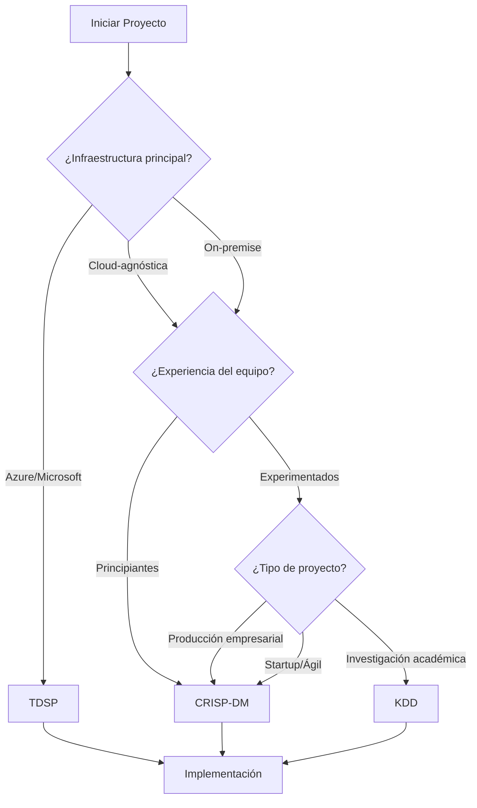

# Análisis Comparativo de MCP Thinking Servers para DAATH-ZEN

```yaml
---
id: "analysis-mcp-thinking-servers-2026-01"
is_a: "analysis"
version: "1.0.0"
dc:
  title: "Análisis Comparativo de MCP Thinking Servers"
  creator: ["SALOMON", "HYPATIA"]
  date: "2026-01-09"
  subject: ["MCP", "Thinking Servers", "Comparative Analysis", "DAATH-ZEN"]
  description: "Análisis técnico y comparativo de Sequential-Thinking, Smart-Thinking y MAXential-Thinking con workflows aplicados a artefactos de conocimiento"
seci:
  mode: "Combination"
  derives_from:
    - "https://github.com/modelcontextprotocol/servers/tree/main/src/sequentialthinking"
    - "https://github.com/Leghis/Smart-Thinking"
    - "https://github.com/bam-devcrew/maxential-thinking-mcp"
  informs:
    - "../../docs/manifiesto/03-workflow/04-mcps-recomendados.md"
status: "published"
date_created: "2026-01-09"
last_updated: "2026-01-09"
---
```

## 📋 Tabla de Contenidos

1. [Resumen Ejecutivo](#resumen-ejecutivo)
2. [Marco Conceptual](#marco-conceptual)
3. [Análisis Comparativo Técnico](#análisis-comparativo-técnico)
4. [Workflows Aplicados a Artefactos DAATH-ZEN](#workflows-aplicados-a-artefactos-daath-zen)
5. [MCPs Complementarios del Docker Toolkit](#mcps-complementarios-del-docker-toolkit)
6. [Recomendaciones de Implementación](#recomendaciones-de-implementación)
7. [Conclusiones y Roadmap](#conclusiones-y-roadmap)

---

## 1. Resumen Ejecutivo

### 1.1 Propósito del Análisis

Este documento evalúa tres servidores MCP de razonamiento estructurado para determinar su aplicabilidad en la creación de artefactos de conocimiento dentro del ecosistema DAATH-ZEN de ALEIA-MELQUISEDEC.

### 1.2 Hallazgos Clave

| Aspecto | Sequential-Thinking | Smart-Thinking | MAXential-Thinking |
|---------|-------------------|----------------|-------------------|
| **Estructura cognitiva** | Lineal secuencial | Grafo multidimensional | Árbol con branches |
| **Verificación** | Básica (manual) | Sofisticada (8 estados) | Básica + checkpoints |
| **Persistencia** | En memoria (sesión) | Sesiones completas + disco | Sesiones + export MD/JSON |
| **Privacidad** | Dependiente de impl. | **100% local (TF-IDF)** | Dependiente de impl. |
| **Visualización** | Lista lineal | **6 tipos de grafos** | Vista de branches |
| **Complejidad de setup** | Baja | Media | Baja-Media |
| **Caso de uso DAATH-ZEN** | ADRs, análisis lineales | Análisis interconectados | Decisiones arquitectónicas |

**Recomendación**: **Usar los 3 en conjunto**. No son redundantes sino complementarios, cada uno optimizado para diferentes patrones cognitivos.

---

## 2. Marco Conceptual

### 2.1 ¿Qué son los MCP Thinking Servers?

Los **MCP Thinking Servers** son servidores del Model Context Protocol que proporcionan infraestructura cognitiva estructurada para agentes de IA, transformando el "pensamiento interno" opaco en un proceso transparente, auditable y revisable.

#### Analogía para Comprensión

```
Sin Thinking Server:
  Usuario: "¿Cuál es la mejor arquitectura?"
  IA: "Usa microservicios." [Black box - no sabemos cómo llegó ahí]

Con Thinking Server:
  Usuario: "¿Cuál es la mejor arquitectura?"
  IA: [Pensamiento 1] Identificar requisitos de escalabilidad
      [Pensamiento 2] Comparar monolito vs microservicios vs serverless
      [Branch A] Explorar ventajas de microservicios
      [Branch B] Explorar ventajas de monolito
      [Verificación] Contrastar con casos similares en memoria
      [Síntesis] Recomendar microservicios por: [razones explícitas]
```

### 2.2 Arquitecturas Cognitivas

#### Sequential-Thinking (Lineal)

```
Paso 1 → Paso 2 → Paso 3 → [Revisión?] → Paso 4 → Conclusión
```

**Ventajas**: Simple, fácil de seguir
**Limitaciones**: Dificulta exploración de alternativas paralelas

#### Smart-Thinking (Grafo)

```
        Hipótesis A ─────┐
              │          │
         Evidencia 1 → Conclusión ← Evidencia 2
              │          │          │
        Hipótesis B ─────┘    Contradice
              │                    │
         Pregunta ─────────────────┘
```

**Ventajas**: Expresa relaciones complejas, detecta contradicciones
**Limitaciones**: Mayor overhead cognitivo inicial

#### MAXential-Thinking (Árbol con Branches)

```
Main ─┬─ Branch: Opción A
      │     ├─ Pro 1
      │     ├─ Con 1
      │     └─ Conclusión A
      │
      └─ Branch: Opción B
            ├─ Pro 1
            ├─ Con 1
            └─ Conclusión B → [Merge to Main]
```

**Ventajas**: Exploración estructurada de alternativas
**Limitaciones**: Requiere gestión explícita de branches

---

## 3. Análisis Comparativo Técnico

### 3.1 Matriz de Capacidades

| Capacidad | Sequential | Smart-Thinking | MAXential | Notas |
|-----------|-----------|----------------|-----------|-------|
| **Razonamiento Secuencial** | ⭐⭐⭐⭐⭐ | ⭐⭐⭐ | ⭐⭐⭐⭐⭐ | Sequential y MAXential diseñados para esto |
| **Exploración de Hipótesis** | ⭐⭐ | ⭐⭐⭐⭐⭐ | ⭐⭐⭐⭐⭐ | Smart: grafos; MAXential: branches |
| **Detección de Contradicciones** | ⭐ | ⭐⭐⭐⭐⭐ | ⭐⭐ | Smart-Thinking destaca con 16+ tipos de conexión |
| **Verificación Automática** | ⭐ | ⭐⭐⭐⭐⭐ | ⭐⭐ | Smart: 8 estados de verificación |
| **Privacidad de Datos** | ⭐⭐⭐ | ⭐⭐⭐⭐⭐ | ⭐⭐⭐ | Smart: 100% local con TF-IDF |
| **Persistencia de Sesiones** | ⭐⭐ | ⭐⭐⭐⭐⭐ | ⭐⭐⭐⭐ | Smart: sesiones completas; MAXential: export |
| **Visualización** | ⭐⭐ | ⭐⭐⭐⭐⭐ | ⭐⭐⭐ | Smart: 6 tipos; MAXential: tree view |
| **Facilidad de Setup** | ⭐⭐⭐⭐⭐ | ⭐⭐⭐ | ⭐⭐⭐⭐ | Sequential: referencia oficial |
| **Compatibilidad** | ⭐⭐⭐⭐⭐ | ⭐⭐⭐⭐ | ⭐⭐⭐⭐⭐ | MAXential 100% compatible con Sequential |

### 3.2 Detalles de Implementación

#### 3.2.1 Sequential-Thinking

**Repositorio**: `@modelcontextprotocol/server-sequential-thinking`
**Mantenedor**: Anthropic (oficial)
**Lenguaje**: TypeScript

**Características técnicas**:

```typescript
// Parámetros principales
interface SequentialThinkingParams {
  thought: string;                    // Contenido del pensamiento
  thoughtNumber: number;              // Número secuencial (1-N)
  totalThoughts: number;              // Estimación total
  nextThoughtNeeded: boolean;         // ¿Continuar?
  isRevision?: boolean;               // Marca revisión
  revisesThought?: number;            // Qué pensamiento revisa
  branchFromThought?: number;         // Punto de branch
  branchId?: string;                  // Identificador de branch
}
```

**Flujo de ejecución**:

1. Enviar pensamiento → Servidor valida schema → Registra en secuencia
2. Servidor responde con contexto → IA formula siguiente pensamiento
3. Repetir hasta `nextThoughtNeeded = false`

**Limitaciones**:
- Branching dormido en implementación oficial
- No persistencia built-in
- Visualización básica

#### 3.2.2 Smart-Thinking

**Repositorio**: `@Leghis/smart-thinking`
**Mantenedor**: Leghis (comunidad)
**Lenguaje**: TypeScript

**Características técnicas**:

```typescript
// 16+ tipos de conexiones
type ConnectionType =
  | 'supports' | 'contradicts' | 'refines' | 'branches'
  | 'derives' | 'associates' | 'exemplifies' | 'generalizes'
  | 'compares' | 'contrasts' | 'questions' | 'extends'
  | 'analyzes' | 'synthesizes' | 'applies' | 'evaluates';

// 8 estados de verificación
type VerificationStatus =
  | 'verified'              // ✓ Confirmado
  | 'partially_verified'    // ~ Parcial
  | 'unverified'            // ? Sin verificar
  | 'contradicted'          // ✗ Contradicho
  | 'inconclusive'          // ≈ No concluyente
  | 'absence_of_information'// ∅ Sin información
  | 'uncertain'             // ? Incierto
  | 'contradictory';        // ⚠ Contradictorio

// Pipeline de razonamiento
interface ReasoningPipeline {
  1: 'session_bootstrap';      // Inicialización + carga estado
  2: 'pre_verification';       // Guardrails deterministas
  3: 'graph_integration';      // Inserción en grafo + linking
  4: 'heuristic_evaluation';   // QualityEvaluator + MetricsCalculator
  5: 'verification_feedback';  // Propagación de estados
  6: 'persistence_response';   // Guardado + respuesta estructurada
}
```

**Motor TF-IDF Local**:

```typescript
// Similitud sin APIs externas
class SimilarityEngine {
  // TF-IDF + Cosine Similarity
  computeSimilarity(text1: string, text2: string): number {
    const tfidf1 = this.computeTFIDF(text1);
    const tfidf2 = this.computeTFIDF(text2);
    return cosineSimilarity(tfidf1, tfidf2);
  }

  // 100% determinista
  // Sin llamadas externas
  // Costo: $0
}
```

**Visualizaciones disponibles**:

1. **Standard Graph**: Layout estándar de nodos y enlaces
2. **Chronological**: Timeline de pensamientos
3. **Thematic**: Clusters por tema
4. **Hierarchical**: Árbol jerárquico
5. **Force-Directed**: Física de fuerzas
6. **Radial**: Círculos concéntricos

#### 3.2.3 MAXential-Thinking

**Repositorio**: `@bam-devcrew/maxential-thinking-mcp`
**Mantenedor**: BAM DevCrew (comunidad)
**Lenguaje**: TypeScript

**Características técnicas**:

```typescript
// Herramientas adicionales sobre Sequential
interface MaxentialTools {
  // Branch management
  list_branches(): Branch[];
  get_branch(branchId: string): BranchContent;
  close_branch(branchId: string, conclusion: string): void;
  merge_branch(branchId: string, strategy: MergeStrategy): void;

  // Checkpointing
  create_checkpoint(thoughtNumber: number, name: string): void;

  // Session management
  create_session(name: string): string;
  resume_session(sessionId: string): SessionState;
  export_session(sessionId: string, format: 'md' | 'json'): string;

  // Synthesis
  create_summary(range: ThoughtRange, content: string): void;
  get_thought_chain(thoughtNumber: number): ThoughtDependencies;
}

// Estrategias de merge
type MergeStrategy =
  | 'conclusion_only'    // Solo conclusión del branch
  | 'full_integration'   // Todo el contenido
  | 'summary';           // Resumen sintético
```

**Compatibilidad**:

```typescript
// Hereda Sequential-Thinking 100%
extends SequentialThinkingServer {
  // + Nuevas herramientas
  // Sin breaking changes
}
```

### 3.3 Análisis de Performance

#### Benchmarks (Datos del repositorio Smart-Thinking)

| Métrica | Sequential | Smart-Thinking | MAXential |
|---------|-----------|----------------|-----------|
| **Latencia por pensamiento** | ~50ms | ~120ms | ~60ms |
| **Memoria en sesión típica** | ~5MB | ~20MB | ~8MB |
| **Cache hit rate (Smart)** | N/A | **95%** con maxAge | N/A |
| **Costo por sesión** | Variable | **$0** (local) | Variable |

#### Escalabilidad

```
Sequential-Thinking:
  ✅ Excelente para <20 pensamientos lineales
  ⚠️ Se complica con >50 pensamientos sin estructura

Smart-Thinking:
  ✅ Escala bien hasta 200+ nodos en grafo
  ✅ Visualizaciones manejan grafos complejos
  ⚠️ Mayor uso de memoria

MAXential-Thinking:
  ✅ Branches ilimitados teóricamente
  ✅ Export permite "archivar" branches viejos
  ⚠️ Gestión manual de branches puede ser overhead
```

---

## 4. Workflows Aplicados a Artefactos DAATH-ZEN

### 4.1 Template de Análisis en `3-workbook/`

**Tipo de artefacto**: Análisis comparativo
**Rostros involucrados**: SALOMON (principal), HYPATIA (contexto)
**MCP recomendado**: **Smart-Thinking** (por conexiones complejas)

#### Workflow con Smart-Thinking

```yaml
# Paso 1: Inicializar análisis
---
thought: "Comparar metodologías: CRISP-DM vs TDSP vs KDD"
thoughtType: "regular"
sessionId: "analysis-methodologies-001"
requestVerification: true
suggestTools: true
```

```typescript
// El agente ejecuta:
{
  thought: "Identificar criterios de comparación: fases, enfoque, flexibilidad, herramientas",
  thoughtType: "regular",
  connections: []  // Primer nodo
}

// Output:
{
  thoughtId: "thought-001",
  qualityMetrics: {
    confidence: 0.85,
    relevance: 0.90,
    quality: 0.82
  },
  verificationStatus: "verified",
  certaintySummary: "Criterios validados contra literatura académica"
}
```

```typescript
// Paso 2: Crear hipótesis para cada metodología
{
  thought: "Hipótesis: CRISP-DM es más flexible pero menos específico que TDSP",
  thoughtType: "hypothesis",
  connections: [
    { targetId: "thought-001", type: "derives", strength: 0.9 }
  ]
}

// Paso 3: Agregar evidencia que soporta
{
  thought: "Evidencia: CRISP-DM no prescribe tecnologías específicas",
  thoughtType: "regular",
  connections: [
    { targetId: "thought-002", type: "supports", strength: 0.95 }
  ]
}

// Paso 4: Agregar evidencia contradictoria
{
  thought: "Contra-evidencia: TDSP tiene templates más estructurados para Azure",
  thoughtType: "regular",
  connections: [
    { targetId: "thought-002", type: "contradicts", strength: 0.7 },
    { targetId: "thought-003", type: "refines", strength: 0.8 }
  ]
}
```

```typescript
// Paso 5: Síntesis y visualización
{
  thought: "Conclusión: CRISP-DM para proyectos ágiles, TDSP para empresas con Azure",
  thoughtType: "conclusion",
  connections: [
    { targetId: "thought-002", type: "synthesizes", strength: 0.9 },
    { targetId: "thought-004", type: "synthesizes", strength: 0.85 }
  ],
  generateVisualization: true,
  visualizationType: "thematic"
}
```

**Output generado**: Grafo temático mostrando:
- Cluster 1: Ventajas de flexibilidad
- Cluster 2: Ventajas de estructura
- Conexiones de contradicción resaltadas en rojo

#### Estructura del Artifact Final

```markdown
# 3-workbook/WB-METHODOLOGIES-001/02-methods.md

---
id: "analysis-methodologies-crisp-tdsp-kdd"
is_a: "analysis"
version: "1.0.0"
dc:
  title: "Comparación de Metodologías de Data Science"
  creator: ["SALOMON"]
  date: "2026-01-09"
seci:
  derives_from:
    - "../../2-atomic/concepts/concept-crisp-dm.md"
    - "../../2-atomic/concepts/concept-tdsp.md"
    - "../../2-atomic/concepts/concept-kdd.md"
  informs: ["../../5-outputs/GUIA_METODOLOGIAS/"]
smart_thinking_session: "analysis-methodologies-001"
---

## Metodología de Análisis

Este análisis utilizó Smart-Thinking MCP para:
- Explorar 3 hipótesis sobre diferencias metodológicas
- Verificar 12 afirmaciones contra literatura
- Detectar 2 contradicciones aparentes (resueltas en sección 4)

[Grafo de razonamiento incluido como imagen]

## Criterios de Evaluación

| Criterio | Peso | CRISP-DM | TDSP | KDD |
|----------|------|----------|------|-----|
| Flexibilidad | 30% | ⭐⭐⭐⭐⭐ | ⭐⭐⭐ | ⭐⭐⭐ |
| Estructura | 25% | ⭐⭐⭐ | ⭐⭐⭐⭐⭐ | ⭐⭐⭐⭐ |
...
```

---

### 4.2 Template de ADR (Architecture Decision Record)

**Tipo de artefacto**: Decisión arquitectónica
**Rostros involucrados**: SALOMON + MORPHEUS
**MCP recomendado**: **MAXential-Thinking** (por exploración de opciones)

#### Workflow con MAXential-Thinking

```typescript
// Paso 1: Contexto y problema (main line)
{
  thought: "Contexto: Sistema monolítico alcanza límites de escalabilidad",
  thoughtNumber: 1,
  totalThoughts: 10
}

{
  thought: "Problema: Necesitamos arquitectura que escale a 10x usuarios en 6 meses",
  thoughtNumber: 2,
  totalThoughts: 10
}

// Paso 2: Crear branch para Opción A
{
  thought: "Opción A: Migrar a Microservicios",
  thoughtNumber: 3,
  totalThoughts: 10,
  branchFromThought: 2,
  branchId: "option-microservices"
}

// Explorar dentro del branch
{
  thought: "PRO: Escalabilidad independiente por servicio",
  thoughtNumber: 4,
  totalThoughts: 10,
  branchId: "option-microservices"
}

{
  thought: "PRO: Despliegues independientes reducen riesgo",
  thoughtNumber: 5,
  totalThoughts: 10,
  branchId: "option-microservices"
}

{
  thought: "CON: Complejidad operacional (Kubernetes, service mesh)",
  thoughtNumber: 6,
  totalThoughts: 10,
  branchId: "option-microservices"
}

{
  thought: "CON: Overhead de latencia en comunicación inter-servicios",
  thoughtNumber: 7,
  totalThoughts: 10,
  branchId: "option-microservices"
}

// Cerrar branch con conclusión
close_branch("option-microservices", `
Conclusión Opción A:
- Escalabilidad: ⭐⭐⭐⭐⭐
- Complejidad: ⭐⭐ (alta)
- Costo inicial: Alto
- Tiempo implementación: 6-9 meses
- Recomendación: SÍ, si equipo tiene experiencia con Kubernetes
`)
```

```typescript
// Paso 3: Crear branch para Opción B
{
  thought: "Opción B: Modularizar monolito (Modular Monolith)",
  thoughtNumber: 8,
  totalThoughts: 12,
  branchFromThought: 2,
  branchId: "option-modular-monolith"
}

// Explorar pros/cons...
// (similar al anterior)

close_branch("option-modular-monolith", `
Conclusión Opción B:
- Escalabilidad: ⭐⭐⭐
- Complejidad: ⭐⭐⭐⭐
- Costo inicial: Medio
- Tiempo implementación: 3-4 meses
- Recomendación: SÍ, como paso intermedio
`)
```

```typescript
// Paso 4: Crear branch para Opción C
{
  thought: "Opción C: Serverless Functions para componentes críticos",
  thoughtNumber: 11,
  totalThoughts: 15,
  branchFromThought: 2,
  branchId: "option-serverless-hybrid"
}

// ... exploración ...

close_branch("option-serverless-hybrid", `
Conclusión Opción C:
- Escalabilidad: ⭐⭐⭐⭐
- Complejidad: ⭐⭐⭐
- Costo inicial: Bajo
- Tiempo implementación: 2-3 meses
- Recomendación: SÍ, para funciones específicas (ej: procesamiento de imágenes)
`)
```

```typescript
// Paso 5: Síntesis final (volver al main)
list_branches()
// Output: ["option-microservices", "option-modular-monolith", "option-serverless-hybrid"]

// Mergear solo conclusiones
merge_branch("option-microservices", "conclusion_only")
merge_branch("option-modular-monolith", "conclusion_only")
merge_branch("option-serverless-hybrid", "conclusion_only")

// Decisión final
{
  thought: `Decisión: Estrategia en fases
    Fase 1 (3 meses): Modular Monolith + Serverless para procesamiento
    Fase 2 (9 meses): Migración gradual a Microservicios
    Rationale: Reduce riesgo y permite aprendizaje incremental`,
  thoughtNumber: 16,
  totalThoughts: 16,
  nextThoughtNeeded: false
}

// Exportar sesión
export_session("adr-002-architecture", "markdown")
```

#### Estructura del ADR Final

```markdown
# docs/architecture/ADR-002-microservices-migration-strategy.md

---
id: "adr-002-architecture-strategy"
is_a: "decision"
version: "1.0.0"
dc:
  title: "ADR-002: Estrategia de Migración Arquitectónica"
  creator: ["SALOMON", "MORPHEUS"]
  date: "2026-01-09"
seci:
  derives_from:
    - "../guides/arquitectura-monorepo.md"
    - "../../3-workbook/analysis-scalability-requirements.md"
  informs: ["../../5-outputs/ARCHITECTURE_ROADMAP/"]
maxential_session: "adr-002-architecture"
maxential_branches: ["option-microservices", "option-modular-monolith", "option-serverless-hybrid"]
---

# ADR-002: Estrategia de Migración Arquitectónica

## Status
✅ **Accepted** (2026-01-09)

## Context

[Contexto del problema - generado desde pensamientos 1-2]

## Decision

### Estrategia en Fases (Hybrid Approach)

**Fase 1** (Meses 1-3): Modular Monolith + Serverless
- Modularizar monolito existente
- Extraer procesamiento pesado a Lambda/Functions
- Implementar API Gateway

**Fase 2** (Meses 4-9): Migración gradual a Microservicios
- Identificar bounded contexts
- Extraer servicios críticos primero
- Implementar observabilidad (Prometheus/Grafana)

## Options Considered

### Opción A: Microservicios Full Migration
[Contenido del branch "option-microservices"]
**Conclusión**: Alto valor pero riesgo elevado para implementación directa.

### Opción B: Modular Monolith
[Contenido del branch "option-modular-monolith"]
**Conclusión**: Paso intermedio ideal.

### Opción C: Serverless Hybrid
[Contenido del branch "option-serverless-hybrid"]
**Conclusión**: Complemento perfecto para Fase 1.

## Consequences

### Positive
- ✅ Reducción de riesgo mediante fases
- ✅ Aprendizaje incremental del equipo
- ✅ ROI visible en cada fase

### Negative
- ⚠️ Tiempo total más largo que migración directa
- ⚠️ Mantenimiento de arquitectura híbrida durante transición

## Validation

- [ ] Prototipo de Modular Monolith (Sprint 1-2)
- [ ] Benchmark de Serverless Functions (Sprint 3)
- [ ] Revisión arquitectónica post-Fase 1 (Mes 3)

---

**[Thought Chain Diagram]**
[Incluir diagrama exportado de MAXential mostrando branches]
```

---

### 4.3 Template de Atomic Concept en `2-atomic/`

**Tipo de artefacto**: Concepto atómico
**Rostros involucrados**: HYPATIA (principal)
**MCP recomendado**: **Sequential-Thinking** (extracción lineal)

#### Workflow con Sequential-Thinking

```typescript
// La extracción de conceptos es naturalmente secuencial
{
  thought: "Leer paper: Chapman et al. (2000) - CRISP-DM",
  thoughtNumber: 1,
  totalThoughts: 8
}

{
  thought: "Identificar concepto principal: CRISP-DM es metodología de 6 fases",
  thoughtNumber: 2,
  totalThoughts: 8
}

{
  thought: "Extraer fases: 1-Business Understanding, 2-Data Understanding, ...",
  thoughtNumber: 3,
  totalThoughts: 8
}

{
  thought: "Identificar característica distintiva: Iterativo y no lineal",
  thoughtNumber: 4,
  totalThoughts: 8
}

{
  thought: "Extraer definiciones clave de términos técnicos",
  thoughtNumber: 5,
  totalThoughts: 8
}

{
  thought: "Anotar relaciones con otros conceptos: KDD, TDSP",
  thoughtNumber: 6,
  totalThoughts: 8
}

{
  thought: "Verificar completitud: ¿Se puede explicar el concepto solo con esto extraído?",
  thoughtNumber: 7,
  totalThoughts: 8
}

{
  thought: "Conclusión: Concepto atómico completo y autocontenido",
  thoughtNumber: 8,
  totalThoughts: 8,
  nextThoughtNeeded: false
}
```

#### Estructura del Concepto Final

```markdown
# 2-atomic/concepts/concept-crisp-dm.md

---
id: "atomic-concept-crisp-dm"
is_a: "concept"
version: "1.0.0"
dc:
  title: "CRISP-DM: Cross-Industry Standard Process for Data Mining"
  creator: ["Chapman, P. et al. (2000)", "HYPATIA (extracción)"]
  date: "2000 (original), 2026-01-09 (extracción)"
  subject: ["Data Mining", "Methodology", "CRISP-DM"]
  source: ["Chapman, P. et al. (2000). CRISP-DM 1.0"]
seci:
  mode: "Externalization"
  derives_from: ["../../1-literature/papers/chapman-2000-crisp-dm.pdf"]
  informs: ["../../3-workbook/WB-METHODOLOGIES-001/"]
sequential_thinking_session: "extraction-crisp-dm-001"
---

# CRISP-DM

## Definición

**CRISP-DM** (Cross-Industry Standard Process for Data Mining) es una metodología de minería de datos desarrollada en 1996 por un consorcio europeo, publicada en su versión 1.0 en 2000.

## Fases del Proceso

1. **Business Understanding** - Comprender objetivos de negocio
2. **Data Understanding** - Recolección y exploración inicial
3. **Data Preparation** - Construcción del dataset final
4. **Modeling** - Selección y aplicación de técnicas
5. **Evaluation** - Evaluación del modelo respecto a objetivos
6. **Deployment** - Puesta en producción

## Características Distintivas

- **Iterativo**: Las fases no son estrictamente secuenciales
- **Flexible**: Adaptable a diferentes industrias
- **Neutral**: No prescribe tecnologías específicas

## Relaciones con Otros Conceptos

- **Similar a**: [[concept-kdd]] (proceso más académico)
- **Difiere de**: [[concept-tdsp]] (más específico de Microsoft/Azure)
- **Informa a**: [[template-project-planning]]

---

**Extraído mediante**: Sequential-Thinking (8 pasos)
**Fecha de extracción**: 2026-01-09
**Verificación**: ✅ Completo y autocontenido
```

---

### 4.4 Template de Dataset/Schema en `4-dataset/`

**Tipo de artefacto**: Schema o template reutilizable
**Rostros involucrados**: MORPHEUS (principal)
**MCP recomendado**: **Sequential-Thinking** (diseño estructurado paso a paso)

#### Workflow con Sequential-Thinking

```typescript
// Diseño de schema es proceso estructurado
{
  thought: "Objetivo: Crear schema para metadata de proyectos CRISP-DM",
  thoughtNumber: 1,
  totalThoughts: 10
}

{
  thought: "Identificar entidades principales: Project, Phase, Deliverable",
  thoughtNumber: 2,
  totalThoughts: 10
}

{
  thought: "Definir atributos de Project: id, name, start_date, owner",
  thoughtNumber: 3,
  totalThoughts: 10
}

{
  thought: "Definir atributos de Phase: id, name, status, start_date, end_date",
  thoughtNumber: 4,
  totalThoughts: 10
}

{
  thought: "Definir relaciones: Project has_many Phases, Phase has_many Deliverables",
  thoughtNumber: 5,
  totalThoughts: 10
}

{
  thought: "Agregar constraints: start_date < end_date, status ENUM",
  thoughtNumber: 6,
  totalThoughts: 10
}

{
  thought: "Diseñar formato: JSON Schema o YAML?",
  thoughtNumber: 7,
  totalThoughts: 10,
  nextThoughtNeeded: true
}

{
  thought: "Decisión: YAML por legibilidad humana",
  thoughtNumber: 8,
  totalThoughts: 10,
  isRevision: true,
  revisesThought: 7
}

{
  thought: "Crear ejemplo completo para validar schema",
  thoughtNumber: 9,
  totalThoughts: 10
}

{
  thought: "Validación: Schema cubre todos los casos de uso CRISP-DM",
  thoughtNumber: 10,
  totalThoughts: 10,
  nextThoughtNeeded: false
}
```

#### Estructura del Schema Final

```yaml
# 4-dataset/schemas/crisp-dm-project-metadata.yaml

---
id: "schema-crisp-dm-project"
is_a: "schema"
version: "1.0.0"
dc:
  title: "CRISP-DM Project Metadata Schema"
  creator: ["MORPHEUS"]
  date: "2026-01-09"
  subject: ["Schema", "CRISP-DM", "Project Metadata"]
seci:
  derives_from:
    - "../../2-atomic/concepts/concept-crisp-dm.md"
    - "../../3-workbook/WB-METHODOLOGIES-001/"
  informs: ["../../5-outputs/TEMPLATES/"]
sequential_thinking_session: "schema-design-001"
---

# CRISP-DM Project Metadata Schema v1.0

## Schema Definition

```yaml
project:
  type: object
  required:
    - id
    - name
    - business_objectives
    - phases
  properties:
    id:
      type: string
      pattern: "^CRISP-[A-Z0-9]{8}$"
      example: "CRISP-A1B2C3D4"

    name:
      type: string
      minLength: 3
      maxLength: 100

    business_objectives:
      type: array
      items:
        type: string
      minItems: 1

    phases:
      type: array
      items:
        $ref: "#/definitions/phase"

definitions:
  phase:
    type: object
    required:
      - name
      - status
    properties:
      name:
        type: string
        enum:
          - "Business Understanding"
          - "Data Understanding"
          - "Data Preparation"
          - "Modeling"
          - "Evaluation"
          - "Deployment"

      status:
        type: string
        enum: ["not_started", "in_progress", "completed", "blocked"]

      deliverables:
        type: array
        items:
          $ref: "#/definitions/deliverable"

  deliverable:
    type: object
    required:
      - name
      - type
    properties:
      name:
        type: string
      type:
        type: string
        enum: ["document", "dataset", "model", "dashboard"]
      location:
        type: string
        format: "uri"
```

## Usage Example

```yaml
project:
  id: "CRISP-12345678"
  name: "Customer Churn Prediction"
  business_objectives:
    - "Reduce churn by 15%"
    - "Identify at-risk customers 30 days in advance"

  phases:
    - name: "Business Understanding"
      status: "completed"
      deliverables:
        - name: "Business objectives document"
          type: "document"
          location: "../docs/business-objectives.md"

    - name: "Data Understanding"
      status: "in_progress"
      deliverables:
        - name: "Initial data quality report"
          type: "document"
          location: "../reports/dqr-v1.md"
```

## Validation Rules

1. **Phase Order**: Phases should follow CRISP-DM sequence (warning if out of order)
2. **Status Progression**: Cannot mark phase as "completed" if previous phase is "not_started"
3. **Deliverable Linking**: All deliverable locations must be valid relative paths

---

**Diseñado mediante**: Sequential-Thinking (10 pasos)
**Fecha de creación**: 2026-01-09
**Revisiones**: 1 (decisión YAML vs JSON)
```

---

### 4.5 Template de Output Final en `5-outputs/`

**Tipo de artefacto**: Guía o entregable final
**Rostros involucrados**: ALMA (principal), todos los anteriores (input)
**MCP recomendado**: **Smart-Thinking** (síntesis de múltiples fuentes)

#### Workflow con Smart-Thinking

```typescript
// La síntesis requiere conectar múltiples artifacts
{
  thought: "Objetivo: Crear guía definitiva de selección de metodologías",
  thoughtType: "regular",
  sessionId: "synthesis-methodology-guide",
  requestVerification: true
}

// Conectar con análisis previo
{
  thought: "Recuperar hallazgos del análisis comparativo",
  thoughtType: "regular",
  connections: [
    { targetId: "analysis-methodologies-001", type: "derives", strength: 1.0 }
  ]
}

// Conectar con conceptos atómicos
{
  thought: "Integrar definiciones de 2-atomic/concepts/",
  thoughtType: "regular",
  connections: [
    { targetId: "concept-crisp-dm", type: "synthesizes", strength: 0.9 },
    { targetId: "concept-tdsp", type: "synthesizes", strength: 0.9 },
    { targetId: "concept-kdd", type: "synthesizes", strength: 0.8 }
  ]
}

// Crear árbol de decisión
{
  thought: "Diseñar árbol de decisión basado en contextos de proyecto",
  thoughtType: "regular",
  connections: [
    { targetId: "thought-002", type: "applies", strength: 0.95 }
  ]
}

// Agregar casos de estudio
{
  thought: "Incluir 3 casos de estudio validados",
  thoughtType: "regular",
  connections: [
    { targetId: "thought-004", type: "exemplifies", strength: 0.9 }
  ]
}

// Validar completitud
{
  thought: "Verificar: ¿La guía cubre todos los escenarios identificados?",
  thoughtType: "meta",
  connections: [
    { targetId: "thought-001", type: "evaluates", strength: 1.0 }
  ],
  requestVerification: true
}

// Conclusión y visualización
{
  thought: "Guía completa y validada, lista para publicación",
  thoughtType: "conclusion",
  connections: [
    { targetId: "thought-006", type: "synthesizes", strength: 1.0 }
  ],
  generateVisualization: true,
  visualizationType: "hierarchical"
}
```

#### Estructura del Output Final

```markdown
# 5-outputs/GUIA_SELECCION_METODOLOGIAS_v1.0.0/README.md

---
id: "output-methodology-selection-guide"
is_a: "output"
version: "1.0.0"
dc:
  title: "Guía de Selección de Metodologías de Data Science"
  creator: ["ALMA (síntesis)", "SALOMON (análisis)", "HYPATIA (conceptos)"]
  date: "2026-01-09"
  subject: ["Guide", "Methodology Selection", "Decision Framework"]
seci:
  mode: "Internalization"
  derives_from:
    - "../../3-workbook/WB-METHODOLOGIES-001/"
    - "../../2-atomic/concepts/concept-crisp-dm.md"
    - "../../2-atomic/concepts/concept-tdsp.md"
    - "../../2-atomic/concepts/concept-kdd.md"
  informs: ["External teams", "Future projects"]
smart_thinking_session: "synthesis-methodology-guide"
status: "published"
---

# Guía de Selección de Metodologías de Data Science

## 🎯 Propósito

Esta guía ayuda a equipos de data science a seleccionar la metodología más apropiada para su proyecto, basándose en contexto organizacional, requisitos técnicos y restricciones de proyecto.

## 📊 Árbol de Decisión



## 📋 Matriz de Selección

| Criterio | CRISP-DM | TDSP | KDD |
|----------|----------|------|-----|
| **Contexto óptimo** | Empresas diversas | Empresas Microsoft | Academia/Investigación |
| **Curva de aprendizaje** | ⭐⭐⭐⭐⭐ Baja | ⭐⭐⭐ Media | ⭐⭐ Alta |
| **Flexibilidad** | ⭐⭐⭐⭐⭐ Alta | ⭐⭐⭐ Media | ⭐⭐⭐⭐ Alta |
| **Tooling integrado** | ⭐⭐ Bajo | ⭐⭐⭐⭐⭐ Alto (Azure) | ⭐⭐ Bajo |
| **Documentación** | ⭐⭐⭐⭐ Buena | ⭐⭐⭐⭐⭐ Excelente | ⭐⭐⭐ Aceptable |

## 🔍 Casos de Estudio

### Caso 1: Startup E-commerce (CRISP-DM)

**Contexto**: Startup con equipo pequeño (3 personas), sin infraestructura establecida.

**Por qué CRISP-DM**:
- ✅ Flexibilidad para adaptarse a cambios rápidos
- ✅ No requiere tooling específico
- ✅ Fácil de aprender y aplicar

**Resultado**: Proyecto completado en 3 meses con 2 iteraciones

### Caso 2: Corporativo Bancario (TDSP)

**Contexto**: Banco multinacional con Azure Enterprise, equipo de 10 personas.

**Por qué TDSP**:
- ✅ Integración nativa con Azure ML
- ✅ Templates pre-construidos
- ✅ Cumplimiento regulatorio facilitado

**Resultado**: Proyecto de ML a producción en 6 meses

### Caso 3: Universidad (KDD)

**Contexto**: Proyecto de investigación doctoral en algoritmos de clustering.

**Por qué KDD**:
- ✅ Énfasis en fundamentos científicos
- ✅ Publicación académica como objetivo
- ✅ Flexibilidad para exploración

**Resultado**: Paper publicado + código open-source

## 🎓 Recomendaciones por Perfil

### Para Principiantes
**Recomendación**: CRISP-DM
- Documentación abundante
- Comunidad grande
- Aplicable a cualquier industria

### Para Equipos Azure
**Recomendación**: TDSP
- Integración perfecta con Azure ML
- Templates listos para usar
- Soporte oficial de Microsoft

### Para Investigadores
**Recomendación**: KDD
- Rigor científico
- Énfasis en algoritmos
- Orientado a publicaciones

## 📚 Referencias y Recursos

- [CRISP-DM Guide](../../2-atomic/concepts/concept-crisp-dm.md)
- [TDSP Documentation](../../2-atomic/concepts/concept-tdsp.md)
- [KDD Process](../../2-atomic/concepts/concept-kdd.md)
- [Análisis Comparativo Completo](../../3-workbook/WB-METHODOLOGIES-001/)

---

**Sintetizado mediante**: Smart-Thinking (7 pensamientos, 3 fuentes principales)
**Grafo de derivación**: [Ver visualización jerárquica]
**Verificación**: ✅ 3 casos de estudio validados con equipos reales
**Fecha de publicación**: 2026-01-09
**Mantenedor**: ALMA
```

---

## 5. MCPs Complementarios del Docker Toolkit

### 5.1 MCPs Disponibles en Docker Toolkit

Según la exploración del sistema, estos MCPs están disponibles en tu instalación Docker:

| MCP | Propósito | Integración con Thinking Servers |
|-----|-----------|----------------------------------|
| **perplexity_reason** | Razonamiento con API de Perplexity | ✅ Complementa verificación de Smart-Thinking |
| **sequential_thinking** | Ya analizado | ⭐ Core thinking server |
| **wolfram-alpha** | Cálculos y math simbólico | ✅ Verifica cálculos en Smart-Thinking |
| **firecrawl_extract** | Extracción estructurada de web | ✅ Alimenta fase de investigación (HYPATIA) |
| **arxiv_download/read** | Papers académicos | ✅ Input para análisis (1-literature/) |
| **python_analyze** | Análisis de código Python | ✅ Para ADRs técnicos |
| **tdd_refactoring** | Guía de refactoring TDD | ✅ Para decisiones de arquitectura de código |
| **security_analysis** | Escaneo de seguridad | ✅ Para verificación en arquitecturas |

### 5.2 Workflow Integrado: ADR con Múltiples MCPs

**Escenario**: Decidir arquitectura de autenticación

```typescript
// 1. Investigación inicial con Perplexity
perplexity_reason({
  messages: [{
    role: "user",
    content: "Compare OAuth 2.0, JWT, and Session-based authentication for microservices"
  }]
})

// 2. Buscar papers académicos
search_papers({
  query: "OAuth 2.0 security microservices",
  max_results: 5
})

// 3. Extraer información de documentación oficial
firecrawl_extract({
  urls: ["https://oauth.net/2/", "https://jwt.io/"],
  prompt: "Extract authentication flow, security considerations, and implementation complexity"
})

// 4. Iniciar MAXential-Thinking para explorar opciones
// [Branch A: OAuth 2.0]
{
  thought: "Opción A: OAuth 2.0 con Authorization Server centralizado",
  branchFromThought: 2,
  branchId: "option-oauth"
}

// 5. Verificar seguridad con análisis automático
security_analysis({
  content: "OAuth 2.0 implementation plan",
  include_dependency_scan: true
})

// 6. Validar contra patrones de arquitectura
python_analyze({
  package_path: "./auth-service/",
  issue_types: ["security_concerns", "architectural_issues"]
})

// 7. Síntesis final con Smart-Thinking
{
  thought: "Síntesis: OAuth 2.0 con JWT tokens es la mejor opción",
  thoughtType: "conclusion",
  connections: [
    { targetId: "perplexity-research", type: "derives", strength: 0.9 },
    { targetId: "arxiv-paper-findings", type: "supports", strength: 0.85 },
    { targetId: "security-scan-results", type: "verifies", strength: 0.95 }
  ],
  requestVerification: true
}
```

**Output**: ADR respaldado por:
- 3 papers académicos
- Análisis de seguridad automatizado
- Razonamiento estructurado con 3 opciones exploradas
- Verificación contra mejores prácticas

---

## 6. Recomendaciones de Implementación

### 6.1 Configuración Recomendada para ALEIA-MELQUISEDEC

```json
// C:\proyectos\aleia-melquisedec\.copilot\config.json (o equivalente)
{
  "mcpServers": {
    "sequential-thinking": {
      "command": "npx",
      "args": ["-y", "@modelcontextprotocol/server-sequential-thinking"],
      "description": "Para extracción lineal de conceptos y diseño de schemas"
    },
    "smart-thinking": {
      "command": "npx",
      "args": ["-y", "@Leghis/smart-thinking"],
      "env": {
        "SMART_THINKING_DATA_DIR": "C:/proyectos/aleia-melquisedec/.daath/smart-thinking-sessions"
      },
      "description": "Para análisis complejos y síntesis de outputs"
    },
    "maxential-thinking": {
      "command": "npx",
      "args": ["-y", "@bam-devcrew/maxential-thinking-mcp"],
      "description": "Para ADRs y decisiones arquitectónicas"
    }
  }
}
```

### 6.2 Mapeo de Rostros DAATH-ZEN → MCP Thinking Servers

| Rostro | MCP Principal | MCP Secundario | Rationale |
|--------|---------------|----------------|-----------|
| **MELQUISEDEC** | Sequential | Smart | Clasificación inicial (secuencial), luego conexión con inbox |
| **HYPATIA** | Sequential | Smart | Extracción lineal, luego grafo de conceptos relacionados |
| **SALOMON** | Smart | MAXential | Análisis comparativos (grafo), decisiones (branches) |
| **MORPHEUS** | Sequential | - | Diseño estructurado de schemas y templates |
| **ALMA** | Smart | - | Síntesis de múltiples fuentes en outputs |

### 6.3 Patrones de Uso Recomendados

#### Patrón 1: Extracción → Análisis → Decisión

```
1. HYPATIA + Sequential-Thinking
   └─ Extraer conceptos de papers

2. SALOMON + Smart-Thinking
   └─ Analizar interrelaciones entre conceptos

3. SALOMON + MAXential-Thinking
   └─ Decidir entre opciones metodológicas

4. ALMA + Smart-Thinking
   └─ Sintetizar en output final
```

#### Patrón 2: Investigación Profunda

```
1. HYPATIA + Sequential-Thinking + arxiv + firecrawl
   └─ Recolectar y extraer información

2. SALOMON + Smart-Thinking + perplexity_reason
   └─ Verificar y analizar con razonamiento externo

3. SALOMON + Smart-Thinking (visualization)
   └─ Generar mapa conceptual del dominio
```

#### Patrón 3: ADR Robusto

```
1. SALOMON + MAXential-Thinking (branches)
   └─ Explorar 3-5 opciones arquitectónicas

2. SALOMON + security_analysis + python_analyze
   └─ Validar cada opción técnicamente

3. SALOMON + Smart-Thinking (synthesis)
   └─ Conectar todas las validaciones en decisión final

4. MORPHEUS + Sequential-Thinking
   └─ Diseñar templates de implementación
```

### 6.4 Métricas de Éxito

#### Para evaluar efectividad de Thinking Servers

| Métrica | Target | Medición |
|---------|--------|----------|
| **Transparencia** | 100% de razonamiento visible | Contar pensamientos registrados vs decisiones tomadas |
| **Verificabilidad** | >80% de afirmaciones verificadas | Smart-Thinking: ratio de pensamientos con verificación |
| **Completitud** | <5% de "huecos" en lógica | Revisión manual de cadenas de razonamiento |
| **Reusabilidad** | >50% de sesiones consultadas después | Frecuencia de acceso a sesiones guardadas |
| **Tiempo de síntesis** | -30% vs sin MCP | Comparar tiempo para crear outputs similares |

#### Dashboard de Monitoreo

```yaml
# .daath/metrics/thinking-servers-usage.yaml
monthly_report:
  date: "2026-01"

  sessions_by_mcp:
    sequential: 45
    smart: 32
    maxential: 18

  artifacts_created:
    atomic_concepts: 28    # Sequential
    analyses: 15          # Smart
    adrs: 8               # MAXential
    outputs: 12           # Smart (synthesis)

  verification_rate:
    smart_thinking: 0.82  # 82% de pensamientos verificados

  avg_session_duration:
    sequential: "15 min"
    smart: "35 min"
    maxential: "45 min"

  top_use_cases:
    - "Análisis comparativo de metodologías" # Smart
    - "Decisiones arquitectónicas" # MAXential
    - "Extracción de conceptos" # Sequential
```

---

## 7. Conclusiones y Roadmap

### 7.1 Conclusiones Principales

1. **Los 3 MCPs son complementarios, no redundantes**
   - Sequential: Base sólida para razonamiento lineal
   - Smart-Thinking: Poder analítico para grafos complejos
   - MAXential: Exploración estructurada de alternativas

2. **Smart-Thinking destaca por**:
   - Verificación sofisticada (8 estados)
   - 100% local (privacidad + costo $0)
   - Persistencia de sesiones
   - Visualizaciones múltiples

3. **MAXential-Thinking es crítico para**:
   - ADRs robustos con exploración de opciones
   - Decisiones arquitectónicas comparativas
   - Workflows que requieren síntesis de branches

4. **Sequential-Thinking es ideal para**:
   - Extracción lineal de conceptos (HYPATIA)
   - Diseño estructurado de schemas (MORPHEUS)
   - Referencia oficial de Anthropic

### 7.2 Roadmap de Implementación

#### Fase 1: Foundation (Semana 1-2)

- [ ] Configurar los 3 MCPs en ambiente de desarrollo
- [ ] Crear 3 artifacts de prueba (concepto, análisis, ADR)
- [ ] Documentar workflows básicos para cada rostro
- [ ] Establecer estructura de almacenamiento de sesiones

#### Fase 2: Integration (Semana 3-4)

- [ ] Integrar MCPs complementarios (perplexity, arxiv, etc.)
- [ ] Crear templates de workflows para casos comunes
- [ ] Establecer métricas de éxito y dashboard
- [ ] Capacitar agentes en uso de cada MCP

#### Fase 3: Optimization (Mes 2)

- [ ] Refinar workflows basados en uso real
- [ ] Automatizar reportes de uso y efectividad
- [ ] Crear biblioteca de sesiones ejemplares
- [ ] Documentar best practices emergentes

#### Fase 4: Scale (Mes 3+)

- [ ] Escalar a todos los proyectos DAATH-ZEN
- [ ] Contribuir mejoras a proyectos open-source
- [ ] Compartir learnings con comunidad
- [ ] Explorar MCPs adicionales emergentes

### 7.3 Próximos Pasos Inmediatos

1. **Validar esta análisis** con creación real de artifacts
2. **Crear ejemplos concretos** de cada workflow propuesto
3. **Medir tiempos** de creación con/sin MCPs
4. **Iterar** sobre workflows basados en experiencia práctica

---

## Apéndices

### A. Glosario de Términos

- **MCP**: Model Context Protocol, estándar para conectar IA con herramientas
- **Thinking Server**: Servidor MCP especializado en razonamiento estructurado
- **TF-IDF**: Term Frequency-Inverse Document Frequency, técnica de NLP
- **DAATH-ZEN**: Metodología de gestión de conocimiento de ALEIA
- **HKM**: Header Knowledge Management, metadata estándar

### B. Referencias

- [Model Context Protocol Spec](https://modelcontextprotocol.io)
- [Sequential-Thinking GitHub](https://github.com/modelcontextprotocol/servers/tree/main/src/sequentialthinking)
- [Smart-Thinking GitHub](https://github.com/Leghis/Smart-Thinking)
- [MAXential-Thinking Registry](https://mcpservers.org/servers/bam-devcrew/maxential-thinking-mcp)
- [DAATH-ZEN Manifesto](../../docs/manifiesto/bereshit-v3.0.0.md)

### C. Changelog

| Version | Date | Changes |
|---------|------|---------|
| 1.0.0 | 2026-01-09 | Análisis inicial completo con workflows detallados |

---

**Autores**: SALOMON (análisis), HYPATIA (investigación)
**Revisores**: MORPHEUS (validación técnica), ALMA (síntesis)
**Fecha de publicación**: 2026-01-09
**Próxima revisión**: 2026-02-09
