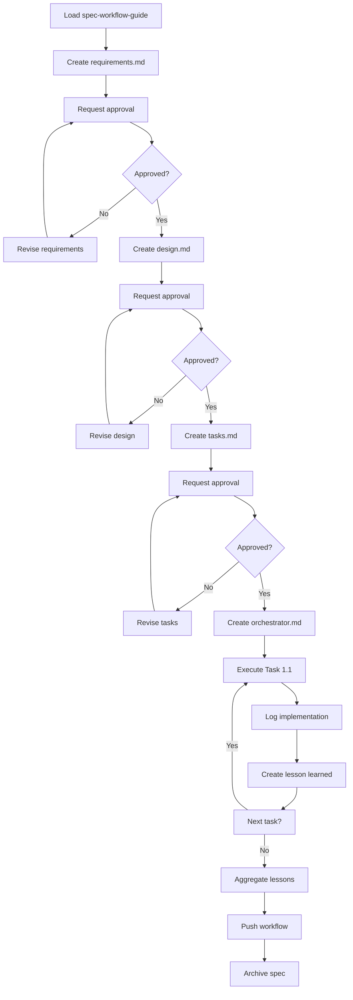

# Spec Folder Guide: monorepo-improvements-v1.1.0

## 📋 Overview

Este README explica cómo gestionar los artefactos dentro de un **spec folder** siguiendo las convenciones de **spec-workflow-mcp**. Un spec folder contiene toda la documentación, tareas y logs de implementación para una especificación.

---

## 📁 Estructura Estándar de un Spec Folder

```
.spec-workflow/specs/<spec-name>/
├── README.md                    # Este archivo - guía de gestión del spec
├── requirements.md              # Documento de requerimientos (primera fase)
├── design.md                    # Documento de diseño técnico (segunda fase)
├── tasks.md                     # Lista de tareas de implementación (tercera fase)
├── orchestrator.md              # Orquestador de workflow (ejecuta las tasks)
├── Implementation Logs/         # Logs de implementación por tarea
│   ├── task-1.1-<nombre>.md
│   ├── task-1.2-<nombre>.md
│   └── ...
├── lessons-learned/             # Lecciones aprendidas por tarea
│   ├── task-1.1-<nombre>.md
│   ├── task-1.2-<nombre>.md
│   ├── summary.yaml             # Resumen agregado de lecciones
│   └── ...
└── artifacts/                   # Outputs generados (opcional)
    ├── index.json
    └── <task-id>/
        └── <timestamp>/
            └── <output-files>
```

---

## 📄 Gestión de Artefactos Principales

### 1. `requirements.md` - Requerimientos

**Propósito**: Define QUÉ se debe construir y POR QUÉ.

**Cuándo crearlo**: Primera fase del workflow, antes de design.

**Estructura recomendada**:
```markdown
# <Spec Name> - Requirements

## Overview
Descripción breve del problema y contexto

## User Stories
- US-1: Como [rol], quiero [acción] para [beneficio]
- US-2: ...

## Functional Requirements
- REQ-1: [Descripción técnica clara]
- REQ-2: [Criterios de validación]

## Non-Functional Requirements
- NFR-1: Performance: [métricas específicas]
- NFR-2: Mantenibilidad: [criterios de calidad]

## Priority Order
1. Alta: REQ-X - [justificación]
2. Media: REQ-Y - [justificación]
```

**Aprobación**: Debe ser aprobado via dashboard o VS Code extension antes de continuar a design.

**Herramientas MCP**:
- `create-spec-doc` con `document: "requirements"`
- `request-approval` para solicitar revisión

---

### 2. `design.md` - Diseño Técnico

**Propósito**: Define CÓMO se implementará la solución.

**Cuándo crearlo**: Después de que requirements.md esté aprobado.

**Estructura recomendada**:
```markdown
# <Spec Name> - Design

## Architecture Overview
Diagrama/descripción de la arquitectura propuesta

## Component Design
### 1. Componente A
- **Responsabilidad**: [qué hace]
- **Interfaz**: [API/métodos públicos]
- **Dependencias**: [qué necesita]

## Data Models
Estructuras de datos, schemas, tipos

## Technology Stack
Librerías, frameworks, versiones específicas

## Integration Points
Cómo se conecta con el sistema existente

## Migration Strategy (si aplica)
Pasos para migrar desde estado actual
```

**Aprobación**: Requiere aprobación antes de pasar a tasks.

**Herramientas MCP**:
- `create-spec-doc` con `document: "design"`
- `get-spec-context` para cargar requirements como contexto

---

### 3. `tasks.md` - Tareas de Implementación

**Propósito**: Lista detallada de tareas ejecutables con asignación de rostros.

**Cuándo crearlo**: Después de que design.md esté aprobado.

**Estructura recomendada**:
```markdown
# Tasks

## 1. [Área Funcional]

- [ ] 1.1. [Nombre de la tarea]
  - File: [archivos afectados]
  - _Requirements: REQ-X_
  - _Rostro: [MELQUISEDEC|HYPATIA|SALOMON|MORPHEUS|ALMA]_
  - _MCPs: base=[neo4j, memory] | specialized=[filesystem, etc]_
  - _Lesson: lessons-learned/task-1.1-<nombre>.md_
  - _Prompt: Role: [Rostro] | Task: [descripción ejecutable] | Restrictions: [límites] | Success: [criterios]_

- [ ] 1.2. [Siguiente tarea]
  ...
```

**Aprobación**: Requiere aprobación final antes de iniciar implementación.

**Herramientas MCP**:
- `create-spec-doc` con `document: "tasks"`
- `manage-tasks` para listar, actualizar estado, obtener siguiente tarea

**Estados de tareas**:
- `pending` - No iniciada
- `in-progress` - En ejecución
- `completed` - Terminada y loggeada

---

### 4. `orchestrator.md` - Orquestador de Workflow

**Propósito**: Automatizar la ejecución secuencial de tasks con manejo de contexto y errores.

**Cuándo crearlo**: Junto con tasks.md o después de su aprobación.

**Estructura recomendada**:
```markdown
---
id: "<spec-name>-orchestrator"
title: "Orquestador: <Spec Name>"
version: "1.0.0"
owners: ["<team>"]
rostros: ["<rostros-involucrados>"]
required_mcps: ["neo4j", "memory", "filesystem"]
checkpoints:
  - id: "ck-01-<fase>"
    require_approval: true
artifacts_path: "./artifacts/"
---

# Workflow de Ejecución

## Contexto Inicial

**Steering Documents**:
- Product: `.spec-workflow/steering/product.md`
- Tech: `.spec-workflow/steering/tech.md`

**Spec Documents**:
- Requirements: `./requirements.md`
- Design: `./design.md`
- Tasks: `./tasks.md`

## Secuencia de Tareas

### Task 1.1: [Nombre]
**Comando**:
```bash
# Ejemplo de ejecución
rostro-cli execute --task=1.1 --spec=<spec-name>
```

**Post-ejecución**:
- Actualizar `Implementation Logs/task-1.1-<nombre>.md`
- Crear `lessons-learned/task-1.1-<nombre>.md`
- Commit cambios con mensaje estructurado

### Task 1.2: [Nombre]
...

## Manejo de Errores

- **Retry**: 2 intentos con backoff exponencial
- **Rollback**: Si falla task crítica, revertir a checkpoint
- **Logging**: Todos los errores a `Implementation Logs/errors.log`

## Finalización del Workflow

1. Ejecutar task 99: Aggregate lessons
2. Generar `lessons-learned/summary.yaml`
3. Commit final con tag `<spec-name>-v<version>`
4. Push a remote
```

**Herramientas MCP**:
- `manage-tasks` con `action: "next-pending"`
- `log-implementation` para registrar cada tarea completada

---

## 📊 Implementation Logs

**Propósito**: Registrar detalles de implementación de cada tarea.

**Ubicación**: `Implementation Logs/task-<id>-<nombre>.md`

**Estructura recomendada**:
```markdown
# Implementation Log: Task <id> - <Nombre>

**Date**: YYYY-MM-DD
**Rostro**: <ROSTRO>
**Status**: ✅ Completed | ⚠️ Partial | ❌ Failed

## Summary
Breve descripción de lo realizado (1-2 párrafos)

## Files Modified
- `path/to/file1.py` (+120 lines, -5 lines)
- `path/to/file2.md` (updated links)

## Code Statistics
- Lines Added: 120
- Lines Deleted: 5
- Test Coverage: 95.5%

## Implementation Notes
- Decisión técnica 1: [justificación]
- Limitación encontrada: [workaround aplicado]

## Validation
- [x] Unit tests pass
- [x] Linters pass
- [x] Manual testing completed

## Neo4j Node Created
```cypher
CREATE (impl:Implementation {
  task_id: "1.1",
  spec: "monorepo-improvements-v1.1.0",
  date: "2026-01-08",
  rostro: "MELQUISEDEC",
  status: "completed"
})
```

## Next Steps
- Task 1.2 can proceed
- Consider extracting helper function for reuse
```

**Cuándo crearlo**: Inmediatamente después de completar cada tarea.

**Herramientas MCP**:
- `log-implementation` automáticamente genera este log

---

## 📚 Lessons Learned

**Propósito**: Capturar conocimiento reutilizable para futuras specs.

**Ubicación**: `lessons-learned/task-<id>-<nombre>.md`

**Estructura recomendada**:
```markdown
# Lesson Learned: Task <id> - <Nombre>

**Context**: [Descripción del problema/situación]

**What Worked**:
- ✅ Approach 1: [descripción y por qué funcionó]

**What Didn't Work**:
- ❌ Approach 2: [descripción y por qué falló]

**Key Insights**:
- 💡 Insight 1: [patrón reutilizable]
- 💡 Insight 2: [anti-patrón a evitar]

**Recommendations for Future Specs**:
- Use [técnica/herramienta] for [situación similar]
- Avoid [práctica] because [razón]

**Confidence Score**: 0.85 (alta confianza en esta lección)

**Tags**: [refactoring, python, cleanup, git-mv]

**Neo4j Node**:
```cypher
CREATE (lesson:Lesson {
  task_id: "1.1",
  spec: "monorepo-improvements-v1.1.0",
  title: "Git mv preserves history better than copy+delete",
  confidence: 0.85,
  tags: ["git", "refactoring"]
})
```
```

**Cuándo crearlo**: Después de cada tarea, como parte del post-mortem.

**Agregación**: Al final del spec, task 99 genera `lessons-learned/summary.yaml` agregando todas las lecciones.

---

## 📦 Artifacts

**Propósito**: Almacenar outputs generados durante la implementación (JSON, logs, reports).

**Ubicación**: `artifacts/<task-id>/<timestamp>/<files>`

**Ejemplo**:
```
artifacts/
├── index.json                    # Registry de todos los artifacts
├── 01-scan-repo/
│   └── 2026-01-08T12-00-00/
│       ├── findings.json
│       └── report.md
└── 02-apply-fixes/
    └── 2026-01-08T14-30-00/
        ├── changes.diff
        └── summary.json
```

**index.json structure**:
```json
[
  {
    "id": "artifact-01-scan-repo-findings-20260108T120000Z",
    "spec": "monorepo-improvements-v1.1.0",
    "task_id": "01-scan-repo",
    "type": "findings",
    "path": "artifacts/01-scan-repo/2026-01-08T12-00-00/findings.json",
    "created_at": "2026-01-08T12:00:00Z",
    "summary": "Resultados iniciales del escaneo: 3 warnings, 0 critical"
  }
]
```

**Cuándo usarlo**: Para outputs que necesiten ser referenciados o auditados posteriormente.

---

## 🔄 Workflow Completo



---

## 🛠️ Herramientas MCP Relevantes

### Creación de documentos
- `create-spec-doc` - Crear/actualizar requirements, design, tasks
- `create-steering-doc` - Crear documentos de steering (product, tech, structure)

### Gestión de tareas
- `manage-tasks` - Listar, actualizar estado, obtener siguiente tarea
- `log-implementation` - Registrar implementación completada

### Aprobaciones
- `request-approval` - Solicitar revisión de documento
- `get-approval-status` - Verificar estado de aprobación
- `delete-approval` - Limpiar aprobación completada

### Contexto
- `get-spec-context` - Cargar contexto completo de un spec
- `get-steering-context` - Cargar documentos de steering
- `get-template-context` - Obtener templates para nuevos documentos

### Status
- `spec-status` - Ver estado general del spec (qué está aprobado, progreso de tasks)

---

## 📝 Convenciones de Nomenclatura

- **Spec name**: `kebab-case` (ej: `user-authentication`, `monorepo-improvements-v1.1.0`)
- **Task IDs**: `X.Y` donde X es el grupo funcional, Y es la tarea secuencial (ej: `1.1`, `1.2`, `2.1`)
- **File names**: 
  - Documentos principales: `lowercase.md`
  - Logs: `task-X.Y-short-name.md`
  - Artifacts: `descriptive-name.json|.md|.txt`

---

## 🎯 Checklist de Calidad

Antes de considerar un spec completo, verificar:

- [ ] `requirements.md` aprobado y sin issues pendientes
- [ ] `design.md` aprobado y alineado con requirements
- [ ] `tasks.md` aprobado con prompts ejecutables
- [ ] `orchestrator.md` creado con secuencia clara
- [ ] Todas las tareas tienen estado `completed`
- [ ] Cada tarea tiene su `Implementation Log`
- [ ] Cada tarea tiene su `Lesson Learned`
- [ ] `lessons-learned/summary.yaml` generado
- [ ] Tests agregados/actualizados donde aplique
- [ ] Documentación actualizada (README, CHANGELOG)
- [ ] Cambios pusheados a remote
- [ ] Spec archivado en `.spec-workflow/archive/`

---

## � Compatibilidad con spec-workflow-mcp

Este spec folder es 100% compatible con [spec-workflow-mcp](https://github.com/pimzino/spec-workflow-mcp) v1.1.2+. Los siguientes artefactos son gestionados por las **tools MCP**:

| Artefacto | Tool MCP | Propósito | Ejemplo |
|-----------|----------|-----------|----------|
| `requirements.md` | `create-spec-doc` | Crear/actualizar requirements | `document: "requirements"` |
| `design.md` | `create-spec-doc` | Crear/actualizar diseño | `document: "design"` |
| `tasks.md` | `create-spec-doc` | Crear/actualizar tasks | `document: "tasks"` |
| Task status | `manage-tasks` | Listar, cambiar estado, obtener siguiente | `action: "next-pending"` |
| Implementation logs | `log-implementation` | Registrar métricas de ejecución | `taskId, summary, filesModified` |
| Approvals | `request-approval` | Solicitar revisión humana | `type: "document"` |
| Spec status | `spec-status` | Ver progreso general | `specName: "..."` |
| Context loading | `get-spec-context` | Cargar requirements/design/tasks | `specName: "..."` |
| Steering context | `get-steering-context` | Cargar steering docs | `projectPath: "..."` |

### Workflow Automatizado

El `orchestrator.md` usa estas tools para ejecutar el workflow completo **sin duplicar contenido de tasks.md**:

```typescript
// Patrón de ejecución (ver orchestrator.md)
while (task = manage-tasks('next-pending')) {
  manage-tasks('set-status', task.id, 'in-progress')
  executeTaskFromDefinition(task)  // Usa task.prompt de tasks.md
  manage-tasks('set-status', task.id, 'completed')
  log-implementation(task.id, ...)
}
```

**Principio DRY**: El orchestrator **referencia** tasks.md, no **duplica** su contenido.

**Principio SSoT**: Steering files **referencian** docs/manifiesto/, no duplican.

---

## �📚 Referencias

- **Spec Workflow MCP Docs**: [GitHub - pimzino/spec-workflow-mcp](https://github.com/pimzino/spec-workflow-mcp)
- **DAATH-ZEN Manifesto**: `docs/manifiesto/README.md`
- **Technical Steering**: `.spec-workflow/steering/tech.md`
- **Product Steering**: `.spec-workflow/steering/product.md`

---

_Este README debe ser actualizado si se introducen nuevas convenciones en el proyecto._
