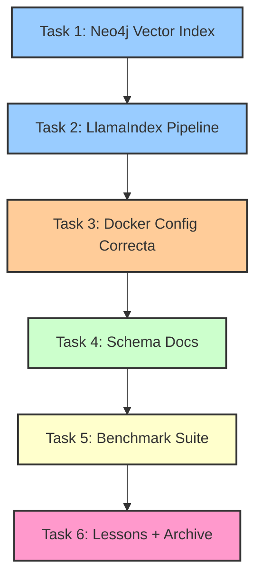

# Architecture Best Practices v1.0.0

## 🎯 Objetivo de este Spec

Implementar arquitectura óptima para Triple Persistencia MELQUISEDEC con best practices de RAG y Knowledge Graphs, basada en investigación académica (34 papers) y análisis competitivo (Obsidian Smart Connections).

**Contexto**: Tras investigación profunda, identificamos que la arquitectura debe usar **Neo4j native vectors** (no Redis), **pipeline formal de documentos**, y **schema explícito** de Autopoiesis.

**Estado**: 🆕 Nuevo spec
**Spec Path**: `C:\proyectos\aleia-melquisedec\.spec-workflow\specs\architecture-best-practices`

---

## 📋 Artefactos del Spec

### Core Documents
- [[requirements]] - 4 User Stories (basadas en gaps G1-G4), REQs, NFRs
- [[design]] - Arquitectura óptima: Neo4j unified, LlamaIndex pipeline, Schema docs
- [[tasks]] - 6 tasks con rostros DAATH-ZEN + MCPs

### Implementation
- `Implementation Logs/` - Logs por task
- `_meta/lessons-learned/` - Lessons + summary.yaml

---

## 🔑 Gaps Resueltos (de análisis previo)

### G1: **Neo4j Native Vectors** (no Redis dual storage)
**Problema**: Arquitectura con Redis para vectores + Neo4j para grafos crea complejidad innecesaria.
**Solución**: Neo4j 5.15.0+ soporta HNSW nativo (1-4096 dims, cosine/euclidean, quantization).
**Impacto**: Queries unificadas, latencia reducida, sin sincronización dual.

### G2: **Pipeline Formal de Documentos**
**Problema**: No está documentado el proceso Markdown → Chunks → Embeddings → Storage.
**Solución**: Implementar `MELQUISEDECPipeline` con LlamaIndex + Semantic Chunking (SCAN).
**Impacto**: Consistencia, debugging simplificado, onboarding claro.

### G3: **Schema de Autopoiesis Documentado**
**Problema**: `tools/setup/neo4j_schema.py` existe pero no está explicado en docs.
**Solución**: Crear ADR-002 y doc `06-schema-autopoiesis.md` con nodos/relaciones.
**Impacto**: Comprensión del sistema de aprendizaje continuo.

### G4: **Benchmarking Framework**
**Problema**: No hay validación cuantitativa vs alternativas (Smart Connections).
**Solución**: Suite de tests con métricas (Precision@k, Recall@k, MRR, Latency).
**Impacto**: Decisiones basadas en datos, validación de arquitectura.

---

## 🔄 Workflow de Ejecución



**Orden de prioridad**:
1. **Alta**: Tasks 1, 2, 3 (infraestructura crítica)
2. **Media**: Task 4 (documentación)
3. **Baja**: Task 5 (validación)

---

## 📊 Métricas de Éxito

| Métrica | Target | Validación |
|---------|--------|------------|
| Vector storage | Neo4j only (no Redis) | `docker ps` no muestra Redis para vectors |
| Neo4j vector index | Creado y funcional | Cypher query `SHOW INDEXES` incluye vector index |
| Pipeline pipeline code | Implementado | `packages/daath-toolkit/processors/document_pipeline.py` existe |
| Pipeline docs | Documentado | `docs/manifiesto/04-implementacion/` tiene guía de pipeline |
| Schema docs | ADR + diagram | `docs/manifiesto/02-arquitectura/06-schema-autopoiesis.md` existe |
| Benchmark suite | Tests passing | `pytest packages/daath-toolkit/testing/benchmark_*.py` pasa |
| Benchmark metrics | Baseline establecido | Archivo con Precision@k, Recall@k, MRR, Latency |

---

## 🧩 Rostros DAATH-ZEN Involucrados

- **SALOMON** (architect) - Tasks 1, 2 - Diseñar vector index, pipeline architecture
- **MORPHEUS** (implementer) - Tasks 1, 2, 3, 5 - Código Python, Cypher, Docker config
- **HYPATIA** (researcher) - Task 4 - Documentar schema de autopoiesis con rigor
- **MELQUISEDEC** (classifier) - Task 5 - Analizar resultados de benchmarks
- **ALMA** (publisher) - Task 6 - Consolidar lessons y publicar

---

## 🛠️ MCPs Recomendados

**Base** (todas las tasks): `neo4j-mcp`, `memory-mcp`, `filesystem-mcp`

**Specialized**:
- `neo4j-data-modeling` - Tasks 1, 4 (schema design, vector index config)
- `context7` - Task 2 (LlamaIndex docs lookup)
- `python-refactoring` - Tasks 2, 5 (pipeline code, benchmark tests)
- `sequential-thinking` - Tasks 1, 2, 5 (arquitectura compleja)

Ver [[docs/manifiesto/03-workflow/04-mcps-recomendados]] para descripciones completas.

---

## 📂 Estructura Post-Implementación

```
aleia-melquisedec/
├── docs/
│   └── manifiesto/
│       ├── 02-arquitectura/
│       │   ├── ADR-002-neo4j-unified-architecture.md  ← nuevo
│       │   └── 06-schema-autopoiesis.md               ← nuevo
│       └── 04-implementacion/
│           ├── 04-memoria-y-persistencia-triple.md    ← actualizado (sin Redis vectors)
│           ├── 05-analisis-arquitectura-best-practices.md ← ya existe
│           └── 06-pipeline-document-processing.md      ← nuevo
├── packages/
│   └── daath-toolkit/
│       ├── processors/
│       │   ├── __init__.py
│       │   └── document_pipeline.py                    ← nuevo (LlamaIndex)
│       └── testing/
│           ├── benchmark_vs_smart_connections.py       ← nuevo
│           └── fixtures/
│               └── test_notes_100.json                 ← nuevo
├── infrastructure/
│   └── docker/
│       └── docker-compose.yml                          ← actualizado (solo Neo4j + Ollama, sin Redis para vectors)
└── tools/
    └── setup/
        └── neo4j_schema.py                             ← ya existe, sin cambios
```

---

## 🔗 Referencias Clave

### Papers Académicos (34 total)
- **"Optimizing RAG Techniques for Automotive PDF Chatbots"** (arXiv 2024) - Multi-dimensional RAG optimization
- **"SCAN: Semantic Document Layout Analysis"** (arXiv 2024) - VLM-friendly chunking
- **"OnPrem.LLM: Privacy-Conscious Document Intelligence"** (arXiv 2024) - Statistical analysis pipeline
- **"Aryn Sycamore: LLM-powered Unstructured Analytics"** (arXiv 2024) - Declarative DocSets
- ... + 30 más sobre KG+embeddings, hybrid architectures

### Documentación Oficial
- Neo4j Vector Index: https://neo4j.com/docs/cypher-manual/current/indexes/semantic-indexes/vector-indexes/
- Neo4j APOC: https://neo4j.com/docs/apoc/current/overview/apoc.schema/
- LlamaIndex: https://docs.llamaindex.ai/en/stable/

### Código Competitivo Analizado
- Obsidian Smart Connections v4 (GitHub: brianpetro/obsidian-smart-connections) - 50+ excerpts

---

## 💡 Filosofía del Spec

Este spec se basa en **investigación empírica** (no opiniones):
1. ✅ **34 papers académicos** analizados
2. ✅ **Neo4j docs oficiales** (36,492 tokens)
3. ✅ **Código de Smart Connections** (50+ excerpts)
4. ✅ **Schema actual del proyecto** (`neo4j_schema.py`)

**Principio**: Implementar arquitectura óptima **desde el inicio**, no migrar (porque no hay nada implementado aún).

---

**Versión**: 1.0.0
**Fecha**: 2026-01-08
**Rostro autor**: SALOMON (Architect)
**Basado en**: `docs/manifiesto/04-implementacion/05-analisis-arquitectura-best-practices.md`
