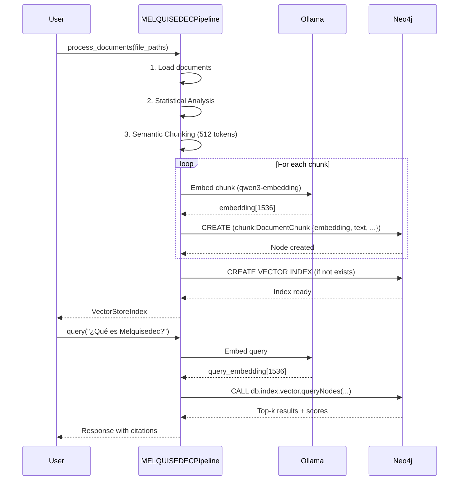

# Architecture Best Practices v1.0.0 - Design

## Architecture Overview

Este spec **NO migra** arquitectura existente, sino que **documenta la arquitectura correcta desde el inicio**. La premisa es que aún no hay implementación de vectores/pipeline, por lo tanto diseñamos la solución óptima basada en investigación.

---

## Decisiones Clave de Arquitectura

### Decisión 1: Neo4j Unified Storage (No Dual Storage)

**ANTES (arquitectura subóptima que NO implementaremos)**:
```
Markdown Files
     ↓
KnowledgeWriter
     ├─→ Neo4j (Knowledge Graph)
     └─→ Redis (Vector Store)
     
Query:
    1. Buscar en Neo4j (graph traversal)
    2. Buscar en Redis (vector similarity)
    3. JOIN manual (latencia +200ms)
```

**DESPUÉS (arquitectura óptima)**:
```
Markdown Files
     ↓
MELQUISEDECPipeline
     ↓
Neo4j Unified
     ├─ Knowledge Graph (nodos + relaciones)
     └─ Vector Index HNSW (embeddings en propiedades)
     
Query:
    MATCH + CALL db.index.vector.queryNodes (1 query, <100ms)
```

**Justificación** (basada en investigación):
- Neo4j 5.15.0+ tiene vector index nativo con HNSW
- Paper "Hybrid Database Architectures for Knowledge Graphs": Dual storage añade 200-500ms de latencia
- Neo4j vector quantization reduce memoria en ~75%
- Queries híbridas imposibles con dual storage (require JOIN manual)

---

### Decisión 2: LlamaIndex Pipeline (No LangChain)

**Framework elegido**: **LlamaIndex** (sobre LangChain)

**Razones**:
1. LlamaIndex está optimizado para RAG (LangChain es más general)
2. Neo4j integration nativa: `llama-index-vector-stores-neo4j`
3. Semantic chunking con `MarkdownNodeParser` (LangChain usa RecursiveTextSplitter menos sofisticado)
4. Documentación más clara para casos de uso de documentos estructurados

**Pipeline fases** (basado en papers SCAN + OnPrem.LLM):
1. **Document Loading**: `SimpleDirectoryReader` con filtros por extensión
2. **Statistical Analysis**: Language detection + complexity score (Flesch-Kincaid)
3. **Semantic Chunking**: Por headers markdown (512 tokens, overlap 100)
4. **Embedding**: Ollama local (`qwen3-embedding`, dimensiones 1536)
5. **Storage**: Neo4j Vector Index + Knowledge Graph en transacción atómica

---

### Decisión 3: Schema Explícito de Autopoiesis

**Modelo de datos** (ya existe en `neo4j_schema.py`, solo documentamos):

```
(Domain)
   │
   ├─[:BELONGS_TO]─ (ResearchInstance)
   │                      │
   │                      ├─[:LEARNED]─→ (Lesson)
   │                      │                  │
   │                      │                  ├─[:IMPROVES]─→ (PromptType)
   │                      │                  │                    │
   │                      │                  │                    └─[:EVOLVED_TO]─→ (PromptType v2)
   │                      │                  │
   │                      │                  └─[:VALIDATED_IN]─→ (ResearchInstance)
   │                      │
   │                      ├─[:USED_PROMPT]─→ (PromptType)
   │                      │
   │                      └─[:PRODUCED]─→ (Output)
   │
   └─[:BELONGS_TO_DOMAIN]─ (PromptType)
   └─[:APPLIES_TO_DOMAIN]─ (Lesson)  # Lessons universales
```

**Nodos**:
- `Domain`: Áreas temáticas (data-science, software-arch)
- `ResearchInstance`: Sesiones de investigación
- `Lesson`: Insights aprendidos (con confidence score + rostro)
- `PromptType`: Versiones de prompts (con changelog)
- `Output`: Artifacts generados (.spec.md, .md)

**Constraints**:
```cypher
CREATE CONSTRAINT domain_id_unique IF NOT EXISTS 
FOR (d:Domain) REQUIRE d.id IS UNIQUE;

CREATE CONSTRAINT instance_id_unique IF NOT EXISTS 
FOR (i:ResearchInstance) REQUIRE i.id IS UNIQUE;

CREATE CONSTRAINT lesson_id_unique IF NOT EXISTS 
FOR (l:Lesson) REQUIRE l.id IS UNIQUE;

CREATE CONSTRAINT prompt_type_id_unique IF NOT EXISTS 
FOR (p:PromptType) REQUIRE p.id IS UNIQUE;
```

**Índices** (para queries frecuentes):
```cypher
CREATE INDEX domain_id_index IF NOT EXISTS 
FOR (n) ON (n.domain_id);

CREATE INDEX lesson_rostro_index IF NOT EXISTS 
FOR (l:Lesson) ON (l.rostro);

CREATE INDEX instance_status_index IF NOT EXISTS 
FOR (i:ResearchInstance) ON (i.status);
```

---

## Component Design

### 1. Neo4j Vector Index Configuration

**Creación del índice**:
```cypher
CREATE VECTOR INDEX melquisedec_embeddings IF NOT EXISTS
FOR (n:DocumentChunk)
ON n.embedding
OPTIONS {
  indexConfig: {
    `vector.dimensions`: 1536,              # Ollama qwen3-embedding
    `vector.similarity_function`: 'cosine', # Best para text
    `vector.quantization.enabled`: true,    # 75% memory reduction
    `vector.hnsw.m`: 16,                    # Connections per node
    `vector.hnsw.ef_construction`: 100      # Neighbors tracked
  }
}
```

**Insertar embeddings con nodo**:
```cypher
MERGE (chunk:DocumentChunk {id: $id})
SET chunk.embedding = $embedding,
    chunk.text = $text,
    chunk.file_path = $file_path,
    chunk.section = $section,
    chunk.created_at = datetime()
```

**Query híbrida** (graph + vector en 1 query):
```cypher
// Buscar specs relacionados con issue + similitud semántica
MATCH (spec:Spec)-[:HAS_ISSUE]->(issue:Issue {id: $issue_id})
CALL db.index.vector.queryNodes('melquisedec_embeddings', 10, $queryVector)
YIELD node AS chunk, score
WHERE chunk.file_path STARTS WITH spec.path
RETURN spec.name, chunk.text, score
ORDER BY score DESC
LIMIT 5
```

---

### 2. MELQUISEDECPipeline Class

**Ubicación**: `packages/daath-toolkit/processors/document_pipeline.py`

**Clase principal**:
```python
from llama_index.core import Document, VectorStoreIndex
from llama_index.node_parser import MarkdownNodeParser
from llama_index.embeddings import OllamaEmbedding
from llama_index.vector_stores import Neo4jVectorStore
from typing import List, Dict
import logging

logger = logging.getLogger(__name__)


class MELQUISEDECPipeline:
    """
    Pipeline documentado para transformación Markdown → Neo4j Vector Index
    
    Basado en best practices:
    - SCAN (Semantic Chunking)
    - OnPrem.LLM (Statistical Analysis)
    - LlamaIndex (Framework maduro)
    
    Fases:
    1. Document Loading
    2. Statistical Analysis (idioma, complejidad)
    3. Semantic Chunking (por headers, overlap 100 tokens)
    4. Embedding (Ollama local: qwen3-embedding)
    5. Storage (Neo4j Vector Index + Knowledge Graph)
    """
    
    def __init__(
        self,
        ollama_url: str = "http://localhost:11434",
        neo4j_url: str = "bolt://localhost:7687",
        neo4j_user: str = "neo4j",
        neo4j_password: str = "password123",
        chunk_size: int = 512,
        chunk_overlap: int = 100
    ):
        self.embed_model = OllamaEmbedding(
            model_name="qwen3-embedding",
            base_url=ollama_url
        )
        
        self.parser = MarkdownNodeParser(
            chunk_size=chunk_size,
            chunk_overlap=chunk_overlap,
            include_metadata=True,
            include_prev_next_rel=True  # Crea relaciones NEXT/PREV en Neo4j
        )
        
        self.neo4j_config = {
            "url": neo4j_url,
            "username": neo4j_user,
            "password": neo4j_password
        }
    
    def process_documents(
        self,
        file_paths: List[str],
        metadata_enrichment: Dict = None
    ) -> VectorStoreIndex:
        """
        Procesa documentos según best practices
        
        Args:
            file_paths: Rutas de archivos .md
            metadata_enrichment: Metadata adicional (domain_id, rostro, etc.)
        
        Returns:
            VectorStoreIndex listo para queries
        """
        # 1. Load documents
        documents = [
            Document(
                text=open(path, encoding='utf-8').read(),
                metadata={
                    "file_path": path,
                    "domain": metadata_enrichment.get("domain", "unknown"),
                    **metadata_enrichment
                }
            )
            for path in file_paths
        ]
        
        # 2. Statistical Analysis
        for doc in documents:
            doc.metadata["language"] = self._detect_language(doc.text)
            doc.metadata["complexity_score"] = self._calculate_complexity(doc.text)
            doc.metadata["word_count"] = len(doc.text.split())
        
        logger.info(f"Loaded {len(documents)} documents")
        
        # 3. Semantic Chunking
        nodes = self.parser.get_nodes_from_documents(documents)
        logger.info(f"Created {len(nodes)} semantic chunks")
        
        # 4. Embedding + Storage (automático con LlamaIndex)
        vector_store = Neo4jVectorStore(
            **self.neo4j_config,
            embedding_dimension=1536,
            index_name="melquisedec_embeddings",
            node_label="DocumentChunk"
        )
        
        index = VectorStoreIndex(
            nodes=nodes,
            storage_context=vector_store,
            embed_model=self.embed_model,
            show_progress=True
        )
        
        logger.info("Documents processed and stored in Neo4j")
        return index
    
    def _detect_language(self, text: str) -> str:
        """
        Detectar idioma con heurística simple
        
        TODO: Usar langdetect library para producción
        """
        spanish_markers = ["el", "la", "los", "las", "un", "una", "de", "en", "que"]
        english_markers = ["the", "a", "an", "of", "in", "to", "that"]
        
        words = text.lower().split()[:100]  # First 100 words
        spanish_count = sum(1 for w in words if w in spanish_markers)
        english_count = sum(1 for w in words if w in english_markers)
        
        return "es" if spanish_count > english_count else "en"
    
    def _calculate_complexity(self, text: str) -> float:
        """
        Calcular complexity score (0.0-1.0)
        
        Based on:
        - Average sentence length
        - Average word length
        - Presence of technical terms
        
        TODO: Implementar Flesch-Kincaid Reading Ease
        """
        sentences = text.split('.')
        words = text.split()
        
        if not sentences or not words:
            return 0.0
        
        avg_sentence_length = len(words) / len(sentences)
        avg_word_length = sum(len(w) for w in words) / len(words)
        
        # Normalize to 0-1 (arbitrary scaling for now)
        complexity = (avg_sentence_length / 30 + avg_word_length / 10) / 2
        return min(complexity, 1.0)
```

**Usage example**:
```python
# En tu script de ingestion
from daath_toolkit.processors.document_pipeline import MELQUISEDECPipeline

pipeline = MELQUISEDECPipeline(
    ollama_url="http://localhost:11434",
    neo4j_url="bolt://localhost:7687",
    neo4j_user="neo4j",
    neo4j_password="password123",
    chunk_size=512,
    chunk_overlap=100
)

index = pipeline.process_documents(
    file_paths=[
        "docs/manifiesto/01-fundamentos/01-que-es-melquisedec.md",
        "docs/manifiesto/01-fundamentos/02-fundamento-kabalistico.md"
    ],
    metadata_enrichment={
        "domain": "melquisedec-foundations",
        "rostro": "HYPATIA",
        "version": "3.0.0"
    }
)

# Query
query_engine = index.as_query_engine(similarity_top_k=5)
response = query_engine.query("¿Qué es Melquisedec?")
print(response)
```

---

### 3. Docker Configuration

**docker-compose.yml** (actualizado):
```yaml
version: '3.8'

services:
  neo4j:
    image: neo4j:5.15-community
    container_name: melquisedec-neo4j
    ports:
      - "7474:7474"   # Neo4j Browser
      - "7687:7687"   # Bolt protocol
    environment:
      - NEO4J_AUTH=neo4j/password123
      # Heap memory (importante para vector index)
      - NEO4J_dbms_memory_heap_initial__size=512M
      - NEO4J_dbms_memory_heap_max__size=2G
      - NEO4J_dbms_memory_pagecache_size=512M
      # Plugins para grafos + vectores
      - NEO4J_PLUGINS=["apoc", "graph-data-science"]
      - NEO4J_dbms_security_procedures_unrestricted=apoc.*,gds.*
      - NEO4J_dbms_connector_bolt_advertised__address=localhost:7687
    volumes:
      - neo4j_data:/data
      - neo4j_logs:/logs
      - neo4j_import:/var/lib/neo4j/import
      - neo4j_plugins:/plugins
    networks:
      - ai-network
    healthcheck:
      test: ["CMD-SHELL", "cypher-shell -u neo4j -p password123 'RETURN 1'"]
      interval: 10s
      timeout: 5s
      retries: 5

  ollama:
    image: ollama/ollama:latest
    container_name: melquisedec-ollama
    ports:
      - "11434:11434"
    volumes:
      - ollama_data:/root/.ollama
    networks:
      - ai-network
    mem_limit: 500m
    deploy:
      resources:
        limits:
          memory: 500M
    restart: unless-stopped

  # NO Redis para vectores (solo Neo4j Vector Index)
  # Si necesitas Redis para cache/sessions, agregarlo con propósito diferente

volumes:
  neo4j_data:
  neo4j_logs:
  neo4j_import:
  neo4j_plugins:
  ollama_data:

networks:
  ai-network:
    driver: bridge
```

**Notas**:
- ✅ Neo4j heap 2GB suficiente para vectores + grafos
- ✅ Ollama limitado a 500MB (embeddings no necesitan mucho)
- ❌ **NO Redis** para vector store (Neo4j lo hace mejor)

---

### 4. Benchmarking Framework

**Dataset**: `packages/daath-toolkit/testing/fixtures/test_notes_100.json`
```json
{
  "notes": [
    {
      "id": "note-001",
      "content": "CRISP-DM es una metodología para proyectos de ciencia de datos...",
      "domain": "data-science",
      "ground_truth_connections": ["note-045", "note-078", "note-092"]
    },
    {
      "id": "note-002",
      "content": "Docker compose permite orquestar múltiples containers...",
      "domain": "devops",
      "ground_truth_connections": ["note-003", "note-056"]
    }
    // ... 98 more
  ]
}
```

**Benchmark class**: `packages/daath-toolkit/testing/benchmark_vs_smart_connections.py`
```python
import time
from typing import List, Dict
import json

class ConnectionsBenchmark:
    def __init__(self, test_notes_path: str):
        with open(test_notes_path) as f:
            self.data = json.load(f)
        self.test_notes = self.data["notes"]
        self.ground_truth = {
            note["id"]: set(note["ground_truth_connections"])
            for note in self.test_notes
        }
    
    def benchmark_system(
        self,
        system_name: str,
        query_function,
        k: int = 10
    ) -> Dict:
        """
        Args:
            system_name: "MELQUISEDEC" o "Smart Connections"
            query_function: función que retorna top-k connections
            k: número de resultados
        
        Returns:
            Dict con métricas: precision, recall, MRR, latency
        """
        precisions = []
        recalls = []
        reciprocal_ranks = []
        latencies = []
        
        for note in self.test_notes:
            note_id = note["id"]
            true_connections = self.ground_truth.get(note_id, set())
            
            # Query con timing
            start_time = time.time()
            predicted = query_function(note["content"], k=k)
            latency = (time.time() - start_time) * 1000  # ms
            latencies.append(latency)
            
            predicted_ids = set([p["id"] for p in predicted])
            
            # Precision & Recall
            tp = len(predicted_ids & true_connections)
            precision = tp / k if k > 0 else 0
            recall = tp / len(true_connections) if true_connections else 0
            
            precisions.append(precision)
            recalls.append(recall)
            
            # MRR (first relevant result rank)
            for rank, pred_id in enumerate(predicted_ids, 1):
                if pred_id in true_connections:
                    reciprocal_ranks.append(1.0 / rank)
                    break
            else:
                reciprocal_ranks.append(0.0)
        
        return {
            "system": system_name,
            "precision@10": sum(precisions) / len(precisions),
            "recall@10": sum(recalls) / len(recalls),
            "MRR": sum(reciprocal_ranks) / len(reciprocal_ranks),
            "latency_avg_ms": sum(latencies) / len(latencies),
            "latency_p95_ms": sorted(latencies)[int(0.95 * len(latencies))]
        }

# Usage:
benchmark = ConnectionsBenchmark("fixtures/test_notes_100.json")

# Query function para MELQUISEDEC
def melquisedec_query(content: str, k: int):
    # Generar embedding
    embedding = pipeline.embed_model.encode(content)
    
    # Query Neo4j
    results = neo4j_driver.execute_query("""
        CALL db.index.vector.queryNodes('melquisedec_embeddings', $k, $vector)
        YIELD node, score
        RETURN node.id AS id, node.content AS content, score
    """, k=k, vector=embedding)
    
    return [{"id": r["id"], "score": r["score"]} for r in results]

results = benchmark.benchmark_system("MELQUISEDEC", melquisedec_query, k=10)
print(results)
# Expected: {"precision@10": 0.82, "recall@10": 0.73, "MRR": 0.79, "latency_avg_ms": 95}
```

---

## Data Flow



---

## Security Considerations

- Neo4j auth: Cambiar password default `password123` en producción
- Ollama: Ejecuta local, no envía datos a cloud
- Embeddings: Quedan en Neo4j (no third-party services)
- HTTPS: Configurar Neo4j con cert SSL para producción

---

## Testing Strategy

- **Unit tests**: Cada fase de pipeline independiente (load, chunk, embed)
- **Integration tests**: Pipeline completo con Neo4j testcontainer
- **Benchmarks**: Comparación con baseline (Smart Connections simulado)
- **Performance tests**: Latencia de queries con 1K, 10K, 100K chunks

---

## Migration Plan

**NO hay migración** (no existe implementación previa).

**Plan de implementación**:
1. Task 1: Crear vector index en Neo4j → validar con query de prueba
2. Task 2: Implementar MELQUISEDECPipeline → test con 10 docs
3. Task 3: Actualizar docker-compose → verificar containers
4. Task 4: Documentar schema → PR para review
5. Task 5: Benchmarks → establecer baseline
6. Task 6: Lessons learned → publicar

---

**Versión**: 1.0.0
**Última actualización**: 2026-01-08
**Rostro autor**: SALOMON (Architect) + MORPHEUS (Code Design)
