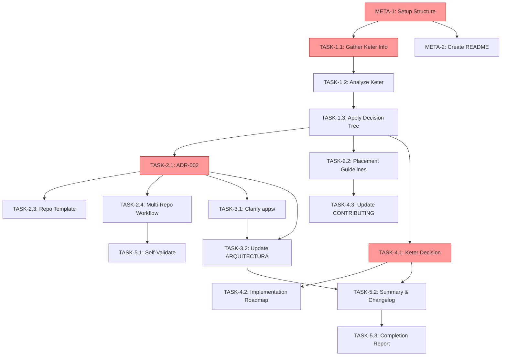

# Research App Integration v1.0.0 - Tasks

## Overview
Este task board implementa el análisis y decisión arquitectónica sobre integración de apps de investigación (caso: keter) en el ecosistema DAATH-ZEN.

**Status**: 🟡 NOT STARTED  
**Priority**: HIGH (decisión arquitectónica fundamental)  
**Estimated Duration**: 3-4 sesiones de trabajo

---

## Phase 1: Discovery & Analysis 🔍

### TASK-1.1: Gather Keter Information
**Owner**: Developer + User  
**Priority**: ⚡ CRITICAL (bloquea análisis)  
**Estimated Time**: 30 min

**Description**:
Obtener información estructural de keter ya que está fuera del workspace actual.

**Acceptance Criteria**:
- [ ] Usuario proporciona tree structure de keter
- [ ] requirements.txt o pyproject.toml obtenido
- [ ] README o descripción del propósito disponible
- [ ] Al menos 1 archivo .py de ejemplo revisado

**Approach**:
1. Solicitar al usuario: `tree C:\proyectos\aleia-bereshit\apps\keter /F > keter-structure.txt`
2. Solicitar archivos clave: requirements, README
3. O usar terminal para copiar info si es posible

**Output**: `analysis/keter-raw-data.md`

---

### TASK-1.2: Analyze Keter Structure
**Owner**: AI Agent  
**Priority**: HIGH  
**Estimated Time**: 45 min  
**Depends On**: TASK-1.1

**Description**:
Analizar la estructura, dependencias y propósito de keter usando el framework de análisis.

**Acceptance Criteria**:
- [ ] ComponentMetadata completo para keter
- [ ] Scorecard multidimensional generado
- [ ] Identificadas dependencies externas
- [ ] Evaluado nivel de madurez (tests, docs)

**Approach**:
```python
# Ejecutar análisis estructurado
analyzer = ComponentAnalyzer()
metadata = analyzer.analyze(keter_data)
scorecard = metadata.to_scorecard()
```

**Output**: `analysis/keter-evaluation.md` con scorecard

---

### TASK-1.3: Apply Decision Tree to Keter
**Owner**: AI Agent  
**Priority**: HIGH  
**Estimated Time**: 30 min  
**Depends On**: TASK-1.2

**Description**:
Aplicar el decision tree a keter para determinar placement recomendado.

**Acceptance Criteria**:
- [ ] Decision tree ejecutado paso a paso
- [ ] Placement recommendation con confidence score
- [ ] Rationale documentado para cada decisión
- [ ] Action items identificados

**Approach**:
1. Evaluar cada criterio del decision tree
2. Documentar en formato: "Criterio X → Resultado Y → Siguiente paso Z"
3. Generar recomendación final

**Output**: `analysis/keter-decision.md`

---

## Phase 2: Architecture Documentation 📐

### TASK-2.1: Create ADR-002 Multi-Repo Strategy
**Owner**: AI Agent  
**Priority**: ⚡ CRITICAL  
**Estimated Time**: 1 hour

**Description**:
Documentar la estrategia arquitectónica multi-repositorio como ADR formal.

**Acceptance Criteria**:
- [ ] ADR completo con 5 secciones estándar
- [ ] Rationale basado en análisis de pensamiento complejo
- [ ] Consequences (pros/cons) identificadas
- [ ] Mitigation strategies para cons

**Template**:
```markdown
# ADR-002: Multi-Repository Architecture Strategy
## Status: Accepted
## Context: [...]
## Decision: [...]
## Consequences: [...]
## Compliance: [...]
```

**Output**: `docs/architecture/ADR-002-multi-repo-strategy.md`

---

### TASK-2.2: Create Component Placement Guidelines
**Owner**: AI Agent  
**Priority**: HIGH  
**Estimated Time**: 1 hour

**Description**:
Crear decision tree visual y guidelines para clasificar componentes futuros.

**Acceptance Criteria**:
- [ ] Flowchart Mermaid del decision tree
- [ ] Tabla de criterios y umbrales
- [ ] 3 ejemplos aplicados (incluido keter)
- [ ] FAQ con casos edge

**Sections**:
1. Introduction
2. Decision Tree Flowchart (Mermaid)
3. Criteria Explanation
4. Examples
5. FAQ

**Output**: `docs/guides/component-placement-guidelines.md`

---

### TASK-2.3: Create New Research Repo Template
**Owner**: AI Agent  
**Priority**: MEDIUM  
**Estimated Time**: 1 hour

**Description**:
Documentar template completo para nuevos repos de investigación.

**Acceptance Criteria**:
- [ ] Estructura de directorios completa
- [ ] pyproject.toml template con daath-toolkit dependency
- [ ] .gitignore, .pre-commit-config.yaml incluidos
- [ ] README.md template con badge DAATH-ZEN
- [ ] GitHub Actions template básico

**Structure**:
```
aleia-{name}/
├── README.md (template)
├── PROPOSITO.md (template)
├── pyproject.toml (template)
├── .gitignore
├── .pre-commit-config.yaml
├── apps/{name}/
│   ├── 0-inbox/
│   ├── 1-literature/
│   ├── 2-atomic/
│   ├── 3-workbook/
│   ├── 4-dataset/
│   ├── 5-outputs/
│   └── _daath/
└── tools/
```

**Output**: `docs/guides/new-research-repo-template.md`

---

### TASK-2.4: Create Multi-Repo Spec Workflow Guidelines
**Owner**: AI Agent  
**Priority**: MEDIUM  
**Estimated Time**: 45 min

**Description**:
Documentar cómo gestionar specs que involucran múltiples repositorios.

**Acceptance Criteria**:
- [ ] Tracking conventions definidas
- [ ] 3 scenarios cubiertos (spec multi-repo, nuevo repo, cambios afectando múltiples)
- [ ] Ejemplo práctico con tags `[REPO:...]`
- [ ] Integration con spec-workflow existente

**Output**: `docs/guides/multi-repo-spec-workflow.md`

---

## Phase 3: Repository Cleanup 🧹

### TASK-3.1: Clarify apps/ Purpose in Melquisedec
**Owner**: AI Agent  
**Priority**: MEDIUM  
**Estimated Time**: 30 min

**Description**:
Decidir y documentar el rol de `apps/` en melquisedec: ¿examples/ o mantener con README claro?

**Acceptance Criteria**:
- [ ] Decisión tomada (Opción A, B o C de design.md)
- [ ] Si rename: ejecutar `git mv apps/ examples/`
- [ ] README.md en carpeta actualizado
- [ ] ARQUITECTURA_MONOREPO.md actualizado

**Decision Options**:
- **A**: Rename to `examples/`
- **B**: Keep `apps/` but explicit README
- **C**: Remove, move 00-template to packages/daath-toolkit/templates/

**Recommendation**: Opción B (menor impacto, más claro)

**Output**: Updated README in apps/ + ARQUITECTURA_MONOREPO.md

---

### TASK-3.2: Update ARQUITECTURA_MONOREPO.md
**Owner**: AI Agent  
**Priority**: MEDIUM  
**Estimated Time**: 30 min  
**Depends On**: TASK-2.1, TASK-3.1

**Description**:
Incorporar multi-repo strategy en documento de arquitectura principal.

**Acceptance Criteria**:
- [ ] Nueva sección: "Multi-Repository Strategy"
- [ ] Referencia a ADR-002
- [ ] Diagrama actualizado con repos externos
- [ ] apps/ o examples/ clarificado

**Changes**:
- Add section after "Estructura Optimizada"
- Update diagrams to show aleia-bereshit, aleia-{future}
- Link to ADR-002 and guidelines

**Output**: Updated `ARQUITECTURA_MONOREPO.md`

---

## Phase 4: Decision & Next Steps 🎯

### TASK-4.1: Document Keter Final Decision
**Owner**: AI Agent + User Approval  
**Priority**: ⚡ CRITICAL  
**Estimated Time**: 30 min  
**Depends On**: TASK-1.3

**Description**:
Basado en análisis, documentar decisión formal sobre el futuro de keter.

**Acceptance Criteria**:
- [ ] Decisión clara: A, B, C, o D (ver opciones abajo)
- [ ] Rationale documentado
- [ ] Action items específicos identificados
- [ ] Review date establecida (si procede)

**Decision Options** (from design.md):
- **A**: Mantener como App en Bereshit
- **B**: Convertir a Package (futuro spec)
- **C**: Promover a Repo Independiente (aleia-keter)
- **D**: Integrar en Daath-Toolkit

**Output**: `analysis/keter-decision.md`

---

### TASK-4.2: Create Implementation Roadmap (if applicable)
**Owner**: AI Agent  
**Priority**: LOW (depends on decision)  
**Estimated Time**: 30 min  
**Depends On**: TASK-4.1

**Description**:
Si la decisión requiere implementación (ej: packaging), crear roadmap de alto nivel.

**Acceptance Criteria**:
- [ ] Fases identificadas (ej: restructure → tests → package → publish)
- [ ] Timeframe estimado
- [ ] Dependencies y blockers
- [ ] Nota: "Detailed implementation = future spec"

**Only Execute If**: Decision is B, C, or D

**Output**: `analysis/keter-implementation-roadmap.md` (optional)

---

### TASK-4.3: Update CONTRIBUTING.md
**Owner**: AI Agent  
**Priority**: LOW  
**Estimated Time**: 20 min  
**Depends On**: TASK-2.2

**Description**:
Actualizar guía de contribución con nueva sección "Where to Contribute".

**Acceptance Criteria**:
- [ ] Nueva sección agregada
- [ ] Link a component placement guidelines
- [ ] Ejemplos de contribuciones por tipo (package, app, tool)

**Output**: Updated `CONTRIBUTING.md`

---

## Phase 5: Validation & Documentation 📋

### TASK-5.1: Self-Validate Spec Multi-Repo Compliance
**Owner**: AI Agent  
**Priority**: MEDIUM  
**Estimated Time**: 15 min

**Description**:
Verificar que este spec sigue sus propias guidelines para multi-repo.

**Acceptance Criteria**:
- [ ] Spec incluye tag `[MULTI-REPO: melquisedec, bereshit]` en header
- [ ] Logs referencian repos externos correctamente
- [ ] Implementation logs usan convención `[REPO:...]`

**Output**: Checklist en `Implementation Logs/validation-checklist.md`

---

### TASK-5.2: Generate Summary & Changelog
**Owner**: AI Agent  
**Priority**: MEDIUM  
**Estimated Time**: 20 min

**Description**:
Crear resumen ejecutivo y actualizar CHANGELOG.md.

**Acceptance Criteria**:
- [ ] Executive summary en spec README
- [ ] Bullet points de decisiones clave
- [ ] Entry en `CHANGELOG.md` con fecha
- [ ] Links a deliverables

**CHANGELOG Entry**:
```markdown
## [1.1.0] - 2026-01-XX

### Added
- ADR-002: Multi-Repository Architecture Strategy
- Component Placement Guidelines (decision tree)
- New Research Repo Template
- Multi-Repo Spec Workflow documentation

### Changed
- Clarified purpose of apps/ directory
- Updated ARQUITECTURA_MONOREPO.md with multi-repo strategy

### Decisions
- Keter: [Decision here based on analysis]
```

**Output**: Updated `CHANGELOG.md` + `README.md` in spec folder

---

### TASK-5.3: Create Spec Completion Report
**Owner**: AI Agent  
**Priority**: LOW  
**Estimated Time**: 15 min

**Description**:
Generar reporte final con métricas de completitud.

**Acceptance Criteria**:
- [ ] Todos los REQ-X validados
- [ ] Deliverables checklist completo
- [ ] Success criteria evaluados
- [ ] Lessons learned capturados

**Template**:
```markdown
# Completion Report: Research App Integration v1.0.0

## Requirements Fulfilled
- [x] REQ-1: Keter Analysis - ✅ Complete
- [x] REQ-2: ADR-002 - ✅ Complete
- [ ] ...

## Deliverables
- [x] ADR-002
- [ ] ...

## Success Criteria
- [x] Criterio 1: Claridad Arquitectónica - ✅ Met
- [ ] ...

## Lessons Learned
- ...

## Recommendations for v2.0.0
- ...
```

**Output**: `Implementation Logs/completion-report.md`

---

## Meta Tasks 🔧

### META-1: Setup Spec Folder Structure
**Owner**: AI Agent  
**Priority**: ⚡ IMMEDIATE  
**Estimated Time**: 5 min

**Description**:
Crear estructura de carpetas para organizar deliverables.

**Structure**:
```
research-app-integration-v1.0.0/
├── requirements.md
├── design.md
├── tasks.md (este archivo)
├── README.md (summary)
└── Implementation Logs/
    ├── session-01-YYYY-MM-DD.md
    ├── session-02-YYYY-MM-DD.md
    └── analysis/
        ├── keter-raw-data.md
        ├── keter-evaluation.md
        ├── keter-decision.md
        └── keter-implementation-roadmap.md (optional)
```

**Output**: Directory structure created

---

### META-2: Create Spec README
**Owner**: AI Agent  
**Priority**: MEDIUM  
**Estimated Time**: 15 min

**Description**:
Crear README.md del spec como punto de entrada.

**Content**:
- Purpose statement
- Status badge
- Quick links to requirements/design/tasks
- Summary of decisions (updated at end)
- Related specs

**Output**: `README.md` in spec folder

---

## Dependency Graph



**Legend**:
- 🔴 Critical Path
- ⚡ Immediate priority
- 🟡 Can be parallelized

---

## Execution Strategy

### Sprint 1: Discovery (Tasks 1.1-1.3)
**Goal**: Entender keter y aplicar análisis  
**Duration**: 1 session (2 hours)  
**Output**: keter evaluation & decision

### Sprint 2: Documentation (Tasks 2.1-2.4)
**Goal**: Crear artefactos arquitectónicos  
**Duration**: 1 session (2.5 hours)  
**Output**: 4 documentos guía

### Sprint 3: Cleanup (Tasks 3.1-3.2, 4.3)
**Goal**: Actualizar repo melquisedec  
**Duration**: 1 session (1.5 hours)  
**Output**: Repo actualizado con nuevas guidelines

### Sprint 4: Finalization (Tasks 4.1-4.2, 5.1-5.3)
**Goal**: Decisión final y cierre  
**Duration**: 1 session (1.5 hours)  
**Output**: Spec completo y validado

**Total Estimated Time**: 7.5 hours (4 sesiones de ~2h)

---

## Success Metrics

- ✅ **7 deliverables** creados (ADR, 3 guidelines, análisis keter, decisión, updates)
- ✅ **Decision tree** aplicable a casos futuros
- ✅ **Keter decision** clara y consensuada
- ✅ **0 ambiguity** sobre dónde poner código nuevo
- ✅ **Spec self-compliant** con guidelines multi-repo

---

## Notes

### Assumptions
- Usuario tiene acceso a keter y puede proporcionar info
- aleia-bereshit usa estructura compatible con análisis
- Decisiones son reversibles (pueden reevaluarse)

### Constraints
- No implementamos cambios en bereshit (fuera de scope)
- No configuramos CI/CD multi-repo (v2.0.0)
- No creamos tooling automatizado (repo generator) en v1.0.0

### Risks
- **Risk**: Keter inaccesible → **Mitigation**: Análisis genérico + placeholder
- **Risk**: Decisión controversial → **Mitigation**: Rationale transparente + review date
- **Risk**: Guidelines demasiado rígidas → **Mitigation**: "Guidelines, not rules" clause

---

## Ready to Start?

**Next Action**: Execute META-1 (setup structure) and TASK-1.1 (gather keter info)

**Command for User**:
```powershell
# Para obtener estructura de keter
cd C:\proyectos\aleia-bereshit\apps\keter
tree /F > keter-structure.txt
Get-Content keter-structure.txt

# Si tiene requirements
Get-Content requirements.txt

# Si tiene README
Get-Content README.md
```

¿Proceder? 🚀
