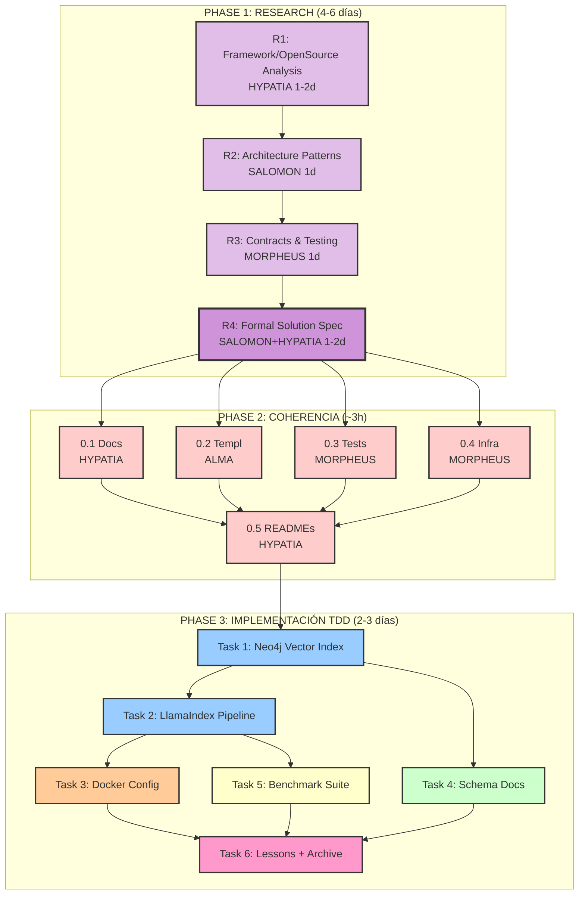

# Architecture Best Practices v2.0.0

## 🎯 Objetivo de este Spec

Implementar arquitectura óptima para Triple Persistencia MELQUISEDEC con best practices de RAG y Knowledge Graphs, mediante **investigación de soluciones existentes**, **spec formal**, y **TDD + QA**.

**Contexto**: Tras análisis inicial, identificamos necesidad de **investigar frameworks/proyectos open source robustos** (Neo4j GenAI Stack, LlamaIndex, etc.) ANTES de implementar, para **NO inventar la rueda** y adoptar patrones probados.

**Approach**: 3 Phases
1. **RESEARCH & FORMAL SPEC** (Tasks R1-R4): Investigar + crear spec formal completo
2. **COHERENCIA DOCUMENTAL** (Task 0): Actualizar 19 archivos antes de implementar
3. **IMPLEMENTACIÓN TDD** (Tasks 1-6): Implementar con Spec-First + TDD + SonarQube

**Estado**: 🆕 Spec v2.0 (refactorizado para incluir research phase)
**Spec Path**: `C:\proyectos\aleia-melquisedec\.spec-workflow\specs\triple-persistence-architecture-best-practices`

---

## 📋 Artefactos del Spec

### Core Documents
- [[requirements]] - 4 User Stories (basadas en gaps G1-G4), REQs, NFRs
- [[design]] - Arquitectura óptima: Neo4j unified, LlamaIndex pipeline, Schema docs
- [[tasks]] - **3 Phases**: Research (R1-R4) → Coherencia (Task 0) → Implementación TDD (Tasks 1-6)

### Implementation
- `Implementation Logs/` - Logs por task
- `_meta/lessons-learned/` - Lessons + summary.yaml
- `_research/` - **NUEVO**: Code patterns, framework comparison (Phase 1 output)

---

## 🔑 Gaps Resueltos (de análisis previo)

### G1: **Neo4j Native Vectors** (no Redis dual storage)
**Problema**: Arquitectura con Redis para vectores + Neo4j para grafos crea complejidad innecesaria.
**Solución**: Neo4j 5.15.0+ soporta HNSW nativo (1-4096 dims, cosine/euclidean, quantization).
**Impacto**: Queries unificadas, latencia reducida, sin sincronización dual.

### G2: **Pipeline Formal de Documentos**
**Problema**: No está documentado el proceso Markdown → Chunks → Embeddings → Storage.
**Solución**: Implementar `MELQUISEDECPipeline` con LlamaIndex + Semantic Chunking (SCAN).
**Impacto**: Consistencia, debugging simplificado, onboarding claro.

### G3: **Schema de Autopoiesis Documentado**
**Problema**: `tools/setup/neo4j_schema.py` existe pero no está explicado en docs.
**Solución**: Crear ADR-002 y doc `06-schema-autopoiesis.md` con nodos/relaciones.
**Impacto**: Comprensión del sistema de aprendizaje continuo.

### G4: **Benchmarking Framework**
**Problema**: No hay validación cuantitativa vs alternativas (Smart Connections).
**Solución**: Suite de tests con métricas (Precision@k, Recall@k, MRR, Latency).
**Impacto**: Decisiones basadas en datos, validación de arquitectura.

---

## 🔄 Workflow de Ejecución



**Orden de prioridad**:
1. **PHASE 1** (CRÍTICA): Research + Formal Spec - No inventar la rueda
2. **PHASE 2** (PRERREQUISITO): Coherencia documental - 19 archivos impactados
3. **PHASE 3**: Tasks 1-6 con TDD + SonarQube QA

---

## 📊 Métricas de Éxito

### Phase 1: Research & Formal Spec
| Métrica | Target | Validación |
|---------|--------|------------|
| Research report | ≥1500 líneas | `06-research-neo4j-llamaindex-ecosystem.md` existe |
| Code snippets extracted | ≥20 examples | `_research/code-patterns/*.py` creados |
| Architecture doc | ≥800 líneas + C4 diagrams | `07-hexagonal-architecture-melquisedec.md` completo |
| Formal solution spec | ≥2000 líneas | `08-formal-solution-spec.md` con 8+ secciones |
| Ports/interfaces defined | ≥5 contracts | `packages/daath-toolkit/domain/ports/*.py` |

### Phase 2: Coherencia Documental
| Métrica | Target | Validación |
|---------|--------|------------|
| Pinecone references removed | 0 matches | `grep -r "Pinecone"` en md/yaml/py |
| Redis vector refs removed | 0 matches | `grep -r "Redis.*vector"` en docs |
| Templates updated | Neo4j refs | `metadata.yaml` usa `neo4j_vector_index` |
| Tests refactored | Pasan con Neo4j mocks | `pytest packages/daath-toolkit/testing/` |

### Phase 3: Implementación TDD + QA
| Métrica | Target | Validación |
|---------|--------|------------|
| Vector storage | Neo4j only (no Redis) | `docker ps` no muestra Redis para vectors |
| Neo4j vector index | Creado y funcional | Cypher query `SHOW INDEXES` incluye vector index |
| Pipeline code | Implementado | `document_pipeline.py` existe |
| Test coverage | ≥80% | `pytest --cov` report |
| Code smells | 0 blocker/critical | SonarQube scan |
| Type hints | 100% public APIs | `mypy --strict` pasa |
| Benchmark suite | Tests passing | `pytest benchmark_*.py` pasa |

---

## 🧩 Rostros DAATH-ZEN Involucrados

- **SALOMON** (architect) - Tasks 1, 2 - Diseñar vector index, pipeline architecture
- **MORPHEUS** (implementer) - Tasks 1, 2, 3, 5 - Código Python, Cypher, Docker config
- **HYPATIA** (researcher) - Task 4 - Documentar schema de autopoiesis con rigor
- **MELQUISEDEC** (classifier) - Task 5 - Analizar resultados de benchmarks
- **ALMA** (publisher) - Task 6 - Consolidar lessons y publicar

---

## 🛠️ MCPs Recomendados

**Base** (todas las tasks): `neo4j-mcp`, `memory-mcp`, `filesystem-mcp`

**Specialized**:
- `neo4j-data-modeling` - Tasks 1, 4 (schema design, vector index config)
- `context7` - Task 2 (LlamaIndex docs lookup)
- `python-refactoring` - Tasks 2, 5 (pipeline code, benchmark tests)
- `sequential-thinking` - Tasks 1, 2, 5 (arquitectura compleja)

Ver [[docs/manifiesto/03-workflow/04-mcps-recomendados]] para descripciones completas.

---

## 📂 Estructura Post-Implementación

```
aleia-melquisedec/
├── docs/
│   └── manifiesto/
│       ├── 02-arquitectura/
│       │   ├── ADR-002-neo4j-unified-architecture.md  ← nuevo
│       │   └── 06-schema-autopoiesis.md               ← nuevo
│       └── 04-implementacion/
│           ├── 04-memoria-y-persistencia-triple.md    ← actualizado (sin Redis vectors)
│           ├── 05-analisis-arquitectura-best-practices.md ← ya existe
│           └── 06-pipeline-document-processing.md      ← nuevo
├── packages/
│   └── daath-toolkit/
│       ├── processors/
│       │   ├── __init__.py
│       │   └── document_pipeline.py                    ← nuevo (LlamaIndex)
│       └── testing/
│           ├── benchmark_vs_smart_connections.py       ← nuevo
│           └── fixtures/
│               └── test_notes_100.json                 ← nuevo
├── infrastructure/
│   └── docker/
│       └── docker-compose.yml                          ← actualizado (solo Neo4j + Ollama, sin Redis para vectors)
└── tools/
    └── setup/
        └── neo4j_schema.py                             ← ya existe, sin cambios
```

---

## 🔗 Referencias Clave

### Papers Académicos (34 total)
- **"Optimizing RAG Techniques for Automotive PDF Chatbots"** (arXiv 2024) - Multi-dimensional RAG optimization
- **"SCAN: Semantic Document Layout Analysis"** (arXiv 2024) - VLM-friendly chunking
- **"OnPrem.LLM: Privacy-Conscious Document Intelligence"** (arXiv 2024) - Statistical analysis pipeline
- **"Aryn Sycamore: LLM-powered Unstructured Analytics"** (arXiv 2024) - Declarative DocSets
- ... + 30 más sobre KG+embeddings, hybrid architectures

### Documentación Oficial
- Neo4j Vector Index: https://neo4j.com/docs/cypher-manual/current/indexes/semantic-indexes/vector-indexes/
- Neo4j APOC: https://neo4j.com/docs/apoc/current/overview/apoc.schema/
- LlamaIndex: https://docs.llamaindex.ai/en/stable/

### Código Competitivo Analizado
- Obsidian Smart Connections v4 (GitHub: brianpetro/obsidian-smart-connections) - 50+ excerpts

---

## 💡 Filosofía del Spec

Este spec se basa en **investigación empírica** (no opiniones):
1. ✅ **34 papers académicos** analizados
2. ✅ **Neo4j docs oficiales** (36,492 tokens)
3. ✅ **Código de Smart Connections** (50+ excerpts)
4. ✅ **Schema actual del proyecto** (`neo4j_schema.py`)

**Principio**: Implementar arquitectura óptima **desde el inicio**, no migrar (porque no hay nada implementado aún).

---

**Versión**: 2.0.0
**Fecha**: 2026-01-08
**Cambios v2.0.0**:
- ✅ **PHASE 1 agregada**: Research & Formal Spec (Tasks R1-R4) - NO inventar la rueda
- ✅ **Metodología TDD + SonarQube** agregada a Phase 3 (80% coverage, 0 code smells)
- ✅ **Spec formal de solución** (≥2000 líneas) como output de Phase 1
- ✅ Investigar frameworks robustos: Neo4j GenAI Stack, LlamaIndex, etc.
- ✅ Hexagonal Architecture + DDD patterns
- ✅ Contracts/interfaces formales antes de implementación
**Rostros autores**: SALOMON (Architect) + MELQUISEDEC (Impact Analysis) + HYPATIA (Research Strategy)
**Basado en**: `docs/manifiesto/04-implementacion/05-analisis-arquitectura-best-practices.md` + user feedback
