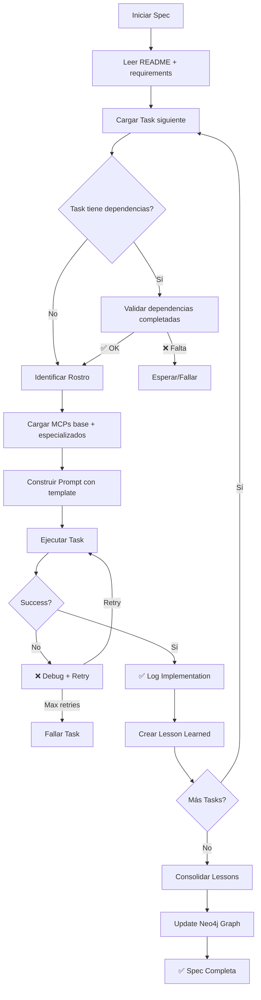

# Orchestrator - DAATH-ZEN Workflow

## Propósito

Este documento describe el patrón de orquestación DAATH-ZEN para ejecutar specs de forma sistemática.

## Workflow General



## Roles de Rostros

| Rostro | Especialización | Tasks típicas |
|--------|-----------------|---------------|
| **SALOMON** | Architect, Analyzer | Diseño de arquitectura, ADRs, decisiones de alto nivel |
| **MORPHEUS** | Implementer, Designer | Código Python, scripts, pipelines, DevOps |
| **HYPATIA** | Researcher, Documenter | Investigación académica, documentación rigurosa |
| **MELQUISEDEC** | Analyzer, Validator | Análisis de datos, benchmarking, validación de métricas |
| **ALMA** | Publisher, Integrator | Consolidación de docs, lessons learned, actualizaciones de graph |

## MCPs por Rostro

### Base MCPs (todos los rostros)
- `neo4j-mcp`: Interacción con Neo4j graph
- `memory-mcp`: Persistencia de contexto
- `filesystem-mcp`: Lectura/escritura de archivos

### Especializados por Rostro

**SALOMON**:
- `sequential-thinking`: Análisis complejo paso a paso
- `neo4j-data-modeling`: Diseño de schema

**MORPHEUS**:
- `python-refactoring`: Análisis y refactor de código
- `python-env`: Gestión de entornos Python

**HYPATIA**:
- `context7`: Documentación de librerías
- `brave-search`: Investigación web
- `research-papers`: Papers académicos

**MELQUISEDEC**:
- `sequential-thinking`: Análisis de datos complejo
- `python-refactoring`: Benchmarking code

**ALMA**:
- `grep-search`: Búsqueda de contenido
- `neo4j-data-modeling`: Actualización de graph

## Estructura de Prompt

Cada task en `tasks.md` incluye un template de prompt con esta estructura:

```
Role: [ROSTRO] [Especialización]

Task: [Descripción detallada de la tarea, incluyendo artefactos esperados]

Restrictions: [Constraints técnicos, preservación de funcionalidad existente, límites de alcance]

Success: [Criterios de aceptación específicos y verificables]
```

## Logs de Implementación

Cada task ejecutada genera un log en `Implementation Logs/task-N-log.md`:

```markdown
# Implementation Log: Task N - [Nombre]

**Rostro**: [ROSTRO]
**Started**: 2026-01-08T10:00:00Z
**Completed**: 2026-01-08T12:30:00Z
**Duration**: 2h 30m

## Context
[Contexto inicial, estado del sistema]

## Actions Taken
1. [Acción 1]
2. [Acción 2]
3. ...

## Artifacts Created
- [ ] File 1: path/to/file1.py
- [ ] File 2: path/to/file2.md

## Validation Results
- ✅ Test 1 passed
- ✅ Test 2 passed
- ⚠️ Test 3 warning (acceptable)

## Challenges Encountered
- [Challenge 1]: [Solución aplicada]

## Notes
[Observaciones adicionales]
```

## Lessons Learned

Después de cada task, se crea un lesson learned en `_meta/lessons-learned/task-N-X.md`:

```markdown
# Lesson: [Título]

## Context
[Contexto de la tarea]

## What Worked
- [Qué funcionó bien]

## Challenges
- [Desafíos encontrados y cómo se resolvieron]

## Key Insight
[Insight principal que se puede reutilizar]

## Reusable Pattern
```[language]
# Código o patrón reutilizable
```

## Confidence: [0.0-1.0]
## Rostro: [ROSTRO]
## Scope: [universal | domain | project-specific]
```

Al final del spec, `summary.yaml` consolida todas las lessons.

## Validación de Coherencias

Antes de ejecutar cada task, validar coherencias críticas del spec (definidas en README.md):

1. **Syntax check**: Si la task modifica código, verificar sintaxis (linting)
2. **Path check**: Si menciona paths, verificar que existen
3. **Link check**: Si actualiza docs, verificar links no se rompan
4. **Test check**: Si crea código, verificar que tests pasan

## Rollback Strategy

Si una task falla después de N retries:

1. Marcar task como FAILED en log
2. Revertir cambios (git checkout)
3. Documentar issue en `_meta/issues/task-N-failure.md`
4. Decidir:
   - Skip y continuar (si no bloquea otras tasks)
   - Fix manual y retry
   - Abort spec

## Finalización del Spec

Al completar todas las tasks:

1. Ejecutar `Task 6: Lessons Learned` (si no ejecutada aún)
2. Generar `summary.yaml`
3. Actualizar Neo4j graph con lessons
4. Marcar spec como ✅ **COMPLETA** en README.md
5. Actualizar CHANGELOG.md del proyecto

## Ejemplo de Ejecución

```bash
# Ejecutar spec completo (automatizado)
python tools/spec-runner.py --spec architecture-best-practices --auto

# Ejecutar task específica (manual)
python tools/spec-runner.py --spec architecture-best-practices --task 2

# Generar lessons (después de completar todas las tasks)
python tools/spec-runner.py --spec architecture-best-practices --generate-lessons
```

---

**Versión**: 1.0.0
**Última actualización**: 2026-01-08
**Referencias**:
- Patrón derivado de `.spec-workflow/specs/monorepo-improvements/`
- DAATH-ZEN: `_templates/daath-zen-patterns/`
