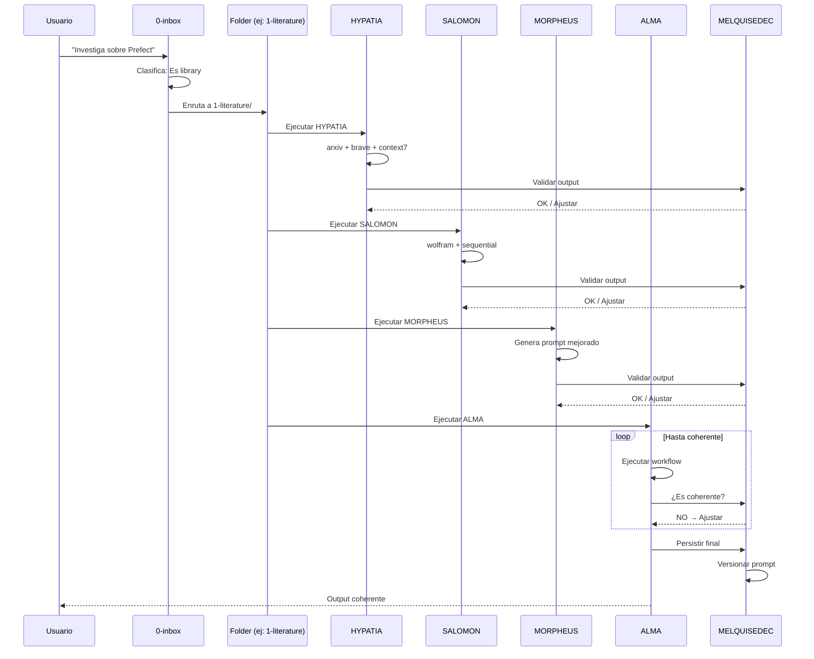

# DAATH-ZEN v2.0.0

> **Receta de Procesamiento por Folder**
> Cada folder tiene su daath-zen.md específico

---

## Metadata

```yaml
daath_zen:
  id: "DAATH-ZEN-002"
  version: "2.0.0"
  created: "2026-01-02"
  updated: "2026-01-02"
  research_instance: "RI-MDA-001"
  base: "TPL_MELQUISEDEC_SPEC v5.0.0"

filosofia:
  principio: "Cada folder ejecuta los 4 rostros con su daath-zen específico"
  inbox: "Solo clasifica y enruta"
  alma: "Ejecuta e itera hasta coherencia"
  melquisedec: "Valida después de CADA rostro"
```

---

## Modelo General

```
┌─────────────────────────────────────────────────────────────────────────┐
│  MODELO DAATH-ZEN v2.0.0                                                │
├─────────────────────────────────────────────────────────────────────────┤
│                                                                         │
│  /0-inbox/                                                              │
│     └── daath-zen.md → SOLO CLASIFICA                                   │
│         ├── ¿Es book, paper, library, dataset?                          │
│         ├── ¿Es nuevo o actualización?                                  │
│         └── → Enruta al folder correspondiente                          │
│                                                                         │
│  /1-literature/                                                         │
│     ├── paper/.daath/daath-zen.md      (papers académicos)              │
│     ├── book/.daath/daath-zen.md       (libros)                         │
│     ├── web/.daath/daath-zen.md        (artículos web, blogs)           │
│     ├── tech/.daath/daath-zen.md       (library, framework, mcp, tool)  │
│     ├── spec/.daath/daath-zen.md       (RFC, ISO, W3C, IEEE)            │
│     ├── methodology/.daath/daath-zen.md (CRISP-DM, SCRUM, PMBOK)        │
│     ├── legal/.daath/daath-zen.md      (Ley, Decreto, Resolución)       │
│     └── normativo/.daath/daath-zen.md  (NTC, RETIE, Guías técnicas)     │
│                                                                         │
│  /2-atomic/                                                             │
│     └── daath-zen.md          (notas atómicas)                          │
│                                                                         │
│  /3-workbook/, /4-indexes/, /5-dataset/, /6-outputs/                    │
│     └── daath-zen.md          (específico por folder)                   │
│                                                                         │
└─────────────────────────────────────────────────────────────────────────┘
```

---

## Los 4 Rostros + MELQUISEDEC

```
┌─────────────────────────────────────────────────────────────────────────┐
│  DENTRO DE CADA FOLDER                                                  │
├─────────────────────────────────────────────────────────────────────────┤
│                                                                         │
│  ┌─────────────┐                                                        │
│  │  HYPATIA    │ → Comprender, buscar, proponer ontología               │
│  │  (MCPs)     │   [arxiv, brave, wikipedia, context7]                  │
│  └──────┬──────┘                                                        │
│         │ MELQUISEDEC: validar, persistir                               │
│         ▼                                                               │
│  ┌─────────────┐                                                        │
│  │  SALOMON    │ → Especificar, formalizar, clasificar                  │
│  │  (MCPs)     │   [wolfram, sequential-thinking, python]               │
│  └──────┬──────┘                                                        │
│         │ MELQUISEDEC: validar, persistir                               │
│         ▼                                                               │
│  ┌─────────────┐                                                        │
│  │  MORPHEUS   │ → Construir prompt dinámico para PRÓXIMAS iteraciones  │
│  │  (MCPs)     │   [prefect, python, e2b]                               │
│  └──────┬──────┘                                                        │
│         │ MELQUISEDEC: validar, persistir                               │
│         ▼                                                               │
│  ┌─────────────────────────────────────────────────────────────────┐    │
│  │  ALMA = EJECUTOR ITERATIVO                                       │    │
│  │                                                                   │    │
│  │  while not coherent:                                              │    │
│  │      output = execute(workflow)                                   │    │
│  │      coherent = melquisedec.validate(output)                      │    │
│  │      if not coherent:                                             │    │
│  │          adjust(prompt)                                           │    │
│  │                                                                   │    │
│  │  persist(output)                                                  │    │
│  │  version(prompt)                                                  │    │
│  └─────────────────────────────────────────────────────────────────┘    │
│                                                                         │
└─────────────────────────────────────────────────────────────────────────┘
```

---

## Diagrama de Secuencia: Flujo Completo



---

## Versionado como Issues

```yaml
# Cada item en inbox = 1 issue

issue:
  id: "issue-001-library-prefect"
  type: "library"
  status: "open"  # open | in_progress | closed
  version: "1.0.0"
  created: "2026-01-02"

  # Lifecycle
  # Crear = v1.0.0
  # Update = v1.0.1, v1.1.0
  # Cerrar = moved to 1-literature/
```

---

## MCPs por Rostro

### HYPATIA (Comprender)

| MCP | Propósito | Cuando usar |
|-----|-----------|-------------|
| `arxiv` | Papers académicos | Investigación formal |
| `brave` | Búsqueda web | Contexto general |
| `wikipedia` | Enciclopedia | Definiciones |
| `context7` | Docs librerías | Librerías técnicas |
| `perplexity` | AI search | Preguntas complejas |

### SALOMON (Formalizar)

| MCP | Propósito | Cuando usar |
|-----|-----------|-------------|
| `wolfram-alpha` | Cálculos | Matemáticas |
| `sequential-thinking` | Razonamiento | Síntesis |
| `mcp-code-interpreter` | Python | Análisis |

### MORPHEUS (Automatizar)

| MCP | Propósito | Cuando usar |
|-----|-----------|-------------|
| `prefect` | Workflows | Automatización |
| `e2b` | Sandbox code | Ejecución segura |
| `playwright` | Browser | Scraping JS |

### MELQUISEDEC (Persistir)

| MCP | Propósito | Cuando usar |
|-----|-----------|-------------|
| `memory` | Graph JSON | Siempre |
| `neo4j` | Graph DB | Relaciones complejas |
| `chroma` | Embeddings | Búsqueda semántica |

### ALMA (Ejecutar + Iterar)

| MCP | Propósito | Cuando usar |
|-----|-----------|-------------|
| `gworkspace` | Google Docs | Documentos formales |
| Filesystem | Markdown | Notas locales |

---

## Estructura de daath-zen Específico

Cada folder tiene su daath-zen.md con:

```yaml
# Template para daath-zen-{tipo}.md

metadata:
  folder: "1-literature"
  tipo: "paper"  # book | paper | library | etc.
  version: "1.0.0"

# 1. HYPATIA: Qué buscar
hypatia:
  mcps: [arxiv, brave]
  queries:
    - "{titulo} methodology"
    - "{autor} research"
  output: "fuentes encontradas"

# 2. SALOMON: Cómo formalizar
salomon:
  mcps: [sequential-thinking]
  template: |
    - Título:
    - Autores:
    - Abstract:
    - Hallazgos clave:
    - Relevancia para RI:
  output: "spec formalizada"

# 3. MORPHEUS: Prompt para próxima iteración
morpheus:
  genera: "prompt mejorado basado en output"
  persiste_en: ".daath/ai-working/prompts/"
  output: "prompt_v{n+1}.md"

# 4. ALMA: Loop hasta coherente
alma:
  execute: |
    while not coherent:
        run(hypatia, salomon, morpheus)
        coherent = melquisedec.validate()
  output: "artefacto final + prompt mejorado"

# MELQUISEDEC: Después de cada rostro
melquisedec:
  after_each_rostro:
    - validar_output
    - persistir_en_memory
    - crear_relaciones
  final:
    - versionar_prompt
    - cerrar_issue
```

---

## Output de Cada Folder

```
OUTPUT = datos persistidos + prompt mejorado

/1-literature/paper-crisp-dm/
├── ISSUE.yaml           # Metadata del issue
├── content.md           # Contenido procesado
├── prompt_v1.0.0.md     # Prompt inicial
├── prompt_v1.1.0.md     # Prompt mejorado (por MORPHEUS)
└── .melquisedec/        # Validaciones
    ├── hypatia_ok.yaml
    ├── salomon_ok.yaml
    ├── morpheus_ok.yaml
    └── alma_ok.yaml
```

---

## Estado de daath-zen por Folder

### Completados ✅

| Folder | daath-zen | Estado |
|--------|-----------|--------|
| `0-inbox/` | `daath-zen.md` | ✅ Clasificador |
| `1-literature/paper/` | `.daath/daath-zen.md` | ✅ Papers académicos |
| `1-literature/book/` | `.daath/daath-zen.md` | ✅ Libros |
| `1-literature/web/` | `.daath/daath-zen.md` | ✅ Contenido web |
| `1-literature/tech/` | `.daath/daath-zen.md` | ✅ Docs técnicos |
| `1-literature/spec/` | `.daath/daath-zen.md` | ✅ Estándares |
| `1-literature/methodology/` | `.daath/daath-zen.md` | ✅ Metodologías |
| `1-literature/legal/` | `.daath/daath-zen.md` | ✅ Marco jurídico |
| `1-literature/normativo/` | `.daath/daath-zen.md` | ✅ Normativa sectorial |

### Pendientes 🔄

| Folder | daath-zen | Estado |
|--------|-----------|--------|
| `2-atomic/` | `daath-zen.md` | 🔄 Notas atómicas |
| `3-workbook/` | `daath-zen.md` | 🔄 Workflows |
| `4-indexes/` | `daath-zen.md` | 🔄 Índices |
| `5-dataset/` | `daath-zen.md` | 🔄 Datasets |
| `6-outputs/` | `daath-zen.md` | 🔄 Outputs |

---

## Referencias

- [Zettelkasten Inbox Processing](https://zettelkasten.de/posts/create-zettel-from-reading-notes/)
- [Atomic Notes Guide](https://zettelkasten.de/atomicity/guide/)
- [Prefect Retry Loop Pattern](https://docs.prefect.io/v3/advanced/interactive)
- [TPL_MELQUISEDEC_SPEC v5.0.0](../../../../guides/res-spec/TPL_MELQUISEDEC_SPEC/README.md)

---

*DAATH-ZEN v2.0.0 - Receta de Procesamiento por Folder*
