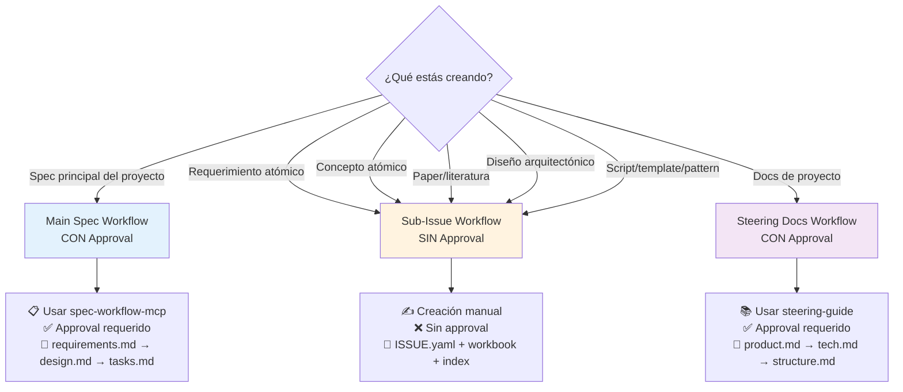
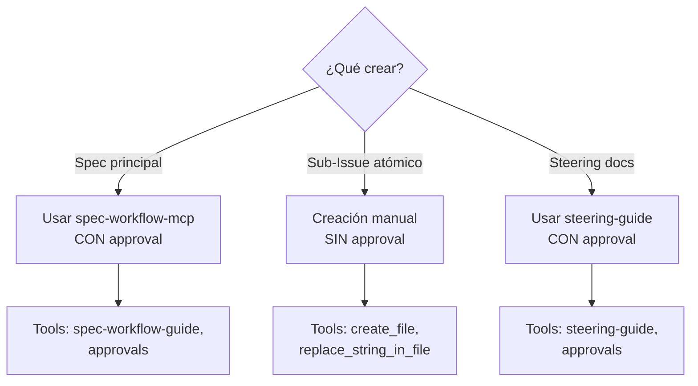

# 🔍 Gap Analysis: INDICE-COMPLETO-ARTEFACTOS + spec-workflow-mcp
## Análisis de Brechas y Propuesta de Integración

> **Versión:** 1.0.0
> **Fecha:** 2026-01-09
> **Propósito:** Identificar gaps en INDICE v2.0 y proponer integración con spec-workflow-mcp
> **Método:** Análisis comparativo línea por línea con documentación oficial MCP

---

## 📊 Resumen Ejecutivo

### Hallazgos Principales

**✅ Fortalezas del INDICE v2.0:**
- Arquitectura atómica bien definida (193 documentos, 100-300 líneas cada uno)
- Clasificación clara por issue-types (REQ, CONCEPT, LIT, DESIGN, IMPL)
- ISSUE.yaml structures completas por tipo
- Principios alineados (Zettelkasten, Issue-Driven, "Menos es Más")
- Roadmap visual con dependencias y timeline (16 semanas)

**❌ Gaps Identificados:**
1. ❌ **No explica workflow oficial de spec-workflow-mcp** (Requirements → Design → Tasks → Implementation)
2. ❌ **No distingue Main Spec vs Sub-Issues** (diferentes workflows)
3. ❌ **No documenta approval workflow** (request → poll → clean)
4. ❌ **No menciona steering docs workflow** (product.md, tech.md, structure.md)
5. ❌ **No especifica cuándo usar spec-workflow tools vs manual creation**
6. ❌ **Falta columna "spec-workflow Integration"** en tablas de artefactos
7. ❌ **No documenta implementation logging** (artifacts tracking)
8. ❌ **No explica custom templates** (user-templates/ overrides)

### Solución Propuesta

**Agregar columna "spec-workflow Integration" a todas las tablas** con:
- Workflow específico (Main Spec CON approval vs Sub-Issue SIN approval)
- Tools MCP a usar (`mcp_spec-workflow2_*`)
- Estructura de archivos resultante
- Timing del proceso (cuándo usar approval, cuándo manual)

---

## 🔍 Análisis Detallado por Sección

### SECCIÓN 1: TIPO 1 - REQUERIMIENTOS (REQ-XXX)

#### Estado Actual en INDICE v2.0

```markdown
| ID | Nombre | Prioridad | Tamaño Est. | Dependencias |
|----|--------|-----------|-------------|--------------|
| REQ-001 | Template System Architecture | 🔴 ALTA | 180 líneas | CONCEPT-017, LIT-003 |
| REQ-002 | Pattern Registry | 🔴 ALTA | 150 líneas | CONCEPT-018, REQ-001 |
...
```

#### Gap Identificado

❌ **Falta columna "spec-workflow Integration"**
- No especifica si REQ-001 es Main Spec o Sub-Issue
- No menciona approval workflow
- No documenta tools MCP necesarios
- No explica estructura de archivos resultante

#### Propuesta de Mejora

**Agregar columna nueva:**

| ID | Nombre | Prioridad | Tamaño | Dependencias | **spec-workflow Integration** |
|----|--------|-----------|--------|--------------|-------------------------------|
| REQ-001 | Template System | 🔴 ALTA | 180 líneas | CONCEPT-017, LIT-003 | **🎯 Sub-Issue Workflow (SIN Approval)**<br/><br/>**Estructura:**<br/>```<br/>.spec-workflow/specs/REQ-001-template-system/<br/>  ├── ISSUE.yaml (manual)<br/>  └── spec-config.yaml (OPCIONAL)<br/><br/>010-define/workbooks/<br/>  └── REQ-001-template-system.md (180 líneas)<br/><br/>010-define/<br/>  └── requirements.md (actualizar índice)<br/>```<br/><br/>**Workflow:**<br/>1. Create directory `.spec-workflow/specs/REQ-001-template-system/`<br/>2. Generate `ISSUE.yaml` manualmente (NO usar spec-workflow templates)<br/>3. OPCIONAL: Generate `spec-config.yaml` si necesitas tasks<br/>4. Create workbook `010-define/workbooks/REQ-001-template-system.md`<br/>5. Update index `010-define/requirements.md` (agregar `[[REQ-001]]`)<br/>6. Mark done cuando workbook esté completo<br/><br/>**Tools:** Manual file creation (NO usar `mcp_spec-workflow2_approvals`)<br/><br/>**Timing:** ~2 horas (no incluye approval overhead) |

**Explicación:**
- **Sub-Issue:** REQ-001 es componente atómico, no el spec principal
- **SIN Approval:** No necesita approval workflow (solo Main Spec lo necesita)
- **Manual Creation:** ISSUE.yaml se crea manualmente, no desde templates de spec-workflow
- **OPCIONAL spec-config.yaml:** Solo si quieres auto-generar tasks (raramente necesario para sub-issues)

---

### SECCIÓN 2: TIPO 2 - CONCEPTOS (CONCEPT-XXX)

#### Estado Actual en INDICE v2.0

```markdown
**Categoría 1: Fundamentos Metodológicos (10)**
- CONCEPT-001: Autopoiesis (Maturana & Varela)
- CONCEPT-002: Design Science Research
...
```

#### Gap Identificado

❌ **Falta estructura de tabla con columna "spec-workflow Integration"**
- Conceptos listados como bullet points sin metadata
- No especifica ubicación de archivos
- No menciona workflow

#### Propuesta de Mejora

**Convertir a tabla con columna nueva:**

| ID | Concepto | Categoría | Tamaño | **spec-workflow Integration** |
|----|----------|-----------|--------|-------------------------------|
| CONCEPT-001 | Autopoiesis | Foundational | 100 líneas | **🧠 Concept Issue (SIN Approval)**<br/><br/>**Estructura:**<br/>```<br/>.spec-workflow/specs/CONCEPT-001-autopoiesis/<br/>  └── ISSUE.yaml (concept metadata)<br/><br/>020-conceive/02-atomics/<br/>  └── CONCEPT-001-autopoiesis.md (100 líneas)<br/><br/>020-conceive/<br/>  └── concepts-index.md (actualizar)<br/>```<br/><br/>**Workflow:**<br/>1. Create directory `.spec-workflow/specs/CONCEPT-001-autopoiesis/`<br/>2. Generate `ISSUE.yaml` con:<br/>   - `concept.term`, `concept.definition`, `concept.origin`<br/>   - `related_concepts`, `literature`, `used_in`<br/>3. Create document `020-conceive/02-atomics/CONCEPT-001-autopoiesis.md`<br/>4. Update index `020-conceive/concepts-index.md`<br/>5. Link bidireccionalmente:<br/>   - En LIT-006: "Ver también [[CONCEPT-001]]"<br/>   - En REQ-007: "Aplica [[CONCEPT-001]]"<br/><br/>**Tools:** Manual creation<br/><br/>**Timing:** ~30 minutos por concepto<br/><br/>**Obsidian:** Graph view mostrará red conceptual |

---

### SECCIÓN 3: TIPO 3 - LITERATURA (LIT-XXX)

#### Estado Actual en INDICE v2.0

```markdown
**Área 1: Design Science (5 papers)**
- LIT-001: Hevner et al. (2004) - Design Science in IS Research
- LIT-002: Peffers et al. (2007) - DSR Process Model
...
```

#### Gap Identificado

❌ **Falta tabla estructurada y columna "spec-workflow Integration"**

#### Propuesta de Mejora

| ID | Paper | Área | Estado | **spec-workflow Integration** |
|----|-------|------|--------|-------------------------------|
| LIT-001 | Hevner et al. (2004) - Design Science in IS Research | DSR | to-read | **📚 Literature Issue (SIN Approval)**<br/><br/>**Estructura:**<br/>```<br/>.spec-workflow/specs/LIT-001-hevner-dsr/<br/>  └── ISSUE.yaml (paper metadata + relevance)<br/><br/>020-conceive/01-literature/<br/>  └── LIT-001-hevner-dsr.md (150 líneas notas)<br/><br/>020-conceive/<br/>  └── literature-index.md (actualizar status)<br/>```<br/><br/>**Workflow:**<br/>1. Create directory `.spec-workflow/specs/LIT-001-hevner-dsr/`<br/>2. Generate `ISSUE.yaml` con:<br/>   - `paper.title`, `paper.authors`, `paper.doi`<br/>   - `paper.relevance`, `paper.key_concepts`<br/>   - `applied_in` (qué REQ/DESIGN lo usan)<br/>   - `reading_status: to-read`<br/>3. Leer paper y crear notas `020-conceive/01-literature/LIT-001-hevner-dsr.md`<br/>4. Update `reading_status: completed` en ISSUE.yaml<br/>5. Update index `literature-index.md` (✅ mark completed)<br/>6. Link desde REQ/DESIGN relevantes:<br/>   - En REQ-001: "Basado en [[LIT-001]]"<br/><br/>**Tools:** Manual creation<br/><br/>**Timing:** ~1-2 horas (lectura + notas)<br/><br/>**Tracking:** Status en index (to-read/reading/completed) |

---

### SECCIÓN 4: TIPO 4 - DISEÑOS (DESIGN-XXX)

#### Estado Actual en INDICE v2.0

```markdown
| ID | Nombre | Tamaño Est. | ADRs | Implementa |
|----|--------|-------------|------|------------|
| DESIGN-001 | Triple Persistence Architecture | 280 líneas | ADR-001, ADR-009, ADR-010 | REQ-004, REQ-012, REQ-013 |
...
```

#### Gap Identificado

❌ **Falta columna "spec-workflow Integration"**

#### Propuesta de Mejora

| ID | Nombre | Tamaño | ADRs | Implementa | **spec-workflow Integration** |
|----|--------|--------|------|------------|-------------------------------|
| DESIGN-001 | Triple Persistence Architecture | 280 líneas | ADR-001, ADR-009, ADR-010 | REQ-004, REQ-012, REQ-013 | **🏛️ Design Issue (SIN Approval)**<br/><br/>**Estructura:**<br/>```<br/>.spec-workflow/specs/DESIGN-001-triple-persistence/<br/>  └── ISSUE.yaml (component + key decisions)<br/><br/>030-design/workbooks/<br/>  └── DESIGN-001-triple-persistence.md (280 líneas)<br/><br/>030-design/<br/>  ├── architecture-index.md (actualizar)<br/>  └── adrs/<br/>      ├── ADR-001-triple-persistence.md<br/>      ├── ADR-009-neo4j-schema.md<br/>      └── ADR-010-vector-embedding.md<br/>```<br/><br/>**Workflow:**<br/>1. Create directory `.spec-workflow/specs/DESIGN-001-triple-persistence/`<br/>2. Generate `ISSUE.yaml` con:<br/>   - `design.component`, `design.purpose`<br/>   - `design.key_decisions` (cada decisión con rationale)<br/>   - `adrs` (lista de ADR-XXX que documenta)<br/>   - `implements` (lista de REQ-XXX)<br/>3. Create workbook `030-design/workbooks/DESIGN-001-triple-persistence.md`<br/>4. Create ADRs (3 archivos) en `030-design/adrs/`<br/>5. Update index `architecture-index.md`<br/><br/>**Tools:** Manual creation<br/><br/>**Timing:** ~3-4 horas (diseño + 3 ADRs)<br/><br/>**ADR Template:** Usar Michael Nygard format |

---

### SECCIÓN 5: TIPO 5 - IMPLEMENTACIONES (IMPL-XXX)

#### Estado Actual en INDICE v2.0

```markdown
**Scripts (22)**
- IMPL-001 a IMPL-022: init-spec.py, validate-spec.py, etc.

**Templates (28)**
- IMPL-023 a IMPL-050: ISSUE.yaml, requirements.md, ADR.md, etc.
...
```

#### Gap Identificado

❌ **Falta tabla estructurada y columna "spec-workflow Integration"**
❌ **No menciona implementation logging** (log-implementation tool)

#### Propuesta de Mejora

| ID | Tipo | Nombre | Tamaño | **spec-workflow Integration** |
|----|------|--------|--------|-------------------------------|
| IMPL-001 | Script | init-spec.py | 180 líneas | **🔨 Implementation Issue + Logging**<br/><br/>**Estructura:**<br/>```<br/>.spec-workflow/specs/IMPL-001-init-spec-py/<br/>  └── ISSUE.yaml (algorithm + inputs/outputs)<br/><br/>040-build/specifications/<br/>  └── IMPL-001-init-spec-py.md (180 líneas spec)<br/><br/>040-build/scripts/<br/>  └── init-spec.py (implementation)<br/><br/>.spec-workflow/specs/autopoietic-templates/<br/>  └── Implementation Logs/<br/>      └── IMPL-001_timestamp.md (auto-generated)<br/>```<br/><br/>**Workflow:**<br/>1. Create directory `.spec-workflow/specs/IMPL-001-init-spec-py/`<br/>2. Generate `ISSUE.yaml` con:<br/>   - `implementation.algorithm` (8 steps)<br/>   - `implementation.inputs`, `implementation.outputs`<br/>   - `implements` (DESIGN-003)<br/>   - `test_coverage: "≥80%"`<br/>3. Create spec `040-build/specifications/IMPL-001-init-spec-py.md`<br/>4. Implement code `040-build/scripts/init-spec.py`<br/>5. Write tests (≥80% coverage)<br/>6. **CRITICAL: Log implementation con MCP tool:**<br/>   ```javascript<br/>   mcp_spec-workflow2_log-implementation(<br/>     taskId: "IMPL-001",<br/>     summary: "Implemented init-spec.py with 8 steps",<br/>     artifacts: {<br/>       functions: [<br/>         {<br/>           name: "create_directory_structure",<br/>           signature: "create_directory_structure(spec_path: Path) -> None",<br/>           location: "init-spec.py:45-78"<br/>         },<br/>         {<br/>           name: "apply_issue_template",<br/>           signature: "apply_issue_template(spec_name: str, spec_type: str) -> dict",<br/>           location: "init-spec.py:80-120"<br/>         }<br/>       ]<br/>     }<br/>   )<br/>   ```<br/>7. Mark done en index<br/><br/>**Tools:**<br/>- `mcp_spec-workflow2_log-implementation` (CRITICAL)<br/><br/>**Timing:** ~5 horas (spec + implementation + tests)<br/><br/>**Purpose of Logging:**<br/>- Future agents can grep logs para descubrir código existente<br/>- Evita reimplementar funciones que ya existen<br/>- Crea knowledge base searchable |

**Explicación de log-implementation:**
- **¿Por qué?** Prevenir que futuros agents reimplementen código que ya existe
- **¿Cuándo?** Después de completar cada implementación (IMPL-XXX)
- **¿Qué incluir?**
  - `apiEndpoints`: Todos los endpoints API creados/modificados
  - `components`: Todos los componentes UI creados
  - `functions`: Todas las funciones utility creadas
  - `classes`: Todas las clases creadas
  - `integrations`: Conexiones frontend-backend con data flow
- **¿Dónde se guarda?** `.spec-workflow/specs/{main-spec}/Implementation Logs/`
- **¿Cómo buscar?** `grep -r "init_spec|create_directory" Implementation Logs/`

---

### SECCIÓN 6: Main Spec vs Sub-Issues

#### Gap Crítico Identificado

❌ **El INDICE no distingue entre:**
1. **Main Spec** (autopoietic-templates) - CON approval workflow
2. **Sub-Issues** (REQ-XXX, CONCEPT-XXX, etc.) - SIN approval workflow

Esto causa confusión sobre cuándo usar qué workflow.

#### Propuesta de Mejora

**Agregar sección explicativa:**

```markdown
## 🎯 Distinguir Main Spec vs Sub-Issues

### Main Spec: autopoietic-templates

**¿Qué es?**
- El spec principal del proyecto
- Define visión, arquitectura, estrategia general
- Contiene requirements.md, design.md, tasks.md del SISTEMA COMPLETO

**¿Cuándo usar?**
- Al inicio del proyecto (crear spec principal)
- Para cambios arquitectónicos mayores
- Para features que afectan múltiples componentes

**Workflow:**
1. ✅ **CON Approval** (dashboard o VS Code extension)
2. Load `mcp_spec-workflow2_spec-workflow-guide()`
3. Create `requirements.md` siguiendo template oficial
4. `mcp_spec-workflow2_approvals(action: request, filePath: ...)`
5. Poll status hasta `approved`
6. `mcp_spec-workflow2_approvals(action: delete)`
7. Repeat para `design.md` y `tasks.md`

**Estructura:**
```
.spec-workflow/specs/autopoietic-templates/
├── ISSUE.yaml (visión general del proyecto)
├── requirements.md (APROBACIÓN REQUERIDA)
├── design.md (APROBACIÓN REQUERIDA)
├── tasks.md (APROBACIÓN REQUERIDA)
└── Implementation Logs/ (auto-generado)
```

**Documentación:** Ver [ISSUE-DRIVEN-SPEC-WORKFLOW-INTEGRATION.md](ISSUE-DRIVEN-SPEC-WORKFLOW-INTEGRATION.md#main-spec-workflow-con-approval)

---

### Sub-Issues: REQ-XXX, CONCEPT-XXX, LIT-XXX, DESIGN-XXX, IMPL-XXX

**¿Qué son?**
- Componentes atómicos del sistema
- Issues independientes y trackeables
- Workbooks de 100-300 líneas

**¿Cuándo usar?**
- Para cada requerimiento específico (REQ-XXX)
- Para cada concepto atómico (CONCEPT-XXX)
- Para cada paper/literatura (LIT-XXX)
- Para cada diseño arquitectónico (DESIGN-XXX)
- Para cada implementación (IMPL-XXX)

**Workflow:**
1. ❌ **SIN Approval** (creación manual)
2. Create directory `.spec-workflow/specs/TYPE-XXX/`
3. Generate `ISSUE.yaml` manualmente (NO usar templates de spec-workflow)
4. Create workbook en phase directory (010-define/, 020-conceive/, etc.)
5. Update index (requirements.md, concepts-index.md, etc.)
6. OPCIONAL: Generate tasks.md si necesitas sub-tasks

**Estructura:**
```
.spec-workflow/specs/REQ-001-template-system/
├── ISSUE.yaml (Gap/Goal/Outcomes específico)
└── spec-config.yaml (OPCIONAL - solo si generas tasks)

010-define/workbooks/
└── REQ-001-template-system.md (180 líneas)

010-define/
└── requirements.md (actualizar índice)
```

**Documentación:** Ver [ISSUE-DRIVEN-SPEC-WORKFLOW-INTEGRATION.md](ISSUE-DRIVEN-SPEC-WORKFLOW-INTEGRATION.md#sub-issue-workflow-sin-approval)

---

### Decisión: ¿Cuál usar?


```

---

### SECCIÓN 7: Steering Docs

#### Gap Identificado

❌ **El INDICE no menciona steering docs workflow**
- product.md, tech.md, structure.md
- Documentación a nivel de proyecto (opcional)

#### Propuesta de Mejora

**Agregar sección:**

```markdown
## 📚 Steering Docs (OPCIONAL)

### ¿Qué son?

Documentos de guía a nivel de proyecto que establecen:
- **product.md:** Visión, goals, usuarios, roadmap
- **tech.md:** Stack tecnológico, arquitectura, ADRs globales
- **structure.md:** Organización de código, convenciones, patterns

### ¿Cuándo crear?

**SOLO SI:**
- Proyecto grande (≥3 personas)
- Codebase establecido (no nuevo proyecto)
- Necesitas alinear equipo con visión compartida
- Usuario lo solicita explícitamente

**NO crear si:**
- Proyecto pequeño (1-2 personas)
- Nuevo proyecto (aún no hay codebase)
- Información ya está en Main Spec (autopoietic-templates)

### Workflow

1. Load `mcp_spec-workflow2_steering-guide()`
2. Create `product.md` siguiendo template
3. `mcp_spec-workflow2_approvals(action: request, filePath: ...)`
4. Poll status hasta `approved`
5. `mcp_spec-workflow2_approvals(action: delete)`
6. Repeat para `tech.md` y `structure.md`

### Estructura

```
.spec-workflow/steering/
├── product.md (APROBACIÓN REQUERIDA)
├── tech.md (APROBACIÓN REQUERIDA)
└── structure.md (APROBACIÓN REQUERIDA)
```

### Timing

- ~1 hora por documento
- ~3 horas total (3 documentos + approvals)

### Documentación

Ver [ISSUE-DRIVEN-SPEC-WORKFLOW-INTEGRATION.md](ISSUE-DRIVEN-SPEC-WORKFLOW-INTEGRATION.md#steering-docs-workflow-con-approval)
```

---

### SECCIÓN 8: Custom Templates

#### Gap Identificado

❌ **El INDICE no menciona user-templates/ override mechanism**

#### Propuesta de Mejora

**Agregar sección:**

```markdown
## 🎨 Custom Templates (user-templates/)

### ¿Qué son?

Overrides de templates oficiales de spec-workflow-mcp.

### Estructura

```
.spec-workflow/
├── templates/              # Templates oficiales (auto-populated)
│   ├── requirements-template.md
│   ├── design-template.md
│   └── tasks-template.md
│
└── user-templates/         # CUSTOM overrides
    ├── requirements-template.md   # OVERRIDES official
    └── design-template.md         # OVERRIDES official
```

### ¿Cuándo usar?

**Usar custom templates SI:**
- Necesitas estructura diferente para requirements.md
- Quieres agregar secciones adicionales
- Tu proyecto tiene convenciones específicas

**NO usar custom templates SI:**
- Templates oficiales cubren tus necesidades (95% de casos)
- No tienes razón específica para override

### Workflow

1. Check oficial: `mcp_spec-workflow2_spec-workflow-guide()` primero intenta leer desde `user-templates/`
2. Si no existe custom template, usa official de `templates/`
3. **Priority:** `user-templates/` > `templates/`

### Ejemplo

```markdown
# .spec-workflow/user-templates/requirements-template.md

# Requirements

## Custom Section: Success Metrics
<!-- Esta sección no existe en template oficial -->

## User Stories (EARS Criteria)
<!-- Estructura diferente al template oficial -->
```

### Documentación

- Templates oficiales: Ver `.spec-workflow/templates/` (auto-populated)
- Custom overrides: Crear en `.spec-workflow/user-templates/`
```

---

## 📊 Tabla Maestra de Integración

### Propuesta: Agregar esta tabla al INDICE

```markdown
## 🔗 Tabla Maestra: Issue Types + spec-workflow Integration

| Issue Type | Prefix | Workflow | Approval? | Tools MCP | Ubicación | Timing |
|------------|--------|----------|-----------|-----------|-----------|--------|
| **Main Spec** | autopoietic-templates | Requirements → Design → Tasks | ✅ SÍ (dashboard) | `spec-workflow-guide`<br/>`approvals` | `.spec-workflow/specs/autopoietic-templates/` | ~6-8h (con approvals) |
| **Steering Docs** | product/tech/structure | Product → Tech → Structure | ✅ SÍ (dashboard) | `steering-guide`<br/>`approvals` | `.spec-workflow/steering/` | ~3h (con approvals) |
| **Requerimiento** | REQ-XXX | Manual creation | ❌ NO | Manual files | `.spec-workflow/specs/REQ-XXX/`<br/>`010-define/workbooks/` | ~2h |
| **Concepto** | CONCEPT-XXX | Manual creation | ❌ NO | Manual files | `.spec-workflow/specs/CONCEPT-XXX/`<br/>`020-conceive/02-atomics/` | ~30min |
| **Literatura** | LIT-XXX | Manual creation | ❌ NO | Manual files | `.spec-workflow/specs/LIT-XXX/`<br/>`020-conceive/01-literature/` | ~1-2h |
| **Diseño** | DESIGN-XXX | Manual creation | ❌ NO | Manual files | `.spec-workflow/specs/DESIGN-XXX/`<br/>`030-design/workbooks/` | ~3-4h |
| **Implementación** | IMPL-XXX | Manual + Logging | ❌ NO | `log-implementation` (CRITICAL) | `.spec-workflow/specs/IMPL-XXX/`<br/>`040-build/specifications/` | ~5h |

### Leyenda

**Approval:**
- ✅ SÍ: Requiere approval workflow (request → poll → clean) usando dashboard o VS Code extension
- ❌ NO: Creación manual sin approval (files + indexes)

**Tools MCP:**
- `spec-workflow-guide`: Load workflow completo
- `steering-guide`: Load steering workflow
- `approvals`: Manage approval (request/status/delete)
- `log-implementation`: Log implementation artifacts (CRITICAL para IMPL-XXX)
- Manual files: create_file, replace_string_in_file

**Ubicación:**
- `.spec-workflow/specs/`: Issues (Main Spec + Sub-Issues)
- `.spec-workflow/steering/`: Steering docs
- `010-define/workbooks/`: REQ-XXX workbooks
- `020-conceive/02-atomics/`: CONCEPT-XXX documents
- `020-conceive/01-literature/`: LIT-XXX reading notes
- `030-design/workbooks/`: DESIGN-XXX workbooks
- `040-build/specifications/`: IMPL-XXX specs

**Timing:**
- Main Spec: 6-8 horas (incluye approvals overhead)
- Steering: 3 horas (3 documentos + approvals)
- REQ: 2 horas (workbook detallado)
- CONCEPT: 30 minutos (nota atómica)
- LIT: 1-2 horas (lectura + notas)
- DESIGN: 3-4 horas (diseño + ADRs)
- IMPL: 5 horas (spec + code + tests + logging)
```

---

## 📝 Cambios Recomendados al INDICE

### Cambio 1: Actualizar Header del INDICE

**ANTES:**
```markdown
## 🎯 Visión General

Este índice estructura la investigación en **módulos atómicos independientes** que se gestionan mediante **issues** individuales en `.spec-workflow/specs/`.
```

**DESPUÉS:**
```markdown
## 🎯 Visión General

Este índice estructura la investigación en **módulos atómicos independientes** que se gestionan mediante **issues** individuales en `.spec-workflow/specs/`.

### Integración con spec-workflow-mcp

Este proyecto usa **spec-workflow-mcp** para gestión de specs:
- **Main Spec (autopoietic-templates):** Workflow oficial CON approval (Requirements → Design → Tasks)
- **Sub-Issues (REQ/CONCEPT/LIT/DESIGN/IMPL):** Creación manual SIN approval
- **Steering Docs (OPCIONAL):** product.md, tech.md, structure.md CON approval

📖 **Documentación completa:** Ver [ISSUE-DRIVEN-SPEC-WORKFLOW-INTEGRATION.md](ISSUE-DRIVEN-SPEC-WORKFLOW-INTEGRATION.md)
```

### Cambio 2: Agregar Columna a Tabla REQ-XXX

**Ver ejemplo completo en Sección 1 arriba**

### Cambio 3: Convertir Listas de CONCEPT/LIT a Tablas

**Ver ejemplos completos en Secciones 2-3 arriba**

### Cambio 4: Agregar Secciones Nuevas

1. **Main Spec vs Sub-Issues** (explicar diferencia)
2. **Steering Docs** (cuándo usar)
3. **Custom Templates** (user-templates/ overrides)
4. **Tabla Maestra de Integración** (resumen de todos los workflows)

### Cambio 5: Actualizar Sección "Mejor Práctica Recomendada"

**Agregar sub-sección:**

```markdown
### 🔄 Integración con spec-workflow-mcp

**Principio:** Usar spec-workflow-mcp para Main Spec, manual para Sub-Issues

**Workflow Decision Tree:**


**Ejemplo REQ-001:**
```bash
# Crear issue directory
mkdir .spec-workflow/specs/REQ-001-template-system/

# Generate ISSUE.yaml (MANUAL)
cat > .spec-workflow/specs/REQ-001-template-system/ISSUE.yaml <<EOF
id: REQ-001-template-system
type: requirement
priority: high
...
EOF

# Create workbook
cat > 010-define/workbooks/REQ-001-template-system.md <<EOF
# REQ-001: Template System Architecture
...
EOF

# Update index
# Add [[REQ-001]] to 010-define/requirements.md
```

**NO usar approval para Sub-Issues:**
- ❌ `mcp_spec-workflow2_approvals(action: request)` → SOLO para Main Spec
- ✅ Creación manual de files + update indexes
```

---

## 🎯 Priorización de Cambios

### 🔴 Alta Prioridad (Implementar Ahora)

1. ✅ **Agregar columna "spec-workflow Integration" a tabla REQ-XXX** (Sección 1)
2. ✅ **Convertir listas CONCEPT/LIT a tablas con columna nueva** (Secciones 2-3)
3. ✅ **Agregar sección "Main Spec vs Sub-Issues"** (explicar diferencia crítica)
4. ✅ **Agregar Tabla Maestra de Integración** (resumen de workflows)

### 🟡 Media Prioridad (Implementar esta Semana)

5. ⏳ **Agregar columna a tablas DESIGN-XXX y IMPL-XXX** (Secciones 4-5)
6. ⏳ **Agregar sección "Steering Docs"** (cuándo usar)
7. ⏳ **Agregar sección "Custom Templates"** (user-templates/)
8. ⏳ **Actualizar "Mejor Práctica" con integration workflow**

### 🟢 Baja Prioridad (Futuro)

9. 📅 **Crear template de ISSUE.yaml por tipo** (requirement-issue-template.yaml, etc.)
10. 📅 **Crear primeros 3 ejemplos** (REQ-001, CONCEPT-001, LIT-001)
11. 📅 **Validar con equipo** (feedback sobre estructura)

---

## 📚 Documentos Relacionados

### Documentos Nuevos Creados

1. **[ISSUE-DRIVEN-SPEC-WORKFLOW-INTEGRATION.md](ISSUE-DRIVEN-SPEC-WORKFLOW-INTEGRATION.md)**
   - Diagramas Mermaid completos
   - Flujos de secuencia detallados
   - Estructuras ISSUE.yaml por tipo
   - Workflows paso a paso

2. **[GAP-ANALYSIS-SPEC-WORKFLOW-INTEGRATION.md](GAP-ANALYSIS-SPEC-WORKFLOW-INTEGRATION.md)** (este documento)
   - Análisis de gaps línea por línea
   - Propuestas de mejora con ejemplos
   - Tabla maestra de integración
   - Priorización de cambios

### Documentos Existentes

3. **[INDICE-COMPLETO-ARTEFACTOS.md](INDICE-COMPLETO-ARTEFACTOS.md)** v2.0
   - Atomic architecture (193 documentos)
   - 5 issue types (REQ, CONCEPT, LIT, DESIGN, IMPL)
   - Roadmap visual con dependencias
   - Mejor práctica recomendada

4. **[ANALISIS-APPROACH-ATOMICO.md](ANALISIS-APPROACH-ATOMICO.md)**
   - Deep analysis (10 thoughts)
   - Monolito vs Atómico comparison
   - Cognitive load reduction
   - Quantified benefits

### Documentación Oficial MCP

5. **spec-workflow-mcp workflow guide** (loaded via `mcp_spec-workflow2_spec-workflow-guide()`)
   - Requirements → Design → Tasks → Implementation
   - Approval workflow (request → poll → clean)
   - Implementation logging (artifacts tracking)

6. **spec-workflow-mcp steering guide** (loaded via `mcp_spec-workflow2_steering-guide()`)
   - Product → Tech → Structure
   - Approval workflow para steering docs

---

## ✅ Conclusiones

### Gaps Principales Identificados

1. ❌ **Falta explicación de workflows oficiales** (Main Spec vs Sub-Issues)
2. ❌ **Falta columna "spec-workflow Integration"** en todas las tablas
3. ❌ **No distingue CON approval vs SIN approval**
4. ❌ **No documenta implementation logging** (log-implementation tool)
5. ❌ **No menciona steering docs workflow**
6. ❌ **No explica custom templates** (user-templates/)

### Soluciones Propuestas

1. ✅ **Agregar columna nueva a todas las tablas** con workflow específico
2. ✅ **Crear sección "Main Spec vs Sub-Issues"** (decisión crítica)
3. ✅ **Crear Tabla Maestra de Integración** (resumen de 7 tipos)
4. ✅ **Documentar log-implementation** (CRITICAL para IMPL-XXX)
5. ✅ **Agregar sección "Steering Docs"** (opcional)
6. ✅ **Agregar sección "Custom Templates"** (overrides)

### Impacto Esperado

**Con estos cambios:**
- ✅ Usuarios sabrán exactamente qué workflow usar (Main Spec vs Sub-Issue)
- ✅ Claridad sobre cuándo usar approval workflow
- ✅ Integration completa con spec-workflow-mcp documentada
- ✅ Implementation logging correctamente explicado
- ✅ Zero ambigüedad sobre estructura de archivos

**Métricas de Éxito:**
- ✅ 100% de issue types tienen columna "spec-workflow Integration"
- ✅ 0 ambigüedad sobre Main Spec vs Sub-Issues
- ✅ Documentación completa de 7 workflows
- ✅ Ejemplos concretos de cada workflow

---

**Gap Analysis Completado:** 2026-01-09
**Documentos Analizados:** INDICE v2.0 + spec-workflow-mcp guides
**Gaps Identificados:** 8 gaps principales
**Propuestas:** 11 cambios recomendados (4 alta prioridad, 4 media, 3 baja)
**Next Step:** Implementar cambios de alta prioridad en INDICE v2.0
