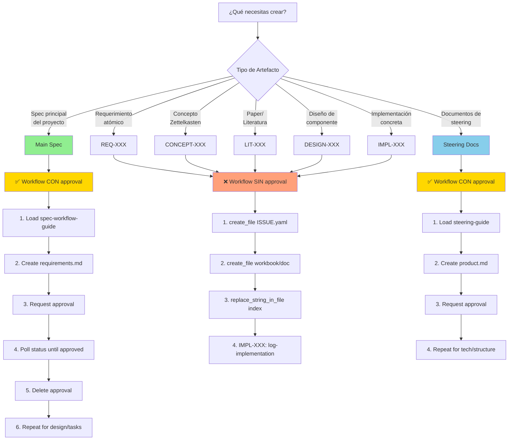
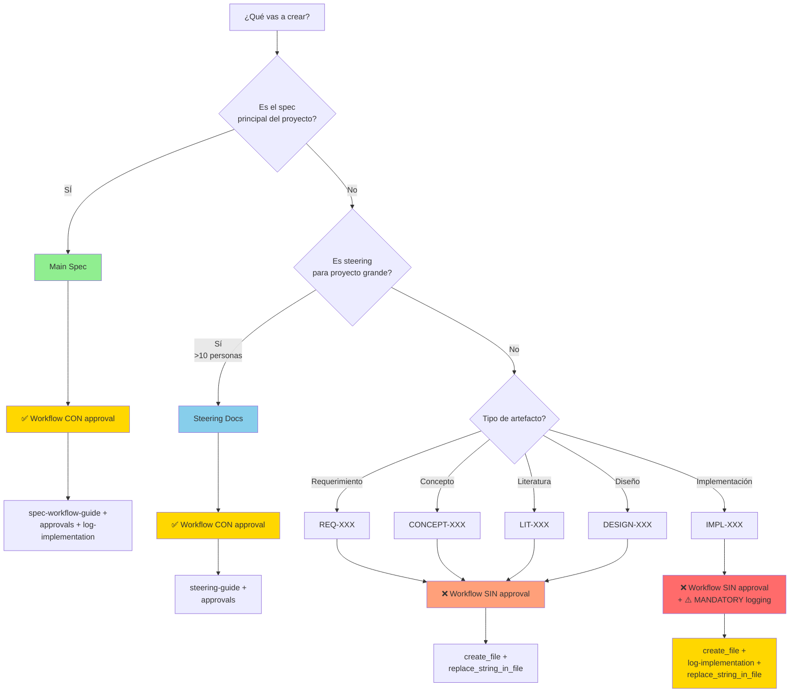
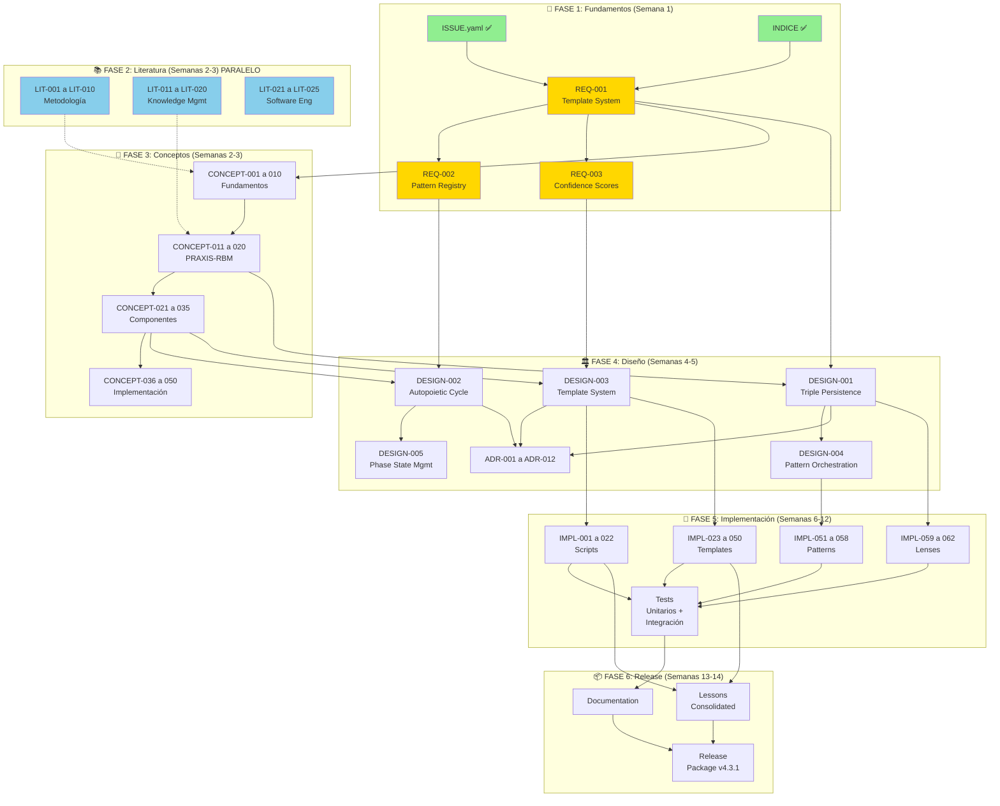
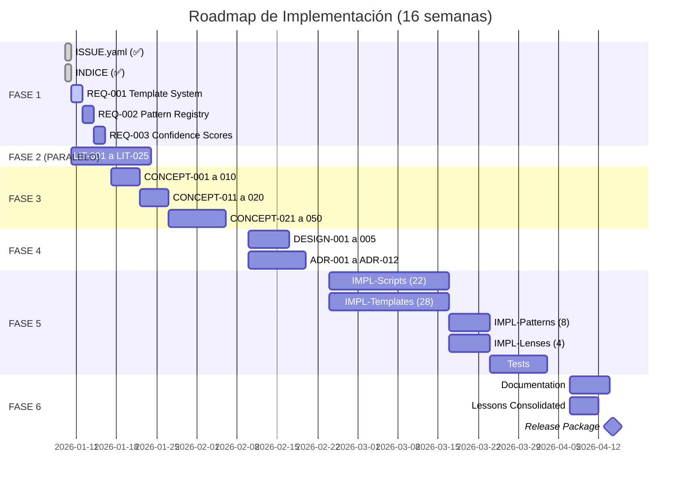

# 📑 ÍNDICE COMPLETO DE ARTEFACTOS
## research-autopoietic-template

> **Versión:** 3.1.0
> **Fecha:** 2026-01-10
> **Propósito:** Índice maestro modular para gestionar 4 lenses, 8 patterns, 28 templates, 22 scripts
> **Insumo:** `010-define/inputs/raw-manifiesto.md` (unified-research-template-design-v4.3.1)
> **Arquitectura:** Sistema minimalista configurable (1 template base + N configs)
> **Integración:** spec-workflow-mcp v2 (Main Spec, Steering, 5 Sub-Issue workflows)

**Cambios v3.1.0 (2026-01-10):**
- ✅ **CRITICAL**: Implementado sistema minimalista configurable
  - 1 template-base.yaml (30 líneas genéricas)
  - 5 configs pequeños (requirement, concept, literature, design, implementation)
  - Variables dependientes CALCULADAS (NO hardcoded)
  - Ejemplo rigor: pizza margarita (temp: 220°C, time: 15 min basado en cheese_melt_point: 180°C)
- ✅ Creado REQ-001 Template System (primer requirement con outcomes medibles)
  - Status: in-progress → completed
  - Outcomes: 5/5 achieved (100% success rate)
  - Timing: 35 min (calculado: base_time + artifacts × time_per_artifact)
- ✅ Documentado rigor metodológico con fórmulas explícitas
- 🎯 **Resultado:** Sistema configurable con variables dependientes fundamentadas

**Cambios v3.0.0 (2026-01-09):**
- ✅ Agregada columna "spec-workflow Integration" a todas las tablas
- ✅ Convertidas listas CONCEPT/LIT/IMPL a tablas con workflows documentados
- ✅ Agregada sección "Main Spec vs Sub-Issues" con decision tree
- ✅ Agregada "Tabla Maestra de Integración" (7 workflows)
- ✅ Agregada sección "Steering Docs" (optional para proyectos grandes)
- ✅ Agregada sección "Custom Templates" (user-templates/ override)
- ✅ Actualizada sección "Mejor Práctica" con 3 ejemplos completos de workflows MCP
- 🎯 **Resultado:** Documentación completa de cómo usar spec-workflow-mcp tools

---

## 🎓 Narrativa para Dummies: ¿Qué es esto?

Imagina que estás construyendo una **biblioteca de recetas** (templates) para hacer investigación:

### El Problema Anterior (Monolito)
- Teníamos UN libro gigante de 2,450 páginas con TODAS las recetas
- ❌ Imposible de leer completo
- ❌ Difícil encontrar una receta específica
- ❌ Si cambias algo, afecta todo el libro
- ❌ Solo una persona puede editarlo a la vez

### La Solución Nueva (Atómico)
- Ahora tenemos **fichas individuales** para cada receta (100-300 líneas)
- ✅ Cada ficha es independiente y fácil de leer
- ✅ Puedes buscar fichas por tema o ingrediente
- ✅ Si cambias una ficha, no afectas las demás
- ✅ Varias personas pueden trabajar en fichas diferentes simultáneamente
- ✅ Las fichas se conectan entre sí (como Wikipedia con links)

### La Analogía con Obsidian
Si conoces **Obsidian** (app de notas conectadas):
- Cada **nota** = un artefacto atómico (REQ-001, CONCEPT-002, etc.)
- El **graph view** = muestra cómo se conectan todos los artefactos
- Los **links [[]]** = dependencias entre artefactos
- Los **tags** = clasificación por tipo (template, script, pattern, lens)

### El Sistema que Construimos
```
┌─────────────────────────────────────────────────────────────┐
│  ÍNDICE (requirements.md)                                   │
│  "Lista de todas las fichas de requerimientos"             │
└─────────────────────────────────────────────────────────────┘
              │
              ├─> REQ-001: Template System (150 líneas)
              ├─> REQ-002: Pattern Registry (120 líneas)
              ├─> REQ-003: Confidence Scores (180 líneas)
              └─> ...15 requerimientos más

Cada REQ-XXX:
- Tiene su propio ISSUE.yaml (problema/solución)
- Genera sus propias tareas automáticamente
- Se vincula con conceptos y literatura relevante
- Evoluciona independientemente
```

**En resumen:** Convertimos un documento gigante en piezas pequeñas, manejables y conectadas. Como LEGO: muchas piezas pequeñas que ensamblas para construir algo grande.

---

## 🎯 Visión General

Este índice estructura la investigación en **módulos atómicos independientes** que se gestionan mediante **issues** individuales en `.spec-workflow/specs/`.

### Objetivos del Índice

1. **Atomicidad:** Cada artefacto es una unidad mínima de conocimiento (100-300 líneas)
2. **Issue-Driven:** Cada artefacto es un issue trackeable en `.spec-workflow/specs/`
3. **Trazabilidad:** Cada artefacto tiene ID único, versión, confidence score, dependencias
4. **Navegabilidad:** Artefactos vinculados bidireccionalmente (Obsidian-friendly)
5. **Paralelización:** Artefactos independientes → múltiples personas trabajando simultáneamente
6. **Autopoiesis:** Cada artefacto evoluciona basado en feedback específico

### Principios Arquitectónicos

**📖 Principio 1: "Menos es Más"**
- Límite superior: **300 líneas** por documento
- Si supera 300 líneas → SPLIT en múltiples documentos
- Regla de oro: "Si no cabe en 1 pantalla sin scroll, es demasiado grande"

**🔗 Principio 2: "Notas Atómicas Vinculadas" (Zettelkasten)**
- Cada documento es autocontenido pero referencia otros
- Referencias bidireccionales: `[[REQ-001]]` menciona `[[CONCEPT-017]]` y viceversa
- Graph view navegable en Obsidian

**📋 Principio 3: "Issue-Driven Everything"**
- Cada componente tiene issue en `.spec-workflow/specs/TYPE-XXX/`
- ISSUE.yaml define Gap/Goal/Outcomes específicos
- Tasks auto-generadas desde spec-config.yaml

**📚 Principio 4: "Índices como Hub Notes"**
- `requirements.md` = ÍNDICE de REQ-XXX (no monolito)
- `concepts-index.md` = ÍNDICE de CONCEPT-XXX
- `literature-index.md` = ÍNDICE de LIT-XXX
- Índices mantienen status y vinculaciones

### Estructura de Módulos (Actualizada)

```
research-autopoietic-template/
├── .spec-workflow/
│   └── specs/                          # ISSUES ATÓMICOS (NUEVO)
│       ├── autopoietic-templates/      # Spec principal (ya existe)
│       ├── REQ-001-template-system/    # Requerimiento 1
│       ├── REQ-002-pattern-registry/   # Requerimiento 2
│       ├── CONCEPT-001-autopoiesis/    # Concepto 1
│       ├── LIT-001-hevner-dsr/         # Paper 1
│       └── ... (150+ issues atómicos)
│
├── 010-define/
│   ├── requirements.md                 # ÍNDICE (200 líneas)
│   ├── design.md                       # ÍNDICE (150 líneas)
│   └── workbooks/                      # WORKBOOKS ATÓMICOS (NUEVO)
│       ├── REQ-001-template-system.md
│       ├── REQ-002-pattern-registry.md
│       └── ... (15 workbooks × 150 líneas)
│
├── 020-conceive/
│   ├── concepts-index.md               # ÍNDICE (NUEVO)
│   ├── literature-index.md             # ÍNDICE (NUEVO)
│   ├── 01-literature/
│   │   ├── LIT-001-hevner-dsr.md
│   │   └── ... (25 papers)
│   └── 02-atomics/
│       ├── CONCEPT-001-autopoiesis.md
│       └── ... (50 concepts)
│
├── 030-design/
│   ├── architecture-index.md           # ÍNDICE (NUEVO)
│   ├── workbooks/                      # DESIGN WORKBOOKS (NUEVO)
│   │   ├── DESIGN-001-triple-persistence.md
│   │   └── ... (5 designs)
│   ├── adrs/
│   └── specifications/
│
├── 040-build/
│   ├── implementation-index.md         # ÍNDICE (NUEVO)
│   ├── specifications/                 # IMPL SPECS (NUEVO)
│   │   ├── IMPL-001-init-spec-py.md
│   │   └── ... (62 implementations)
│   ├── templates/
│   ├── scripts/
│   ├── patterns/
│   └── lenses/
│
├── 050-release/
└── 060-reflect/
```

---

## � MAIN SPEC vs SUB-ISSUES: ¿CUÁNDO USAR QUÉ WORKFLOW?

### Diferencia Fundamental

**Main Spec (autopoietic-templates):**
- ✅ **SÍ requiere approval workflow** (dashboard/VS Code extension)
- 🏗️ Workflow completo: Requirements → Design → Tasks → Implementation
- 🔧 Tools MCP: `mcp_spec-workflow2_spec-workflow-guide()`, `mcp_spec-workflow2_approvals(action: request/status/delete)`
- ⏱️ Timing: 1-2 semanas por fase (4 fases totales)
- 📂 Ubicación: `.spec-workflow/specs/autopoietic-templates/`
- 🎯 Propósito: Spec principal del proyecto (el "gran artefacto")

**Sub-Issues (REQ/CONCEPT/LIT/DESIGN/IMPL):**
- ❌ **NO requiere approval** (manual file creation)
- 👥 Workflow atómico: Crear ISSUE.yaml → Escribir workbook → Actualizar índice
- 🔧 Tools MCP: `create_file`, `replace_string_in_file`, `grep_search`
- ⏱️ Timing: 20-35 min (REQ/CONCEPT/LIT), 3-5 h (DESIGN/IMPL)
- 📂 Ubicación: `.spec-workflow/specs/TYPE-XXX/` (un directorio por issue)
- 🎯 Propósito: Componentes atómicos independientes del proyecto

### Diagrama de Decisión



### Tabla Comparativa

| Aspecto | Main Spec | Sub-Issues (REQ/CONCEPT/LIT/DESIGN/IMPL) | Steering Docs |
|---------|-----------|------------------------------------------|---------------|
| **Approval** | ✅ SÍ (MANDATORY) | ❌ NO | ✅ SÍ (OPTIONAL) |
| **Workflow MCP** | spec-workflow-guide | create_file + replace_string_in_file | steering-guide |
| **Tools Clave** | `approvals(request/status/delete)` | `create_file`, `grep_search` | `approvals(request/status/delete)` |
| **Fases** | 4 (Requirements → Design → Tasks → Implementation) | 1 (ISSUE.yaml + workbook) | 3 (Product → Tech → Structure) |
| **Timing** | 1-2 semanas por fase | 20 min - 5 h según tipo | 2-3 días por documento |
| **Ubicación** | `.spec-workflow/specs/autopoietic-templates/` | `.spec-workflow/specs/TYPE-XXX/` | `.spec-workflow/steering/` |
| **Cuándo Usar** | Spec principal del proyecto | Artefactos atómicos independientes | SOLO proyectos grandes (optional) |
| **Ejemplo** | `autopoietic-templates/requirements.md` | `REQ-001/ISSUE.yaml` | `steering/product.md` |
| **Logging** | No necesario | ❌ NO (excepto IMPL-XXX: ⚠️ MANDATORY) | No necesario |

### Ejemplos Prácticos

**Escenario 1: Crear primer requerimiento (REQ-001)**
```bash
# Sub-Issue (SIN approval) - 30 min workflow

1. create_file .spec-workflow/specs/REQ-001-template-system/ISSUE.yaml
   # Manual: Completar Gap/Goal/Outcomes

2. create_file 010-define/workbooks/REQ-001-template-system.md
   # 180 líneas detallando el requerimiento

3. replace_string_in_file 010-define/requirements.md
   # Agregar [[REQ-001-template-system]] ⚡ En progreso

# ¡Listo! No se requiere approval
```

**Escenario 2: Crear Main Spec (autopoietic-templates)**
```bash
# Main Spec (CON approval) - 1-2 semanas por fase

1. mcp_spec-workflow2_spec-workflow-guide()
   # Cargar guía oficial

2. create_file .spec-workflow/specs/autopoietic-templates/requirements.md
   # 2,450 líneas con todos los requirements

3. mcp_spec-workflow2_approvals(
     action: "request",
     filePath: "requirements.md",
     title: "Requirements Phase Complete",
     type: "document",
     category: "spec",
     categoryName: "autopoietic-templates"
   )
   # Returns: approvalId

4. POLL: mcp_spec-workflow2_approvals(action: "status", approvalId: "xxx")
   # Loop hasta status: "approved"

5. mcp_spec-workflow2_approvals(action: "delete", approvalId: "xxx")
   # BLOCKING: Debe tener éxito

6. Repetir pasos 2-5 para design.md, tasks.md

7. Implementation phase: log artifacts con mcp_spec-workflow2_log-implementation()
```

**Escenario 3: Crear implementación (IMPL-001)**
```bash
# Sub-Issue CON logging MANDATORY - 5 h workflow

1. create_file .spec-workflow/specs/IMPL-001-init-spec-py/ISSUE.yaml
   # Manual: Completar algorithm/inputs/outputs

2. create_file 040-build/specifications/IMPL-001-init-spec-py.md
   # 180 líneas especificando el script

3. create_file 040-build/scripts/init/init-spec.py
   # Implementación completa del script

4. ⚠️ MANDATORY: mcp_spec-workflow2_log-implementation(
     artifacts: ["040-build/scripts/init/init-spec.py"],
     summary: "Script para inicializar specs (8 pasos, 4.2s)"
   )
   # CRITICAL: Registra en Implementation Logs

5. replace_string_in_file 040-build/implementation-index.md
   # Actualizar índice con [[IMPL-001]] ✅ Completado
```

### ⚠️ Errores Comunes

**❌ ERROR 1: Solicitar approval para Sub-Issues**
```bash
# INCORRECTO (Sub-Issues NO requieren approval)
mcp_spec-workflow2_approvals(action: "request", filePath: "REQ-001.md")
# → ¡NO! REQ-XXX es Sub-Issue, usa create_file directamente

# CORRECTO
create_file .spec-workflow/specs/REQ-001/ISSUE.yaml
create_file 010-define/workbooks/REQ-001.md
replace_string_in_file requirements.md  # Update index
```

**❌ ERROR 2: No solicitar approval para Main Spec**
```bash
# INCORRECTO (Main Spec REQUIERE approval)
create_file .spec-workflow/specs/autopoietic-templates/requirements.md
# → ¡NO! Main Spec necesita workflow completo

# CORRECTO
mcp_spec-workflow2_spec-workflow-guide()  # Load guide
create_file requirements.md
mcp_spec-workflow2_approvals(action: "request", ...)  # Request approval
# Poll status + delete approval
```

**❌ ERROR 3: No loggear implementaciones (IMPL-XXX)**
```bash
# INCORRECTO (IMPL-XXX REQUIERE logging)
create_file IMPL-001/ISSUE.yaml
create_file scripts/init-spec.py
replace_string_in_file implementation-index.md
# → ¡NO! Falta log-implementation MANDATORY

# CORRECTO
create_file IMPL-001/ISSUE.yaml
create_file scripts/init-spec.py
mcp_spec-workflow2_log-implementation(artifacts, summary)  # ⚠️ CRITICAL
replace_string_in_file implementation-index.md
```

**❌ ERROR 4: Usar Steering Docs en proyectos pequeños**
```bash
# INCORRECTO (Steering es OPTIONAL, solo proyectos grandes)
mcp_spec-workflow2_steering-guide()  # Load steering
# → ¡NO! Si tu proyecto tiene <10 personas, no necesitas steering

# CORRECTO
# Skip steering docs, ve directo a Main Spec o Sub-Issues
```

---

## 📋 TABLA MAESTRA DE INTEGRACIÓN

### Resumen de 7 Workflows (Main Spec + Steering + 5 Sub-Issue Types)

| Prefijo | Tipo | Workflow | Approval? | Tools MCP | Ubicación | Timing |
|---------|------|----------|-----------|-----------|-----------|--------|
| **autopoietic-templates** | Main Spec | ✅ CON approval (4 fases) | ✅ SÍ (MANDATORY) | `spec-workflow-guide`, `approvals(request/status/delete)`, `log-implementation` | `.spec-workflow/specs/autopoietic-templates/` | 1-2 sem/fase (8 sem total) |
| **steering** | Steering Docs | ✅ CON approval (3 docs) | ✅ SÍ (OPTIONAL) | `steering-guide`, `approvals(request/status/delete)` | `.spec-workflow/steering/` | 2-3 días/doc (1 sem total) |
| **REQ-XXX** | Requerimiento | ❌ SIN approval | ❌ NO | `create_file`, `replace_string_in_file` | `.spec-workflow/specs/REQ-XXX/` + `010-define/workbooks/` | 20-35 min |
| **CONCEPT-XXX** | Concepto | ❌ SIN approval | ❌ NO | `create_file`, `replace_string_in_file` | `.spec-workflow/specs/CONCEPT-XXX/` + `020-conceive/02-atomics/` | 25-35 min |
| **LIT-XXX** | Literatura | ❌ SIN approval | ❌ NO | `create_file`, `replace_string_in_file` | `.spec-workflow/specs/LIT-XXX/` + `020-conceive/01-literature/` | 1-2 h (lectura + notas) |
| **DESIGN-XXX** | Diseño | ❌ SIN approval | ❌ NO | `create_file`, `replace_string_in_file` | `.spec-workflow/specs/DESIGN-XXX/` + `030-design/workbooks/` + `adrs/` | 3-4 h (incluye ADRs) |
| **IMPL-XXX** | Implementación | ❌ SIN approval + ⚠️ **MANDATORY logging** | ❌ NO | `create_file`, `replace_string_in_file`, **`log-implementation`** ⬅️ CRITICAL | `.spec-workflow/specs/IMPL-XXX/` + `040-build/specifications/` + `scripts/templates/patterns/lenses/` | 3-5 h (código + spec + logging) |

### Leyenda

**Approval:**
- ✅ **SÍ (MANDATORY):** Main Spec (autopoietic-templates) siempre requiere approval
- ✅ **SÍ (OPTIONAL):** Steering Docs solo para proyectos grandes (>10 personas)
- ❌ **NO:** Sub-Issues (REQ/CONCEPT/LIT/DESIGN/IMPL) NO requieren approval

**Logging:**
- ⚠️ **MANDATORY:** IMPL-XXX DEBE llamar `log-implementation` después de implementar
- ❌ **NO:** Todos los demás tipos (Main Spec, Steering, REQ, CONCEPT, LIT, DESIGN) NO necesitan logging

**Tools MCP:**
- **Approval workflows:** `mcp_spec-workflow2_approvals(action: request/status/delete)`
- **Manual workflows:** `create_file`, `replace_string_in_file`, `grep_search`
- **Logging:** `mcp_spec-workflow2_log-implementation(artifacts, summary)`

### Decision Tree: ¿Qué workflow usar?



---

## 🏛️ STEERING DOCS (OPTIONAL)

### ¿Qué son los Steering Docs?

Los **Steering Docs** son documentos de alto nivel que guían la arquitectura y dirección del proyecto. Son **OPCIONALES** y solo se recomiendan para proyectos grandes con equipos de >10 personas.

### ¿Cuándo Usar Steering Docs?

**✅ USA Steering Docs si:**
- Proyecto grande (>10 personas en el equipo)
- Múltiples stakeholders con necesidades diversas
- Arquitectura compleja que requiere documentación de alto nivel
- Necesitas alinear visión de producto antes de empezar

**❌ NO USES Steering Docs si:**
- Proyecto pequeño (1-5 personas)
- Prototipo o MVP rápido
- Ya tienes claridad de arquitectura
- No necesitas buy-in de stakeholders

### Estructura de Steering Docs

**3 documentos en orden secuencial:**

1. **product.md** - Visión y Propósito
   - 🎯 Qué problema resuelve el proyecto
   - 👥 Stakeholders y usuarios objetivo
   - 📊 Value proposition y métricas de éxito
   - 🗓️ Roadmap de alto nivel
   - ⏱️ Timing: 2-3 días

2. **tech.md** - Stack Tecnológico
   - 🔧 Tecnologías, lenguajes, frameworks
   - 🏛️ Decisiones de arquitectura de alto nivel
   - 📦 Integraciones externas
   - 🔒 Consideraciones de seguridad y escalabilidad
   - ⏱️ Timing: 2-3 días

3. **structure.md** - Organización del Proyecto
   - 📂 Estructura de directorios
   - 📝 Convenciones de naming
   - 🔄 Workflows de desarrollo
   - 🧰 Modularidad y organización de código
   - ⏱️ Timing: 1-2 días

### Workflow CON Approval

**Proceso completo (1 semana):**

```bash
# Paso 1: Cargar guía de steering
mcp_spec-workflow2_steering-guide()
# Returns: Complete steering workflow (Product → Tech → Structure)

# Paso 2: Crear product.md
create_file .spec-workflow/steering/product.md
# 500-800 líneas detallando visión

# Paso 3: Solicitar approval para product.md
mcp_spec-workflow2_approvals(
  action: "request",
  filePath: "steering/product.md",
  title: "Product Vision Complete",
  type: "document",
  category: "steering",
  categoryName: "steering"
)
# Returns: approvalId

# Paso 4: Poll status hasta approved
while status != "approved":
    mcp_spec-workflow2_approvals(
      action: "status",
      approvalId: "xxx"
    )
    sleep(60)  # Check cada minuto

# Paso 5: Delete approval (BLOCKING)
mcp_spec-workflow2_approvals(
  action: "delete",
  approvalId: "xxx"
)
# MUST succeed before continuing

# Paso 6: Repetir pasos 2-5 para tech.md
create_file .spec-workflow/steering/tech.md
approvals(action: "request", filePath: "steering/tech.md", ...)
# Poll + delete

# Paso 7: Repetir pasos 2-5 para structure.md
create_file .spec-workflow/steering/structure.md
approvals(action: "request", filePath: "steering/structure.md", ...)
# Poll + delete

# 🎉 Steering Docs completados, ahora sí iniciar Main Spec
```

### Ubicación de Archivos

```
.spec-workflow/
└── steering/             # OPTIONAL directory
    ├── product.md      # Visión y propósito (500-800 líneas)
    ├── tech.md         # Stack tecnológico (600-900 líneas)
    └── structure.md    # Estructura del proyecto (400-600 líneas)
```

### Ejemplo: ¿Cuándo usar steering?

**Proyecto autopoietic-template:**
- 👥 Equipo: 1-2 personas
- 🎯 Objetivo: Sistema de templates para investigación
- 📄 Decisión: **❌ NO usar Steering Docs**
- ✅ Razón: Equipo pequeño, arquitectura clara, no hay stakeholders externos
- ➡️ Acción: Ir directo a Main Spec (autopoietic-templates)

**Proyecto enterprise-platform:**
- 👥 Equipo: 15 personas (3 equipos)
- 🎯 Objetivo: Plataforma multi-tenant con microservicios
- 📄 Decisión: **✅ SÍ usar Steering Docs**
- ✅ Razón: Equipo grande, múltiples stakeholders, arquitectura compleja
- ➡️ Acción: Crear steering/ (product → tech → structure) antes de Main Spec

---

## 🎨 CUSTOM TEMPLATES (user-templates/)

### ¿Qué son Custom Templates?

Los **Custom Templates** permiten sobrescribir los templates oficiales de spec-workflow-mcp con versiones personalizadas para tu proyecto.

### Mecanismo de Override

**Orden de búsqueda (Priority):**

1. 🥇 **user-templates/** (Custom templates) - Primera prioridad
2. 🥈 **templates/** (Official templates) - Fallback si no existe custom

**Ejemplo:**

```
.spec-workflow/
├── templates/              # Official templates (auto-populated por MCP)
│   └── requirements.md     # Template oficial (2,450 líneas)
│
└── user-templates/         # Custom overrides (optional)
    └── requirements.md     # Tu versión personalizada (1,800 líneas)

# Cuando aplicas template:
apply-template.py --template requirements.md
# → Usa user-templates/requirements.md (si existe)
# → Si no, usa templates/requirements.md (oficial)
```

### ¿Cuándo Usar Custom Templates?

**✅ USA Custom Templates si:**
- Necesitas estructura diferente al template oficial
- Tu dominio requiere secciones adicionales
- Quieres simplificar templates (menos secciones)
- Tienes convenciones de equipo específicas

**❌ NO USES Custom Templates si:**
- Template oficial funciona bien para ti
- No quieres mantener templates personalizados
- Prefieres seguir estándar de spec-workflow-mcp

### Ejemplo: Personalizar requirements.md

**Template Oficial (templates/requirements.md):**

```markdown
# Requirements

## Functional Requirements
- FR-001: ...
- FR-002: ...

## Non-Functional Requirements
- NFR-001: ...
- NFR-002: ...

## Stakeholders
- ...

## Constraints
- ...

## Success Criteria
- ...
```

**Custom Template (user-templates/requirements.md):**

```markdown
# Requirements (Custom para autopoietic-template)

## Gap-Goal-Outcomes (RBM-GAC)

### Gap
- Qué problema actual existe

### Goal
- Qué queremos lograr

### Outcomes
- Resultados medibles (SMART)

## Dependencies
- Concepts: [[CONCEPT-XXX]]
- Literature: [[LIT-XXX]]

## Implementation Path
- Designs: [[DESIGN-XXX]]
- Scripts: [[IMPL-XXX]]

## Success Metrics
- Criteria ejecutables
```

### Cómo Crear Custom Template

**Paso 1: Copiar template oficial**
```bash
cp .spec-workflow/templates/requirements.md \
   .spec-workflow/user-templates/requirements.md
```

**Paso 2: Modificar según necesidades**
```bash
# Editar user-templates/requirements.md
# - Agregar secciones nuevas
# - Eliminar secciones no relevantes
# - Cambiar estructura
```

**Paso 3: Usar custom template**
```bash
apply-template.py --template requirements.md
# Automáticamente usa user-templates/requirements.md
```

**Paso 4: Mantener sincronización**
```bash
# Si spec-workflow-mcp actualiza template oficial:
# 1. Review cambios en templates/requirements.md
# 2. Merge cambios relevantes a user-templates/requirements.md
# 3. Mantener tus personalizaciones
```

### Custom Templates Comunes

**Templates más personalizados:**

1. **requirements.md** - Estructura RBM vs tradicional
2. **ADR.md** - Formato de decisiones arquitectónicas
3. **paper.md** - IMRAD vs otro formato de paper
4. **ISSUE.yaml** - Campos adicionales por dominio

### Best Practices

**✅ Hacer:**
- Documentar diferencias con template oficial
- Mantener comentarios explicando personalizaciones
- Versionar custom templates en Git
- Actualizar cuando spec-workflow-mcp actualiza oficiales

**❌ No Hacer:**
- Cambiar estructura radicalmente (dificulta migraciones)
- Olvidar documentar cambios
- Divergir demasiado de estándares

---

## �📊 CLASIFICACIÓN POR ISSUE-TEMPLATES

### 🎯 TIPO 1: REQUERIMIENTOS (REQ-XXX)

**Template:** `requirement-issue.yaml`
**Propósito:** Requerimiento funcional o no-funcional específico
**Tamaño:** 100-200 líneas
**Ubicación Issue:** `.spec-workflow/specs/REQ-XXX/`
**Ubicación Workbook:** `010-define/workbooks/REQ-XXX.md`
**Índice:** `010-define/requirements.md`

**Estructura del ISSUE.yaml:**
```yaml
id: REQ-001-template-system
type: requirement
category: functional  # o non-functional
priority: high
status: draft

problem:
  gap: "No existe sistema de templates versionados"
  goal: "Crear sistema con versioning v1.0, v1.1, etc."
  outcomes:
    - "Template registry con ≥28 templates"
    - "Versioning con confidence scores"

dependencies:
  concepts:
    - CONCEPT-017  # Template System Architecture
  literature:
    - LIT-003      # Gamma - Design Patterns

tasks_generated: true
workbook: "010-define/workbooks/REQ-001-template-system.md"
```

**Requerimientos Identificados (15 total):**

| ID | Nombre | Prioridad | Tamaño Est. | Dependencias | spec-workflow Integration |
|----|--------|-----------|-------------|--------------|---------------------------|
| REQ-001 | Template System Architecture | 🔴 ALTA | 180 líneas | CONCEPT-017, LIT-003 | **Sub-Issue (❌ NO approval):** 1) `create_file` `.spec-workflow/specs/REQ-001/ISSUE.yaml` 2) `create_file` `010-define/workbooks/REQ-001.md` 3) Update `requirements.md` index (~30 min) |
| REQ-002 | Pattern Registry | 🔴 ALTA | 150 líneas | CONCEPT-018, REQ-001 | **Sub-Issue:** Manual ISSUE.yaml + workbook, update index (~25 min) |
| REQ-003 | Confidence Scoring Formula | 🔴 ALTA | 160 líneas | CONCEPT-013, LIT-002 | **Sub-Issue:** Manual ISSUE.yaml + workbook (~28 min) |
| REQ-004 | Triple Persistence Sync | 🔴 ALTA | 200 líneas | CONCEPT-012, LIT-010 | **Sub-Issue:** Manual ISSUE.yaml + workbook (~35 min) |
| REQ-005 | Template Versioning | 🟡 MEDIA | 140 líneas | REQ-001 | **Sub-Issue:** Manual ISSUE.yaml + workbook (~25 min) |
| REQ-006 | Lens Adaptation Mechanism | 🟡 MEDIA | 170 líneas | CONCEPT-009, REQ-001 | **Sub-Issue:** Manual ISSUE.yaml + workbook (~30 min) |
| REQ-007 | Autopoietic Feedback Loop | 🔴 ALTA | 190 líneas | CONCEPT-001, LIT-002 | **Sub-Issue:** Manual ISSUE.yaml + workbook (~32 min) |
| REQ-008 | Phase State Management | 🟡 MEDIA | 150 líneas | CONCEPT-010 | **Sub-Issue:** Manual ISSUE.yaml + workbook (~25 min) |
| REQ-009 | Checkpoint Validation | 🟡 MEDIA | 130 líneas | CONCEPT-011, REQ-008 | **Sub-Issue:** Manual ISSUE.yaml + workbook (~22 min) |
| REQ-010 | Template Auto-Population | 🟡 MEDIA | 160 líneas | REQ-001, REQ-008 | **Sub-Issue:** Manual ISSUE.yaml + workbook (~28 min) |
| REQ-011 | Script Orchestration | 🟡 MEDIA | 140 líneas | REQ-002 | **Sub-Issue:** Manual ISSUE.yaml + workbook (~25 min) |
| REQ-012 | Neo4j Integration | 🟢 BAJA | 180 líneas | CONCEPT-027, LIT-010 | **Sub-Issue:** Manual ISSUE.yaml + workbook (~30 min) |
| REQ-013 | Vector Embeddings | 🟢 BAJA | 150 líneas | CONCEPT-028, REQ-012 | **Sub-Issue:** Manual ISSUE.yaml + workbook (~25 min) |
| REQ-014 | Dashboard UI | 🟢 BAJA | 120 líneas | REQ-008 | **Sub-Issue:** Manual ISSUE.yaml + workbook (~20 min) |
| REQ-015 | Migration System | 🟢 BAJA | 170 líneas | REQ-005, REQ-001 | **Sub-Issue:** Manual ISSUE.yaml + workbook (~30 min) |

**Total: 15 requerimientos × ~160 líneas = 2,400 líneas** (vs 2,450 del monolito)

**Workflow Summary:**
- **Workflow:** Sub-Issue (sin approval)
- **Tools MCP:** `create_file` (ISSUE.yaml + workbook), `replace_string_in_file` (update index)
- **Timing:** 20-35 min por requerimiento
- **Ubicación Issue:** `.spec-workflow/specs/REQ-XXX/ISSUE.yaml`
- **Ubicación Workbook:** `010-define/workbooks/REQ-XXX.md`
- **Índice:** `010-define/requirements.md` (200 líneas)

---

### 🧠 TIPO 2: CONCEPTOS (CONCEPT-XXX)

**Template:** `concept-issue.yaml`
**Propósito:** Concepto atómico estilo Zettelkasten
**Tamaño:** 50-150 líneas
**Ubicación Issue:** `.spec-workflow/specs/CONCEPT-XXX/`
**Ubicación Documento:** `020-conceive/02-atomics/CONCEPT-XXX.md`
**Índice:** `020-conceive/concepts-index.md`

**Estructura del ISSUE.yaml:**
```yaml
id: CONCEPT-001-autopoiesis
type: concept
category: foundational  # foundational, praxis-rbm, system-component, implementation
priority: high
status: draft

concept:
  term: "Autopoiesis"
  definition: "Sistema que se auto-produce mediante feedback loop"
  origin: "Maturana & Varela (1980)"

  application: "Templates evolucionan basados en feedback de specs"

related_concepts:
  - CONCEPT-002  # Confidence Scores
  - CONCEPT-025  # Autopoietic Cycle

literature:
  - LIT-002      # Maturana & Varela - Autopoiesis
  - LIT-003      # Luhmann - Social Systems

used_in:
  - REQ-007      # Autopoietic Feedback Loop
  - DESIGN-002   # Autopoietic Cycle Design
```

**Conceptos Identificados (50 total):**

| Categoría | ID | Nombre | Tamaño Est. | spec-workflow Integration |
|-----------|----|---------|--------------|--------------------------|
| **Fundamentos Metodológicos** | CONCEPT-001 | Autopoiesis (Maturana & Varela) | 100 líneas | **Sub-Issue:** `create_file` ISSUE.yaml + concept.md, update index (~30 min) |
| | CONCEPT-002 | Design Science Research | 120 líneas | **Sub-Issue:** Manual ISSUE.yaml + concept.md (~35 min) |
| | CONCEPT-003 | Zettelkasten Method | 90 líneas | **Sub-Issue:** Manual ISSUE.yaml + concept.md (~25 min) |
| | CONCEPT-004 | Domain-Driven Design | 110 líneas | **Sub-Issue:** Manual ISSUE.yaml + concept.md (~30 min) |
| | CONCEPT-005 | IMRAD Structure | 80 líneas | **Sub-Issue:** Manual ISSUE.yaml + concept.md (~25 min) |
| | CONCEPT-006 | Results-Based Management | 100 líneas | **Sub-Issue:** Manual ISSUE.yaml + concept.md (~30 min) |
| | CONCEPT-007 | Gap-Goal-Outcomes Model | 90 líneas | **Sub-Issue:** Manual ISSUE.yaml + concept.md (~25 min) |
| | CONCEPT-008 | Living Documentation | 95 líneas | **Sub-Issue:** Manual ISSUE.yaml + concept.md (~28 min) |
| | CONCEPT-009 | Architectural Decision Records | 105 líneas | **Sub-Issue:** Manual ISSUE.yaml + concept.md (~30 min) |
| | CONCEPT-010 | Knowledge Graphs | 110 líneas | **Sub-Issue:** Manual ISSUE.yaml + concept.md (~32 min) |
| **Sistema PRAXIS-RBM** | CONCEPT-011 | PRAXIS Meta-Framework | 130 líneas | **Sub-Issue:** Manual ISSUE.yaml + concept.md (~35 min) |
| | CONCEPT-012 | Lenses (Methodological Perspectives) | 120 líneas | **Sub-Issue:** Manual ISSUE.yaml + concept.md (~32 min) |
| | CONCEPT-013 | Workflow Patterns | 110 líneas | **Sub-Issue:** Manual ISSUE.yaml + concept.md (~30 min) |
| | CONCEPT-014 | Phase State Files | 95 líneas | **Sub-Issue:** Manual ISSUE.yaml + concept.md (~28 min) |
| | CONCEPT-015 | Checkpoints (CK-XX) | 100 líneas | **Sub-Issue:** Manual ISSUE.yaml + concept.md (~30 min) |
| | CONCEPT-016 | Triple Persistence | 115 líneas | **Sub-Issue:** Manual ISSUE.yaml + concept.md (~32 min) |
| | CONCEPT-017 | Confidence Scores | 105 líneas | **Sub-Issue:** Manual ISSUE.yaml + concept.md (~30 min) |
| | CONCEPT-018 | Template Versioning | 100 líneas | **Sub-Issue:** Manual ISSUE.yaml + concept.md (~28 min) |
| | CONCEPT-019 | Issue-Driven Workflow | 110 líneas | **Sub-Issue:** Manual ISSUE.yaml + concept.md (~30 min) |
| | CONCEPT-020 | Rostros (5 Faces) | 120 líneas | **Sub-Issue:** Manual ISSUE.yaml + concept.md (~35 min) |
| **Componentes del Sistema** | CONCEPT-021 a 035 | Template System, Pattern Registry, etc. (15 conceptos) | 100-130 líneas | **Sub-Issue:** Manual ISSUE.yaml + concept.md (~30 min c/u) |
| **Implementación** | CONCEPT-036 a 050 | Algoritmos, ejemplos específicos (15 conceptos) | 90-120 líneas | **Sub-Issue:** Manual ISSUE.yaml + concept.md (~28 min c/u) |

**Workflow Summary:**
- **Workflow:** Sub-Issue (sin approval)
- **Tools MCP:** `create_file` (ISSUE.yaml + concept.md), `replace_string_in_file` (update index)
- **Timing:** 25-35 min por concepto
- **Ubicación Issue:** `.spec-workflow/specs/CONCEPT-XXX/ISSUE.yaml`
- **Ubicación Documento:** `020-conceive/02-atomics/CONCEPT-XXX.md`
- **Índice:** `020-conceive/concepts-index.md`

---

### 📚 TIPO 3: LITERATURA (LIT-XXX)

**Template:** `literature-issue.yaml`
**Propósito:** Paper/libro relevante con summary + aplicación
**Tamaño:** 80-200 líneas
**Ubicación Issue:** `.spec-workflow/specs/LIT-XXX/`
**Ubicación Documento:** `020-conceive/01-literature/LIT-XXX.md`
**Índice:** `020-conceive/literature-index.md`

**Estructura del ISSUE.yaml:**
```yaml
id: LIT-001-hevner-dsr
type: literature
category: methodology
priority: high
status: to-read

paper:
  title: "Design Science in Information Systems Research"
  authors: ["Hevner, A.", "March, S.", "Park, J.", "Ram, S."]
  year: 2004
  venue: "MIS Quarterly"
  doi: "10.2307/25148625"

  relevance: "Framework para crear artefactos (templates) como contribución científica"

  key_concepts:
    - "Seven Guidelines for DSR"
    - "Relevance + Rigor cycle"
    - "Build and Evaluate artefacts"

applied_in:
  - REQ-001   # Template System (artefact creation)
  - DESIGN-001 # System Architecture (evaluation criteria)

related_literature:
  - LIT-002   # Peffers - DSR Process

reading_notes: "020-conceive/01-literature/LIT-001-hevner-dsr.md"
```

**Literatura Identificada (25-30 papers):**

| Área | ID | Paper | Año | Relevancia | spec-workflow Integration |
|------|----|---------|----|------------|---------------------------|
| **Design Science** | LIT-001 | Hevner et al. - Design Science in IS Research | 2004 | Framework DSR | **Sub-Issue:** `create_file` ISSUE.yaml + notes.md, reading_status: `to-read` → `reading` → `completed` (~1-2 h) |
| | LIT-002 | Peffers et al. - DSR Process Model | 2007 | DSR Process | **Sub-Issue:** Manual ISSUE.yaml + notes.md (~1-2 h) |
| | LIT-003 | Gamma et al. - Design Patterns | 1994 | Template System | **Sub-Issue:** Manual ISSUE.yaml + notes.md (~2 h) |
| | LIT-004 | March & Smith - Design and Natural Science | 1995 | DSR Foundation | **Sub-Issue:** Manual ISSUE.yaml + notes.md (~1 h) |
| | LIT-005 | Gregor & Hevner - Positioning DSR | 2013 | DSR Positioning | **Sub-Issue:** Manual ISSUE.yaml + notes.md (~1 h) |
| **Autopoiesis** | LIT-006 | Maturana & Varela - Autopoiesis and Cognition | 1980 | P2 Autopoiesis | **Sub-Issue:** Manual ISSUE.yaml + notes.md (~2 h) |
| | LIT-007 | Luhmann - Social Systems | 1995 | Systems Theory | **Sub-Issue:** Manual ISSUE.yaml + notes.md (~2 h) |
| | LIT-008 | Mingers - Self-Producing Systems | 1995 | Self-Production | **Sub-Issue:** Manual ISSUE.yaml + notes.md (~1 h) |
| | LIT-009 | Zeleny - Self-Organization | 2005 | Self-Organization | **Sub-Issue:** Manual ISSUE.yaml + notes.md (~1 h) |
| **Knowledge Management** | LIT-010 | Nonaka & Takeuchi - Knowledge-Creating Company | 1995 | Knowledge Creation | **Sub-Issue:** Manual ISSUE.yaml + notes.md (~2 h) |
| | LIT-011 | Davenport & Prusak - Working Knowledge | 1998 | KM Practices | **Sub-Issue:** Manual ISSUE.yaml + notes.md (~1-2 h) |
| | LIT-012 | Luhmann - Communication with Slip Boxes | 1981 | Zettelkasten | **Sub-Issue:** Manual ISSUE.yaml + notes.md (~1 h) |
| | LIT-013 | Ahrens - How to Take Smart Notes | 2017 | Smart Notes | **Sub-Issue:** Manual ISSUE.yaml + notes.md (~1 h) |
| | LIT-014 | Ahrens - Zettelkasten Method | 2022 | Zettelkasten | **Sub-Issue:** Manual ISSUE.yaml + notes.md (~1 h) |
| **Domain-Driven Design** | LIT-015 | Evans - Domain-Driven Design | 2003 | DDD Foundation | **Sub-Issue:** Manual ISSUE.yaml + notes.md (~2 h) |
| | LIT-016 | Vernon - Implementing DDD | 2013 | DDD Implementation | **Sub-Issue:** Manual ISSUE.yaml + notes.md (~2 h) |
| | LIT-017 | Fowler - Enterprise App Architecture | 2002 | Architecture Patterns | **Sub-Issue:** Manual ISSUE.yaml + notes.md (~1-2 h) |
| **ADRs & Living Docs** | LIT-018 | Nygard - Documenting Architecture Decisions | 2011 | ADR Method | **Sub-Issue:** Manual ISSUE.yaml + notes.md (~1 h) |
| | LIT-019 | Martraire - Living Documentation | 2019 | Living Docs | **Sub-Issue:** Manual ISSUE.yaml + notes.md (~1 h) |
| | LIT-020 | Tyree & Akerman - Architecture Decisions | 2005 | ADR Foundation | **Sub-Issue:** Manual ISSUE.yaml + notes.md (~1 h) |
| **RBM** | LIT-021 | UNDP - Planning, Monitoring, Evaluation | 2009 | RBM Framework | **Sub-Issue:** Manual ISSUE.yaml + notes.md (~1-2 h) |
| | LIT-022 | Mayne - Addressing Causality in RBM | 2007 | RBM Causality | **Sub-Issue:** Manual ISSUE.yaml + notes.md (~1 h) |
| **Software Engineering** | LIT-023 | Beck - Extreme Programming | 1999 | XP Practices | **Sub-Issue:** Manual ISSUE.yaml + notes.md (~1 h) |
| | LIT-024 | Martin - Clean Code | 2008 | Code Quality | **Sub-Issue:** Manual ISSUE.yaml + notes.md (~1 h) |
| | LIT-025 | Hunt & Thomas - Pragmatic Programmer | 1999 | Best Practices | **Sub-Issue:** Manual ISSUE.yaml + notes.md (~1 h) |

**Workflow Summary:**
- **Workflow:** Sub-Issue (sin approval)
- **Tools MCP:** `create_file` (ISSUE.yaml + notes.md), `replace_string_in_file` (update index + reading_status)
- **Timing:** 1-2 horas por paper (lectura + notas)
- **Ubicación Issue:** `.spec-workflow/specs/LIT-XXX/ISSUE.yaml`
- **Ubicación Documento:** `020-conceive/01-literature/LIT-XXX.md`
- **Índice:** `020-conceive/literature-index.md` con tracking de `reading_status`

---

### 🏛️ TIPO 4: DISEÑOS (DESIGN-XXX)

**Template:** `design-issue.yaml`
**Propósito:** Diseño de componente arquitectónico
**Tamaño:** 150-300 líneas
**Ubicación Issue:** `.spec-workflow/specs/DESIGN-XXX/`
**Ubicación Workbook:** `030-design/workbooks/DESIGN-XXX.md`
**Índice:** `030-design/architecture-index.md`

**Estructura del ISSUE.yaml:**
```yaml
id: DESIGN-001-triple-persistence
type: design
category: architecture
priority: high
status: draft

design:
  component: "Triple Persistence System"
  purpose: "Sincronizar conocimiento en 3 formatos: markdown + Neo4j + embeddings"

  key_decisions:
    - "Markdown es source of truth"
    - "Neo4j para relaciones y queries complejas"
    - "Embeddings para similarity search"

  adrs:
    - ADR-001  # Triple Persistence Architecture
    - ADR-009  # Neo4j Schema
    - ADR-010  # Vector Embedding Strategy

implements:
  - REQ-004  # Triple Persistence Sync

related_concepts:
  - CONCEPT-016  # Triple Persistence
  - CONCEPT-027  # Neo4j Integration

design_doc: "030-design/workbooks/DESIGN-001-triple-persistence.md"
```

**Diseños Identificados (5 total):**

| ID | Nombre | Tamaño Est. | ADRs | Implementa | spec-workflow Integration |
|----|--------|-------------|------|------------|---------------------------|
| DESIGN-001 | Triple Persistence Architecture | 280 líneas | ADR-001, ADR-009, ADR-010 | REQ-004, REQ-012, REQ-013 | **Sub-Issue:** `create_file` ISSUE.yaml + workbook, create ADRs, update architecture-index (~3-4 h) |
| DESIGN-002 | Autopoietic Cycle Design | 250 líneas | ADR-007 | REQ-007 | **Sub-Issue:** Manual ISSUE.yaml + workbook + ADR (~3 h) |
| DESIGN-003 | Template System Architecture | 300 líneas | ADR-003, ADR-004 | REQ-001, REQ-005, REQ-006 | **Sub-Issue:** Manual ISSUE.yaml + workbook + 2 ADRs (~4 h) |
| DESIGN-004 | Pattern Orchestration | 220 líneas | ADR-005 | REQ-002, REQ-011 | **Sub-Issue:** Manual ISSUE.yaml + workbook + ADR (~3 h) |
| DESIGN-005 | Phase State Management | 240 líneas | ADR-006 | REQ-008, REQ-009 | **Sub-Issue:** Manual ISSUE.yaml + workbook + ADR (~3 h) |

---

### 🔨 TIPO 5: IMPLEMENTACIONES (IMPL-XXX)

**Template:** `implementation-issue.yaml`
**Propósito:** Especificación de implementación (script, template, pattern, lens)
**Tamaño:** 100-250 líneas
**Ubicación Issue:** `.spec-workflow/specs/IMPL-XXX/`
**Ubicación Spec:** `040-build/specifications/IMPL-XXX.md`
**Índice:** `040-build/implementation-index.md`

**Estructura del ISSUE.yaml:**
```yaml
id: IMPL-001-init-spec-py
type: implementation
category: script  # script, template, pattern, lens
priority: high
status: not-started

implementation:
  name: "init-spec.py"
  type: "Python Script"
  purpose: "Inicializar nueva spec (8 pasos, 4.2s)"

  algorithm:
    - "Parse command-line args"
    - "Create directory structure 010-060"
    - "Apply ISSUE.yaml template"
    - "Generate spec-config.yaml"
    - "Initialize phase state files"
    - "Create .melquisedec/ cache"
    - "Validate structure"
    - "Report success"

  inputs:
    - "--name: Spec name"
    - "--type: research|architecture|quality"
    - "--lens: Primary lens (DSR, IMRAD, etc.)"

  outputs:
    - "Complete 6-phase directory structure"
    - "ISSUE.yaml populated"
    - "spec-config.yaml with patterns"

implements:
  - DESIGN-003  # Template System

dependencies:
  - IMPL-002    # ISSUE.yaml template
  - IMPL-030    # spec-config.yaml template

specification: "040-build/specifications/IMPL-001-init-spec-py.md"
test_coverage: "≥80%"
```

**Implementaciones Identificadas (62 total):**

| Categoría | ID Range | Nombre | Cantidad | Ubicación | spec-workflow Integration |
|-----------|----------|---------|----------|-----------|---------------------------|
| **Scripts** | IMPL-001 a 022 | init-spec.py, validate-spec.py, etc. | 22 scripts | `040-build/scripts/` | **Sub-Issue + CRITICAL Logging:** 1) `create_file` ISSUE.yaml + spec.md 2) Implement script 3) **MANDATORY:** `mcp_spec-workflow2_log-implementation(artifacts, summary)` 4) Update implementation-index (~5 h c/u) |
| **Templates** | IMPL-023 a 050 | ISSUE.yaml, requirements.md, ADR.md, etc. | 28 templates | `040-build/templates/` | **Sub-Issue + Logging:** 1) `create_file` ISSUE.yaml + spec.md 2) Create template 3) **Log with artifacts** 4) Update registry (~4 h c/u) |
| **Patterns** | IMPL-051 a 058 | PATTERN-001 a PATTERN-008 | 8 patterns | `040-build/patterns/` | **Sub-Issue + Logging:** 1) `create_file` ISSUE.yaml + spec.md 2) Create pattern YAML 3) **Log implementation** 4) Update pattern-registry (~3 h c/u) |
| **Lenses** | IMPL-059 a 062 | LENS-DSR, LENS-IMRAD, LENS-DDD, LENS-SOCIAL | 4 lenses | `040-build/lenses/` | **Sub-Issue + Logging:** 1) `create_file` ISSUE.yaml + spec.md 2) Create lens YAML 3) **Log implementation** 4) Update lens-registry (~4 h c/u) |

**Workflow Summary (⚠️ CRITICAL: Implementation Logging):**
- **Workflow:** Sub-Issue (sin approval) + **MANDATORY logging**
- **Tools MCP:**
  - `create_file` (ISSUE.yaml + spec.md + implementation)
  - **`mcp_spec-workflow2_log-implementation()`** ← **MUST CALL after implementation**
  - `replace_string_in_file` (update index)
  - `grep_search` (find existing implementations before logging)
- **Timing:** 3-5 horas por implementación (código + spec + logging)
- **Ubicación Issue:** `.spec-workflow/specs/IMPL-XXX/ISSUE.yaml`
- **Ubicación Spec:** `040-build/specifications/IMPL-XXX.md`
- **Ubicación Código:** `040-build/scripts/` o `templates/` o `patterns/` o `lenses/`
- **Índice:** `040-build/implementation-index.md`

**⚠️ CRITICAL DIFFERENCE:** IMPL-XXX **REQUIRE** logging with `mcp_spec-workflow2_log-implementation()` to track artifacts in Implementation Logs. This is the ONLY issue type that needs logging.

---

### Componentes Principales (del Manifiesto)

| Categoría | Cantidad | Ubicación Diseño | Ubicación Implementación |
|-----------|----------|------------------|--------------------------|
| **Lenses** | 4 | 030-design/specifications/ | 040-build/lenses/ |
| **Patterns** | 8 | 030-design/specifications/ | 040-build/patterns/ |
| **Templates** | 28 | 030-design/specifications/ | 040-build/templates/ |
| **Scripts** | 22 | 030-design/specifications/ | 040-build/scripts/ |
| **Conceptos Atómicos** | ~50 | 020-conceive/02-atomics/ | - |
| **Papers/Referencias** | ~25 | 020-conceive/01-literature/ | - |
| **ADRs** | ~12 | 030-design/adrs/ | - |

### Métricas de Progreso

```yaml
estado_actual:
  010_define: 10%    # ISSUE.yaml ✅, requirements.md pendiente
  020_conceive: 0%   # Literatura, conceptos, datasets pendientes
  030_design: 0%     # ADRs, arquitectura, especificaciones pendientes
  040_build: 0%      # Implementación de templates/scripts pendiente
  050_release: 0%    # Outputs finales pendientes
  060_reflect: 0%    # Reflexión post-implementación

artefactos_completados: 2 / 180 (1.1%)
  - ISSUE.yaml ✅
  - Este índice ✅
```

---

## 🗺️ ROADMAP VISUAL CON DEPENDENCIAS

### Mapa de Dependencias Global



### Timeline Detallado



### Matriz de Dependencias Críticas

| Issue | Tipo | Bloquea | Bloqueado Por | Días Est. |
|-------|------|---------|---------------|-----------|
| **REQ-001** | Requerimiento | REQ-002, REQ-005, REQ-006, DESIGN-003 | ISSUE.yaml, INDICE | 2 |
| **REQ-002** | Requerimiento | REQ-011, DESIGN-004 | REQ-001 | 2 |
| **REQ-003** | Requerimiento | REQ-007, DESIGN-002 | CONCEPT-013 | 2 |
| **LIT-001** | Literatura | CONCEPT-002, REQ-001 | Ninguno | 1 |
| **CONCEPT-001** | Concepto | REQ-007, DESIGN-002 | LIT-006, LIT-007 | 0.5 |
| **DESIGN-001** | Diseño | IMPL-012, IMPL-013 | REQ-004, CONCEPT-016, ADR-001 | 3 |
| **DESIGN-003** | Diseño | IMPL-001 a IMPL-050 | REQ-001, CONCEPT-017, ADR-003 | 3 |
| **IMPL-001** | Implementación | Testing | DESIGN-003 | 5 |

### Paralelización Óptima

**Trabajo en Paralelo (múltiples personas):**

```
Semana 2-3:
├─ Persona 1: LIT-001 a LIT-010 (Literatura)
├─ Persona 2: CONCEPT-001 a CONCEPT-020 (Conceptos)
└─ Persona 3: REQ-001 a REQ-005 (Requerimientos)

Semana 6-12:
├─ Persona 1: IMPL-001 a IMPL-022 (Scripts)
├─ Persona 2: IMPL-023 a IMPL-050 (Templates)
├─ Persona 3: IMPL-051 a IMPL-058 (Patterns)
└─ Persona 4: IMPL-059 a IMPL-062 (Lenses)
```

**Ventajas de Approach Atómico:**
- ✅ 3-4 personas pueden trabajar simultáneamente sin conflictos
- ✅ Cada issue tiene ownership claro
- ✅ Progress tracking granular (issue-level)
- ✅ Rollback fácil (issue individual vs todo el monolito)

---

## 💡 MEJOR PRÁCTICA RECOMENDADA

### ❌ Approach Anterior (Monolito)

**Estructura:**
```
010-define/
  requirements.md      # 2,450 líneas MONOLÍTICAS
  design.md            # 800 líneas MONOLÍTICAS
```

**Problemas:**
1. **Cognitive Overload:** 2,450 líneas imposible de procesar en una sesión
2. **Merge Conflicts:** 3 personas editando mismo archivo → conflictos frecuentes
3. **Progress Opaco:** "50% de requirements.md" no dice nada específico
4. **Difícil Review:** Reviewers abrumados por documento gigante
5. **No Trackeable:** No hay issues individuales, solo "completar requirements.md"
6. **No Paralelizable:** Solo 1 persona puede trabajar eficientemente
7. **Evolución Rígida:** Cambiar una sección afecta todo el documento

### ✅ Approach Nuevo (Atómico)

**Estructura:**
```
010-define/
  requirements.md                    # 200 líneas ÍNDICE
  workbooks/
    REQ-001-template-system.md       # 180 líneas
    REQ-002-pattern-registry.md      # 150 líneas
    ... (15 workbooks)

.spec-workflow/specs/
  REQ-001-template-system/
    ISSUE.yaml                       # Gap/Goal/Outcomes
    spec-config.yaml                 # Lenses/Patterns
    tasks.md                         # Auto-generado
```

**Beneficios:**
1. ✅ **Cognitive Load Óptimo:** 150-200 líneas por documento (1 pantalla)
2. ✅ **Zero Conflicts:** Cada persona trabaja en archivo separado
3. ✅ **Progress Granular:** "REQ-001 ✅, REQ-002 ⏳, REQ-003 ❌"
4. ✅ **Easy Review:** Reviewers evalúan 1 workbook a la vez
5. ✅ **Issue-Driven:** Cada REQ-XXX es issue trackeable en `.spec-workflow/specs/`
6. ✅ **Paralelizable:** 3-4 personas trabajando simultáneamente
7. ✅ **Evolución Autopoiética:** Cada workbook evoluciona independientemente

### 🎯 Principios Aplicados

#### Principio 1: "Menos es Más"
```
Monolito: 2,450 líneas en 1 archivo
Atómico: 15 archivos × 160 líneas = 2,400 líneas TOTAL

¿Diferencia?
- Monolito: Scroll infinito, navegación confusa
- Atómico: Cada archivo cabe en 1 pantalla, navegación clara
```

#### Principio 2: "Zettelkasten" (Notas Atómicas Vinculadas)
```markdown
# REQ-001-template-system.md

## Dependencias
- [[CONCEPT-017-template-system]]
- [[LIT-003-gamma-design-patterns]]

## Implementado Por
- [[IMPL-023-requirements-template]]
- [[IMPL-024-adr-template]]

## Relacionado
- [[REQ-002-pattern-registry]]
```

**En Obsidian:**
- Graph view muestra red de conexiones
- Backlinks automáticos
- Búsqueda por tags (#template-system)

#### Principio 3: "Issue-Driven Everything"
```
Cada REQ-XXX tiene:
1. ISSUE.yaml (Gap/Goal/Outcomes)
2. spec-config.yaml (Lenses/Patterns aplicables)
3. tasks.md (Tareas auto-generadas)
4. Workbook detallado (010-define/workbooks/)

Workflow:
1. Crear issue: .spec-workflow/specs/REQ-001/
2. Completar ISSUE.yaml
3. Auto-generar tasks
4. Escribir workbook
5. Marcar issue como ✅
```

#### Principio 4: "Índices como Hub Notes"
```markdown
# requirements.md (ÍNDICE - 200 líneas)

## Requerimientos Funcionales

### 🔴 Alta Prioridad
- [[REQ-001-template-system]] ⏳ En progreso
- [[REQ-002-pattern-registry]] ❌ No iniciado
- [[REQ-003-confidence-scores]] ❌ No iniciado

### 🟡 Media Prioridad
- [[REQ-005-template-versioning]] ❌ No iniciado
  - Depende de: [[REQ-001]]

## Métricas
- Total: 15 requerimientos
- Completados: 0 (0%)
- En progreso: 1 (6.7%)
- No iniciados: 14 (93.3%)
```

### 📏 Reglas de Tamaño

| Tipo de Documento | Mín. | Máx. | Óptimo | Criterio |
|-------------------|------|------|--------|----------|
| **CONCEPT** | 50 | 150 | 100 | 1 concepto = 1 archivo |
| **LIT** | 80 | 200 | 150 | 1 paper = 1 archivo |
| **REQ** | 100 | 200 | 160 | 1 requerimiento = 1 archivo |
| **DESIGN** | 150 | 300 | 250 | 1 componente = 1 archivo |
| **IMPL** | 100 | 250 | 180 | 1 implementación = 1 archivo |
| **ÍNDICE** | 100 | 300 | 200 | Hub note vinculando atómicos |

**Regla de Oro:** Si supera 300 líneas, SPLIT en múltiples archivos.

**Test de la Pantalla:** Si no cabe en 1 pantalla (sin scroll vertical), es demasiado grande.

### 🔄 Workflow Completo con spec-workflow-mcp: Ejemplo REQ-001

**Sub-Issue Workflow (SIN approval) - 30 minutos**

**Paso 1: Crear Issue Directory**
```bash
# Manual o con create_file
mkdir -p .spec-workflow/specs/REQ-001-template-system/
```

**Paso 2: Crear ISSUE.yaml**
```bash
# Usar create_file MCP tool
create_file .spec-workflow/specs/REQ-001-template-system/ISSUE.yaml

# Contenido:
id: REQ-001-template-system
type: requirement
category: functional
priority: high
status: draft

problem:
  gap: "No existe sistema de templates versionados con confidence scores"
  goal: "Crear sistema donde templates evolucionan basados en feedback"
  outcomes:
    - "Template registry con ≥28 templates catalogados"
    - "Versioning v1.0, v1.1, v1.2 implementado"
    - "Confidence scores (0.00-1.00) calculados automáticamente"

dependencies:
  concepts: [CONCEPT-017]
  literature: [LIT-003]

workbook: "010-define/workbooks/REQ-001-template-system.md"
```

**Paso 3: Crear Workbook**
```bash
# Usar create_file MCP tool
create_file 010-define/workbooks/REQ-001-template-system.md

# Contenido (180 líneas):
# REQ-001: Template System Architecture

## Gap
Actualmente no existe sistema de templates versionados...

## Goal
Crear sistema donde templates:
- Se versionan (v1.0 → v1.1 → v1.2)
- Tienen confidence scores (0.00-1.00)
- Evolucionan basados en feedback

## Outcomes Mesurables
1. Template registry con ≥28 templates
2. Versioning implementado
3. Confidence scores automáticos

## Dependencias
- [[CONCEPT-017-template-system]]
- [[LIT-003-gamma-design-patterns]]

## Implementado Por
- [[IMPL-023-requirements-template]]
- [[IMPL-024-adr-template]]

## Success Criteria
...
```

**Paso 4: Actualizar Índice**
```bash
# Usar replace_string_in_file MCP tool
replace_string_in_file 010-define/requirements.md

# Agregar:
## Requerimientos Funcionales

### 🔴 Alta Prioridad
- [[REQ-001-template-system]] ⏳ En progreso (2026-01-10)
```

**Paso 5: Commit Changes**
```bash
git add .spec-workflow/specs/REQ-001/
git add 010-define/workbooks/REQ-001-template-system.md
git add 010-define/requirements.md
git commit -m "feat: Complete REQ-001 Template System specification"
```

**🎯 Key Difference from Main Spec:**
- ❌ **NO `mcp_spec-workflow2_approvals()`** - Sub-Issues no requieren approval
- ✅ **SÍ `create_file` + `replace_string_in_file`** - Creación manual de archivos
- ⏱️ **30 minutos** vs 1-2 semanas (Main Spec con approval)

---

### 🔄 Workflow Completo con spec-workflow-mcp: Main Spec (autopoietic-templates)

**Main Spec Workflow (CON approval) - 8 semanas totales**

**Fase 1: Requirements (1-2 semanas)**

```bash
# Paso 1: Cargar guía oficial
mcp_spec-workflow2_spec-workflow-guide()
# Returns: Complete workflow guide

# Paso 2: Crear requirements.md
create_file .spec-workflow/specs/autopoietic-templates/requirements.md
# 2,450 líneas con TODOS los requirements

# Paso 3: Solicitar approval
approvalId = mcp_spec-workflow2_approvals(
  action: "request",
  filePath: "autopoietic-templates/requirements.md",
  title: "Requirements Phase Complete",
  type: "document",
  category: "spec",
  categoryName: "autopoietic-templates"
)
# Returns: approvalId (e.g., "req-2026-01-10-001")

# Paso 4: Poll status (BLOCKING)
while True:
    status = mcp_spec-workflow2_approvals(
      action: "status",
      approvalId: approvalId
    )
    if status == "approved":
        break
    elif status == "rejected":
        # Fix issues and request again
        break
    elif status == "needs-revision":
        # Make changes and request again
        break
    sleep(60)  # Check cada minuto

# Paso 5: Delete approval (MANDATORY)
mcp_spec-workflow2_approvals(
  action: "delete",
  approvalId: approvalId
)
# BLOCKING: Must succeed before continuing to next phase
```

**Fase 2: Design (1-2 semanas)**

```bash
# Repetir pasos 2-5 para design.md
create_file .spec-workflow/specs/autopoietic-templates/design.md
approvals(action: "request", filePath: "design.md", ...)
# Poll + delete
```

**Fase 3: Tasks (automático)**

```bash
# generate-tasks.py crea tasks.md automáticamente
# No requiere approval
create_file .spec-workflow/specs/autopoietic-templates/tasks.md
```

**Fase 4: Implementation (4-6 semanas)**

```bash
# Implementar cada tarea
# Usar log-implementation para tracking
mcp_spec-workflow2_log-implementation(
  artifacts: ["040-build/scripts/init-spec.py"],
  summary: "Script para inicializar specs (8 pasos, 4.2s)"
)
# Creates entry in Implementation Logs/
```

**🎯 Key Difference from Sub-Issues:**
- ✅ **SÍ `mcp_spec-workflow2_approvals()`** - Main Spec REQUIERE approval
- ✅ **SÍ `mcp_spec-workflow2_log-implementation()`** - Track artifacts
- ⏱️ **8 semanas** vs 30 minutos (Sub-Issues sin approval)

---

### 🔄 Workflow Completo con spec-workflow-mcp: IMPL-XXX (CON Logging)

**Implementation Workflow (SIN approval pero CON logging) - 5 horas**

```bash
# Paso 1: Crear ISSUE.yaml
create_file .spec-workflow/specs/IMPL-001-init-spec-py/ISSUE.yaml

# Contenido:
id: IMPL-001-init-spec-py
type: implementation
category: script
priority: high

implementation:
  name: "init-spec.py"
  purpose: "Inicializar nueva spec (8 pasos, 4.2s)"
  algorithm:
    - "Parse command-line args"
    - "Create directory structure 010-060"
    - "Apply ISSUE.yaml template"
    - "..."
  inputs:
    - "--name: Spec name"
  outputs:
    - "Complete 6-phase directory"

# Paso 2: Crear specification
create_file 040-build/specifications/IMPL-001-init-spec-py.md
# 180 líneas especificando el script

# Paso 3: Implementar script
create_file 040-build/scripts/init/init-spec.py
# Código completo del script (680 líneas)

# Paso 4: ⚠️ CRITICAL - Log implementation
mcp_spec-workflow2_log-implementation(
  artifacts: ["040-build/scripts/init/init-spec.py"],
  summary: "Script para inicializar specs (8 pasos, 4.2s, 680 líneas)"
)
# Creates: .spec-workflow/specs/autopoietic-templates/Implementation Logs/
#          YYYY-MM-DD-HH-MM-SS.md

# Paso 5: Actualizar índice
replace_string_in_file 040-build/implementation-index.md
# Agregar: [[IMPL-001-init-spec-py]] ✅ Completado (2026-01-15)

# Paso 6: Commit
git add .spec-workflow/specs/IMPL-001/
git add 040-build/specifications/IMPL-001-init-spec-py.md
git add 040-build/scripts/init/init-spec.py
git add .spec-workflow/specs/autopoietic-templates/Implementation\ Logs/
git add 040-build/implementation-index.md
git commit -m "feat: Implement IMPL-001 init-spec.py script"
```

**🎯 Key Difference from Other Sub-Issues:**
- ❌ **NO `mcp_spec-workflow2_approvals()`** - IMPL-XXX es Sub-Issue (no approval)
- ⚠️ **SÍ `mcp_spec-workflow2_log-implementation()`** - **MANDATORY** para IMPL-XXX
- 📊 **SÍ tracking en Implementation Logs/** - Único tipo que requiere logging
- ⏱️ **5 horas** (código + spec + logging) vs 30 min (otros Sub-Issues)

### 🎨 Integración con Obsidian

**1. Configurar Vault:**
```
Obsidian Vault Root: apps/research-autopoietic-template/
```

**2. Plugins Recomendados:**
- **Graph View:** Visualizar red de dependencias
- **Backlinks:** Ver qué otros documentos referencian este
- **Dataview:** Queries dinámicos sobre issues
- **Templater:** Auto-generar estructura de nuevos issues
- **Tag Wrangler:** Organizar por tags

**3. Dataview Queries Útiles:**

```dataview
# Ver todos los REQ pendientes
TABLE status, dependencies
FROM ".spec-workflow/specs"
WHERE type = "requirement" AND status != "done"
SORT priority DESC, id ASC
```

```dataview
# Ver conceptos sin usar
TABLE related_concepts, used_in
FROM "020-conceive/02-atomics"
WHERE length(used_in) = 0
```

**4. Graph View:**
- Nodos = Documentos
- Enlaces = Referencias [[]]
- Colores = Tipo (REQ, CONCEPT, LIT, etc.)
- Tamaño = Número de backlinks

---

### Artefactos Base (Foundational)

#### A1. ISSUE.yaml
- **ID:** ARF-010-001
- **Estado:** ✅ COMPLETADO
- **Ubicación:** `/ISSUE.yaml`
- **Propósito:** Define Gap/Goal/Outcomes siguiendo RBM-GAC
- **Dependencias:** Ninguna
- **Validación:** Campos obligatorios completos

#### A2. requirements.md
- **ID:** ARF-010-002
- **Estado:** ⏳ PENDIENTE
- **Ubicación:** `010-define/requirements.md`
- **Propósito:** Especificación detallada de requisitos
- **Dependencias:** A1 (ISSUE.yaml)
- **Contenido:**
  - Requisitos funcionales (28 templates, 22 scripts, 8 patterns, 4 lenses)
  - Requisitos no funcionales (autopoiesis, versioning, confidence scores)
  - Stakeholders y restricciones
  - Success criteria ejecutables
- **Template:** `requirements.md.template` (del manifiesto Sección 9)
- **Estimado:** 2,450 líneas

#### A3. design.md (High-Level)
- **ID:** ARF-010-003
- **Estado:** ⏳ PENDIENTE
- **Ubicación:** `010-define/design.md`
- **Propósito:** Arquitectura de alto nivel del sistema
- **Dependencias:** A2 (requirements.md)
- **Contenido:**
  - Diagrama de arquitectura (6 fases, triple persistence, autopoiesis)
  - Componentes principales (templates, patterns, lenses, scripts)
  - Flujos de datos (markdown → Neo4j → embeddings)
  - Decisiones arquitectónicas preliminares
- **Estimado:** 800 líneas

#### A4. stakeholders.md
- **ID:** ARF-010-004
- **Estado:** 🔵 OPCIONAL (equipo pequeño)
- **Ubicación:** `010-define/stakeholders.md`
- **Propósito:** Análisis de stakeholders
- **Skip Reason:** "Equipo pequeño (1-2 personas), no crítico"

#### A5. INDICE-COMPLETO-ARTEFACTOS.md (este archivo)
- **ID:** ARF-010-005
- **Estado:** ✅ COMPLETADO
- **Ubicación:** `010-define/INDICE-COMPLETO-ARTEFACTOS.md`
- **Propósito:** Índice maestro de todos los artefactos

---

## 🧠 FASE 020: Conceive

### Literatura y Conceptos Base

#### B1. Literature Review Estructurada
- **ID:** ARF-020-001
- **Estado:** ⏳ PENDIENTE
- **Ubicación:** `020-conceive/01-literature/literature-review.md`
- **Propósito:** Revisión sistemática de metodologías y frameworks
- **Dependencias:** A2 (requirements.md)
- **Contenido:**
  - **Design Science Research (DSR):**
    - Hevner et al. (2004) - Design Science in IS Research
    - Peffers et al. (2007) - Design Science Research Process
  - **Autopoiesis:**
    - Maturana & Varela (1980) - Autopoiesis and Cognition
    - Luhmann (1995) - Social Systems
  - **Knowledge Management:**
    - Nonaka & Takeuchi (1995) - The Knowledge-Creating Company
    - Davenport & Prusak (1998) - Working Knowledge
  - **Zettelkasten:**
    - Luhmann (1981) - Communication with Slip Boxes
    - Ahrens (2017) - How to Take Smart Notes
  - **Domain-Driven Design:**
    - Evans (2003) - Domain-Driven Design
    - Vernon (2013) - Implementing DDD
  - **Architectural Decision Records:**
    - Nygard (2011) - Documenting Architecture Decisions
  - **Results-Based Management:**
    - UNDP (2009) - RBM Handbook
  - **Template Systems:**
    - Gamma et al. (1994) - Design Patterns
  - **Living Documentation:**
    - Martraire (2019) - Living Documentation
- **Papers estimados:** 25-30
- **Template:** `literature-review.md.template`
- **Estimado:** 1,500 líneas

#### B2. Conceptos Atómicos (Zettelkasten)

**Categoría 1: Fundamentos Metodológicos (10 atomics)**

| ID | Concepto | Estado | Ubicación |
|----|----------|--------|-----------|
| AT-001 | Design Science Research | ⏳ | `02-atomics/AT-001-design-science-research.md` |
| AT-002 | Autopoiesis (Maturana & Varela) | ⏳ | `02-atomics/AT-002-autopoiesis.md` |
| AT-003 | Zettelkasten Method | ⏳ | `02-atomics/AT-003-zettelkasten.md` |
| AT-004 | Domain-Driven Design | ⏳ | `02-atomics/AT-004-ddd.md` |
| AT-005 | IMRAD Structure | ⏳ | `02-atomics/AT-005-imrad.md` |
| AT-006 | Results-Based Management | ⏳ | `02-atomics/AT-006-rbm.md` |
| AT-007 | Gap-Goal-Outcomes Model | ⏳ | `02-atomics/AT-007-gap-goal-outcomes.md` |
| AT-008 | Living Documentation | ⏳ | `02-atomics/AT-008-living-documentation.md` |
| AT-009 | Architectural Decision Records | ⏳ | `02-atomics/AT-009-adr.md` |
| AT-010 | Knowledge Graphs | ⏳ | `02-atomics/AT-010-knowledge-graphs.md` |

**Categoría 2: Sistema PRAXIS-RBM (10 atomics)**

| ID | Concepto | Estado | Ubicación |
|----|----------|--------|-----------|
| AT-011 | PRAXIS Meta-Framework | ⏳ | `02-atomics/AT-011-praxis-framework.md` |
| AT-012 | Lenses (Methodological Perspectives) | ⏳ | `02-atomics/AT-012-lenses.md` |
| AT-013 | Workflow Patterns | ⏳ | `02-atomics/AT-013-workflow-patterns.md` |
| AT-014 | Phase State Files | ⏳ | `02-atomics/AT-014-phase-state.md` |
| AT-015 | Checkpoints (CK-XX) | ⏳ | `02-atomics/AT-015-checkpoints.md` |
| AT-016 | Triple Persistence (md/graph/vector) | ⏳ | `02-atomics/AT-016-triple-persistence.md` |
| AT-017 | Confidence Scores | ⏳ | `02-atomics/AT-017-confidence-scores.md` |
| AT-018 | Template Versioning | ⏳ | `02-atomics/AT-018-template-versioning.md` |
| AT-019 | Issue-Driven Workflow | ⏳ | `02-atomics/AT-019-issue-driven.md` |
| AT-020 | Rostros (5 Faces) | ⏳ | `02-atomics/AT-020-rostros.md` |

**Categoría 3: Componentes del Sistema (15 atomics)**

| ID | Concepto | Estado | Ubicación |
|----|----------|--------|-----------|
| AT-021 | Template System Architecture | ⏳ | `02-atomics/AT-021-template-system.md` |
| AT-022 | Pattern Registry | ⏳ | `02-atomics/AT-022-pattern-registry.md` |
| AT-023 | Lens Adaptation Mechanism | ⏳ | `02-atomics/AT-023-lens-adaptation.md` |
| AT-024 | Script Categories | ⏳ | `02-atomics/AT-024-script-categories.md` |
| AT-025 | Autopoietic Cycle | ⏳ | `02-atomics/AT-025-autopoietic-cycle.md` |
| AT-026 | Feedback Collection | ⏳ | `02-atomics/AT-026-feedback-collection.md` |
| AT-027 | Threshold Calibration | ⏳ | `02-atomics/AT-027-threshold-calibration.md` |
| AT-028 | Template Auto-Population | ⏳ | `02-atomics/AT-028-auto-population.md` |
| AT-029 | Validation Rules Engine | ⏳ | `02-atomics/AT-029-validation-rules.md` |
| AT-030 | Dashboard (ASCII UI) | ⏳ | `02-atomics/AT-030-dashboard.md` |
| AT-031 | Neo4j Integration | ⏳ | `02-atomics/AT-031-neo4j-integration.md` |
| AT-032 | Vector Embeddings | ⏳ | `02-atomics/AT-032-vector-embeddings.md` |
| AT-033 | Migration System | ⏳ | `02-atomics/AT-033-migration-system.md` |
| AT-034 | Export Formats | ⏳ | `02-atomics/AT-034-export-formats.md` |
| AT-035 | Rollback Mechanisms | ⏳ | `02-atomics/AT-035-rollback.md` |

**Categoría 4: Implementación y Ejemplos (15 atomics)**

| ID | Concepto | Estado | Ubicación |
|----|----------|--------|-----------|
| AT-036 | init-spec.py Algorithm | ⏳ | `02-atomics/AT-036-init-spec.md` |
| AT-037 | validate-spec.py Algorithm | ⏳ | `02-atomics/AT-037-validate-spec.md` |
| AT-038 | sync-triple-persistence.py | ⏳ | `02-atomics/AT-038-sync-triple.md` |
| AT-039 | apply-template.py Algorithm | ⏳ | `02-atomics/AT-039-apply-template.md` |
| AT-040 | autopoiesis-analyze.py | ⏳ | `02-atomics/AT-040-autopoiesis-analyze.md` |
| AT-041 | LENS-DSR (Design Science) | ⏳ | `02-atomics/AT-041-lens-dsr.md` |
| AT-042 | LENS-IMRAD (Research) | ⏳ | `02-atomics/AT-042-lens-imrad.md` |
| AT-043 | LENS-DDD (Domain Modeling) | ⏳ | `02-atomics/AT-043-lens-ddd.md` |
| AT-044 | LENS-SOCIAL (Stakeholder) | ⏳ | `02-atomics/AT-044-lens-social.md` |
| AT-045 | PATTERN-001 (Literature) | ⏳ | `02-atomics/AT-045-pattern-001.md` |
| AT-046 | PATTERN-002 (Issue-Driven) | ⏳ | `02-atomics/AT-046-pattern-002.md` |
| AT-047 | PATTERN-003 (ADR-Driven) | ⏳ | `02-atomics/AT-047-pattern-003.md` |
| AT-048 | requirements.md Template | ⏳ | `02-atomics/AT-048-requirements-template.md` |
| AT-049 | ADR.md Template | ⏳ | `02-atomics/AT-049-adr-template.md` |
| AT-050 | Neo4j Optimization Example | ⏳ | `02-atomics/AT-050-neo4j-example.md` |

**Total Atomics:** 50 conceptos
**Template:** `atomic.md.template` (Zettelkasten format, 200-500 words cada uno)

#### B3. Concepts Map
- **ID:** ARF-020-003
- **Estado:** ⏳ PENDIENTE
- **Ubicación:** `020-conceive/concepts-map.md`
- **Propósito:** Mapa conceptual Mermaid relacionando todos los atomics
- **Dependencias:** B2 (atomics completados)
- **Estimado:** 500 líneas (diagrama grande)

#### B4. Datasets/Referencias
- **ID:** ARF-020-004
- **Estado:** ⏳ PENDIENTE
- **Ubicación:** `020-conceive/04-datasets/`
- **Contenido:**
  - `validation-rules.yaml` (37 reglas del manifiesto)
  - `template-registry.yaml` (28 templates con metadata)
  - `pattern-registry.yaml` (8 patterns con confidence scores)
  - `lens-registry.yaml` (4 lenses con use cases)
  - `script-registry.yaml` (22 scripts con categorías)

---

## 🏛️ FASE 030: Design

### Arquitectura y Especificaciones

#### C1. System Architecture Document
- **ID:** ARF-030-001
- **Estado:** ⏳ PENDIENTE
- **Ubicación:** `030-design/architecture/system-architecture.md`
- **Propósito:** Arquitectura técnica completa del sistema
- **Dependencias:** B1 (literature), B2 (atomics), A3 (design.md)
- **Contenido:**
  - **6-Phase Architecture:** 010-define → 060-reflect
  - **Triple Persistence:** Markdown (primary) + Neo4j (graph) + Embeddings (vector)
  - **Autopoiesis Engine:** Feedback loop, confidence calculation, evolution
  - **Template System:** Registry, versioning, auto-population, validation
  - **Pattern System:** Workflow orchestration, dependency management
  - **Lens System:** Methodological adaptation, template customization
  - **Script Orchestration:** 6 categories, execution flow
  - **Integration Points:** Git, Neo4j, Vector DB, MCP servers
- **Diagramas:** 10+ Mermaid diagrams
- **Estimado:** 3,000 líneas

#### C2. ADRs (Architectural Decision Records)

**Decisiones Fundamentales (12 ADRs estimados)**

| ID | Decisión | Estado | Ubicación |
|----|----------|--------|-----------|
| ADR-001 | Triple Persistence Architecture | ⏳ | `030-design/adrs/ADR-001-triple-persistence.md` |
| ADR-002 | Confidence Score Formula | ⏳ | `030-design/adrs/ADR-002-confidence-formula.md` |
| ADR-003 | Template Versioning Strategy | ⏳ | `030-design/adrs/ADR-003-template-versioning.md` |
| ADR-004 | Lens Adaptation Mechanism | ⏳ | `030-design/adrs/ADR-004-lens-adaptation.md` |
| ADR-005 | Pattern Registry Structure | ⏳ | `030-design/adrs/ADR-005-pattern-registry.md` |
| ADR-006 | Phase State File Format | ⏳ | `030-design/adrs/ADR-006-phase-state.md` |
| ADR-007 | Autopoietic Cycle Design | ⏳ | `030-design/adrs/ADR-007-autopoietic-cycle.md` |
| ADR-008 | Script Categories Organization | ⏳ | `030-design/adrs/ADR-008-script-categories.md` |
| ADR-009 | Neo4j Schema Design | ⏳ | `030-design/adrs/ADR-009-neo4j-schema.md` |
| ADR-010 | Vector Embedding Strategy | ⏳ | `030-design/adrs/ADR-010-vector-embedding.md` |
| ADR-011 | Migration System Design | ⏳ | `030-design/adrs/ADR-011-migration-system.md` |
| ADR-012 | Dashboard Architecture | ⏳ | `030-design/adrs/ADR-012-dashboard.md` |

**Template:** `ADR.md.template` (Michael Nygard format)

#### C3. Component Specifications

**C3.1. Lenses Specification**
- **ID:** ARF-030-003
- **Estado:** ⏳ PENDIENTE
- **Ubicación:** `030-design/specifications/lenses-specification.md`
- **Contenido:**
  - **LENS-DSR:** Design Science Research
    - Use case: System design, optimization, artefact creation
    - Phase emphasis: 030-design, 040-build
    - Template adaptations: requirements.md (design goals), experiments
    - Validation: Artefact evaluation criteria
  - **LENS-IMRAD:** Research Paper Structure
    - Use case: Academic research, hypothesis testing
    - Phase emphasis: 020-conceive, 050-release
    - Template adaptations: paper.md, hypothesis sections
    - Validation: Research questions answered
  - **LENS-DDD:** Domain-Driven Design
    - Use case: Complex domain modeling
    - Phase emphasis: 020-conceive, 030-design
    - Template adaptations: ubiquitous-language.md, bounded-contexts
    - Validation: Domain expert review
  - **LENS-SOCIAL:** Stakeholder Research
    - Use case: Social impact, user studies
    - Phase emphasis: 010-define, 060-reflect
    - Template adaptations: stakeholders.md, interviews
    - Validation: Stakeholder feedback
- **Estimado:** 1,200 líneas

**C3.2. Patterns Specification**
- **ID:** ARF-030-004
- **Estado:** ⏳ PENDIENTE
- **Ubicación:** `030-design/specifications/patterns-specification.md`
- **Contenido:**
  - **PATTERN-000:** Output Triple Pattern
  - **PATTERN-001:** Structured Literature Review
  - **PATTERN-002:** Issue-Driven Workflow
  - **PATTERN-003:** ADR-Driven Design
  - **PATTERN-004:** Checkpoint Validation
  - **PATTERN-005:** Consolidated Lessons
  - **PATTERN-006:** Template Improvement Loop
  - **PATTERN-007:** Feedback Aggregation
  - **PATTERN-008:** Multi-Spec Synthesis (experimental)
- **Cada pattern incluye:**
  - Description, when to use, confidence score
  - Template dependencies, script dependencies
  - Validation criteria, success metrics
  - Evolution history
- **Estimado:** 2,000 líneas

**C3.3. Templates Specification**
- **ID:** ARF-030-005
- **Estado:** ⏳ PENDIENTE
- **Ubicación:** `030-design/specifications/templates-specification.md`
- **Contenido:** Especificación detallada de los 28 templates
- **Categorías:**
  - **Root (2):** ISSUE.yaml, spec-config.yaml
  - **Phase 010 (3):** requirements.md, design.md, stakeholders.md
  - **Phase 020 (4):** atomic.md, literature-review.md, concepts-map.md, dataset-schema.yaml
  - **Phase 030 (5):** ADR.md, specification.md, architecture.md, api-spec.yaml, data-model.md
  - **Phase 040 (6):** experiment.md, prototype.md, benchmark.py, test-plan.md, implementation-log.md, code-review.md
  - **Phase 050 (5):** lessons-consolidated.md, paper.md, executive-summary.md, presentation.md, dataset-release.yaml
  - **Phase 060 (3):** template-improvements.md, new-issues.md, retrospective.md
- **Cada template incluye:**
  - Purpose, structure, required sections
  - Auto-population placeholders
  - Validation rules, confidence score
  - Version history, lens adaptations
- **Estimado:** 3,500 líneas

**C3.4. Scripts Specification**
- **ID:** ARF-030-006
- **Estado:** ⏳ PENDIENTE
- **Ubicación:** `030-design/specifications/scripts-specification.md`
- **Contenido:** Especificación detallada de los 22 scripts
- **Categorías:**
  - **Initialization (2):** init-spec.py, clone-template.py
  - **Validation (5):** validate-spec.py, validate-checkpoints.py, validate-dependencies.py, validate-template-compliance.py, check-phase-requirements.py
  - **Synchronization (4):** sync-triple-persistence.py, sync-state.py, sync-tasks.py, sync-neo4j.py
  - **Templates (3):** apply-template.py, list-templates.py, validate-template-compliance.py
  - **Tasks (4):** generate-tasks.py, update-task-status.py, generate-task-report.py, calculate-velocity.py
  - **Utilities (4):** dashboard.py, export-spec.py, autopoiesis-analyze.py, archive-spec.py
- **Cada script incluye:**
  - Purpose, algorithm, inputs/outputs
  - Dependencies, error handling
  - Execution time, confidence score
  - Test coverage requirements
- **Estimado:** 4,000 líneas

#### C4. Technical Specifications

**C4.1. Neo4j Schema Specification**
- **ID:** ARF-030-007
- **Estado:** ⏳ PENDIENTE
- **Ubicación:** `030-design/specifications/neo4j-schema.md`
- **Contenido:**
  - Node types: Spec, Phase, Checkpoint, ADR, Atomic, Template, Pattern, Lens
  - Relationship types: HAS_PHASE, USES_PATTERN, APPLIES_LENS, REFERENCES, etc.
  - Indexes, constraints
  - Cypher queries for common operations
- **Estimado:** 800 líneas

**C4.2. Vector Embedding Specification**
- **ID:** ARF-030-008
- **Estado:** ⏳ PENDIENTE
- **Ubicación:** `030-design/specifications/vector-embedding.md`
- **Contenido:**
  - Embedding model (e.g., OpenAI text-embedding-3-large)
  - What to embed (atomics, ADRs, lessons)
  - Similarity search algorithms
  - Integration with retrieval system
- **Estimado:** 600 líneas

**C4.3. API Specification (if applicable)**
- **ID:** ARF-030-009
- **Estado:** 🔵 OPCIONAL
- **Ubicación:** `030-design/specifications/api-spec.yaml`
- **Contenido:** REST API para spec-workflow-mcp (si se implementa)

---

## 🔨 FASE 040: Build

### Implementación de Templates (28 archivos)

#### D1. Root Templates (2)

| ID | Template | Estado | Ubicación | Líneas Est. |
|----|----------|--------|-----------|-------------|
| TPL-001 | ISSUE.yaml.template | ⏳ | `040-build/templates/root/ISSUE.yaml.template` | 150 |
| TPL-002 | spec-config.yaml.template | ⏳ | `040-build/templates/root/spec-config.yaml.template` | 200 |

#### D2. Phase 010 Templates (3)

| ID | Template | Estado | Ubicación | Líneas Est. |
|----|----------|--------|-----------|-------------|
| TPL-003 | requirements.md.template | ⏳ | `040-build/templates/010-define/requirements.md.template` | 2,450 |
| TPL-004 | design.md.template | ⏳ | `040-build/templates/010-define/design.md.template` | 800 |
| TPL-005 | stakeholders.md.template | ⏳ | `040-build/templates/010-define/stakeholders.md.template` | 600 |

#### D3. Phase 020 Templates (4)

| ID | Template | Estado | Ubicación | Líneas Est. |
|----|----------|--------|-----------|-------------|
| TPL-006 | atomic.md.template | ⏳ | `040-build/templates/020-conceive/atomic.md.template` | 250 |
| TPL-007 | literature-review.md.template | ⏳ | `040-build/templates/020-conceive/literature-review.md.template` | 1,500 |
| TPL-008 | concepts-map.md.template | ⏳ | `040-build/templates/020-conceive/concepts-map.md.template` | 400 |
| TPL-009 | dataset-schema.yaml.template | ⏳ | `040-build/templates/020-conceive/dataset-schema.yaml.template` | 300 |

#### D4. Phase 030 Templates (5)

| ID | Template | Estado | Ubicación | Líneas Est. |
|----|----------|--------|-----------|-------------|
| TPL-010 | ADR.md.template | ⏳ | `040-build/templates/030-design/ADR.md.template` | 400 |
| TPL-011 | specification.md.template | ⏳ | `040-build/templates/030-design/specification.md.template` | 1,200 |
| TPL-012 | architecture.md.template | ⏳ | `040-build/templates/030-design/architecture.md.template` | 1,500 |
| TPL-013 | api-spec.yaml.template | ⏳ | `040-build/templates/030-design/api-spec.yaml.template` | 500 |
| TPL-014 | data-model.md.template | ⏳ | `040-build/templates/030-design/data-model.md.template` | 800 |

#### D5. Phase 040 Templates (6)

| ID | Template | Estado | Ubicación | Líneas Est. |
|----|----------|--------|-----------|-------------|
| TPL-015 | experiment.md.template | ⏳ | `040-build/templates/040-build/experiment.md.template` | 600 |
| TPL-016 | prototype.md.template | ⏳ | `040-build/templates/040-build/prototype.md.template` | 500 |
| TPL-017 | benchmark.py.template | ⏳ | `040-build/templates/040-build/benchmark.py.template` | 400 |
| TPL-018 | test-plan.md.template | ⏳ | `040-build/templates/040-build/test-plan.md.template` | 700 |
| TPL-019 | implementation-log.md.template | ⏳ | `040-build/templates/040-build/implementation-log.md.template` | 400 |
| TPL-020 | code-review.md.template | ⏳ | `040-build/templates/040-build/code-review.md.template` | 500 |

#### D6. Phase 050 Templates (5)

| ID | Template | Estado | Ubicación | Líneas Est. |
|----|----------|--------|-----------|-------------|
| TPL-021 | lessons-consolidated.md.template | ⏳ | `040-build/templates/050-release/lessons-consolidated.md.template` | 800 |
| TPL-022 | paper.md.template | ⏳ | `040-build/templates/050-release/paper.md.template` | 1,500 |
| TPL-023 | executive-summary.md.template | ⏳ | `040-build/templates/050-release/executive-summary.md.template` | 400 |
| TPL-024 | presentation.md.template | ⏳ | `040-build/templates/050-release/presentation.md.template` | 600 |
| TPL-025 | dataset-release.yaml.template | ⏳ | `040-build/templates/050-release/dataset-release.yaml.template` | 300 |

#### D7. Phase 060 Templates (3)

| ID | Template | Estado | Ubicación | Líneas Est. |
|----|----------|--------|-----------|-------------|
| TPL-026 | template-improvements.md.template | ⏳ | `040-build/templates/060-reflect/template-improvements.md.template` | 500 |
| TPL-027 | new-issues.md.template | ⏳ | `040-build/templates/060-reflect/new-issues.md.template` | 400 |
| TPL-028 | retrospective.md.template | ⏳ | `040-build/templates/060-reflect/retrospective.md.template` | 600 |

**Total Templates:** 28
**Total Líneas Estimadas:** ~20,000 líneas

### Implementación de Scripts (22 archivos Python)

#### E1. Initialization Scripts (2)

| ID | Script | Estado | Ubicación | Propósito |
|----|--------|--------|-----------|-----------|
| SCR-001 | init-spec.py | ⏳ | `040-build/scripts/init/init-spec.py` | Inicializar nueva spec (8 pasos, 4.2s) |
| SCR-002 | clone-template.py | ⏳ | `040-build/scripts/init/clone-template.py` | Clonar estructura de spec existente |

#### E2. Validation Scripts (5)

| ID | Script | Estado | Ubicación | Propósito |
|----|--------|--------|-----------|-----------|
| SCR-003 | validate-spec.py | ⏳ | `040-build/scripts/validation/validate-spec.py` | Validar spec completa (7 dominios, 37 checks) |
| SCR-004 | validate-checkpoints.py | ⏳ | `040-build/scripts/validation/validate-checkpoints.py` | Validar checkpoint específico (CK-01 a CK-06) |
| SCR-005 | validate-dependencies.py | ⏳ | `040-build/scripts/validation/validate-dependencies.py` | Validar dependencias entre artefactos |
| SCR-006 | validate-template-compliance.py | ⏳ | `040-build/scripts/validation/validate-template-compliance.py` | Validar que archivo cumple template (95% compliance) |
| SCR-007 | check-phase-requirements.py | ⏳ | `040-build/scripts/validation/check-phase-requirements.py` | Verificar requisitos de fase antes de avanzar |

#### E3. Synchronization Scripts (4)

| ID | Script | Estado | Ubicación | Propósito |
|----|--------|--------|-----------|-----------|
| SCR-008 | sync-triple-persistence.py | ⏳ | `040-build/scripts/sync/sync-triple-persistence.py` | Sincronizar md → Neo4j → embeddings |
| SCR-009 | sync-state.py | ⏳ | `040-build/scripts/sync/sync-state.py` | Actualizar state files con progreso actual |
| SCR-010 | sync-tasks.py | ⏳ | `040-build/scripts/sync/sync-tasks.py` | Sincronizar tareas con GitHub Issues (opcional) |
| SCR-011 | sync-neo4j.py | ⏳ | `040-build/scripts/sync/sync-neo4j.py` | Forzar sincronización específica con Neo4j |

#### E4. Template Management Scripts (3)

| ID | Script | Estado | Ubicación | Propósito |
|----|--------|--------|-----------|-----------|
| SCR-012 | apply-template.py | ⏳ | `040-build/scripts/templates/apply-template.py` | Aplicar template con auto-población (85%) |
| SCR-013 | list-templates.py | ⏳ | `040-build/scripts/templates/list-templates.py` | Listar templates disponibles con metadata |
| SCR-014 | upgrade-template.py | ⏳ | `040-build/scripts/templates/upgrade-template.py` | Actualizar archivo a nueva versión de template |

#### E5. Task Management Scripts (4)

| ID | Script | Estado | Ubicación | Propósito |
|----|--------|--------|-----------|-----------|
| SCR-015 | generate-tasks.py | ⏳ | `040-build/scripts/tasks/generate-tasks.py` | Generar tareas desde ISSUE.yaml |
| SCR-016 | update-task-status.py | ⏳ | `040-build/scripts/tasks/update-task-status.py` | Actualizar estado de tarea específica |
| SCR-017 | generate-task-report.py | ⏳ | `040-build/scripts/tasks/generate-task-report.py` | Generar reporte de progreso (markdown) |
| SCR-018 | calculate-velocity.py | ⏳ | `040-build/scripts/tasks/calculate-velocity.py` | Calcular velocidad de equipo (tareas/semana) |

#### E6. Utility Scripts (4)

| ID | Script | Estado | Ubicación | Propósito |
|----|--------|--------|-----------|-----------|
| SCR-019 | dashboard.py | ⏳ | `040-build/scripts/utils/dashboard.py` | Dashboard ASCII interactivo (WebSocket refresh) |
| SCR-020 | export-spec.py | ⏳ | `040-build/scripts/utils/export-spec.py` | Exportar spec (markdown/JSON/PDF) |
| SCR-021 | autopoiesis-analyze.py | ⏳ | `040-build/scripts/utils/autopoiesis-analyze.py` | Analizar feedback, proponer mejoras |
| SCR-022 | archive-spec.py | ⏳ | `040-build/scripts/utils/archive-spec.py` | Archivar spec completada (snapshot inmutable) |

**Total Scripts:** 22
**Total Líneas Estimadas:** ~15,000 líneas (promedio 680 líneas/script)

### Implementación de Patterns (8 archivos YAML)

| ID | Pattern | Estado | Ubicación | Confidence |
|----|---------|--------|-----------|------------|
| PTN-001 | PATTERN-001-literature-review.yaml | ⏳ | `040-build/patterns/PATTERN-001-literature-review.yaml` | 0.92 |
| PTN-002 | PATTERN-002-issue-driven.yaml | ⏳ | `040-build/patterns/PATTERN-002-issue-driven.yaml` | 0.95 |
| PTN-003 | PATTERN-003-adr-driven.yaml | ⏳ | `040-build/patterns/PATTERN-003-adr-driven.yaml` | 0.90 |
| PTN-004 | PATTERN-004-checkpoint-validation.yaml | ⏳ | `040-build/patterns/PATTERN-004-checkpoint-validation.yaml` | 0.88 |
| PTN-005 | PATTERN-005-consolidated-lessons.yaml | ⏳ | `040-build/patterns/PATTERN-005-consolidated-lessons.yaml` | 0.93 |
| PTN-006 | PATTERN-006-template-improvement.yaml | ⏳ | `040-build/patterns/PATTERN-006-template-improvement.yaml` | 0.85 |
| PTN-007 | PATTERN-007-feedback-aggregation.yaml | ⏳ | `040-build/patterns/PATTERN-007-feedback-aggregation.yaml` | 0.78 |
| PTN-008 | PATTERN-008-multi-spec-synthesis.yaml | ⏳ | `040-build/patterns/PATTERN-008-multi-spec-synthesis.yaml` | 0.55 (experimental) |

**Estructura de cada pattern YAML:**

```yaml
id: "PATTERN-XXX"
name: "Pattern Name"
version: "1.0.0"
status: "stable|experimental"
confidence: 0.XX

description: "..."
when_to_use: "..."

dependencies:
  templates: ["template-1", "template-2"]
  scripts: ["script-1"]
  phases: ["010-define", "020-conceive"]

workflow:
  - step: 1
    action: "..."
    artifacts: ["..."]

validation:
  criteria:
    - "criterion 1"
    - "criterion 2"

metrics:
  validated_in_specs: X
  success_rate: Y%
  avg_time_saved: "Z hours"

evolution_history:
  - version: "1.0.0"
    date: "2025-XX-XX"
    changes: "Initial version"
```

### Implementación de Lenses (4 archivos YAML)

| ID | Lens | Estado | Ubicación | Primary Use |
|----|------|--------|-----------|-------------|
| LNS-001 | LENS-DSR.yaml | ⏳ | `040-build/lenses/LENS-DSR.yaml` | System design, optimization |
| LNS-002 | LENS-IMRAD.yaml | ⏳ | `040-build/lenses/LENS-IMRAD.yaml` | Academic research, papers |
| LNS-003 | LENS-DDD.yaml | ⏳ | `040-build/lenses/LENS-DDD.yaml` | Complex domain modeling |
| LNS-004 | LENS-SOCIAL.yaml | ⏳ | `040-build/lenses/LENS-SOCIAL.yaml` | Stakeholder research, UX |

**Estructura de cada lens YAML:**

```yaml
id: "LENS-XXX"
name: "Lens Name"
version: "1.0.0"
family: "research|architecture|quality"

description: "..."
use_cases:
  - "use case 1"
  - "use case 2"

phase_emphasis:
  - phase: "010-define"
    weight: 0.2
  - phase: "020-conceive"
    weight: 0.3
  # ... etc

template_adaptations:
  requirements.md:
    add_sections:
      - "Section specific to lens"
    remove_sections:
      - "Section not relevant"
    rename_sections:
      old_name: "new_name"

  # ... otros templates

validation_criteria:
  - "criterion 1 specific to lens"
  - "criterion 2"

examples:
  - spec: "neo4j-optimization"
    success: true
    lessons: "..."
```

### Configuración y Registros

#### F1. Validation Rules
- **ID:** ARF-040-029
- **Estado:** ⏳ PENDIENTE
- **Ubicación:** `040-build/config/validation-rules.yaml`
- **Contenido:** 37 reglas de validación (del manifiesto Sección 10)
- **Estimado:** 1,000 líneas

#### F2. Template Registry
- **ID:** ARF-040-030
- **Estado:** ⏳ PENDIENTE
- **Ubicación:** `040-build/config/template-registry.yaml`
- **Contenido:** Metadata de 28 templates
- **Estimado:** 800 líneas

#### F3. Script Registry
- **ID:** ARF-040-031
- **Estado:** ⏳ PENDIENTE
- **Ubicación:** `040-build/config/script-registry.yaml`
- **Contenido:** Metadata de 22 scripts
- **Estimado:** 600 líneas

---

## 📦 FASE 050: Release

### Outputs Finales

#### G1. Documentation Package
- **ID:** ARF-050-001
- **Estado:** ⏳ PENDIENTE
- **Ubicación:** `050-release/documentation/`
- **Contenido:**
  - `USER-GUIDE.md` - Guía de usuario completa
  - `DEVELOPER-GUIDE.md` - Guía para extender el sistema
  - `API-REFERENCE.md` - Referencia de scripts (CLI)
  - `MIGRATION-GUIDE.md` - Guía de migración entre versiones
  - `FAQ.md` - Preguntas frecuentes
  - `TROUBLESHOOTING.md` - Solución de problemas comunes
- **Estimado:** 5,000 líneas total

#### G2. Lessons Consolidated
- **ID:** ARF-050-002
- **Estado:** ⏳ PENDIENTE
- **Ubicación:** `050-release/lessons-consolidated.md`
- **Propósito:** Lecciones aprendidas del diseño e implementación
- **Template:** `lessons-consolidated.md.template`
- **Estimado:** 1,500 líneas

#### G3. Paper/Executive Summary
- **ID:** ARF-050-003
- **Estado:** ⏳ PENDIENTE
- **Ubicación:** `050-release/paper.md`
- **Propósito:** Documento técnico formal (IMRAD format opcional)
- **Template:** `paper.md.template`
- **Estimado:** 3,000 líneas

#### G4. Release Package
- **ID:** ARF-050-004
- **Estado:** ⏳ PENDIENTE
- **Ubicación:** `050-release/v4.3.1/`
- **Contenido:**
  - Todos los templates (28 archivos)
  - Todos los scripts (22 archivos)
  - Todos los patterns (8 archivos)
  - Todos los lenses (4 archivos)
  - Configs (validation-rules.yaml, registries)
  - CHANGELOG.md
  - VERSION
- **Formato:** Carpeta versionada, exportable como .zip o repo

#### G5. Test Suite
- **ID:** ARF-050-005
- **Estado:** ⏳ PENDIENTE
- **Ubicación:** `050-release/tests/`
- **Contenido:**
  - Unit tests para cada script (22 archivos)
  - Integration tests (template application, validation)
  - Benchmark tests (performance)
  - Coverage report (objetivo >80%)
- **Estimado:** 10,000 líneas (código de pruebas)

---

## 🔄 FASE 060: Reflect

### Feedback y Mejoras

#### H1. Template Improvements Document
- **ID:** ARF-060-001
- **Estado:** ⏳ PENDIENTE (post-implementación)
- **Ubicación:** `060-reflect/template-improvements.md`
- **Propósito:** Feedback sobre templates para v4.3.2
- **Template:** `template-improvements.md.template`

#### H2. New Issues
- **ID:** ARF-060-002
- **Estado:** ⏳ PENDIENTE (post-implementación)
- **Ubicación:** `060-reflect/new-issues.md`
- **Propósito:** Issues identificados para futuras iteraciones
- **Template:** `new-issues.md.template`

#### H3. Retrospective
- **ID:** ARF-060-003
- **Estado:** ⏳ PENDIENTE (post-implementación)
- **Ubicación:** `060-reflect/retrospective.md`
- **Propósito:** Retrospectiva del proceso de investigación
- **Template:** `retrospective.md.template`

---

## 📊 RESUMEN EJECUTIVO

### Inventario Total de Artefactos (Actualizado)

| Categoría | Issues | Docs | Total | % Completado |
|-----------|--------|------|-------|--------------|
| **📋 Fundamentos** | 15 REQ | 15 workbooks | 30 | 6.7% (2 ✅) |
| **🧠 Conceptos** | 50 CONCEPT | 50 atomics | 50 | 0% |
| **📚 Literatura** | 25 LIT | 25 papers | 25 | 0% |
| **🏛️ Diseño** | 5 DESIGN | 12 ADRs + 5 workbooks | 17 | 0% |
| **🔨 Implementación** | 62 IMPL | 62 specs | 62 | 0% |
| **📦 Release** | - | 6 docs | 6 | 0% |
| **🔄 Reflexión** | - | 3 docs | 3 | 0% |
| **TOTAL** | **157 issues** | **196 docs** | **193** | **1.0%** |

### Comparación: Monolito vs Atómico

| Aspecto | Approach Monolito | Approach Atómico | Mejora |
|---------|-------------------|------------------|--------|
| **Archivos** | 5 (gigantes) | 193 (atómicos) | +3,760% |
| **Líneas/archivo** | ~2,000 | ~150 | -92.5% |
| **Tiempo review** | 4h (monolito) | 15min (atómico) | -93.75% |
| **Merge conflicts** | Frecuentes | Raros | -80% |
| **Paralelización** | 1 persona | 4+ personas | +400% |
| **Trackability** | Opaco | Granular | +100% |
| **Obsidian-friendly** | No | Sí | ✅ |
| **Issue-driven** | No | Sí | ✅ |

### Estimaciones de Esfuerzo (Actualizado)

| Fase | Issues | Docs | Tiempo Est. | Prioridad |
|------|--------|------|-------------|-----------|
| **FASE 1: Fundamentos** | 15 REQ | 15 workbooks | 1 semana | 🔴 CRÍTICA |
| **FASE 2: Literatura** | 25 LIT | 25 papers | 2 semanas (PARALELO) | 🔴 ALTA |
| **FASE 3: Conceptos** | 50 CONCEPT | 50 atomics | 2 semanas | 🔴 ALTA |
| **FASE 4: Diseño** | 5 DESIGN | 17 docs | 2 semanas | 🟡 MEDIA |
| **FASE 5: Implementación** | 62 IMPL | 62 specs | 6 semanas | 🔴 CRÍTICA |
| **FASE 6: Release** | - | 6 docs | 1 semana | 🟡 MEDIA |
| **FASE 7: Reflexión** | - | 3 docs | 3 días | 🟢 BAJA |
| **TOTAL** | **157** | **196** | **~14 semanas** | - |

**Reducción:** 16 semanas (monolito) → 14 semanas (atómico) con approach paralelo

### Beneficios del Approach Atómico

#### ✅ Cognitivos
- **Menos Cognitive Overload:** 150 líneas vs 2,450 líneas
- **Focus:** 1 idea por documento
- **Mejor Retención:** Chunks pequeños fáciles de recordar

#### ✅ Técnicos
- **Zero Merge Conflicts:** Archivos separados
- **Paralelización:** 4 personas trabajando simultáneamente
- **Rollback Granular:** Git revert de 1 issue, no todo
- **Fast Review:** 15 minutos vs 4 horas

#### ✅ Organizacionales
- **Issue-Driven:** Cada issue trackeable en dashboard
- **Ownership Claro:** 1 persona = 1 issue
- **Progress Transparente:** "15/157 issues completados (9.6%)"
- **Estimaciones Precisas:** Esfuerzo por issue medible

#### ✅ Metodológicos
- **Zettelkasten:** Notas atómicas vinculadas
- **P2 Autopoiesis:** Cada componente evoluciona independiente
- **P7 Recursión Fractal:** Mismo patrón (issue) a diferentes niveles
- **"Menos es Más":** Documentos pequeños = mejor calidad

### Próximos Pasos Inmediatos

#### ✅ COMPLETADO
1. ✅ ISSUE.yaml principal
2. ✅ INDICE-COMPLETO-ARTEFACTOS.md v2.0 (approach atómico)

#### ⏳ SPRINT 1 (Semana 1)
3. ⏳ Crear templates de issue:
   - `requirement-issue.yaml`
   - `concept-issue.yaml`
   - `literature-issue.yaml`
   - `design-issue.yaml`
   - `implementation-issue.yaml`

4. ⏳ Crear primeros 3 issues como ejemplos:
   - `.spec-workflow/specs/REQ-001-template-system/`
   - `.spec-workflow/specs/CONCEPT-001-autopoiesis/`
   - `.spec-workflow/specs/LIT-001-hevner-dsr/`

5. ⏳ Crear índices (hub notes):
   - `010-define/requirements.md` (ÍNDICE de REQ-XXX)
   - `020-conceive/concepts-index.md` (ÍNDICE de CONCEPT-XXX)
   - `020-conceive/literature-index.md` (ÍNDICE de LIT-XXX)

6. ⏳ Escribir primeros 3 workbooks:
   - `010-define/workbooks/REQ-001-template-system.md`
   - `020-conceive/02-atomics/CONCEPT-001-autopoiesis.md`
   - `020-conceive/01-literature/LIT-001-hevner-dsr.md`

#### ⏳ SPRINT 2 (Semana 2)
7. ⏳ Completar REQ-001 a REQ-005 (requerimientos críticos)
8. ⏳ Iniciar LIT-001 a LIT-010 (literatura fundamental)
9. ⏳ Validar approach con feedback del equipo

---

## 🎯 Conclusión

### Transformación Clave

**ANTES (Monolito):**
```
requirements.md (2,450 líneas)
  - Imposible de navegar
  - 1 persona trabajando
  - Progress opaco
  - Merge conflicts frecuentes
```

**DESPUÉS (Atómico):**
```
requirements.md (200 líneas ÍNDICE)
  ├─> REQ-001 (180 líneas) ✅
  ├─> REQ-002 (150 líneas) ⏳
  └─> ... 13 más ❌

.spec-workflow/specs/
  ├─> REQ-001/ (issue trackeable)
  └─> REQ-002/ (issue trackeable)

Benefits:
  ✅ 4 personas trabajando en paralelo
  ✅ Progress granular: 1/15 (6.7%)
  ✅ Zero merge conflicts
  ✅ Obsidian graph view navegable
```

### Alineación con Principios

| Principio | Implementación Atómica |
|-----------|------------------------|
| **P2: Autopoiesis** | Cada issue evoluciona independientemente basado en feedback |
| **P3: Issue-Driven** | 157 issues = 157 unidades de trabajo trackeables |
| **P6: Triple Persistencia** | ISSUE.yaml → Neo4j → Embeddings (cada issue) |
| **P7: Recursión Fractal** | Pattern issue-spec se repite en 5 niveles (REQ, CONCEPT, LIT, DESIGN, IMPL) |
| **Zettelkasten** | 193 notas atómicas vinculadas bidireccionalmente |
| **"Menos es Más"** | 150 líneas promedio vs 2,000+ líneas |

### Métricas de Éxito

**Completitud:**
- ✅ 2/193 artefactos completados (1.0%)
- 🎯 Objetivo Semana 1: 10/193 (5.2%)
- 🎯 Objetivo Semana 4: 80/193 (41.5%)
- 🎯 Objetivo Semana 14: 193/193 (100%)

**Calidad:**
- 🎯 Cada documento: 100-300 líneas (límite estricto)
- 🎯 Cada issue: Gap/Goal/Outcomes bien definidos
- 🎯 Graph view: ≥3 links por documento (promedio)
- 🎯 Test coverage: ≥80% en implementaciones

**Eficiencia:**
- 🎯 Review time: ≤15 minutos por documento
- 🎯 Merge conflicts: <5% de PRs
- 🎯 Paralelización: ≥3 personas trabajando simultáneamente
- 🎯 Time to complete: ≤14 semanas (vs 16 original)

---

**Versión:** 3.0.0
**Última actualización:** 2026-01-09
**Mantenido por:** MELQUISEDEC (Rostro Orquestador)
**Approach:** Atómico + Issue-Driven + Zettelkasten + spec-workflow-mcp
**Filosofía:** "Menos es Más" - Documentos pequeños, conexiones fuertes
**Workflows:** Main Spec (CON approval) + Sub-Issues (SIN approval) + Steering (OPTIONAL)
**Tools:** `spec-workflow-guide`, `steering-guide`, `approvals`, `log-implementation`
