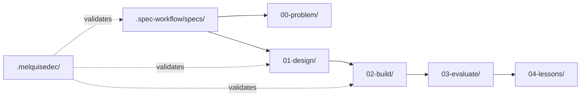

# Structure Steering - Research Keter Migration

> **Metodología**: DSR (Design Science Research) + DAATH-ZEN
> **Fases DSR**: Problem → Design → Build → Evaluate → Lessons

## 📂 Estructura del Proyecto

```
research-keter-migration/
├── .spec-workflow/              # 🎯 SPEC-WORKFLOW-MCP
│   ├── config.toml              # Configuración del proyecto
│   ├── steering/                # Documentos de dirección
│   │   ├── product.md           # Visión y métricas
│   │   ├── tech.md              # Stack y patrones
│   │   └── structure.md         # Este archivo
│   ├── artifact-templates/      # Templates configurables
│   │   ├── spec-research.md     # Template para specs de research
│   │   ├── task-tdd.md          # Template para tasks TDD
│   │   └── adr.md               # Template para ADRs
│   └── specs/                   # Specs activas
│       └── SPEC-001-dependency-audit.md
│
├── .melquisedec/                # 🧘 DAATH-ZEN Validations
│   ├── hypatia_validation.yaml  # Research rigor
│   ├── salomon_validation.yaml  # Architecture review
│   ├── morpheus_validation.yaml # Implementation quality
│   └── alma_validation.yaml     # Integration harmony
│
├── 00-problem/                  # 📋 DSR Phase 1
│   ├── research-questions.md    # RQs definidas
│   ├── hypothesis.md            # Hipótesis a probar
│   ├── current-state-analysis.md
│   └── dependency-audit.md      # Catálogo de dependencias
│
├── 01-design/                   # 📐 DSR Phase 2
│   ├── abstraction-layers/      # Diseño por capas
│   ├── architecture/            # Diagramas C4, ADRs
│   ├── migration-strategy/      # Plan por fases
│   └── contracts/               # TypeScript interfaces
│
├── 02-build/                    # 🔨 DSR Phase 3
│   ├── formal-migration-spec.md # Spec formal (≥2500 líneas)
│   ├── implementation-plan.md
│   ├── testing-strategy-tdd.md
│   └── rollback-plan.md
│
├── 03-evaluate/                 # ✅ DSR Phase 4
│   ├── validation-checklist.md
│   ├── coverage-comparison.md
│   └── independence-scorecard.md
│
├── 04-lessons/                  # 📚 Lessons Learned
│   ├── what-worked.md
│   ├── challenges.md
│   └── recommendations.md
│
├── references/                  # 📎 External References
│   ├── sprint-1-analysis.md
│   └── adr-002-original.md
│
├── README.md                    # Descripción del research
└── SETUP_COMPLETE.md            # Estado de setup
```

## 🔄 Workflow de Archivos

### Flujo de Specs
```
.spec-workflow/specs/SPEC-XXX.md
    │
    ├── 📋 Referencias a → 00-problem/*.md
    ├── 📐 Produce → 01-design/*.md
    ├── 🔨 Implementa → 02-build/*.md
    └── ✅ Valida → 03-evaluate/*.md
```

### Convenciones de Nombres
```
SPEC-{NNN}-{slug}.md        # Specs (ej: SPEC-001-dependency-audit.md)
ADR-{NNN}-{slug}.md         # Architecture Decision Records
{fase}-{nombre}.md          # Documentos DSR
{rostro}_validation.yaml    # Validaciones DAATH-ZEN
```

## 🏷️ Estados de Specs

| Estado | Emoji | Significado |
|--------|-------|-------------|
| `draft` | 📝 | En redacción |
| `pending-review` | 🔍 | Esperando revisión |
| `approved` | ✅ | Aprobado por rostro |
| `in-progress` | 🚧 | En implementación |
| `blocked` | 🚫 | Bloqueado |
| `completed` | ✔️ | Completado |
| `archived` | 📦 | Archivado |

## 🔗 Relaciones entre Documentos



## 📏 Reglas de Estructura

1. **Specs referencian, no duplican**: Los specs apuntan a documentos DSR
2. **Una spec por feature/research question**: Granularidad adecuada
3. **Tasks dentro de specs**: No archivos tasks.md separados
4. **Validaciones externas**: `.melquisedec/` para validaciones DAATH-ZEN
