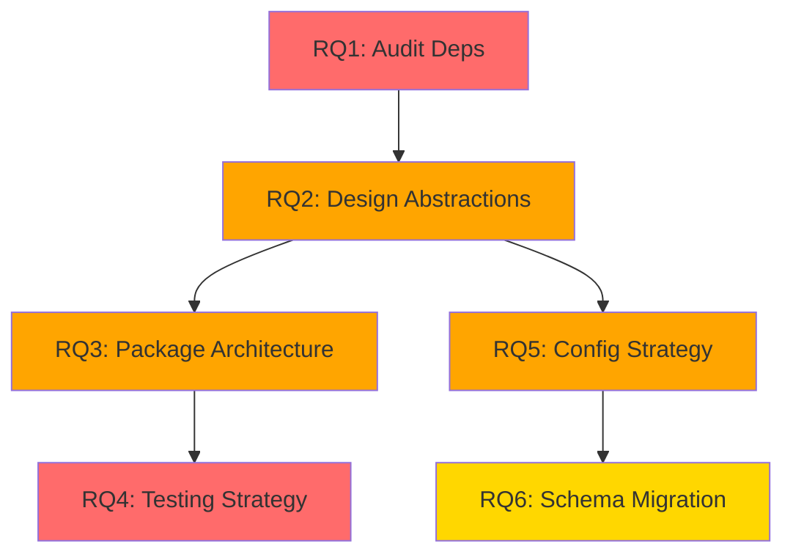

# Research Questions (RQs)

> **DSR Phase**: Problem Identification
> **DAATH-ZEN Rostro**: HYPATIA (Researcher)
> **Status**: 🔴 IN PROGRESS
> **Version**: v1.0.0

## 🎯 Research Questions Principales

### RQ1: ¿Qué dependencias hardcodeadas tiene Keter actualmente?

**Pregunta**: ¿Cuáles son TODAS las dependencias hardcodeadas que impiden que Keter funcione fuera de aleia-bereshit?

**Hipótesis Inicial**: Existen 5 categorías de dependencias:
1. DAATH (Neo4j knowledge graph validation)
2. YESOD (Zod schemas)
3. AYIN (view configuration schemas)
4. Templates L0 (87 ALEIA-specific product templates)
5. Multi-tenancy (business logic tied to ALEIA tenant model)

**Investigación Requerida**:
- Auditar imports en código Keter (`grep -r "@aleia/daath"`)
- Identificar schemas Supabase hardcoded (`ayin_config`, `keter_core`)
- Mapear servicios que dependen de DAATH/YESOD
- Catalogar templates L0 (cantidad y nivel de acoplamiento)

**Success Criteria**:
- [x] Dependencias identificadas previamente (Sprint 1-2)
- [ ] Catálogo completo de dependencias con ubicaciones (archivos + líneas)
- [ ] Matriz de impacto (qué funcionalidad pierde Keter si removemos cada dep)
- [ ] Score de acoplamiento por dependencia (1-10)

**Prioridad**: 🔴 CRITICAL (bloqueador para siguiente fase)

---

### RQ2: ¿Cómo abstraer cada dependencia sin perder funcionalidad?

**Pregunta**: ¿Qué patrón de abstracción (interface, adapter, plugin) es óptimo para cada dependencia identificada?

**Hipótesis Inicial**:
- DAATH → `IKnowledgeGraphValidator` interface (optional dependency)
- YESOD → Migrar schemas a Keter (son parte del data model)
- AYIN → Config-driven schema naming
- Templates → `ITemplateProvider` plugin system
- Multi-tenancy → `ITenantResolver` + `IRowLevelSecurity` interfaces

**Investigación Requerida**:
- Analizar contratos actuales (método signatures, tipos de retorno)
- Diseñar interfaces TypeScript para cada abstraction layer
- Validar que interfaces cubren 100% de funcionalidad actual
- Definir estrategia de fallback (qué pasa si dependencia no está disponible)

**Success Criteria**:
- [ ] ≥8 interfaces TypeScript diseñadas (1 por dependencia + auxiliares)
- [ ] Cada interface documenta: methods, params, return types, error handling
- [ ] Validation que interface cubre 100% de casos de uso actuales
- [ ] Fallback strategy documentada (graceful degradation)

**Prioridad**: 🟠 HIGH (design crítico antes de implementar)

---

### RQ3: ¿Qué arquitectura de paquetes garantiza máxima modularidad?

**Pregunta**: ¿Cómo organizar Keter en packages/apps para permitir uso modular (policy engine standalone, MCP server standalone, full app)?

**Hipótesis Inicial**:
- **Opción A**: Monolítico (`packages/keter/`) - Simple pero acoplado
- **Opción B**: Modular (`packages/keter-core/`, `packages/keter-mcp/`, `packages/keter-services/`) - Complejo pero flexible
- **Decisión**: Opción B (modular) permite reusabilidad máxima

**Investigación Requerida**:
- Analizar monorepos similares (LlamaIndex, Langchain structure)
- Definir boundaries entre packages (core, mcp, services, app)
- Diseñar dependency graph (quién depende de quién)
- Validar que estructura soporta tree-shaking (no bundles innecesarios)

**Success Criteria**:
- [ ] Estructura de packages documentada (folders + propósito)
- [ ] Dependency graph visualizado (mermaid diagram)
- [ ] Validation: `keter-core` NO depende de `keter-mcp` o `keter-services`
- [ ] ADR-003 documentando decisión arquitectónica

**Prioridad**: 🟠 HIGH (afecta toda la estructura del código)

---

### RQ4: ¿Cómo mantener 92.94% coverage durante refactoring TDD?

**Pregunta**: ¿Qué estrategia de testing permite refactorizar código sin perder coverage ni romper tests existentes?

**Hipótesis Inicial**: Test-Driven Refactoring (TDD)
1. Escribir tests para nueva interface ANTES de refactorizar
2. Refactorizar código para usar interface
3. Tests existentes deben seguir pasando (adapter mantiene comportamiento)
4. Medir coverage en cada step (≥92.94%)

**Investigación Requerida**:
- Revisar testing strategy actual (unit, integration, e2e)
- Diseñar mocks/stubs para nuevas interfaces
- Definir checkpoints de validación (coverage gates)
- Crear rollback plan si coverage cae

**Success Criteria**:
- [ ] Testing strategy documentada (TDD workflow paso a paso)
- [ ] Mocks diseñados para cada interface (≥8)
- [ ] Coverage gates definidos (cada layer debe mantener ≥92%)
- [ ] Rollback plan documentado (qué hacer si tests fallan)

**Prioridad**: 🔴 CRITICAL (calidad no negociable)

---

### RQ5: ¿Qué configuración permite deployment independiente de ALEIA?

**Pregunta**: ¿Cómo configurar Keter para que pueda ser deployado en cualquier proyecto sin hardcoded ALEIA settings?

**Hipótesis Inicial**: Configuración vía:
- Environment variables (`.env` file)
- Config object pasado en constructor (`KeterConfig`)
- Plugin registration system (register adapters en runtime)

**Investigación Requerida**:
- Definir configuración mínima requerida (schema names, API keys, endpoints)
- Diseñar `KeterConfig` interface
- Validar que config permite ANY proyecto (no solo ALEIA)
- Documentar ejemplo de configuración para proyecto genérico

**Success Criteria**:
- [ ] `KeterConfig` interface documentada (≥15 config options)
- [ ] Ejemplo `.env` para proyecto genérico (no ALEIA)
- [ ] Ejemplo de inicialización: `new KeterApp(config)` con config mínimo
- [ ] Validation: Keter funciona con config genérico (no requiere ALEIA)

**Prioridad**: 🟠 HIGH (independencia depende de esto)

---

### RQ6: ¿Cómo migrar 4 schemas Supabase sin romper producción?

**Pregunta**: ¿Qué estrategia permite migrar schemas (`shared`, `keter_core`, `ayin_config`, `shared_kg`) sin downtime ni pérdida de datos?

**Hipótesis Inicial**:
- **NO renombrar schemas** (usar config para mapear nombres)
- Config-driven: `config.database.coreSchema = "keter_core"` (ALEIA) vs `"my_app_core"` (otros)
- Migrations son responsabilidad del proyecto host (no de Keter package)

**Investigación Requerida**:
- Analizar dependencia de schema names en queries Cypher/SQL
- Definir abstraction para schema naming (template strings)
- Validar que approach permite ANY schema names
- Documentar migration strategy para proyectos que adopten Keter

**Success Criteria**:
- [ ] Schema naming abstraction documentada (cómo configurar)
- [ ] Validation: Queries usan `config.database.coreSchema` en lugar de hardcoded `"keter_core"`
- [ ] Migration guide para proyectos nuevos (cómo crear schemas)
- [ ] Zero-downtime strategy para ALEIA (no renombrar, solo configurar)

**Prioridad**: 🟡 MEDIUM (importante pero no bloqueador inmediato)

---

## 📊 Priority Matrix

| RQ | Priority | Blocker? | Effort | Impact |
|----|----------|----------|--------|--------|
| RQ1 | 🔴 CRITICAL | YES | Medium (3 days) | HIGH |
| RQ2 | 🟠 HIGH | Partial | High (5 days) | CRITICAL |
| RQ3 | 🟠 HIGH | Partial | Medium (3 days) | HIGH |
| RQ4 | 🔴 CRITICAL | YES | High (5 days) | CRITICAL |
| RQ5 | 🟠 HIGH | NO | Medium (2 days) | HIGH |
| RQ6 | 🟡 MEDIUM | NO | Low (2 days) | MEDIUM |

**Total Estimated Effort**: ~20 days (research + design phase)

## 🔄 Dependencies Between RQs

**Critical Path**: RQ1 → RQ2 → RQ4 (must be resolved first)

## 📝 Next Steps

1. Start with RQ1 (dependency audit) - gather concrete data
2. Parallel: RQ4 (testing strategy) - define quality gates
3. Then RQ2 (abstraction design) - requires RQ1 results
4. Then RQ3 (package architecture) - requires RQ2 interfaces
5. Then RQ5 + RQ6 (config + schemas) - can be done in parallel

**Estimated Timeline**: 3-4 weeks for complete research phase
