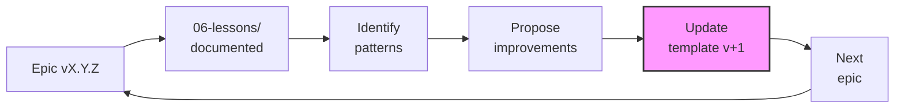

# 06-lessons/ - DAATH (Reflexión y Autopoiesis)

Esta carpeta contiene lecciones aprendidas que alimentan el ciclo autopoiético.

## Estructura

```
06-lessons/
├── checkpoint-lessons/      # Lessons por checkpoint
│   ├── ck-01-*.md
│   ├── ck-02-*.md
│   ├── ck-03-*.md
│   └── ck-04-*.md
├── technical-lessons/       # Issues técnicos y soluciones
│   └── lesson-*.md
├── methodological-lessons/  # Mejoras al proceso
│   └── lesson-*.md
└── template-improvements.md # Sugerencias al template autopoietic
```

## Rostro DAATH-ZEN

**DAATH** (Reflexión): Todos los roles documentan aprendizajes, DAATH sintetiza y propone mejoras.

## Checkpoint

**Post-CK-04**: Reflexión final antes de archivar epic.

## HKM Type

Todos los archivos en esta carpeta deben tener `hkm_type: lesson` (aprendizaje).

## Principio P2: Autopoiesis

**Ciclo Autopoiético**:
```
Epic vX.Y.Z → Lessons → Template v+1 → Próxima Epic
```

Las lessons documentadas aquí mejoran el template `research-autopoietic` para futuras épicas.

---

## Template para Lessons

### lesson-[TEMA]-[FECHA].md

```markdown
---
hkm_type: lesson
epistemic_level: lesson
title: "Lesson: [TEMA]"
checkpoint: CK-XX
created: YYYY-MM-DD
tags: [lesson, daath, autopoiesis, ck-XX]
synthesis_from:
  - [Referencia al contexto donde surgió]
---

# Lesson: [TEMA]

## 1. Context

**Checkpoint**: CK-XX
**Phase**: [MELQUISEDEC | HYPATIA | SALOMON | MORPHEUS | ALMA]
**Task**: [Referencia a task en tasks.md]

[¿Qué estábamos haciendo cuando surgió este aprendizaje?]

## 2. Problem/Observation

[¿Qué funcionó mal o podría mejorar? ¿Qué patrón observamos?]

## 3. Analysis

[¿Por qué ocurrió? ¿Qué factores contribuyeron?]

## 4. Solution Implemented

[¿Qué hicimos para resolverlo en esta épica?]

```python
# Ejemplo de código si aplica
def solution():
    pass
```

## 5. Impact

[¿Qué cambió? ¿Qué mejora medible obtuvimos?]

**Metrics**:
- **Before**: [Métrica antes]
- **After**: [Métrica después]
- **Improvement**: [% o valor]

## 6. Applicability

- [ ] Específico de esta épica
- [ ] Aplicable a épicas similares (mismo tipo)
- [x] Debe incorporarse al template (todos los tipos)

## 7. Propuesta de Mejora al Template

**Archivo afectado**: `research-autopoietic-template/[archivo]`

**Cambio propuesto**:
```markdown
[Cambio específico a implementar en el template]
```

**Justificación**: [Por qué este cambio mejora el template]

## 8. Connections

**Smart-Thinking Connections**:
- **Supports**: [[otro-lesson.md]] - Refuerza este aprendizaje
- **Refines**: [[concepto-atomic.md]] - Refina concepto de 02-atomics/
- **Extends**: [[design-pattern.md]] - Extiende patrón de 03-workbook/

## 9. Tags

#lesson #autopoiesis #[rostro] #[checkpoint] #[categoria]
```

---

## Categorías de Lessons

### 1. Checkpoint Lessons

**Ubicación**: `checkpoint-lessons/`

Aprendizajes específicos de cada checkpoint:
- **CK-01 (MELQUISEDEC)**: Definición del problema, stakeholders, alcance
- **CK-02 (HYPATIA)**: Recopilación de literatura, atomics, síntesis
- **CK-03 (SALOMON)**: Análisis comparativo, diseño, ADRs
- **CK-04 (MORPHEUS+ALMA)**: Implementación, outputs, validación

### 2. Technical Lessons

**Ubicación**: `technical-lessons/`

Issues técnicos y sus soluciones:
- Problemas con stack tecnológico
- Bugs encontrados y fix aplicado
- Optimizaciones de performance
- Configuración de infraestructura

**Ejemplo**:
```markdown
# Lesson: Neo4j Vector Index HNSW Configuration

Problem: Default HNSW config causaba queries lentas
Solution: Ajustar m=16, efConstruction=64
Impact: Latency reducida de 2s a 0.3s (85% improvement)
```

### 3. Methodological Lessons

**Ubicación**: `methodological-lessons/`

Mejoras al proceso y metodología:
- Workflow improvements
- MCP usage patterns
- Context management strategies
- Collaboration practices

**Ejemplo**:
```markdown
# Lesson: Smart-Thinking para Síntesis de Atomics

Problem: Conexiones entre atomics no eran evidentes
Solution: Usar smart-thinking con connections explícitas
Impact: Graph coherence aumentó de 60% a 85%
```

---

## template-improvements.md

Este archivo especial consolida propuestas de mejora al template autopoietic.

```markdown
---
hkm_type: lesson
epistemic_level: lesson
title: "Template Improvements - [EPIC_NAME]"
created: YYYY-MM-DD
tags: [template, improvements, autopoiesis, daath]
---

# Template Improvements Proposal

**Epic**: [Nombre]
**Version**: [vX.Y.Z]
**Date**: [YYYY-MM-DD]

## 1. Resumen de la Experiencia

[Resumen de cómo fue usar el template research-autopoietic]

### Fortalezas
- [Qué funcionó bien]
- [Qué facilitó el trabajo]

### Debilidades
- [Qué faltó]
- [Qué causó fricción]

## 2. Propuestas de Mejora

### Propuesta 1: [TÍTULO]

**Prioridad**: P0 | P1 | P2

**Problema**: [Qué gap cubre]

**Solución**: [Cambio específico al template]

**Archivos afectados**:
- `research-autopoietic-template/[archivo1]`
- `research-autopoietic-template/[archivo2]`

**Justificación**: [Por qué es importante]

**Effort**: [Horas estimadas]

---

### Propuesta 2: [TÍTULO]

[Misma estructura]

---

## 3. Priorización

| ID | Propuesta | Prioridad | Effort | Impact | Score |
|----|-----------|-----------|--------|--------|-------|
| P1 | [Título] | P0 | 2h | Alto | 9/10 |
| P2 | [Título] | P1 | 4h | Medio | 7/10 |
| P3 | [Título] | P2 | 1h | Bajo | 5/10 |

## 4. Implementación Sugerida

**Timeline**: [Cuándo implementar - próxima versión del template]

**Responsable**: [Quién debería implementar]

**Testing**: [Cómo validar las mejoras]
```

---

## Criterios de Validación

- [ ] Mínimo 1 lesson por checkpoint (CK-01 a CK-04)
- [ ] Cada lesson tiene estructura completa
- [ ] template-improvements.md con ≥3 propuestas
- [ ] Smart-thinking connections documentadas
- [ ] Lessons tienen HKM headers válidos

## MCPs Recomendados

- **smart-thinking**: Conectar lessons con conceptos de 02-atomics/
- **filesystem**: Crear/editar archivos de lessons
- **memory**: Mantener contexto de reflexión

## Workflow con Smart-Thinking

```python
# Ejemplo de reflexión con smart-thinking
{
  "thought": "Analizando experiencia con checkpoint CK-02...",
  "connections": [
    {
      "targetId": "atomic-concept-seci",
      "type": "refines",
      "strength": 0.8,
      "description": "Esta lesson refina la comprensión del SECI Model"
    }
  ]
}
```

---

## Autopoietic Feedback Loop



**Ciclo completo**:
1. Documentar lessons durante epic (06-lessons/)
2. Al finalizar CK-04, consolidar en template-improvements.md
3. Implementar mejoras en research-autopoietic-template/
4. Usar template mejorado en próxima épica
5. Repetir ciclo

---

**Ver**: [requirements.md](../requirements.md) § 4.3, [tasks.md](../tasks.md) § PHASE 5, [design.md](../design.md) § 7
