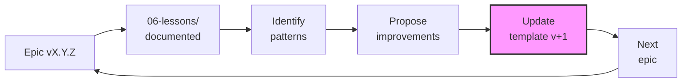

# Research Autopoietic Template

Template multipropósito para épicas de investigación que implementa el **bereshit-v3.0.0** framework con autogestión completa.

## 📋 Resumen

Este template integra:
- **DAATH-ZEN rostros**: 6 rostros metodológicos (MELQUISEDEC, HYPATIA, SALOMON, MORPHEUS, ALMA, DAATH)
- **4 Checkpoints**: Validación continua (CK-01 a CK-04)
- **HKM Standard**: Trazabilidad triple (Markdown ↔ Neo4j Graph ↔ Vector Embeddings)
- **SECI Model**: Gestión de conocimiento (Socialization → Externalization → Combination → Internalization)
- **Autopoiesis**: Feedback loop (Lessons → Template improvements)
- **Spec-Workflow-MCP**: Gestión de specs con MCP
- **Thinking Modes**: Sequential, Smart, Reasoning Branches

---

## 🚀 Quick Start

### 1. Copia este Template

```bash
cp -r .spec-workflow/_meta/templates/research-autopoietic-template/ apps/[TU_EPIC_NAME]/
cd apps/[TU_EPIC_NAME]/
```

### 2. Personaliza ISSUE.yaml

```yaml
metadata:
  title: "[TU_TÍTULO]"
  type: research | app | social-project
  status: planning
  created: [FECHA]

metadata.problem_statement: |
  [Describe tu problema central aquí]

metadata.success_criteria:
  - [Criterio 1 - medible]
  - [Criterio 2 - medible]
  - [Criterio 3 - medible]
```

### 3. Sigue el Workflow DAATH-ZEN

Ver [tasks.md](tasks.md) para lista completa de tareas.

---

## 📁 Estructura

```
research-autopoietic-template/
├── ISSUE.yaml                  # Epic metadata con autopoiesis config
├── requirements.md             # Formal specification (9 secciones)
├── design.md                   # Arquitectura completa (10 secciones)
├── tasks.md                    # DAATH-ZEN Advanced format (5 fases)
├── .spec-workflow/             # Spec-workflow-mcp gestión
│   └── context/                # Context management (smart-thinking)
├── 00-problem/                 # MELQUISEDEC (CK-01)
├── 01-literature/              # HYPATIA (CK-02)
├── 02-atomics/                 # HYPATIA (CK-02) - SECI Model
│   ├── socialization/
│   ├── externalization/
│   ├── combination/
│   └── internalization/
├── 03-workbook/                # SALOMON (CK-03)
│   ├── analysis/
│   ├── design/
│   └── decisions/              # ADRs
├── 04-artifacts/               # MORPHEUS (CK-04) - DIVERGENTE
├── 05-outputs/                 # ALMA (CK-04) - DIVERGENTE
├── 06-lessons/                 # DAATH (Post-CK-04)
└── references/                 # Guías y estrategias
```

### Estructura Divergente (04-artifacts/ y 05-outputs/)

El contenido de estas carpetas **cambia según `type` en ISSUE.yaml**:

| Type | 04-artifacts/ | 05-outputs/ |
|------|---------------|-------------|
| **research** | notebooks/, scripts/, models/ | papers/, reports/, visualizations/ |
| **app** | src/, tests/, infrastructure/ | user-docs/, releases/, api-docs/ |
| **social-project** | methodologies/, instruments/, tools/ | reports/, training/, outreach/ |

Ver [04-artifacts/README.md](04-artifacts/README.md) y [05-outputs/README.md](05-outputs/README.md) para detalles.

---

## 🎯 Workflow por Rostro DAATH-ZEN

### MELQUISEDEC (Problema) - CK-01

**Objetivo**: Definir problema, stakeholders, alcance

**Archivos clave**:
- [00-problem/problem-statement.md](00-problem/README.md)
- [00-problem/stakeholders.md](00-problem/README.md)
- [00-problem/scope-and-constraints.md](00-problem/README.md)

**MCPs**: sequential-thinking, filesystem

**Checkpoint CK-01**:
- [ ] Problem statement completo con pregunta SMART
- [ ] Success criteria medibles y alineados
- [ ] Stakeholders identificados
- [ ] Alcance y constraints documentados

---

### HYPATIA (Investigación) - CK-02

**Objetivo**: Recopilar literatura, sintetizar conceptos atómicos

**Archivos clave**:
- [01-literature/sources/](01-literature/README.md)
- [02-atomics/socialization/](02-atomics/README.md) (observaciones)
- [02-atomics/externalization/](02-atomics/README.md) (conceptos)
- [02-atomics/combination/](02-atomics/README.md) (síntesis)
- [02-atomics/internalization/](02-atomics/README.md) (lessons aplicadas)

**MCPs**: brave-search, fetch-webpage, firecrawl, markitdown, smart-thinking

**Checkpoint CK-02**:
- [ ] Mínimo [N] fuentes primarias de alta calidad
- [ ] [N] notas atómicas con SECI Model
- [ ] Smart-thinking connections ≥[N]
- [ ] validate-metadata.py pasa

---

### SALOMON (Análisis) - CK-03

**Objetivo**: Analizar alternativas, diseñar arquitectura, documentar decisiones

**Archivos clave**:
- [03-workbook/analysis/comparative-analysis.md](03-workbook/README.md)
- [03-workbook/design/architecture.md](03-workbook/README.md)
- [03-workbook/decisions/ADR-*.md](03-workbook/README.md)

**MCPs**: sequential-thinking, reasoning-branches

**Checkpoint CK-03**:
- [ ] Análisis comparativo completo
- [ ] Arquitectura con ≥3 diagramas
- [ ] [N] ADRs documentados
- [ ] Design validation pasa

---

### MORPHEUS (Implementación) - CK-04

**Objetivo**: Implementar diseño en artifacts funcionales

**Archivos clave** (DIVERGENTE según type):
- **Research**: [04-artifacts/notebooks/](04-artifacts/README.md), scripts/, models/
- **App**: [04-artifacts/src/](04-artifacts/README.md), tests/, infrastructure/
- **Social-Project**: [04-artifacts/methodologies/](04-artifacts/README.md), instruments/, tools/

**MCPs**: python-refactoring, python-env, docker

**Checkpoint CK-04 (parcial - artifacts)**:
- [ ] Artifacts implementan diseño de 03-workbook/
- [ ] Artifacts son funcionales
- [ ] Documentación inline completa

---

### ALMA (Publicación) - CK-04

**Objetivo**: Transformar artifacts en outputs publicables

**Archivos clave** (DIVERGENTE según type):
- **Research**: [05-outputs/papers/](05-outputs/README.md), reports/, visualizations/
- **App**: [05-outputs/user-docs/](05-outputs/README.md), releases/, api-docs/
- **Social-Project**: [05-outputs/reports/](05-outputs/README.md), training/, outreach/

**MCPs**: filesystem

**Checkpoint CK-04 (completo)**:
- [ ] Outputs están listos para publicación
- [ ] Outputs están completos y revisados

---

### DAATH (Reflexión) - Post-CK-04

**Objetivo**: Documentar lessons, proponer mejoras al template

**Archivos clave**:
- [06-lessons/checkpoint-lessons/](06-lessons/README.md)
- [06-lessons/technical-lessons/](06-lessons/README.md)
- [06-lessons/methodological-lessons/](06-lessons/README.md)
- [06-lessons/template-improvements.md](06-lessons/README.md)

**MCPs**: smart-thinking, git

**Validation Final**:
- [ ] Mínimo 1 lesson por checkpoint
- [ ] template-improvements.md con ≥3 propuestas
- [ ] Neo4j sync completo (validate-triple-coherence.py ✅)
- [ ] Epic archivada (Git tag + Cypher soft delete)

---

## 🔧 Autogestión con MCPs

### Thinking Modes

| Mode | Cuándo Usar | Rostro |
|------|-------------|--------|
| **Sequential Thinking** | Análisis paso a paso, razonamiento lineal | MELQUISEDEC, SALOMON |
| **Smart Thinking** | Síntesis conceptual, descubrimiento de conexiones | HYPATIA, DAATH |
| **Reasoning Branches** | Exploración de alternativas en paralelo | SALOMON |

Ver [references/mcp-orchestrator-strategy.md](references/mcp-orchestrator-strategy.md) para guía completa.

### Context Management

```yaml
# ISSUE.yaml § workflow.autopoiesis.context_management
context_management:
  session_id: ""                          # Asignado por smart-thinking MCP
  memory_enabled: true
  context_persistence: .spec-workflow/context/
  lessons_feedback: true                  # P2: Autopoiesis activada
```

Ver [.spec-workflow/context/README.md](.spec-workflow/context/README.md) para detalles.

---

## 📊 Validación y Testing

### Scripts de Validación

```bash
# 1. Validar HKM metadata compliance
python packages/daath-toolkit/validators/validate-metadata.py \
  --input apps/[TU_EPIC_NAME]/ \
  --hkm-standard

# 2. Sincronizar MD → Neo4j Graph
python packages/daath-toolkit/scripts/sync-hkm-to-neo4j.py \
  --input apps/[TU_EPIC_NAME]/ \
  --neo4j-uri bolt://localhost:7687 \
  --neo4j-user neo4j \
  --neo4j-password password

# 3. Validar triple coherence (MD ↔ Graph ↔ Vector)
python packages/daath-toolkit/validators/validate-triple-coherence.py \
  --input apps/[TU_EPIC_NAME]/ \
  --neo4j-uri bolt://localhost:7687

# 4. Archivar epic (Git tag + Cypher soft delete)
bash tools/git/archive-epic.sh \
  --epic-name [TU_EPIC_NAME] \
  --version v1.0.0 \
  --neo4j-uri bolt://localhost:7687
```

### Checklists por Checkpoint

- **Pre-CK-01**: [requirements.md](requirements.md) § 9 - Definition of Done
- **Pre-CK-02**: [tasks.md](tasks.md) § PHASE 2 - H2.4 Acceptance Criteria
- **Pre-CK-03**: [tasks.md](tasks.md) § PHASE 3 - S3.5 Acceptance Criteria
- **Pre-CK-04**: [tasks.md](tasks.md) § PHASE 4 - 4.X Acceptance Criteria
- **Post-CK-04**: [tasks.md](tasks.md) § PHASE 5 - D5.5 Definition of Done

---

## 🔄 Autopoietic Feedback Loop



**Ciclo completo**:
1. Documentar lessons durante epic ([06-lessons/](06-lessons/README.md))
2. Al finalizar CK-04, consolidar en [template-improvements.md](06-lessons/README.md)
3. Implementar mejoras en `research-autopoietic-template/`
4. Usar template mejorado en próxima épica
5. Repetir ciclo

---

## 🗂️ Archivos Core

### ISSUE.yaml

Epic metadata con configuración de autopoiesis.

**Secciones clave**:
- `metadata`: Título, tipo, status, HKM standard
- `metadata.checkpoints`: CK-01 a CK-04 con tracking
- `workflow.spec_workflow`: Gestión con spec-workflow-mcp
- `workflow.autopoiesis`: **Thinking modes + context management + MCP strategy**
- `references`: HKM, DAATH-ZEN, hybrid stack, principles
- `autopoietic_feedback`: Lessons integration para evolución

### requirements.md

Especificación formal (9 secciones).

**Secciones**:
1. Contexto (problema, justificación, alcance)
2. Objetivos (general, específicos SMART, success criteria)
3. Requirements Funcionales (por fase: investigación, análisis, artifacts, outputs)
4. Requirements No Funcionales (calidad P5/P6, reproducibilidad, autopoiesis P2)
5. Constraints y Dependencias
6. Stakeholders y Roles (mapped a rostros)
7. Timeline y Milestones (4 checkpoints)
8. Risks y Mitigaciones
9. Acceptance Criteria (Definition of Done)

### design.md

Diseño arquitectónico completo (10 secciones).

**Secciones clave**:
1. Resumen Ejecutivo
2. Arquitectura Conceptual (4 capas: Input/Processing/Output/Feedback)
3. Arquitectura Técnica (Hybrid stack: Neo4j + LlamaIndex + LangChain)
4. Diseño Metodológico (DSR + SECI Model + Zettelkasten)
5. Patterns y Best Practices (naming, checkpoints, workflows divergentes)
6. **Context & Memory Management** (smart-thinking, memory storage, reasoning branches)
7. Autopoietic Feedback Loop (lessons → template evolution)
8. Validation & Testing (scripts + checklists)
9. Referencias
10. Decisiones Pendientes

### tasks.md

Lista de tareas en formato DAATH-ZEN Advanced (5 fases, 27 tasks).

**Estructura**:
- **PHASE 1: MELQUISEDEC** (4 tasks, CK-01)
- **PHASE 2: HYPATIA** (4 tasks, CK-02)
- **PHASE 3: SALOMON** (5 tasks, CK-03)
- **PHASE 4: MORPHEUS+ALMA** (DIVERGENTE: 4A Research, 4B App, 4C Social-Project)
- **PHASE 5: DAATH** (5 tasks, Post-CK-04)

**Incluye**:
- MCP Activation Strategy Table
- Context management guide
- Validation scripts commands

---

## 🔗 Referencias

### Fundacionales

- **HKM Standard**: [docs/manifiesto/bereshit-v3.0.0.md](../../docs/manifiesto/bereshit-v3.0.0.md)
- **DAATH-ZEN Format**: [_templates/tasks.md](../../_templates/tasks.md)
- **Principles P1-P7**: [design.md](design.md) § 9

### Técnicas

- **Hybrid Stack**: Neo4j 5.15+ (graph + vector) + LlamaIndex 0.9+ (retrieval) + LangChain (orchestration)
- **Triple Persistence**: [design.md](design.md) § 3.2
- **SECI Model**: [02-atomics/README.md](02-atomics/README.md)
- **Comparative Analysis**: [docs/guides/comparative-analysis-llamaindex-langchain.md](../../docs/guides/)

### Scripts

- `packages/daath-toolkit/validators/validate-metadata.py`
- `packages/daath-toolkit/scripts/sync-hkm-to-neo4j.py`
- `packages/daath-toolkit/validators/validate-triple-coherence.py`
- `tools/git/archive-epic.sh`

---

## ❓ FAQ

### ¿Cuándo usar research vs app vs social-project type?

- **research**: Exploratory work, papers, análisis de datos, modelos ML
- **app**: Software development (backend, frontend, APIs, infraestructura)
- **social-project**: Proyectos sociales, metodologías, capacitación, intervención comunitaria

### ¿Es obligatorio usar todos los thinking modes?

No. Usa solo los necesarios según [references/mcp-orchestrator-strategy.md](references/mcp-orchestrator-strategy.md).

### ¿Puedo saltarme checkpoints?

No recomendado. Los checkpoints aseguran calidad y evitan retrabajos. Si un checkpoint es trivial, documentar que se validó implícitamente.

### ¿Cómo sincronizo a Neo4j?

```bash
python packages/daath-toolkit/scripts/sync-hkm-to-neo4j.py \
  --input apps/[TU_EPIC_NAME]/ \
  --neo4j-uri bolt://localhost:7687
```

### ¿Dónde documento lessons?

[06-lessons/](06-lessons/README.md) con subcarpetas: checkpoint-lessons/, technical-lessons/, methodological-lessons/, template-improvements.md

---

## 📝 Changelog

### v1.0.0 (2025-01-XX)

- ✅ Diseño v3.0.0 completado (85% → 95%)
- ✅ **CORRECTED GAP #1**: design.md ahora explícito en estructura
- ✅ **CORRECTED GAP #2**: Context management operacionalizado (.spec-workflow/context/)
- ✅ **CORRECTED GAP #4**: MCP orchestrator strategy documentado (references/mcp-orchestrator-strategy.md)
- ✅ Integración completa: DAATH-ZEN + HKM + SECI + Triple Persistence + Autopoiesis
- ✅ Workflows divergentes documentados (research/app/social-project)
- ✅ 4 archivos core: ISSUE.yaml (142 lines), requirements.md (358 lines), design.md (571 lines), tasks.md (586 lines)
- ✅ README.md con guías de 6 carpetas DSR (00-problem/ a 06-lessons/)
- ✅ Context management con 4 archivos (README, session-template, thoughts-graph-schema, connections-schema)

---

## 🙏 Contribuciones

Para proponer mejoras al template, documentar en [06-lessons/template-improvements.md](06-lessons/README.md) con:
- **Prioridad**: P0 (crítico) | P1 (importante) | P2 (mejora)
- **Problema**: Qué gap cubre
- **Solución**: Cambio específico al template
- **Justificación**: Por qué es importante

---

**Versión**: 1.0.0
**Última actualización**: 2025-01-XX
**Status**: ✅ Production Ready

---

**Next Steps**: Selecciona tu tipo de proyecto (research/app/social-project) y empieza por MELQUISEDEC (CK-01) 🚀
