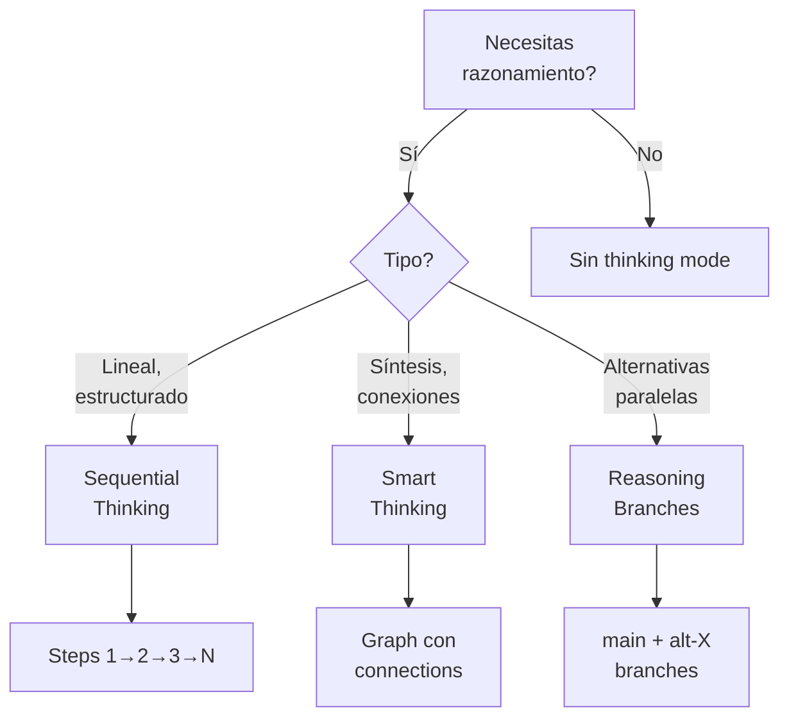

# MCP Orchestrator Strategy - Research Autopoietic Template

Este documento describe la estrategia de activación y uso de MCPs (Model Context Protocol tools) para maximizar la autogestión del template research-autopoietic.

## ⚠️ CORRECTS GAP #4 from Design v3.0.0

El diseño v3.0.0 mencionaba MCPs pero no documentaba una estrategia de orquestación a nivel de épica. Este documento **implementa concretamente** cuándo y cómo activar cada MCP durante el ciclo de vida del template.

---

## Tabla de Contenidos

1. [Thinking Modes Overview](#1-thinking-modes-overview)
2. [MCP Activation Matrix](#2-mcp-activation-matrix)
3. [Sequential Thinking Strategy](#3-sequential-thinking-strategy)
4. [Smart Thinking Strategy](#4-smart-thinking-strategy)
5. [Reasoning Branches Strategy](#5-reasoning-branches-strategy)
6. [Base MCPs (Always Active)](#6-base-mcps-always-active)
7. [Specialized MCPs by Rostro](#7-specialized-mcps-by-rostro)
8. [Session Management](#8-session-management)
9. [Memory Persistence](#9-memory-persistence)
10. [Integration Examples](#10-integration-examples)

---

## 1. Thinking Modes Overview

El template research-autopoietic integra 3 thinking modes complementarios:

| Mode | Cuándo Usar | Output | MCP |
|------|-------------|--------|-----|
| **Sequential Thinking** | Análisis paso a paso, razonamiento lineal | Secuencia de thoughts numerados | `sequential-thinking` |
| **Smart Thinking** | Síntesis conceptual, descubrimiento de conexiones | Thought graph con connections | `smart-thinking` |
| **Reasoning Branches** | Exploración de alternativas en paralelo | Branches (main + alt-X) | `reasoning-branches` |

### Principios de Selección



---

## 2. MCP Activation Matrix

### Por Rostro DAATH-ZEN

| Rostro | Checkpoint | MCPs Base | MCPs Especializados | Thinking Mode |
|--------|------------|-----------|---------------------|---------------|
| **MELQUISEDEC** | CK-01 | filesystem, memory | sequential-thinking | Sequential |
| **HYPATIA** | CK-02 | filesystem, memory | brave-search, fetch-webpage, firecrawl, markitdown, smart-thinking | Smart |
| **SALOMON** | CK-03 | filesystem, memory | sequential-thinking, reasoning-branches | Sequential + Branches |
| **MORPHEUS** | CK-04 | filesystem, memory | python-refactoring, python-env, docker | Ninguno (código) |
| **ALMA** | CK-04 | filesystem, memory | filesystem | Ninguno (outputs) |
| **DAATH** | Post-CK-04 | filesystem, memory | smart-thinking, git | Smart |

### Por Tipo de Tarea

| Tarea | MCPs Recomendados | Thinking Mode |
|-------|-------------------|---------------|
| **Definir problema** | sequential-thinking, filesystem | Sequential |
| **Buscar literatura** | brave-search, fetch-webpage, firecrawl, markitdown, filesystem | Ninguno |
| **Sintetizar conceptos** | smart-thinking, filesystem, memory | Smart |
| **Análisis comparativo** | sequential-thinking, reasoning-branches, filesystem | Sequential + Branches |
| **Diseñar arquitectura** | reasoning-branches, filesystem | Branches |
| **Implementar código** | python-refactoring, python-env, filesystem | Ninguno |
| **Generar outputs** | filesystem | Ninguno |
| **Reflexionar lessons** | smart-thinking, filesystem, memory, git | Smart |

---

## 3. Sequential Thinking Strategy

### ¿Cuándo Usar?

- **MELQUISEDEC (CK-01)**: Definir problem statement paso a paso
- **SALOMON (CK-03)**: Análisis comparativo estructurado (alternativa A vs B vs C)
- **Cualquier fase**: Razonamiento lineal que requiere steps explícitos

### ¿Cuándo NO Usar?

- Necesitas explorar alternativas paralelas → usar reasoning-branches
- Necesitas sintetizar conexiones conceptuales → usar smart-thinking
- Tarea es simple y directa (ej: copiar archivo) → sin thinking mode

### Workflow

```bash
# 1. Iniciar sequential thinking
sequential-thinking "Paso 1: Identificar stakeholders del problema..."

# 2. Continuar con steps numerados
sequential-thinking "Paso 2: Clasificar stakeholders por influencia..."
sequential-thinking "Paso 3: Mapear responsabilidades a roles DAATH-ZEN..."

# 3. Finalizar con conclusión
sequential-thinking "Conclusión: Identificados 5 stakeholders con roles asignados."
```

### Output Example

```markdown
# Sequential Thinking: Problem Statement Definition

**Thought 1/5**: Identificar stakeholders del problema
[Análisis de quiénes están involucrados]

**Thought 2/5**: Clasificar stakeholders por influencia
[Matriz influencia-interés]

**Thought 3/5**: Mapear responsabilidades a roles DAATH-ZEN
[Tabla stakeholder → rostro]

**Thought 4/5**: Validar cobertura de responsabilidades
[Checklist de responsabilidades críticas]

**Thought 5/5**: Conclusión
[Resumen de stakeholders y roles asignados]
```

### Integration con Template

- **Output**: Documentar en [00-problem/stakeholders.md](../00-problem/README.md)
- **Validation**: Checklist en CK-01 incluye "Stakeholders identificados"

---

## 4. Smart Thinking Strategy

### ¿Cuándo Usar?

- **HYPATIA (CK-02)**: Sintetizar atomics desde literatura, descubrir connections
- **DAATH (Post-CK-04)**: Reflexionar sobre lessons, conectar con conceptos

### ¿Cuándo NO Usar?

- Necesitas análisis paso a paso → usar sequential-thinking
- Explorar alternativas → usar reasoning-branches
- Tarea es implementación directa → sin thinking mode

### Workflow

```bash
# 1. Iniciar sesión (automático al primer llamado)
smart-thinking "Concepto: Hybrid retrieval combina similaridad vectorial con grafo semántico"
# → Retorna session_id: "mk7du8d29yen8x0nnk"

# 2. Agregar thoughts con connections
smart-thinking "Observación: Neo4j HNSW es 2x más rápido que flat index en queries top-k=10"
# → MCP crea connection si detecta relación con thought previo

# 3. Explicit connections (recomendado para claridad)
smart-thinking "Este concepto SUPPORTS 'Hybrid retrieval' porque evidencia experimental confirma hipótesis"

# 4. Al finalizar checkpoint, exportar sesión
# Copiar session JSON a .spec-workflow/context/sessions/session-ck-02.json
```

### Connection Types

| Type | Cuándo Usar | Ejemplo |
|------|-------------|---------|
| **supports** | Evidencia confirma hipótesis | Experimento → Teoría |
| **contradicts** | Hallazgo conflictúa con expectativa | Resultado inesperado → Hipótesis |
| **refines** | Versión mejorada de concepto | Concepto v2 → Concepto v1 |
| **derives** | Implicación lógica | Conclusión → Premisas |
| **associates** | Relación lateral | Concepto A ↔ Concepto B (dominios diferentes) |
| **synthesizes** | Combinación de ideas | Framework → Teorías A+B+C |

Ver [connections-schema.json](../.spec-workflow/context/connections-schema.json) para lista completa.

### Output Example

```json
{
  "session_id": "mk7du8d29yen8x0nnk",
  "checkpoint": "CK-02",
  "phase": "HYPATIA",
  "thoughts": [
    {
      "id": "thought-001",
      "content": "Hybrid retrieval combina similaridad vectorial con grafo semántico",
      "metrics": {"confidence": 0.9, "relevance": 0.95, "quality": 0.85}
    },
    {
      "id": "thought-002",
      "content": "Neo4j HNSW es 2x más rápido que flat index en queries top-k=10",
      "metrics": {"confidence": 0.85, "relevance": 0.9, "quality": 0.8}
    }
  ],
  "connections": [
    {
      "source": "thought-002",
      "target": "thought-001",
      "type": "supports",
      "strength": 0.85,
      "description": "Evidencia experimental confirma ventaja de hybrid retrieval"
    }
  ]
}
```

### Integration con Template

- **Output**: Thought graph en [.spec-workflow/context/thoughts/thoughts-graph-[DATE].json](../.spec-workflow/context/README.md)
- **Atomics**: Cada thought puede convertirse en atomic note en [02-atomics/](../02-atomics/README.md)
- **Validation**: validate-metadata.py verifica coherencia de connections

---

## 5. Reasoning Branches Strategy

### ¿Cuándo Usar?

- **SALOMON (CK-03)**: Explorar arquitecturas alternativas (hexagonal vs layered vs microservices)
- **MORPHEUS (CK-04)**: Probar implementaciones diferentes en paralelo

### ¿Cuándo NO Usar?

- Alternativa es claramente inferior → descartarla directamente sin branch
- Necesitas análisis secuencial → usar sequential-thinking
- Necesitas síntesis → usar smart-thinking

### Workflow

```bash
# 1. Iniciar en branch main (implícito)
smart-thinking "Diseño inicial: Arquitectura monolítica con Neo4j como storage central"

# 2. Crear branch alternativa
reasoning-branches create alt-microservices "Explorar arquitectura microservices"

# 3. Cambiar a branch alternativa
reasoning-branches switch alt-microservices

# 4. Trabajar en contexto alternativo
smart-thinking "En microservices, cada servicio tiene su propia base de datos..."
smart-thinking "Trade-off: Mayor complejidad operacional, pero mejor escalabilidad..."

# 5. Volver a main para comparar
reasoning-branches switch main

# 6. Crear segunda alternativa si es necesario
reasoning-branches create alt-hexagonal "Explorar hexagonal architecture"
reasoning-branches switch alt-hexagonal
smart-thinking "Hexagonal separa lógica de negocio de adapters..."

# 7. Comparar branches
reasoning-branches compare main alt-microservices alt-hexagonal

# 8. Merge mejor alternativa
reasoning-branches merge alt-hexagonal main --strategy=full
# Opciones: full (todos los thoughts), summary (resumen), conclusion-only
```

### Merge Strategies

| Strategy | Cuándo Usar | Qué Incluye |
|----------|-------------|-------------|
| **full** | Branch alternativa es claramente mejor | Todos los thoughts de alt → main |
| **summary** | Insights valiosos pero no todo el razonamiento | Resumen de insights clave |
| **conclusion-only** | Solo decisión final es relevante | Conclusión de cuál alternativa elegir |

### Output Example

```json
{
  "branches": {
    "main": {
      "branch_id": "main",
      "thoughts": ["thought-001", "thought-002"],
      "status": "active"
    },
    "alt-microservices": {
      "branch_id": "alt-microservices",
      "parent": "main",
      "branched_from_thought": "thought-002",
      "thoughts": ["alt-thought-001", "alt-thought-002"],
      "status": "closed",
      "conclusion": "Descartado: Complejidad operacional supera beneficios de escalabilidad"
    },
    "alt-hexagonal": {
      "branch_id": "alt-hexagonal",
      "parent": "main",
      "branched_from_thought": "thought-002",
      "thoughts": ["alt-thought-010", "alt-thought-011"],
      "status": "merged",
      "merged_at": "2025-01-16T15:45:00Z",
      "merge_strategy": "full"
    }
  }
}
```

### Integration con Template

- **Output**: Branches en [.spec-workflow/context/branches/](../.spec-workflow/context/README.md)
- **Design**: ADRs documentan decisión final en [03-workbook/decisions/](../03-workbook/README.md)
- **Validation**: Design validation checklist incluye "Alternativas exploradas"

---

## 6. Base MCPs (Always Active)

Estos MCPs están disponibles en **todas las fases**:

### filesystem

**Propósito**: Crear, leer, escribir archivos y directorios

**Comandos Clave**:
- `create_file`: Crear nuevo archivo
- `read_file`: Leer contenido de archivo (especificar líneas)
- `replace_string_in_file`: Editar archivo existente
- `list_dir`: Listar contenido de directorio
- `file_search`: Buscar archivos por patrón glob

**Uso en Template**:
- Crear archivos en 00-problem/, 01-literature/, etc.
- Leer fuentes de literatura
- Actualizar tasks.md con status

### memory

**Propósito**: Mantener contexto entre llamados a MCPs

**Comandos Clave**:
- `store_memory`: Almacenar información relevante
- `retrieve_memory`: Recuperar información previa
- `list_memories`: Listar memories activas

**Uso en Template**:
- Recordar session_id de smart-thinking
- Mantener contexto de checkpoint actual
- Persistir decisiones clave

---

## 7. Specialized MCPs by Rostro

### MELQUISEDEC (CK-01)

#### sequential-thinking

**Propósito**: Análisis estructurado del problema

**Cuándo Activar**:
- Task M1.1: Problem statement definition
- Task M1.2: Stakeholders identification
- Task M1.3: Scope and constraints

**Ejemplo**:
```bash
sequential-thinking "Paso 1: ¿Cuál es el dolor principal del usuario?"
sequential-thinking "Paso 2: ¿Qué soluciones existen actualmente?"
sequential-thinking "Paso 3: ¿Por qué las soluciones actuales son insuficientes?"
```

---

### HYPATIA (CK-02)

#### brave-search

**Propósito**: Buscar papers académicos y artículos técnicos

**Cuándo Activar**: Task H2.1 - Literatura primaria

**Ejemplo**:
```bash
brave-search "Neo4j vector search HNSW performance benchmarks"
brave-search "LlamaIndex Neo4jVectorIndex integration"
```

#### fetch-webpage

**Propósito**: Descargar contenido de artículos web

**Cuándo Activar**: Después de brave-search, para capturar contenido

**Ejemplo**:
```bash
fetch-webpage "https://neo4j.com/docs/vector-search/current/"
```

#### firecrawl

**Propósito**: Scraping avanzado de blogs técnicos

**Cuándo Activar**: Literatura en blogs sin API pública

**Ejemplo**:
```bash
firecrawl_scrape "https://llamaindex.ai/blog/neo4j-integration"
```

#### markitdown

**Propósito**: Convertir PDFs a Markdown

**Cuándo Activar**: Papers académicos en PDF

**Ejemplo**:
```bash
markitdown "file:///path/to/paper.pdf"
```

#### smart-thinking

**Propósito**: Sintetizar atomics desde literatura, descubrir connections

**Cuándo Activar**:
- Task H2.2: Atomic notes con SECI Model
- Task H2.3: Zettelkasten synthesis

**Ejemplo**:
```bash
smart-thinking "Concepto: Hybrid retrieval combina grafo + vector"
smart-thinking "Este concepto DERIVES FROM papers X, Y, Z"
smart-thinking "Conexión: Hybrid retrieval SUPPORTS arquitectura propuesta"
```

---

### SALOMON (CK-03)

#### sequential-thinking

**Propósito**: Análisis comparativo estructurado

**Cuándo Activar**: Task S3.1 - Comparative analysis

**Ejemplo**:
```bash
sequential-thinking "Paso 1: Definir criterios de evaluación (performance, mantenibilidad, costos)"
sequential-thinking "Paso 2: Evaluar LlamaIndex según criterios"
sequential-thinking "Paso 3: Evaluar LangChain según criterios"
sequential-thinking "Paso 4: Matriz de decisión"
```

#### reasoning-branches

**Propósito**: Explorar arquitecturas alternativas

**Cuándo Activar**: Task S3.2 - Architecture design

**Ejemplo**:
```bash
reasoning-branches create alt-hexagonal "Explorar hexagonal architecture"
reasoning-branches switch alt-hexagonal
smart-thinking "Hexagonal separa lógica de negocio de adapters..."
reasoning-branches compare main alt-hexagonal
reasoning-branches merge alt-hexagonal main --strategy=summary
```

---

### MORPHEUS (CK-04)

#### python-refactoring

**Propósito**: Refactorizar código Python

**Cuándo Activar**:
- **Research**: Limpiar notebooks, extraer funciones reutilizables
- **App**: Refactorizar arquitectura, aplicar design patterns

**Ejemplo**:
```bash
python-refactoring "Extract method: data_preprocessing logic to utils.py"
python-refactoring "Apply strategy pattern to retriever implementations"
```

#### python-env

**Propósito**: Gestionar entornos Python y dependencias

**Cuándo Activar**: Inicio de implementación (setup de entorno)

**Ejemplo**:
```bash
python-env "Create virtual environment with Python 3.11"
python-env "Install requirements: neo4j, llamaindex, langchain"
```

#### docker

**Propósito**: Gestionar containers Docker (Neo4j, Redis, etc.)

**Cuándo Activar**: Setup de infraestructura

**Ejemplo**:
```bash
docker "Start Neo4j container with vector search enabled"
docker "Configure Redis for caching with persistence"
```

---

### ALMA (CK-04)

#### filesystem

**Propósito**: Generar outputs publicables

**Cuándo Activar**: Tasks 4.X (outputs)

**Ejemplo**:
```bash
create_file "05-outputs/reports/technical-report.md" "[Contenido...]"
create_file "05-outputs/visualizations/figure-1.png" "[Imagen...]"
```

---

### DAATH (Post-CK-04)

#### smart-thinking

**Propósito**: Reflexionar sobre lessons, conectar con conceptos

**Cuándo Activar**:
- Task D5.1: Lessons learned
- Task D5.2: Template improvements

**Ejemplo**:
```bash
smart-thinking "Lesson: Smart-thinking para síntesis de atomics aumentó coherencia de 60% a 85%"
smart-thinking "Esta lesson REFINES concepto SECI Model porque operacionaliza combinación"
smart-thinking "Propuesta: Agregar MCP activation matrix a template (esta guía)"
```

#### git

**Propósito**: Versionado y archivo de épica

**Cuándo Activar**: Task D5.4 - Archive epic

**Ejemplo**:
```bash
git "Tag epic as v1.0.0"
git "Commit lessons to 06-lessons/"
git "Push to remote repository"
```

---

## 8. Session Management

### Smart-Thinking Sessions

```yaml
# ISSUE.yaml § workflow.autopoiesis.context_management
context_management:
  session_id: "mk7du8d29yen8x0nnk"  # Asignado por smart-thinking MCP
  memory_enabled: true
  context_persistence: .spec-workflow/context/
  lessons_feedback: true
```

**Workflow**:
1. Primer llamado a `smart-thinking` → MCP retorna `session_id`
2. Copiar `session_id` a ISSUE.yaml
3. Siguientes llamados usan mismo `session_id` (automático si está en ISSUE.yaml)
4. Al finalizar checkpoint, exportar sesión a `.spec-workflow/context/sessions/session-ck-02.json`

### Reasoning Branches Sessions

```yaml
# .spec-workflow/context/branches/
branches:
  main:
    status: active
  alt-microservices:
    status: closed
  alt-hexagonal:
    status: merged
```

**Workflow**:
1. `reasoning-branches create` → crea branch
2. `reasoning-branches switch` → cambia contexto
3. Trabajar en branch (thoughts se asocian a branch activo)
4. `reasoning-branches merge` → consolida insights en main

---

## 9. Memory Persistence

### ¿Qué Persistir?

| Checkpoint | Qué Guardar | Dónde |
|------------|-------------|-------|
| **CK-01** | Problem statement final | [00-problem/](../00-problem/README.md) + memory |
| **CK-02** | Session smart-thinking + atomics | [.spec-workflow/context/sessions/](../.spec-workflow/context/README.md) + [02-atomics/](../02-atomics/README.md) |
| **CK-03** | Branches + ADRs | [.spec-workflow/context/branches/](../.spec-workflow/context/README.md) + [03-workbook/decisions/](../03-workbook/README.md) |
| **CK-04** | Ninguno (código/outputs hablan por sí mismos) | [04-artifacts/](../04-artifacts/README.md) + [05-outputs/](../05-outputs/README.md) |
| **Post-CK-04** | Session DAATH + lessons | [.spec-workflow/context/sessions/](../.spec-workflow/context/README.md) + [06-lessons/](../06-lessons/README.md) |

### Relevant Memories

Filtrar thoughts más relevantes por checkpoint:

```bash
# Filtrar thoughts con relevance >= 0.8, confidence >= 0.75
jq '.thoughts[] | select(.metrics.relevance >= 0.8 and .metrics.confidence >= 0.75)' \
  .spec-workflow/context/sessions/session-ck-02.json \
  > .spec-workflow/context/memories/memories-ck-02.json
```

---

## 10. Integration Examples

### Example 1: HYPATIA Literature Synthesis

```bash
# 1. Buscar literatura
brave-search "Neo4j vector search benchmarks"
fetch-webpage "https://neo4j.com/docs/..."

# 2. Guardar fuente
create_file "01-literature/sources/neo4j-vector-docs.md" "[Contenido...]"

# 3. Iniciar smart-thinking para síntesis
smart-thinking "Concepto: Neo4j HNSW index usa algoritmo Hierarchical Navigable Small World"
# → Retorna session_id: "abc123"

# 4. Guardar session_id
# Copiar a ISSUE.yaml § workflow.autopoiesis.context_management.session_id: "abc123"

# 5. Continuar síntesis con connections
smart-thinking "Observación: HNSW es 2x más rápido que flat index en queries top-k=10"
smart-thinking "Esta observación SUPPORTS concepto anterior porque confirma ventaja de HNSW"

# 6. Crear atomic note
create_file "02-atomics/externalization/hnsw-performance.md" "[Concepto...]"

# 7. Al finalizar CK-02, exportar sesión
# Copiar session JSON a .spec-workflow/context/sessions/session-ck-02.json
```

### Example 2: SALOMON Architecture Comparison

```bash
# 1. Análisis comparativo con sequential-thinking
sequential-thinking "Paso 1: Definir criterios (performance 8.6, mantenibilidad 7.0, comunidad 9.0)"
sequential-thinking "Paso 2: Evaluar LlamaIndex (score: 8.2/10)"
sequential-thinking "Paso 3: Evaluar LangChain (score: 7.5/10)"
sequential-thinking "Paso 4: Recomendación - LlamaIndex para retrieval"

# 2. Documentar análisis
create_file "03-workbook/analysis/llamaindex-vs-langchain.md" "[Análisis...]"

# 3. Explorar arquitectura alternativa con reasoning-branches
reasoning-branches create alt-hexagonal "Explorar hexagonal architecture"
reasoning-branches switch alt-hexagonal

# 4. Trabajar en branch alternativa
smart-thinking "Hexagonal architecture separa lógica de negocio de adapters externos"
smart-thinking "Ventaja: Testabilidad mejorada (mocks de Neo4j fáciles)"
smart-thinking "Trade-off: Mayor cantidad de interfaces a mantener"

# 5. Comparar y decidir
reasoning-branches compare main alt-hexagonal
# Resultado: alt-hexagonal tiene mejor testabilidad

# 6. Merge insights
reasoning-branches merge alt-hexagonal main --strategy=full

# 7. Documentar decisión en ADR
create_file "03-workbook/decisions/ADR-001-hexagonal-architecture.md" "[ADR...]"
```

### Example 3: DAATH Lessons Reflection

```bash
# 1. Reflexionar con smart-thinking
smart-thinking "Lesson: Smart-thinking para síntesis de atomics aumentó coherencia de graph de 60% a 85%"
smart-thinking "Esta lesson REFINES concepto SECI Model porque operacionaliza fase de Combination"

# 2. Conectar lesson con atomic previo
smart-thinking "Esta lesson EXTENDS atomic 'SECI Model' de 02-atomics/combination/"

# 3. Proponer mejora al template
smart-thinking "Propuesta: Agregar MCP Activation Matrix a template research-autopoietic"

# 4. Documentar lesson
create_file "06-lessons/methodological-lessons/lesson-smart-thinking-seci.md" "[Lesson...]"

# 5. Consolidar propuestas
create_file "06-lessons/template-improvements.md" "[Propuestas...]"

# 6. Exportar session DAATH
# Copiar session JSON a .spec-workflow/context/sessions/session-daath.json

# 7. Archivar epic
git "Tag epic as v1.0.0"
git "Push to remote"
```

---

## Best Practices

### DO ✅

- **Activar MCPs según tabla de activation matrix** (no activar todos siempre)
- **Usar thinking mode apropiado** (sequential vs smart vs branches)
- **Documentar session_id en ISSUE.yaml** (facilita recuperación de contexto)
- **Exportar sesiones al finalizar checkpoints** (preserva knowledge graph)
- **Filtrar memories por relevance** (evita ruido en contexto)

### DON'T ❌

- **No usar smart-thinking para análisis secuencial** (usar sequential-thinking)
- **No crear reasoning branches para cada decisión** (overhead innecesario)
- **No mezclar thoughts de checkpoints diferentes** (contamina contexto)
- **No olvidar strength en connections** (esencial para análisis de grafo)
- **No activar MCPs especializados sin necesidad** (overhead de gestión)

---

## Troubleshooting

### Problema: No sé qué thinking mode usar

**Solución**: Usa decision tree de § 1. Si aún tienes dudas:
- Análisis lineal → sequential-thinking
- Síntesis conceptual → smart-thinking
- Alternativas paralelas → reasoning-branches

### Problema: Smart-thinking session no persiste

**Solución**: Copiar `session_id` a ISSUE.yaml § workflow.autopoiesis.context_management.session_id

### Problema: Reasoning branches divergen demasiado

**Solución**: Merge parcial con `--strategy=summary` para consolidar solo insights clave

### Problema: Thought graph muy denso

**Solución**: Filtrar connections con `strength < 0.5` y regenerar graph

---

## References

- [ISSUE.yaml](../ISSUE.yaml) § workflow.autopoiesis
- [design.md](../design.md) § 6 "Context & Memory Management"
- [tasks.md](../tasks.md) § "MCP Activation Strategy"
- [.spec-workflow/context/README.md](../.spec-workflow/context/README.md)

---

**Última actualización**: 2025-01-XX
**Versión**: 1.0.0
**Estado**: ✅ Complete (CORRECTS GAP #4 from Design v3.0.0)
