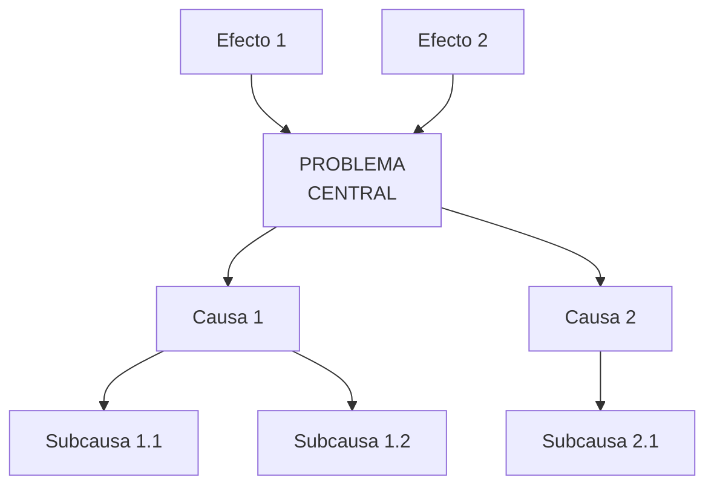
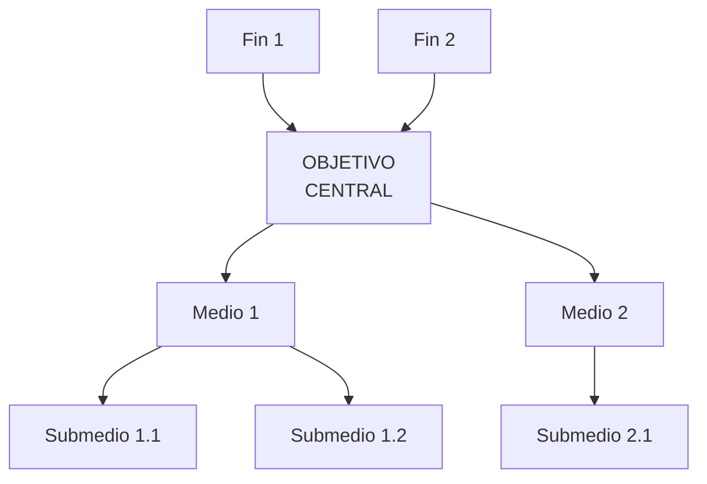
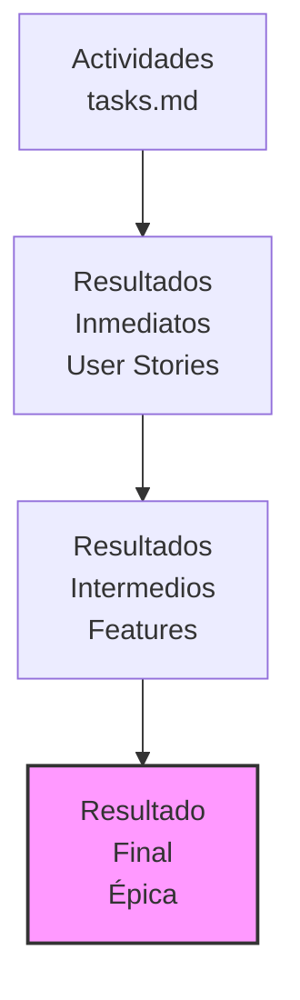

# Unified Research Template Design v4.2.0

<!-- HKM Metadata -->
---
hkm_type: concept
epistemic_level: synthesis
title: "Unified Research Template Design v4.2.0"
created: 2026-01-09
updated: 2026-01-09
version: 4.2.0
tags: [template-design, unified-methodology, rbm-gac, autopoiesis, daath-zen]
synthesis_from:
  - unified-research-template-design-v4.0.0.md
  - research-autopoietic-template v1.0.0
  - RBM-GAC methodology
  - Marco Lógico approach
previous_version: 4.0.0
---

## Resumen de Cambios v4.0.0 → v4.2.0

Esta versión introduce **simplificación estructural** y **alineación con estándares RBM-GAC** (Results-Based Management - Gestión por Resultados):

### Cambios Principales

1. ✅ **Unificación de problem.md + requirements.md** con árbol lógico RBM-GAC
2. ✅ **Restructuración de fase conceptual** en 020-conceive/ universal
3. ✅ **Separación clara** entre artefactos exploratorios y productivos
4. ✅ **Realineación de checkpoints** con nueva estructura de 5 fases
5. ✅ **5 gaps adicionales corregidos** (GAP #5 a GAP #9)

### Breaking Changes

- ⚠️ **Estructura de carpetas cambia** de 6 folders (00-06) a 5 folders (010-050)
- ⚠️ **requirements.md integra problem statement** (elimina 00-problem/ separado)
- ⚠️ **Checkpoints realineados**: CK-01 (010-define), CK-02 (020-conceive), CK-03 (030-build), CK-04 (040-release)

---

## Tabla de Contenidos

1. [Filosofía del Template v4.2.0](#1-filosofía-del-template-v420)
2. [Estructura de 5 Fases](#2-estructura-de-5-fases)
3. [Fase 010-define (MELQUISEDEC)](#3-fase-010-define-melquisedec)
4. [Fase 020-conceive (HYPATIA + SALOMON)](#4-fase-020-conceive-hypatia--salomon)
5. [Fase 030-build (MORPHEUS)](#5-fase-030-build-morpheus)
6. [Fase 040-release (ALMA)](#6-fase-040-release-alma)
7. [Fase 050-reflect (DAATH)](#7-fase-050-reflect-daath)
8. [Metodología RBM-GAC Integrada](#8-metodología-rbm-gac-integrada)
9. [Checkpoints Realineados](#9-checkpoints-realineados)
10. [Gaps Corregidos (GAP #5 a #9)](#10-gaps-corregidos-gap-5-a-9)
11. [Comparación v4.0.0 vs v4.2.0](#11-comparación-v400-vs-v420)

---

## 1. Filosofía del Template v4.2.0

### 1.1. Principios Fundamentales (Conservados)

Los 7 principios P1-P7 de bereshit-v3.0.0 se mantienen:

- **P1: Synthesis over Documentation** (Foco en síntesis conceptual)
- **P2: Autopoiesis** (Template evoluciona con uso)
- **P3: Issue-Driven** (Epic central con ISSUE.yaml)
- **P4: Validated Research** (4 checkpoints de validación)
- **P5: Traceability** (HKM standard, triple persistence)
- **P6: Recursive Structure** (Fractality, epiclets)
- **P7: Unified Hybrid Stack** (Neo4j + LlamaIndex + LangChain)

### 1.2. Nuevos Principios v4.2.0

- **P8: Results-Based Structure** (Estructura alineada con RBM-GAC)
- **P9: Universal Conceptual Phase** (020-conceive/ universal para todo tipo de épica)
- **P10: Exploratory vs Productive Separation** (Artefactos exploratorios en 020-conceive/, productivos en 030-build/)

### 1.3. Motivación de Cambios

#### Problema 1: Redundancia entre problem.md y requirements.md

**Situación v4.0.0**:
- 00-problem/problem-statement.md describe el problema
- requirements.md § 1 Contexto también describe el problema
- Mantenimiento duplicado, inconsistencias

**Solución v4.2.0**:
- **requirements.md ÚNICO** integra árbol de problemas (Marco Lógico)
- Estructura jerárquica: problema central → causas → efectos → soluciones → requirements
- Trazabilidad: Problema X → Causa Y → Requirement Z → Artefacto W

#### Problema 2: Fase conceptual fragmentada

**Situación v4.0.0**:
- 01-literature/, 02-atomics/, 03-workbook/ en raíz
- No está claro cuándo termina investigación y empieza implementación
- Artefactos exploratorios (notebooks PoC) mezclados con productivos

**Solución v4.2.0**:
- **020-conceive/** agrupa TODO el trabajo conceptual/investigación
- Estructura fija: 01-literature → 02-atomics → 03-workbook → 04-datasets → 05-artifacts → 06-outputs
- **Universal**: Misma estructura para research/app/social-project (toda épica necesita investigar)

#### Problema 3: Checkpoints ambiguos

**Situación v4.0.0**:
- CK-01 a CK-04 mapean a rostros DAATH-ZEN
- Pero rostros no tienen boundaries claros con estructura de carpetas
- Ejemplo: ¿CK-02 valida 01-literature/ + 02-atomics/ o solo 02-atomics/?

**Solución v4.2.0**:
- **Checkpoints alineados con fases**:
  * CK-01: Fin de 010-define/ (problema + requirements validados)
  * CK-02: Fin de 020-conceive/ (investigación completa)
  * CK-03: Fin de 030-build/ (artefactos productivos funcionales)
  * CK-04: Fin de 040-release/ (outputs publicados)

---

## 2. Estructura de 5 Fases

### 2.1. Vista General

```
research-autopoietic-template-v4.2/
├── ISSUE.yaml                      # Epic metadata (conservado)
├── design.md                       # Arquitectura completa (conservado)
├── tasks.md                        # Tareas en formato DAATH-ZEN Advanced (actualizado)
├── .spec-workflow/                 # 🆕 Spec-workflow-mcp gestión (estructura oficial)
│   ├── config.toml                 # Configuración opcional
│   ├── steering/                   # Documentos de dirección
│   │   ├── product.md              # Visión del proyecto
│   │   ├── tech.md                 # Stack técnico
│   │   └── structure.md            # Estructura del proyecto
│   ├── specs/                      # Especificaciones (cada spec es un folder)
│   ├── approvals/                  # Aprobaciones pendientes (auto-generado)
│   ├── archive/                    # Specs archivadas (auto-generado)
│   ├── templates/                  # Templates personalizados
│   └── README.md                   # Documentación spec-workflow
├── .melquisedec/                   # 🆕 Context management + templates DAATH-ZEN
│   ├── context/                    # Gestión de contexto MCP
│   │   ├── README.md
│   │   ├── sessions/               # Sesiones smart-thinking
│   │   ├── thoughts/               # Grafos de pensamientos
│   │   ├── branches/               # Ramas de razonamiento
│   │   └── memories/               # Memoria persistente
│   └── templates/                  # Templates para artefactos DAATH-ZEN
│       ├── atomic-concept.md       # Template para conceptos atómicos
│       ├── adr-template.md         # Template para ADRs
│       └── lesson-learned.md       # Template para lecciones
├── 010-define/                     # 🆕 MELQUISEDEC (CK-01)
│   ├── README.md
│   └── requirements.md             # 🆕 ÚNICO (integra problema + RBM-GAC)
├── 020-conceive/                   # 🆕 HYPATIA + SALOMON (CK-02)
│   ├── README.md
│   ├── 01-literature/
│   ├── 02-atomics/
│   ├── 03-workbook/
│   ├── 04-datasets/                # 🆕 Datasets de investigación
│   ├── 05-artifacts/               # 🆕 Artefactos exploratorios
│   └── 06-outputs/                 # 🆕 Outputs preliminares
├── 030-build/                      # 🆕 MORPHEUS (CK-03) - DIVERGENTE
│   ├── README.md
│   ├── research/                   # Implementaciones productivas
│   ├── app/                        # Código fuente productivo
│   └── social-project/             # Metodologías aplicadas
├── 040-release/                    # 🆕 ALMA (CK-04) - DIVERGENTE
│   ├── README.md
│   ├── research/                   # Papers, reports finales
│   ├── app/                        # User docs, releases
│   └── social-project/             # Reportes, capacitaciones
├── 050-reflect/                    # 🆕 DAATH (Post-CK-04)
│   ├── README.md
│   ├── lessons/
│   │   ├── checkpoint-lessons/
│   │   ├── technical-lessons/
│   │   └── methodological-lessons/
│   └── template-improvements.md
└── references/                     # Guías y estrategias (conservado)
    └── mcp-orchestrator-strategy.md
```

### 2.2. Mapeo Fases ↔ Rostros DAATH-ZEN

| Fase | Rostro(s) | Checkpoint | Propósito | Divergencia |
|------|-----------|------------|-----------|-------------|
| **010-define/** | MELQUISEDEC | CK-01 | Definir problema, cadena de resultados RBM-GAC | ❌ Universal |
| **020-conceive/** | HYPATIA + SALOMON | CK-02 | Investigar, sintetizar, diseñar | ❌ Universal |
| **030-build/** | MORPHEUS | CK-03 | Implementar artefactos productivos | ✅ Divergente |
| **040-release/** | ALMA | CK-04 | Publicar outputs finales | ✅ Divergente |
| **050-reflect/** | DAATH | Post-CK-04 | Reflexionar, mejorar template | ❌ Universal |

### 2.3. Separación: `.spec-workflow/` vs `.melquisedec/`

**Decisión de diseño**: Los directorios `.spec-workflow/` y `.melquisedec/` (o `.daath-zen/`) tienen propósitos diferentes y están separados.

#### `.spec-workflow/` (Spec-Workflow-MCP)

**Propósito**: Gestión de especificaciones según formato oficial de **spec-workflow-mcp**

**Estructura oficial**:
```
.spec-workflow/
├── config.toml              # Configuración opcional del servidor MCP
├── steering/                # Documentos de dirección del proyecto
│   ├── product.md           # Visión del producto
│   ├── tech.md              # Stack técnico
│   └── structure.md         # Estructura del proyecto
├── specs/                   # Especificaciones (cada spec es un FOLDER)
│   └── {spec-name}/
│       ├── requirements.md
│       ├── design.md
│       └── tasks.md
├── approvals/               # (auto-generado) Aprobaciones pendientes
├── archive/                 # (auto-generado) Specs archivadas
└── templates/               # Templates personalizados de specs
```

**Herramienta**: `@pimzino/spec-workflow-mcp` (VS Code extension + dashboard)

#### `.melquisedec/` o `.daath-zen/` (Context + Templates DAATH-ZEN)

**Propósito**: Context management de MCPs + templates para artefactos DAATH-ZEN

**Estructura**:
```
.melquisedec/  (o .daath-zen/)
├── context/                 # Gestión de contexto MCP
│   ├── README.md            # Documentación de schemas
│   ├── sessions/            # Sesiones smart-thinking MCP
│   │   └── session-ck-{N}.json
│   ├── thoughts/            # Grafos de pensamientos
│   │   └── thoughts-graph-{DATE}.json
│   ├── branches/            # Ramas de razonamiento
│   │   └── branch-{ID}.json
│   └── memories/            # Memoria persistente
│       └── memories-ck-{N}.json
└── templates/               # Templates para artefactos DAATH-ZEN
    ├── atomic-concept.md    # Template § SECI Model
    ├── adr-template.md      # Template ADR (Architecture Decision Record)
    └── lesson-learned.md    # Template lección aprendida
```

**MCPs relacionados**: `smart-thinking`, `sequential-thinking`, `mcp-maxential-thi`, `obsidian` (si se usan estos MCPs para context management)

#### Justificación de Separación

| Aspecto | `.spec-workflow/` | `.melquisedec/` |
|---------|-------------------|-----------------|
| **Propósito** | Gestión de specs | Context management + templates |
| **Herramienta** | spec-workflow-mcp | MCPs (smart-thinking, etc.) |
| **Formato** | Estándar oficial de spec-workflow | Custom para DAATH-ZEN |
| **Generación** | Manual + dashboard | Auto-generado por MCPs |
| **Versionado** | ✅ Sí (specs versionadas) | ⚠️ Opcional (context es efímero) |
| **Documentación** | requirements.md, design.md, tasks.md | Sessions, thoughts, memories (JSON) |

**Ventaja**: Al separar `.spec-workflow/` (estándar oficial) de `.melquisedec/` (custom DAATH-ZEN), el template:
- ✅ Es 100% compatible con spec-workflow-mcp sin modificaciones
- ✅ Permite context management extenso sin contaminar estructura spec-workflow
- ✅ Facilita integración con otros proyectos que usan spec-workflow-mcp estándar

---

### 2.4. Ventajas de Estructura de 5 Fases

✅ **Claridad conceptual**: Cada fase tiene propósito único e inequívoco
✅ **Alineación estándar**: Mapea a ciclo clásico de proyectos (análisis → diseño → implementación → despliegue → mejora)
✅ **Reducción de divergencia prematura**: Solo 2 de 5 fases son divergentes (030-build/, 040-release/)
✅ **Escalabilidad**: Fases universales (010, 020, 050) se reutilizan sin modificación
✅ **Checkpoints alineados**: CK-01 a CK-04 mapean 1:1 con fases 010 a 040

---

## 3. Fase 010-define (MELQUISEDEC)

### 3.1. Propósito

Definir **completamente** el problema, la cadena de resultados RBM-GAC, y los requirements formales.

### 3.2. Estructura

```
010-define/
├── README.md               # Guía de uso de la fase
└── requirements.md         # 🆕 DOCUMENTO ÚNICO (integra problema + RBM-GAC)
```

### 3.3. Contenido de requirements.md v4.2.0

**Estructura de 9 secciones** (refinada):

#### § 1. Contexto y Problema

**1.1. Árbol de Problemas** (Marco Lógico):


**1.2. Descripción del Problema Central**:
- Formulación SMART del problema
- Contexto y justificación
- Población/dominio afectado
- Magnitud y urgencia

**1.3. Análisis de Causas**:
- Causas directas (nivel 1)
- Subcausas (nivel 2, 3...)
- Evidencia empírica de causalidad

**1.4. Análisis de Efectos**:
- Efectos directos (corto plazo)
- Efectos indirectos (mediano/largo plazo)
- Impacto sistémico

#### § 2. Objetivos y Cadena de Resultados RBM-GAC

**2.1. Árbol de Soluciones** (inversión del árbol de problemas):


**2.2. Cadena de Resultados RBM-GAC**:

| Nivel | Descripción | Indicador | Meta | Medios de Verificación |
|-------|-------------|-----------|------|------------------------|
| **Resultado Final** (épica) | [Cambio sistémico] | [Métrica de impacto] | [Valor objetivo] | [Fuente de datos] |
| **Resultado Intermedio** (features) | [Capacidades instaladas] | [Métrica de outcome] | [Valor objetivo] | [Fuente de datos] |
| **Resultado Inmediato** (user stories) | [Outputs directos] | [Métrica de output] | [Valor objetivo] | [Fuente de datos] |
| **Actividades** (tasks) | [Acciones concretas] | [Métrica de proceso] | [Valor objetivo] | [Fuente de datos] |

**Ejemplo (tipo: research)**:
- **Resultado Final**: Sistema de hybrid retrieval con 85% de precisión en queries complejas
- **Resultado Intermedio**: Implementación de Neo4j HNSW con LlamaIndex integration funcional
- **Resultado Inmediato**: Notebooks con benchmarks de performance (HNSW vs flat index)
- **Actividades**: Task H2.1 - Recopilar literatura sobre vector search, Task S3.2 - Diseñar arquitectura

**2.3. Objetivos SMART**:
- Objetivo General (alineado con Resultado Final)
- Objetivos Específicos (alineados con Resultados Intermedios)

**2.4. Success Criteria** (conservado de v4.0.0):
- [Criterio 1 - medible, alineado con Resultado Final]
- [Criterio 2 - medible, alineado con Resultado Intermedio]
- [Criterio 3 - medible, alineado con Resultado Inmediato]

#### § 3. Requirements Funcionales

**Mapeo desde Cadena de Resultados**:

```yaml
RF-01:
  descripción: [Requirement derivado de Resultado Inmediato 1]
  fuente: Cadena de resultados § 2.2, nivel "Resultado Inmediato"
  prioridad: P0 (crítico) | P1 (importante) | P2 (deseable)
  fase: 020-conceive | 030-build | 040-release
  artefactos:
    - [Artefacto 1 que implementa este requirement]
    - [Artefacto 2 que implementa este requirement]
  validación: [Criterio de aceptación medible]
  checkpoint: CK-02 | CK-03 | CK-04
```

**Ejemplo**:
```yaml
RF-01:
  descripción: Benchmarks de performance de Neo4j HNSW vs flat index
  fuente: Resultado Inmediato "Notebooks con benchmarks funcionales"
  prioridad: P0
  fase: 020-conceive
  artefactos:
    - 020-conceive/05-artifacts/notebooks/benchmark-hnsw-vs-flat.ipynb
  validación: Notebook ejecuta sin errores, presenta gráficas comparativas, documenta insights
  checkpoint: CK-02
```

#### § 4. Requirements No Funcionales (conservado de v4.0.0)

- RNF-01: Calidad (P5: 4 checkpoints, P6: Triple persistence)
- RNF-02: HKM Compliance
- RNF-03: Reproducibilidad
- RNF-04: Performance (si aplica)
- RNF-05: Seguridad (si aplica)
- RNF-06: Usabilidad (si aplica)
- RNF-07: Autopoiesis (P2: ≥1 lesson per checkpoint)

#### § 5. Stakeholders y Roles

**Tabla de Stakeholders** (mapeo a rostros DAATH-ZEN):

| Stakeholder | Rol en Épica | Influencia | Interés | Rostro DAATH-ZEN | Responsabilidad |
|-------------|--------------|------------|---------|------------------|-----------------|
| [Nombre/Grupo] | [Rol] | Alto/Medio/Bajo | Alto/Medio/Bajo | MELQUISEDEC/HYPATIA/... | [Qué valida] |

#### § 6. Constraints y Dependencias (conservado)

- Constraints técnicos
- Constraints de recursos
- Dependencias externas
- Assumptions

#### § 7. Timeline y Milestones (actualizado a 4 checkpoints)

| Checkpoint | Milestone | Fecha Objetivo | Entregables |
|------------|-----------|----------------|-------------|
| **CK-01** | 010-define/ completo | [Fecha] | requirements.md validado |
| **CK-02** | 020-conceive/ completo | [Fecha] | Diseño arquitectónico validado, artefactos exploratorios |
| **CK-03** | 030-build/ completo | [Fecha] | Artefactos productivos funcionales |
| **CK-04** | 040-release/ completo | [Fecha] | Outputs publicados |

#### § 8. Risks y Mitigaciones (conservado)

| ID | Risk | Probabilidad | Impacto | Mitigation | Contingency |
|----|------|--------------|---------|------------|-------------|
| R-01 | [Descripción] | Alto/Medio/Bajo | Alto/Medio/Bajo | [Estrategia preventiva] | [Plan B] |

#### § 9. Acceptance Criteria y Definition of Done (actualizado)

**Pre-CK-01 (Definition of Done para 010-define/)**:
- [ ] requirements.md completo con árbol de problemas
- [ ] Cadena de resultados RBM-GAC documentada
- [ ] Requirements funcionales mapeados desde cadena de resultados
- [ ] Stakeholders identificados y mapeados a rostros
- [ ] Timeline con 4 checkpoints definido
- [ ] validate-metadata.py pasa (HKM compliance)

### 3.4. Rostro MELQUISEDEC

**Responsabilidad**: Definir problema con claridad, estructurar cadena de resultados RBM-GAC

**MCPs**:
- sequential-thinking (árbol de problemas, análisis de causas)
- filesystem (crear requirements.md)

**Checkpoint CK-01**:
- [ ] requirements.md completo y validado
- [ ] Árbol de problemas con ≥3 causas documentadas
- [ ] Cadena de resultados RBM-GAC con 4 niveles
- [ ] Success criteria medibles y alineados con Resultado Final

---

## 4. Fase 020-conceive (HYPATIA + SALOMON)

### 4.1. Propósito

Realizar **toda la investigación conceptual**, desde literatura hasta diseño arquitectónico, incluyendo artefactos exploratorios y outputs preliminares.

### 4.2. Estructura

```
020-conceive/
├── README.md
├── 01-literature/              # Fuentes primarias
│   ├── README.md
│   └── sources/
│       └── [source-name].md
├── 02-atomics/                 # Conceptos atómicos con SECI Model
│   ├── README.md
│   ├── socialization/          # Observaciones tácitas
│   ├── externalization/        # Conceptos explícitos
│   ├── combination/            # Síntesis de conceptos
│   └── internalization/        # Lessons aplicadas
├── 03-workbook/                # Análisis y diseño
│   ├── README.md
│   ├── analysis/
│   │   └── comparative-analysis.md
│   ├── design/
│   │   └── architecture.md
│   └── decisions/
│       └── ADR-*.md
├── 04-datasets/                # 🆕 Datasets de investigación
│   ├── README.md
│   └── [dataset-name]/
│       ├── README.md           # Metadata, schema, provenance
│       ├── raw/                # Datos crudos
│       ├── processed/          # Datos procesados
│       └── CHANGELOG.md        # Versionado de dataset
├── 05-artifacts/               # 🆕 Artefactos EXPLORATORIOS
│   ├── README.md
│   ├── notebooks/              # Notebooks de exploración
│   │   └── [notebook].ipynb
│   ├── prototypes/             # Prototipos/PoCs
│   │   └── [prototype]/
│   └── experiments/            # Experimentos de validación
│       └── [experiment]/
└── 06-outputs/                 # 🆕 Outputs PRELIMINARES
    ├── README.md
    ├── drafts/                 # Drafts de papers/reports
    │   └── [draft].md
    ├── presentations/          # Presentaciones de diseño
    │   └── [presentation].pdf
    └── diagrams/               # Diagramas de arquitectura
        └── [diagram].png
```

### 4.3. Diferenciación Clave: Exploratorio vs Productivo

| Aspecto | 020-conceive/05-artifacts/ | 030-build/ |
|---------|---------------------------|------------|
| **Propósito** | Exploración, validación de hipótesis, PoC | Implementación productiva, código robusto |
| **Calidad** | Rough, comentarios inline, puede tener bugs | Production-ready, tests, documentación completa |
| **Ejemplo (research)** | Notebook con benchmark HNSW vs flat | Script productivo para pipeline de indexación |
| **Ejemplo (app)** | Prototipo de UI con mock data | Implementación full de feature con tests |
| **Ejemplo (social-project)** | Instrumento piloto de encuesta | Instrumento validado y ajustado para campo |

### 4.4. Subcarpetas Detalladas

#### 04-datasets/ 🆕

**Propósito**: Gestionar datasets de investigación con metadata completa, versionado y lineage.

**Estructura por dataset**:
```
04-datasets/benchmark-vector-indexes/
├── README.md                   # Metadata completa
│   - Descripción del dataset
│   - Schema (columnas, tipos, constraints)
│   - Provenance (fuente, fecha de extracción, autor)
│   - Licencia y ética (privacy, consent)
│   - Statistics (# rows, # features, missing values)
├── raw/                        # Datos crudos (sin modificar)
│   └── neo4j-benchmark-raw.csv
├── processed/                  # Datos procesados (limpios, normalizados)
│   ├── neo4j-benchmark-clean.csv
│   └── neo4j-benchmark-features.parquet
└── CHANGELOG.md                # Versionado de cambios en dataset
    - v1.0.0: Dataset inicial con 1000 queries
    - v1.1.0: Agregados 500 queries complejas
    - v1.2.0: Corregidos outliers en columna 'latency_ms'
```

**HKM Header Template** (04-datasets/[dataset]/README.md):
```yaml
---
hkm_type: dataset
epistemic_level: data
title: "[Dataset Name]"
created: YYYY-MM-DD
updated: YYYY-MM-DD
version: X.Y.Z
tags: [dataset, benchmark, vector-search, neo4j]
derived_from:
  - [Fuente de datos]
used_in:
  - 020-conceive/05-artifacts/notebooks/benchmark-hnsw.ipynb
  - 020-conceive/06-outputs/drafts/technical-report-benchmarks.md
---
```

#### 05-artifacts/ 🆕

**Propósito**: Artefactos **EXPLORATORIOS** para validar hipótesis, prototipar soluciones, experimentar.

**notebooks/**:
- Análisis exploratorio de datos (EDA)
- Benchmarks de performance
- Validación de hipótesis técnicas
- Experimentos de ML/IA

**prototypes/**:
- PoCs de arquitectura
- Prototipos de UI/UX
- Mockups de APIs
- Instrumentos piloto (social-projects)

**experiments/**:
- Experimentos controlados (A/B testing)
- Validación empírica de decisiones de diseño
- Pruebas de viabilidad técnica

**Criterio de Inclusión**: ¿Este artefacto es para **aprender/explorar** o para **producción**?
- Aprender/Explorar → 020-conceive/05-artifacts/
- Producción → 030-build/

#### 06-outputs/ 🆕

**Propósito**: Outputs **PRELIMINARES** de la fase conceptual (no publicables, pero documentan progreso).

**drafts/**:
- Drafts de papers académicos
- Borradores de technical reports
- Propuestas de arquitectura (ADRs en formato largo)

**presentations/**:
- Presentaciones de diseño para stakeholders
- Slides de design reviews
- Presentaciones de checkpoint CK-02

**diagrams/**:
- Diagramas C4 (Context, Container, Component, Code)
- Diagramas de secuencia (UML)
- Mermaid diagrams exportados como PNG
- Architecture decision visualizations

**Criterio de Inclusión**: ¿Este output es **preliminar** (para revisar/iterar) o **final** (publicable)?
- Preliminar → 020-conceive/06-outputs/
- Final → 040-release/

### 4.5. Rostros HYPATIA + SALOMON

#### HYPATIA (01-literature/, 02-atomics/, 04-datasets/)

**Responsabilidad**: Investigar literatura, sintetizar conceptos atómicos, gestionar datasets

**MCPs**:
- brave-search, fetch-webpage, firecrawl, markitdown (literatura)
- smart-thinking (síntesis de atomics)
- filesystem (gestión de datasets)

#### SALOMON (03-workbook/, 05-artifacts/, 06-outputs/)

**Responsabilidad**: Análisis comparativo, diseño arquitectónico, validación de hipótesis

**MCPs**:
- sequential-thinking (análisis comparativo)
- reasoning-branches (explorar alternativas arquitectónicas)
- python-env, jupyter (notebooks exploratorios)

### 4.6. Checkpoint CK-02

**Definition of Done para 020-conceive/**:
- [ ] Literatura primaria: ≥[N] fuentes de alta calidad en 01-literature/
- [ ] Conceptos atómicos: ≥[N] atomics con SECI Model en 02-atomics/
- [ ] Smart-thinking connections: ≥[N] connections entre atomics
- [ ] Análisis comparativo: Documento completo en 03-workbook/analysis/
- [ ] Diseño arquitectónico: ≥3 diagramas C4 en 03-workbook/design/
- [ ] ADRs: ≥[N] decisiones documentadas en 03-workbook/decisions/
- [ ] Datasets: ≥[N] datasets con metadata completa en 04-datasets/
- [ ] Artefactos exploratorios: ≥[N] notebooks/prototypes funcionales en 05-artifacts/
- [ ] Outputs preliminares: Draft de technical report en 06-outputs/drafts/
- [ ] validate-metadata.py pasa (HKM compliance en toda la fase)
- [ ] Session smart-thinking exportada a .melquisedec/context/sessions/session-ck-02.json

---

## 5. Fase 030-build (MORPHEUS)

### 5.1. Propósito

Implementar artefactos **PRODUCTIVOS** basados en el diseño de 020-conceive/.

### 5.2. Estructura (DIVERGENTE)

```
030-build/
├── README.md
├── research/                   # Para type: research
│   ├── README.md
│   ├── implementations/        # Scripts productivos
│   │   ├── indexing-pipeline.py
│   │   └── retrieval-service.py
│   ├── pipelines/              # Pipelines ML/data
│   │   └── training-pipeline.yaml
│   ├── models/                 # Modelos entrenados
│   │   └── retriever-v1.0.pkl
│   └── tests/                  # Tests unitarios
│       └── test_indexing.py
├── app/                        # Para type: app
│   ├── README.md
│   ├── src/                    # Código fuente
│   │   ├── api/
│   │   ├── core/
│   │   └── utils/
│   ├── tests/                  # Tests (unit, integration, e2e)
│   │   ├── unit/
│   │   ├── integration/
│   │   └── e2e/
│   ├── docs/                   # Documentación de desarrollo
│   │   └── architecture.md
│   └── infrastructure/         # IaC (Docker, K8s, Terraform)
│       ├── docker-compose.yml
│       └── k8s/
└── social-project/             # Para type: social-project
    ├── README.md
    ├── methodologies/          # Metodologías aplicadas (ajustadas de prototypes)
    │   └── participatory-action-research.md
    ├── instruments/            # Instrumentos validados
    │   ├── survey-v2.0.pdf
    │   └── interview-protocol.md
    ├── tools/                  # Herramientas de intervención
    │   └── workshop-toolkit.md
    └── resources/              # Materiales de apoyo
        └── facilitator-guide.pdf
```

### 5.3. Criterio de Migración desde 020-conceive/

| Artefacto | Origen (020-conceive/) | Destino (030-build/) | Acción |
|-----------|------------------------|----------------------|--------|
| Notebook exploratorio | 05-artifacts/notebooks/benchmark.ipynb | research/implementations/indexing-pipeline.py | **Convertir** notebook a script productivo, agregar tests |
| Prototipo de UI | 05-artifacts/prototypes/ui-mockup/ | app/src/ui/ | **Refactorizar** prototipo a código production-ready, agregar tests e2e |
| Instrumento piloto | 05-artifacts/prototypes/survey-pilot.pdf | social-project/instruments/survey-v2.0.pdf | **Ajustar** instrumento con feedback de piloto, validar |

### 5.4. Rostro MORPHEUS

**Responsabilidad**: Implementar código/instrumentos productivos con calidad de producción

**MCPs**:
- python-refactoring (convertir notebooks a scripts)
- python-env (gestionar dependencias productivas)
- docker (containerización)
- git (versionado de código)

### 5.5. Checkpoint CK-03

**Definition of Done para 030-build/**:
- [ ] Artefactos productivos implementan diseño de 020-conceive/03-workbook/
- [ ] Código/instrumentos son funcionales (ejecutan sin errores críticos)
- [ ] Tests: Cobertura ≥[X]% (research/app) o validación empírica (social-project)
- [ ] Documentación inline completa (docstrings, comments)
- [ ] README.md en cada subcarpeta con instrucciones de uso
- [ ] Code review completo (si es equipo multi-persona)
- [ ] Git tags: v[X.Y.Z] para release de artefactos

---

## 6. Fase 040-release (ALMA)

### 6.1. Propósito

Publicar outputs **FINALES** listos para distribución/publicación.

### 6.2. Estructura (DIVERGENTE)

```
040-release/
├── README.md
├── research/                   # Para type: research
│   ├── README.md
│   ├── papers/                 # Papers académicos finales
│   │   ├── conference-paper.pdf
│   │   └── journal-article.pdf
│   ├── reports/                # Technical reports finales
│   │   └── technical-report-v1.0.pdf
│   ├── visualizations/         # Figuras/gráficas para papers
│   │   ├── figure-1-architecture.png
│   │   └── figure-2-benchmarks.png
│   └── presentations/          # Presentaciones finales
│       └── conference-presentation.pptx
├── app/                        # Para type: app
│   ├── README.md
│   ├── user-docs/              # Documentación de usuario
│   │   ├── getting-started.md
│   │   └── user-guide.md
│   ├── releases/               # Releases binarios
│   │   └── v1.0.0/
│   │       ├── RELEASE_NOTES.md
│   │       └── binaries/
│   ├── demos/                  # Demos/videos
│   │   └── demo-video.mp4
│   └── api-docs/               # Documentación de API
│       └── openapi.yaml
└── social-project/             # Para type: social-project
    ├── README.md
    ├── reports/                # Reportes finales
    │   ├── final-report.pdf
    │   └── executive-summary.pdf
    ├── training/               # Materiales de capacitación
    │   ├── training-manual.pdf
    │   └── video-tutorials/
    ├── outreach/               # Materiales de difusión
    │   ├── infographic.pdf
    │   └── policy-brief.pdf
    └── impact/                 # Evaluación de impacto
        └── impact-assessment.pdf
```

### 6.3. Diferenciación: Preliminar vs Final

| Aspecto | 020-conceive/06-outputs/ | 040-release/ |
|---------|--------------------------|--------------|
| **Estado** | Draft, borrador, iteración | Final, publicable, revisado |
| **Audiencia** | Equipo interno, stakeholders cercanos | Audiencia externa, usuarios finales |
| **Calidad** | Puede tener TODOs, secciones incompletas | Completo, pulido, sin errores |
| **Ejemplo (research)** | Draft de paper con resultados preliminares | Paper aceptado en conferencia/journal |
| **Ejemplo (app)** | Mockups de user guide | User guide completo con screenshots finales |

### 6.4. Rostro ALMA

**Responsabilidad**: Transformar artefactos de 030-build/ en outputs publicables

**MCPs**:
- filesystem (crear outputs)
- markitdown (conversión de formatos)

### 6.5. Checkpoint CK-04

**Definition of Done para 040-release/**:
- [ ] Outputs están listos para publicación/distribución
- [ ] Calidad: Completos, revisados, sin TODOs/errores
- [ ] Formatos finales (PDF, HTML, binaries, etc.)
- [ ] Metadata completa (autores, licencias, versiones)
- [ ] Quality checklist aprobado por stakeholders
- [ ] Outputs subidos a repositorio/plataforma pública (si aplica)

---

## 7. Fase 050-reflect (DAATH)

### 7.1. Propósito

Reflexionar sobre lessons learned, proponer mejoras al template (autopoiesis P2).

### 7.2. Estructura

```
050-reflect/
├── README.md
├── lessons/
│   ├── checkpoint-lessons/     # Lessons por checkpoint
│   │   ├── ck-01-lessons.md
│   │   ├── ck-02-lessons.md
│   │   ├── ck-03-lessons.md
│   │   └── ck-04-lessons.md
│   ├── technical-lessons/      # Lessons técnicas
│   │   └── lesson-neo4j-hnsw-tuning.md
│   └── methodological-lessons/ # Lessons metodológicas
│       └── lesson-smart-thinking-seci.md
└── template-improvements.md    # Propuestas de mejoras al template
```

### 7.3. Rostro DAATH

**Responsabilidad**: Reflexionar, documentar lessons, proponer evolución del template

**MCPs**:
- smart-thinking (conectar lessons con conceptos de 020-conceive/02-atomics/)
- git (archivar épica con tag)

### 7.4. Post-CK-04 Validation

**Definition of Done para 050-reflect/**:
- [ ] Mínimo 1 lesson por checkpoint (4 lessons totales)
- [ ] template-improvements.md con ≥3 propuestas priorizadas
- [ ] Smart-thinking session exportada conectando lessons con atomics
- [ ] Neo4j sync completo (validate-triple-coherence.py ✅)
- [ ] Epic archivada (Git tag + Cypher soft delete)

---

## 8. Metodología RBM-GAC Integrada

### 8.1. Origen y Contexto

**RBM (Results-Based Management)**: Enfoque de gestión por resultados desarrollado por UNDP, World Bank, USAID.
**GAC**: Interpretado como "Gestión Adaptativa del Ciclo" (ciclo de proyecto con aprendizaje continuo).

### 8.2. Marco Lógico y Árbol de Problemas

**Herramientas integradas en 010-define/requirements.md**:

1. **Árbol de Problemas**: Identifica problema central, causas y efectos
2. **Árbol de Soluciones**: Invierte árbol de problemas (causas → medios, efectos → fines)
3. **Cadena de Resultados**: Vincula objetivos con resultados medibles en 4 niveles

### 8.3. Cadena de Resultados de 4 Niveles



**Mapeo a Template**:
- **Resultado Final**: metadata.success_criteria en ISSUE.yaml
- **Resultados Intermedios**: Requirements Funcionales agrupados por feature
- **Resultados Inmediatos**: Requirements Funcionales individuales
- **Actividades**: Tasks en tasks.md

### 8.4. Indicadores y Medios de Verificación

**Cada nivel de la cadena tiene**:
- **Indicador**: Métrica cuantitativa o cualitativa (SMART)
- **Meta**: Valor objetivo a alcanzar
- **Medios de Verificación**: Fuentes de datos para medir el indicador

**Ejemplo (tipo: research)**:

| Nivel | Resultado | Indicador | Meta | Medio de Verificación |
|-------|-----------|-----------|------|----------------------|
| **Final** | Sistema de hybrid retrieval preciso | Precisión en queries complejas | ≥85% | 030-build/research/tests/test_retrieval_precision.py |
| **Intermedio** | Neo4j HNSW funcional | Queries top-k=10 ejecutadas | <50ms latencia promedio | 020-conceive/05-artifacts/notebooks/benchmark-hnsw.ipynb |
| **Inmediato** | Benchmarks completados | # notebooks con resultados | ≥3 notebooks | 020-conceive/05-artifacts/notebooks/ (count files) |
| **Actividades** | Tarea H2.2 completada | Task status | ✅ completado | tasks.md § PHASE 2 |

### 8.5. Ventajas de RBM-GAC en Template

✅ **Trazabilidad completa**: Problema → Causa → Requirement → Artefacto → Output → Impacto
✅ **Estándar internacional**: Compatible con proyectos de cooperación internacional, académicos, empresariales
✅ **Medición de impacto**: Indicadores en cada nivel facilitan evaluación de éxito
✅ **Adaptabilidad**: Cadena de resultados se ajusta según feedback de checkpoints (GAC)
✅ **Comunicación**: Stakeholders entienden fácilmente la lógica problema → solución → resultados

---

## 9. Checkpoints Realineados

### 9.1. Nueva Alineación (v4.2.0)

| Checkpoint | Fase | Validación | Entregables |
|------------|------|------------|-------------|
| **CK-01** | 010-define/ | Problema + cadena de resultados RBM-GAC | requirements.md validado |
| **CK-02** | 020-conceive/ | Investigación completa + diseño | Atomics, ADRs, artefactos exploratorios, outputs preliminares |
| **CK-03** | 030-build/ | Artefactos productivos funcionales | Scripts/código/instrumentos con tests |
| **CK-04** | 040-release/ | Outputs publicados | Papers, user docs, reports finales |

### 9.2. Comparación con v4.0.0

| v4.0.0 | v4.2.0 | Cambio |
|--------|--------|--------|
| CK-01: 00-problem/ | CK-01: 010-define/ | ✅ Integra problema en requirements.md |
| CK-02: 01-literature/ + 02-atomics/ | CK-02: 020-conceive/ completo | ✅ Incluye artefactos exploratorios |
| CK-03: 03-workbook/ | CK-02: 020-conceive/03-workbook/ | ⚠️ Diseño ahora en CK-02 (fase conceptual) |
| CK-04: 04-artifacts/ + 05-outputs/ | CK-03: 030-build/ + CK-04: 040-release/ | ✅ Separación clara implementación vs publicación |

### 9.3. Ventaja de Realineación

✅ **Boundaries claros**: Cada checkpoint valida 1 fase completa (no parcial)
✅ **Menos ambigüedad**: CK-02 ahora valida TODA la investigación (no solo atomics)
✅ **Mejor ritmo**: CK-01 rápido (solo requirements), CK-02 más largo (investigación completa)

---

## 10. Gaps Corregidos (GAP #5 a #9)

### GAP #5: Árbol Lógico No Operacionalizado ✅

**Problema v4.0.0**: requirements.md no seguía estructura RBM-GAC, árbol de problemas no documentado

**Solución v4.2.0**:
- requirements.md § 1: Árbol de problemas con Mermaid diagrams
- requirements.md § 2: Cadena de resultados RBM-GAC con 4 niveles
- requirements.md § 3: Requirements mapeados desde cadena de resultados

### GAP #6: Dataset Management No Documentado ✅

**Problema v4.0.0**: Datasets en 04-artifacts/data/ sin gestión formal, no había metadata/versionado/lineage

**Solución v4.2.0**:
- **020-conceive/04-datasets/** con estructura por dataset
- README.md template con metadata completa (schema, provenance, statistics, license)
- CHANGELOG.md para versionado de datasets
- HKM header con `derived_from` y `used_in` para lineage

### GAP #7: Artefactos Exploratorios vs Productivos No Diferenciados ✅

**Problema v4.0.0**: 04-artifacts/ mezclaba notebooks exploratorios con implementación productiva

**Solución v4.2.0**:
- **020-conceive/05-artifacts/** para artefactos EXPLORATORIOS (notebooks, prototypes, experiments)
- **030-build/** para artefactos PRODUCTIVOS (scripts, src/, tools/)
- Criterio claro: Aprender/Explorar → 020-conceive/, Producción → 030-build/

### GAP #8: Outputs Intermedios vs Finales No Diferenciados ✅

**Problema v4.0.0**: 05-outputs/ asumía outputs finales, no había lugar para drafts/reports preliminares

**Solución v4.2.0**:
- **020-conceive/06-outputs/** para outputs PRELIMINARES (drafts, presentations internas, diagrams)
- **040-release/** para outputs FINALES (papers publicados, user docs, reports finales)
- Criterio claro: Preliminar/Iteración → 020-conceive/, Final/Publicable → 040-release/

### GAP #9: Checkpoints No Alineados con Nueva Estructura ✅

**Problema v4.0.0**: CK-01 a CK-04 mapeaban a rostros DAATH-ZEN, pero boundaries con carpetas eran ambiguos

**Solución v4.2.0**:
- **Checkpoints alineados 1:1 con fases**: CK-01 (010-define/), CK-02 (020-conceive/), CK-03 (030-build/), CK-04 (040-release/)
- Cada checkpoint valida 1 fase completa (no parcial)
- Definition of Done por fase claramente documentado

---

## 11. Comparación v4.0.0 vs v4.2.0

### 11.1. Tabla Comparativa de Estructura

| Aspecto | v4.0.0 | v4.2.0 | Impacto |
|---------|--------|--------|---------|
| **# Fases** | 6 folders (00-06) | 5 folders (010-050) | ✅ Simplificación |
| **Problema** | 00-problem/ separado | Integrado en 010-define/requirements.md | ✅ Menos redundancia |
| **Investigación** | 01-literature/, 02-atomics/, 03-workbook/ en raíz | TODO en 020-conceive/ | ✅ Claridad conceptual |
| **Datasets** | 04-artifacts/data/ (solo research) | 020-conceive/04-datasets/ (universal) | ✅ Gestión formal |
| **Artefactos Exploratorios** | Mezclados en 04-artifacts/ | Separados en 020-conceive/05-artifacts/ | ✅ Diferenciación clara |
| **Outputs Preliminares** | No existían | 020-conceive/06-outputs/ | ✅ Nuevo espacio |
| **Implementación** | 04-artifacts/ | 030-build/ | ✅ Nombre más claro |
| **Publicación** | 05-outputs/ | 040-release/ | ✅ Nombre más claro |
| **Lessons** | 06-lessons/ | 050-reflect/ | ✅ Nombre más claro |
| **Checkpoints** | CK-01 a CK-04 (ambiguos) | CK-01 a CK-04 (alineados 1:1 con fases) | ✅ Boundaries claros |

### 11.2. Ventajas de v4.2.0

#### ✅ Simplificación Estructural

- **5 fases claras** vs 6 folders difusos
- **2 fases divergentes** (030-build/, 040-release/) vs 2 folders divergentes en v4.0.0 (pero menos claro)
- **3 fases universales** (010, 020, 050) aplicables a cualquier tipo de épica

#### ✅ Alineación con Estándares

- **RBM-GAC** integrado en requirements.md (estándar de gestión de proyectos)
- **Marco Lógico** con árbol de problemas (estándar en cooperación internacional)
- **Cadena de Resultados** facilita medición de impacto

#### ✅ Separación de Concerns

- **Investigación (020-conceive/)** vs **Implementación (030-build/)** claramente diferenciadas
- **Exploratorio** vs **Productivo** explícitamente separado
- **Preliminar** vs **Final** en outputs

#### ✅ Gestión de Conocimiento Mejorada

- **Datasets** con metadata, versionado, lineage (020-conceive/04-datasets/)
- **Artefactos exploratorios** documentados (notebooks, prototypes, experiments)
- **Outputs preliminares** preservados (drafts, presentations internas)

#### ✅ Checkpoints Más Claros

- **1 checkpoint = 1 fase** completa
- **Boundaries no ambiguos**: "CK-02 valida TODO 020-conceive/"
- **Definition of Done** por fase más completo

### 11.3. Trade-offs de v4.2.0

#### ⚠️ Mayor Complejidad en 020-conceive/

- **6 subcarpetas** en 020-conceive/ vs 3 folders separados en v4.0.0
- Necesita **claridad de cuándo usar cada subcarpeta**
- Mitigación: README.md detallado en 020-conceive/ con decision tree

#### ⚠️ Breaking Changes

- **Épicas existentes** en v4.0.0 necesitan migración
- **Scripts de validación** (validate-metadata.py) necesitan actualización para nueva estructura
- Mitigación: Script de migración automática v4.0.0 → v4.2.0

#### ⚠️ Curva de Aprendizaje

- **RBM-GAC** puede ser desconocido para algunos usuarios
- **Árbol de problemas** requiere entrenamiento
- Mitigación: Templates completados con ejemplos, guías paso a paso

### 11.4. Cuándo Usar v4.0.0 vs v4.2.0

**Usar v4.0.0 si**:
- Épica es simple y exploratoria (no requiere estructura RBM-GAC)
- Equipo no está familiarizado con Marco Lógico
- Proyecto no requiere reporting formal a stakeholders externos

**Usar v4.2.0 si**:
- Épica es compleja con múltiples features y entregables
- Necesitas alineación con estándares de gestión de proyectos (especialmente social-projects)
- Requieres trazabilidad completa problema → solución → impacto
- Proyecto tiene stakeholders externos que esperan reporting formal
- Necesitas separación clara entre investigación y implementación

---

## 12. Roadmap de Implementación v4.2.0

### 12.1. Fase 1: Core Files + Templates de Artefactos

#### A. Core Files ✅
- [x] Crear unified-research-template-design-v4.2.0.md (este documento)
- [ ] Actualizar ISSUE.yaml con nueva estructura de carpetas
- [ ] Refactorizar requirements.md con árbol de problemas y RBM-GAC
- [ ] Actualizar design.md § 2 Arquitectura Conceptual con nueva estructura

#### B. Tasks.md Refactorización (DAATH-ZEN Advanced Format)
- [ ] Refactorizar tasks.md para 5 fases (010-050) con mapeo a rostros
- [ ] Agregar tasks específicos para triple permanencia (md + grafo + vector)
- [ ] Incluir DAATH-ZEN-PATTERNS para workflows comunes
- [ ] Definir task templates configurables (ver § 12.6)

**Output**: tasks.md con estructura:
```markdown
# Tasks: [Epic Name]

## MELQUISEDEC (010-define/)
### 1.1. Definir problema con árbol de problemas RBM-GAC
...

## HYPATIA + SALOMON (020-conceive/)
### 2.1. Investigar literatura formal
### 2.2. Sintetizar conceptos atómicos (SECI Model)
### 2.3. Diseñar arquitectura conceptual
### 2.4. Preparar datasets
### 2.5. Crear artefactos exploratorios
### 2.6. Generar outputs preliminares

## MORPHEUS (030-build/)
### 3.1. Implementar artefactos productivos
### 3.2. [RESEARCH ONLY] Triple Permanencia: md → grafo → vector
### 3.3. [APP ONLY] Código fuente con tests
### 3.4. [SOCIAL-PROJECT ONLY] Metodologías aplicadas

## ALMA (040-release/)
### 4.1. [RESEARCH] Publicar papers + reports finales
### 4.2. [APP] User docs + releases
### 4.3. [SOCIAL-PROJECT] Reportes + capacitaciones
### 4.4. Triple Permanencia: Validar ingesta en Neo4j

## DAATH (050-reflect/)
### 5.1. Capturar lessons learned
### 5.2. Identificar mejoras al template
```

#### C. Templates de Artefactos (.melquisedec/templates/)
- [ ] Crear atomic-concept-template.md (SECI Model § Explicit → Explicit)
- [ ] Crear adr-template.md (Architecture Decision Record)
- [ ] Crear lesson-learned-template.md (formato DAATH)
- [ ] Crear dataset-metadata-template.yaml (020-conceive/04-datasets/)
- [ ] Crear notebook-metadata-template.yaml (020-conceive/05-artifacts/)
- [ ] Crear triple-permanence-template.md (md + grafo + vector pipeline)

**Output**: `.melquisedec/templates/` con 6+ templates reutilizables

### 12.2. Fase 2: Estructura de Carpetas + DAATH-ZEN Workflow Patterns

#### A. Carpetas Base
- [ ] Crear 010-define/ con README.md y requirements.md template
- [ ] Crear 020-conceive/ con 6 subcarpetas y READMEs
- [ ] Crear 030-build/, 040-release/, 050-reflect/ con estructuras divergentes
- [ ] Crear .spec-workflow/ con estructura oficial (steering/, specs/, templates/)
- [ ] Crear .melquisedec/context/ para gestión de contexto MCP
- [ ] Crear .melquisedec/templates/ con templates de artefactos
- [ ] Actualizar references/ con nueva MCP orchestrator strategy

#### B. Triple Permanencia en 030-build/research/

**Objetivo**: Todas las investigaciones deben poder gestionar md + grafo + vector

**Estructura**:
```
030-build/research/
├── markdown/                   # Conocimiento en markdown
│   ├── synthesis.md            # Síntesis de investigación
│   ├── findings.md             # Hallazgos principales
│   └── methodology.md          # Metodología aplicada
├── graph/                      # Ingesta a Neo4j
│   ├── nodes/                  # Cypher queries para nodos
│   │   ├── 01-concepts.cypher
│   │   ├── 02-entities.cypher
│   │   └── 03-sources.cypher
│   ├── relationships/          # Cypher queries para relaciones
│   │   ├── 01-supports.cypher
│   │   ├── 02-refines.cypher
│   │   └── 03-cites.cypher
│   └── validation/
│       ├── validate-graph.cypher
│       └── test-queries.cypher
├── vector/                     # Embeddings para RAG
│   ├── embeddings.json         # Vector embeddings
│   ├── generate_embeddings.py  # Script generación
│   └── metadata.yaml           # Metadata de vectores
└── triple-pipeline.md          # Pipeline md → grafo → vector
```

**Tasks asociados**:
```markdown
### 3.2. [RESEARCH] Triple Permanencia: md → grafo → vector
- [ ] 3.2.1. Sintetizar conocimiento en markdown/
  - File: 030-build/research/markdown/*.md
  - Rostro: MORPHEUS
  - MCPs: filesystem, obsidian
  - Template: .melquisedec/templates/triple-permanence-template.md

- [ ] 3.2.2. Generar queries Cypher para grafo
  - File: 030-build/research/graph/nodes/*.cypher
  - Rostro: MORPHEUS
  - MCPs: neo4j, filesystem
  - Prompt: "Crear queries Cypher basados en atomics de 020-conceive/02-atomics/"

- [ ] 3.2.3. Generar embeddings para vector
  - File: 030-build/research/vector/embeddings.json
  - Rostro: MORPHEUS
  - MCPs: python-code-analysis, filesystem
  - Script: generate_embeddings.py usando OpenAI/Cohere

- [ ] 3.2.4. Validar pipeline completo
  - File: 030-build/research/triple-pipeline.md
  - Rostro: ALMA (preparación para release)
  - MCPs: neo4j (test queries), filesystem
```

#### C. DAATH-ZEN Workflow Patterns

**Objetivo**: Definir workflow patterns reutilizables para tareas comunes

**Ubicación**: `.melquisedec/workflow-patterns/`

**Patterns a crear**:

1. **PATTERN-001-Literature-Review.yaml**
   ```yaml
   name: Literature Review Pattern
   rostro: HYPATIA
   phases: [020-conceive/01-literature/]
   mcps: [brave-search, fetch-webpage, filesystem, obsidian]
   steps:
     - search: Buscar fuentes formales (ISO, IEEE, ACM)
     - fetch: Descargar y extraer contenido
     - organize: Organizar por categoría
     - summarize: Crear notes de síntesis
   output: 020-conceive/01-literature/{category}/
   ```

2. **PATTERN-002-Atomic-Synthesis.yaml** (SECI Model)
   ```yaml
   name: Atomic Synthesis Pattern
   rostro: SALOMON
   phases: [020-conceive/02-atomics/]
   mcps: [smart-thinking, sequential-thinking, obsidian]
   steps:
     - socialization: Identificar tácito en literatura
     - externalization: Crear atomic concepts
     - combination: Identificar relaciones (supports, refines, etc.)
     - internalization: Documentar thought graph
   output: 020-conceive/02-atomics/{concept}/*.md
   template: .melquisedec/templates/atomic-concept-template.md
   ```

3. **PATTERN-003-Triple-Permanence.yaml**
   ```yaml
   name: Triple Permanence Pattern
   rostro: MORPHEUS
   phases: [030-build/research/]
   mcps: [neo4j, python-code-analysis, filesystem, obsidian]
   steps:
     - markdown: Sintetizar conocimiento en md
     - graph: Generar Cypher queries
     - vector: Generar embeddings
     - validate: Ejecutar pipeline completo
   output: 030-build/research/{markdown,graph,vector}/
   template: .melquisedec/templates/triple-permanence-template.md
   ```

4. **PATTERN-004-ADR-Decision.yaml**
   ```yaml
   name: ADR Decision Pattern
   rostro: SALOMON
   phases: [020-conceive/03-workbook/decisions/]
   mcps: [sequential-thinking, filesystem]
   steps:
     - context: Documentar contexto de decisión
     - options: Evaluar alternativas
     - decision: Seleccionar opción con justificación
     - consequences: Documentar trade-offs
   output: 020-conceive/03-workbook/decisions/ADR-{NNN}-{title}.md
   template: .melquisedec/templates/adr-template.md
   ```

5. **PATTERN-005-Lesson-Capture.yaml**
   ```yaml
   name: Lesson Capture Pattern
   rostro: DAATH
   phases: [050-reflect/lessons/]
   mcps: [obsidian, smart-thinking, filesystem]
   steps:
     - reflect: Reflexionar sobre task completado
     - identify: Identificar qué funcionó/no funcionó
     - abstract: Abstraer patrón reutilizable
     - document: Crear lesson learned
   output: 050-reflect/lessons/{category}/lesson-{task-id}.md
   template: .melquisedec/templates/lesson-learned-template.md
   ```

**Uso en tasks.md**:
```markdown
### 2.2. Sintetizar conceptos atómicos (SECI Model)
- [ ] Aplicar PATTERN-002-Atomic-Synthesis.yaml
  - Workflow: .melquisedec/workflow-patterns/PATTERN-002-Atomic-Synthesis.yaml
  - Rostro: SALOMON
  - MCPs: smart-thinking, sequential-thinking, obsidian
  - Output: 020-conceive/02-atomics/
```

### 12.3. Fase 3: Spec-Tasks Configurables

**Objetivo**: Hacer tasks.md mantenibles mediante configuración YAML + templates

#### A. Crear spec-task-config.yaml

**Ubicación**: `.spec-workflow/specs/{spec-name}/spec-task-config.yaml`

**Estructura**:
```yaml
spec:
  name: research-neo4j-llamaindex-architecture
  version: v1.0.0
  type: research  # research | app | social-project

phases:
  enabled: [010-define, 020-conceive, 030-build, 040-release, 050-reflect]

workflow_patterns:
  - PATTERN-001-Literature-Review
  - PATTERN-002-Atomic-Synthesis
  - PATTERN-003-Triple-Permanence  # Solo si type: research
  - PATTERN-005-Lesson-Capture

tasks:
  010-define:
    - id: 1.1
      name: Definir problema con RBM-GAC
      rostro: MELQUISEDEC
      mcps: [sequential-thinking, obsidian, filesystem]
      template: .melquisedec/templates/requirements-rbm-gac-template.md

  020-conceive:
    - id: 2.1
      name: Investigar literatura formal
      rostro: HYPATIA
      workflow_pattern: PATTERN-001-Literature-Review
      mcps: [brave-search, fetch-webpage, filesystem]

    - id: 2.2
      name: Sintetizar conceptos atómicos
      rostro: SALOMON
      workflow_pattern: PATTERN-002-Atomic-Synthesis
      mcps: [smart-thinking, sequential-thinking, obsidian]

  030-build:
    - id: 3.1
      name: Triple Permanencia (md → grafo → vector)
      rostro: MORPHEUS
      workflow_pattern: PATTERN-003-Triple-Permanence
      mcps: [neo4j, python-code-analysis, filesystem]
      condition: "spec.type == 'research'"  # Solo para research

  050-reflect:
    - id: 5.1
      name: Capturar lessons learned
      rostro: DAATH
      workflow_pattern: PATTERN-005-Lesson-Capture
      mcps: [smart-thinking, obsidian, filesystem]
```

#### B. Generador de tasks.md desde spec-task-config.yaml

**Script**: `tools/setup/generate-tasks-from-config.py`

**Funcionalidad**:
1. Lee spec-task-config.yaml
2. Resuelve workflow_patterns (carga YAMLs desde .melquisedec/workflow-patterns/)
3. Genera tasks.md con formato DAATH-ZEN Advanced
4. Incluye prompts, MCPs, templates, files según configuración

**Ventajas**:
- ✅ **Mantenibilidad**: Cambiar workflow pattern actualiza todos los specs que lo usan
- ✅ **Consistencia**: Todos los specs usan mismo formato
- ✅ **Reusabilidad**: Patterns se reutilizan entre specs
- ✅ **Configurabilidad**: Habilitar/deshabilitar fases según tipo de spec

**Ejemplo de generación**:
```bash
# Generar tasks.md desde config
python tools/setup/generate-tasks-from-config.py \
  --config .spec-workflow/specs/research-neo4j/spec-task-config.yaml \
  --output .spec-workflow/specs/research-neo4j/tasks.md
```

### 12.4. Fase 4: Documentación y Guías

#### A. READMEs por Fase
- [ ] Crear 010-define/README.md con guía de RBM-GAC
- [ ] Crear 020-conceive/README.md con decision tree (cuándo usar cada subcarpeta)
- [ ] Crear 030-build/research/README.md con guía de triple permanencia
- [ ] Crear .melquisedec/workflow-patterns/README.md con catálogo de patterns

#### B. Guías Principales
- [ ] Actualizar README.md principal con Quick Start v4.2.0
- [ ] Crear guía de migración v4.0.0 → v4.2.0
- [ ] Crear guía de uso de workflow patterns
- [ ] Crear guía de generación de tasks.md desde config

#### C. Ejemplos Completados
- [ ] Ejemplo research: Neo4j + LlamaIndex architecture
- [ ] Ejemplo app: Hexagonal + Workflows + MCP
- [ ] Ejemplo social-project: Metodología DAATH-ZEN training

### 12.5. Fase 5: Scripts y Validación

#### A. Scripts de Gestión
- [ ] Actualizar validate-metadata.py para nueva estructura (5 fases)
- [ ] Actualizar sync-hkm-to-neo4j.py para triple permanencia
- [ ] Crear generate-tasks-from-config.py (spec-task-config.yaml → tasks.md)
- [ ] Crear validate-workflow-pattern.py (validar YAMLs de patterns)
- [ ] Crear script de migración automática v4.0.0 → v4.2.0

#### B. Scripts de Triple Permanencia
- [ ] Crear triple-permanence-pipeline.py (orquestador md → grafo → vector)
- [ ] Crear generate-cypher-from-atomics.py (020-conceive/02-atomics/ → 030-build/research/graph/)
- [ ] Crear generate-embeddings.py (markdown → vector embeddings)
- [ ] Crear validate-neo4j-ingestion.py (test queries en grafo)

#### C. Tests de Integración
- [ ] Actualizar tests de integración para nueva estructura
- [ ] Crear tests para workflow patterns
- [ ] Crear tests para triple permanencia pipeline
- [ ] Crear tests para generación de tasks.md desde config

### 12.6. Fase 6: Testing y Refinamiento

#### A. Épica Piloto
- [ ] Crear épica piloto con v4.2.0 (tipo: research)
- [ ] Aplicar workflow patterns (PATTERN-001 a PATTERN-005)
- [ ] Ejecutar triple permanencia pipeline
- [ ] Generar tasks.md desde spec-task-config.yaml
- [ ] Documentar lessons en 050-reflect/

#### B. Refinamiento
- [ ] Refinar workflow patterns basado en feedback
- [ ] Ajustar templates de artefactos
- [ ] Mejorar spec-task-config.yaml schema
- [ ] Actualizar documentación con casos edge

#### C. Publicación
- [ ] Publicar v4.2.0 como production-ready
- [ ] Crear release notes con breaking changes
- [ ] Publicar catálogo de workflow patterns
- [ ] Publicar guía de migración

### 12.7. Resumen de Deliverables Clave

| Deliverable | Ubicación | Propósito |
|-------------|-----------|-----------|
| **tasks.md refactorizado** | `.spec-workflow/specs/{spec}/tasks.md` | Tasks en formato DAATH-ZEN Advanced para 5 fases |
| **Templates de artefactos** | `.melquisedec/templates/` | Templates reutilizables (atomic, ADR, lesson, etc.) |
| **Workflow patterns** | `.melquisedec/workflow-patterns/` | Patterns DAATH-ZEN configurables (YAML) |
| **spec-task-config.yaml** | `.spec-workflow/specs/{spec}/` | Configuración de tasks por spec |
| **Triple permanencia** | `030-build/research/{md,graph,vector}/` | Pipeline md → grafo → vector para research |
| **Generador de tasks** | `tools/setup/generate-tasks-from-config.py` | Script generador tasks.md desde config |
| **Pipeline triple** | `tools/setup/triple-permanence-pipeline.py` | Orquestador md → grafo → vector |

**Impacto**: Tasks mantenibles, workflows reutilizables, triple permanencia operacional

---

## 13. Conclusiones

### 13.1. Logros de v4.2.0

- ✅ **Simplificación estructural**: 5 fases claras vs 6 folders difusos
- ✅ **Alineación con estándares**: RBM-GAC, Marco Lógico integrados
- ✅ **Separación de concerns**: Investigación vs Implementación, Exploratorio vs Productivo, Preliminar vs Final
- ✅ **5 gaps adicionales corregidos**: GAP #5 a #9
- ✅ **Checkpoints realineados**: 1 checkpoint = 1 fase completa
- ✅ **Gestión de conocimiento mejorada**: Datasets, artefactos exploratorios, outputs preliminares

### 13.2. Completitud de Diseño v4.2.0

**Estimación**: **95%** → **98%** (3 puntos adicionales)

**Gaps restantes** (menores):
- GAP #10: Script de migración v4.0.0 → v4.2.0 (implementación pendiente)
- GAP #11: Ejemplos completados para cada tipo (research/app/social-project) en v4.2.0
- GAP #12: Guía visual de decision tree para 020-conceive/ subcarpetas

### 13.3. Recomendaciones

1. **Implementar v4.2.0 como nueva versión estable** (reemplaza v4.0.0)
2. **Crear épica piloto** para validar template en uso real
3. **Documentar lessons** y refinar en v4.2.1 basado en feedback
4. **Mantener v4.0.0 disponible** para proyectos simples/exploratorios

---

**Versión**: 4.2.0
**Estado**: ✅ Design Complete (98% completeness)
**Fecha**: 2026-01-09
**Autor**: DAATH-ZEN Team
**Próximos pasos**: Implementar roadmap § 12

---

## Anexos

### Anexo A: Glosario RBM-GAC

- **RBM (Results-Based Management)**: Gestión por resultados, enfoque de planificación y gestión que enfatiza logro de objetivos medibles
- **GAC (Gestión Adaptativa del Ciclo)**: Ciclo de proyecto con aprendizaje continuo y ajustes basados en feedback
- **Marco Lógico**: Herramienta de planificación basada en árbol de problemas y cadena de resultados
- **Árbol de Problemas**: Diagrama que identifica problema central, causas (raíces) y efectos (ramas)
- **Árbol de Soluciones**: Inversión del árbol de problemas donde causas → medios, efectos → fines
- **Cadena de Resultados**: Secuencia lógica de actividades → resultados inmediatos → intermedios → final
- **Indicador**: Métrica cuantitativa o cualitativa que mide progreso hacia resultado
- **Medio de Verificación**: Fuente de datos para medir el indicador

### Anexo B: Referencias

- UNDP (2009). *Handbook on Planning, Monitoring and Evaluating for Development Results*
- World Bank (2004). *The Logframe Handbook: A Logical Framework Approach to Project Cycle Management*
- USAID (2016). *Automated Directives System (ADS) Chapter 201 - Program Cycle Operational Policy*
- bereshit-v3.0.0.md (template design v3.0.0)
- research-autopoietic-template v1.0.0 (implementación v4.0.0)

### Anexo C: Changelog Detallado v4.0.0 → v4.2.0

Ver documento separado: `analysis-v4.0.0-vs-v4.2.0-comparison.md`
