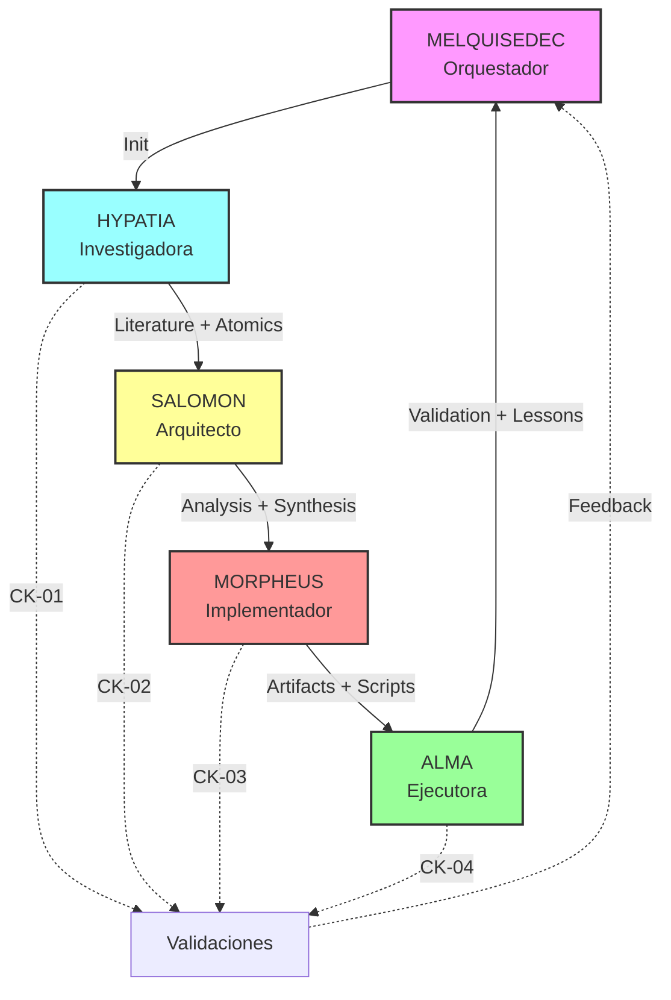

# Research Methodology: {{research.full_name}} - Design

> **Spec**: research-methodology-template
> **Version**: {{research.version}}
> **Status**: Design Phase
> **Depends on**: [requirements.md](requirements.md) (Approved)

---

## Metadata

```yaml
---
id: "design-research-{{research.name}}"
version: "{{research.version}}"
created: "{{research.created}}"
owner: "SALOMON"
status: "draft"
depends_on: ["requirements.md"]
melquisedec:
  principles: ["P1", "P6", "P7"]
  rostro: "SALOMON (Arquitecto)"
---
```

---

## 🎯 Architecture Overview

Esta sección describe la arquitectura de la investigación metodológica, sintetizando:
- **DSR (Design Science Research)**: Estructura de fases rigurosa
- **Zettelkasten**: Atomización de conocimiento
- **Triple Output**: MD + Graph + Vectors (P6: Trazabilidad)
- **DAATH-ZEN**: Cascada de rostros MELQUISEDEC

### Arquitectura Híbrida

```
┌─────────────────────────────────────────────────────────────────┐
│                    SPEC-WORKFLOW (Orchestration)                │
│  .spec-workflow/specs/research-methodology-{name}/              │
│  ├─ config.yaml        ← Configuración parametrizable          │
│  ├─ requirements.md    ← Qué investigar                         │
│  ├─ design.md          ← Cómo investigar (este doc)            │
│  ├─ tasks.md           ← Tareas por rostro                      │
│  └─ orchestrator.md    ← Automatización de workflow            │
└─────────────────────────────────────────────────────────────────┘
                               │
                               ▼
┌─────────────────────────────────────────────────────────────────┐
│                    RESEARCH INSTANCE (Execution)                │
│  apps/research-{name}/                                          │
│  ├─ ISSUE.yaml         ← Issue-Driven (P3)                      │
│  ├─ 00-problem/        ← DSR Phase 1: Problem Identification    │
│  ├─ 01-literature/     ← Gestión formal de fuentes             │
│  ├─ 02-atomics/        ← Zettelkasten (conocimiento atómico)   │
│  ├─ 03-workbook/       ← Análisis y síntesis                    │
│  ├─ 04-artifacts/      ← Artefactos ejecutables                │
│  ├─ 05-evaluate/       ← DSR Phase 4: Evaluation               │
│  ├─ 06-lessons/        ← Autopoiesis (P2)                       │
│  └─ .melquisedec/      ← Validaciones (P5)                      │
└─────────────────────────────────────────────────────────────────┘
                               │
                               ▼
┌─────────────────────────────────────────────────────────────────┐
│                    TRIPLE OUTPUT (Storage)                      │
│  1. Markdown (Filesystem) ─ HKM + Dublin Core metadata         │
│  2. Graph (Neo4j)        ─ Nodos + Relaciones semánticas       │
│  3. Vectors (Embeddings) ─ qwen3-embedding 1536-dim            │
└─────────────────────────────────────────────────────────────────┘
```

---

## 📁 Component Design

### 1. Configuration Component (`config.yaml`)

**Responsabilidad**: Parametrizar toda la investigación

**Interfaz**:
```yaml
research:
  name: string          # Nombre corto
  full_name: string     # Nombre completo
  type: enum            # formal-review | quick-scan | deep-dive

scope:
  research_questions: string[]
  domains: string[]
  hypothesis: string[]  # Opcional

outputs:
  triple_storage: boolean
  formats: string[]     # md, yaml-ld, json, cypher
  targets: object       # graph_db, embeddings, vector_index

rostros: object[]       # DAATH-ZEN roles
checkpoints: object[]   # Validation gates
required_mcps: object   # MCP tools
quality: object         # Metrics & validators
```

**Dependencias**: Ninguna (entry point)

**Validación**: JSON Schema (future)

---

### 2. Structure Component (Carpetas)

#### 2.1 `00-problem/` (DSR Phase 1)

**Propósito**: Identificar el problema de investigación

**Archivos**:
- `research-questions.md`: RQs formales
- `hypothesis.md`: Hipótesis a validar (opcional)
- `context.md`: Contexto del problema

**Responsable**: MELQUISEDEC (inicialización)

---

#### 2.2 `01-literature/` (Literature Management)

**Propósito**: Gestión formal de fuentes canónicas

**Estructura**:
```
01-literature/
├── papers/               # Papers académicos
│   ├── {paper-id}/
│   │   ├── metadata.yaml # Dublin Core
│   │   ├── content.md    # Contenido extraído
│   │   └── citations.bib # Referencias
├── books/                # Libros/capítulos
│   └── {book-id}/
├── frameworks/           # Frameworks/bibliotecas
│   └── {framework-id}/
└── sources.yaml          # Índice de todas las fuentes
```

**Metadata (Dublin Core)**:
```yaml
---
dc:
  title: "Paper Title"
  creator: ["Author 1", "Author 2"]
  date: "2024-01-01"
  source: "https://doi.org/10.1234/..."
  identifier: "DOI:10.1234/..."
  subject: ["keyword1", "keyword2"]
  description: "Abstract"
  type: "research-paper"
  format: "application/pdf"
  language: "en"
hkm:
  id: "paper-001"
  is_a: "literature/paper"
  permalink: "01-literature/papers/paper-001/"
---
```

**Responsable**: HYPATIA (Investigadora)

**Validación**: ≥{{quality.metrics.min_sources}} fuentes, ≥{{quality.metrics.min_peer_reviewed}} peer-reviewed

---

#### 2.3 `02-atomics/` (Zettelkasten)

**Propósito**: Atomización de conocimiento (un concepto = un archivo)

**Estructura**:
```
02-atomics/
├── concepts/             # Conceptos individuales
│   ├── {concept-id}.md  # Un atomic
│   └── ...
├── patterns/             # Patrones identificados
│   └── {pattern-id}.md
├── relationships.yaml    # Relaciones semánticas
└── graph-ready/          # YAML-LD para Neo4j
    ├── nodes.yaml
    └── relationships.yaml
```

**Atomic Format**:
```markdown
---
id: "concept-dsr-phase-1"
is_a: "concept/methodology"
title: "DSR Phase 1: Problem Identification"
source: "paper-001"          # Trazabilidad
tags: ["DSR", "methodology", "problem"]
related:
  - "concept-dsr-phase-2"
  - "concept-problem-statement"
---

# DSR Phase 1: Problem Identification

## Definition
[Definición del concepto]

## Context
[Contexto donde se usa]

## Examples
[Ejemplos concretos]

## Related Concepts
- [[concept-dsr-phase-2]] - Siguiente fase
- [[concept-problem-statement]] - Artefacto de esta fase
```

**Relaciones Semánticas** (`relationships.yaml`):
```yaml
relationships:
  - source: "concept-dsr-phase-1"
    target: "concept-dsr-phase-2"
    type: "PRECEDES"
    weight: 1.0

  - source: "concept-dsr-phase-1"
    target: "concept-problem-statement"
    type: "PRODUCES"
    weight: 0.8
```

**Responsable**: HYPATIA (Investigadora)

**Validación**: ≥{{quality.metrics.min_atomics}} atomics + relationships.yaml válido

---

#### 2.4 `03-workbook/` (Analysis & Synthesis)

**Propósito**: Análisis comparativo y síntesis de hallazgos

**Archivos**:
- `comparative-analysis.md`: Comparación entre enfoques
- `workflow-patterns.md`: Patrones identificados (≥{{quality.metrics.min_patterns}})
- `framework-recommendation.md`: Framework recomendado (ADR)
- `synthesis.md`: Síntesis final (≥1500 palabras)

**Responsable**: SALOMON (Arquitecto)

**Validación**: RQs respondidas + framework justificado

---

#### 2.5 `04-artifacts/` (Executable Artifacts)

**Propósito**: Generar artefactos ejecutables para adopción

**Estructura**:
```
04-artifacts/
├── solution-spec.md          # Spec formal ≥2000 líneas
├── implementation-plan.md    # Roadmap de implementación
├── testing-strategy.md       # TDD strategy
└── ingestion/                # Scripts Neo4j
    ├── cypher-queries/
    │   ├── 01-create-nodes.cypher
    │   ├── 02-create-relationships.cypher
    │   └── 03-validate-graph.cypher
    ├── embeddings/
    │   ├── generate_embeddings.py
    │   └── embeddings.json
    └── load-scripts/
        ├── load_to_neo4j.py
        └── requirements.txt
```

**Solution Spec** (Template):
```markdown
# Solution Spec: Adopción de {{research.full_name}} en MELQUISEDEC

## 1. Overview
[Descripción ejecutiva]

## 2. Architecture
[Arquitectura propuesta con diagramas]

## 3. Interfaces
[Puertos y adaptadores, protocols Python]

## 4. Workflows
[Flujos de trabajo paso a paso]

## 5. Implementation
[Pseudocódigo / código de ejemplo]

## 6. Testing
[Estrategia de testing]

## 7. Deployment
[Cómo desplegar]

## 8. Maintenance
[Cómo mantener]

## 9. References
[Referencias a atomics y literatura]
```

**Responsable**: MORPHEUS (Implementador)

**Validación**: ≥{{quality.metrics.min_solution_spec_lines}} líneas + scripts ejecutables + tests ≥{{quality.metrics.min_test_coverage}}%

---

#### 2.6 `05-evaluate/` (DSR Phase 4)

**Propósito**: Validación de artefactos e hipótesis

**Archivos**:
- `graph-validation.md`: Validación de integridad del grafo Neo4j
- `hypothesis-validation.md`: Validación de hipótesis iniciales
- `visualizations/`: Diagramas del grafo (PNG/SVG)

**Responsable**: ALMA (Ejecutora)

**Validación**: Grafo poblado + hipótesis validadas

---

#### 2.7 `06-lessons/` (P2: Autopoiesis)

**Propósito**: Lessons learned para mejorar el template

**Archivos**:
- `hypatia-lessons.md`
- `salomon-lessons.md`
- `morpheus-lessons.md`
- `alma-lessons.md`
- `summary.yaml`: Agregación de lecciones

**Responsable**: Todos los rostros

**Output**: Template v2.0.0 mejorado

---

### 3. Validation Component (`.melquisedec/`)

**Propósito**: Checkpoints de validación continua (P5)

**Archivos**:
```
.melquisedec/
├── hypatia_validation.yaml
├── salomon_validation.yaml
├── morpheus_validation.yaml
└── alma_validation.yaml
```

**Validation Format**:
```yaml
---
checkpoint: "ck-01-literature"
rostro: "HYPATIA"
phase: "01-literature"
date: "2026-01-09"
status: "pass"  # pass | fail | pending
criteria:
  min_sources: 5
  actual_sources: 7
  min_peer_reviewed: 3
  actual_peer_reviewed: 5
  min_atomics: 20
  actual_atomics: 25
  relationships_documented: true
approval:
  required: true
  approved_by: null  # Usuario que aprueba
  approved_at: null
notes: "Todas las fuentes verificadas. Atomización completa."
---
```

---

## 🔄 Workflow Design (DAATH-ZEN)

### Cascada de Rostros



### Rostros Responsibilities Matrix

| Fase | Rostro | Input | Actions | Output | Checkpoint |
|------|--------|-------|---------|--------|------------|
| **Init** | MELQUISEDEC | config.yaml | Crear estructura + ISSUE.yaml | Carpetas inicializadas | N/A |
| **Lit Review** | HYPATIA | RQs | Buscar fuentes, documentar, atomizar | 01-literature/ + 02-atomics/ | ck-01 |
| **Analysis** | SALOMON | Atomics | Analizar, comparar, sintetizar | 03-workbook/ | ck-02 |
| **Artifacts** | MORPHEUS | Workbook | Crear specs, scripts, tests | 04-artifacts/ | ck-03 |
| **Execution** | ALMA | Artifacts | Cargar Neo4j, validar, visualizar | 05-evaluate/ | ck-04 |
| **Lessons** | ALL | Experiencia | Documentar lecciones | 06-lessons/ | N/A |

---

## 🗄️ Data Models

### Triple Output Schema

#### 1. Markdown (Filesystem)

**Entity**: Atomic Concept
```yaml
---
id: "concept-{slug}"
is_a: "concept/{category}"
title: "Concept Title"
source: "paper-{id}"
tags: ["tag1", "tag2"]
related: ["concept-{id}"]
dc:
  creator: ["Author"]
  date: "YYYY-MM-DD"
---

# Content in Markdown
```

#### 2. Graph (Neo4j)

**Node Labels**:
- `(:Concept {id, title, category, source})`
- `(:Paper {id, title, authors, year, doi})`
- `(:Framework {id, name, url, stars})`
- `(:Pattern {id, title, description})`

**Relationships**:
- `(:Concept)-[:RELATED_TO]->(:Concept)`
- `(:Concept)-[:DERIVED_FROM]->(:Paper)`
- `(:Concept)-[:PART_OF]->(:Framework)`
- `(:Pattern)-[:IMPLEMENTS]->(:Concept)`

**Cypher Example**:
```cypher
// Create concept node
CREATE (c:Concept {
  id: 'concept-dsr-phase-1',
  title: 'DSR Phase 1: Problem Identification',
  category: 'methodology',
  source: 'paper-001',
  tags: ['DSR', 'methodology']
})

// Create relationship
MATCH (c1:Concept {id: 'concept-dsr-phase-1'})
MATCH (c2:Concept {id: 'concept-dsr-phase-2'})
CREATE (c1)-[:PRECEDES {weight: 1.0}]->(c2)
```

#### 3. Vectors (Embeddings)

**Format**: JSON
```json
{
  "id": "concept-dsr-phase-1",
  "text": "DSR Phase 1: Problem Identification. [full content]",
  "embedding": [0.123, -0.456, ...],  // 1536-dim
  "model": "qwen3-embedding",
  "created_at": "2026-01-09T10:00:00Z"
}
```

**Storage**: Neo4j Vector Index (HNSW)

---

## 🔌 Integration Points

### 1. MCP Tools Integration

**Base Tools**:
- `neo4j`: Graph database operations (create, query, validate)
- `memory`: Context management entre tasks
- `filesystem`: Leer/escribir archivos

**Specialized Tools** (según investigación):
- `brave-search`: Buscar papers y recursos web
- `arxiv`: Descargar papers académicos
- `context7`: Documentación técnica de frameworks
- `perplexity`: Research profundo con razonamiento

### 2. Neo4j Integration

**Connection**:
```python
from neo4j import GraphDatabase

driver = GraphDatabase.driver(
    "bolt://localhost:7687",
    auth=("neo4j", "password")
)
```

**Ingestion Pipeline**:
1. Load `02-atomics/graph-ready/nodes.yaml`
2. Execute `04-artifacts/ingestion/cypher-queries/01-create-nodes.cypher`
3. Load `02-atomics/graph-ready/relationships.yaml`
4. Execute `02-create-relationships.cypher`
5. Validate with `03-validate-graph.cypher`

### 3. Embeddings Integration

**Generation**:
```python
import ollama

def generate_embedding(text: str) -> list[float]:
    response = ollama.embeddings(
        model='qwen3-embedding',
        prompt=text
    )
    return response['embedding']  # 1536-dim
```

**Storage in Neo4j**:
```cypher
MATCH (c:Concept {id: $concept_id})
CALL db.create.setNodeVectorProperty(c, 'embedding', $embedding)
```

---

## 🧪 Testing Strategy

### Unit Tests
- Validadores de YAML/Markdown
- Parsers de metadata
- Generators de embeddings

### Integration Tests
- Neo4j connectivity
- Cypher queries execution
- End-to-end pipeline

### Validation Tests
- Checkpoint validators
- Graph integrity checks
- Trazabilidad verificación

**Coverage Target**: ≥{{quality.metrics.min_test_coverage}}%

---

## 📦 Technology Stack

### Core
- **Language**: Python 3.11+ (scripts), Markdown (docs)
- **Graph DB**: {{outputs.targets.graph_db}}
- **Embeddings**: {{outputs.targets.embeddings}}
- **Vector Index**: {{outputs.targets.vector_index}}

### Libraries
- `neo4j-driver`: Python driver para Neo4j
- `pydantic`: Validación de schemas
- `pyyaml`: Parsing YAML
- `ollama`: Embeddings locales
- `pytest`: Testing framework
- `ruff`: Linter Python

### Tools
- `VS Code`: Editor principal
- `Copilot`: Asistente IA
- `Neo4j Browser`: Visualización de grafos

---

## 🚀 Migration Strategy

**N/A** - Este es un template nuevo, no requiere migración.

**Future**: Si se mejora a v2.0.0 (P2: Autopoiesis):
1. Analizar lessons learned
2. Identificar mejoras en config.yaml
3. Actualizar tasks.md con nuevas tareas
4. Documentar cambios en CHANGELOG.md
5. Migrar investigaciones existentes (opcional)

---

## 🎯 Success Metrics

| Metric | Target | Measurement |
|--------|--------|-------------|
| Sources documented | ≥{{quality.metrics.min_sources}} | Count files in `01-literature/` |
| Peer-reviewed sources | ≥{{quality.metrics.min_peer_reviewed}} | Filter by `dc.type: research-paper` |
| Atomic concepts | ≥{{quality.metrics.min_atomics}} | Count files in `02-atomics/concepts/` |
| Patterns identified | ≥{{quality.metrics.min_patterns}} | Count files in `02-atomics/patterns/` |
| Solution spec lines | ≥{{quality.metrics.min_solution_spec_lines}} | `wc -l 04-artifacts/solution-spec.md` |
| Test coverage | ≥{{quality.metrics.min_test_coverage}}% | `pytest --cov` |
| Graph nodes | >0 | `MATCH (n) RETURN count(n)` |
| Graph relationships | >0 | `MATCH ()-[r]->() RETURN count(r)` |

---

## 📚 References

- **DSR Methodology**: Hevner et al. (2004) - Design Science in Information Systems Research
- **Zettelkasten**: Ahrens (2017) - How to Take Smart Notes
- **Neo4j Knowledge Graphs**: [Neo4j Graph Academy](https://neo4j.com/graphacademy/)
- **MELQUISEDEC Principles**: `docs/manifiesto/01-fundamentos/04-principios-fundacionales.md`

---

**Document Status**: Draft → Review → Approved
**Next Step**: Create `tasks.md` after design approval
**Approved by**: _Pending approval_
