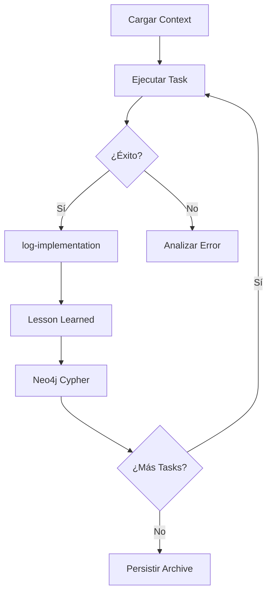

# Monorepo Improvements v1.1.0

## 🎯 Objetivo de este Spec

Consolidar monorepo DAATH-ZEN con autopoiesis completa post-reorganización:
- ✅ Eliminar referencias obsoletas a `nucleo-investigacion/`
- ✅ Reorganizar documentos raíz siguiendo convenciones
- ✅ Implementar validación automática (pre-commit, tests, cleanup)
- ✅ Preparar packaging formal de `daath-toolkit`

**Estado**: 🚧 En implementación
**Spec Path**: `C:\proyectos\aleia-melquisedec\.spec-workflow\specs\monorepo-improvements-v1.1.0`

---

## 📋 Artefactos del Spec

### Core Documents
- [[requirements]] - 6 User Stories, 6 REQs, NFRs, prioridades
- [[design]] - Arquitectura ANTES/DESPUÉS, component design
- [[tasks]] - 7 tasks con rostros DAATH-ZEN + MCPs + prompts

### Implementation
- `Implementation Logs/` - Logs por task (generados vía `log-implementation`)
- `_meta/lessons-learned/` - 6 lessons + `summary.yaml` (Output Triple)

---

## 🔑 Coherencias Críticas (NO ROMPER)

### 1. **Paths de imports Python**
```python
# ✅ CORRECTO (post-spec)
from packages.daath_toolkit.capture import chatlog_capture
from packages.daath_toolkit.storage import vector_store

# ❌ INCORRECTO (pre-spec, a eliminar)
from nucleo_investigacion.scripts import chatlog_capture
```

### 2. **Referencias a documentación**
```markdown
# ✅ CORRECTO (post-spec)
[[04-mcps-recomendados]]  # Obsidian wikilink
[[CONFIGURACION_COMPLETA]] # Raíz del vault

# ❌ INCORRECTO (links rotos)
[MCPs](../../nucleo-investigacion/docs/mcps.md)
```

### 3. **READMEs del Monorepo** (actualizar tras cambios)
- `docs/README.md` - Agregar enlaces a archivos movidos desde raíz
- `docs/architecture/README.md` - Listar ARQUITECTURA_MONOREPO.md, ESTRUCTURA_VISUAL.md
- `docs/guides/README.md` - Listar QUICK_REFERENCE.md, REORGANIZACION_COMPLETA.md, 01-kanban-estados.md
- `packages/daath-toolkit/README.md` - Documentar nuevo packaging con pyproject.toml
- `tools/maintenance/README.md` - Explicar cleanup_post_reorganization.py

### 4. **Git History Preservation**
```powershell
# ✅ CORRECTO (preserva historial)
git mv QUICK_REFERENCE.md docs/guides/quick-reference.md

# ❌ INCORRECTO (pierde historial)
Remove-Item QUICK_REFERENCE.md
New-Item docs/guides/quick-reference.md
```

### 5. **Pre-commit Hook Idempotencia**
- Ejecutar múltiples veces debe producir mismo resultado
- No debe fallar en archivos ya formateados
- Debe skipear archivos en `.gitignore`

---

## 🔄 Workflow de Ejecución



**Orchestrator**: Ver `_meta/orchestrator.md` para patrón DAATH-ZEN completo

---

## 📊 Métricas de Éxito

| Métrica | Target | Validación |
|---------|--------|------------|
| Referencias `nucleo-investigacion` | 0 | `grep -r "nucleo-investigacion" .` |
| Archivos en raíz | ≤10 | `ls -1 \| wc -l` (sin dirs) |
| Pre-commit hooks | Pass | `pre-commit run --all-files` |
| Test coverage daath-toolkit | ≥80% | `pytest --cov` |
| Broken links | 0 | `validate_doc_links.py` |

---

## 🧩 Rostros DAATH-ZEN Involucrados

- **MELQUISEDEC** (classifier) - Tasks 1.1, 1.6 - Detectar refs obsoletas, clasificar cleanup
- **MORPHEUS** (implementer) - Tasks 1.2, 1.3, 1.5 - Mover docs, hooks, tests
- **SALOMON** (architect) - Task 1.4 - Package discovery mechanism
- **ALMA** (publisher) - Task 1.7 - Commit + Neo4j update

---

## 🛠️ MCPs Recomendados

**Base** (todas las tasks): `neo4j`, `memory`
**Specialized**:
- `filesystem` - Task 1.1, 1.2, 1.3, 1.4, 1.5, 1.6
- `grep-search` - Task 1.1, 1.2, 1.6
- `sequential-thinking` - Task 1.1, 1.4, 1.6
- `python-refactoring` - Task 1.4, 1.5
- `python-env` - Task 1.3, 1.5

Ver [[04-mcps-recomendados]] para descripciones completas.

---

## 📂 Estructura Post-Implementación

```
aleia-melquisedec/
├── docs/
│   ├── architecture/
│   │   ├── ARQUITECTURA_MONOREPO.md  ← movido desde raíz
│   │   └── ESTRUCTURA_VISUAL.md      ← movido desde raíz
│   └── guides/
│       ├── QUICK_REFERENCE.md        ← movido desde raíz
│       ├── REORGANIZACION_COMPLETA.md ← movido desde raíz
│       └── 01-kanban-estados.md      ← movido desde raíz
├── packages/
│   └── daath-toolkit/
│       ├── pyproject.toml            ← nuevo
│       ├── src/daath_toolkit/        ← nuevo layout
│       └── tests/                    ← nuevo
├── tools/
│   └── maintenance/
│       └── cleanup_post_reorganization.py ← expandido
├── .pre-commit-config.yaml           ← nuevo
└── [≤10 archivos en raíz]            ← objetivo
```

---

## 🔗 Referencias Externas

- **Spec-Workflow-MCP**: [[best-practices]] (`.spec-workflow/_meta/`)
- **DAATH-ZEN Manifiesto**: [[01-fundamentos]], [[02-arquitectura]], [[03-workflow]]
- **Steering**: [[product]], [[tech]] (`.spec-workflow/steering/`)

---

**Versión**: 1.1.0
**Última actualización**: 2026-01-08
**Rostro autor**: MORPHEUS
