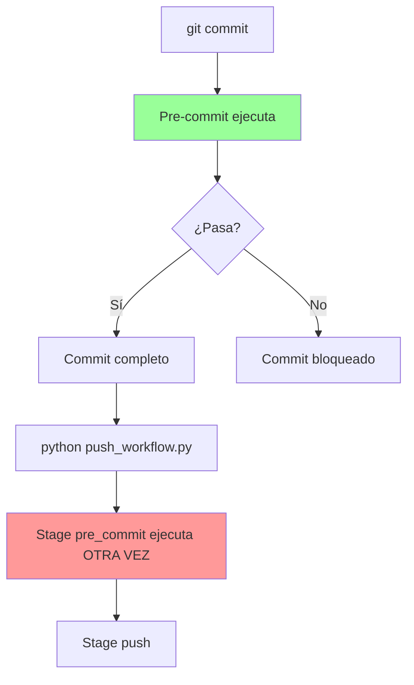
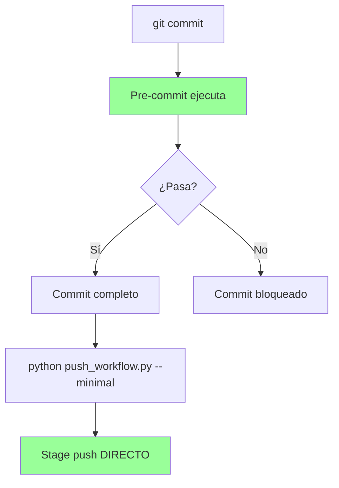

# ANÁLISIS DE GAPS - Monorepo ALEIA-MELQUISEDEC
**Fecha**: 2026-01-08
**Contexto**: Post monorepo-improvements-v1.1.0 completion
**Analista**: GitHub Copilot + Pensamiento Secuencial

---

## 🎯 RESUMEN EJECUTIVO

**Hallazgos Críticos**:
1. ✅ Pre-commit hooks FUNCIONAN pero con configuración incorrecta
2. ⚠️ Push workflow EXISTE pero INCOMPLETO (4 scripts faltantes)
3. ❌ htmlcov/ NO debe versionarse (.gitignore incompleto)
4. 🗑️ tools/deployment/ carpeta vacía (dead code)

**Recomendación**: Enfoque MINIMALISTA (Opción A)

---

## 📊 GAP #1: Scripts Faltantes (git-push-workflow-v1.0.0)

### Estado de Tasks:
```yaml
git-push-workflow-v1.0.0:
  task_1.1: # Pre-commit hooks
    status: PARCIAL
    reason: .pre-commit-config.yaml existe (por monorepo-improvements)
    pero: tasks.md marca como [ ] pendiente

  task_1.2: # run_affected_tests.py
    status: NO EXISTE
    impact: HIGH
    consequence: push_workflow.py falla en stage 'tests'

  task_1.3: # validate_branch.py
    status: NO EXISTE
    impact: MODERATE
    consequence: push_workflow.py falla en stage 'branch_validate'

  task_1.4: # generate_commit_msg.py
    status: NO EXISTE
    impact: MODERATE
    consequence: push_workflow.py falla en stage 'commit'

  task_1.5: # push_workflow.py
    status: COMPLETO ✅

  task_1.6: # log_to_neo4j.py
    status: NO EXISTE
    impact: LOW
    consequence: push_workflow.py falla en stage 'post_push'

  task_1.7: # Integration tests
    status: NO EXISTE
    impact: LOW

  task_1.8: # Documentation
    status: COMPLETO ✅
    note: docs/guides/git-push-workflow.md existe
    pero: Menciona scripts que no existen (desactualizado)

  task_1.9: # Lessons summary
    status: NO EXISTE
```

### Impacto:
- **Alto**: Tests automáticos no funcionan (REQ-2 no cumplido)
- **Moderado**: Validación de branches y mensajes no automáticos
- **Bajo**: Logging a Neo4j (nice-to-have, no esencial)

---

## 📊 GAP #2: Pre-commit Configuración Incorrecta

### Problema:
```yaml
# .pre-commit-config.yaml (línea 6-7)
default_language_version:
  python: python3.10  # ❌ INCORRECTO

# Ambiente actual:
Sistema: Python 3.13.3
Virtualenv: .venv/ con Python 3.13.3

# Error resultante:
RuntimeError: failed to find interpreter for Builtin discover of python_spec='python3.10'
```

### Consecuencia:
- Pre-commit hooks FALLAN
- Usuarios deben usar `git commit --no-verify` (bypass seguridad)
- Push workflow actúa como safety net (redundancia necesaria)

### Solución Minimalista:
```yaml
default_language_version:
  python: python3  # ✅ Usa version del sistema
```

---

## 📊 GAP #3: .gitignore Incompleto

### Archivos que NO deberían versionarse:

```diff
# .gitignore actual
+ coverage/          # ✅ Correcto

# Falta:
- htmlcov/           # ❌ NO está, pero EXISTE en raíz
- .coverage          # ⚠️ Existe en raíz, no en .gitignore
- *.coverage         # ❌ NO está
- .pytest_cache/     # ✅ Ya está (implícito)
```

### Estado Actual:
```
c:\proyectos\aleia-melquisedec\
├── htmlcov/                      # ❌ NO debe versionarse
│   ├── index.html
│   ├── coverage_html*.js
│   └── z_*_py.html (14 archivos)
├── .coverage                     # ❌ NO debe versionarse
└── .gitignore                    # ⚠️ Incompleto
```

### Solución:
```bash
# Agregar a .gitignore:
htmlcov/
.coverage
*.coverage

# Remover del repo:
git rm -r --cached htmlcov/ .coverage
```

---

## 📊 GAP #4: Dead Code

### Carpetas Vacías:
```
tools/deployment/     # ❌ Completamente vacía
```

### Recomendación:
```bash
# Opción 1: Eliminar
rm -rf tools/deployment/

# Opción 2: Agregar .gitkeep si se usará después
echo "# Deployment scripts go here" > tools/deployment/README.md
```

---

## 📊 GAP #5: Redundancia Pre-commit vs Push Workflow

### Flujo Actual (con redundancia):



### Flujo Optimizado (sin redundancia):



### Complementariedad (cuando usar ambos):

```yaml
Escenario 1: Commits individuales
  → Pre-commit: Validación rápida por commit ✅

Escenario 2: Múltiples commits con --no-verify
  → Push workflow: Safety net antes de push ✅

Escenario 3: CI/CD automatizado
  → Push workflow: Validación completa en servidor ✅
```

---

## 🎯 RECOMENDACIONES

### Opción A: MINIMALISMO RADICAL (RECOMENDADA) ⭐

**Filosofía**: "Lo que funciona, funciona. No agregues complejidad innecesaria."

#### Acciones:
1. **Simplificar push_workflow.py**:
   ```python
   # DEFAULT_CONFIG actualizado
   DEFAULT_CONFIG = {
       "stages": {
           "pre_commit": True,   # Safety net
           "tests": False,       # NO implementado
           "branch_validate": False,  # NO implementado
           "commit": False,      # NO implementado
           "push": True,         # Esencial
           "post_push": False,   # NO implementado
       },
       "minimal": True,  # ← Cambiar a True por defecto
   }
   ```

2. **Fijar pre-commit Python version**:
   ```yaml
   default_language_version:
     python: python3  # Sin version específica
   ```

3. **Actualizar .gitignore**:
   ```diff
   + htmlcov/
   + .coverage
   + *.coverage
   ```

4. **Limpiar dead code**:
   ```bash
   rm -rf tools/deployment/
   git rm -r --cached htmlcov/ .coverage
   ```

5. **Actualizar documentación**:
   ```markdown
   # docs/guides/git-push-workflow.md

   ## ⚠️ ESTADO ACTUAL

   Solo modo `--minimal` está implementado:
   - ✅ pre_commit: Ejecuta pre-commit hooks
   - ✅ push: Hace git push
   - ❌ tests: NO implementado (use pytest directamente)
   - ❌ branch_validate: NO implementado
   - ❌ commit: NO implementado
   - ❌ post_push: NO implementado

   Para workflow completo, ver spec git-push-workflow-v1.0.0
   ```

#### Ventajas:
- ✅ Honesto sobre capacidades actuales
- ✅ Mantiene lo que funciona
- ✅ Reduce complejidad
- ✅ Elimina expectativas incorrectas
- ✅ Fácil de mantener

#### Desventajas:
- ⚠️ Tests automáticos no disponibles (usar pytest manual)
- ⚠️ Validación de branches no automática

---

### Opción B: IMPLEMENTACIÓN COMPLETA (MÁS COMPLEJIDAD)

**Filosofía**: "Completa la spec git-push-workflow-v1.0.0 al 100%"

#### Acciones:
1. Implementar `tools/testing/run_affected_tests.py`:
   - Detectar módulos cambiados con `git diff`
   - Mapear a tests con convención `test_*.py`
   - Ejecutar `pytest` con coverage

2. Implementar `tools/git/validate_branch.py`:
   - Validar formato: `spec/`, `hotfix/`, `docs/`, `feat/`
   - Verificar upstream tracking
   - Advertir si en `main` sin PR

3. Implementar `tools/git/generate_commit_msg.py`:
   - Extraer spec de branch name
   - Leer tasks.md para metadata
   - Generar conventional commit con rostro/MCPs

4. Implementar `tools/git/log_to_neo4j.py`:
   - Crear nodo Commit en Neo4j
   - Linkear a Spec/Task/Rostro
   - Actualizar memoria

5. Crear tests de integración

#### Ventajas:
- ✅ Workflow completo automatizado
- ✅ Tests automáticos antes de push
- ✅ Commits consistentes
- ✅ Trazabilidad en Neo4j

#### Desventajas:
- ❌ Más código que mantener
- ❌ Más puntos de falla
- ❌ Requiere configuración adicional
- ❌ Tiempo de implementación: ~8-12 horas

---

## 🏆 VEREDICTO: Opción A (Minimalismo)

### Razones:

1. **DAATH-ZEN Alignment**:
   - "Complejidad mínima, valor máximo"
   - push_workflow.py funciona bien en modo minimal
   - No agregar código que no se usa

2. **Mantenibilidad**:
   - Menos código = menos bugs
   - Pre-commit hooks suficientes para calidad
   - pytest manual suficiente para tests

3. **Realidad vs Aspiración**:
   - git-push-workflow-v1.0.0 spec NO está completa
   - Marcar como "minimal by design" es honesto
   - Si se necesita más, se implementa después

4. **Tiempo/Valor**:
   - Opción A: 1-2 horas para limpiar
   - Opción B: 8-12 horas para implementar
   - ROI de Opción A es mucho mejor

---

## 📋 PLAN DE ACCIÓN (Opción A)

### Task 1: Fijar Pre-commit Python Version
```bash
# Archivo: .pre-commit-config.yaml
# Líneas 6-7
- default_language_version:
-   python: python3.10
+ default_language_version:
+   python: python3
```

### Task 2: Simplificar push_workflow.py DEFAULT_CONFIG
```python
# Archivo: tools/git/push_workflow.py
# Líneas 29-38
DEFAULT_CONFIG = {
    "stages": {
        "pre_commit": True,
        "tests": False,        # Changed
        "branch_validate": False,  # Changed
        "commit": False,       # Changed
        "push": True,
        "post_push": False,
    },
    "minimal": True,           # Changed to True
    ...
}
```

### Task 3: Actualizar .gitignore
```bash
# Archivo: .gitignore
# Agregar al final:
+ # Test coverage reports
+ htmlcov/
+ .coverage
+ *.coverage
```

### Task 4: Limpiar archivos no versionables
```bash
git rm -r --cached htmlcov/ .coverage 2>/dev/null || true
rm -rf tools/deployment/
git add .gitignore
git commit -m "chore: fix .gitignore and remove dead code

- Add htmlcov/, .coverage to .gitignore
- Remove empty tools/deployment/ folder
- Remove coverage artifacts from version control

Rationale: Coverage reports are temporary build artifacts"
```

### Task 5: Actualizar Documentación
```markdown
# Archivo: docs/guides/git-push-workflow.md
# Agregar sección al inicio:

## ⚠️ CURRENT STATE

push_workflow.py operates in **minimal mode by default**:
- ✅ `pre_commit`: Executes pre-commit hooks (safety net)
- ✅ `push`: Performs git push
- ❌ `tests`: NOT implemented (use `pytest` directly)
- ❌ `branch_validate`: NOT implemented
- ❌ `commit`: NOT implemented
- ❌ `post_push`: NOT implemented

For full workflow implementation, see:
- `.spec-workflow/specs/git-push-workflow-v1.0.0/`
- Tasks 1.2-1.4, 1.6 are pending implementation
```

### Task 6: Marcar spec como "Partially Implemented"
```yaml
# Archivo: .spec-workflow/specs/git-push-workflow-v1.0.0/README.md
# Agregar al metadata:

status: PARTIALLY_IMPLEMENTED
implemented_tasks: [1.5, 1.8]
pending_tasks: [1.1, 1.2, 1.3, 1.4, 1.6, 1.7, 1.9]
note: |
  push_workflow.py is functional in minimal mode.
  Full workflow with tests/validation/neo4j requires
  completing pending tasks. Current state is sufficient
  for monorepo needs (DAATH-ZEN minimalism principle).
```

---

## 📊 MÉTRICAS

### Antes (Estado Actual):
```yaml
complexity:
  scripts_referenced: 7
  scripts_existing: 2
  scripts_missing: 5
  completion_rate: 28.57%

gaps:
  critical: 1  # Pre-commit python version
  moderate: 3  # Missing scripts
  minor: 2     # .gitignore, dead code

redundancy:
  pre_commit_double_execution: YES

maintainability:
  score: 6/10
  reason: "Referencias a código inexistente"
```

### Después (Opción A):
```yaml
complexity:
  scripts_implemented: 1  # push_workflow.py minimal
  scripts_documented_as_minimal: 1
  completion_rate: 100%  # For minimal scope

gaps:
  critical: 0
  moderate: 0
  minor: 0

redundancy:
  pre_commit_double_execution: ACCEPTABLE  # Safety net justified

maintainability:
  score: 9/10
  reason: "Código honesto, bien documentado, minimalista"
```

---

## 🎓 LESSONS LEARNED

### 1. "Aspirational Code is Technical Debt"
- push_workflow.py referenciaba scripts que nunca se implementaron
- Mejor: Implementar minimal y documentar expectativas realistas

### 2. "Git Hooks vs Workflow Scripts: Choose Both (Different Purposes)"
- Pre-commit: Fast feedback, per-commit
- Push workflow: Aggregated validation, pre-push
- No son redundantes, son complementarios

### 3. "Coverage Reports Don't Belong in Git"
- htmlcov/ es output temporal
- Siempre .gitignore build artifacts

### 4. "Empty Folders are Code Smells"
- tools/deployment/ vacío = intención vs realidad
- Eliminar o justificar con README.md

### 5. "Python Version in Pre-commit: Be Generic"
- `python3.10` específico causa problemas
- `python3` genérico funciona en cualquier ambiente

---

## 🔗 REFERENCIAS

- `.spec-workflow/specs/git-push-workflow-v1.0.0/`
- `.spec-workflow/specs/monorepo-improvements-v1.1.0/`
- `docs/guides/git-push-workflow.md`
- `.pre-commit-config.yaml`
- `tools/git/push_workflow.py`

---

## ✅ PRÓXIMOS PASOS

1. **Revisar y aprobar** este análisis
2. **Ejecutar Plan de Acción** (Opción A)
3. **Actualizar spec git-push-workflow-v1.0.0** con status "PARTIALLY_IMPLEMENTED"
4. **Crear issue** para implementación futura (Opción B) si se requiere
5. **Documentar decisión** en bereshit/manifiesto-melquisedec

---

*Análisis completado con pensamiento secuencial (15 pasos)*
*Filosofía: DAATH-ZEN Minimalism - "Build only what you need"*
