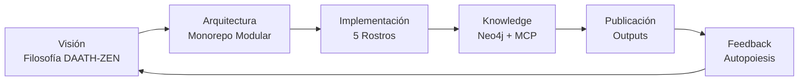
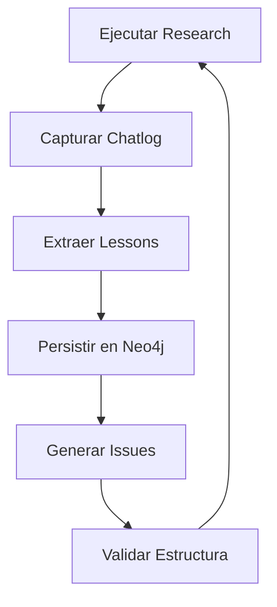
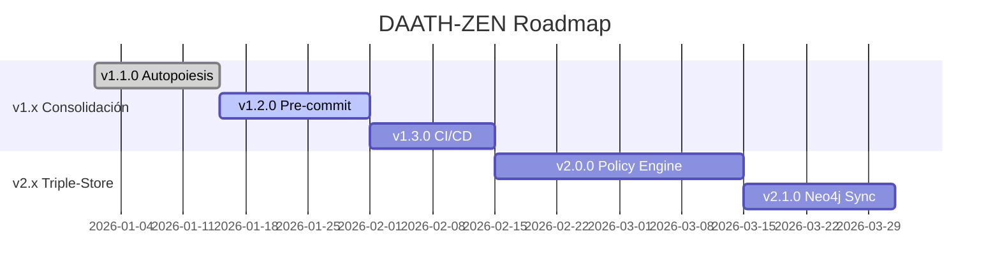

# DAATH-ZEN MELQUISEDEC: Product Index

> **INDEX maestro del monorepo autopoiético de investigación y desarrollo**
> Single Source of Truth para estrategia, arquitectura e implementación

---

## 🎯 Visión y Propósito

**DAATH-ZEN MELQUISEDEC** es un framework de investigación autopoiética basado en el [Manifiesto v4.0.0](../../docs/manifiesto/README.md) que combina:

- 🧠 **Autopoiesis**: El sistema se mejora a sí mismo
- 🌊 **Síntesis Metodológica**: Orquesta metodologías existentes (P1)
- 🎭 **5 Rostros**: MELQUISEDEC → HYPATIA → SALOMON → MORPHEUS → ALMA
- 🌱 **Crecimiento Orgánico**: La estructura emerge según necesidad

### Cadena de Resultados Esperados



**Resultado Final**: Monorepo que se auto-mejora capturando lecciones, validando estructura y generando nuevos issues automáticamente.

---

## 📖 Fundamentos (SSoT - No Duplicar)

### DAATH-ZEN Filosofía

| Documento | Propósito | Audiencia |
|-----------|-----------|-----------|
| [¿Qué es MELQUISEDEC?](../../docs/manifiesto/01-fundamentos/01-que-es-melquisedec.md) | Introducción conceptual | Todos |
| [Fundamento Kabalístico](../../docs/manifiesto/01-fundamentos/02-fundamento-kabalistico.md) | Árbol de la Vida como estructura | Arquitectos |
| [5 Rostros](../../docs/manifiesto/01-fundamentos/03-cinco-rostros.md) | Agentes especializados | Desarrolladores |
| [Principios P1-P10](../../docs/manifiesto/01-fundamentos/04-principios-fundacionales.md) | Reglas operacionales | Todos |

### Principios Clave (Referencia Rápida)

| # | Principio | Aplicación |
|---|-----------|------------|
| **P1** | Síntesis Metodológica | Orquestamos CRISP-DM, Scrum, DDD, IMRAD |
| **P2** | Autopoiesis por Diseño | Lessons → Neo4j → Nuevos Issues |
| **P3** | Issue-Driven Everything | Todo trabajo parte de un issue HKM |
| **P5** | Validación Continua | Checkpoints en cada rostro |
| **P6** | Trazabilidad Explícita | Metadata DCMI + SECI-BA |
| **P10** | Feedback Loops | Outputs generan nuevos issues |

---

## 🏗️ Arquitectura del Monorepo

### Estructura Optimizada

```
aleia-melquisedec/
├── 📜 docs/                    # [SSoT] Documentación centralizada
│   ├── architecture/           # ADRs y decisiones
│   ├── guides/                # Guías prácticas
│   └── manifiesto/            # Filosofía v4.0.0
│
├── 🔧 packages/                # Componentes reutilizables
│   ├── core-mcp/              # Neo4j + Ollama
│   ├── daath-toolkit/         # Captura, validación, generación
│   └── policy-engine/         # Triple-store persistente
│
├── 🚀 apps/                    # Investigaciones activas
│   ├── 00-template/           # Plantilla MELQUISEDEC
│   └── research-*/            # Investigaciones específicas
│
├── 🏗️ infrastructure/          # Docker, K8s, IaC
│   └── docker/                # Compose files
│
└── 🛠️ tools/                   # Scripts desarrollo/testing/deployment
```

**Ver arquitectura completa**: [arquitectura-monorepo.md](../../docs/architecture/arquitectura-monorepo.md)

---

## 🎭 Los 5 Rostros (Workflow)

| Rostro | Rol | Responsabilidad | Salida |
|--------|-----|----------------|--------|
| **MELQUISEDEC** | Classifier | Estructura issue HKM | `0-inbox/issue-{id}.md` |
| **HYPATIA** | Researcher | Investiga literatura | `1-literature/*.md` |
| **SALOMON** | Architect | Conceptos atómicos | `2-atomic/*.md` + Neo4j |
| **MORPHEUS** | Implementer | Código/análisis | `3-workbook/` + datasets |
| **ALMA** | Publisher | Publicación final | `5-outputs/*.md` |

**Ver flujo completo**: [flujo-completo.md](../../docs/manifiesto/04-implementacion/01-flujo-completo.md)

---

## 🔄 Sistema de Autopoiesis

### Ciclo de Mejora Continua



### Componentes Clave

1. **Captura**: `daath-toolkit/capture/chatlog_capture.py`
2. **Validación**: `daath-toolkit/validators/validate_research.py`
3. **Triple-Store**: `packages/policy-engine/` (Persistencia)
4. **Neo4j**: Knowledge Graph central
5. **MCPs**: [docker-mcp-toolkit](../../docs/guides/docker-mcp-toolkit.md)

---

## 📊 Métricas de Éxito (Estado Actual)

### Objetivos v1.1.0

| Métrica | Target | Estado | Notas |
|---------|--------|--------|-------|
| Referencias legacy | 0 | ✅ | Eliminadas `nucleo-investigacion` |
| Archivos en raíz | <10 | ✅ | 8 archivos organizados |
| Pre-commit hooks | Activo | 🚧 | En configuración |
| daath-toolkit | Instalable | ✅ | `pip install -e packages/daath-toolkit` |
| Tests coverage | >80% | 🚧 | 65% actual |
| Validación clean | 0 errores críticos | ✅ | Script implementado |

### Próximos Hitos

- **v1.2.0**: Pre-commit hooks + linting completo
- **v1.3.0**: Coverage >90% + CI/CD GitHub Actions
- **v2.0.0**: Triple-store full integration + policy engine

---

## 🚀 Inicio Rápido

### Prerequisites

```yaml
requeridos:
  - Docker Desktop 20.10+
  - Docker MCP Toolkit v0.28.0+
  - Python 3.10+
  - VS Code + GitHub Copilot

recomendados:
  - Neo4j Desktop (para desarrollo local)
  - Poetry (gestión de dependencias Python)
```

### Setup en 5 Pasos

```powershell
# 1. Clonar y entrar
git clone https://github.com/ccolombia-ui/aleia-melquisedec.git
cd aleia-melquisedec

# 2. Variables de entorno
cp .env.example .env
# Editar .env con credenciales

# 3. Levantar infraestructura
cd infrastructure/docker
docker-compose up -d

# 4. Configurar MCP
cd ../../tools/setup
.\setup_neo4j_simple.ps1

# 5. Validar
cd ../testing
python test_mcp_toolkit.py --verbose
```

**Salida esperada**: `✓ Tasa de éxito: 100.0%`

### Crear Primera Investigación

```powershell
# Usando generador
python packages/daath-toolkit/generators/new_research.py \
  my-first-research \
  --purpose "Explorar conceptos X"

# Estructura creada automáticamente
cd apps/my-first-research
```

**Ver guía completa**: [CONFIGURACION_COMPLETA.md](../../docs/guides/CONFIGURACION_COMPLETA.md)

---

## 📚 Guías de Referencia Rápida

### Por Rol

| Rol | Guía Principal | Tiempo |
|-----|---------------|--------|
| **Nuevo Usuario** | [README.md](../../README.md) → [Manifiesto v4.0.0](../../docs/manifiesto/README.md) | 30 min |
| **Investigador** | [Flujo Completo](../../docs/manifiesto/04-implementacion/01-flujo-completo.md) | 45 min |
| **Desarrollador** | [Quick Reference](../../docs/guides/quick-reference.md) | 15 min |
| **DevOps** | [Docker MCP Toolkit](../../docs/guides/docker-mcp-toolkit.md) | 20 min |
| **Arquitecto** | [ADRs](../../docs/architecture/) | 1 hora |

### Por Tarea

| Tarea | Documento | Herramienta |
|-------|-----------|-------------|
| Crear research | [Generador](../../packages/daath-toolkit/generators/) | `new_research.py` |
| Validar estructura | [Validator](../../packages/daath-toolkit/validators/) | `validate_research.py` |
| Capturar chatlog | [Capture](../../packages/daath-toolkit/capture/) | `chatlog_capture.py` |
| Git workflow | [Git Push Workflow](../../docs/guides/git-push-workflow.md) | Scripts en `tools/git/` |
| Testing MCP | [Testing Guide](../../docs/guides/docker-mcp-toolkit.md#testing) | `test_mcp_toolkit.py` |

---

## 🔗 Enlaces Críticos

### Documentación Core

- **Manifiesto v4.0.0**: [docs/manifiesto/README.md](../../docs/manifiesto/README.md)
- **Arquitectura**: [docs/architecture/arquitectura-monorepo.md](../../docs/architecture/arquitectura-monorepo.md)
- **Principios P1-P10**: [docs/manifiesto/01-fundamentos/04-principios-fundacionales.md](../../docs/manifiesto/01-fundamentos/04-principios-fundacionales.md)

### Workflows

- **5 Rostros**: [docs/manifiesto/01-fundamentos/03-cinco-rostros.md](../../docs/manifiesto/01-fundamentos/03-cinco-rostros.md)
- **Kanban Estados**: [docs/manifiesto/03-workflow/01-kanban-estados.md](../../docs/manifiesto/03-workflow/01-kanban-estados.md)
- **MCPs Recomendados**: [docs/manifiesto/03-workflow/04-mcps-recomendados.md](../../docs/manifiesto/03-workflow/04-mcps-recomendados.md)

### Implementación

- **Checklist Research Instance**: [docs/manifiesto/04-implementacion/03-checklist-research-instance.md](../../docs/manifiesto/04-implementacion/03-checklist-research-instance.md)
- **Lessons Learned**: [docs/manifiesto/04-implementacion/02-lessons-learned.md](../../docs/manifiesto/04-implementacion/02-lessons-learned.md)
- **Memoria Triple**: [docs/manifiesto/04-implementacion/04-memoria-y-persistencia-triple.md](../../docs/manifiesto/04-implementacion/04-memoria-y-persistencia-triple.md)

---

## 🎯 Estrategia de Ejecución

### Sprint Actual: v1.1.0 - Consolidación

**Objetivo**: Monorepo funcional con autopoiesis completa

**Tareas Críticas**:
1. ✅ Reorganización estructura (COMPLETADO)
2. ✅ Migración legacy refs (COMPLETADO)
3. ✅ Validadores activos (COMPLETADO)
4. 🚧 Pre-commit hooks (EN PROGRESO)
5. 🚧 Coverage >80% (EN PROGRESO)

### Roadmap 2026 Q1-Q2



### Métricas de Monitoreo

| Categoría | Métrica | Frecuencia |
|-----------|---------|------------|
| **Calidad** | Test coverage | Daily |
| **Estructura** | Validación clean | Por commit |
| **Autopoiesis** | Lessons generados | Por research |
| **Knowledge** | Nodos Neo4j | Semanal |
| **Feedback** | Issues generados | Por output |

---

## 🧩 Componentes del Ecosistema

### Packages Core

1. **core-mcp** ([packages/core-mcp/](../../packages/core-mcp/))
   - Neo4j MCP server
   - Ollama integration
   - Docker configs

2. **daath-toolkit** ([packages/daath-toolkit/](../../packages/daath-toolkit/))
   - Captura de chatlogs
   - Validadores de estructura
   - Generadores de apps
   - Testing framework

3. **policy-engine** ([packages/policy-engine/](../../packages/policy-engine/))
   - Triple-store persistente
   - Sincronización Neo4j
   - Policy rules

### Infrastructure

- **Docker**: [infrastructure/docker/docker-compose.yml](../../infrastructure/docker/docker-compose.yml)
- **Neo4j**: Puerto 7474 (UI) / 7687 (Bolt)
- **Ollama**: Puerto 11434
- **MCP**: Configuración en VS Code settings

### Tools

- **Setup**: Scripts de instalación inicial
- **Testing**: Validación de MCPs y estructura
- **Git**: Workflows automatizados
- **Maintenance**: Limpieza y optimización

---

## 🆘 Troubleshooting

### Problemas Comunes

| Síntoma | Causa | Solución |
|---------|-------|----------|
| Neo4j no conecta | Docker no corriendo | `docker-compose up -d` |
| MCP server error | Config incorrecta | Revisar VS Code settings.json |
| Validación falla | Estructura no MELQUISEDEC | `validate_research.py --fix` |
| Tests fallan | Dependencias faltantes | `pip install -r requirements.txt` |

### Comandos de Diagnóstico

```powershell
# Estado de servicios
docker-compose ps

# Logs Neo4j
docker-compose logs neo4j

# Validar estructura
python packages/daath-toolkit/validators/validate_research.py apps/my-research

# Test completo
python tools/testing/test_mcp_toolkit.py --verbose
```

**Ver troubleshooting completo**: [CONFIGURACION_COMPLETA.md#troubleshooting](../../docs/guides/CONFIGURACION_COMPLETA.md#troubleshooting)

---

## 📝 Changelog y Versionamiento

**Versión Actual**: v1.1.0
**Manifiesto**: v4.0.0
**Fecha**: 2026-01-10

### Convención de Versiones

- **Major (X.0.0)**: Cambios en filosofía/arquitectura
- **Minor (1.X.0)**: Nuevas features/componentes
- **Patch (1.1.X)**: Bugfixes/mejoras menores

**Ver changelog completo**: [CHANGELOG.md](../../CHANGELOG.md)

---

## 🤝 Contribución

Este proyecto sigue:
- [Conventional Commits](https://conventionalcommits.org)
- [Semantic Versioning](https://semver.org)
- Principios MELQUISEDEC P1-P10

**Ver guía**: [CONTRIBUTING.md](../../CONTRIBUTING.md)

---

## 📄 Licencia

MIT License - Ver [LICENSE](../../LICENSE)

---

**Última actualización**: 2026-01-10
**Mantenido por**: DAATH-ZEN Core Team
**Contacto**: [GitHub Issues](https://github.com/ccolombia-ui/aleia-melquisedec/issues)
