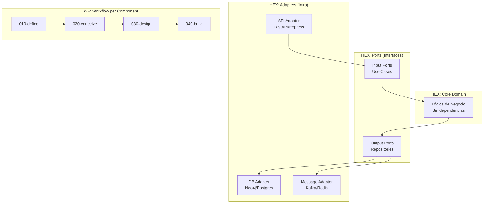
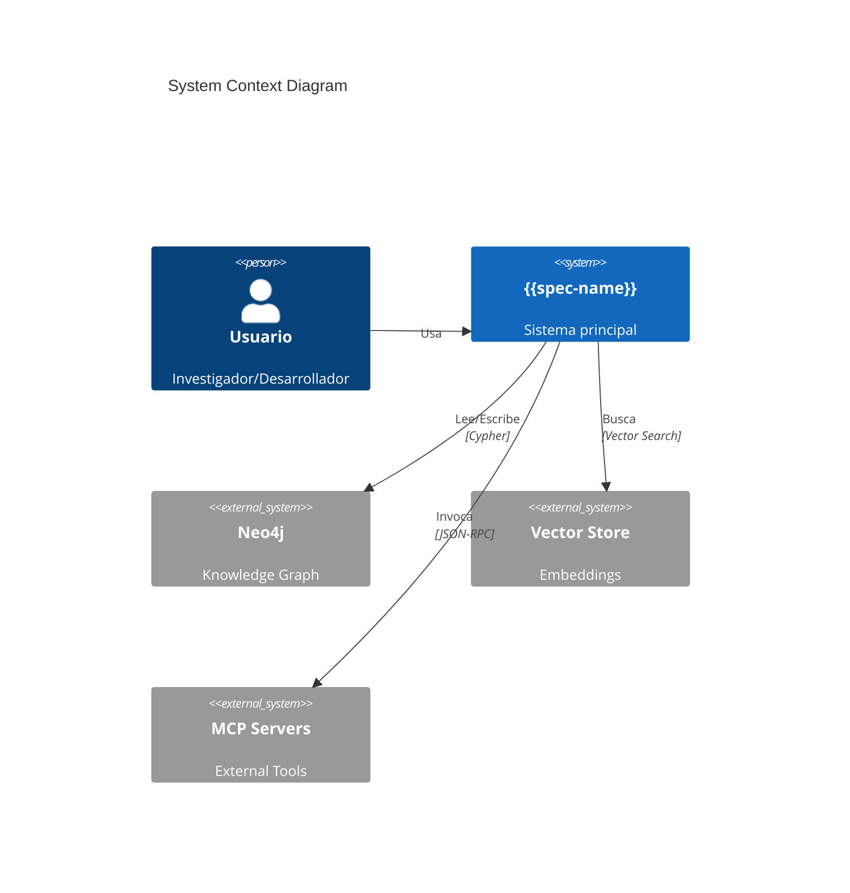
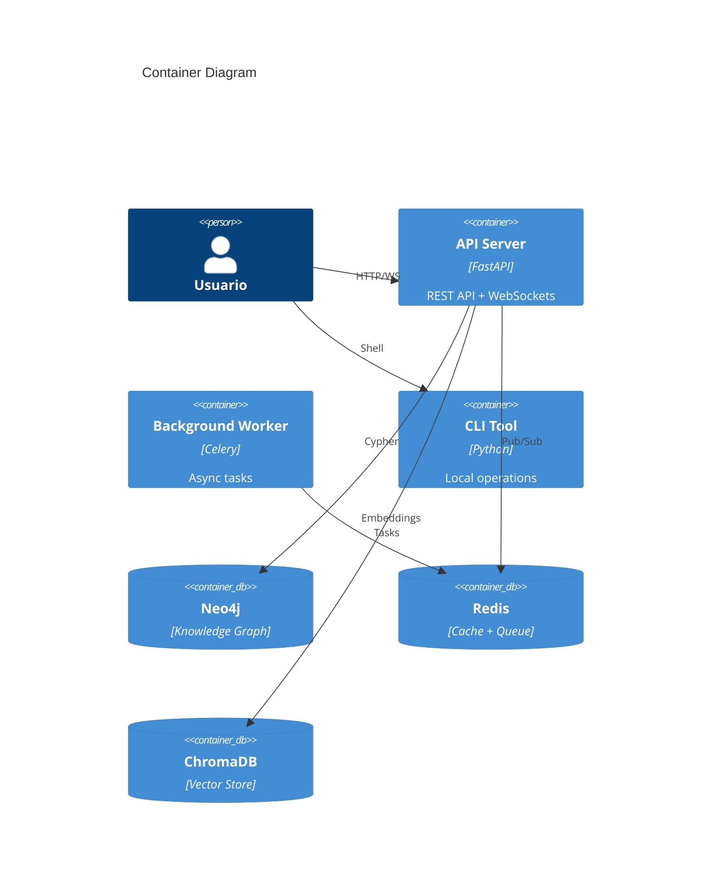
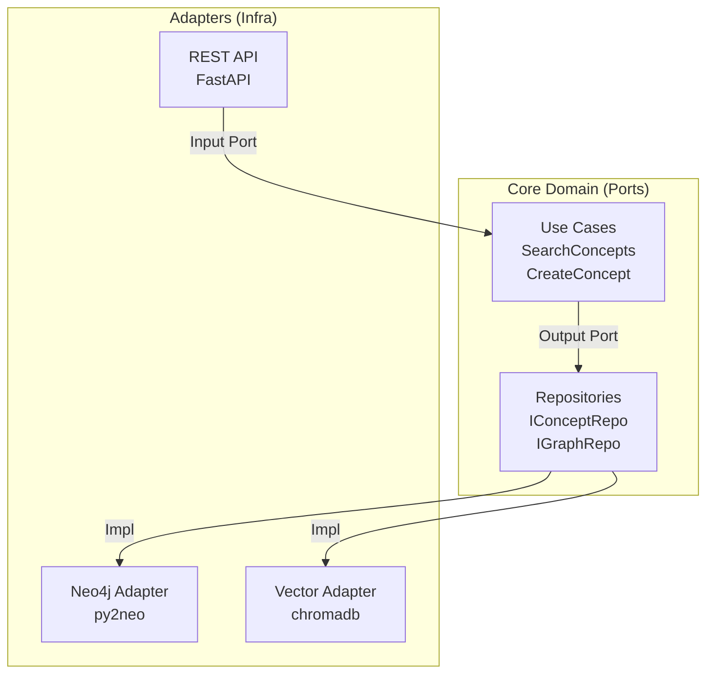

# DAATH-ZEN SALOMON: Plantilla de Diseño

**Rostro**: ⚖️ SALOMON (Tiferet) - Síntesis y Equilibrio
**Fase**: 030-design
**Checkpoint**: CK-03
**Propósito**: Crear documentos de diseño arquitectónico siguiendo patrones HEX-WF (Hexagonal-Workflow) con contratos, pruebas y decisiones técnicas.

## 🎯 Objetivo

SALOMON transforma requisitos (MELQUISEDEC/010-define) y conceptos (HYPATIA/020-conceive) en **arquitectura ejecutable** con:

1. **Decisiones técnicas documentadas** (ADRs)
2. **Contratos de interfaz** explícitos (YAML-LD embebidos o referenciados)
3. **Estrategia de pruebas** definida (Testing Pyramid)
4. **Patrones de workflow** aplicados (PATTERN-XXX)
5. **Trazabilidad completa** (derivation chains vía SECI)

## 📋 Estructura de Diseño

### Componentes Obligatorios

```
030-design/
├── architecture/
│   ├── system-architecture.md       # ✅ PRINCIPAL: Diagrama C4, HEX-WF
│   ├── component-contracts.yaml     # ✅ Contratos de interfaces
│   └── integration-patterns.md      # Patrones de integración
├── adrs/
│   ├── ADR-001-tech-stack.md
│   ├── ADR-002-data-persistence.md
│   └── ADR-003-api-design.md
├── specifications/
│   ├── api-specification.md         # OpenAPI/AsyncAPI
│   └── data-schemas.json           # JSON Schema
├── testing/
│   ├── testing-strategy.md          # ✅ Pirámide de pruebas
│   └── test-contracts.yaml          # ✅ Contratos de prueba
└── workbook/
    ├── design-rationale.md
    └── trade-offs-analysis.md
```

## 🏛️ Arquitectura HEX-WF

### Principio: Hexagonal + Workflow Fractal

**HEX** (Puertos y Adaptadores):
- **Core Domain**: Lógica de negocio pura (sin dependencias externas)
- **Ports**: Interfaces que define el core
- **Adapters**: Implementaciones de infraestructura

**WF** (Workflow Fractal):
- Cada componente hexagonal sigue el mismo flujo: 010→020→030→040→050→060
- Recursión fractal: el sistema completo y cada módulo comparten estructura
- Validaciones en checkpoints (CK-01..CK-05) a todos los niveles

### Diagrama de Referencia



## 📜 Contratos: Embebidos vs Referenciados

### Decisión de Diseño: ¿Dónde viven los contratos?

**Opción A: Embebidos en YAML-LD dentro de REQ-XXX.md** ✅ **RECOMENDADO para contratos pequeños**

**Ventajas**:
- Trazabilidad directa: requisito → contrato en un solo archivo
- Menor dispersión de archivos
- Validación automática de YAML-LD con `context.jsonld`
- Ideal para: API endpoints individuales, data schemas simples, validation rules

**Ejemplo**:
```markdown
# REQ-005: Crear Endpoint de Búsqueda

---
'@context': '../../../context.jsonld'
'@type': 'Requirement'
contracts:
  - name: 'SearchEndpoint'
    type: 'REST-API'
    specification:
      method: 'POST'
      path: '/api/v1/search'
      request_schema:
        type: 'object'
        required: ['query']
        properties:
          query:
            type: 'string'
            minLength: 3
      response_schema:
        type: 'object'
        properties:
          results:
            type: 'array'
---

## Descripción
...
```

**Opción B: Referenciados en archivos separados** ✅ **RECOMENDADO para contratos complejos**

**Ventajas**:
- Reutilización: un contrato puede ser referenciado por múltiples requisitos
- Gestión centralizada: `030-design/specifications/` es fuente única de verdad
- Mejor para: OpenAPI specs completas, JSON Schemas extensos, contratos de mensajería

**Ejemplo**:
```markdown
# REQ-005: Crear Endpoint de Búsqueda

---
'@context': '../../../context.jsonld'
'@type': 'Requirement'
contracts:
  - name: 'SearchEndpoint'
    type: 'REST-API'
    reference: '../../../030-design/specifications/api-search.yaml'
---

## Descripción
...
```

**Archivo Referenciado** (`030-design/specifications/api-search.yaml`):
```yaml
openapi: 3.1.0
info:
  title: Search API
  version: 1.0.0
paths:
  /api/v1/search:
    post:
      summary: Hybrid search across concepts
      requestBody:
        content:
          application/json:
            schema:
              $ref: '#/components/schemas/SearchRequest'
      responses:
        '200':
          description: Search results
          content:
            application/json:
              schema:
                $ref: '#/components/schemas/SearchResponse'
components:
  schemas:
    SearchRequest:
      type: object
      required: [query]
      properties:
        query:
          type: string
          minLength: 3
    SearchResponse:
      type: object
      properties:
        results:
          type: array
          items:
            $ref: '#/components/schemas/ConceptResult'
```

### 🏆 Mejor Práctica: Híbrida

1. **Embeber** contratos simples (1-20 líneas) en REQ-XXX.md
2. **Referenciar** contratos complejos (>20 líneas) desde `030-design/specifications/`
3. **Validar ambos** con `validate-keterdoc-compliance.py`:
   - Embebidos: valida YAML-LD + JSON Schema dentro del frontmatter
   - Referenciados: valida que el archivo exista y sea sintácticamente válido

## 🧪 Pruebas: Estrategia Testing Pyramid

### Principio: Mayor cobertura en la base

```
        /\
       /E2E\       10% - Pruebas End-to-End (UI, flujos completos)
      /______\
     /        \
    /Integration\ 20% - Pruebas de Integración (APIs, DB)
   /____________\
  /              \
 /   Unit Tests   \ 70% - Pruebas Unitarias (lógica de negocio)
/__________________\
```

### Contrato de Prueba: `testing/test-contracts.yaml`

**Propósito**: Definir **qué** debe ser probado y **cómo** medirlo.

```yaml
---
'@context': '../../../context.jsonld'
'@type': 'TestContract'
test_strategy:
  coverage_target: 80
  frameworks:
    unit: 'pytest'
    integration: 'pytest + testcontainers'
    e2e: 'playwright'

test_suites:
  - name: 'Core Domain Tests'
    level: 'unit'
    target_coverage: 90
    location: 'tests/unit/core/'
    contracts:
      - 'All use cases must have ≥1 happy path test'
      - 'All use cases must have ≥1 error case test'
      - 'No mocks for domain logic (pure functions)'

  - name: 'Port Adapters Tests'
    level: 'integration'
    target_coverage: 70
    location: 'tests/integration/adapters/'
    contracts:
      - 'DB adapters: test against real DB (testcontainers)'
      - 'API adapters: test against mock server'
      - 'Message adapters: test with in-memory broker'

  - name: 'End-to-End Flows'
    level: 'e2e'
    target_coverage: 50
    location: 'tests/e2e/'
    contracts:
      - 'Critical user journeys only'
      - 'Test against staging environment'
      - 'Automated via CI/CD'

validation:
  pre_commit:
    - 'Run unit tests (<10s)'
  pre_push:
    - 'Run unit + integration tests (<2min)'
  ci_pipeline:
    - 'Run all tests (<10min)'
    - 'Generate coverage report'
    - 'Block merge if <80% coverage'
```

### Embebido vs Referenciado: Pruebas

**Recomendación**: **Siempre referenciado** en `030-design/testing/`

**Razón**:
- Las pruebas evolucionan frecuentemente (no son "requisitos estáticos")
- Necesitan versionado independiente
- Deben ser ejecutables (no solo documentación)
- El contrato de prueba define el "qué", el código de prueba define el "cómo"

**Flujo**:
1. **REQ-XXX.md** define el requisito funcional
2. **030-design/testing/test-contracts.yaml** define qué debe ser probado
3. **040-build/app/tests/** contiene las pruebas ejecutables
4. **Validación** en CK-04: cobertura ≥80%

## 🔗 Trazabilidad: Derivation Chains

### SECI Model en Diseño

**`seci.derives_from`**: Lista de artefactos que informaron este diseño
**`seci.informs`**: Lista de artefactos que serán construidos a partir de este diseño

**Ejemplo**:
```yaml
---
'@context': '../../../context.jsonld'
'@type': 'ArchitectureDocument'
seci:
  derives_from:
    - '../../010-define/workbooks/REQ-005-search-endpoint.md'
    - '../../020-conceive/02-atomics/concept-hybrid-search.md'
    - '../adrs/ADR-002-data-persistence.md'
  informs:
    - '../../040-build/app/src/adapters/api/search_endpoint.py'
    - '../../040-build/app/tests/integration/test_search_endpoint.py'
---

# System Architecture
...
```

**Validación**:
```bash
python tools/validate-artifact-dependencies.py \
  --file 030-design/architecture/system-architecture.md

# ✅ All derives_from paths exist
# ✅ All informs paths are planned in tasks.md
# ✅ No circular dependencies
```

## 📝 Plantilla: system-architecture.md

```markdown
---
'@context': '../../../context.jsonld'
'@type': 'ArchitectureDocument'
'@id': 'https://melquisedec.org/specs/{{spec-name}}/architecture'
dc:title: 'System Architecture - {{spec-name}}'
dc:created: '{{date}}'
dc:creator: ['SALOMON']
version: '1.0.0'
seci:
  derives_from:
    - '../../010-define/workbooks/REQ-*.md'
    - '../../020-conceive/02-atomics/*.md'
  informs:
    - '../../040-build/app/src/**'
lens: 'HEX-WF'
workflow_pattern: 'PATTERN-005-Design'
---

# System Architecture: {{spec-name}}

**Spec**: {{spec-name}}
**Version**: v1.0.0
**Date**: {{date}}
**Architect**: SALOMON (Tiferet)
**Lens**: HEX-WF (Hexagonal-Workflow)

---

## 1. Contexto y Alcance (C4: Context)

### Diagrama de Contexto



### Stakeholders y Drivers

| Stakeholder | Concerns | Architectural Drivers |
|-------------|----------|----------------------|
| Investigador | Trazabilidad de conceptos | → HEX: Core Domain sin deps |
| Desarrollador | Mantenibilidad del código | → WF: Recursión fractal |
| SysAdmin | Despliegue sencillo | → Containerización |

---

## 2. Contenedores (C4: Container)

### Diagrama de Contenedores



---

## 3. Componentes (C4: Component) - HEX Architecture

### Diagrama de Componentes



### Contratos de Puertos

Ver: `component-contracts.yaml` para definiciones formales.

---

## 4. ADRs Clave

### ADR-001: Tech Stack
- **Contexto**: Necesitamos stack para RAG con graphs
- **Decisión**: Python + FastAPI + Neo4j + ChromaDB
- **Consecuencias**: (+) Ecosystem maduro, (-) Python GIL limits

### ADR-002: Data Persistence
- **Contexto**: ¿Cómo persistir concepts y relationships?
- **Decisión**: Neo4j como fuente de verdad, ChromaDB para embeddings
- **Alternativas Rechazadas**: PostgreSQL (no optimizado para grafos)

Ver: `adrs/*.md` para detalles completos.

---

## 5. Especificaciones Técnicas

### API Specification
Ver: `specifications/api-specification.md` (OpenAPI 3.1)

### Data Schemas
Ver: `specifications/data-schemas.json` (JSON Schema)

---

## 6. Estrategia de Pruebas

Ver: `testing/testing-strategy.md` para Testing Pyramid completa.
Ver: `testing/test-contracts.yaml` para contratos de prueba.

**Resumen**:
- 70% Unit Tests (core domain)
- 20% Integration Tests (adapters)
- 10% E2E Tests (critical flows)

---

## 7. Trade-offs y Decisiones

Ver: `workbook/trade-offs-analysis.md` para análisis completo.

**Principal Trade-off**:
- **Complexity vs Flexibility**: HEX-WF añade capas (ports/adapters/workflow) pero permite evolución independiente de componentes.
- **Decisión**: Aceptar complejidad para proyectos >1 mes de duración.

---

## 8. Referencias

- → `../../010-define/workbooks/` (Requisitos)
- → `../../020-conceive/02-atomics/` (Conceptos base)
- → `../adrs/` (Decisiones técnicas)
- → `specifications/` (Contratos formales)
```

## 🔧 Herramientas de Validación

### `validate-design-coherence.py`

```python
# Valida que design.md cumpla con SALOMON template

checks = {
    'C4 diagrams present': ['Context', 'Container', 'Component'],
    'HEX layers defined': ['Core Domain', 'Ports', 'Adapters'],
    'WF checkpoints': ['CK-03 validation'],
    'ADRs referenced': ['≥3 ADRs in adrs/'],
    'Contracts defined': ['component-contracts.yaml exists'],
    'Testing strategy': ['testing-strategy.md exists'],
    'SECI derivation': ['derives_from links valid']
}
```

---

**Versión**: 1.0.0
**Próxima Revisión**: Después de implementar spec-001 (piloto)
**Mejoras Planeadas**: Templates para ADR, API spec, Testing strategy
