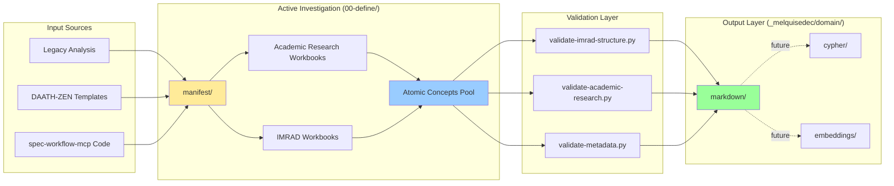

# SPEC-000: Investigation Daath-Zen Framework - Design

## Metadatos

| Campo | Valor |
|-------|-------|
| **Spec ID** | SPEC-000 |
| **Nombre** | Investigation Daath-Zen Framework |
| **Versión** | 1.0.0 |
| **Fecha** | 2026-01-11 |
| **Estado** | Design (Pending Approval) |
| **Autor** | GitHub Copilot (Claude Sonnet 4.5) |
| **spec:issue** | SPEC-000 (Foundation Specification) |
| **spec:owner** | HYPATIA (Academic Research) + SALOMON (IMRAD Synthesis) |
| **Propósito** | Diseñar sistema de investigación académica para ampliar dominio de conocimiento |

---

## Overview

Este documento especifica la arquitectura del sistema de investigación Daath-Zen, que utiliza dos metodologías complementarias (Academic Research + IMRAD) para ampliar el dominio de conocimiento del proyecto. Define la estructura de workspaces, workbooks, metadata governance, y estrategias de validación.

### Scope del Diseño

1. **Arquitectura de Workspaces**: Separación 00-define/ ↔ .spec-workflow/ ↔ _melquisedec/domain/
2. **Sistema Dual de Workbooks**: Academic Research (5 folders) + IMRAD (7 sections)
3. **Metadata Governance**: Dublin Core + spec:issue + spec:owner + Pull Request system
4. **Triple Persistence**: markdown → cypher → embeddings (deferred automation)
5. **Estrategia de Validación**: 3 validadores (validate-imrad-structure.py, validate-academic-research.py, validate-metadata.py)

---

## Architecture Decision Records (ADRs)

### ADR-001: Why Two Workbook Methodologies?

**Context**: Necesitamos investigar y sintetizar conocimiento académico sobre Domain-Driven Design, IMRAD, ISO standards, y literatura científica.

**Decision**: Usar dos metodologías complementarias:
- **Academic Research** (Literature Review): Para análisis profundo de fuentes académicas
- **IMRAD** (Introduction-Methods-Results-Discussion): Para síntesis científica estructurada

**Rationale**:
- Academic Research permite **análisis iterativo** de múltiples fuentes con refinamiento progresivo
- IMRAD permite **comunicación científica** clara con estructura estandarizada
- Ambas metodologías **se complementan**: Academic Research para profundidad, IMRAD para claridad

**Consequences**:
- ✅ **Pros**: Flexibilidad metodológica, rigor académico, comunicación efectiva
- ❌ **Cons**: Mayor complejidad en templates, dos validadores requeridos
- 🔧 **Mitigación**: Templates bien documentados, validación automatizada

**Implementation**:
```
Workbook Type       | Structure              | Output Format
--------------------|------------------------|------------------
Academic Research   | 5 folders (1-6)        | markdown sections
IMRAD               | 7 markdown files       | monolithic doc
```

**References**:
- [ANALISIS-PROFUNDO-academic-research-vs-imrad.md](file:///_melquisedec/lessons/ANALISIS-PROFUNDO-academic-research-vs-imrad.md)
- REQ-000-01.01 (Workbook Academic Research - DDD)
- REQ-000-01.04 (Workbook IMRAD - Research Synthesis)

---

### ADR-002: Workspace Separation Architecture

**Context**: El proyecto necesita separar investigación activa, gobernanza formal, y outputs finales.

**Decision**: Arquitectura de 3 workspaces separados:
1. **00-define/**: Workspace activo (investigation, manifest, workbooks)
2. **.spec-workflow/**: Gobernanza formal (specs, approvals, steering)
3. **_melquisedec/domain/**: Outputs consolidados (markdown, cypher, embeddings)

**Rationale**:
- **00-define/**: HYPATIA y SALOMON trabajan aquí (edición activa en Obsidian)
- **.spec-workflow/**: Tracking de requirements/design/tasks (sin modificar workbooks)
- **_melquisedec/domain/**: ALMA publica aquí después de validación (source of truth final)

**Consequences**:
- ✅ **Pros**: Separación de concerns, trazabilidad clara, evita confusión
- ❌ **Cons**: Triple persistence manual hasta activar Neo4j
- 🔧 **Mitigación**: Manual copy por ahora, sync-all.sh futuro

**Implementation**:
```
00-define/0-define-daath-zen-framework/
├── manifest/                          ← Inputs (legacy analysis, templates)
│   ├── INVESTIGACION-BIDIRECCIONAL.md
│   ├── ANALISIS-PROPUESTA.md
│   ├── template-daath-zen-requirements.md
│   └── ...
└── workbooks/                         ← Active investigation
    ├── wb-academic-research-ddd/
    ├── wb-academic-research-imrad/
    ├── wb-imrad-research-synthesis/
    └── ...

.spec-workflow/specs/spec-000-investigation-daath-zen/
├── requirements.md                    ← Formal requirements
├── design.md                          ← Este documento
└── tasks.md                           ← Execution plan

_melquisedec/domain/
├── markdown/                          ← Published outputs (ALMA)
├── cypher/                            ← Neo4j ingestion (placeholder)
└── embeddings/                        ← Vector store (placeholder)
```

**References**:
- REQ-000-01 (Functional Requirements - Workbooks)
- REQ-000-03 (Triple Persistence Strategy)
- User correction: "00-define colocaremos todas las investigaciones que amplían dominio de conocimiento"

---

### ADR-003: Metadata Standards (Dublin Core + spec extensions)

**Context**: Necesitamos metadata consistente para trazabilidad, ownership, y cross-spec governance.

**Decision**: Usar Dublin Core (9 mandatory fields) + spec extensions (spec:issue, spec:owner).

**Rationale**:
- **Dublin Core**: Estándar ISO 15836, ampliamente adoptado en bibliotecas digitales
- **spec:issue**: Identifica qué spec creó/mantiene el artefacto (para PRs cross-spec)
- **spec:owner**: Identifica agente responsable (HYPATIA/SALOMON/MORPHEUS/ALMA)

**Consequences**:
- ✅ **Pros**: Interoperabilidad, trazabilidad, ownership claro
- ❌ **Cons**: Overhead en metadata entry (9 campos obligatorios)
- 🔧 **Mitigación**: Validador automatizado (validate-metadata.py)

**Implementation**:
```yaml
---
# Dublin Core (ISO 15836)
dc:title: "Workbook Academic Research - DDD Literature Review"
dc:creator: "HYPATIA (AI Research Agent)"
dc:subject: "Domain-Driven Design, Strategic Design, Tactical Patterns"
dc:description: "Literature review of DDD concepts, patterns, and best practices"
dc:publisher: "ALEIA-Melquisedec Project"
dc:contributor: "GitHub Copilot (Claude Sonnet 4.5)"
dc:date: "2026-01-11"
dc:type: "Academic Research Workbook"
dc:format: "text/markdown"
dc:identifier: "wb-academic-research-ddd"
dc:language: "en-US"
dc:relation: "isPartOf: SPEC-000-investigation-daath-zen"
dc:coverage: "Domain-Driven Design Literature (2003-2024)"
dc:rights: "MIT License"

# Spec Extensions
spec:issue: "SPEC-000"
spec:owner: "HYPATIA"

# Keter-Doc Protocol
keter-doc:version: "1.0.0"
keter-doc:schema: "https://aleia-melquisedec.org/schemas/academic-research-workbook.jsonld"
---
```

**References**:
- REQ-000-02 (Metadata Standards)
- ISO 15836:2009 (Dublin Core Metadata Initiative)
- Keter-Doc Protocol: [context.jsonld](file:///../context.jsonld)

---

### ADR-004: Pull Request System for Cross-Spec Governance

**Context**: Múltiples specs pueden necesitar modificar artefactos creados por otras specs.

**Decision**: Sistema de Pull Requests (PRs) con formato `pr-XXX-to-000-YYY.md`:
- **XXX**: Spec solicitante (e.g., "001")
- **000**: Spec owner (e.g., "000")
- **YYY**: ID único del PR

**Rationale**:
- **Ownership**: spec:issue define quién creó el artefacto
- **Modifications**: Solo el owner puede modificar directamente
- **Cross-Spec Changes**: Otros specs proponen cambios via PR
- **Approval**: Owner revisa y aprueba/rechaza via spec-workflow-mcp approvals

**Consequences**:
- ✅ **Pros**: Governance clara, trazabilidad de cambios, evita conflictos
- ❌ **Cons**: Overhead en pequeños cambios (requiere PR formal)
- 🔧 **Mitigación**: PR templates, approval rápida via spec-workflow-mcp

**Implementation**:
```markdown
# PR-001-to-000-001: Add ISO 25010 Quality Model to DDD Workbook

## Metadata
- **PR ID**: pr-001-to-000-001
- **From Spec**: SPEC-001 (Built Template spec-workflow)
- **To Spec**: SPEC-000 (Investigation Daath-Zen Framework)
- **Target Artifact**: wb-academic-research-ddd/3-atomics/atomic-003-quality-attributes.md
- **Date**: 2026-01-15
- **Status**: Pending Approval
- **spec:owner**: HYPATIA (SPEC-000 owner)

## Rationale
SPEC-001 needs to reference ISO 25010 quality model for NFRs. Request adding section to DDD workbook atomic-003.

## Proposed Changes
\`\`\`diff
+ ### ISO 25010 Quality Model
+
+ ISO 25010 defines 8 quality characteristics:
+ - Functional Suitability
+ - Performance Efficiency
+ ...
\`\`\`

## Impact Analysis
- Adds 500 words to atomic-003
- No breaking changes to existing structure
- Enhances quality attributes coverage

## Approval
- [ ] HYPATIA (SPEC-000 owner) - Pending
```

**References**:
- REQ-000-02.06 (Pull Request System)
- ANALISIS-PROFUNDO Parte 9: Gobernanza de Artefactos

---

### ADR-005: Triple Persistence Deferred (Manual → Automated)

**Context**: Triple persistence (markdown → cypher → embeddings) requiere Neo4j activo + sync scripts.

**Decision**: Implementación en dos fases:
- **Phase 1 (Now)**: Manual copy de markdown outputs a `_melquisedec/domain/`
- **Phase 2 (Future)**: Automated sync con `sync-all.sh` + Neo4j ingestion

**Rationale**:
- **Neo4j Status**: Redis activado, Neo4j 5.15+ pending activation
- **Immediate Need**: Spec-000 debe generar markdown outputs ahora
- **Future Automation**: Cuando Neo4j active, implementar sync-all.sh

**Consequences**:
- ✅ **Pros**: No blocker para spec-000, markdown como source of truth
- ❌ **Cons**: Manual copy propensa a errores, no automatic embeddings
- 🔧 **Mitigación**: Clear instructions in tasks.md, validation checkpoints

**Implementation**:
```bash
# Phase 1: Manual Copy (Now)
# After ALMA validates workbooks:
cp 00-define/0-define-daath-zen-framework/workbooks/wb-*/6-outputs/*.md \
   _melquisedec/domain/markdown/

# Phase 2: Automated Sync (Future)
# When Neo4j active:
./tools/sync-all.sh --from 00-define --to _melquisedec/domain
# - Parses markdown frontmatter
# - Generates cypher MERGE statements
# - Creates embeddings via Ollama
# - Ingests to Neo4j graph
```

**References**:
- REQ-000-03 (Triple Persistence Strategy)
- [docker-compose.triple-persistence.yml](file:///../docker-compose.triple-persistence.yml)
- Neo4j 5.15+ Documentation: https://neo4j.com/docs/

---

## System Components Design

### Component 1: Workbook Templates

**Purpose**: Provide structured templates for Academic Research and IMRAD workbooks.

**Design**:
```
Academic Research Template Structure:
wb-academic-research-{topic}/
├── README.md                          ← Metadata + overview
├── 1-literature/                      ← Source collection
│   ├── papers-{topic}.md
│   └── books-{topic}.md
├── 2-analysis/                        ← Critical analysis
│   ├── themes-{topic}.md
│   └── patterns-{topic}.md
├── 3-atomics/                         ← Atomic concepts
│   ├── atomic-001-{concept}.md
│   └── atomic-002-{concept}.md
├── 4-artifacts/                       ← Synthesized outputs
│   └── synthesis-{topic}.md
└── 6-outputs/                         ← Final published outputs
    └── final-{topic}.md

IMRAD Template Structure:
wb-imrad-{topic}/
├── README.md                          ← Metadata + overview
├── 01-introduction.md
├── 02-literature-review.md
├── 03-methodology.md
├── 04-results.md
├── 05-discussion.md
├── 06-conclusion.md
└── 07-references.md
```

**Validation Rules**:
- Academic Research: Must have folders 1, 2, 3, 4, 6 (folder 5 reserved for future)
- IMRAD: Must have all 7 markdown files (01-07)
- README.md: Must contain Dublin Core metadata + spec:issue + spec:owner
- Atomics: Must follow naming `atomic-XXX-{title}.md`

**References**:
- REQ-000-01.01 through REQ-000-01.06 (Workbook Specifications)
- [ANALISIS-PROFUNDO Parte 2-3](file:///_melquisedec/lessons/ANALISIS-PROFUNDO-academic-research-vs-imrad.md) (Metodologías)

---

### Component 2: Validation Tools

**Purpose**: Automated validation of workbook structure, metadata, and content quality.

**Design**:
```python
# validate-imrad-structure.py
def validate_imrad_workbook(workbook_path: Path) -> ValidationReport:
    """Validate IMRAD workbook structure."""
    required_files = [
        "README.md",
        "01-introduction.md",
        "02-literature-review.md",
        "03-methodology.md",
        "04-results.md",
        "05-discussion.md",
        "06-conclusion.md",
        "07-references.md"
    ]

    report = ValidationReport()

    # Check file existence
    for file in required_files:
        if not (workbook_path / file).exists():
            report.add_error(f"Missing required file: {file}")

    # Validate metadata in README.md
    metadata = parse_frontmatter(workbook_path / "README.md")
    if "spec:issue" not in metadata:
        report.add_error("Missing spec:issue in README.md")
    if "spec:owner" not in metadata:
        report.add_error("Missing spec:owner in README.md")

    # Validate Dublin Core fields
    dc_required = ["dc:title", "dc:creator", "dc:date", "dc:type"]
    for field in dc_required:
        if field not in metadata:
            report.add_error(f"Missing Dublin Core field: {field}")

    return report

# validate-academic-research.py
def validate_academic_research_workbook(workbook_path: Path) -> ValidationReport:
    """Validate Academic Research workbook structure."""
    required_folders = ["1-literature", "2-analysis", "3-atomics", "4-artifacts", "6-outputs"]

    report = ValidationReport()

    # Check folder existence
    for folder in required_folders:
        if not (workbook_path / folder).exists():
            report.add_error(f"Missing required folder: {folder}")

    # Validate atomics naming
    atomics_path = workbook_path / "3-atomics"
    if atomics_path.exists():
        for file in atomics_path.glob("*.md"):
            if not re.match(r"atomic-\d{3}-.+\.md", file.name):
                report.add_warning(f"Atomic file doesn't follow naming convention: {file.name}")

    return report

# validate-metadata.py
def validate_metadata(file_path: Path) -> ValidationReport:
    """Validate metadata in markdown file."""
    metadata = parse_frontmatter(file_path)

    report = ValidationReport()

    # Dublin Core mandatory fields
    dc_mandatory = [
        "dc:title", "dc:creator", "dc:subject", "dc:description",
        "dc:publisher", "dc:date", "dc:type", "dc:format", "dc:identifier"
    ]

    for field in dc_mandatory:
        if field not in metadata:
            report.add_error(f"Missing mandatory Dublin Core field: {field}")

    # Spec extensions
    if "spec:issue" not in metadata:
        report.add_error("Missing spec:issue field")
    if "spec:owner" not in metadata:
        report.add_error("Missing spec:owner field")

    return report
```

**Success Criteria**:
- All validators return 0 errors (warnings allowed)
- 100% pass rate on CI/CD pipeline
- Execution time < 5 seconds per workbook

**References**:
- REQ-000-04 (Validation Requirements)
- REQ-000-NFR-04 (Performance: < 5s validation)

---

### Component 3: Manifest Directory Structure

**Purpose**: Centralize all legacy inputs and templates for spec-000 investigation.

**Design**:
```
00-define/0-define-daath-zen-framework/manifest/
├── README.md                                      ← Overview + index
├── legacy-inputs/                                 ← Previous analysis
│   ├── INVESTIGACION-BIDIRECCIONAL.md
│   ├── ANALISIS-PROPUESTA-spec-000-dominio-vivo.md
│   ├── ANALISIS-PROFUNDO-academic-research-vs-imrad.md
│   └── amendments-analysis.md
├── templates-daath-zen/                           ← 6 DAATH-ZEN templates
│   ├── daath-zen-requirements.md
│   ├── daath-zen-design.md
│   ├── daath-zen-tasks.md
│   ├── daath-zen-product.md
│   ├── daath-zen-tech.md
│   └── daath-zen-structure.md
└── code-analysis/                                 ← spec-workflow-mcp code
    ├── mcp-server-architecture.md
    ├── approval-system-flow.md
    └── implementation-log-patterns.md
```

**Usage**:
- HYPATIA references `legacy-inputs/` for context
- SALOMON uses `templates-daath-zen/` as base for synthesis
- MORPHEUS analyzes `code-analysis/` for implementation patterns
- ALMA validates outputs against `templates-daath-zen/` structure

**References**:
- REQ-000-01 (Functional Requirements)
- Task-000-001 (Populate manifest/ directory)

---

### Component 4: Agent Roles & Responsibilities

**Purpose**: Clear separation of concerns entre agentes IA.

**Design**:
```
Agent         | Role                    | Responsibilities
--------------|-------------------------|------------------------------------------
HYPATIA       | Academic Researcher     | - Execute Academic Research workbooks
              |                         | - Collect & analyze literature
              |                         | - Generate atomics from papers
              |                         | - Write critical analysis
              |                         |
SALOMON       | IMRAD Synthesizer       | - Execute IMRAD workbooks
              |                         | - Synthesize research findings
              |                         | - Write scientific reports
              |                         | - Cross-reference atomics
              |                         |
MORPHEUS      | Atomics Curator         | - Validate atomic concepts
              |                         | - Ensure atomic uniqueness
              |                         | - Cross-link related atomics
              |                         | - Generate traceability matrix
              |                         |
ALMA          | Publisher & Validator   | - Run validation tools
              |                         | - Publish to _melquisedec/domain/
              |                         | - Generate final reports
              |                         | - Execute triple persistence
```

**Collaboration Protocol**:
1. HYPATIA → SALOMON: Pasa atomics via `3-atomics/` folder
2. SALOMON → MORPHEUS: Notifica atomics completados para validación
3. MORPHEUS → ALMA: Aprueba atomics para publicación
4. ALMA → Neo4j: Ingesta a graph database (cuando activo)

**References**:
- REQ-000-01 (Functional Requirements - Agent assignments)
- ANALISIS-PROFUNDO Parte 9 (Ownership system)

---

## Data Flow & Integration

### Data Flow Diagram



**Key Integration Points**:
1. **manifest/ → workbooks/**: HYPATIA reads legacy inputs before starting
2. **workbooks/ → atomics/**: Both methodologies generate atomics
3. **atomics/ → validation**: MORPHEUS validates before publication
4. **validation → domain/**: ALMA publishes after 100% pass rate
5. **domain/ → Neo4j**: Future automated sync (Phase 2)

---

## Non-Functional Requirements Design

### NFR-001: Performance

**Target**: Validation < 5 seconds per workbook

**Design Approach**:
- **Parallel Validation**: Run 3 validators concurrently
- **Incremental Parsing**: Only parse changed files (content hash)
- **Caching**: Cache metadata parsing results

**Implementation**:
```python
# Parallel validation with ThreadPoolExecutor
from concurrent.futures import ThreadPoolExecutor

def validate_all_workbooks(workbooks_path: Path) -> Dict[str, ValidationReport]:
    with ThreadPoolExecutor(max_workers=3) as executor:
        futures = {
            executor.submit(validate_workbook, wb): wb
            for wb in workbooks_path.glob("wb-*")
        }
        return {futures[f]: f.result() for f in futures}
```

**References**: REQ-000-NFR-01

---

### NFR-002: Maintainability

**Target**: Clear documentation, modular design, 80%+ test coverage

**Design Approach**:
- **Clear Separation**: Each workbook is independent (no cross-dependencies)
- **README.md per Workbook**: Self-documenting structure
- **Validation Tools**: Enforce quality standards automatically
- **Unit Tests**: pytest for each validator (80%+ coverage)

**Implementation**:
```python
# tests/test_validate_imrad.py
def test_validate_imrad_missing_file():
    temp_dir = create_temp_workbook()
    (temp_dir / "01-introduction.md").unlink()  # Remove required file

    report = validate_imrad_workbook(temp_dir)

    assert report.has_errors()
    assert "Missing required file: 01-introduction.md" in report.errors
```

**References**: REQ-000-NFR-02

---

### NFR-003: Usability

**Target**: Templates fáciles de usar, validación clara, documentación completa

**Design Approach**:
- **Template Starters**: `create-workbook.sh --type academic-research --topic ddd`
- **Clear Error Messages**: "Missing spec:issue in README.md" (not "Validation failed")
- **Documentation**: README.md in each folder explaining structure

**Implementation**:
```bash
#!/bin/bash
# tools/create-workbook.sh

TYPE=$1
TOPIC=$2

if [ "$TYPE" == "academic-research" ]; then
    mkdir -p "wb-academic-research-$TOPIC"/{1-literature,2-analysis,3-atomics,4-artifacts,6-outputs}
    cp templates/academic-research-README.md "wb-academic-research-$TOPIC/README.md"
    echo "✅ Created academic-research workbook: wb-academic-research-$TOPIC"
elif [ "$TYPE" == "imrad" ]; then
    mkdir -p "wb-imrad-$TOPIC"
    for i in {01..07}; do
        cp "templates/imrad-section-$i.md" "wb-imrad-$TOPIC/$i-*.md"
    done
    echo "✅ Created IMRAD workbook: wb-imrad-$TOPIC"
fi
```

**References**: REQ-000-NFR-03

---

### NFR-004: Scalability

**Target**: Manejar 50+ workbooks, 500+ atomics sin degradación

**Design Approach**:
- **File-Based Storage**: No database bottleneck (markdown nativo)
- **Indexed Search**: Use git grep for fast text search
- **Lazy Loading**: Only load workbooks when needed (not all at once)

**Implementation**:
```bash
# Fast search across all workbooks
git grep "Domain-Driven Design" 00-define/*/workbooks/

# Count total atomics
find 00-define/ -name "atomic-*.md" | wc -l
```

**References**: REQ-000-NFR-04

---

## Risk Analysis & Mitigation

### Risk 1: Manual Copy Errors (Triple Persistence)

**Probability**: Medium (manual process prone to human error)

**Impact**: High (outputs in wrong location → Neo4j ingestion fails)

**Mitigation**:
- Clear instructions in tasks.md with exact commands
- Validation checkpoints: ALMA verifies files exist in `_melquisedec/domain/`
- Future automation: Prioritize `sync-all.sh` implementation

**References**: ADR-005, REQ-000-03

---

### Risk 2: Metadata Inconsistency

**Probability**: Medium (many files, easy to forget fields)

**Impact**: Medium (affects traceability, breaks validation)

**Mitigation**:
- Automated validation: `validate-metadata.py` enforces standards
- Template starters: Pre-populated with Dublin Core fields
- CI/CD pipeline: Blocks commits with metadata errors

**References**: ADR-003, REQ-000-02

---

### Risk 3: Atomics Duplication

**Probability**: Low (MORPHEUS validates uniqueness)

**Impact**: Low (redundancy, not breaking)

**Mitigation**:
- MORPHEUS cross-references atomics before approval
- Naming convention: `atomic-XXX-{unique-title}.md`
- Traceability matrix: Tracks atomic usage across workbooks

**References**: Component 4 (Agent Roles - MORPHEUS)

---

## Testing Strategy

### Unit Tests

**Scope**: Each validator function independently

**Coverage Target**: 80%+

**Implementation**:
```python
# tests/test_validate_metadata.py
import pytest
from validate_metadata import validate_metadata

def test_missing_dc_title():
    file = create_temp_file_without_dc_title()
    report = validate_metadata(file)
    assert report.has_errors()
    assert "Missing mandatory Dublin Core field: dc:title" in report.errors

def test_missing_spec_issue():
    file = create_temp_file_without_spec_issue()
    report = validate_metadata(file)
    assert report.has_errors()
    assert "Missing spec:issue field" in report.errors

def test_valid_metadata():
    file = create_temp_file_with_all_fields()
    report = validate_metadata(file)
    assert not report.has_errors()
```

**References**: REQ-000-NFR-02

---

### Integration Tests

**Scope**: Full workbook creation → validation → publication flow

**Coverage Target**: All happy paths + critical error paths

**Implementation**:
```python
# tests/integration/test_workbook_lifecycle.py
def test_academic_research_full_lifecycle():
    # 1. Create workbook from template
    workbook = create_academic_research_workbook("ddd")

    # 2. Populate with content
    populate_literature(workbook, sources=["evans2003", "vernon2013"])
    populate_atomics(workbook, count=5)

    # 3. Validate structure
    report = validate_academic_research_workbook(workbook)
    assert not report.has_errors()

    # 4. Validate metadata
    meta_report = validate_metadata(workbook / "README.md")
    assert not meta_report.has_errors()

    # 5. Publish to domain/
    publish_workbook(workbook, target="_melquisedec/domain/markdown/")
    assert (Path("_melquisedec/domain/markdown") / "ddd-synthesis.md").exists()
```

**References**: REQ-000-01 (Acceptance Criteria)

---

### Validation Tests

**Scope**: Validators correctly detect errors

**Coverage Target**: All validation rules

**Implementation**:
```python
# tests/test_validators.py
def test_imrad_detects_missing_files():
    workbook = create_imrad_workbook_missing_03_methodology()
    report = validate_imrad_workbook(workbook)
    assert "Missing required file: 03-methodology.md" in report.errors

def test_academic_research_detects_wrong_atomic_naming():
    workbook = create_academic_research_with_file("3-atomics/wrong-name.md")
    report = validate_academic_research_workbook(workbook)
    assert "doesn't follow naming convention" in report.warnings
```

**References**: REQ-000-04

---

## Traceability Matrix

| Requirement | Design Component | Validation | Task |
|-------------|------------------|------------|------|
| REQ-000-01.01 | ADR-001, Component 1 | validate-academic-research.py | Task-000-002 |
| REQ-000-01.02 | ADR-001, Component 1 | validate-academic-research.py | Task-000-003 |
| REQ-000-01.03 | ADR-001, Component 1 | validate-imrad-structure.py | Task-000-004 |
| REQ-000-01.04 | ADR-001, Component 1 | validate-imrad-structure.py | Task-000-005 |
| REQ-000-01.05 | ADR-001, Component 1 | validate-imrad-structure.py | Task-000-006 |
| REQ-000-01.06 | ADR-001, Component 1 | validate-imrad-structure.py | Task-000-007 |
| REQ-000-02 | ADR-003, Component 2 | validate-metadata.py | Task-000-011 |
| REQ-000-03 | ADR-005 | Manual verification | Task-000-012 |
| REQ-000-04 | Component 2 | pytest suite | Task-000-013 |
| REQ-000-NFR-01 | NFR-001 | Performance tests | Task-000-010 |
| REQ-000-NFR-02 | NFR-002 | Coverage reports | Task-000-013 |
| REQ-000-NFR-03 | NFR-003 | User testing | Task-000-001 |
| REQ-000-NFR-04 | NFR-004 | Scalability tests | Task-000-010 |

---

## Appendix A: Glossary

| Term | Definition |
|------|------------|
| **Academic Research** | Metodología de investigación basada en Literature Review (5 folders: 1-literature → 6-outputs) |
| **IMRAD** | Metodología científica (Introduction-Methods-Results-Discussion, 7 sections) |
| **Atomic Concept** | Concepto mínimo indivisible extraído de literatura académica (almacenado en `atomic-XXX-{title}.md`) |
| **Workbook** | Unidad de trabajo para investigación (Academic Research o IMRAD type) |
| **Manifest** | Directorio centralizado con inputs legacy y templates para spec-000 |
| **Triple Persistence** | Estrategia de almacenamiento markdown → cypher → embeddings |
| **spec:issue** | Metadato que identifica qué spec creó/mantiene un artefacto (usado en PRs) |
| **spec:owner** | Metadato que identifica agente responsable (HYPATIA/SALOMON/MORPHEUS/ALMA) |
| **Dublin Core** | Estándar ISO 15836 de metadata (9 campos obligatorios) |
| **Keter-Doc Protocol** | Schema JSON-LD para interoperabilidad semántica |
| **Pull Request (PR)** | Sistema de gobernanza para modificaciones cross-spec (formato `pr-XXX-to-000-YYY.md`) |

---

## Appendix B: References

- [ANALISIS-PROFUNDO-academic-research-vs-imrad.md](file:///_melquisedec/lessons/ANALISIS-PROFUNDO-academic-research-vs-imrad.md)
- [requirements.md](file://./.spec-workflow/specs/spec-000-investigation-daath-zen/requirements.md)
- [spec-001/design.md](file://./.spec-workflow/specs/spec-001-built-template-spec-workflow/design.md)
- ISO 15836:2009 - Dublin Core Metadata Initiative
- ISO 25010:2011 - Systems and software Quality Requirements and Evaluation (SQuaRE)
- [context.jsonld](file:///../context.jsonld) - Keter-Doc Protocol Schema
- [docker-compose.triple-persistence.yml](file:///../docker-compose.triple-persistence.yml)

---

## Changelog

| Version | Date | Author | Changes |
|---------|------|--------|---------|
| 1.0.0 | 2026-01-11 | GitHub Copilot | Initial design specification |

---

**End of Design Document**
