# SPEC-001: Built Template spec-workflow - Design

## Metadatos

| Campo | Valor |
|-------|-------|
| **Spec ID** | SPEC-001 |
| **Nombre** | Built Template spec-workflow |
| **Versión** | 1.0.0 |
| **Fecha** | 2026-01-10 |
| **Estado** | Design (Pending Approval) |
| **Autor** | GitHub Copilot (Claude Sonnet 4.5) |
| **Propósito** | Diseñar arquitectura del sistema de templates daath-zen |

---

## Overview

Este documento especifica la arquitectura e implementación del sistema de templates daath-zen. Define cómo los workbooks RBM se compilan a specs monolíticos compatibles con spec-workflow-mcp, preservando trazabilidad causal y habilitando evolución autopoiética.

### Scope del Diseño

1. **Arquitectura de 4 Capas**: Tool → Templates → Workbooks → Atomics
2. **Sistema de Herencia**: Base template + variantes con overrides
3. **Pipeline de Compilación**: Parse → Process → Build → Render → Validate
4. **Protocolo Keter-Doc**: Schema JSON-LD para interoperabilidad semántica
5. **Estrategia de Validación**: 3 validadores (keter-doc, RBM, Neo4j)

---

## Architectural Overview

### Diagrama de Arquitectura de 4 Capas


### Flujo de Datos

```mermaid
sequenceDiagram
    participant User as Usuario (Obsidian)
    participant WB as Workbook RBM
    participant Compiler as Compilador
    participant Templates as Sistema Templates
    participant Validators as Validadores
    participant SpecMCP as spec-workflow-mcp
    participant Neo4j as Neo4j Graph DB

    User->>WB: 1. Editar REQ-001-01-story.md
    User->>Compiler: 2. Ejecutar compilación

    Compiler->>WB: 3. Parse estructura (ri-*/rinm-*/REQ-*)
    WB-->>Compiler: Árbol RBM

    Compiler->>WB: 4. Procesar transclusions ![[]]
    WB-->>Compiler: Contenido resuelto

    Compiler->>Compiler: 5. Construir matriz coherencia

    Compiler->>Templates: 6. Cargar template (herencia)
    Templates-->>Compiler: Template compilado

    Compiler->>Compiler: 7. Renderizar con Jinja2

    Compiler->>Validators: 8. Validar keter-doc
    Validators-->>Compiler: ✅ Valid

    Compiler->>Validators: 9. Validar coherencia RBM
    Validators-->>Compiler: ✅ Valid

    Compiler->>SpecMCP: 10. Escribir requirements.md
    SpecMCP-->>User: Archivo creado

    Compiler->>Neo4j: 11. Ingestar metadata (async)
    Neo4j-->>Compiler: ✅ Nodos creados

    User->>SpecMCP: 12. Someter para aprobación
```



---

## 🔬 Phase 2: Research Foundation Architecture

> **Justificación**: Antes de implementar templates (Phase 3), necesitamos comprender formalmente los artefactos de spec-workflow-mcp mediante investigación DDD + IMRAD + ISO. Esta fase fundamenta epistemológicamente el diseño.

### Architectural Decision: Knowledge-First Design

**Context**: El diseño inicial saltaba de infraestructura (schemas) a templates sin comprender QUÉ son los artefactos o CÓMO poblarlos desde conocimiento de dominio.

**Decision**: Adoptar "Knowledge-First Design" como extensión de "Schema-First Design":

1. **Phase 1** (✅ Complete): Schema-first → crear schemas antes de implementación
2. **Phase 2** (NEW): Knowledge-first → investigar dominio antes de diseñar schemas de templates
3. **Phase 3**: Template-first → diseñar templates antes de compilación

**Consequences**:
- ✅ Artifacts fundamentados en investigación formal (DDD, IMRAD, ISO)
- ✅ Trazabilidad epistemológica desde literatura hasta artefactos
- ✅ Prevención de "invención" de contenido sin base científica
- ⚠️ 3 días adicionales de investigación (26 horas)
- ⚠️ Requiere habilidades en DDD, IMRAD, y ontologías ISO

### Domain Model: RBM → Artifacts Mapping


### Architecture Decision Record (ADR): IMRAD Workbook Structure

**ADR-005: Adopt IMRAD Structure for Domain Workbooks**

**Status**: Accepted

**Context**:
- Need systematic method to investigate spec-workflow-mcp artifacts
- Must ensure research quality and reproducibility
- Want to enable future AI agents to understand rationale

**Decision**:
Adopt IMRAD (Introduction, Methods, Results, Analysis, Discussion) structure for domain workbooks in `_melquisedec/domain/workbooks/`.

**Structure**:
```
workbooks/spec-workflow-artifacts-investigation/
├── 01-introduction.md      # Problem, hypothesis, objectives
├── 02-methods.md           # DDD Event Storming, AST analysis
├── 03-results.md           # Bounded contexts, schemas, diagrams
├── 04-analysis.md          # Patterns, compilation strategies
├── 05-discussion.md        # Implications, limitations
├── 06-conclusion.md        # Synthesis, design decisions
└── 07-references.md        # Literature (DDD books, ISO spec)
```

**Rationale**:
- IMRAD is standard in scientific research → transferable rigor
- Separates findings (Results) from interpretation (Analysis/Discussion)
- Enables validation by domain experts
- Creates searchable knowledge base for future phases

**Alternatives Considered**:
1. **Freeform Markdown**: Too unstructured, no validation possible
2. **Wiki/Notion**: Not version-controlled, poor diff support
3. **Jupyter Notebooks**: Over-engineered for domain research

**Consequences**:
- ✅ Systematic investigation with quality control
- ✅ Reproducible research methodology
- ✅ Enables literature review integration
- ⚠️ Requires discipline to maintain IMRAD structure
- ⚠️ 8 hours to complete full IMRAD workbook

### Architecture Decision Record (ADR): ISO/IEC 21838 Ontology

**ADR-006: Use ISO/IEC 21838 for Formal Ontology**

**Status**: Accepted

**Context**:
- Need formal definition of spec-workflow concepts (Requirement, Task, ADR, etc.)
- Want interoperability with other systems (Neo4j, RDF, semantic web)
- Must ensure conceptual clarity for developers and AI agents

**Decision**:
Create formal ontology of spec-workflow-mcp domain using ISO/IEC 21838 (top-level ontology standard) in OWL/Turtle format.

**Alignment with BFO (Basic Formal Ontology)**:
```
BFO:Entity
├── BFO:Continuant
│   ├── BFO:GenericallyDependentContinuant
│   │   └── spec-workflow:Artifact (our classes)
│   │       ├── spec-workflow:Requirement
│   │       ├── spec-workflow:DesignDecision
│   │       └── spec-workflow:Task
│   └── BFO:SpecificallyDependentContinuant
│       └── spec-workflow:BoundedContext (DDD)
└── BFO:Occurrent
    └── BFO:PlannedProcess
        └── spec-workflow:CompilationProcess
```

**Rationale**:
- ISO/IEC 21838 is international standard for ontology development
- BFO provides upper-level classes → avoids reinventing concepts
- OWL/Turtle enables reasoning (HermiT, Pellet) → consistency validation
- SPARQL queries → extract knowledge programmatically

**Alternatives Considered**:
1. **Ad-hoc JSON Schema**: No formal semantics, can't reason
2. **UML Class Diagrams**: Not machine-readable, no inference
3. **Schema.org**: Web-focused, not suitable for software process domain

**Consequences**:
- ✅ Formal, validated concept definitions
- ✅ Interoperability with semantic web tools
- ✅ Reasoning capabilities (detect inconsistencies)
- ⚠️ Learning curve for ISO/IEC 21838 and BFO
- ⚠️ 4 hours to create and validate ontology

### Component: Workbook-to-Artifact Compiler

**Purpose**: Compile IMRAD domain workbooks to spec-workflow-mcp artifacts (requirements.md, design.md, tasks.md).

**Architecture**:

```python
# _melquisedec/domain/compiler/compile.py

from pathlib import Path
from typing import Dict, List
import jinja2
import yaml

class WorkbookCompiler:
    """
    Compiles IMRAD workbooks to spec-workflow artifacts.

    Workflow:
        1. Parse workbook structure (01-08 files)
        2. Extract knowledge (Requirements from 04-results-analysis.md)
        3. Validate sources (every claim has reference)
        4. Render templates (Jinja2)
        5. Validate output (keter-doc, RBM, Neo4j)
    """

    def __init__(self, workbook_dir: Path, templates_dir: Path):
        self.workbook_dir = workbook_dir
        self.templates_dir = templates_dir
        self.env = jinja2.Environment(
            loader=jinja2.FileSystemLoader(str(templates_dir))
        )

    def compile_requirements(self) -> str:
        """
        Compile requirements.md from workbook.

        Sources:
            - 01-introduction.md → Overview section
            - 04-results-analysis.md → Functional Requirements
            - 08-references.md → References section

        Validation:
            - Every REQ-* has source in workbook
            - All User Stories have acceptance criteria
            - Coherence Matrix is complete
        """
        # Extract data
        introduction = self._parse_markdown(
            self.workbook_dir / "01-introduction.md"
        )
        analysis = self._parse_markdown(
            self.workbook_dir / "04-results-analysis.md"
        )
        references = self._parse_markdown(
            self.workbook_dir / "08-references.md"
        )

        # Validate sources
        self._validate_requirements_sources(analysis, references)

        # Render template
        template = self.env.get_template("requirements.md.j2")
        output = template.render(
            title=introduction["problem"],
            requirements=analysis["functional_requirements"],
            user_stories=analysis["user_stories"],
            references=references["bibliography"]
        )

        return output

    def compile_design(self) -> str:
        """
        Compile design.md from workbook.

        Sources:
            - 02-methods.md → Methodology section
            - 03-results.md → Bounded Contexts diagrams
            - 05-results-adrs.md → ADRs with justification
            - 08-references.md → Literature citations
        """
        # Similar structure...

    def _validate_requirements_sources(
        self,
        analysis: Dict,
        references: Dict
    ) -> None:
        """
        Validate that all requirements have sources.

        Rules:
            1. Every REQ-* must cite workbook section or reference
            2. User Stories must have rationale from analysis
            3. NFRs must cite standards or best practices

        Raises:
            ValidationError: If any requirement lacks source
        """
        for req in analysis["functional_requirements"]:
            if not self._has_source(req, analysis, references):
                raise ValidationError(
                    f"REQ {req['id']} has no source in workbook"
                )
```

**Jinja2 Templates**:

```jinja2
{# templates/requirements.md.j2 #}

# {{ title }} - Requirements

## 🔬 Knowledge Sources

> This document was compiled from domain workbook:
> `{{ workbook_dir }}`

**Workbooks**:

- [{{ file.name }}]({{ file.path }}) → {{ file.section }}


**Bounded Contexts**: {{ bounded_contexts | join(", ") }}
**RBM Level**: {{ rbm_level }}

---

## Functional Requirements


### {{ req.id }}: {{ req.title }}

**Objective**: {{ req.objective }}

**Source**: [{{ req.source.file }}#L{{ req.source.line }}]({{ req.source.path }})

**Rationale**: {{ req.rationale }}

{{ req.details }}

**Validation Criteria**:

- [ ] {{ criterion }}


**Priority**: {{ req.priority }}

**RBM Mapping**: {{ req.rbm_mapping }}

---


## References


{{ loop.index }}. {{ ref.citation }}

```

**Integration with Phase 3**:

```mermaid
sequenceDiagram
    participant User
    participant Workbook as Domain Workbook<br/>(IMRAD)
    participant Compiler as WorkbookCompiler
    participant Templates as Jinja2 Templates
    participant Artifacts as Spec Artifacts<br/>(requirements.md, etc.)
    participant Validators

    User->>Workbook: 1. Investigar dominio (DDD, IMRAD)
    Workbook-->>User: 8 archivos 01-08.md

    User->>Compiler: 2. compile(workbook_dir)
    Compiler->>Workbook: 3. Parse archivos IMRAD
    Workbook-->>Compiler: Structured data

    Compiler->>Compiler: 4. Validate sources (trazabilidad)

    Compiler->>Templates: 5. Load template.j2
    Templates-->>Compiler: Template cargado

    Compiler->>Compiler: 6. Render con Jinja2

    Compiler->>Artifacts: 7. Write output
    Artifacts-->>Compiler: File created

    Compiler->>Validators: 8. Validate artifact
    Validators-->>Compiler: ✅ Valid

    Compiler-->>User: ✅ Compilation complete
```



### Data Flow: Domain Knowledge → Artifacts

```
┌─────────────────────────────────────────────────────────────┐
│ Layer 4: Domain Knowledge (Phase 2)                        │
├─────────────────────────────────────────────────────────────┤
│ - Literature Review (DDD books, ISO specs)                  │
│ - Bounded Context Analysis (Event Storming)                 │
│ - Ontology (ISO/IEC 21838 OWL/Turtle)                       │
│ - IMRAD Workbooks (01-introduction through 08-references)   │
└────────────────────┬────────────────────────────────────────┘
                     │ compile()
                     ▼
┌─────────────────────────────────────────────────────────────┐
│ Layer 3: Workbook Layer (Existing)                         │
├─────────────────────────────────────────────────────────────┤
│ - wb-rbm-spec-001/                                          │
│ - resultado_final.md → producto.md                          │
│ - ri-*/rinm-* → requirements.md, design.md, tasks.md       │
└────────────────────┬────────────────────────────────────────┘
                     │ compile_spec_from_workbook.py
                     ▼
┌─────────────────────────────────────────────────────────────┐
│ Layer 2: Template Layer (Phase 3)                          │
├─────────────────────────────────────────────────────────────┤
│ - daath-zen-base.md (with Knowledge Sources section)        │
│ - Variants: requirements, design, tasks, product, tech      │
└────────────────────┬────────────────────────────────────────┘
                     │ render()
                     ▼
┌─────────────────────────────────────────────────────────────┐
│ Layer 1: Tool Layer (Dashboard)                            │
├─────────────────────────────────────────────────────────────┤
│ - spec-workflow-mcp dashboard                               │
│ - Validates and displays artifacts                          │
│ - Ingests to Neo4j for semantic queries                     │
└─────────────────────────────────────────────────────────────┘
```

### Technology Stack: Phase 2

| Component | Technology | Purpose |
|-----------|-----------|---------|
| **Domain Workbooks** | Markdown (IMRAD structure) | Document domain research |
| **Ontology** | OWL/Turtle (ISO/IEC 21838) | Formal concept definitions |
| **Bounded Context Diagrams** | Mermaid, PlantUML | Visualize DDD analysis |
| **Compiler** | Python 3.13 + Jinja2 | Transform workbooks → artifacts |
| **Validator** | Python (custom) | Verify source traceability |
| **Reasoner** | HermiT or Pellet | Validate ontology consistency |
| **Version Control** | Git | Track workbook evolution |

---

## Component Specifications

### 1. Template Inheritance System

#### Arquitectura

```python
# templates/config.yaml-ld

class TemplateHierarchy:
    """
    Gestiona carga y herencia de templates.

    Responsabilidades:
        - Cargar config.yaml-ld
        - Resolver jerarquía (base → variantes)
        - Aplicar overrides de secciones
        - Validar estructura de herencia
    """

    def __init__(self, config_path: Path):
        self.config = self._load_config(config_path)
        self.cache: Dict[str, Template] = {}

    def load_template(self, variant: str) -> Template:
        """
        Carga template con herencia resuelta.

        Proceso:
            1. Load base template
            2. Load variant template
            3. Merge sections (variant overrides base)
            4. Validate structure
            5. Cache result
        """
        if variant in self.cache:
            return self.cache[variant]

        # Load base
        base_config = self.config['template_hierarchy']['base']
        base_template = self._load_file(base_config['file'])

        # Load variant
        variant_config = self.config['template_hierarchy']['variants'][variant]
        variant_template = self._load_file(variant_config['file'])

        # Merge
        merged = self._merge_templates(base_template, variant_template, variant_config)

        # Cache and return
        self.cache[variant] = merged
        return merged

    def _merge_templates(self, base: str, variant: str, config: Dict) -> str:
        """
        Merge base + variant usando config.

        Lógica:
            - Secciones base se mantienen
            - Secciones adicionales de variant se agregan
            - Placeholders se preservan para renderizado
        """
        # Implementation...
```

#### Configuración de Herencia

```yaml
# templates/config.yaml-ld
"@context":
  "@vocab": "http://melquisedec.org/template#"
  "dc": "http://purl.org/dc/terms/"

version: "1.0.0"
created: "2026-01-10"

template_hierarchy:
  base:
    name: "daath-zen-base"
    version: "1.0.0"
    file: "templates/daath-zen-base.md"
    sections:
      - name: "hkm_header"
        mandatory: true
        format: "yaml-frontmatter"
        placeholder: "{{HKM_HEADER}}"

      - name: "keter_protocol"
        mandatory: true
        format: "json-ld"
        placeholder: "{{KETER_PROTOCOL}}"

      - name: "metadata_table"
        mandatory: true
        format: "markdown-table"
        placeholder: "{{METADATA_TABLE}}"

      - name: "overview"
        mandatory: true
        format: "markdown"
        placeholder: "{{OVERVIEW_CONTENT}}"

      - name: "principles_applied"
        mandatory: true
        format: "markdown-list"
        placeholder: "{{PRINCIPLES_LIST}}"

      - name: "compilation_footer"
        mandatory: true
        auto_generated: true
        placeholder: "{{COMPILATION_FOOTER}}"

  variants:
    requirements:
      extends: "base"
      version: "1.0.0"
      file: "templates/daath-zen-requirements.md"
      additional_sections:
        - name: "coherence_matrix"
          format: "mermaid + yaml"
          source: "generated"
          placeholder: "{{COHERENCE_MATRIX}}"

        - name: "user_stories"
          format: "markdown"
          source: "workbook"
          path_pattern: "ri-*/rinm-*/REQ-*-story.md"
          placeholder: "{{USER_STORIES}}"

        - name: "functional_requirements"
          format: "markdown"
          source: "workbook"
          path_pattern: "ri-*/rinm-*/REQ-*.md"
          placeholder: "{{FUNCTIONAL_REQUIREMENTS}}"

        - name: "non_functional_requirements"
          format: "markdown"
          source: "workbook"
          path_pattern: "nfr-*.md"
          placeholder: "{{NON_FUNCTIONAL_REQUIREMENTS}}"

        - name: "dependencies"
          format: "markdown"
          source: "workbook"
          file: "dependencies.md"
          placeholder: "{{DEPENDENCIES}}"

    design:
      extends: "base"
      version: "1.0.0"
      file: "templates/daath-zen-design.md"
      additional_sections:
        - name: "architecture_diagrams"
          format: "mermaid"
          source: "workbook"
          path_pattern: "diagrams/*.mmd"
          placeholder: "{{ARCHITECTURE_DIAGRAMS}}"

        - name: "adr_decisions"
          format: "markdown"
          source: "workbook"
          path_pattern: "decisions/ADR-*.md"
          placeholder: "{{ADR_DECISIONS}}"

        - name: "component_specifications"
          format: "markdown"
          source: "generated"
          placeholder: "{{COMPONENT_SPECIFICATIONS}}"

        - name: "migration_strategy"
          format: "markdown"
          source: "workbook"
          file: "migration.md"
          placeholder: "{{MIGRATION_STRATEGY}}"

    tasks:
      extends: "base"
      version: "1.0.0"
      file: "templates/daath-zen-tasks.md"
      additional_sections:
        - name: "task_list"
          format: "markdown-checklist"
          source: "workbook"
          path_pattern: "tasks/TASK-*.md"
          placeholder: "{{TASK_LIST}}"

        - name: "implementation_order"
          format: "mermaid-gantt"
          source: "generated"
          placeholder: "{{IMPLEMENTATION_ORDER}}"

        - name: "metrics_definition"
          format: "yaml"
          source: "workbook"
          file: "metrics.yaml"
          placeholder: "{{METRICS_DEFINITION}}"
```

---

### 2. Compilation Pipeline

#### Arquitectura del Compilador

```python
# tools/compile_spec_from_workbook.py

from pathlib import Path
from typing import Dict, List, Tuple
from jinja2 import Template
import yaml

class SpecCompiler:
    """
    Compilador principal de workbooks RBM a specs monolíticos.

    Responsabilidades:
        - Orquestar pipeline de compilación
        - Gestionar cache y performance
        - Proveer reporting detallado
        - Manejar errores gracefully
    """

    def __init__(self,
                 workbook_path: Path,
                 template_config_path: Path,
                 output_path: Path):
        self.workbook_path = workbook_path
        self.template_hierarchy = TemplateHierarchy(template_config_path)
        self.output_path = output_path
        self.logger = self._setup_logger()

    def compile(self, variant: str = "requirements") -> CompilationResult:
        """
        Pipeline principal de compilación.

        Fases:
            1. Parse: Escanear estructura workbook
            2. Process: Resolver transclusions
            3. Build: Construir matriz coherencia
            4. Render: Aplicar template con Jinja2
            5. Validate: Ejecutar validadores
            6. Write: Escribir archivo final
            7. Sync: Ingestar a Neo4j (async)

        Returns:
            CompilationResult con status, errores, warnings, paths
        """
        try:
            # Phase 1: Parse
            self.logger.info("Phase 1: Parsing workbook structure...")
            rbm_structure = self._parse_workbook()

            # Phase 2: Process transclusions
            self.logger.info("Phase 2: Processing transclusions...")
            template = self.template_hierarchy.load_template(variant)
            processed_template = self._process_transclusions(template)

            # Phase 3: Build coherence matrix
            self.logger.info("Phase 3: Building coherence matrix...")
            coherence_matrix = self._build_coherence_matrix(rbm_structure)

            # Phase 4: Render template
            self.logger.info("Phase 4: Rendering template...")
            context = self._build_context(rbm_structure, coherence_matrix)
            rendered = self._render_template(processed_template, context)

            # Phase 5: Validate
            self.logger.info("Phase 5: Validating...")
            validation_result = self._validate(rendered, coherence_matrix)

            if not validation_result.is_valid:
                return CompilationResult(
                    success=False,
                    errors=validation_result.errors
                )

            # Phase 6: Write
            self.logger.info("Phase 6: Writing output...")
            self._write_output(rendered)

            # Phase 7: Sync to Neo4j (async, non-blocking)
            self.logger.info("Phase 7: Syncing to Neo4j (async)...")
            self._sync_to_neo4j_async(rendered, rbm_structure)

            return CompilationResult(
                success=True,
                output_path=self.output_path,
                warnings=validation_result.warnings
            )

        except Exception as e:
            self.logger.error(f"Compilation failed: {e}")
            return CompilationResult(
                success=False,
                errors=[str(e)]
            )

    def _parse_workbook(self) -> RBMStructure:
        """
        Fase 1: Parse estructura RBM del workbook.

        Proceso:
            1. Escanear carpetas ri-*
            2. Para cada RI, escanear rinm-*
            3. Para cada Rinm, escanear REQ-*.md
            4. Leer metadata y contenido de cada archivo
            5. Construir árbol RBM

        Returns:
            RBMStructure con jerarquía completa
        """
        structure = RBMStructure()

        # Parse Resultado Final
        rf_file = self.workbook_path / "resultado_final.md"
        if rf_file.exists():
            structure.resultado_final = self._parse_document(rf_file)

        # Parse Resultados Intermedios
        for ri_folder in sorted(self.workbook_path.glob("ri-*")):
            ri = IntermediateResult()
            ri.id = self._extract_id_from_folder(ri_folder)
            ri.path = ri_folder

            # Parse overview RI
            ri_file = ri_folder / f"{ri_folder.name}.md"
            if ri_file.exists():
                ri.overview = self._parse_document(ri_file)

            # Parse Resultados Inmediatos
            for rinm_folder in sorted(ri_folder.glob("rinm-*")):
                rinm = ImmediateResult()
                rinm.id = self._extract_id_from_folder(rinm_folder)
                rinm.path = rinm_folder

                # Parse overview Rinm
                rinm_overview = rinm_folder / "overview.md"
                if rinm_overview.exists():
                    rinm.overview = self._parse_document(rinm_overview)

                # Parse Productos (REQ-*)
                for req_file in sorted(rinm_folder.glob("REQ-*.md")):
                    product = Product()
                    product.id = req_file.stem
                    product.file = req_file
                    product.content = req_file.read_text()
                    product.metadata = self._extract_metadata(product.content)

                    rinm.products.append(product)

                # Parse metrics
                metrics_file = rinm_folder / "metrics.yaml"
                if metrics_file.exists():
                    rinm.metrics = yaml.safe_load(metrics_file.read_text())

                ri.immediate_results.append(rinm)

            structure.intermediate_results.append(ri)

        return structure

    def _process_transclusions(self, template: str) -> str:
        """
        Fase 2: Procesar transclusions Obsidian.

        Sintaxis soportada:
            ![[path/to/file]]           # Archivo completo
            ![[path/to/file#Section]]   # Solo sección

        Proceso:
            1. Regex match ![[...]]
            2. Resolver path relativo a workbook
            3. Leer archivo
            4. Si hay #section, extraer solo esa sección
            5. Reemplazar transclusion con contenido
        """
        import re

        pattern = r'!\[\[([^\]#]+)(?:#([^\]]+))?\]\]'

        def replace_transclusion(match):
            path = match.group(1)
            section = match.group(2)

            # Resolve full path
            full_path = self.workbook_path / f"{path}.md"

            if not full_path.exists():
                self.logger.warning(f"Transclusion not found: {path}")
                return f"⚠️ **Faltante**: `{path}`"

            # Read content
            content = full_path.read_text()

            # Extract section if specified
            if section:
                content = self._extract_section(content, section)

            return content

        return re.sub(pattern, replace_transclusion, template)

    def _build_coherence_matrix(self, structure: RBMStructure) -> CoherenceMatrix:
        """
        Fase 3: Construir matriz de coherencia RBM.

        Proceso:
            1. Iterar estructura RBM
            2. Para cada producto, construir cadena: RF → RI → Rinm → REQ
            3. Agregar métricas por nivel
            4. Detectar huérfanos (productos sin padre)
            5. Detectar breaks (Rinm sin RI padre)

        Returns:
            CoherenceMatrix con:
                - final_result: Info del RF
                - chain: Lista de tuplas (RF, RI, Rinm, REQ, metrics)
                - orphans: Lista de REQs sin padre
                - breaks: Lista de breaks en cadena
        """
        matrix = CoherenceMatrix()
        matrix.final_result = structure.resultado_final

        for ri in structure.intermediate_results:
            for rinm in ri.immediate_results:
                for product in rinm.products:
                    # Build chain link
                    link = ChainLink(
                        RF=structure.resultado_final.id,
                        RI=ri.id,
                        Rinm=rinm.id,
                        REQ=product.id,
                        metrics=rinm.metrics
                    )
                    matrix.chain.append(link)

        # Detect orphans and breaks
        matrix.orphans = self._detect_orphans(structure)
        matrix.breaks = self._detect_breaks(structure)

        return matrix

    def _render_template(self, template: str, context: Dict) -> str:
        """
        Fase 4: Renderizar template con Jinja2.

        Context contiene:
            - DOCUMENT_TITLE
            - METADATA_TABLE
            - OVERVIEW_CONTENT
            - PRINCIPLES_LIST
            - COHERENCE_MATRIX (Mermaid + tabla)
            - USER_STORIES
            - FUNCTIONAL_REQUIREMENTS
            - WORKBOOK_PATH
            - COMPILATION_TIMESTAMP
            - COMPILER_VERSION
        """
        from jinja2 import Template

        jinja_template = Template(template)
        rendered = jinja_template.render(**context)

        return rendered

    def _validate(self, rendered: str, matrix: CoherenceMatrix) -> ValidationResult:
        """
        Fase 5: Ejecutar validadores.

        Validadores:
            1. validate_keter_doc(rendered)
            2. validate_rbm_coherence(matrix)
            3. validate_neo4j_sync(rendered) [opcional]

        Returns:
            ValidationResult con:
                - is_valid: bool
                - errors: List[str]
                - warnings: List[str]
        """
        result = ValidationResult()

        # Validator 1: Keter-Doc
        keter_valid, keter_errors = validate_keter_doc(rendered)
        if not keter_valid:
            result.errors.extend(keter_errors)

        # Validator 2: RBM Coherence
        rbm_valid, rbm_errors = validate_rbm_coherence(matrix)
        if not rbm_valid:
            result.errors.extend(rbm_errors)

        # Validator 3: Neo4j (optional)
        if self.config.get('neo4j_validation_enabled'):
            neo4j_valid, neo4j_errors = validate_neo4j_sync(rendered)
            if not neo4j_valid:
                result.warnings.extend(neo4j_errors)  # Warning, not blocking

        result.is_valid = len(result.errors) == 0
        return result

    def _write_output(self, rendered: str):
        """
        Fase 6: Escribir archivo compilado.

        Proceso:
            1. Crear directorio si no existe
            2. Escribir archivo con UTF-8
            3. Agregar footer de compilación
            4. Log path
        """
        self.output_path.parent.mkdir(parents=True, exist_ok=True)
        self.output_path.write_text(rendered, encoding='utf-8')
        self.logger.info(f"✅ Compiled to: {self.output_path}")

    def _sync_to_neo4j_async(self, rendered: str, structure: RBMStructure):
        """
        Fase 7: Ingestar metadata a Neo4j (async).

        Proceso:
            1. Extraer metadata JSON-LD del rendered
            2. Crear nodo Spec en Neo4j
            3. Crear nodos RI, Rinm, REQ
            4. Crear relaciones: Spec-[:HAS_RI]->RI-[:HAS_RINM]->Rinm-[:HAS_REQ]->REQ
            5. Crear relaciones: Spec-[:IMPLEMENTS_PRINCIPLE]->Principle

        Non-blocking: Si falla, log warning pero no detiene compilación
        """
        import asyncio
        from neo4j import AsyncGraphDatabase

        async def sync():
            try:
                driver = AsyncGraphDatabase.driver(
                    self.config['neo4j_uri'],
                    auth=(self.config['neo4j_user'], self.config['neo4j_password'])
                )

                async with driver.session() as session:
                    # Create Spec node
                    await session.run("""
                        MERGE (s:Spec {id: $spec_id})
                        SET s.title = $title,
                            s.created = $created,
                            s.version = $version
                    """, spec_id=structure.spec_id,
                         title=structure.title,
                         created=structure.created,
                         version=structure.version)

                    # Create RI nodes and relationships
                    for ri in structure.intermediate_results:
                        await session.run("""
                            MERGE (ri:IntermediateResult {id: $ri_id})
                            SET ri.title = $title
                            WITH ri
                            MATCH (s:Spec {id: $spec_id})
                            MERGE (s)-[:HAS_INTERMEDIATE_RESULT]->(ri)
                        """, ri_id=ri.id, title=ri.title, spec_id=structure.spec_id)

                        # Create Rinm nodes
                        for rinm in ri.immediate_results:
                            await session.run("""
                                MERGE (rinm:ImmediateResult {id: $rinm_id})
                                SET rinm.title = $title
                                WITH rinm
                                MATCH (ri:IntermediateResult {id: $ri_id})
                                MERGE (ri)-[:HAS_IMMEDIATE_RESULT]->(rinm)
                            """, rinm_id=rinm.id, title=rinm.title, ri_id=ri.id)

                self.logger.info("✅ Synced to Neo4j")

            except Exception as e:
                self.logger.warning(f"⚠️ Neo4j sync failed: {e}")

        # Run async in background
        asyncio.create_task(sync())
```

#### Data Structures

```python
# tools/models.py

from dataclasses import dataclass, field
from pathlib import Path
from typing import List, Dict, Optional
from datetime import datetime

@dataclass
class Product:
    """Representa un REQ-XXX (Producto / Resultado Inmediato)."""
    id: str
    file: Path
    content: str
    metadata: Dict = field(default_factory=dict)

@dataclass
class ImmediateResult:
    """Representa un Resultado Inmediato (Rinm-XXX)."""
    id: str
    path: Path
    overview: Optional[str] = None
    products: List[Product] = field(default_factory=list)
    metrics: Dict = field(default_factory=dict)

@dataclass
class IntermediateResult:
    """Representa un Resultado Intermedio (RI-XXX)."""
    id: str
    path: Path
    overview: Optional[str] = None
    immediate_results: List[ImmediateResult] = field(default_factory=list)

@dataclass
class RBMStructure:
    """Estructura completa del workbook RBM."""
    spec_id: str = ""
    title: str = ""
    created: str = ""
    version: str = "1.0.0"
    resultado_final: Dict = field(default_factory=dict)
    intermediate_results: List[IntermediateResult] = field(default_factory=list)

@dataclass
class ChainLink:
    """Un eslabón en la cadena de coherencia RBM."""
    RF: str
    RI: str
    Rinm: str
    REQ: str
    metrics: Dict = field(default_factory=dict)

@dataclass
class CoherenceMatrix:
    """Matriz de coherencia RBM completa."""
    final_result: Dict = field(default_factory=dict)
    chain: List[ChainLink] = field(default_factory=list)
    orphans: List[str] = field(default_factory=list)
    breaks: List[str] = field(default_factory=list)

@dataclass
class ValidationResult:
    """Resultado de validación."""
    is_valid: bool = True
    errors: List[str] = field(default_factory=list)
    warnings: List[str] = field(default_factory=list)

@dataclass
class CompilationResult:
    """Resultado de compilación."""
    success: bool
    output_path: Optional[Path] = None
    errors: List[str] = field(default_factory=list)
    warnings: List[str] = field(default_factory=list)
    duration: float = 0.0
```

---

### 3. Validation System

#### Validador Keter-Doc

```python
# tools/validators/keter_doc_validator.py

from jsonschema import validate, ValidationError, Draft7Validator
import yaml
import re

class KeterDocValidator:
    """
    Valida documentos contra protocolo keter-doc.

    Validaciones:
        - Frontmatter YAML bien formado
        - @context, @type, @id presentes
        - URNs tienen formato correcto
        - Fechas en ISO8601
        - Principios P1-P10 válidos
        - Rostro es uno de 5 válidos
    """

    def __init__(self, schema_path: Path):
        schema_content = yaml.safe_load(schema_path.read_text())
        self.validator = Draft7Validator(schema_content)

        self.valid_principles = [f"P{i}" for i in range(1, 11)]
        self.valid_rostros = ["MELQUISEDEC", "HYPATIA", "SALOMON", "MORPHEUS", "ALMA"]

    def validate(self, document_path: Path) -> Tuple[bool, List[str]]:
        """
        Valida documento.

        Returns:
            (is_valid, error_messages)
        """
        errors = []

        # Extract frontmatter
        content = document_path.read_text()
        frontmatter = self._extract_frontmatter(content)

        if not frontmatter:
            return (False, ["No frontmatter found"])

        # Validate JSON-LD structure
        try:
            self.validator.validate(frontmatter)
        except ValidationError as e:
            errors.append(f"JSON-LD validation error: {e.message}")

        # Validate URNs
        if '@id' in frontmatter:
            if not self._is_valid_urn(frontmatter['@id']):
                errors.append(f"Invalid URN: {frontmatter['@id']}")

        # Validate dates
        if 'created' in frontmatter:
            if not self._is_iso8601(frontmatter['created']):
                errors.append(f"Invalid date format: {frontmatter['created']}")

        # Validate principles
        if 'principles' in frontmatter:
            for p in frontmatter['principles']:
                if list(p.keys())[0] not in self.valid_principles:
                    errors.append(f"Invalid principle: {p}")

        # Validate rostro
        if 'rostro_primary' in frontmatter:
            if frontmatter['rostro_primary'] not in self.valid_rostros:
                errors.append(f"Invalid rostro: {frontmatter['rostro_primary']}")

        return (len(errors) == 0, errors)

    def _extract_frontmatter(self, content: str) -> Dict:
        """Extrae frontmatter YAML de Markdown."""
        pattern = r'^---\s*\n(.*?)\n---\s*\n'
        match = re.match(pattern, content, re.DOTALL)

        if not match:
            return {}

        try:
            return yaml.safe_load(match.group(1))
        except yaml.YAMLError:
            return {}

    def _is_valid_urn(self, urn: str) -> bool:
        """Valida formato URN: urn:melquisedec:{type}:{id}"""
        pattern = r'^urn:melquisedec:[a-z-]+:[a-z0-9-]+$'
        return bool(re.match(pattern, urn))

    def _is_iso8601(self, date_str: str) -> bool:
        """Valida formato ISO8601."""
        try:
            datetime.fromisoformat(date_str.replace('Z', '+00:00'))
            return True
        except ValueError:
            return False
```

#### Validador RBM Coherence

```python
# tools/validators/rbm_coherence_validator.py

class RBMCoherenceValidator:
    """
    Valida coherencia de cadena causal RBM.

    Checks:
        1. Todos los REQ mapean a un Rinm
        2. Todos los Rinm mapean a un RI
        3. Todos los RI mapean a RF
        4. No hay ciclos
        5. IDs tienen formato correcto
    """

    def validate(self, matrix: CoherenceMatrix) -> Tuple[bool, List[str]]:
        """
        Valida matriz de coherencia.

        Returns:
            (is_valid, error_messages)
        """
        errors = []

        # Check 1: REQs → Rinm
        orphan_reqs = []
        for link in matrix.chain:
            if not link.Rinm:
                orphan_reqs.append(link.REQ)

        if orphan_reqs:
            errors.append(f"REQs huérfanos (sin Rinm padre): {orphan_reqs}")

        # Check 2: Rinm → RI
        rinm_set = set(link.Rinm for link in matrix.chain)
        ri_to_rinm = {}
        for link in matrix.chain:
            if link.RI not in ri_to_rinm:
                ri_to_rinm[link.RI] = []
            ri_to_rinm[link.RI].append(link.Rinm)

        orphan_rinm = []
        for rinm in rinm_set:
            has_parent = any(rinm in rinms for rinms in ri_to_rinm.values())
            if not has_parent:
                orphan_rinm.append(rinm)

        if orphan_rinm:
            errors.append(f"Rinm huérfanos (sin RI padre): {orphan_rinm}")

        # Check 3: RI → RF
        ri_set = set(link.RI for link in matrix.chain)
        if not matrix.final_result:
            errors.append("Falta Resultado Final")

        for ri in ri_set:
            # Verify RI references RF
            has_rf = any(link.RF == matrix.final_result.get('id') for link in matrix.chain if link.RI == ri)
            if not has_rf:
                errors.append(f"RI {ri} no mapea a Resultado Final")

        # Check 4: ID formats
        id_pattern_req = r'^REQ-\d{3}-\d{2}(-[a-z-]+)?$'
        id_pattern_rinm = r'^Rinm-\d{3}$'
        id_pattern_ri = r'^RI-\d{3}$'
        id_pattern_rf = r'^RF-\d{3}$'

        for link in matrix.chain:
            if not re.match(id_pattern_req, link.REQ):
                errors.append(f"Invalid REQ ID format: {link.REQ}")
            if not re.match(id_pattern_rinm, link.Rinm):
                errors.append(f"Invalid Rinm ID format: {link.Rinm}")
            if not re.match(id_pattern_ri, link.RI):
                errors.append(f"Invalid RI ID format: {link.RI}")

        return (len(errors) == 0, errors)
```

---

## Architecture Decision Records (ADRs)

### ADR-001: Arquitectura Híbrida Modular-Monolítica

**Status**: Accepted
**Date**: 2026-01-10
**Deciders**: MELQUISEDEC Architecture Team

**Context**:
spec-workflow-mcp espera archivos únicos (requirements.md), pero necesitamos contenido modular y reutilizable (workbooks RBM).

**Decision**:
Implementar paso de compilación: workbooks modulares → compilador → specs monolíticos.

**Consequences**:
- ✅ Compatibilidad con spec-workflow-mcp preservada
- ✅ Reutilización de contenido habilitada
- ✅ Trazabilidad RBM mantenida
- ⚠️ Agrega complejidad de compilación
- ⚠️ Requiere file-watcher para auto-compilar

**Alternatives Considered**:
1. **Monolítico puro**: Rechazado - duplicación masiva de contenido
2. **Modular puro**: Rechazado - incompatible con spec-workflow-mcp
3. **Fork spec-workflow-mcp**: Rechazado - divergencia de upstream

---

### ADR-002: RBM Como File System Pattern

**Status**: Accepted
**Date**: 2026-01-10

**Context**:
RBM (Results-Based Management) es una metodología abstracta. Necesitamos codificarla en estructura concreta.

**Decision**:
Mapear jerarquía RBM directamente a estructura de carpetas:
```
rf/
├── ri-001/
│   └── rinm-001/
│       └── REQ-001-01.md
```

**Consequences**:
- ✅ Trazabilidad causal explícita en paths
- ✅ Navegación intuitiva
- ✅ Grafo de Obsidian refleja RBM
- ⚠️ Estructura de carpetas puede ser profunda (3-4 niveles)

---

### ADR-003: Herencia de Templates vía config.yaml-ld

**Status**: Accepted
**Date**: 2026-01-10

**Context**:
Elementos comunes (header HKM, Dublin Core) duplicados en cada template.

**Decision**:
Sistema de herencia: template base + variantes con overrides configurados en YAML-LD.

**Consequences**:
- ✅ DRY (Don't Repeat Yourself)
- ✅ Cambios globales se propagan automáticamente
- ✅ Versionado granular por template
- ⚠️ Complejidad de cargar y merge templates

---

### ADR-004: Protocolo Keter-Doc (JSON-LD)

**Status**: Accepted
**Date**: 2026-01-10

**Context**:
Documentos aislados, sin interoperabilidad semántica para graph database.

**Decision**:
Cada documento tiene metadata JSON-LD con @context, @type, @id usando vocabularios estándar (Dublin Core, FOAF) + ontología MELQUISEDEC custom.

**Consequences**:
- ✅ Ingestión a Neo4j sin transformación
- ✅ Interoperabilidad con semantic web
- ✅ Relaciones explícitas entre documentos
- ⚠️ Curva de aprendizaje de JSON-LD

---

### ADR-005: Granularidad REQ = Producto (Rinm)

**Status**: Accepted
**Date**: 2026-01-10

**Context**:
Decidir nivel de granularidad de REQ-XXX IDs.

**Decision**:
REQ-XXX mapea a Resultados Inmediatos (Productos), no Resultados Intermedios (Features).

**Rationale**:
- Muy grueso (REQ = RI): Pierde trazabilidad
- Muy fino (REQ = línea de código): Inmanejable
- Justo (REQ = Producto): Testeable, medible, trazable

**Consequences**:
- ✅ REQs son atomic y testeable
- ✅ Trazabilidad clara
- ✅ Métricas por producto
- ⚠️ Número de REQs puede crecer (aceptable con buen naming)

---

### ADR-006: Compilación Asíncrona a Neo4j

**Status**: Accepted
**Date**: 2026-01-10

**Context**:
Ingestión a Neo4j puede tomar tiempo (red, queries complejos).

**Decision**:
Fase de sync a Neo4j es asíncrona y non-blocking. Si falla, log warning pero no detiene compilación.

**Consequences**:
- ✅ Compilación rápida (no espera Neo4j)
- ✅ Compilación funciona sin Neo4j disponible
- ⚠️ Metadata en Neo4j puede estar desactualizada
- ⚠️ Errores de Neo4j no bloquean workflow

---

### ADR-007: HYPATIA→SALOMÓN Pipeline para Fundamentar Artefactos

**Status**: Accepted
**Date**: 2026-01-10

**Context**:
El diseño original de Phase 2 tenía una falla epistemológica crítica: **la Task 2.1 "Investigación IMRAD" no especificaba DÓNDE obtener el conocimiento**. El prompt decía "conduct IMRAD investigation" pero no indicaba fuentes concretas de información. Esto resultaría en contenido **INVENTADO** ("Based on my understanding...") en lugar de **FUNDAMENTADO** en literatura real.

**Problem Statement**:
> "SI NO HACEMOS LA INVESTIGACIÓN INICIAL, LA PARTE2 QUE ES LO QUE TENEMOS ACTUALMENTE, SERA INVENTADO"

Sin un knowledge base previo, cualquier síntesis sería especulación sin fundamento verificable.

**Decision**:
Implementar pipeline de dos fases inspirado en MELQUISEDEC 5 Rostros:

1. **HYPATIA (Rostro de Investigación Rigurosa)** - Task 2.1: Knowledge Acquisition
   - Download literatura real (DDD books, ISO standards, IMRAD papers, spec-workflow-mcp code)
   - Atomic analysis: Extraer 50+ conceptos atómicos con definiciones y citas
   - Generate embeddings con Ollama (nomic-embed-text, 768 dim)
   - Construct GraphRAG en Neo4j con relationships (Concept)-[:CITED_IN]->(Source)
   - Almacenar en `artefactos-conocimiento/` (literature/, concepts/, frameworks/, embeddings/, graphs/)

2. **SALOMÓN (Rostro de Síntesis Arquitectónica)** - Tasks 2.2-2.6: IMRAD Synthesis
   - Query GraphRAG para concepts relevantes
   - Semantic search en embeddings para contexto
   - Synthesize IMRAD workbooks con citas inline a artefactos-conocimiento/
   - **Agregar sección 07-decisiones.md** con ADRs fundamentados (cada ADR cita source + page number)
   - Validator automático confirma ZERO unsourced claims

**Architecture**:

```
[HYPATIA Phase]
Literature Sources → Atomic Analysis → Embeddings (Ollama) → GraphRAG (Neo4j)
                                                 ↓
                                    artefactos-conocimiento/
                                      ├── literature/
                                      ├── concepts/
                                      ├── frameworks/
                                      ├── embeddings/
                                      └── graphs/

[SALOMÓN Phase]
GraphRAG Queries → Semantic Search → IMRAD Synthesis → 07-decisiones.md → Validation
                                                   ↓
                                         Fundamented Artifacts
                                         (all claims cited)
```

**Validation Principle**:
```python
def validate_sources(workbook_file):
    claims = extract_claims(workbook_file)
    for claim in claims:
        if not has_citation(claim):
            raise ValidationError(f"Claim '{claim}' lacks source citation")
        if "based on my understanding" in claim.lower():
            raise ValidationError("Unsourced speculation detected")
```

**Consequences**:
- ✅ All content traceable to real sources (Evans 2003, ISO 21838, spec-workflow-mcp code)
- ✅ Zero invented content - everything cited
- ✅ GraphRAG enables semantic concept retrieval
- ✅ 07-decisiones.md provides fundamented ADRs for conclusions
- ✅ Validator prevents unsourced claims from passing
- ⚠️ +10 hours time investment for HYPATIA knowledge acquisition
- ⚠️ Requires Ollama + Neo4j infrastructure
- ⚠️ Initial setup complexity higher (literature download, embedding generation)
- ✅ **Epistemological Integrity**: Distinción clara entre conocimiento (HYPATIA) y síntesis (SALOMÓN)

**Implementation Components**:
1. `hypatia_engine.py`: download_literature(), atomic_analysis(), generate_embeddings(), build_graphrag()
2. `salomon_writer.py`: write_introduction(), write_decisiones() - both query knowledge base
3. `source_validator.py`: validate_sources(), check_citations()

**Related**:
- REQ-001-04a (HYPATIA Knowledge Acquisition)
- REQ-001-04b (SALOMÓN IMRAD Synthesis)
- US-007a, US-007b

---

### ADR-008: Workbooks como Artefactos Autocontenidos (Bounded Contexts)

**Status**: Accepted
**Date**: 2026-01-10
**Deciders**: MELQUISEDEC Architecture Team

**Context**:
Error arquitectónico inicial: Creamos 8 workbooks IMRAD (01-introduction.md, 02-methods.md, ..., 08-references.md) cuando deberían ser 5 workbooks por artefacto (workbook-product-md/, workbook-requirements-md/, etc.). Confundimos **fases IMRAD** con **artefactos del framework spec-workflow-mcp**.

**Problem**:
- IMRAD es metodología de investigación, NO arquitectura de documentos
- Cada artefacto (requirements.md, design.md, tasks.md) tiene su propio dominio de conocimiento (bounded context)
- Mixing IMRAD phases across multiple artifacts violates DDD Bounded Context principle

**Research Findings** (based on LESSON-002):
- **IMRAD** (Introduction, Methods, Results, Analysis, Discussion) es apropiado para experimentos empíricos ("¿Cómo afecta X a Y?")
  - Source: Sollaci & Pereira (2004) "IMRAD structure: A fifty-year survey", Wikipedia IMRAD
- **Scoping Review** (Arksey & O'Malley Framework) es apropiado para descubrimiento de dominio ("¿Qué se sabe sobre X?")
  - Source: ArXiv paper "Enhancing the role of academic librarians in conducting scoping reviews" (2021)
- SPEC-001 es **descubrimiento de dominio**, NO experimento → Scoping Review más adecuado que IMRAD puro

**Decision**:
Cambiar de **8 workbooks IMRAD** (phases) a **5 workbooks por artefacto** (bounded contexts):

```
ANTES ❌:
.spec-workflow/specs/spec-001-*/investigation/
├── 01-introduction.md       # IMRAD phase
├── 02-methods.md             # IMRAD phase
├── 03-results.md             # IMRAD phase
...
└── 08-references.md          # IMRAD phase

DESPUÉS ✅:
_melquisedec/domain/workbooks/spec-001-prototype/
├── workbook-product-md/      # Bounded context: Producto
├── workbook-requirements-md/ # Bounded context: Requisitos
├── workbook-design-md/       # Bounded context: Diseño
├── workbook-tasks-md/        # Bounded context: Planificación
└── workbook-implementation-log-md/ # Bounded context: Implementación
```

Cada workbook es **autocontenido** (self-contained) con:
- Literatura propia (1-literature/)
- Análisis propio (2-analysis/)
- Conceptos propios (3-atomics/)
- Validaciones propias (4-artefact/)
- Ingesta propia (6-outputs/)
- Compiler propio (compiler/)

**Consequences**:
- ✅ Cada workbook tiene bounded context claro (un dominio de conocimiento)
- ✅ Separación de concerns: product knowledge ≠ requirements knowledge ≠ design knowledge
- ✅ Cada workbook puede evolucionar independientemente
- ✅ Compiladores especializados por artefacto (compile-product.py, compile-requirements.py, etc.)
- ✅ Alineación con DDD: Bounded Contexts a nivel epistemológico
- ⚠️ Más directorios (5 vs 1), pero con mejor organización
- ⚠️ Cada compiler/ necesita desarrollo individual

**Alternatives Considered**:
1. **Keep 8 IMRAD workbooks**: Rechazado - viola bounded context principle, mezcla dominios
2. **Single giant workbook**: Rechazado - monolito sin separación de concerns
3. **Hybrid (IMRAD inside each artifact workbook)**: Considerado pero rechazado - Scoping Review más apropiado que IMRAD

**References**:
- Evans, E. (2003). *Domain-Driven Design: Tackling Complexity in the Heart of Software*, p.335-350 (Bounded Contexts)
- Sollaci, L. B., & Pereira, M. G. (2004). "The introduction, methods, results, and discussion (IMRAD) structure: a fifty-year survey"
- Arksey, H., & O'Malley, L. (2005). "Scoping studies: towards a methodological framework"

**Related**:
- REQ-001-04 (actualizado para workbooks por artefacto)
- ADR-009 (Scoping Review methodology)
- ADR-010 (Estructura 1-6 Epistemológica)

---

### ADR-009: Scoping Review vs IMRAD para Descubrimiento de Dominio

**Status**: Accepted
**Date**: 2026-01-10
**Deciders**: MELQUISEDEC Research Team

**Context**:
Inicialmente propusimos estructura IMRAD (Introduction, Methods, Results, Analysis, Discussion) para workbooks de investigación. Sin embargo, SPEC-001 NO es un experimento empírico - es descubrimiento de un dominio existente (spec-workflow-mcp).

**Research Question**:
¿Cuál metodología de investigación es apropiada para descubrir conocimiento sobre un dominio existente?

**Research Findings** (ArXiv + Brave Web Search):

1. **IMRAD** es para experimentos empíricos:
   - Pregunta: "¿Cómo afecta X a Y?" (experimental)
   - Estructura: Fixed linear (intro → methods → results → discussion)
   - Aplicación: Ciencias experimentales (biología, medicina, física)
   - Source: Wikipedia IMRAD, NTNU Academic Writing Guide

2. **Scoping Review** (Arksey & O'Malley) es para mapeo de dominios:
   - Pregunta: "¿Qué se sabe sobre X?" (discovery)
   - Estructura: Flexible (1. Research Q → 2. Studies → 3. Selection → 4. Charting → 5. Reporting)
   - Aplicación: Mapeo de campos de conocimiento, identificación de gaps
   - Source: ArXiv "Enhancing the role of academic librarians in conducting scoping reviews" (2021)

**SPEC-001 Characteristics**:
- ✅ Descubrimiento: "¿Qué son los artefactos de spec-workflow-mcp?"
- ✅ Mapeo: Identificar conceptos, patrones, bounded contexts
- ✅ Flexible: No sabemos de antemano qué encontraremos
- ❌ NO es experimento: No probamos hipótesis con variable dependiente/independiente

**Decision**:
Adoptar **Scoping Review** (Arksey & O'Malley Framework) como metodología principal para workbooks, NO IMRAD puro.

**Scoping Review Framework Applied**:
1. **Research Question** (1-literature/): ¿Qué debe contener este artefacto?
2. **Study Identification** (1-literature/): Buscar literatura, código, frameworks relevantes
3. **Study Selection** (2-analysis/): Analizar fuentes y extraer conceptos clave
4. **Data Charting** (3-atomics/): Atomizar conocimiento en JSON estructurado
5. **Synthesis** (4-artefact/): Crear tests y contratos de validación
6. **Reporting** (6-outputs/): Generar ingesta Neo4j + embeddings + artefacto compilado

**Consequences**:
- ✅ Metodología alineada con tipo de investigación (discovery, NO experiment)
- ✅ Flexibilidad para ajustar approach según hallazgos
- ✅ Énfasis en mapeo comprehensivo (no probar hipótesis)
- ✅ Bibliometric tools apropiados (semantic search, concept mapping)
- ⚠️ Menos estructura rígida que IMRAD (requiere autodisciplina)
- ⚠️ No es apropiado para specs futuros que SÍ sean experimentos (mantener IMRAD como option)

**When to Use Each**:
- **Scoping Review**: Descubriendo dominio nuevo (SPEC-001, SPEC-002 probablemente)
- **IMRAD**: Experimentos futuros (ej: "SPEC-025: Performance Impact of GraphRAG vs Vector Search")

**References**:
- Arksey, H., & O'Malley, L. (2005). "Scoping studies: towards a methodological framework", *International Journal of Social Research Methodology*, 8(1), 19-32
- ArXiv paper (2021): "Enhancing the role of academic librarians in conducting scoping reviews"
- Wikipedia: "IMRaD"
- NTNU: "The IMRaD format"

**Related**:
- ADR-008 (Workbooks por Artefacto)
- ADR-010 (Estructura 1-6)
- REQ-001-04 (Metodología de workbooks)

---

### ADR-010: Estructura 1-6 Epistemológica (Flujo de Conocimiento)

**Status**: Accepted
**Date**: 2026-01-10
**Deciders**: MELQUISEDEC Knowledge Engineering Team

**Context**:
Los workbooks necesitan estructura interna que refleje el flujo epistemológico: desde fuentes primarias (entrada) hasta artefacto compilado (salida). La estructura debe ser **autocontenida** (self-contained) - cada workbook con todas sus fuentes, análisis, y validaciones.

**Problem**:
¿Cómo organizar el contenido interno de cada workbook para que sea reproducible, verificable, y compilable?

**Decision**:
Adoptar **estructura 1-6 epistemológica** con flujo:
**ENTRADA → PROCESO → EXTRACCIÓN → VALIDACIÓN → INGESTA → COMPILACIÓN**

```
workbook-{artefacto}/
├── 1-literature/           # ENTRADA: Fuentes primarias
│   ├── book/               # Libros (Evans DDD, Martin Clean Arch)
│   ├── paper/              # Papers académicos
│   ├── framework/          # Frameworks (Scrum, RUP)
│   └── library/            # Code libraries (spec-workflow-mcp repo)
├── 2-analysis/             # PROCESO: Análisis + síntesis
│   ├── analysis-001-XXX.md
│   └── discussion-YYY.md
├── 3-atomics/              # EXTRACCIÓN: Conocimiento atomizado
│   └── concept-XXX.json
├── 4-artefact/             # VALIDACIÓN: Tests, patterns, contracts
│   ├── test-XXX.md
│   └── contract-XXX.json
├── 6-outputs/              # INGESTA: Neo4j + embeddings
│   ├── cypher-XXX.cypher
│   └── embeddings-XXX.json
└── compiler/               # COMPILACIÓN: Genera artefacto final
    ├── compile-XXX.py
    └── templates/
        └── XXX.md.j2
```

**Rationale for Each Level**:

1. **1-literature/**: Fuentes verificables (NO especulación)
   - Principio: "Every claim must be traceable to source"
   - Organización: book/, paper/, framework/, library/ (categorías claras)

2. **2-analysis/**: Síntesis humana + discusiones
   - Principio: Analysis with citations (no unsourced claims)
   - Formato: Markdown con inline citations [source-name]

3. **3-atomics/**: Conocimiento estructurado en JSON
   - Principio: "One concept, one file" (granularidad atómica)
   - Formato: JSON schema validable

4. **4-artefact/**: Validaciones y contratos
   - Principio: "Test your knowledge" (verificación)
   - Contenido: Test specifications, validation contracts

5. **6-outputs/**: Preparación para ingesta
   - Principio: "Knowledge is queryable" (graph + vector search)
   - Contenido: Cypher scripts, embeddings JSON, índices

6. **compiler/**: Automatización de generación
   - Principio: "Artifacts are compiled, not written" (DRY)
   - Contenido: Script Python + templates Jinja2

**Why NOT 5-xxx/?**:
Omitimos número 5 intencionalmente para mantener compatibilidad futura con pipeline extendido (ej: 5-review/ para peer review).

**Consequences**:
- ✅ Flujo epistemológico claro: source → synthesis → atomization → validation → ingestion → compilation
- ✅ Autocontenido: Cada workbook tiene TODO lo necesario para compilar artefacto
- ✅ Reproducible: Cualquiera puede verificar sources → outputs
- ✅ Compilable: compiler/ genera artefacto final automáticamente
- ✅ Queryable: 6-outputs/ prepara para GraphRAG + embeddings
- ✅ Testable: 4-artefact/ valida conocimiento antes de compilación
- ⚠️ Estructura más compleja que flat directory
- ⚠️ Requiere disciplina para mantener estructura (no shortcuts)

**Validation Rules**:
1. **1-literature/** NO puede estar vacío (sin sources = invención)
2. **2-analysis/** DEBE citar 1-literature/ (no unsourced claims)
3. **3-atomics/** DEBE tener JSON válido (schema compliance)
4. **4-artefact/** tests DEBEN pasar antes de compilación
5. **compiler/** DEBE validar structure antes de output

**Alternatives Considered**:
1. **Flat structure** (all files in root): Rechazado - no refleja flujo epistemológico
2. **IMRAD structure** (intro/, methods/, results/): Rechazado - no es metodología adecuada (ver ADR-009)
3. **Custom per workbook**: Rechazado - pierde consistencia entre workbooks

**References**:
- Davenport, T. H., & Prusak, L. (1998). *Working Knowledge: How Organizations Manage What They Know*
- Nonaka, I., & Takeuchi, H. (1995). *The Knowledge-Creating Company* (SECI Model: Socialization, Externalization, Combination, Internalization)
- MELQUISEDEC Principles: P3 (Estructura Fractal), P5 (Rastreo Semántico)

**Related**:
- ADR-008 (Workbooks por Artefacto)
- ADR-009 (Scoping Review Methodology)
- REQ-001-04 (Workbooks structure)

---

## Component Diagram


---

## Migration Strategy

### Fase 1: Templates Base (Semana 1)
1. Crear `daath-zen-base.md` con secciones universales
2. Crear `config.yaml-ld` con estructura de herencia
3. Implementar `TemplateHierarchy` class
4. Escribir tests unitarios de herencia

### Fase 2: Variant Templates (Semana 1-2)
1. Crear `daath-zen-requirements.md` con secciones RBM
2. Crear `daath-zen-design.md` con ADRs
3. Crear `daath-zen-tasks.md` con checklists
4. Crear templates steering (product, tech, structure)

### Fase 3: Compilation Pipeline (Semana 2-3)
1. Implementar `workbook_parser` con escaneo RBM
2. Implementar `transclusion_processor` con regex
3. Implementar `coherence_builder` con detección de orphans
4. Implementar `renderer` con Jinja2
5. Integrar pipeline completo

### Fase 4: Validation System (Semana 3)
1. Implementar `KeterDocValidator` con JSON-LD schema
2. Implementar `RBMCoherenceValidator` con checks de cadena
3. Implementar `Neo4jValidator` con async sync
4. Escribir tests de integración

### Fase 5: Documentation & Examples (Semana 4)
1. Escribir `template-usage-guide.md`
2. Escribir `workbook-creation-guide.md`
3. Crear workbook de ejemplo `wb-rbm-example-auth`
4. Crear README principal con links

### Fase 6: Testing & Deployment (Semana 4)
1. Coverage > 80% con pytest
2. Integration tests con workbook completo
3. Performance benchmarks (compilación < 5s)
4. Deployment a repo MELQUISEDEC

---

## Rollback Plan

Si compilación o validación falla críticamenteror:

### Nivel 1: Mantener Ambos Sistemas (0-3 meses)
- Templates daath-zen disponibles pero opcionales
- Specs pueden elegir usar templates nuevos o genéricos
- No forzar migración hasta que sistema sea estable

### Nivel 2: Hotfixes Prioritarios (3-6 meses)
- Bugs críticos en compilador se arreglan en < 48h
- Validadores pueden ser disabled temporalmente
- Neo4j sync es opcional (no bloquea workflow)

### Nivel 3: Deprecación Gradual (6+ meses)
- Una vez estabilizado, nuevos specs solo usan daath-zen
- Specs antiguos pueden mantener formato viejo
- Migración es voluntaria, no forzada

---

## Testing Strategy

### Unit Tests (80% coverage)
```python
# tests/test_template_loader.py
def test_load_base_template():
    loader = TemplateHierarchy('config.yaml-ld')
    base = loader.load_template('base')
    assert '{{HKM_HEADER}}' in base

def test_load_requirements_variant():
    loader = TemplateHierarchy('config.yaml-ld')
    req = loader.load_template('requirements')
    assert '{{COHERENCE_MATRIX}}' in req
    assert '{{HKM_HEADER}}' in req  # Inherited from base

# tests/test_workbook_parser.py
def test_parse_empty_workbook():
    parser = WorkbookParser(Path('test-workbook'))
    structure = parser.parse()
    assert structure.intermediate_results == []

def test_parse_valid_workbook():
    parser = WorkbookParser(Path('wb-rbm-example-auth'))
    structure = parser.parse()
    assert len(structure.intermediate_results) == 2
    assert len(structure.intermediate_results[0].immediate_results) >= 1

# tests/test_validators.py
def test_keter_doc_validator_valid():
    validator = KeterDocValidator('keter-schema.json')
    is_valid, errors = validator.validate(Path('valid-doc.md'))
    assert is_valid
    assert len(errors) == 0

def test_rbm_validator_detect_orphans():
    matrix = CoherenceMatrix()
    matrix.chain.append(ChainLink(RF='RF-001', RI='', Rinm='Rinm-001', REQ='REQ-001'))
    validator = RBMCoherenceValidator()
    is_valid, errors = validator.validate(matrix)
    assert not is_valid
    assert 'huérfanos' in errors[0]
```

### Integration Tests
```python
# tests/integration/test_full_compilation.py
def test_compile_example_auth_workbook():
    compiler = SpecCompiler(
        workbook_path=Path('wb-rbm-example-auth'),
        template_config_path=Path('config.yaml-ld'),
        output_path=Path('output/requirements.md')
    )

    result = compiler.compile(variant='requirements')

    assert result.success
    assert result.output_path.exists()
    assert 'REQ-001-01' in result.output_path.read_text()
    assert 'Matriz de Coherencia' in result.output_path.read_text()
```

### Performance Benchmarks
```python
# tests/benchmarks/test_performance.py
def test_compilation_performance_50_products():
    # Setup: Create workbook with 50 products
    workbook = create_mock_workbook(num_products=50)

    compiler = SpecCompiler(workbook, config, output)

    start = time.time()
    result = compiler.compile()
    duration = time.time() - start

    assert duration < 5.0, f"Compilation took {duration}s, expected < 5s"

def test_validation_performance():
    validator = KeterDocValidator(schema)

    start = time.time()
    validator.validate(large_document)
    duration = time.time() - start

    assert duration < 0.5, f"Validation took {duration}s, expected < 500ms"
```

---

## Dependencies

### Python Packages
```txt
# Core
PyYAML>=6.0
jinja2>=3.1.0
jsonschema>=4.20.0
rdflib>=7.0.0
click>=8.1.0

# Neo4j
neo4j>=5.15.0
neo4j-driver>=5.15.0

# Testing
pytest>=7.4.0
pytest-cov>=4.1.0
pytest-asyncio>=0.21.0

# CLI & Reporting
rich>=13.0.0
colorama>=0.4.6

# Type checking
mypy>=1.7.0
types-PyYAML>=6.0.0
```

---

## Success Criteria

- [ ] Arquitectura de 4 capas implementada
- [ ] Sistema de herencia de templates funcional
- [ ] Pipeline de compilación completo (7 fases)
- [ ] 3 validadores operativos
- [ ] Coverage > 80% con tests unitarios
- [ ] Performance: compilación < 5s para 50 productos
- [ ] Workbook de ejemplo compila sin errores
- [ ] Documentación completa (3 guías)

---

## Next Steps

1. **Aprobar este documento** vía spec-workflow-mcp dashboard
2. **Proceder a tasks phase** para desglosar implementación
3. **Crear ADRs adicionales** según sea necesario durante implementación
4. **Comenzar desarrollo** con TDD (test-driven development)

---

## Referencias

- [requirements.md](.spec-workflow/specs/spec-001-built-template-spec-workflow/requirements.md)
- [ANALISIS-spec-001-mejores-practicas.md](../../../_melquisedec/lessons/ANALISIS-spec-001-mejores-practicas.md)
- [spec-workflow-mcp Architecture](https://github.com/pimzino/spec-workflow-mcp/docs/technical-documentation/architecture.md)
- [Jinja2 Documentation](https://jinja.palletsprojects.com/)
- [JSON-LD 1.1 Specification](https://www.w3.org/TR/json-ld11/)

---

**Diseñado por**: GitHub Copilot (Claude Sonnet 4.5)
**Estado**: Draft for Approval
**Próximo Documento**: tasks.md
**⚠️ Nota**: Este diseño define meta-infraestructura. Futuros designs usarán este sistema de templates.
