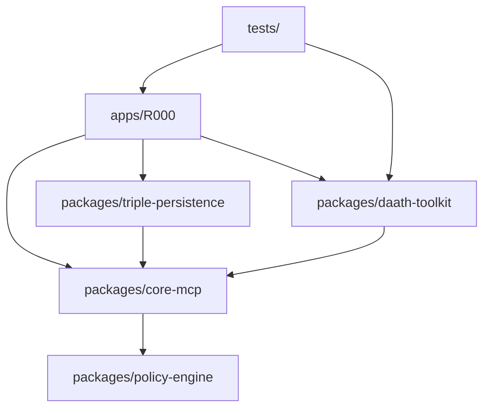

# DAATH-ZEN Template: Structure Document

## Template Structure

This template defines the structure for project organization documentation in the DAATH-ZEN methodology. It explains directory layout, file naming conventions, and module dependencies.

---

## Sections

### 1. Project Structure Overview

```
project-root/
├── 00-define/                         ← Active investigation workspaces
│   ├── 0-define-daath-zen-framework/
│   │   ├── manifest/                  ← Inputs & templates
│   │   └── workbooks/                 ← Active research
│   └── 1-define-spec-workflow-mcp-artefacts/
├── .spec-workflow/                    ← Formal governance
│   ├── specs/                         ← Spec documents
│   │   ├── spec-000-investigation-daath-zen/
│   │   └── spec-001-built-template-spec-workflow/
│   ├── approvals/                     ← Approval requests
│   ├── steering/                      ← Steering documents
│   └── templates/                     ← Governance templates
├── _melquisedec/                      ← Final outputs & domain knowledge
│   ├── domain/
│   │   ├── markdown/                  ← Source of truth
│   │   ├── cypher/                    ← Neo4j ingestion
│   │   └── embeddings/                ← Vector store
│   ├── lessons/                       ← Learning logs
│   └── templates/                     ← Template definitions
├── apps/                              ← Applications
│   └── R000-autopoietic-template/
├── packages/                          ← Shared libraries
│   ├── core-mcp/
│   ├── daath-toolkit/
│   └── triple-persistence/
├── tools/                             ← Utilities & scripts
├── tests/                             ← Test suites
└── docs/                              ← Documentation
```

### 2. Directory Organization

#### 00-define/
**Purpose**: Active investigation workspaces where HYPATIA and SALOMON work.

**Structure**:
- Each investigation has its own folder (e.g., `0-define-daath-zen-framework/`)
- `manifest/`: Inputs (legacy analysis, templates, code analysis)
- `workbooks/`: Active research workbooks (Academic Research + IMRAD)

**Lifecycle**: Created → Populated → Validated → Published to `_melquisedec/domain/`

#### .spec-workflow/
**Purpose**: Formal governance and tracking of specifications.

**Structure**:
- `specs/`: One folder per spec (e.g., `spec-000-investigation-daath-zen/`)
  - `requirements.md`: Functional/non-functional requirements
  - `design.md`: Architecture Decision Records (ADRs)
  - `tasks.md`: Implementation plan
- `approvals/`: Approval request JSONs
- `steering/`: Steering documents (product.md, tech.md, structure.md)

**Lifecycle**: Created → Approved → Implemented → Completed

#### _melquisedec/domain/
**Purpose**: Final consolidated outputs (source of truth).

**Structure**:
- `markdown/`: Published workbook outputs
- `cypher/`: Neo4j ingestion scripts (future)
- `embeddings/`: Vector embeddings (future)

**Lifecycle**: Published by ALMA after validation → Never edited directly

#### packages/
**Purpose**: Reusable Python/TypeScript packages.

**Naming Convention**: `{package-name}/`
- Must have `README.md`, `package.json` or `pyproject.toml`
- Must have `tests/` subfolder

#### tools/
**Purpose**: Standalone scripts for automation.

**Naming Convention**: `{tool-name}.{py|sh}`
- Must have docstring/comment header explaining purpose
- Must be executable (`chmod +x` for bash scripts)

### 3. File Naming Conventions

#### Markdown Files
- **Specs**: `{type}.md` (requirements.md, design.md, tasks.md)
- **Workbooks**: `wb-{methodology}-{topic}/` (wb-academic-research-ddd/)
- **Atomics**: `atomic-{XXX}-{title}.md` (atomic-001-bounded-context.md)
- **Logs**: `CHATLOG-{YYYY-MM-DD}_{HHMMSS}-{topic}.md`

#### Python Files
- **Modules**: `{module_name}.py` (snake_case)
- **Tests**: `test_{module_name}.py`
- **Scripts**: `{action}_{noun}.py` (validate_metadata.py)

#### Configuration Files
- **YAML**: `{purpose}.yaml` or `{purpose}.yaml-ld`
- **JSON**: `{purpose}.json` or `{purpose}.jsonld`

### 4. Module Dependencies



**Dependency Rules**:
- `packages/core-mcp`: No internal dependencies (foundation)
- `packages/daath-toolkit`: Can depend on `core-mcp`
- `apps/`: Can depend on any package
- `tests/`: Mirror package structure for clarity

### 5. Configuration Management

#### Environment Variables
Stored in `.env` (not committed to Git):
```env
NEO4J_URI=bolt://localhost:7687
NEO4J_USER=neo4j
NEO4J_PASSWORD=secret
REDIS_URL=redis://localhost:6379
OLLAMA_API_BASE=http://localhost:11434
```

#### Configuration Files
- `docker-compose.triple-persistence.yml`: Infrastructure setup
- `pyproject.toml`: Python project metadata
- `package.json`: Node.js dependencies
- `.spec-workflow/templates/config.yaml-ld`: Template hierarchy

---

## Usage in Workbooks

### Academic Research Workbook
When researching project structure, atomics should capture:
- Monorepo vs polyrepo patterns
- Directory organization best practices
- Module dependency management (Nx, Lerna)

### IMRAD Workbook
When synthesizing structure knowledge:
- **Introduction**: Project organization importance
- **Literature Review**: Survey of monorepo patterns
- **Methodology**: How structure was designed
- **Results**: Directory layout and naming conventions
- **Discussion**: Rationale for choices (why 00-define/ not src/investigations/)
- **Conclusion**: Structure recommendations
- **References**: Monorepo tools, architecture books

---

## Metadata Requirements

All structure documents MUST include:
- `spec:issue`: Spec ID
- `spec:owner`: Agent responsible (typically MORPHEUS for structure)
- Dublin Core fields
- Directory tree diagrams (ASCII or Mermaid)

---

## References

- [Monorepo Tools](https://monorepo.tools/)
- [The C4 Model for Software Architecture](https://c4model.com/)
- [Clean Architecture](https://blog.cleancoder.com/uncle-bob/2012/08/13/the-clean-architecture.html) - Robert C. Martin

---

**Template Version**: 1.0.0
**Last Updated**: 2026-01-11
**Owner**: MORPHEUS
