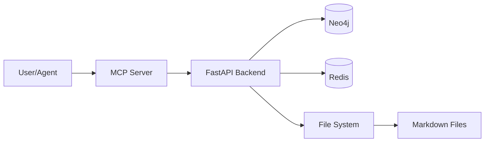

# DAATH-ZEN Template: Tech Document

## Template Structure

This template defines the structure for technical documentation in the DAATH-ZEN methodology. It covers tech stack, development environment, deployment, and operations.

---

## Sections

### 1. Tech Stack

#### Programming Languages
| Language | Version | Purpose |
|----------|---------|---------|
| Python | 3.10+ | Core logic, validators |
| TypeScript | 5.0+ | MCP server, dashboard |
| Bash | N/A | Automation scripts |

#### Frameworks & Libraries
| Framework | Version | Purpose |
|-----------|---------|---------|
| FastAPI | 0.100+ | REST API |
| pytest | 7.0+ | Testing framework |
| Neo4j | 5.15+ | Graph database |

#### Tools & Infrastructure
| Tool | Version | Purpose |
|------|---------|---------|
| Docker | 24.0+ | Containerization |
| Redis | 7.0+ | Caching, queues |
| Ollama | Latest | Embeddings generation |

### 2. Development Environment Setup

#### Prerequisites
- Python 3.10+ installed
- Node.js 18+ installed
- Docker Desktop running
- Git configured

#### Installation Steps
```bash
# Clone repository
git clone https://github.com/ccolombia-ui/aleia-melquisedec.git
cd aleia-melquisedec

# Install Python dependencies
pip install -r requirements.txt

# Install Node dependencies
npm install

# Start infrastructure
docker-compose -f docker-compose.triple-persistence.yml up -d

# Run tests
pytest tests/ -v
```

#### IDE Configuration
- **Recommended IDE**: VS Code
- **Extensions**:
  - Python (ms-python.python)
  - Pylance (ms-python.vscode-pylance)
  - Markdown All in One (yzhang.markdown-all-in-one)
- **Settings**: `.vscode/settings.json` in repo

### 3. Deployment Architecture



#### Deployment Environments
- **Development**: Local Docker Compose
- **Staging**: Docker Swarm (future)
- **Production**: Kubernetes (future)

### 4. CI/CD Pipeline

```yaml
# .github/workflows/ci.yml
name: CI Pipeline
on: [push, pull_request]
jobs:
  test:
    runs-on: ubuntu-latest
    steps:
      - uses: actions/checkout@v3
      - uses: actions/setup-python@v4
        with:
          python-version: '3.10'
      - run: pip install -r requirements.txt
      - run: pytest tests/ -v --cov
      - run: mypy src/ --strict
```

### 5. Monitoring & Observability

#### Logging
- **Format**: Structured JSON logs
- **Levels**: DEBUG, INFO, WARNING, ERROR, CRITICAL
- **Destinations**: stdout (Docker logs), file (production)

#### Metrics
- **Tool**: Prometheus + Grafana (future)
- **Key Metrics**:
  - Request latency (p50, p95, p99)
  - Error rate
  - Workbook validation time
  - Neo4j query performance

#### Tracing
- **Tool**: OpenTelemetry (future)
- **Spans**: MCP request → API call → DB query

### 6. Security & Compliance

#### Authentication & Authorization
- **Current**: No authentication (local use)
- **Future**: OAuth2 + JWT for multi-user

#### Data Security
- **At Rest**: File system permissions (chmod 600 for sensitive files)
- **In Transit**: TLS 1.3 for external APIs (future)

#### Compliance
- **License**: MIT License
- **Data Privacy**: No personal data collected (research data only)

---

## Usage in Workbooks

### Academic Research Workbook
When researching tech stack decisions, atomics should capture:
- Technology selection criteria
- Performance benchmarks
- Security best practices

### IMRAD Workbook
When synthesizing technical knowledge:
- **Introduction**: Tech stack importance
- **Literature Review**: Survey of relevant technologies
- **Methodology**: How technologies were evaluated
- **Results**: Selected tech stack with rationale
- **Discussion**: Trade-offs and alternatives considered
- **Conclusion**: Tech stack recommendations
- **References**: Technology documentation, benchmarks

---

## Metadata Requirements

All tech documents MUST include:
- `spec:issue`: Spec ID
- `spec:owner`: Agent responsible (typically MORPHEUS for tech)
- Dublin Core fields
- Version numbers for all technologies

---

## References

- [The Twelve-Factor App](https://12factor.net/)
- [Docker Best Practices](https://docs.docker.com/develop/dev-best-practices/)
- [Neo4j Operations Manual](https://neo4j.com/docs/operations-manual/)

---

**Template Version**: 1.0.0
**Last Updated**: 2026-01-11
**Owner**: MORPHEUS
