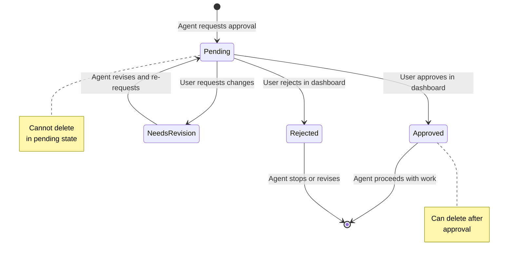
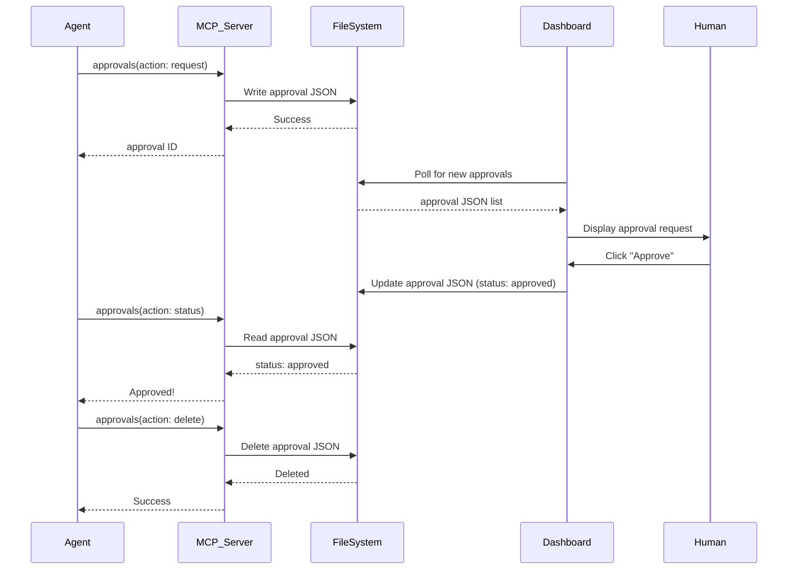

# spec-workflow-mcp: Approval System Flow Analysis

## Overview

This document analyzes the approval system workflow in spec-workflow-mcp, focusing on state transitions, user interactions, and integration with the MCP tool ecosystem.

**Purpose**: Understand governance patterns for SPEC-000 metadata governance workbook (Task-000-007).

---

## Approval System States

### State Diagram



### State Definitions

| State | Description | Allowed Actions |
|-------|-------------|-----------------|
| **pending** | Approval request created, awaiting human review | Check status, update request (not implemented) |
| **approved** | Human approved the request | Delete request, proceed with work |
| **rejected** | Human rejected the request | Delete request, stop work |
| **needs-revision** | Human requested changes | Delete request, revise and re-request |

---

## Approval Request Structure

### JSON Schema

```json
{
  "id": "approval-2026-01-11-125030-001",
  "status": "pending",
  "createdAt": "2026-01-11T12:50:30.000Z",
  "updatedAt": "2026-01-11T12:50:30.000Z",
  "request": {
    "filePath": ".spec-workflow/specs/spec-000-investigation-daath-zen/requirements.md",
    "title": "Approve Requirements Document for SPEC-000",
    "category": "spec",
    "categoryName": "spec-000-investigation-daath-zen",
    "type": "document",
    "projectPath": "/absolute/path/to/project"
  },
  "response": null,
  "reviewer": null
}
```

### Field Descriptions

- **id**: Unique identifier (`approval-{timestamp}-{sequence}`)
- **status**: Current state (see state diagram)
- **createdAt**: ISO 8601 timestamp when request created
- **updatedAt**: ISO 8601 timestamp of last modification
- **request.filePath**: Path to file needing approval (relative to project root)
- **request.title**: Human-readable description of what needs approval
- **request.category**: `spec` (specification) or `steering` (steering document)
- **request.categoryName**: Spec ID or steering document name
- **request.type**: `document` (content approval) or `action` (action approval)
- **response**: User's response text (null until approved/rejected)
- **reviewer**: Who reviewed (null until approved/rejected)

---

## Workflow Steps

### Step 1: Agent Creates Approval Request

**Trigger**: Agent completes a document (requirements.md, design.md, tasks.md)

**Action**:
```typescript
// Agent calls MCP tool
await mcpClient.callTool('approvals', {
  action: 'request',
  filePath: '.spec-workflow/specs/spec-000-investigation-daath-zen/requirements.md',
  title: 'Approve Requirements Document for SPEC-000',
  category: 'spec',
  categoryName: 'spec-000-investigation-daath-zen',
  type: 'document'
});
```

**Server Response**:
- Creates `.spec-workflow/approvals/{id}.json` file
- Returns approval ID to agent
- Dashboard auto-detects new file (polling every 5s)

### Step 2: Dashboard Displays Request

**User Interface**:
```
┌─────────────────────────────────────────────────┐
│ Approval Requests                        [Refresh] │
├─────────────────────────────────────────────────┤
│                                                  │
│ 📄 Approve Requirements Document for SPEC-000    │
│                                                  │
│ Category: spec                                   │
│ Spec: spec-000-investigation-daath-zen           │
│ File: .spec-workflow/specs/.../requirements.md  │
│ Created: 2026-01-11 12:50 PM                     │
│                                                  │
│ [View File] [Approve] [Reject] [Request Changes] │
│                                                  │
└─────────────────────────────────────────────────┘
```

**User Actions**:
1. **View File**: Opens file in default editor (or inline preview)
2. **Approve**: Marks status = `approved`, adds reviewer name
3. **Reject**: Marks status = `rejected`, prompts for reason
4. **Request Changes**: Marks status = `needs-revision`, prompts for feedback

### Step 3: User Reviews and Decides

**Review Checklist** (suggested by dashboard):
- ✅ All sections complete (no `TODO` placeholders)
- ✅ Metadata correct (spec ID, dates, owner)
- ✅ Requirements traceable (REQ-XXX-YY format)
- ✅ Acceptance criteria measurable
- ✅ No grammar/spelling errors

**Decision Outcomes**:
- **Approve**: Agent can proceed to next phase (design, tasks, implementation)
- **Reject**: Agent stops work, escalates to human for clarification
- **Request Changes**: Agent revises document, re-requests approval

### Step 4: Agent Polls for Status

**Polling Strategy**:
```typescript
let status = 'pending';
while (status === 'pending') {
  const result = await mcpClient.callTool('approvals', {
    action: 'status',
    approvalId: 'approval-2026-01-11-125030-001'
  });

  status = result.status;

  if (status === 'pending') {
    await sleep(10000); // Wait 10 seconds
  }
}

if (status === 'approved') {
  // Proceed with next task
  console.log('✅ Approval granted, proceeding...');
} else if (status === 'rejected') {
  // Stop work
  console.log('❌ Approval rejected, stopping...');
} else if (status === 'needs-revision') {
  // Revise and re-request
  console.log('🔄 Changes requested, revising...');
}
```

### Step 5: Cleanup

**After Approval/Rejection**:
```typescript
// Agent deletes approval request to clean up
await mcpClient.callTool('approvals', {
  action: 'delete',
  approvalId: 'approval-2026-01-11-125030-001'
});
```

**Result**:
- `.spec-workflow/approvals/{id}.json` file deleted
- Dashboard removes from pending list
- Agent proceeds with work

---

## Integration with spec-workflow-mcp Tools

### Tool Interactions



### Tool Orchestration

1. **approvals (request)** → Creates approval JSON
2. **Dashboard (polling)** → Detects new request
3. **Human (review)** → Updates approval JSON
4. **approvals (status)** → Agent checks approval result
5. **log-implementation (completed)** → Agent logs task completion
6. **approvals (delete)** → Cleanup approval request

---

## Design Patterns

### Pattern 1: File-Based State Machine
- Each approval request is a JSON file
- State transitions via file updates (atomic writes)
- Dashboard and agent poll file system for changes

**Pros**:
- Simple implementation (no database)
- Human-readable state (can manually inspect JSON)
- Git-friendly (version control approvals)

**Cons**:
- Race conditions (concurrent writes)
- No ACID transactions
- Manual cleanup required

### Pattern 2: Polling vs Push Notifications
- **Current**: Polling (dashboard checks every 5s, agent checks every 10s)
- **Alternative**: WebSockets or Server-Sent Events (SSE) for real-time updates

**Trade-offs**:
- Polling: Simple, no persistent connections, but adds latency
- Push: Real-time, but requires connection management

### Pattern 3: Separation of Request and Response
- Request created by agent (MCP tool call)
- Response added by human (dashboard interaction)
- Separation allows async workflow (agent doesn't block while waiting)

---

## Error Handling

### Error Scenarios

| Scenario | Error Handling |
|----------|----------------|
| **File path invalid** | Server validates path relative to project root, rejects if outside |
| **Approval ID not found** | Server returns error "Approval not found", agent retries or fails |
| **Cannot delete pending** | Server returns error "Cannot delete pending approval", agent must wait |
| **Concurrent writes** | File system race condition, last write wins (no locking) |

### Retry Strategy

```typescript
async function requestApprovalWithRetry(args, maxRetries = 3) {
  for (let i = 0; i < maxRetries; i++) {
    try {
      return await mcpClient.callTool('approvals', args);
    } catch (error) {
      if (i === maxRetries - 1) throw error;
      await sleep(1000 * Math.pow(2, i)); // Exponential backoff
    }
  }
}
```

---

## Metrics & Analytics

### Dashboard Metrics (Future)

| Metric | Description |
|--------|-------------|
| **Average Approval Time** | Time from request to decision |
| **Approval Rate** | % approved vs rejected |
| **Revision Rate** | % needs-revision vs total |
| **Pending Requests** | Current count of pending approvals |

### Agent Metrics

| Metric | Description |
|--------|-------------|
| **Approval Wait Time** | Agent idle time waiting for approval |
| **Approval Success Rate** | % approved on first try |
| **Revision Iterations** | Avg number of revision cycles |

---

## Key Insights for SPEC-000

### Insight 1: Governance Requires Human-in-the-Loop
- Agents create artifacts, humans approve quality
- Approval system enforces quality gates
- Dashboard provides review interface (not just CLI)

**Application to SPEC-000**: HYPATIA/SALOMON should request approval for each workbook after validation passes (Task-000-010).

### Insight 2: State Machines Enable Workflow Tracking
- Clear states (pending → approved/rejected/needs-revision)
- Transitions logged with timestamps
- Audit trail via JSON file history (Git commits)

**Application to SPEC-000**: Metadata governance workbook (Task-000-007) should document state machine patterns.

### Insight 3: File-Based State is Simple but Has Limits
- Works well for single-user, local workflows
- Breaks down with concurrent users (race conditions)
- Future: Database or lock files for multi-user

**Application to SPEC-000**: ADR-005 (Triple Persistence) recognizes this limitation, defers Neo4j automation.

### Insight 4: Polling vs Real-Time Trade-offs
- Polling adds latency but simplifies implementation
- Real-time requires persistent connections (WebSockets, SSE)
- Choose based on responsiveness needs

**Application to SPEC-000**: Validation strategies workbook (Task-000-009) should discuss polling vs push for validation results.

---

## References

- [spec-workflow-mcp Repository](file:///../../../.spec-workflow/)
- [MCP Server Architecture](./mcp-server-architecture.md)
- [State Machine Design Patterns](https://en.wikipedia.org/wiki/State_pattern)
- [JSON-RPC 2.0 Specification](https://www.jsonrpc.org/specification)

---

**Analysis Date**: 2026-01-11
**Analyzer**: MORPHEUS (for SPEC-000 manifest)
**Version**: 1.0.0
