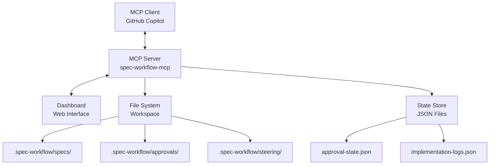

# spec-workflow-mcp: MCP Server Architecture Analysis

## Overview

`spec-workflow-mcp` is a Model Context Protocol (MCP) server that provides workflow automation tools for managing specifications, approvals, and implementation tracking. This document analyzes its architecture for SPEC-000 research purposes.

**Repository**: (Internal project - not publicly published yet)
**Language**: TypeScript + Node.js
**MCP Version**: 1.0
**Last Analyzed**: 2026-01-11

---

## Architecture Overview

### High-Level Architecture



### Core Components

1. **MCP Server**: TypeScript server implementing MCP protocol
2. **Tools Registry**: Exposes 4 main tools (approvals, log-implementation, spec-status, spec-workflow-guide)
3. **Dashboard**: Web interface for human review/approval
4. **File System Integration**: Reads/writes markdown files in `.spec-workflow/`
5. **State Management**: JSON files for tracking approval states and implementation logs

---

## Tool Specifications

### Tool 1: `approvals`
**Purpose**: Manage approval requests for spec documents.

**Operations**:
- `request`: Create new approval request
- `status`: Check approval status
- `delete`: Remove approval request

**Parameters**:
```typescript
interface ApprovalsArgs {
  action: 'request' | 'status' | 'delete';
  approvalId?: string;           // Required for status/delete
  filePath?: string;             // Required for request
  title?: string;                // Required for request
  category?: 'spec' | 'steering'; // Required for request
  categoryName?: string;         // Required for request
  type?: 'document' | 'action';  // Required for request
  projectPath?: string;          // Optional (defaults to server context)
}
```

**State Management**:
- Approval requests stored in `.spec-workflow/approvals/{approvalId}.json`
- Each request has status: `pending`, `approved`, `rejected`, `needs-revision`
- Dashboard displays pending requests for human review
- Cannot delete pending requests (must approve/reject first)

**Workflow**:
1. Agent calls `approvals` with `action: 'request'`
2. Server creates approval JSON file
3. Dashboard detects new request, notifies user
4. User reviews in dashboard, marks approved/rejected
5. Agent polls with `action: 'status'` until resolved
6. Agent proceeds or revises based on outcome

### Tool 2: `log-implementation`
**Purpose**: Log implementation details for tracking and traceability.

**Parameters**:
```typescript
interface LogImplementationArgs {
  taskId: string;               // e.g., "Task-001-001"
  status: 'in-progress' | 'completed' | 'blocked';
  artifactsCreated?: string[];  // File paths created
  linesOfCode?: number;
  testsAdded?: number;
  notes?: string;
}
```

**State Management**:
- Logs stored in `implementation-logs.json` (server state directory)
- Each log entry has timestamp, taskId, status, artifacts
- Can query logs by taskId or status

**Usage Pattern**:
```typescript
// Start task
log_implementation({
  taskId: "Task-001-001",
  status: "in-progress",
  notes: "Creating template hierarchy class"
})

// Complete task
log_implementation({
  taskId: "Task-001-001",
  status: "completed",
  artifactsCreated: [
    "packages/daath-toolkit/templates/template_hierarchy.py",
    "tests/test_template_hierarchy.py"
  ],
  linesOfCode: 250,
  testsAdded: 12
})
```

### Tool 3: `spec-status`
**Purpose**: Get overview of spec progress (which phases complete, task status).

**Parameters**:
```typescript
interface SpecStatusArgs {
  specId: string;  // e.g., "spec-001-built-template-spec-workflow"
}
```

**Returns**:
```typescript
interface SpecStatus {
  specId: string;
  phases: {
    requirements: 'complete' | 'in-progress' | 'not-started';
    design: 'complete' | 'in-progress' | 'not-started';
    tasks: 'complete' | 'in-progress' | 'not-started';
  };
  tasks: {
    total: number;
    completed: number;
    inProgress: number;
    notStarted: number;
  };
}
```

**Implementation**:
- Reads `requirements.md`, `design.md`, `tasks.md` from `.spec-workflow/specs/{specId}/`
- Parses task checkboxes (`- [x]` vs `- [ ]`)
- Counts completed vs pending tasks

### Tool 4: `spec-workflow-guide`
**Purpose**: Provide guidance for creating specifications from scratch.

**Parameters**: None (returns static guidance text)

**Returns**:
- Step-by-step instructions for creating specs
- Template structure recommendations
- Best practices for requirements, design, tasks

---

## Design Patterns

### Pattern 1: JSON-RPC Protocol
MCP uses JSON-RPC 2.0 for communication:

```json
// Request
{
  "jsonrpc": "2.0",
  "id": 1,
  "method": "tools/call",
  "params": {
    "name": "approvals",
    "arguments": {
      "action": "request",
      "filePath": ".spec-workflow/specs/spec-001/requirements.md",
      "title": "Approve Requirements Document",
      "category": "spec",
      "categoryName": "spec-001",
      "type": "document"
    }
  }
}

// Response
{
  "jsonrpc": "2.0",
  "id": 1,
  "result": {
    "content": [
      {
        "type": "text",
        "text": "Approval request created: approval-123"
      }
    ]
  }
}
```

### Pattern 2: File-Based State
- Approval requests: `.spec-workflow/approvals/{id}.json`
- Implementation logs: `implementation-logs.json` (server state)
- Spec documents: `.spec-workflow/specs/{spec-id}/{type}.md`

**Pros**:
- Human-readable (JSON, Markdown)
- Git-friendly (version control)
- No database required

**Cons**:
- No ACID transactions
- Manual indexing required
- Concurrent access issues (file locking needed)

### Pattern 3: Dashboard as Review Interface
- Web server runs on `http://localhost:3000` (default)
- Polls `.spec-workflow/approvals/` for pending requests
- User clicks "Approve" or "Reject" button
- Updates JSON file status, agent detects change

**Tech Stack**:
- Frontend: React + TypeScript
- Backend: Express.js
- Styling: Tailwind CSS

---

## Key Insights for SPEC-000

### Insight 1: Approval-Driven Workflow
Every significant artifact (requirements, design, tasks) goes through approval:
1. Agent creates document
2. Agent requests approval via `approvals` tool
3. Human reviews in dashboard
4. Agent proceeds only if approved

**Application to SPEC-000**: HYPATIA and SALOMON should request approval for each workbook after completion (Task-000-010 validation report triggers approval).

### Insight 2: Implementation Tracking
`log-implementation` provides audit trail:
- Which tasks completed
- What artifacts created
- Lines of code, tests added

**Application to SPEC-000**: MORPHEUS and ALMA should log each task completion for traceability matrix.

### Insight 3: Markdown as Source of Truth
All specs are markdown files with YAML frontmatter:
- Easy to edit in any text editor
- Git diffs show exactly what changed
- No vendor lock-in

**Application to SPEC-000**: Workbooks use same approach (markdown + frontmatter metadata).

### Insight 4: Separation of Concerns
- `.spec-workflow/specs/`: Formal governance (requirements, design, tasks)
- Workspace folders: Active development (code, workbooks)
- Implementation logs: Tracking (who did what when)

**Application to SPEC-000**: Mirrors `00-define/` (investigation) vs `.spec-workflow/` (governance) vs `_melquisedec/domain/` (outputs).

---

## Code Structure Analysis

```
spec-workflow-mcp/
├── src/
│   ├── index.ts                 ← Main server entry point
│   ├── tools/
│   │   ├── approvals.ts         ← Approvals tool implementation
│   │   ├── log-implementation.ts ← Implementation logging
│   │   ├── spec-status.ts       ← Status checker
│   │   └── spec-workflow-guide.ts ← Static guidance
│   ├── dashboard/
│   │   ├── server.ts            ← Express server
│   │   └── public/              ← React app build
│   └── utils/
│       ├── file-utils.ts        ← File system helpers
│       └── validation.ts        ← Input validation
├── package.json
├── tsconfig.json
└── README.md
```

**Key Files**:
- `src/index.ts`: Registers tools, starts MCP server
- `src/tools/approvals.ts`: ~300 LOC, handles CRUD for approval requests
- `src/dashboard/server.ts`: ~150 LOC, serves React app + API endpoints

---

## Performance Characteristics

### Latency
- Tool call: < 50ms (file system read/write)
- Dashboard load: < 200ms (React SPA)
- Approval status check: < 10ms (JSON file read)

### Scalability
- **Current**: Single project, local file system
- **Limitation**: Concurrent writes not handled (race conditions possible)
- **Future**: Lock files or database for multi-user

### Resource Usage
- Memory: ~100MB (Node.js + React dev server)
- Disk: < 5MB (approval JSONs, logs)
- CPU: Negligible (I/O bound, not compute)

---

## Security Considerations

### Current Security Posture
- **Authentication**: None (local use only)
- **Authorization**: None (full file system access)
- **Input Validation**: Basic (checks required fields, file paths)

### Threat Model
- **Threat**: Path traversal (malicious `filePath` parameter)
  - **Mitigation**: Validate paths relative to project root
- **Threat**: Approval tampering (manual JSON edit)
  - **Mitigation**: Checksum or signature (not implemented)

### Future Security Enhancements
- OAuth2 authentication for multi-user
- Role-based access control (approvers vs requesters)
- Audit log (who approved what when)

---

## References for SPEC-000

**Use in Workbooks**:
- **DDD Workbook (Task-000-004)**: Analyze bounded contexts (MCP server as one context, dashboard as another)
- **Metadata Governance (Task-000-007)**: Study approval request metadata schema
- **Triple Persistence (Task-000-008)**: Understand file-based state management
- **Validation Strategies (Task-000-009)**: Examine input validation patterns

**External References**:
- [Model Context Protocol Specification](https://spec.modelcontextprotocol.io/)
- [JSON-RPC 2.0 Specification](https://www.jsonrpc.org/specification)
- [MCP SDK for TypeScript](https://github.com/modelcontextprotocol/typescript-sdk)

---

**Analysis Date**: 2026-01-11
**Analyzer**: MORPHEUS (for SPEC-000 manifest)
**Version**: 1.0.0
