# 📊 DIAGRAMAS DE WORKFLOWS spec-workflow-mcp
## Visualización Completa de Procesos y Estructuras

> **Versión:** 1.0.0
> **Fecha:** 2026-01-09
> **Propósito:** Diagramas Mermaid v8.8.0 para entender workflows y estructuras YAML
> **Complemento de:** INDICE-COMPLETO-ARTEFACTOS.md v3.0.0

---

## 📋 CONTENIDO

1. [Diagramas de Workflows](#diagramas-de-workflows)
   - Main Spec Workflow (CON approval)
   - Sub-Issue Workflow (SIN approval)
   - IMPL Workflow (CON logging)
   - Steering Workflow (OPTIONAL)

2. [Diagramas de Estructuras YAML](#diagramas-de-estructuras-yaml)
   - ISSUE.yaml Structure
   - spec-config.yaml Structure
   - Pattern YAML Structure
   - Lens YAML Structure

3. [Diagramas de Estados](#diagramas-de-estados)
   - Ciclo de vida de un Issue
   - Approval Workflow States
   - Implementation Logging States

4. [Diagramas de Arquitectura](#diagramas-de-arquitectura)
   - Directorio .spec-workflow/
   - Triple Persistence Architecture
   - Autopoietic Cycle

---

## 🔄 DIAGRAMAS DE WORKFLOWS

### 1. Main Spec Workflow (CON approval) - Secuencia Completa

```mermaid
sequenceDiagram
    actor Dev as Developer
    participant AI as AI Agent
    participant MCP as spec-workflow MCP
    participant Dashboard as Approval Dashboard

    Note over Dev,Dashboard: FASE 1: Requirements

    Dev->>AI: Iniciar Main Spec
    AI->>MCP: mcp_spec-workflow2_spec-workflow-guide()
    MCP-->>AI: Workflow completo (4 fases)

    AI->>AI: create_file requirements.md (2,450 líneas)

    AI->>MCP: approvals(action: request, filePath: requirements.md)
    MCP-->>AI: approvalId: "req-2026-01-09-001"
    MCP->>Dashboard: Crear approval request
    Dashboard-->>MCP: ✅ Request creado

    loop Poll hasta approved
        AI->>MCP: approvals(action: status, approvalId)
        MCP->>Dashboard: Verificar status
        Dashboard-->>MCP: status: "pending"
        MCP-->>AI: status: "pending"
        Note over AI: Sleep 60s
    end

    Dev->>Dashboard: Review requirements.md
    Dashboard->>Dev: Mostrar documento
    Dev->>Dashboard: Aprobar ✅
    Dashboard-->>MCP: status: "approved"

    AI->>MCP: approvals(action: status, approvalId)
    MCP->>Dashboard: Verificar status
    Dashboard-->>MCP: status: "approved"
    MCP-->>AI: status: "approved" ✅

    AI->>MCP: approvals(action: delete, approvalId)
    MCP->>Dashboard: Eliminar approval
    Dashboard-->>MCP: ✅ Deleted
    MCP-->>AI: ✅ Approval cleaned

    Note over Dev,Dashboard: FASE 2: Design (repetir proceso)
    Note over Dev,Dashboard: FASE 3: Tasks (automático, sin approval)
    Note over Dev,Dashboard: FASE 4: Implementation (con logging)
```

---

### 2. Sub-Issue Workflow (SIN approval) - Proceso Rápido

```mermaid
sequenceDiagram
    actor Dev as Developer
    participant AI as AI Agent
    participant FS as File System
    participant Index as requirements.md

    Note over Dev,Index: Workflow: 20-35 minutos (sin approval)

    Dev->>AI: Crear REQ-001

    AI->>FS: create_file .spec-workflow/specs/REQ-001/ISSUE.yaml
    Note right of FS: Gap/Goal/Outcomes<br/>Dependencies<br/>Status: draft
    FS-->>AI: ✅ ISSUE.yaml creado

    AI->>FS: create_file 010-define/workbooks/REQ-001.md
    Note right of FS: 180 líneas<br/>Detalle completo<br/>del requerimiento
    FS-->>AI: ✅ Workbook creado

    AI->>Index: read requirements.md
    Index-->>AI: Contenido actual

    AI->>Index: replace_string_in_file
    Note right of Index: Agregar línea:<br/>[[REQ-001]] ⏳ En progreso
    Index-->>AI: ✅ Índice actualizado

    AI-->>Dev: ✅ REQ-001 completado (30 min)

    Note over Dev,Index: ❌ NO requiere approval<br/>❌ NO requiere logging
```

---

### 3. IMPL Workflow (CON logging MANDATORY) - Con Tracking

```mermaid
sequenceDiagram
    actor Dev as Developer
    participant AI as AI Agent
    participant FS as File System
    participant MCP as spec-workflow MCP
    participant Logs as Implementation Logs

    Note over Dev,Logs: Workflow: 5 horas (código + spec + logging)

    Dev->>AI: Implementar IMPL-001-init-spec-py

    AI->>FS: create_file IMPL-001/ISSUE.yaml
    Note right of FS: algorithm<br/>inputs/outputs<br/>test coverage
    FS-->>AI: ✅ ISSUE.yaml creado

    AI->>FS: create_file specifications/IMPL-001.md
    Note right of FS: 180 líneas spec
    FS-->>AI: ✅ Spec creado

    AI->>FS: create_file scripts/init/init-spec.py
    Note right of FS: 680 líneas código<br/>8 pasos, 4.2s
    FS-->>AI: ✅ Script implementado

    rect rgb(255, 0, 0, 0.1)
        Note over AI,Logs: ⚠️ CRITICAL: MANDATORY LOGGING
        AI->>MCP: log-implementation(artifacts, summary)
        MCP->>Logs: Crear log entry
        Note right of Logs: YYYY-MM-DD-HH-MM-SS.md<br/>- artifacts: [init-spec.py]<br/>- summary: "Script..."<br/>- filesModified: []<br/>- filesCreated: [init-spec.py]<br/>- statistics: {linesAdded: 680}
        Logs-->>MCP: ✅ Log creado
        MCP-->>AI: ✅ Implementation logged
    end

    AI-->>Dev: ✅ IMPL-001 completado con logging

    Note over Dev,Logs: ❌ NO requiere approval<br/>✅ SÍ requiere logging (MANDATORY)
```

---

### 4. Steering Workflow (OPTIONAL) - Proyectos Grandes

```mermaid
sequenceDiagram
    actor PM as Project Manager
    participant AI as AI Agent
    participant MCP as spec-workflow MCP
    participant Dashboard as Approval Dashboard

    Note over PM,Dashboard: Solo para proyectos >10 personas

    PM->>AI: Crear steering docs
    AI->>MCP: mcp_spec-workflow2_steering-guide()
    MCP-->>AI: Steering workflow (3 docs)

    rect rgb(144, 238, 144, 0.1)
        Note over PM,Dashboard: 1️⃣ product.md (2-3 días)

        AI->>AI: create_file steering/product.md
        AI->>MCP: approvals(action: request, filePath: product.md)
        MCP-->>AI: approvalId

        loop Poll
            AI->>MCP: approvals(action: status, approvalId)
            MCP-->>AI: status: "pending"
        end

        PM->>Dashboard: Aprobar product.md ✅
        Dashboard-->>MCP: status: "approved"

        AI->>MCP: approvals(action: delete, approvalId)
        MCP-->>AI: ✅ Cleaned
    end

    rect rgb(135, 206, 235, 0.1)
        Note over PM,Dashboard: 2️⃣ tech.md (2-3 días)
        Note over PM,Dashboard: Repetir proceso approval
    end

    rect rgb(255, 160, 122, 0.1)
        Note over PM,Dashboard: 3️⃣ structure.md (1-2 días)
        Note over PM,Dashboard: Repetir proceso approval
    end

    AI-->>PM: ✅ Steering Docs completados (1 semana)
```

---

## 📄 DIAGRAMAS DE ESTRUCTURAS YAML

### 1. ISSUE.yaml Structure - Diagrama de Clases

```mermaid
classDiagram
    class ISSUEyaml {
        +String id
        +String type
        +String category
        +String priority
        +String status
        +Problem problem
        +Dependencies dependencies
        +Boolean tasks_generated
        +String workbook
    }

    class Problem {
        +String gap
        +String goal
        +List~String~ outcomes
    }

    class Dependencies {
        +List~String~ concepts
        +List~String~ literature
        +List~String~ designs
        +List~String~ requirements
    }

    class TypeEnum {
        <<enumeration>>
        requirement
        concept
        literature
        design
        implementation
    }

    class CategoryEnum {
        <<enumeration>>
        functional
        non-functional
        foundational
        praxis-rbm
        methodology
        architecture
        script
        template
        pattern
        lens
    }

    class PriorityEnum {
        <<enumeration>>
        high
        medium
        low
    }

    class StatusEnum {
        <<enumeration>>
        draft
        in-progress
        review
        completed
        blocked
    }

    ISSUEyaml --> Problem
    ISSUEyaml --> Dependencies
    ISSUEyaml --> TypeEnum
    ISSUEyaml --> CategoryEnum
    ISSUEyaml --> PriorityEnum
    ISSUEyaml --> StatusEnum

    note for ISSUEyaml "Ubicación:\n.spec-workflow/specs/TYPE-XXX/ISSUE.yaml"
    note for Problem "RBM-GAC Model:\nGap → Goal → Outcomes"
    note for Dependencies "Links bidireccionales con\notros issues"
```

---

### 2. Pattern YAML Structure

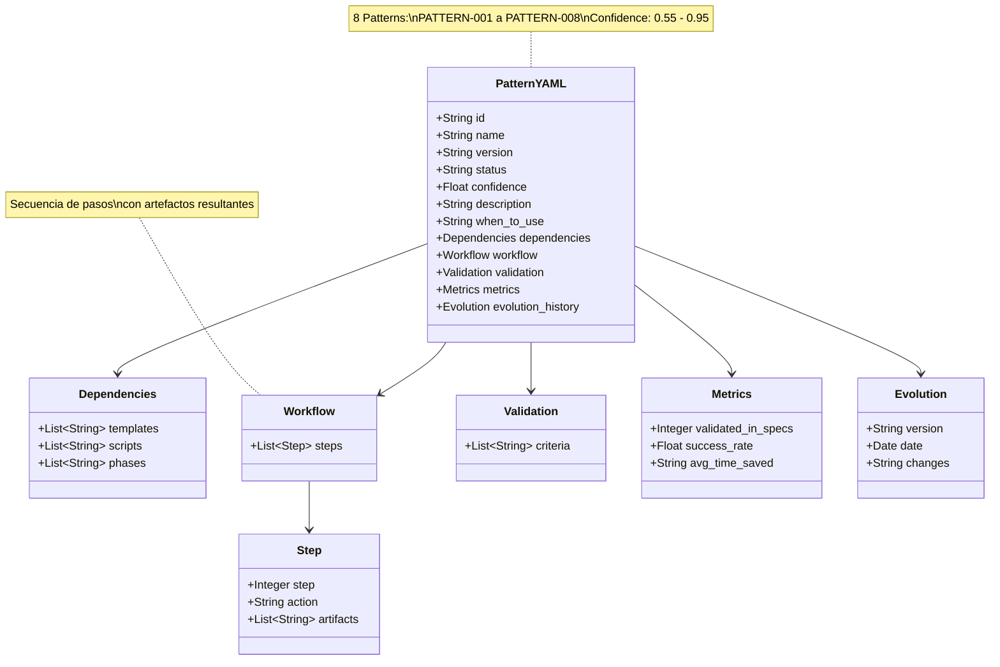

---

### 3. Lens YAML Structure

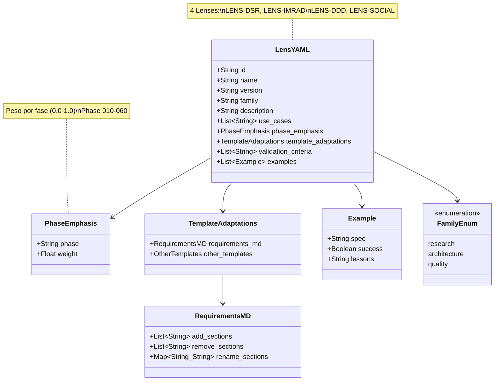

---

## 🔄 DIAGRAMAS DE ESTADOS

### 1. Ciclo de Vida de un Issue

```mermaid
stateDiagram-v2
    [*] --> draft

    draft --> in_progress : Start working
    draft --> blocked : Dependencies missing

    in_progress --> review : Complete workbook
    in_progress --> blocked : Blocker found
    in_progress --> draft : Revise scope

    blocked --> in_progress : Blocker resolved
    blocked --> draft : Redesign needed

    review --> completed : Review approved
    review --> in_progress : Changes requested

    completed --> [*]

    note right of draft
        ISSUE.yaml creado
        Workbook vacío
        Status: "draft"
    end note

    note right of in_progress
        Workbook en desarrollo
        Status: "in-progress"
        AI escribiendo contenido
    end note

    note right of review
        Workbook completo
        Status: "review"
        Esperando feedback usuario
    end note

    note right of completed
        Workbook aprobado
        Index actualizado
        Status: "completed"
        Git commit realizado
    end note

    note right of blocked
        Dependencias sin resolver
        Status: "blocked"
        Esperando REQ/CONCEPT/LIT
    end note
```

---

### 2. Approval Workflow States (Main Spec)

```mermaid
stateDiagram-v2
    [*] --> pending_approval

    pending_approval --> polling : AI polls status

    polling --> approved : User approves ✅
    polling --> rejected : User rejects ❌
    polling --> needs_revision : User requests changes 🔄
    polling --> pending_approval : Still pending

    approved --> cleaning : AI calls delete

    cleaning --> cleaned : Delete successful ✅
    cleaning --> error : Delete failed ❌

    cleaned --> [*]

    rejected --> [*] : Workflow terminado

    needs_revision --> fixing : AI makes changes
    fixing --> pending_approval : Request approval again

    error --> retry : Retry delete
    retry --> cleaning

    note right of pending_approval
        approval(action: request)
        Returns: approvalId
        Dashboard muestra doc
    end note

    note right of polling
        Loop cada 60s:
        approval(action: status)
        Check approvalId
    end note

    note right of approved
        User clicked Approve
        Dashboard notifica MCP
        Status: "approved"
    end note

    note right of cleaning
        approval(action: delete)
        BLOCKING operation
        MUST succeed
    end note

    note right of needs_revision
        User clicked Needs Changes
        AI must fix issues
        Re-request approval
    end note
```

---

### 3. Implementation Logging States

```mermaid
stateDiagram-v2
    [*] --> planning

    planning --> coding : Start implementation

    coding --> testing : Code complete

    testing --> documenting : Tests pass ✅
    testing --> coding : Tests fail ❌

    documenting --> logging : Spec written

    logging --> logged : log-implementation() success ✅
    logging --> error : log-implementation() failed ❌

    logged --> indexed : Update implementation-index

    indexed --> [*]

    error --> retry : Fix and retry
    retry --> logging

    note right of planning
        IMPL-XXX/ISSUE.yaml
        algorithm defined
        inputs/outputs clear
    end note

    note right of coding
        Writing actual code
        scripts/ or templates/
        or patterns/ or lenses/
    end note

    note right of logging
        ⚠️ CRITICAL STEP
        mcp_spec-workflow2_log-implementation(
          artifacts: [files],
          summary: "..."
        )
        Creates log in Implementation Logs/
    end note

    note right of logged
        Log entry created:
        YYYY-MM-DD-HH-MM-SS.md
        - artifacts listed
        - summary documented
        - statistics recorded
    end note
```

---

## 🏗️ DIAGRAMAS DE ARQUITECTURA

### 1. Directorio .spec-workflow/ - Estructura Completa

```mermaid
graph TD
    Root[.spec-workflow/] --> Templates[templates/]
    Root --> UserTemplates[user-templates/]
    Root --> Steering[steering/]
    Root --> Specs[specs/]

    Templates --> T1[requirements.md]
    Templates --> T2[ADR.md]
    Templates --> T3[paper.md]
    Templates --> Tdots[... 25 more]

    UserTemplates --> U1[requirements.md]
    UserTemplates --> U2[custom templates]

    Steering --> S1[product.md]
    Steering --> S2[tech.md]
    Steering --> S3[structure.md]

    Specs --> MainSpec[autopoietic-templates/]
    Specs --> REQ[REQ-001-template-system/]
    Specs --> CONCEPT[CONCEPT-001-autopoiesis/]
    Specs --> LIT[LIT-001-hevner-dsr/]
    Specs --> DESIGN[DESIGN-001-triple-persistence/]
    Specs --> IMPL[IMPL-001-init-spec-py/]

    MainSpec --> MS1[ISSUE.yaml]
    MainSpec --> MS2[requirements.md]
    MainSpec --> MS3[design.md]
    MainSpec --> MS4[tasks.md]
    MainSpec --> MS5[Implementation Logs/]

    REQ --> R1[ISSUE.yaml]
    REQ --> R2[spec-config.yaml]

    CONCEPT --> C1[ISSUE.yaml]

    LIT --> L1[ISSUE.yaml]

    DESIGN --> D1[ISSUE.yaml]

    IMPL --> I1[ISSUE.yaml]

    style Root fill:#90EE90
    style Templates fill:#FFD700
    style UserTemplates fill:#87CEEB
    style Steering fill:#FFA07A
    style Specs fill:#FFB6C1
    style MainSpec fill:#98FB98
    style MS5 fill:#FF6B6B
```

---

### 2. Triple Persistence Architecture

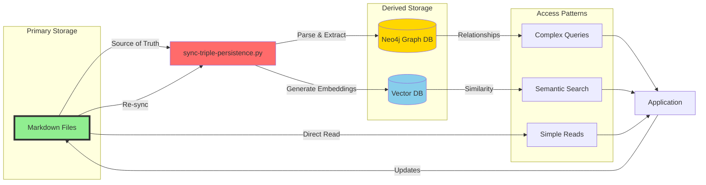

---

### 3. Autopoietic Cycle - Feedback Loop

```mermaid
graph TD
    subgraph "1️⃣ Template Usage"
        A[Developer uses template] --> B[Create spec from template]
        B --> C[Fill in sections]
    end

    subgraph "2️⃣ Feedback Collection"
        C --> D[Complete spec]
        D --> E[Collect feedback]
        E --> F{Feedback type?}
        F -->|Section missing| G[Section gap detected]
        F -->|Section confusing| H[Clarity issue detected]
        F -->|Section redundant| I[Redundancy detected]
    end

    subgraph "3️⃣ Analysis"
        G --> J[autopoiesis-analyze.py]
        H --> J
        I --> J
        J --> K[Calculate confidence score]
        K --> L{Score < threshold?}
    end

    subgraph "4️⃣ Template Evolution"
        L -->|Yes| M[Propose template change]
        L -->|No| N[Template OK]
        M --> O[Create IMPL-XXX for change]
        O --> P[Implement new version]
        P --> Q[Update template v1.1]
    end

    subgraph "5️⃣ Validation"
        Q --> R[Test new template]
        R --> S{Validation OK?}
        S -->|Yes| T[Publish template v1.1]
        S -->|No| M
    end

    T --> A
    N --> A

    style J fill:#FF6B6B
    style K fill:#FFD700
    style Q fill:#90EE90
```

---

## 🎯 DIAGRAMA MAESTRO: Todos los Workflows

```mermaid
graph TB
    Start([¿Qué crear?]) --> Decision{Tipo}

    Decision -->|Main Spec| MS[Main Spec Workflow]
    Decision -->|Steering| ST[Steering Workflow]
    Decision -->|REQ/CONCEPT/LIT| SI[Sub-Issue Workflow]
    Decision -->|DESIGN| SI
    Decision -->|IMPL| IMPL[IMPL Workflow]

    MS --> MS1[1. Load spec-workflow-guide]
    MS1 --> MS2[2. Create requirements.md]
    MS2 --> MS3[3. Request approval]
    MS3 --> MS4[4. Poll status]
    MS4 --> MS5[5. Delete approval]
    MS5 --> MS6[6. Repeat for design/tasks]
    MS6 --> MS7[7. Implementation with logging]
    MS7 --> End1([✅ Main Spec Complete<br/>8 semanas])

    ST --> ST1[1. Load steering-guide]
    ST1 --> ST2[2. Create product.md]
    ST2 --> ST3[3. Request approval]
    ST3 --> ST4[4. Repeat for tech/structure]
    ST4 --> End2([✅ Steering Complete<br/>1 semana])

    SI --> SI1[1. create_file ISSUE.yaml]
    SI1 --> SI2[2. create_file workbook]
    SI2 --> SI3[3. Update index]
    SI3 --> End3([✅ Sub-Issue Complete<br/>20-35 min])

    IMPL --> IMPL1[1. create_file ISSUE.yaml]
    IMPL1 --> IMPL2[2. create_file spec.md]
    IMPL2 --> IMPL3[3. Implement code]
    IMPL3 --> IMPL4[4. log-implementation]
    IMPL4 --> IMPL5[5. Update index]
    IMPL5 --> End4([✅ IMPL Complete<br/>5 horas])

    style MS fill:#90EE90
    style ST fill:#87CEEB
    style SI fill:#FFA07A
    style IMPL fill:#FF6B6B
    style MS3 fill:#FFD700
    style MS4 fill:#FFD700
    style MS5 fill:#FFD700
    style ST3 fill:#FFD700
    style IMPL4 fill:#FF6B6B,stroke:#FF0000,stroke-width:4px
```

---

## 📊 DIAGRAMA: Timing Comparison

```mermaid
gantt
    title Comparación de Timings por Workflow
    dateFormat HH:mm
    axisFormat %H:%M

    section Sub-Issues
    REQ-XXX (30 min)           :a1, 00:00, 30m
    CONCEPT-XXX (30 min)       :a2, 00:00, 30m
    LIT-XXX (1-2 h)            :a3, 00:00, 120m

    section Designs
    DESIGN-XXX (3-4 h)         :b1, 00:00, 240m

    section Implementations
    IMPL-XXX (5 h)             :c1, 00:00, 300m

    section Main Workflows
    Main Spec Phase (1-2 sem)  :d1, 00:00, 14d
    Steering Docs (1 sem)      :e1, 00:00, 7d
```

---

**Versión:** 1.0.0
**Última actualización:** 2026-01-09
**Mantenido por:** MELQUISEDEC (Rostro Orquestador)
**Mermaid Version:** v8.8.0
**Compatibilidad:** INDICE-COMPLETO-ARTEFACTOS.md v3.0.0
