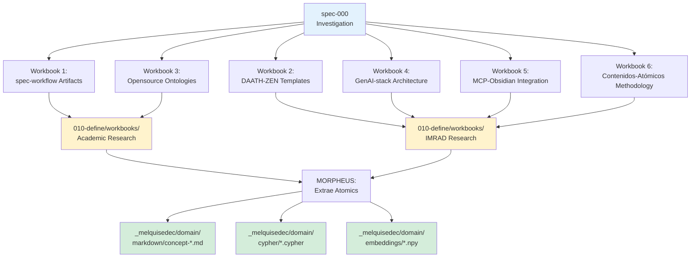

# Product Specification: spec-000 Investigation

## 1. Vision

Establecer **dominio de conocimiento vivo** que fundamente todo el proyecto MELQUISEDEC mediante investigación sistemática de:

1. **Templates DAATH-ZEN** (6 versiones existentes)
2. **Artefactos spec-workflow-mcp** (dashboard expectations)
3. **Frameworks opensource** (ontologías, grafos, embeddings)

Este dominio será **autopoiético**: cada spec posterior lo enriquecerá incrementalmente.

---

## 2. Problem Statement

### 2.1 Situación Actual

**Problema 1: Templates Inconsistentes**
- Existen 6 versiones de templates DAATH-ZEN (14-228 líneas)
- No hay criterio claro de cuándo usar cada uno
- Duplicación de estructura + metadata

**Problema 2: Artefactos Sin Spec**
- Dashboard spec-workflow-mcp espera artefactos específicos (product.md, tech.md, structure.md)
- No hay documentación formal de estructura esperada
- RBM conceptual no mapea claramente a artefactos

**Problema 3: Knowledge Base Vacío**
- `_melquisedec/domain/` existe pero está vacío
- No hay ontologías, conceptos atómicos, ni grafos de conocimiento
- Imposible fundamentar decisiones arquitectónicas

---

### 2.2 Impacto del Problema

**Para spec-001** (Implementation):
- No sabe qué template usar
- No sabe qué estructura de artefactos crear
- No tiene conocimiento previo consolidado

**Para comunidad**:
- Imposible replicar metodología
- Decisiones parecen arbitrarias (no fundamentadas)
- Knowledge silos (no compartible)

---

## 3. Proposed Solution

### 3.1 Investigación Bidireccional



---

### 3.2 Dos Tipos de Workbooks

#### Academic Research (Exploración)
Para **descubrir dominio desconocido**:

**Estructura**:
```
010-define/workbooks/academic-research/
└── spec-workflow-artifacts-investigation/
    ├── 1-literature/           # HYPATIA busca fuentes
    ├── 2-analysis/             # SALOMON analiza
    ├── 3-atomics/              # MORPHEUS genera atomics
    ├── 4-artifacts/            # MORPHEUS crea tests
    └── 6-outputs/              # ALMA publica
```

**Ejemplos**: Workbook 1 (spec-workflow), Workbook 3 (ontologies)

---

#### IMRAD Research (Análisis)
Para **analizar pregunta específica**:

**Estructura**:
```
010-define/workbooks/imrad-research/
└── daath-zen-templates-analysis/
    ├── 01-introduction.md
    ├── 02-methods.md
    ├── 03-results.md
    ├── 04-analysis.md
    ├── 05-discussion.md
    ├── 06-conclusion.md
    └── 07-references.md
```

**Ejemplos**: Workbook 2 (templates), Workbook 4-6 (diseños)

---

### 3.3 Flujo de Conocimiento

```
┌─────────────────────────────────────────────────────────────┐
│ FASE 1: INVESTIGACIÓN (spec-000)                            │
├─────────────────────────────────────────────────────────────┤
│ 1. HYPATIA + SALOMON crean workbooks en:                    │
│    .spec-workflow/specs/spec-000/010-define/workbooks/      │
│                                                              │
│ 2. MORPHEUS extrae contenidos-atómicos de workbooks:        │
│    - concept-product-md.md                                   │
│    - concept-tech-md.md                                      │
│    - template-base-design.md                                 │
│    [31 contenidos-atómicos total]                            │
│                                                              │
│ 3. MORPHEUS genera artifacts:                                │
│    - test-product-compiler.py                                │
│    - schema-product-md.json                                  │
│    - cypher-pattern-*.cypher                                 │
│                                                              │
│ 4. ALMA publica a domain/:                                   │
│    _melquisedec/domain/markdown/concept-*.md                 │
│    _melquisedec/domain/cypher/*.cypher                       │
│    _melquisedec/domain/embeddings/*.npy                      │
│    _melquisedec/domain/ontologies/*.ttl                      │
└─────────────────────────────────────────────────────────────┘

┌─────────────────────────────────────────────────────────────┐
│ FASE 2: IMPLEMENTACIÓN (spec-001+)                          │
├─────────────────────────────────────────────────────────────┤
│ 1. spec-001 LEE contenidos-atómicos de _melquisedec/domain/ │
│                                                              │
│ 2. spec-001 IMPLEMENTA basado en fundamentos de spec-000    │
│                                                              │
│ 3. spec-001 DESCUBRE nuevos conocimientos durante impl      │
│                                                              │
│ 4. spec-001 crea PULL REQUEST a spec-000 workbooks          │
│    sugiriendo actualizaciones (amendments)                   │
│                                                              │
│ 5. MORPHEUS (spec-000) REVISA y APRUEBA/RECHAZA PR          │
│                                                              │
│ 6. Si aprobado: ALMA actualiza _melquisedec/domain/         │
└─────────────────────────────────────────────────────────────┘
```

---

## 4. Success Criteria

### 4.1 Outputs Esperados

**Workbooks** (6 total):
- [ ] 2 Academic Research workbooks (exploración)
- [ ] 4 IMRAD workbooks (análisis)
- [ ] 31 contenidos-atómicos generados por MORPHEUS

**Knowledge Base**:
- [ ] ≥31 archivos en `_melquisedec/domain/markdown/concept-*.md`
- [ ] ≥10 Cypher patterns en `_melquisedec/domain/cypher/`
- [ ] Embeddings generados para todos los atomics
- [ ] Ontología OWL en `_melquisedec/domain/ontologies/`

**Triple Persistence**:
- [ ] Neo4j local con ≥100 nodos de conocimiento
- [ ] Vector index HNSW con ≥31 embeddings (768-dim)
- [ ] Sync pipeline automatizado (`sync-all.sh`)

**Validación**:
- [ ] `validate-imrad-structure.py` pasa (100% workbooks válidos)
- [ ] `validate-triple-persistence.py` pasa (sincronización completa)
- [ ] `validate-metadata.py` pasa (Dublin Core + spec:issue en todos)

---

### 4.2 Metrics

| Métrica | Target | Medición |
|---------|--------|----------|
| **Workbooks completados** | 6 | Count de folders con 7 secciones IMRAD o 5 folders academic |
| **Contenidos-atómicos** | ≥31 | Count de `_melquisedec/domain/markdown/concept-*.md` |
| **Cobertura metadata** | 100% | % archivos con `spec:issue` y Dublin Core completo |
| **Triple persistence** | 100% | % workbooks sincronizados a Neo4j + embeddings |
| **Pull requests procesados** | 0 (inicial) | Count de PRs en `pull-requests/approved/` |

---

## 5. User Stories

### US-000-01: Como HYPATIA, necesito investigar artefactos spec-workflow-mcp
**Given**: Dashboard code está disponible
**When**: Analizo implementation-log-manager.ts y server.ts
**Then**: Documento en `1-literature/framework/spec-workflow-mcp/`

**Acceptance Criteria**:
- [ ] ≥15 fuentes catalogadas (PRISMA flow)
- [ ] Metadata Dublin Core completa
- [ ] content.md ≥1000 palabras

---

### US-000-02: Como SALOMON, necesito analizar 6 templates DAATH-ZEN
**Given**: 6 templates disponibles (14-228 líneas)
**When**: Realizo análisis comparativo con IMRAD
**Then**: Identifico estructura unificada óptima

**Acceptance Criteria**:
- [ ] 7 secciones IMRAD completas (01-07)
- [ ] Tabla comparativa en 03-results.md
- [ ] Decisión fundamentada en 06-conclusion.md

---

### US-000-03: Como MORPHEUS, necesito generar contenidos-atómicos
**Given**: Workbooks IMRAD + Academic Research completos
**When**: Extrae conceptos clave de `2-analysis/` y `05-discussion/`
**Then**: Crea archivos en `_melquisedec/domain/markdown/`

**Acceptance Criteria**:
- [ ] ≥31 atomics generados
- [ ] Cada atomic con metadata completa
- [ ] Atomics linkean entre sí con [[wikilinks]]

---

### US-000-04: Como ALMA, necesito publicar a triple persistence
**Given**: Contenidos-atómicos en `_melquisedec/domain/markdown/`
**When**: Ejecuto `sync-all.sh`
**Then**: Neo4j + embeddings actualizados

**Acceptance Criteria**:
- [ ] Neo4j contiene ≥100 nodos
- [ ] Vector index con ≥31 embeddings
- [ ] `validate-triple-persistence.py` pasa

---

## 6. Out of Scope

❌ **NO incluye**:
- Implementación de templates (eso es spec-001)
- Dashboard spec-workflow-mcp actualizado (eso es spec-002+)
- Cloud deployment de triple persistence (local-first)
- Validación empírica con proyectos reales (eso es spec-001 testing)

---

## 7. Dependencies

### 7.1 Prerequisitos

- [x] Keter-Doc Protocol v1.0.0 (existe)
- [x] 6 templates DAATH-ZEN (existen)
- [x] Dashboard spec-workflow-mcp (código disponible)
- [ ] Docker Desktop (Neo4j + Ollama)
- [ ] Python 3.11+ (herramientas sync)
- [ ] Obsidian (visualización opcional)

---

### 7.2 Herramientas a Desarrollar

| Tool | Propósito | Responsable |
|------|-----------|-------------|
| `metadata-extractor.py` | Extraer YAML frontmatter | MORPHEUS |
| `cypher-generator.py` | Convertir metadata a Cypher | MORPHEUS |
| `neo4j-loader.py` | Ejecutar Cypher en Neo4j | ALMA |
| `embedding-generator.py` | Generar embeddings Ollama | ALMA |
| `sync-all.sh` | Orchestrator pipeline | ALMA |
| `validate-imrad-structure.py` | Validar workbooks | SALOMON |
| `validate-triple-persistence.py` | Validar sincronización | ALMA |
| `validate-metadata.py` | Validar Dublin Core | HYPATIA |

---

## 8. Risks & Mitigation

| Riesgo | Probabilidad | Impacto | Mitigación |
|--------|--------------|---------|------------|
| **Workbooks demasiado largos** | Alta | Medio | Limitar a 500 palabras por sección IMRAD |
| **Triple persistence falla** | Media | Alto | Tests unitarios para cada tool |
| **Metadata inconsistente** | Media | Alto | `validate-metadata.py` en CI |
| **Scope creep** | Alta | Alto | Strict adherence a 6 workbooks, no más |

---

## 9. Timeline

**Duración**: 18 días (3.5 semanas)

| Fase | Duración | Entregable |
|------|----------|------------|
| **Workbooks (HYPATIA + SALOMON)** | 15 días | 6 workbooks completos |
| **Atomics (MORPHEUS)** | 2 días | 31 contenidos-atómicos |
| **Triple Persistence (ALMA)** | 1 día | Neo4j + embeddings |

**Ver tasks.md para cronograma detallado.**

---

## 10. Related Documents

- **Technical Specification**: [tech.md](./tech.md)
- **Project Structure**: [structure.md](./structure.md)
- **Requirements**: [../010-define/requirements.md](../010-define/requirements.md)
- **Design Decisions**: [../010-define/design.md](../010-define/design.md)
- **Tasks**: [../010-define/tasks.md](../010-define/tasks.md)

---

**Version History**:
- v0.1.0 (2026-01-10): Initial draft basado en ANALISIS-PROPUESTA + ANALISIS-PROFUNDO
