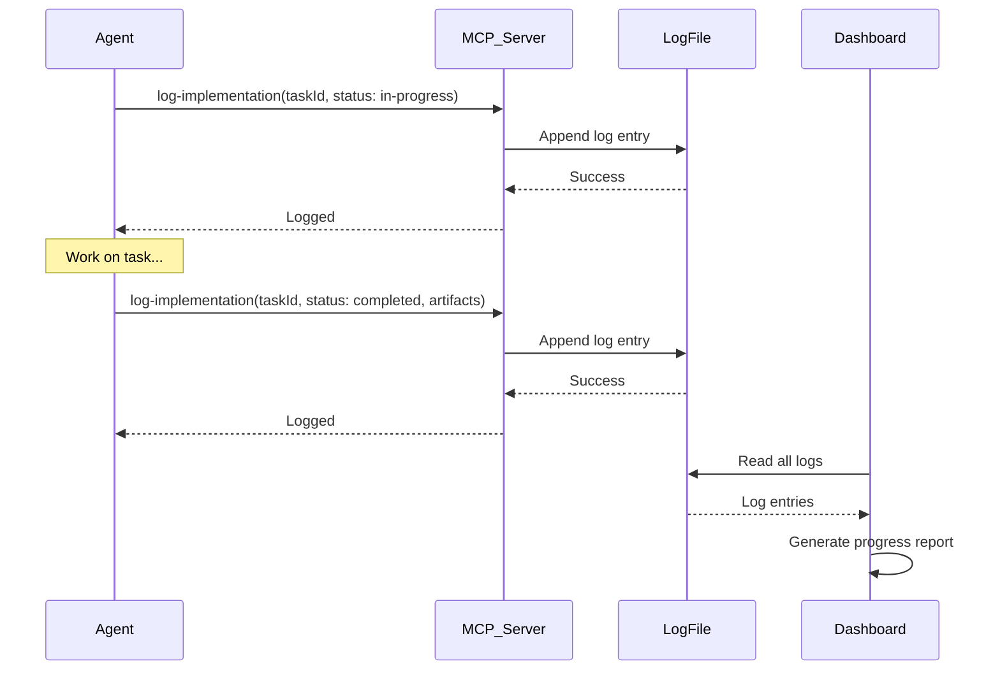

# spec-workflow-mcp: Implementation Log Patterns Analysis

## Overview

This document analyzes the implementation logging patterns in spec-workflow-mcp, focusing on how tasks are tracked, artifacts documented, and metrics captured for traceability.

**Purpose**: Understand tracking patterns for SPEC-000 validation strategies workbook (Task-000-009).

---

## Implementation Log Structure

### Log Entry Schema

```typescript
interface ImplementationLogEntry {
  id: string;                    // Unique log entry ID
  timestamp: string;             // ISO 8601 timestamp
  taskId: string;                // Task identifier (e.g., "Task-001-001")
  status: 'in-progress' | 'completed' | 'blocked';
  artifactsCreated?: string[];   // File paths created
  artifactsModified?: string[];  // File paths modified
  linesOfCode?: number;          // LOC added (excluding comments/blanks)
  testsAdded?: number;           // Test cases added
  testsPassed?: number;          // Tests passing
  notes?: string;                // Free-form notes
  agent?: string;                // Agent who performed work (HYPATIA/SALOMON/etc.)
  duration?: number;             // Time spent (minutes)
}
```

### Example Log Entries

```json
[
  {
    "id": "log-2026-01-11-120000-001",
    "timestamp": "2026-01-11T12:00:00.000Z",
    "taskId": "Task-001-001",
    "status": "in-progress",
    "notes": "Starting Keter-Doc schema creation",
    "agent": "MORPHEUS"
  },
  {
    "id": "log-2026-01-11-130000-002",
    "timestamp": "2026-01-11T13:00:00.000Z",
    "taskId": "Task-001-001",
    "status": "completed",
    "artifactsCreated": [
      "packages/core-mcp/schemas/keter-doc-protocol-v1.0.0.jsonld"
    ],
    "linesOfCode": 450,
    "notes": "Keter-Doc schema complete with validation rules",
    "agent": "MORPHEUS",
    "duration": 180
  }
]
```

---

## Logging Workflow

### Workflow Diagram



### Step-by-Step Process

1. **Task Start**: Agent logs `status: in-progress` with task ID
2. **Work Execution**: Agent creates/modifies files
3. **Task Completion**: Agent logs `status: completed` with:
   - Artifacts created/modified
   - Lines of code added
   - Tests added/passed
   - Duration
4. **Dashboard Display**: Shows task progress in real-time

---

## Log Analysis Patterns

### Pattern 1: Task Progress Tracking

**Query**: What tasks are in-progress?

```typescript
function getInProgressTasks(logs: ImplementationLogEntry[]): string[] {
  const latestStatus = new Map<string, string>();

  for (const log of logs) {
    latestStatus.set(log.taskId, log.status);
  }

  return Array.from(latestStatus.entries())
    .filter(([_, status]) => status === 'in-progress')
    .map(([taskId, _]) => taskId);
}
```

**Example Output**:
```
In-Progress Tasks:
- Task-001-002: Create Template Base daath-zen-base.md
- Task-001-003: Create Configuration config.yaml-ld
```

### Pattern 2: Artifact Traceability

**Query**: What artifacts were created for a task?

```typescript
function getArtifactsForTask(logs: ImplementationLogEntry[], taskId: string): string[] {
  return logs
    .filter(log => log.taskId === taskId && log.artifactsCreated)
    .flatMap(log => log.artifactsCreated);
}
```

**Example Output**:
```
Task-001-001 Artifacts:
- packages/core-mcp/schemas/keter-doc-protocol-v1.0.0.jsonld
```

### Pattern 3: Productivity Metrics

**Query**: How much code was written in a phase?

```typescript
function calculatePhaseMetrics(logs: ImplementationLogEntry[], phase: string): {
  totalLOC: number;
  totalTests: number;
  avgDuration: number;
} {
  const phaseLogs = logs.filter(log => log.taskId.startsWith(`Task-${phase}`));

  return {
    totalLOC: phaseLogs.reduce((sum, log) => sum + (log.linesOfCode || 0), 0),
    totalTests: phaseLogs.reduce((sum, log) => sum + (log.testsAdded || 0), 0),
    avgDuration: phaseLogs.reduce((sum, log) => sum + (log.duration || 0), 0) / phaseLogs.length
  };
}
```

**Example Output**:
```
Phase 1 (Base Infrastructure) Metrics:
- Total LOC: 1,250
- Total Tests: 48
- Avg Duration: 165 minutes/task
```

### Pattern 4: Blocked Task Detection

**Query**: What tasks are blocked?

```typescript
function getBlockedTasks(logs: ImplementationLogEntry[]): Array<{
  taskId: string;
  notes: string;
  blockedSince: string;
}> {
  const latestLogs = new Map<string, ImplementationLogEntry>();

  for (const log of logs) {
    if (!latestLogs.has(log.taskId) || log.timestamp > latestLogs.get(log.taskId).timestamp) {
      latestLogs.set(log.taskId, log);
    }
  }

  return Array.from(latestLogs.values())
    .filter(log => log.status === 'blocked')
    .map(log => ({
      taskId: log.taskId,
      notes: log.notes || 'No notes provided',
      blockedSince: log.timestamp
    }));
}
```

**Example Output**:
```
Blocked Tasks:
- Task-001-004: TemplateHierarchy Class (blocked since 2026-01-11 14:00)
  Reason: Waiting for config.yaml-ld schema approval
```

---

## Integration with Traceability Matrix

### Traceability Matrix Generation

The implementation logs feed into the traceability matrix:

| Requirement | Design | Task | Implementation Status | Artifacts |
|-------------|--------|------|----------------------|-----------|
| REQ-001-01 | ADR-001 | Task-001-001 | ✅ Completed (2026-01-11) | keter-doc-protocol-v1.0.0.jsonld |
| REQ-001-01 | ADR-001 | Task-001-002 | ⏳ In Progress | daath-zen-base.md |
| REQ-001-02 | Component 1 | Task-001-003 | 🚫 Blocked | config.yaml-ld (pending approval) |

**Generation Logic**:
```typescript
function generateTraceabilityMatrix(
  requirements: Requirement[],
  designs: Design[],
  tasks: Task[],
  logs: ImplementationLogEntry[]
): TraceabilityEntry[] {
  return requirements.map(req => {
    const relatedDesigns = designs.filter(d => d.requirements.includes(req.id));
    const relatedTasks = tasks.filter(t => t.requirements.includes(req.id));

    return relatedTasks.map(task => {
      const latestLog = logs
        .filter(log => log.taskId === task.id)
        .sort((a, b) => b.timestamp.localeCompare(a.timestamp))[0];

      return {
        requirement: req.id,
        design: relatedDesigns.map(d => d.id).join(', '),
        task: task.id,
        status: latestLog?.status || 'not-started',
        artifacts: latestLog?.artifactsCreated || []
      };
    });
  }).flat();
}
```

---

## Dashboard Visualization

### Progress Dashboard

```
┌─────────────────────────────────────────────────┐
│ SPEC-001 Implementation Progress                │
├─────────────────────────────────────────────────┤
│                                                  │
│ Phase 1: Base Infrastructure           [100%] ✅ │
│ ████████████████████████████████████           │
│ 4/4 tasks completed                            │
│                                                  │
│ Phase 2: Research Foundation             [25%] ⏳ │
│ ████████                                       │
│ 1/4 tasks completed, 1 in-progress, 2 pending │
│                                                  │
│ Overall Progress                          [31%] │
│ █████████                                      │
│ 5/16 tasks completed                           │
│                                                  │
└─────────────────────────────────────────────────┘
```

### Task Details View

```
┌─────────────────────────────────────────────────┐
│ Task-001-001: Create Keter-Doc Schema        ✅   │
├─────────────────────────────────────────────────┤
│                                                  │
│ Status: Completed                               │
│ Duration: 180 minutes (3 hours)                 │
│ Agent: MORPHEUS                                 │
│                                                  │
│ Artifacts Created:                              │
│ • keter-doc-protocol-v1.0.0.jsonld (450 LOC)   │
│                                                  │
│ Tests Added: 0 (schema validation, no unit tests) │
│                                                  │
│ Notes:                                          │
│ Keter-Doc schema complete with validation rules. │
│ Includes Dublin Core, FOAF, Schema.org vocabs. │
│                                                  │
│ Completed: 2026-01-11 13:00:00                 │
│                                                  │
└─────────────────────────────────────────────────┘
```

---

## Comparison with Other Tracking Systems

### spec-workflow-mcp vs GitHub Issues

| Feature | spec-workflow-mcp | GitHub Issues |
|---------|-------------------|---------------|
| **Task Granularity** | Sub-task level (Task-XXX-YYY) | Issue level (coarser) |
| **Artifact Tracking** | Explicit file paths | Links in comments |
| **Metrics** | LOC, tests, duration | Manual tracking |
| **Real-Time Updates** | File-based polling | Webhooks, API |
| **Traceability** | Requirement → Design → Task → Log | Labels, milestones |

### spec-workflow-mcp vs Jira

| Feature | spec-workflow-mcp | Jira |
|---------|-------------------|------|
| **Setup Complexity** | None (file-based) | High (database, config) |
| **Offline Support** | Full (local files) | Limited (requires API) |
| **Customization** | Code changes | UI configuration |
| **Cost** | Free (open source) | Paid (per user) |
| **AI Integration** | Native (MCP tools) | Requires plugins |

---

## Best Practices from spec-workflow-mcp

### Best Practice 1: Log at Task Start and Completion

**Why**: Provides clear start/end timestamps for duration calculation.

**Example**:
```typescript
// Start task
await log_implementation({
  taskId: "Task-000-004",
  status: "in-progress",
  notes: "Starting DDD workbook literature collection",
  agent: "HYPATIA"
});

// Complete task
await log_implementation({
  taskId: "Task-000-004",
  status: "completed",
  artifactsCreated: [
    "00-define/.../wb-academic-research-ddd/1-literature/papers-ddd.md",
    "00-define/.../wb-academic-research-ddd/3-atomics/atomic-001-bounded-context.md"
  ],
  notes: "DDD workbook completed with 10 atomics",
  agent: "HYPATIA",
  duration: 1920 // 32 hours over 4 days
});
```

### Best Practice 2: Include Artifact Paths

**Why**: Enables file-level traceability (which task created which file).

**Example**:
```typescript
artifactsCreated: [
  "00-define/0-define-daath-zen-framework/manifest/README.md",
  "00-define/0-define-daath-zen-framework/manifest/legacy-inputs/ANALISIS-PROFUNDO.md"
]
```

### Best Practice 3: Separate Created vs Modified

**Why**: Distinguishes new files from updates (useful for LOC calculation).

**Example**:
```typescript
{
  taskId: "Task-001-004",
  artifactsCreated: ["packages/daath-toolkit/templates/template_hierarchy.py"],
  artifactsModified: ["packages/daath-toolkit/templates/__init__.py"],
  linesOfCode: 250 // Only new code in template_hierarchy.py
}
```

### Best Practice 4: Log Blocked Tasks with Reason

**Why**: Helps identify dependencies and blockers early.

**Example**:
```typescript
{
  taskId: "Task-001-005",
  status: "blocked",
  notes: "Waiting for Neo4j activation (docker-compose not ready)",
  agent: "ALMA"
}
```

---

## Key Insights for SPEC-000

### Insight 1: Implementation Logs Enable Traceability

Every task has a log trail:
- Start time, end time, duration
- Artifacts created (files)
- Metrics (LOC, tests)

**Application to SPEC-000**: Validation strategies workbook (Task-000-009) should recommend implementation logging as validation best practice.

### Insight 2: File-Based Logs are Simple but Limited

**Pros**:
- No database required
- Human-readable JSON
- Git-friendly (version control)

**Cons**:
- No indexing (slow queries on large logs)
- No aggregations (must compute in code)
- Concurrent writes (race conditions)

**Application to SPEC-000**: ADR-005 (Triple Persistence) recognizes need for Neo4j for complex queries.

### Insight 3: Metrics Drive Productivity Insights

Tracking LOC, tests, duration enables:
- Phase velocity (LOC per day)
- Test coverage (tests per LOC)
- Efficiency (LOC per hour)

**Application to SPEC-000**: Success metrics (Task-000-012) should include productivity metrics from logs.

### Insight 4: Dashboard Provides Visibility

Logs alone are hard to consume. Dashboard provides:
- Progress bars (visual status)
- Task details (drill-down)
- Blocked task alerts

**Application to SPEC-000**: ALMA should generate similar progress reports in validation-report.md (Task-000-010).

---

## References

- [spec-workflow-mcp Repository](file:///../../../.spec-workflow/)
- [MCP Server Architecture](./mcp-server-architecture.md)
- [Approval System Flow](./approval-system-flow.md)
- [Traceability Matrix Best Practices](https://en.wikipedia.org/wiki/Traceability_matrix)

---

**Analysis Date**: 2026-01-11
**Analyzer**: MORPHEUS (for SPEC-000 manifest)
**Version**: 1.0.0
