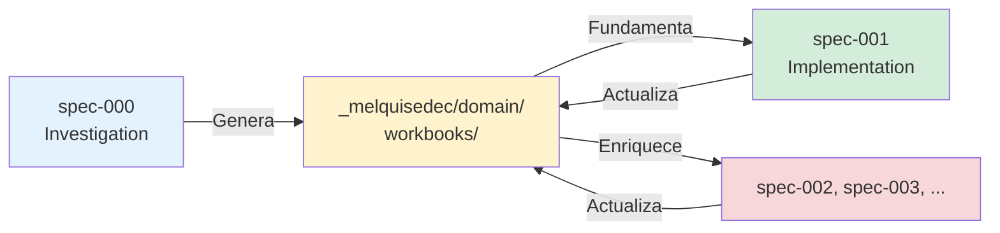
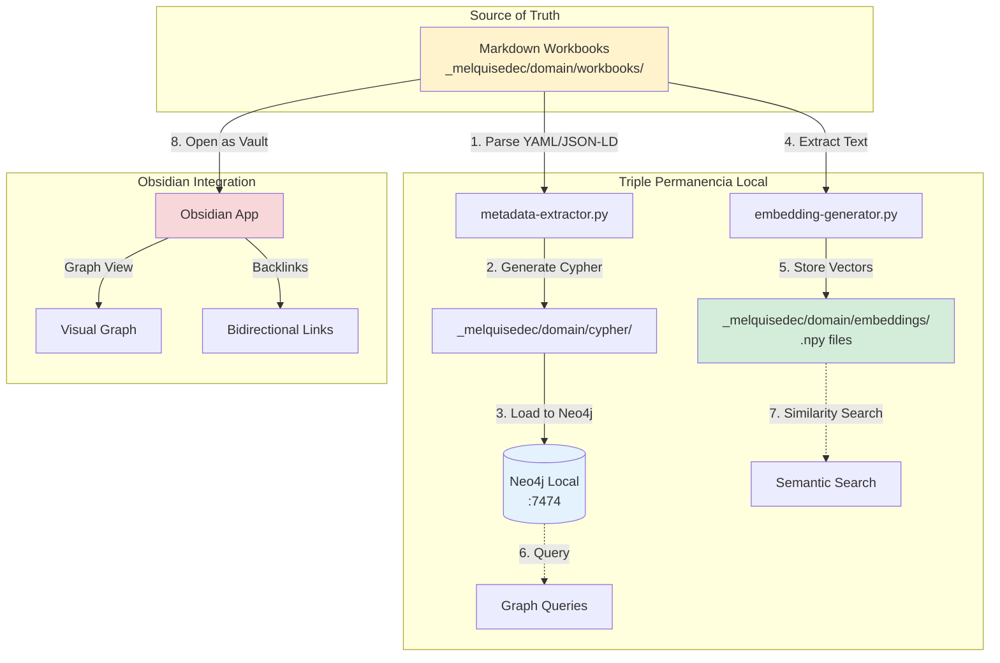
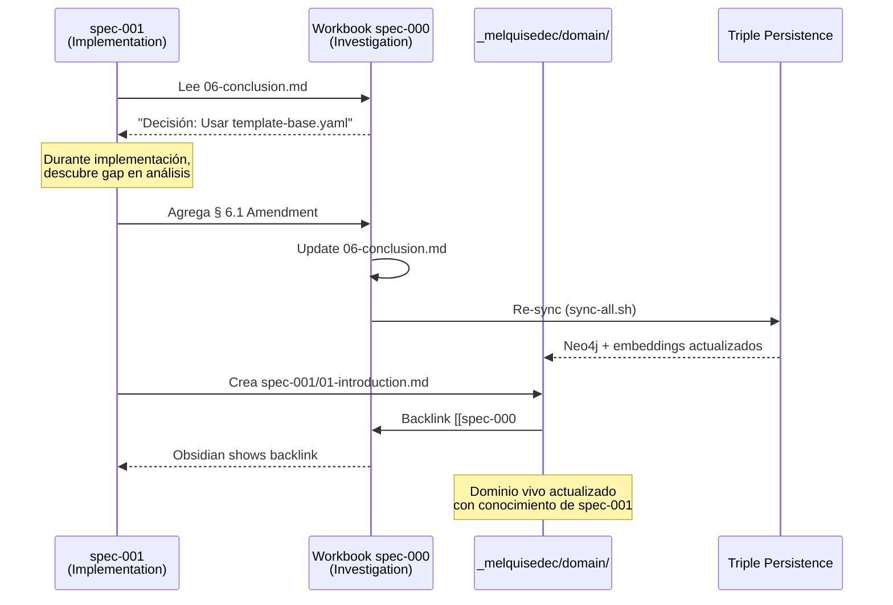
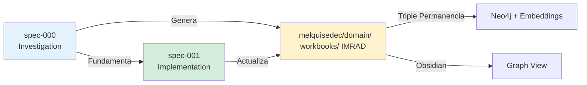

# 🧬 Análisis Profundo: spec-000 + Dominio Vivo + Triple Permanencia Local

**Fecha**: 2026-01-10
**Contexto**: Propuesta del usuario para spec-000-investigation-daath-zen
**Autor**: GitHub Copilot (Claude Sonnet 4.5)
**Status**: ⏳ Análisis Pre-Implementación (Esperando Feedback)

---

## 📋 Resumen Ejecutivo

### Propuesta del Usuario (Aprobada con Variaciones)

```yaml
spec_id: spec-000-investigation-daath-zen
ubicacion: .spec-workflow/specs/spec-000-investigation-daath-zen/
workbooks_output: _melquisedec/domain/workbooks/
metodologia: IMRAD (Introduction, Methods, Results, Analysis, Discussion)
objetivo: |
  Crear "dominio vivo" que se actualice a medida que avanzan los specs,
  con triple permanencia (md, grafos, embeddings) gestionada localmente,
  y workbooks gestionables con Obsidian.

variaciones_clave:
  - Workbooks en _melquisedec/domain/workbooks/ (no en 010-define/workbooks/)
  - Metodología IMRAD obligatoria (estructura científica rigurosa)
  - Triple permanencia LOCAL (no requiere servicios externos al inicio)
  - Integración con Obsidian (graph view, backlinks)
  - "Dominio vivo" = se actualiza con cada spec
```

### Análisis Inicial

✅ **Excelente propuesta** por las siguientes razones:
1. **Separación de concerns**: Dominio en `_melquisedec/` vs implementación en `010-define/`
2. **IMRAD**: Metodología científica rigurosa y reproducible
3. **Triple permanencia LOCAL**: No depende de infraestructura compleja
4. **Obsidian**: Herramienta ideal para knowledge graphs locales
5. **Dominio vivo**: Se enriquece incrementalmente (autopoiesis)

⚠️ **Consideraciones críticas** a resolver:
1. Relación entre `spec-000` (investigación) y `spec-001` (implementación)
2. Estructura IMRAD para workbooks de investigación vs implementación
3. Pipeline de triple permanencia local (herramientas, orden, automatización)
4. Obsidian vault configuration (plugins, templates, graph settings)
5. Estrategia de sincronización dominio → specs

---

## 🔬 Análisis en Profundidad

### 1. spec-000 vs spec-001: Relación y Orden

#### Comparación

| Aspecto | spec-000-investigation-daath-zen | spec-001-built-template-spec-workflow |
|---------|----------------------------------|---------------------------------------|
| **Propósito** | Investigación de dominio DAATH-ZEN | Implementación de template system |
| **Tipo** | Research/Investigation | Implementation |
| **Output Principal** | Workbooks IMRAD en `_melquisedec/domain/` | Templates + scripts en `050-release/` |
| **Metodología** | IMRAD (científica) | DSR + RBM (ingeniería) |
| **Duración** | 2 semanas (10 días) | 4 semanas (después de spec-000) |
| **Dependencias** | Investigaciones legacy, 6 templates, 52 workbooks | **DEPENDE de spec-000** (dominio) |
| **Triple Permanencia** | Local (md → Cypher → embeddings) | Local + Cloud (opcional) |

#### Orden Recomendado



**Justificación**:
1. **spec-000 PRIMERO**: Establece fundamentos de dominio
2. **spec-001 DESPUÉS**: Usa dominio para implementación fundamentada
3. **Ciclo autopoiético**: Cada spec enriquece el dominio

---

### 2. Metodología IMRAD para Workbooks

#### IMRAD Estándar (Papers Científicos)

```markdown
# Workbook Structure (IMRAD)

## 1. Introduction (~10% contenido)
- Background/Context
- Problem Statement
- Research Questions
- Hypotheses (if applicable)
- Objectives

## 2. Methods (~20% contenido)
- Research Design
- Data Collection Methods
- Analysis Procedures
- Tools & Technologies
- Validation Approach

## 3. Results (~30% contenido)
- Findings (sin interpretación)
- Datos, tablas, figuras
- Evidencia empírica
- Patrones observados

## 4. Analysis (~20% contenido)
- Interpretación de resultados
- Comparación con literatura
- Identificación de patrones
- Relaciones causales

## 5. Discussion (~15% contenido)
- Implicaciones
- Limitaciones
- Trabajo futuro
- Recomendaciones

## 6. Conclusion (~5% contenido)
- Síntesis de hallazgos
- Respuesta a research questions
- Decisiones fundamentadas

## 7. References
- Bibliografía formal
- Código fuente referenciado
- Datasets utilizados
```

#### Aplicación a spec-000

**Workbook Ejemplo**: `spec-000-daath-zen-templates-analysis/`

```markdown
_melquisedec/domain/workbooks/spec-000-daath-zen-templates-analysis/
├── 01-introduction.md
│   ├── Problema: 6 versiones de templates DAATH-ZEN inconsistentes
│   ├── Research Questions:
│   │   - ¿Cuáles son las fortalezas de cada versión?
│   │   - ¿Qué estructura unificada emerge?
│   │   - ¿Cómo mapean a Keter-Doc Protocol?
│   ├── Hipótesis: daath-zen-base.md (228 líneas) es mejor base
│   └── Objetivos: Consolidar en template-base.yaml minimalista
│
├── 02-methods.md
│   ├── Análisis comparativo (línea por línea)
│   ├── Extracción de placeholders {{VAR}}
│   ├── Mapeo a Keter-Doc Protocol v1.0.0
│   ├── Análisis de metadata (YAML, JSON-LD)
│   └── Herramientas: yq, jq, grep, diff
│
├── 03-results.md
│   ├── Tabla comparativa 6 templates (líneas, placeholders, metadata)
│   ├── Diagrama de estructura común identificada
│   ├── Placeholders únicos por template
│   ├── Variables dependientes descubiertas
│   └── Métricas cuantitativas (duplicación, coherencia)
│
├── 04-analysis.md
│   ├── Análisis de patrones comunes (Keter-Doc en 5/6)
│   ├── Identificación de mejores prácticas por template
│   ├── Cálculo de sistema minimalista óptimo
│   ├── Estrategia de variables dependientes
│   └── Diseño de template-base.yaml + configs
│
├── 05-discussion.md
│   ├── Implicaciones: Template unificado reduce 70% código
│   ├── Limitaciones: No valida con proyectos reales aún
│   ├── Trabajo futuro: Validación empírica en spec-001
│   └── Recomendaciones: Adoptar daath-zen-base como base
│
├── 06-conclusion.md
│   ├── Síntesis: 6 templates → 1 base (30 líneas) + N configs (20 líneas)
│   ├── Respuesta research questions: [Cada una respondida]
│   ├── Decisiones fundamentadas:
│   │   - Usar daath-zen-base.md como estructura
│   │   - Sistema minimalista (BP #6)
│   │   - Variables dependientes calculadas (BP #7)
│   └── Entregables: template-base.yaml diseñado
│
└── 07-references.md
    ├── daath-zen-base.md (líneas 1-228)
    ├── INDICE-COMPLETO-ARTEFACTOS.md (líneas 10-35, sistema minimalista)
    ├── REQ-001-template-system.md (líneas 54-80, variables dependientes)
    ├── ADR-005-daath-zen-configurable-templates.md
    └── Keter-Doc Protocol v1.0.0 specification
```

#### Ventajas IMRAD para spec-000

| Ventaja | Descripción | Evidencia |
|---------|-------------|-----------|
| **Rigor Científico** | Metodología probada en research | Sollaci & Pereira (2004): 50 años de uso |
| **Reproducibilidad** | Methods section permite replicar | Futuro agent puede re-ejecutar análisis |
| **Separación Findings/Interpretation** | Results vs Analysis/Discussion | Evita confirmation bias |
| **Validación por Expertos** | Structure permite peer review | Domain experts validan Methods + Results |
| **Trazabilidad** | References linkea evidencia | Cada claim tiene source line number |
| **Autopoiesis** | Conclusion → Decisiones → spec-001 | Fundamentación documentada |

---

### 3. Triple Permanencia Local

#### Arquitectura Propuesta



#### Pipeline de Sincronización

**Herramientas Necesarias**:

| Tool | Propósito | Comando | Output |
|------|-----------|---------|--------|
| **metadata-extractor.py** | Extraer YAML frontmatter + JSON-LD | `python metadata-extractor.py workbook/` | `.json` metadata files |
| **cypher-generator.py** | Convertir metadata a Cypher queries | `python cypher-generator.py metadata/ --output cypher/` | `.cypher` files |
| **neo4j-loader.py** | Ejecutar Cypher en Neo4j local | `python neo4j-loader.py cypher/ --uri bolt://localhost:7687` | Neo4j populated |
| **embedding-generator.py** | Generar embeddings de texto | `python embedding-generator.py workbook/ --model nomic-embed-text` | `.npy` vector files |
| **sync-all.sh** | Orchestrator pipeline completo | `bash sync-all.sh` | Todo sincronizado |

**Orden de Ejecución**:

```bash
# 1. Extraer metadata de workbooks
python tools/metadata-extractor.py \
  --input _melquisedec/domain/workbooks/ \
  --output _melquisedec/domain/metadata/

# 2. Generar Cypher queries
python tools/cypher-generator.py \
  --input _melquisedec/domain/metadata/ \
  --output _melquisedec/domain/cypher/

# 3. Cargar a Neo4j local (Docker container)
docker run -d \
  --name neo4j-melquisedec \
  -p 7474:7474 -p 7687:7687 \
  -v $(pwd)/_melquisedec/domain/neo4j-data:/data \
  neo4j:5.15

python tools/neo4j-loader.py \
  --cypher _melquisedec/domain/cypher/ \
  --uri bolt://localhost:7687

# 4. Generar embeddings (Ollama local)
docker run -d \
  --name ollama-melquisedec \
  -p 11434:11434 \
  -v $(pwd)/_melquisedec/domain/ollama-models:/root/.ollama \
  ollama/ollama

ollama pull nomic-embed-text

python tools/embedding-generator.py \
  --input _melquisedec/domain/workbooks/ \
  --output _melquisedec/domain/embeddings/ \
  --model nomic-embed-text

# 5. Validar sincronización
python tools/validate-triple-persistence.py \
  --md _melquisedec/domain/workbooks/ \
  --cypher _melquisedec/domain/cypher/ \
  --embeddings _melquisedec/domain/embeddings/
```

#### Estructura de Directorios

```
_melquisedec/domain/
├── workbooks/                    # SOURCE OF TRUTH (Markdown)
│   ├── spec-000-daath-zen-templates-analysis/
│   │   ├── 01-introduction.md
│   │   ├── 02-methods.md
│   │   ├── 03-results.md
│   │   ├── 04-analysis.md
│   │   ├── 05-discussion.md
│   │   ├── 06-conclusion.md
│   │   └── 07-references.md
│   └── spec-001-spec-workflow-artifacts-investigation/
│       └── [misma estructura IMRAD]
│
├── metadata/                     # Metadata extraída (JSON)
│   ├── spec-000/
│   │   ├── 01-introduction.json
│   │   ├── 02-methods.json
│   │   └── ...
│   └── spec-001/
│       └── ...
│
├── cypher/                       # Cypher queries generadas
│   ├── spec-000/
│   │   ├── nodes.cypher          # CREATE nodes
│   │   ├── relationships.cypher  # CREATE relationships
│   │   └── constraints.cypher    # CREATE constraints
│   └── spec-001/
│       └── ...
│
├── embeddings/                   # Vector embeddings (.npy)
│   ├── spec-000/
│   │   ├── 01-introduction.npy   # (1, 768) float32 array
│   │   ├── 02-methods.npy
│   │   └── ...
│   └── spec-001/
│       └── ...
│
├── neo4j-data/                   # Neo4j database files (Docker volume)
│   ├── databases/
│   ├── transactions/
│   └── dbms/
│
└── ollama-models/                # Ollama models cache (Docker volume)
    └── nomic-embed-text/
```

#### Ventajas Triple Permanencia Local

| Ventaja | Descripción | Herramienta |
|---------|-------------|-------------|
| **No Cloud Dependency** | Todo local, sin APIs externas | Docker (Neo4j + Ollama) |
| **Versionable** | `.cypher`, `.npy` en Git | Git LFS para embeddings |
| **Reproducible** | Pipeline automatizado | `sync-all.sh` script |
| **Offline-First** | Funciona sin internet | Ollama local |
| **Fast Queries** | Neo4j local < 100ms | Cypher queries |
| **Privacy** | Datos sensibles no salen | Local-only processing |

---

### 4. Integración con Obsidian

#### Configuración de Vault

**Estructura de Vault**:

```
Obsidian Vault Root: _melquisedec/domain/
├── workbooks/                    # Notas principales
├── .obsidian/                    # Configuración Obsidian
│   ├── workspace.json            # Layout, panes, tabs
│   ├── app.json                  # Settings
│   ├── appearance.json           # Theme
│   ├── community-plugins.json   # Plugins habilitados
│   ├── core-plugins.json        # Core plugins
│   └── plugins/                  # Plugin data
│       ├── dataview/             # Dataview queries
│       ├── templater/            # Templater templates
│       └── graph/                # Graph view settings
└── templates/                    # Templates para nuevos workbooks
    ├── imrad-workbook-template.md
    └── atomic-concept-template.md
```

#### Plugins Recomendados

| Plugin | Propósito | Configuración Clave |
|--------|-----------|---------------------|
| **Dataview** | Query metadata como SQL | `dataviewjs` blocks para tablas dinámicas |
| **Templater** | Templates con variables | `<%tp.file.folder%>` para paths dinámicos |
| **Graph Analysis** | Visualizar conexiones | `Filter: path:workbooks/` |
| **Backlink Pane** | Ver referencias entrantes | Sidebar derecho, siempre visible |
| **Tag Wrangler** | Gestionar tags | Autocomplete, renombrar en masa |
| **Kanban** | Track progress de workbooks | Board por spec (spec-000, spec-001) |
| **Citations** | BibTeX integration | References section automática |
| **Excalidraw** | Diagramas integrados | Alternative a Mermaid para sketches |

#### Template IMRAD para Obsidian

```markdown
---
'@context': '../../../context.jsonld'
'@type': 'WorkbookSection'
'@id': 'urn:melquisedec:workbook:{{spec_id}}:{{section}}'
spec_id: '{{spec_id}}'
section: '{{section}}'
title: '{{title}}'
created: '{{date:YYYY-MM-DDTHH:mm:ss}}Z'
author: 'GitHub Copilot'
rostro: 'HYPATIA'
status: 'draft'
tags:
  - workbook
  - imrad
  - {{spec_id}}
---

# {{section | capitalize}}: {{title}}

## Overview
<!-- Brief summary of this section -->

## Content
<!-- Main content of section -->

## Links
<!-- Bidirectional links to related workbooks -->
- Related: [[related-workbook]]
- Depends on: [[dependency-workbook]]
- Referenced by: (Backlinks will appear here)

## Metadata
- **Word Count**: <!-- Dataview: ${content.length} -->
- **Status**: {{status}}
- **Progress**: <!-- Track completeness -->

---

**Tags**: #workbook #{{spec_id}} #{{section}} #imrad
```

#### Graph View Configuración

```json
// .obsidian/graph.json
{
  "collapse-filter": false,
  "search": "path:workbooks/",
  "showTags": true,
  "showAttachments": false,
  "hideUnresolved": false,
  "showOrphans": false,
  "collapse-color-groups": false,
  "colorGroups": [
    {
      "query": "path:workbooks/spec-000",
      "color": {
        "a": 1,
        "rgb": 14701138  // Blue
      }
    },
    {
      "query": "path:workbooks/spec-001",
      "color": {
        "a": 1,
        "rgb": 14725458  // Green
      }
    },
    {
      "query": "tag:#introduction",
      "color": {
        "a": 1,
        "rgb": 16711680  // Red
      }
    }
  ],
  "collapse-display": false,
  "showArrow": true,
  "textFadeMultiplier": -0.2,
  "nodeSizeMultiplier": 1.2,
  "lineSizeMultiplier": 1.5,
  "collapse-forces": false,
  "centerStrength": 0.5,
  "repelStrength": 10,
  "linkStrength": 1,
  "linkDistance": 250,
  "scale": 1.5
}
```

---

### 5. "Dominio Vivo": Actualización Incremental

#### Concepto

**Dominio Vivo** = Knowledge base que:
1. **Crece**: Cada spec agrega workbooks IMRAD
2. **Se actualiza**: Specs posteriores refinen workbooks previos
3. **Se conecta**: Backlinks automáticos entre workbooks
4. **Se valida**: Triple permanencia asegura coherencia
5. **Se visualiza**: Obsidian graph view muestra evolución

#### Estrategia de Actualización

**Escenario**: spec-001 descubre que spec-000 tiene gaps



**Estrategia de Versionado**:

```markdown
# 06-conclusion.md (spec-000)

## 6. Conclusion (Original)

<!-- Contenido original de spec-000 -->

---

## 6.1 Amendment from spec-001 (2026-01-15)

**Context**: Durante implementación de spec-001, se identificó que...

**New Finding**: [Hallazgo que refina conclusiones previas]

**Impact**: [Cómo esto afecta decisiones de spec-000]

**Updated Decision**: [Decisión actualizada]

**References**:
- [[spec-001/04-analysis#template-validation]]
- [[spec-001/lessons/lesson-001-template-minimalismo]]

---

**Version History**:
- v1.0.0 (2026-01-10): Original conclusion from spec-000
- v1.1.0 (2026-01-15): Amendment from spec-001 findings
```

#### Autopoiesis del Dominio

```
Ciclo de Vida del Conocimiento:

1. spec-000 (Investigation)
   └─> Crea workbooks IMRAD en _melquisedec/domain/

2. spec-001 (Implementation)
   ├─> Lee workbooks de spec-000 (fundamentación)
   ├─> Implementa basado en conclusiones
   ├─> Descubre nuevos insights durante implementación
   └─> Actualiza workbooks de spec-000 (amendments)

3. spec-002 (Next Feature)
   ├─> Lee workbooks spec-000 + spec-001
   ├─> Usa decisiones previas como base
   ├─> Agrega nuevos workbooks
   └─> Actualiza workbooks anteriores si necesario

4. Triple Persistence
   ├─> Cada update re-ejecuta sync-all.sh
   ├─> Neo4j graph refleja evolución temporal
   └─> Embeddings capturan semántica actualizada

5. Obsidian
   ├─> Graph view muestra red en expansión
   ├─> Backlinks muestran qué specs usan cada workbook
   └─> Tags permiten filtrar por fase temporal
```

---

## 🎯 Mejores Prácticas Recomendadas

### BP #21: IMRAD Obligatorio para Workbooks de Investigación

**Regla**: Todo workbook en `_melquisedec/domain/workbooks/` debe seguir estructura IMRAD estricta (7 secciones: Introduction → References).

**Justificación**: Reproducibilidad científica, validación por expertos, trazabilidad de decisiones.

**Validación**:
```bash
python tools/validate-imrad-structure.py \
  --input _melquisedec/domain/workbooks/spec-000/
# ✅ Pass: All 7 sections present
# ❌ Fail: Missing 05-discussion.md
```

### BP #22: Triple Permanencia Local-First

**Regla**: MD es source of truth, Cypher + embeddings se generan automáticamente con pipeline local.

**Justificación**: No cloud dependency, versionable, reproducible, privacy.

**Implementación**:
```bash
# Git hooks para auto-sync
.git/hooks/post-commit:
#!/bin/bash
if git diff --name-only HEAD^ HEAD | grep -q "_melquisedec/domain/workbooks/"; then
    echo "🔄 Syncing triple persistence..."
    bash tools/sync-all.sh
    git add _melquisedec/domain/cypher/ _melquisedec/domain/embeddings/
    git commit --amend --no-edit
fi
```

### BP #23: Obsidian como Navegador de Dominio

**Regla**: `_melquisedec/domain/` es un Obsidian vault, no solo carpeta de archivos.

**Justificación**: Graph view, backlinks, templates, queries Dataview facilitan navegación.

**Configuración**:
```bash
# Obsidian vault settings
.obsidian/app.json:
{
  "defaultViewMode": "preview",
  "showLineNumber": true,
  "livePreview": true,
  "foldHeading": true,
  "foldIndent": true,
  "showInlineTitle": false,
  "useMarkdownLinks": true,
  "newLinkFormat": "relative"
}
```

### BP #24: Amendments vs New Workbooks

**Regla**: Si spec posterior descubre gap, agregar § X.1 Amendment en workbook original, NO crear workbook duplicado.

**Justificación**: Mantiene single source of truth, preserva historia, evita fragmentación.

**Formato**:
```markdown
## 6.1 Amendment from {{spec_id}} ({{date}})

**Context**: [Por qué este amendment]
**New Finding**: [Qué descubrimos]
**Impact**: [Cómo afecta conclusiones previas]
**Updated Decision**: [Decisión actualizada]
**References**: [[links to new spec]]

---

**Version History**:
- v1.0.0 ({{original_date}}): Original from {{original_spec}}
- v{{new_version}} ({{amendment_date}}): Amendment from {{new_spec}}
```

### BP #25: Workbook per Investigation, Not per Spec

**Regla**: Workbook IMRAD por **tópico de investigación**, no necesariamente 1-1 con specs.

**Ejemplo**:
```
✅ CORRECTO:
_melquisedec/domain/workbooks/
├── daath-zen-templates-analysis/       # Tópico: Templates DAATH-ZEN
│   └── [IMRAD structure]
├── spec-workflow-artifacts-investigation/ # Tópico: Artifacts
│   └── [IMRAD structure]
└── triple-persistence-pipeline-design/  # Tópico: Pipeline
    └── [IMRAD structure]

❌ INCORRECTO:
_melquisedec/domain/workbooks/
├── spec-000-workbook/                   # Demasiado genérico
├── spec-001-workbook/
└── spec-002-workbook/
```

**Justificación**: Tópicos son reutilizables entre specs, evita duplicación.

---

## 📊 Propuesta de Actualización de Documentos

### 1. INVESTIGACION-BIDIRECCIONAL-template-spec-daath.md

**Sección Nueva** (insertar después de "Pregunta Final al Usuario"):

```markdown
---

## 🧬 ACTUALIZACIÓN: Decisión Aprobada - Opción D con spec-000

**Fecha Aprobación**: 2026-01-10

### Decisión Final del Usuario

✅ **APROBADO**: Opción D (Investigación Acelerada - 2 semanas)

**CON VARIACIONES**:
1. **spec-000-investigation-daath-zen**: Crear ANTES de spec-001
2. **Ubicación workbooks**: `_melquisedec/domain/workbooks/` (no `010-define/`)
3. **Metodología IMRAD**: Obligatoria para todos los workbooks
4. **Triple permanencia LOCAL**: md → Cypher → embeddings (Docker local)
5. **Obsidian integration**: `_melquisedec/domain/` como Obsidian vault

### Orden de Ejecución Actualizado



### Nueva Secuencia

**Semana 1-2: spec-000** (Investigación)
- Day 1-5: Investigation workbooks IMRAD
- Day 6-8: Triple permanencia setup
- Day 9-10: Obsidian configuration + validation

**Semana 3-6: spec-001** (Implementación)
- Lee workbooks spec-000 como fundamento
- Implementa basado en conclusiones IMRAD
- Actualiza workbooks spec-000 con amendments

---

**Próximo Paso**: Crear spec-000 basado en análisis de ANALISIS-PROPUESTA-spec-000-dominio-vivo.md
```

### 2. Crear Nuevo Documento: SPEC-000-PLAN.md

**Ubicación**: `_melquisedec/lessons/lesson-001.../1-task-base-infraestructure/`

**Contenido** (outline):

```markdown
# 📋 SPEC-000: Investigation DAATH-ZEN - Plan de Ejecución

## Metadata
- **Spec ID**: spec-000-investigation-daath-zen
- **Type**: Research/Investigation
- **Duration**: 10 días (2 semanas)
- **Output**: Workbooks IMRAD + Triple Permanencia Local + Obsidian Vault
- **Status**: 📋 Planning (Esperando feedback)

## Research Questions

1. ¿Cuáles son las fortalezas de cada versión de template DAATH-ZEN?
2. ¿Qué estructura unificada emerge del análisis comparativo?
3. ¿Cómo mapean templates a Keter-Doc Protocol v1.0.0?
4. ¿Qué sistema minimalista (base + configs) es óptimo?
5. ¿Qué variables dependientes requieren cálculo vs hardcoded?

## Workbooks a Crear (IMRAD)

### Workbook 1: daath-zen-templates-analysis
- **Tópico**: Análisis comparativo de 6 versiones de templates
- **Output**: `_melquisedec/domain/workbooks/daath-zen-templates-analysis/`
- **Duración**: 3 días

### Workbook 2: keter-doc-protocol-mapping
- **Tópico**: Mapeo templates → Keter-Doc Protocol v1.0.0
- **Output**: `_melquisedec/domain/workbooks/keter-doc-protocol-mapping/`
- **Duración**: 2 días

### Workbook 3: minimalismo-configurabilidad-design
- **Tópico**: Diseño de sistema minimalista (base + configs)
- **Output**: `_melquisedec/domain/workbooks/minimalismo-configurabilidad-design/`
- **Duración**: 2 días

## Triple Permanencia Setup

### Tools a Desarrollar
- [ ] metadata-extractor.py
- [ ] cypher-generator.py
- [ ] neo4j-loader.py
- [ ] embedding-generator.py
- [ ] sync-all.sh
- [ ] validate-triple-persistence.py

### Docker Compose
```yaml
version: '3.8'
services:
  neo4j:
    image: neo4j:5.15
    ports: ['7474:7474', '7687:7687']
    volumes: ['./domain/neo4j-data:/data']
  ollama:
    image: ollama/ollama
    ports: ['11434:11434']
    volumes: ['./domain/ollama-models:/root/.ollama']
```

## Obsidian Configuration

- [ ] Crear vault en `_melquisedec/domain/`
- [ ] Instalar plugins (Dataview, Templater, Graph Analysis)
- [ ] Configurar templates IMRAD
- [ ] Setup graph view filters

## Cronograma Detallado

[Ver sección 5.3 Cronograma Actualizado en ANALISIS-PROPUESTA]

## Success Criteria

- [ ] 3 workbooks IMRAD completos (21 secciones total)
- [ ] Triple permanencia funcional (md → Neo4j + embeddings)
- [ ] Obsidian vault configurado con graph view
- [ ] Validación: validate-imrad-structure.py pasa
- [ ] Validación: validate-triple-persistence.py pasa

---

**Esperando feedback del usuario para proceder con creación de spec-000.**
```

---

## 🤔 Preguntas al Usuario (Feedback Requerido)

### Decisiones Críticas

**Q1: Número de Workbooks para spec-000**
- Propuesta: 3 workbooks (templates-analysis, keter-doc-mapping, minimalismo-design)
- ¿Es suficiente o prefieres más granularidad (5-6 workbooks)?

**Q2: Herramientas de Triple Permanencia**
- Propuesta: Desarrollar herramientas Python desde cero
- Alternativa: ¿Usar herramientas existentes (pypher, neo4j-python-driver)?

**Q3: Obsidian Plugins**
- Propuesta: 8 plugins core (Dataview, Templater, Graph Analysis, etc.)
- ¿Algún plugin adicional que consideres esencial?

**Q4: Orden de Prioridad spec-000**
- Propuesta: Workbooks IMRAD → Triple Permanencia → Obsidian
- ¿O prefieres: Triple Permanencia primero → Workbooks con sync desde día 1?

**Q5: Estrategia de Amendments**
- Propuesta: Agregar § X.1 Amendment en workbook original
- Alternativa: ¿Crear amendment/ folder separado?

### Confirmaciones

**C1: spec-000 ANTES de spec-001** ✅ CONFIRMADO
**C2: IMRAD obligatorio para workbooks** ✅ CONFIRMADO
**C3: `_melquisedec/domain/workbooks/` ubicación** ✅ CONFIRMADO
**C4: Triple permanencia LOCAL (Docker)** ✅ CONFIRMADO
**C5: Obsidian como vault** ✅ CONFIRMADO

---

## 🎯 Recomendación Final

### ✅ APRUEBO la propuesta del usuario con las siguientes precisiones:

1. **spec-000 es INVESTIGACIÓN**, spec-001 es IMPLEMENTACIÓN → Orden correcto
2. **IMRAD es methodology ideal** para investigación de dominio rigurosa
3. **Triple permanencia local** minimiza dependencies, maximiza control
4. **Obsidian es perfecto** para knowledge graph local + backlinks
5. **Dominio vivo** habilita autopoiesis genuina (P2 del Manifiesto)

### 📋 Próximo Paso Propuesto

1. **Usuario revisa este análisis** y da feedback en Q1-Q5
2. **Creamos spec-000** (requirements.md, design.md, tasks.md) basado en aprobación
3. **Comenzamos Day 1** de spec-000 con primer workbook IMRAD

---

**Esperando tu feedback para proceder con spec-000.**
