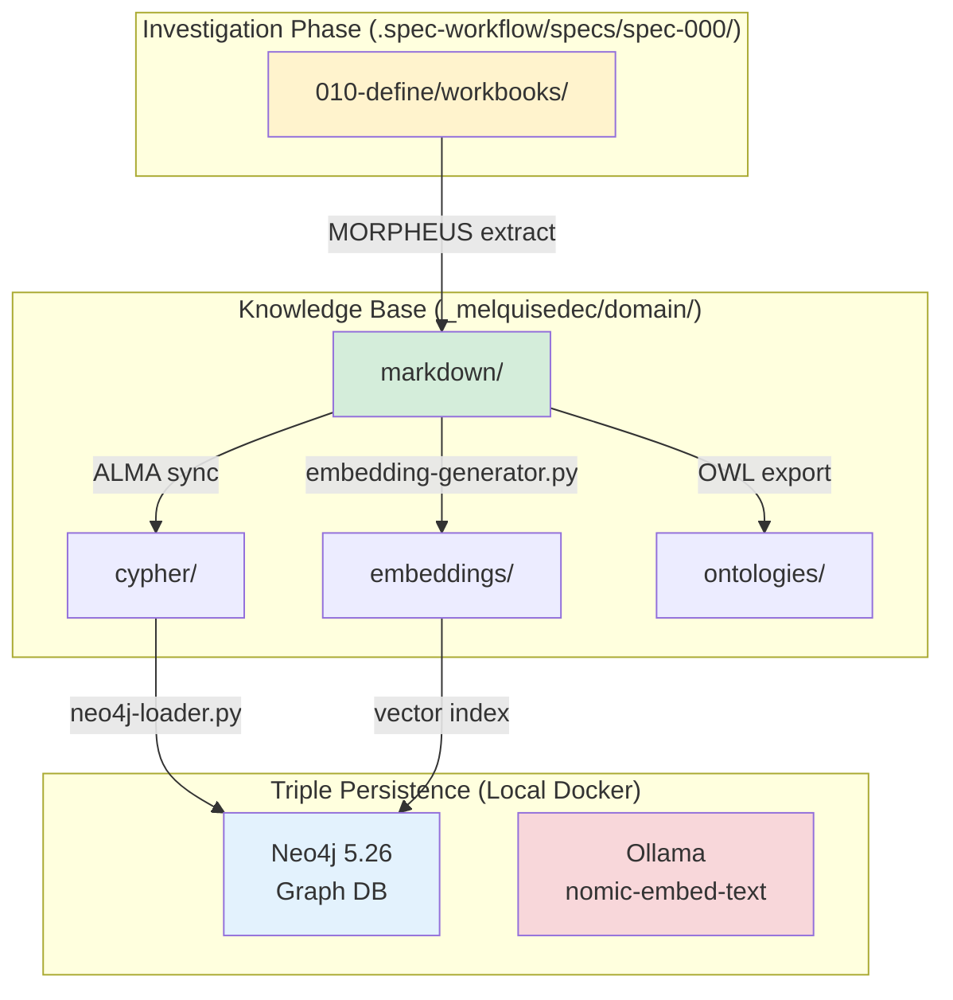

# Technical Specification: spec-000 Investigation

## 1. Architecture Overview

### 1.1 System Context



---

### 1.2 Component Responsibilities

| Component | Responsibility | Owner |
|-----------|----------------|-------|
| **workbooks/** | Investigación IMRAD + Academic Research | HYPATIA, SALOMON |
| **markdown/** | Contenidos-atómicos consolidados | MORPHEUS |
| **cypher/** | Queries para ingestion a Neo4j | MORPHEUS |
| **embeddings/** | Vector representations (768-dim) | ALMA |
| **ontologies/** | OWL/Turtle formal ontologies | ALMA |
| **Neo4j** | Graph database + vector index | Docker |
| **Ollama** | Local embeddings model | Docker |

---

## 2. Data Flow Architecture

### 2.1 Pipeline Overview

```
┌──────────────────────────────────────────────────────────────┐
│ STAGE 1: INVESTIGATION (HYPATIA + SALOMON)                   │
├──────────────────────────────────────────────────────────────┤
│ Input:  Legacy research, 6 templates, dashboard code         │
│ Process: Create workbooks (IMRAD or Academic Research)       │
│ Output: 010-define/workbooks/{type}/{name}/                  │
│ Format: Markdown with YAML frontmatter                       │
│ Duration: 15 días                                            │
└──────────────────────────────────────────────────────────────┘
                              ↓
┌──────────────────────────────────────────────────────────────┐
│ STAGE 2: EXTRACTION (MORPHEUS)                               │
├──────────────────────────────────────────────────────────────┤
│ Input:  010-define/workbooks/                                │
│ Process: metadata-extractor.py → Extract YAML + concepts    │
│ Output: _melquisedec/domain/markdown/concept-*.md            │
│ Format: Atomic notes (1 concept per file)                    │
│ Duration: 2 días                                             │
└──────────────────────────────────────────────────────────────┘
                              ↓
┌──────────────────────────────────────────────────────────────┐
│ STAGE 3: CYPHER GENERATION (MORPHEUS)                        │
├──────────────────────────────────────────────────────────────┤
│ Input:  _melquisedec/domain/markdown/                        │
│ Process: cypher-generator.py → Parse metadata + relations   │
│ Output: _melquisedec/domain/cypher/*.cypher                  │
│ Format: CREATE nodes + relationships                         │
│ Duration: 1 día                                              │
└──────────────────────────────────────────────────────────────┘
                              ↓
┌──────────────────────────────────────────────────────────────┐
│ STAGE 4: GRAPH INGESTION (ALMA)                              │
├──────────────────────────────────────────────────────────────┤
│ Input:  _melquisedec/domain/cypher/                          │
│ Process: neo4j-loader.py → Execute queries                  │
│ Output: Neo4j database populated                             │
│ Format: Graph nodes + edges                                  │
│ Duration: 0.5 días                                           │
└──────────────────────────────────────────────────────────────┘
                              ↓
┌──────────────────────────────────────────────────────────────┐
│ STAGE 5: EMBEDDINGS (ALMA)                                   │
├──────────────────────────────────────────────────────────────┤
│ Input:  _melquisedec/domain/markdown/                        │
│ Process: embedding-generator.py → Ollama API                │
│ Output: _melquisedec/domain/embeddings/*.npy                 │
│ Format: NumPy arrays (768-dim float32)                       │
│ Duration: 0.5 días                                           │
└──────────────────────────────────────────────────────────────┘
                              ↓
┌──────────────────────────────────────────────────────────────┐
│ STAGE 6: VECTOR INDEX (ALMA)                                 │
├──────────────────────────────────────────────────────────────┤
│ Input:  _melquisedec/domain/embeddings/                      │
│ Process: Neo4j HNSW vector index creation                   │
│ Output: Neo4j with semantic search capability               │
│ Format: Vector index on :Concept(embedding)                  │
│ Duration: 0.5 días                                           │
└──────────────────────────────────────────────────────────────┘
```

---

## 3. Technology Stack

### 3.1 Core Technologies

| Technology | Version | Purpose | Rationale |
|------------|---------|---------|-----------|
| **Neo4j** | 5.26 | Graph database | Best-in-class graph DB, supports vector index |
| **Ollama** | Latest | Local LLM inference | nomic-embed-text (768-dim), no cloud dependency |
| **Python** | 3.11+ | Pipeline tools | Rich ecosystem (neo4j-driver, numpy, pyyaml) |
| **Docker Compose** | v2 | Container orchestration | Easy local deployment |
| **Obsidian** | Latest | Knowledge visualization | Graph view, backlinks (optional) |

---

### 3.2 Python Dependencies

```toml
# pyproject.toml
[project]
name = "melquisedec-domain-sync"
version = "0.1.0"
dependencies = [
    "neo4j>=5.15",          # Neo4j Python driver
    "pyyaml>=6.0",          # YAML parsing
    "numpy>=1.24",          # Embeddings storage
    "requests>=2.31",       # Ollama API client
    "rdflib>=7.0",          # OWL/Turtle generation
    "jsonschema>=4.20",     # Metadata validation
    "click>=8.1",           # CLI interface
    "python-frontmatter>=1.0",  # YAML frontmatter extraction
]

[project.optional-dependencies]
dev = [
    "pytest>=7.4",
    "black>=23.12",
    "mypy>=1.7",
]
```

---

## 4. Docker Infrastructure

### 4.1 Docker Compose Configuration

```yaml
# docker-compose.yml
version: '3.8'

services:
  neo4j:
    image: neo4j:5.26-community
    container_name: melquisedec-neo4j
    ports:
      - "7474:7474"  # HTTP
      - "7687:7687"  # Bolt
    volumes:
      - ./apps/R000-autopoietic-template/_melquisedec/domain/neo4j-data:/data
      - ./apps/R000-autopoietic-template/_melquisedec/domain/neo4j-logs:/logs
    environment:
      - NEO4J_AUTH=neo4j/melquisedec123
      - NEO4J_PLUGINS=["apoc", "graph-data-science"]
      - NEO4J_apoc_export_file_enabled=true
      - NEO4J_apoc_import_file_enabled=true
      - NEO4J_dbms_memory_heap_max__size=2G
    healthcheck:
      test: ["CMD", "cypher-shell", "-u", "neo4j", "-p", "melquisedec123", "RETURN 1"]
      interval: 10s
      timeout: 5s
      retries: 5

  ollama:
    image: ollama/ollama:latest
    container_name: melquisedec-ollama
    ports:
      - "11434:11434"
    volumes:
      - ./apps/R000-autopoietic-template/_melquisedec/domain/ollama-models:/root/.ollama
    command: serve
    healthcheck:
      test: ["CMD", "curl", "-f", "http://localhost:11434/"]
      interval: 10s
      timeout: 5s
      retries: 5

networks:
  default:
    name: melquisedec-network
```

---

### 4.2 Startup Script

```bash
#!/bin/bash
# tools/start-triple-persistence.sh

set -e

echo "🚀 Starting Triple Persistence Infrastructure..."

# Pull images
docker-compose pull

# Start services
docker-compose up -d

# Wait for Neo4j
echo "⏳ Waiting for Neo4j..."
until docker exec melquisedec-neo4j cypher-shell -u neo4j -p melquisedec123 "RETURN 1" > /dev/null 2>&1; do
    sleep 2
done
echo "✅ Neo4j ready"

# Wait for Ollama
echo "⏳ Waiting for Ollama..."
until curl -s http://localhost:11434/ > /dev/null; do
    sleep 2
done
echo "✅ Ollama ready"

# Pull embedding model
echo "📥 Pulling nomic-embed-text model..."
docker exec melquisedec-ollama ollama pull nomic-embed-text
echo "✅ Model ready"

# Create Neo4j constraints
echo "🔧 Creating Neo4j constraints..."
docker exec melquisedec-neo4j cypher-shell -u neo4j -p melquisedec123 <<EOF
CREATE CONSTRAINT concept_id IF NOT EXISTS FOR (c:Concept) REQUIRE c.id IS UNIQUE;
CREATE CONSTRAINT workbook_id IF NOT EXISTS FOR (w:Workbook) REQUIRE w.id IS UNIQUE;
CREATE CONSTRAINT spec_id IF NOT EXISTS FOR (s:Spec) REQUIRE s.id IS UNIQUE;
EOF
echo "✅ Constraints created"

echo "🎉 Triple Persistence Infrastructure ready!"
echo "   - Neo4j Browser: http://localhost:7474 (neo4j/melquisedec123)"
echo "   - Ollama API: http://localhost:11434"
```

---

## 5. Data Models

### 5.1 Markdown Schema (Dublin Core + spec:* extensions)

```yaml
---
# Dublin Core (Standard ISO 15836)
dc:
  title: "Concepto: product.md Structure"
  creator: "spec-000-investigation-daath-zen"
  contributor: []
  date: "2026-01-10"
  modified: "2026-01-10"
  subject: ["product-md", "spec-workflow", "artifact"]
  description: "Contenido atómico que define estructura de product.md"
  type: "ContentoAtomic"
  format: "text/markdown"
  identifier: "atomic-000-001"
  source: ".spec-workflow/specs/spec-000/010-define/workbooks/..."
  language: "es"
  relation:
    - "isPartOf:spec-000"
    - "references:concept-tech-md"
  coverage: "Artifact Management"
  rights: "MIT License"

# Spec-Workflow Extensions (Governance)
spec:
  issue: "spec-000-investigation-daath-zen"
  owner: "MORPHEUS"
  status: "stable"        # stable | draft | deprecated
  version: "1.0.0"
  amendments: []
  changeHistory:
    - version: "1.0.0"
      date: "2026-01-10"
      author: "spec-000/MORPHEUS"
      description: "Initial creation"
  dependencies: []
  consumers: []

# Keter-Doc Protocol
'@context': '../../../context.jsonld'
'@type': 'ContentoAtomic'
'@id': 'atomic-000-001'
---

# Concepto: product.md Structure

[Content...]
```

---

### 5.2 Neo4j Graph Schema

```cypher
// Node Labels
(:Spec)              // Specification (spec-000, spec-001, ...)
(:Workbook)          // IMRAD or Academic Research workbook
(:Concept)           // Atomic concept from _melquisedec/domain/markdown/
(:Artifact)          // Generated artifact (test, schema, cypher pattern)
(:Framework)         // External framework (DDD, IMRAD, Schema.org)
(:Paper)             // Academic paper referenced
(:Book)              // Book referenced

// Relationship Types
(:Spec)-[:CREATES]->(:Workbook)
(:Workbook)-[:GENERATES]->(:Concept)
(:Workbook)-[:GENERATES]->(:Artifact)
(:Concept)-[:REFERENCES]->(:Concept)
(:Concept)-[:IS_PART_OF]->(:Workbook)
(:Concept)-[:CITES]->(:Framework|Paper|Book)
(:Spec)-[:AMENDS]->(:Concept)           // Pull request relationship
(:Spec)-[:DEPENDS_ON]->(:Spec)
(:Concept)-[:EMBEDDING]->(embedding: FLOAT[768])  // Vector property

// Indexes
CREATE CONSTRAINT concept_id FOR (c:Concept) REQUIRE c.id IS UNIQUE;
CREATE INDEX concept_embedding FOR (c:Concept) ON (c.embedding);
CREATE VECTOR INDEX concept_semantic
  FOR (c:Concept) ON (c.embedding)
  OPTIONS {indexConfig: {
    `vector.dimensions`: 768,
    `vector.similarity_function`: 'cosine'
  }};
```

---

### 5.3 Example Cypher Ingestion

```cypher
// Create Spec node
CREATE (s:Spec {
  id: 'spec-000',
  title: 'Investigation DAATH-ZEN',
  created: datetime('2026-01-10T00:00:00Z'),
  status: 'in-progress'
})

// Create Workbook node
CREATE (w:Workbook {
  id: 'workbook-000-001',
  name: 'spec-workflow-artifacts-investigation',
  type: 'academic-research',
  created: datetime('2026-01-10T00:00:00Z')
})

// Create relationship
CREATE (s)-[:CREATES]->(w)

// Create Concept node
CREATE (c:Concept {
  id: 'atomic-000-001',
  title: 'product.md Structure',
  content: '...',  // Full markdown content
  created: datetime('2026-01-10T00:00:00Z'),
  owner: 'MORPHEUS',
  version: '1.0.0'
})

// Create relationships
CREATE (w)-[:GENERATES]->(c)
CREATE (c)-[:IS_PART_OF]->(w)

// Add embedding (placeholder, will be updated by sync)
SET c.embedding = NULL  // Will be populated by embedding-generator.py
```

---

## 6. Pipeline Tools Architecture

### 6.1 Tool: metadata-extractor.py

**Purpose**: Extract YAML frontmatter + concepts from workbooks

```python
# tools/metadata-extractor.py

import frontmatter
from pathlib import Path
import json

def extract_workbook_metadata(workbook_path: Path) -> dict:
    """Extract metadata from all sections in workbook."""
    metadata = {
        "workbook": {},
        "sections": []
    }

    for md_file in sorted(workbook_path.glob("*.md")):
        post = frontmatter.load(md_file)
        metadata["sections"].append({
            "file": md_file.name,
            "metadata": post.metadata,
            "content_preview": post.content[:200]
        })

    return metadata

if __name__ == "__main__":
    import click

    @click.command()
    @click.option('--input', type=Path, required=True)
    @click.option('--output', type=Path, required=True)
    def main(input: Path, output: Path):
        """Extract metadata from workbooks."""
        output.mkdir(parents=True, exist_ok=True)

        for workbook in input.rglob("*"):
            if workbook.is_dir() and list(workbook.glob("*.md")):
                metadata = extract_workbook_metadata(workbook)
                output_file = output / f"{workbook.name}.json"
                output_file.write_text(json.dumps(metadata, indent=2))
                click.echo(f"✅ Extracted: {workbook.name}")

    main()
```

---

### 6.2 Tool: cypher-generator.py

**Purpose**: Convert metadata to Cypher queries

```python
# tools/cypher-generator.py

from pathlib import Path
import json

def generate_cypher_from_metadata(metadata: dict) -> str:
    """Generate Cypher CREATE statements."""
    cypher = []

    # Create Spec node
    cypher.append(f"""
    MERGE (s:Spec {{id: '{metadata['spec']['issue']}'}})
    SET s.title = '{metadata['dc']['title']}'
    SET s.created = datetime('{metadata['dc']['date']}')
    """)

    # Create Workbook node
    cypher.append(f"""
    MERGE (w:Workbook {{id: '{metadata['@id']}'}})
    SET w.name = '{metadata['dc']['title']}'
    SET w.type = '{metadata['spec'].get('type', 'unknown')}'
    """)

    # Create relationship
    cypher.append("""
    MATCH (s:Spec {id: '%s'})
    MATCH (w:Workbook {id: '%s'})
    MERGE (s)-[:CREATES]->(w)
    """ % (metadata['spec']['issue'], metadata['@id']))

    return "\n".join(cypher)

# [Similar structure to metadata-extractor.py]
```

---

### 6.3 Tool: neo4j-loader.py

**Purpose**: Execute Cypher queries in Neo4j

```python
# tools/neo4j-loader.py

from neo4j import GraphDatabase
from pathlib import Path

class Neo4jLoader:
    def __init__(self, uri: str, user: str, password: str):
        self.driver = GraphDatabase.driver(uri, auth=(user, password))

    def execute_cypher_file(self, cypher_file: Path):
        """Execute Cypher statements from file."""
        cypher = cypher_file.read_text()

        with self.driver.session() as session:
            result = session.run(cypher)
            return result.consume()

    def close(self):
        self.driver.close()

if __name__ == "__main__":
    import click

    @click.command()
    @click.option('--cypher', type=Path, required=True)
    @click.option('--uri', default='bolt://localhost:7687')
    @click.option('--user', default='neo4j')
    @click.option('--password', default='melquisedec123')
    def main(cypher: Path, uri: str, user: str, password: str):
        """Load Cypher files into Neo4j."""
        loader = Neo4jLoader(uri, user, password)

        for cypher_file in cypher.rglob("*.cypher"):
            stats = loader.execute_cypher_file(cypher_file)
            click.echo(f"✅ Loaded: {cypher_file.name} "
                      f"({stats.nodes_created} nodes, {stats.relationships_created} rels)")

        loader.close()

    main()
```

---

### 6.4 Tool: embedding-generator.py

**Purpose**: Generate embeddings using Ollama

```python
# tools/embedding-generator.py

import requests
import numpy as np
from pathlib import Path

class EmbeddingGenerator:
    def __init__(self, ollama_url: str = "http://localhost:11434"):
        self.ollama_url = ollama_url
        self.model = "nomic-embed-text"

    def generate_embedding(self, text: str) -> np.ndarray:
        """Generate embedding for text."""
        response = requests.post(
            f"{self.ollama_url}/api/embeddings",
            json={"model": self.model, "prompt": text}
        )
        response.raise_for_status()
        embedding = response.json()["embedding"]
        return np.array(embedding, dtype=np.float32)

    def generate_for_file(self, md_file: Path) -> np.ndarray:
        """Generate embedding for markdown file."""
        content = md_file.read_text()
        # Remove frontmatter
        if content.startswith("---"):
            content = content.split("---", 2)[2]
        return self.generate_embedding(content)

# [Similar CLI structure]
```

---

### 6.5 Tool: sync-all.sh

**Purpose**: Orchestrate entire pipeline

```bash
#!/bin/bash
# tools/sync-all.sh

set -e

echo "🔄 Starting Triple Persistence Sync..."

WORKBOOKS_DIR=".spec-workflow/specs/spec-000/010-define/workbooks"
DOMAIN_DIR="apps/R000-autopoietic-template/_melquisedec/domain"

# Stage 1: Extract metadata
echo "📤 Extracting metadata..."
python tools/metadata-extractor.py \
    --input "$WORKBOOKS_DIR" \
    --output "$DOMAIN_DIR/metadata"

# Stage 2: Generate Cypher
echo "🔧 Generating Cypher queries..."
python tools/cypher-generator.py \
    --input "$DOMAIN_DIR/metadata" \
    --output "$DOMAIN_DIR/cypher"

# Stage 3: Load to Neo4j
echo "📥 Loading to Neo4j..."
python tools/neo4j-loader.py \
    --cypher "$DOMAIN_DIR/cypher" \
    --uri bolt://localhost:7687

# Stage 4: Generate embeddings
echo "🧠 Generating embeddings..."
python tools/embedding-generator.py \
    --input "$DOMAIN_DIR/markdown" \
    --output "$DOMAIN_DIR/embeddings"

# Stage 5: Update vector index
echo "🔍 Updating vector index..."
python tools/update-vector-index.py \
    --embeddings "$DOMAIN_DIR/embeddings" \
    --uri bolt://localhost:7687

echo "✅ Sync complete!"
```

---

## 7. Deployment Strategy

### 7.1 Local Development

```bash
# Initial setup
git clone https://github.com/ccolombia-ui/aleia-melquisedec.git
cd aleia-melquisedec

# Install Python dependencies
pip install -e ".[dev]"

# Start infrastructure
bash tools/start-triple-persistence.sh

# Run sync
bash tools/sync-all.sh
```

---

### 7.2 CI/CD Integration

```yaml
# .github/workflows/sync-domain.yml
name: Sync Domain Knowledge

on:
  push:
    paths:
      - '.spec-workflow/specs/*/010-define/workbooks/**'
      - 'apps/R000-autopoietic-template/_melquisedec/domain/**'

jobs:
  sync:
    runs-on: ubuntu-latest
    steps:
      - uses: actions/checkout@v4

      - name: Setup Python
        uses: actions/setup-python@v5
        with:
          python-version: '3.11'

      - name: Install dependencies
        run: pip install -e ".[dev]"

      - name: Start Neo4j
        run: docker-compose up -d neo4j

      - name: Wait for Neo4j
        run: bash tools/wait-for-neo4j.sh

      - name: Run sync
        run: bash tools/sync-all.sh

      - name: Validate
        run: python tools/validate-triple-persistence.py
```

---

## 8. Monitoring & Observability

### 8.1 Health Checks

```bash
# tools/health-check.sh

#!/bin/bash

# Check Neo4j
echo "🔍 Checking Neo4j..."
docker exec melquisedec-neo4j cypher-shell -u neo4j -p melquisedec123 \
    "MATCH (n) RETURN count(n) as node_count" || exit 1

# Check Ollama
echo "🔍 Checking Ollama..."
curl -s http://localhost:11434/ || exit 1

# Check embeddings
echo "🔍 Checking embeddings..."
python tools/validate-embeddings.py \
    --embeddings apps/R000-autopoietic-template/_melquisedec/domain/embeddings || exit 1

echo "✅ All systems operational"
```

---

## 9. Performance Considerations

### 9.1 Expected Metrics

| Metric | Target | Rationale |
|--------|--------|-----------|
| **Sync duration** | < 5 minutes | Full pipeline for 31 atomics |
| **Neo4j query time** | < 100ms | Local Docker, optimized indexes |
| **Embedding generation** | < 10s per atomic | Ollama local inference |
| **Storage** | < 500MB | Neo4j data + embeddings + models |

---

### 9.2 Optimization Strategies

**Caching**:
- Metadata extraction caches parsed YAML
- Embeddings only regenerate if content changes (hash-based)

**Batching**:
- Neo4j queries executed in transactions (batch of 10)
- Embeddings generated in parallel (ThreadPoolExecutor)

**Indexing**:
- Neo4j constraints on unique IDs
- HNSW vector index for semantic search

---

## 10. Security Considerations

### 10.1 Local Security

- Neo4j password in environment variable (not hardcoded)
- Docker containers isolated network
- No external API calls (local-first)

---

### 10.2 Data Privacy

- All processing local (no cloud)
- Sensitive data never leaves machine
- Git LFS for large embeddings (optional)

---

## 11. Future Enhancements

### 11.1 Phase 2 (Post-spec-000)

- [ ] Cloud deployment (optional)
- [ ] GraphQL API over Neo4j
- [ ] Real-time sync (file watchers)
- [ ] Multi-user collaboration (conflicts resolution)

---

## 12. Related Documents

- **Product Specification**: [product.md](./product.md)
- **Project Structure**: [structure.md](./structure.md)
- **Requirements**: [../010-define/requirements.md](../010-define/requirements.md)

---

**Version History**:
- v0.1.0 (2026-01-10): Initial draft con pipeline completo
