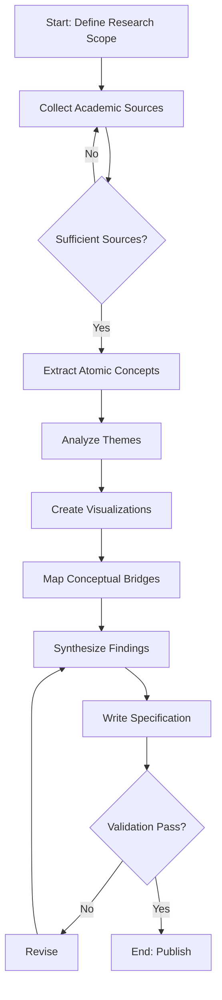
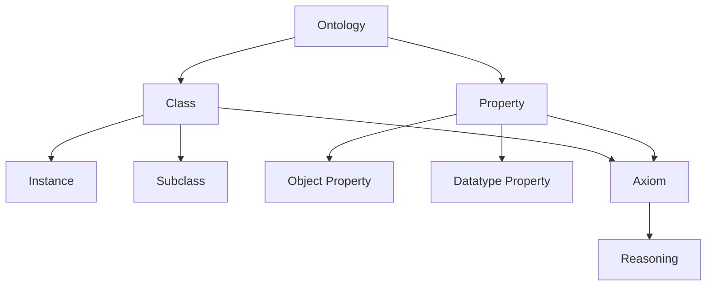
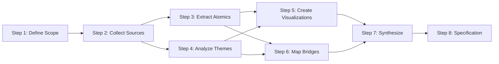
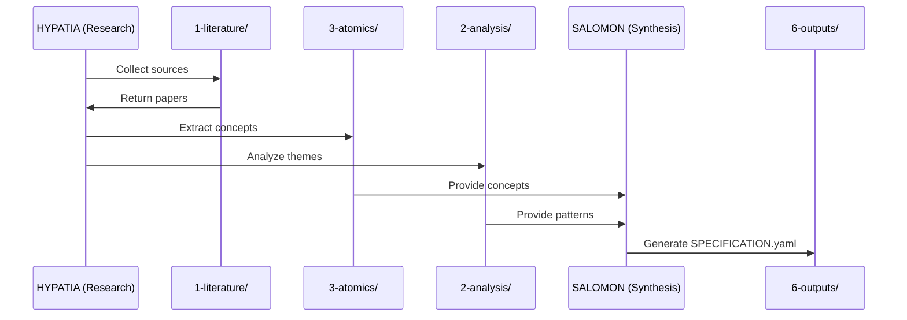
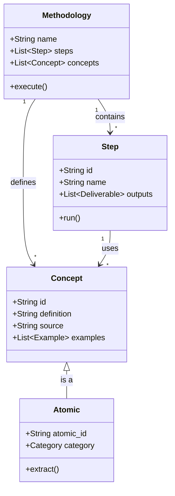
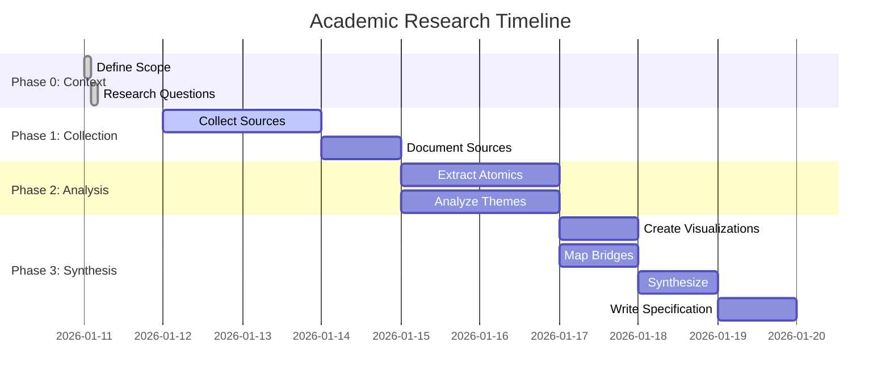
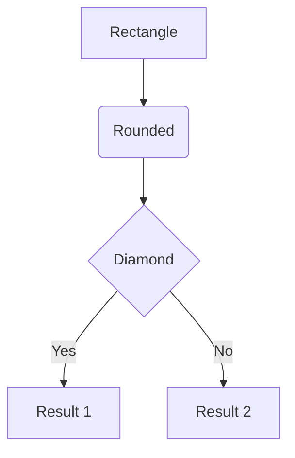
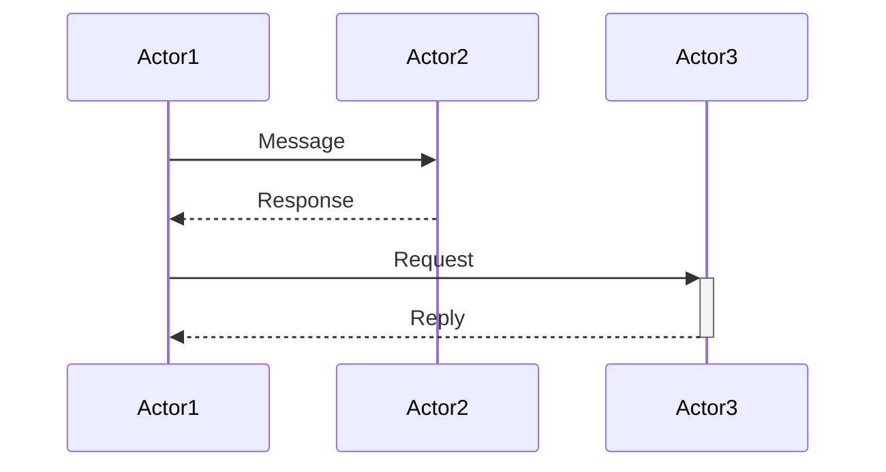
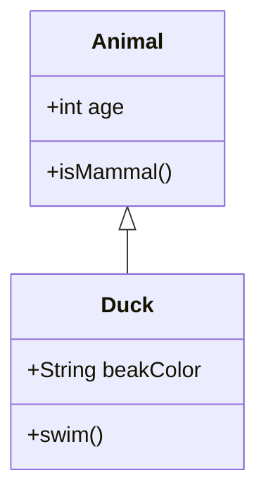

# 4-canvas/ - Visual Models and Diagrams

## Purpose

This folder contains visual representations of the methodology: workflows, conceptual models, process flows, and relationship diagrams. Visualizations make complex concepts accessible and provide at-a-glance understanding.

## File Types

### Mermaid Diagrams (Preferred)
Use Mermaid markdown for version-controllable diagrams:
- **Flowcharts**: Process workflows, decision trees
- **Sequence diagrams**: Interactions over time
- **Class diagrams**: Concept structures and relationships
- **State diagrams**: State transitions
- **Entity-relationship diagrams**: Data models
- **Gantt charts**: Timeline visualizations

### Other Formats (if needed)
- **PNG/SVG**: Hand-drawn sketches or external diagrams
- **PlantUML**: Complex UML diagrams
- **Graphviz**: Graph structures

## Common Visualizations

### 1. workflow-overview.md
**Purpose:** Shows end-to-end methodology execution



### 2. concept-map.md
**Purpose:** Shows how extracted concepts relate



### 3. step-dependencies.md
**Purpose:** Shows execution order and parallelism



### 4. data-flow.md
**Purpose:** Shows how information flows through methodology



### 5. conceptual-model.md
**Purpose:** Shows domain entities and relationships



### 6. timeline-gantt.md
**Purpose:** Shows research timeline and milestones



## Diagram Template

```markdown
---
diagram_id: "VIZ-{number}"
diagram_name: "{Diagram Title}"
type: "{flowchart|sequence|class|state|er|gantt}"
purpose: "{Why this visualization exists}"
related_concepts: ["atomic-{n}", "atomic-{m}"]
related_steps: ["step-{x}", "step-{y}"]
---

# {Diagram Title}

## Purpose

{Why this visualization is needed and what it clarifies}

## Legend (if needed)

- **{Symbol}**: {Meaning}
- **{Color}**: {Significance}
- **{Shape}**: {Represents what}

## Diagram

\`\`\`mermaid
{diagram-type} {orientation}
    {nodes and relationships}
\`\`\`

## Explanation

### Key Elements

1. **{Element 1}**: {What it represents and why it matters}
2. **{Element 2}**: {Explanation}
3. **{Element 3}**: {Explanation}

### Flows / Relationships

- **{Relationship 1}**: {What this connection means}
- **{Relationship 2}**: {Explanation}

### Decision Points (if applicable)

- **At {Node}**: {What decision is made and why}

## Insights from Diagram

{What becomes clearer through this visualization that wasn't obvious in text}

## Related Documentation

- **Concepts**: [[atomic-{n}-{concept}]], [[atomic-{m}-{another}]]
- **Steps**: `3-steps/step-{x}-{action}.md`
- **Analysis**: `2-analysis/themes-{topic}.md`
```

## Mermaid Syntax Reference

### Flowchart


### Sequence Diagram


### Class Diagram


## Quality Criteria

- **3-5 diagrams minimum** for comprehensive visualization
- **Self-explanatory**: Diagrams understandable without extensive text
- **Consistent notation**: Use same symbols/colors for same concepts
- **Cross-referenced**: Link to concepts, steps, analyses
- **Version-controlled**: Mermaid preferred over binary images

## Validation Checklist

- [ ] At least 3 visualization documents exist
- [ ] Each visualization has:
  - [ ] Purpose statement
  - [ ] Complete diagram (Mermaid or other format)
  - [ ] Explanation of key elements
  - [ ] Cross-references to related concepts/steps
- [ ] Mermaid syntax is valid (renders correctly in Markdown previews)
- [ ] Legend provided for non-obvious symbols
- [ ] Diagrams complement text (don't just repeat information)

---

**Maintained by:** HYPATIA (Research Lead) + SALOMON (Synthesis)
**Last Updated:** 2026-01-11
