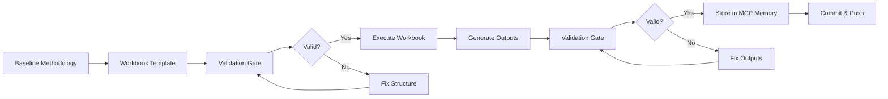

# Phase 2: Workbook Execution - Research Plan

**Date**: 2026-01-11
**Phase**: Phase 2 - Workbook Execution (15 días, 120 horas)
**Agent**: MORPHEUS
**Baseline**: Metodologías canónicas en `00-define/0-define-daath-zen-framework/inputs/baseline/methologies`

---

## 📚 Baseline Resources Available

### Canonical Methodologies (Excluding aleia-integration)

#### 1. **01-ontology-eng-meth** (Ontology Engineering)
**Standards**: ISO 25964-1:2011 + METHONTOLOGY
**Duration**: 3 hours (180 minutes)
**Structure**:
- 6 Bloques ejecutables (B1-B6)
- Tareas atómicas modulares en `tasks/`
- SPECIFICATION.yaml con conceptos clave
- PROGRESS.md para tracking
- MCP Memory integration

**Key Concepts Extracted**:
- Ontology (Especificación formal de conceptualización compartida)
- OWL Classes, Properties, Axioms
- METHONTOLOGY 7-step framework
- Reasoners, SPARQL, Protégé tooling

**Deliverables**:
- Canvas METHONTOLOGY completo
- Ontology OWL export
- Dual guide (ES + EN)
- MCP memory nodes

---

#### 2. **02-ddd-meth** (Domain-Driven Design)
**Standards**: Eric Evans Blue Book (2003) + Vaughn Vernon Red Book (2013)
**Duration**: 4.8 hours (290 minutes)
**Structure**:
- Arquitectura modular similar a Ontology Engineering
- 6 Bloques + tareas independientes
- SPECIFICATION.yaml con Strategic + Tactical Design
- Context Mapping, Ubiquitous Language focus

**Key Concepts Extracted**:
- Bounded Context (explicit boundary para domain model)
- Ubiquitous Language (shared terminology)
- Context Map (relationships entre contexts)
- Aggregates, Entities, Value Objects
- Domain Events, Repositories

**Deliverables**:
- DDD Canvas (Strategic Design)
- Context Map diagram (Mermaid)
- Bounded Context definitions
- Integration patterns

---

## 🎯 Phase 2 Objectives

### Primary Goal
Execute workbooks using validated methodologies as baseline, generating:
1. **Research Outputs**: Canvas, workflows, ontologies
2. **Integration Artifacts**: MCP memory nodes, cross-references
3. **Documentation**: Dual guides (ES + EN), lessons learned
4. **Quality Gates**: Validation before/after execution

### Success Criteria
- ✅ Workbooks execute using canonical patterns from baseline
- ✅ Outputs are reusable across ALEIA-BERESHIT ecosystem
- ✅ MCP Memory integration for knowledge persistence
- ✅ Dual documentation (ES + EN) for all deliverables
- ✅ Validation reports show 0 errors

---

## 📋 Phase 2 Architecture

### Pattern: Workbook Execution Pipeline



### Workbook Execution Phases

#### Phase 2.1: Infrastructure Setup (2 días, 16 horas)
**Tasks**:
1. Create workbook directory structure
2. Initialize MCP Memory nodes
3. Setup validation gates
4. Configure trackers (SPECIFICATION.yaml, PROGRESS.md)
5. Generate initial canvas from baseline

**Deliverables**:
- Workbook directory structure (7 folders + subcarpetas)
- MCP Memory initialized
- Validation scripts configured
- Initial canvas from baseline template

---

#### Phase 2.2: Procedural Ingestion (3 días, 24 horas)
**Tasks**:
1. Extract canonical citations from baseline
2. Document core concepts (≥5 citas por metodología)
3. Create CITAS.yaml with references
4. Map concepts to ALEIA-BERESHIT ontology
5. Generate cross-references between methodologies

**Deliverables**:
- CITAS.yaml (≥10 citations total)
- Conceptos documentados con ejemplos ALEIA
- Cross-reference matrix (Ontology ↔ DDD)
- MCP Memory nodes populated

---

#### Phase 2.3: Workflow Documentation (3 días, 24 horas)
**Tasks**:
1. Document workflow steps (Input/Process/Output)
2. Create Mermaid diagrams for each methodology
3. Map tools per phase (Protégé, SPARQL, Reasoners for Ontology; Event Storming, Context Maps for DDD)
4. Identify integration points with ALEIA sprints
5. Generate executable prompts for each step

**Deliverables**:
- Workflow documentation (≥2,000 words)
- Mermaid diagrams (≥2 per methodology)
- Tool mapping matrix
- Executable prompts in 0-prompts/

---

#### Phase 2.4: Canvas Completion (2 días, 16 horas)
**Tasks**:
1. Complete canvas with data from B2-B3
2. Validate coherence (vertical alignment)
3. Generate examples ALEIA for each canvas section
4. Cross-validate canvas against SPECIFICATION.yaml
5. Export canvas to multiple formats (MD, PDF, YAML)

**Deliverables**:
- Canvas completo (≥1,000 words per methodology)
- Validation report (coherence ≥ 0.8)
- Examples ALEIA integrated
- Multi-format exports

---

#### Phase 2.5: ALEIA Integration (3 días, 24 horas)
**Tasks**:
1. Map methodologies to HYPATIA sprints (Discovery, Alpha, Beta)
2. Cross-reference with other methodologies (RBM, BSC, JTBD)
3. Identify feature outcomes per sprint
4. Generate integration prompts for orchestration
5. Create feature-methodology matrix

**Deliverables**:
- Sprint mapping matrix
- Cross-methodology integration guide
- Feature outcome definitions
- Orchestration prompts

---

#### Phase 2.6: Output Generation (2 días, 16 horas)
**Tasks**:
1. Export ontologies (OWL, Turtle, JSON-LD)
2. Generate dual guides (ES + EN)
3. Create MCP memory snapshots
4. Produce executive summaries
5. Package deliverables for distribution

**Deliverables**:
- Ontology exports (multiple formats)
- Dual guides (≥3,000 words each)
- MCP memory backups
- Executive summary (≥500 words)
- Packaged ZIP for distribution

---

## 🔄 Workbook Execution Workflow

### Standard Operating Procedure

```yaml
workbook_execution:
  phases:
    - name: "Pre-execution"
      steps:
        - Validate workbook structure (IMRAD/Academic Research)
        - Check README.md metadata (Dublin Core + spec fields)
        - Initialize MCP Memory nodes
        - Create PROGRESS.md tracker
      
    - name: "Execution"
      steps:
        - Follow ROADMAP.md task sequence
        - Execute tasks atomically (1 task = 1 session)
        - Update PROGRESS.md after each task
        - Store outputs in appropriate folders
        - Commit after each completed block
      
    - name: "Post-execution"
      steps:
        - Validate outputs (canvas, CITAS.yaml, workflows)
        - Check coherence (≥ 0.2 for all documents)
        - Generate lessons learned
        - Create implementation log
        - Push to repository
```

---

## 🛠️ Tools & Technologies

### Validation Tools (from Task-000-003)
- `validate_metadata.py`: Dublin Core + spec fields
- `validate_imrad_structure.py`: 7 files (01-07.md)
- `validate_academic_research.py`: 5 folders + atomics

### MCP Memory Integration
- Store conceptos_clave as knowledge nodes
- Link methodologies through cross-references
- Create reasoning chains for complex concepts
- Enable semantic search across methodologies

### Documentation Tools
- Mermaid: Workflow diagrams, context maps
- YAML: SPECIFICATION, CITAS, PROGRESS
- Markdown: Canvas, guides, lessons
- OWL/Turtle: Ontology exports

---

## 📊 Progress Tracking

### Metrics to Monitor
1. **Completion Rate**: Tasks completed / Total tasks
2. **Validation Score**: Errors found / Total validations
3. **Coherence Score**: Avg coherence across documents
4. **Coverage**: Concepts documented / Concepts specified
5. **Integration**: Cross-references created / Opportunities

### Quality Gates
- ✅ All validators pass (exit code 0 or 2)
- ✅ Coherence ≥ 0.2 for all documents
- ✅ Coverage ≥ 80% for specified concepts
- ✅ All citations have exact page references
- ✅ Canvas completeness ≥ 90%

---

## 🎯 Next Actions

### Immediate (Next Session)
1. **Choose Methodology**: Start with 01-ontology-eng-meth or 02-ddd-meth?
2. **Create Workbook**: Instantiate template from baseline
3. **Validate Structure**: Run validators on new workbook
4. **Initialize Tracking**: Create PROGRESS.md, setup MCP Memory
5. **Execute B1.1**: Genesis de Carpetas (first atomic task)

### Recommendation
**Start with 01-ontology-eng-meth** because:
- Shorter duration (3 hrs vs 4.8 hrs)
- Foundational concepts (ontology is meta-level)
- Well-defined structure (METHONTOLOGY 7 steps)
- Strong baseline already exists (SPECIFICATION.yaml complete)

---

## 📚 References

- **Baseline Methodologies**: `00-define/0-define-daath-zen-framework/inputs/baseline/methologies/`
- **Validation Tools**: `tools/validation/`
- **Template Structure**: `00-define/_templates/`
- **SPEC-000 Tasks**: `00-define/tasks.md`

---

**Created by**: MORPHEUS
**Date**: 2026-01-11
**Status**: 📋 Ready for execution
**Next**: Choose methodology → Create workbook → Execute B1.1
