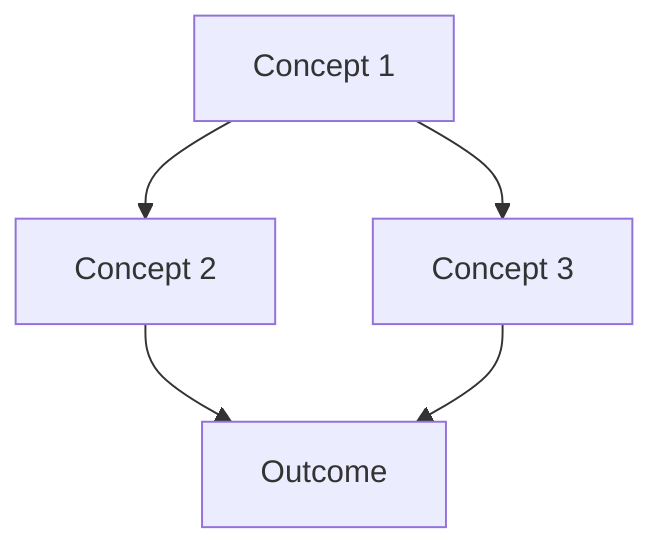

# 4-artifacts/ - Synthesis Documents

## Purpose

This folder contains intermediate synthesis documents that integrate findings from multiple sources, analyses, and atomic concepts. These artifacts serve as stepping stones toward final outputs.

## File Types

### synthesis-{topic}.md
Main synthesis document that weaves together:
- Insights from `2-analysis/` themes
- Concepts from `3-atomics/`
- Patterns discovered across `1-literature/`

### integration-{aspect}.md
Documents showing how concepts integrate:
- Cross-cutting concerns
- Unified perspectives
- Resolving contradictions

### framework-{name}.md
Preliminary frameworks or models synthesized from research:
- Conceptual frameworks
- Process models
- Classification schemes

## Synthesis Document Template

```markdown
---
artifact_id: "SYNTH-{number}"
artifact_name: "{Artifact Name}"
type: "{synthesis|integration|framework}"
sources: ["SRC-{n}", "SRC-{m}", ...]
themes: ["THEME-{x}", "THEME-{y}"]
atomics: ["atomic-{n}", "atomic-{m}", ...]
---

# {Artifact Name}

## Overview

{2-3 paragraph overview of what this synthesis accomplishes}

## Key Findings

### Finding 1: {Finding Title}

{Description of finding}

**Evidence:**
- From [[atomic-{n}-{concept}]]: {Supporting evidence}
- From `2-analysis/themes-{topic}.md`: {Supporting evidence}
- From {Source Year}: {Direct quote or paraphrase}

**Implications:** {What this means}

### Finding 2: {Another Finding}

{Description}

**Evidence:**
{Supporting evidence from multiple sources}

## Integrated Perspective

{Your synthesis that goes beyond summarizing - creates new understanding by integrating multiple viewpoints}

### Commonalities Across Sources

{What all sources agree on}

### Divergent Views

{Where sources disagree and why both might be valid}

### Novel Insights

{New understanding that emerges from synthesis}

## Framework / Model

{Visual or textual representation of your synthesized understanding}



## Implications for ALEIA-MELQUISEDEC

{How these findings apply to our specific system}

### Architectural Implications
- {Implication 1}
- {Implication 2}

### Implementation Guidance
- {Guidance 1}
- {Guidance 2}

## Open Questions

- {Question 1 that requires future research}
- {Question 2}

## References

{List all sources, themes, and atomics referenced}
```

## Quality Criteria

- **Integrative**: Combines insights from 3+ sources
- **Analytical**: Goes beyond summary to create new understanding
- **Evidence-based**: Every claim references specific sources
- **Actionable**: Provides clear implications for ALEIA-MELQUISEDEC
- **Cross-referenced**: Links to atomics, themes, and sources

## Validation Checklist

- [ ] At least 1 comprehensive synthesis document exists
- [ ] Synthesis references:
  - [ ] 5+ atomics from `3-atomics/`
  - [ ] 3+ themes from `2-analysis/`
  - [ ] 5+ sources from `1-literature/`
- [ ] Synthesis creates new understanding (not just summary)
- [ ] Implications for ALEIA-MELQUISEDEC clearly stated
- [ ] All claims have supporting evidence with citations
- [ ] Framework or model included (visual or textual)

---

**Maintained by:** SALOMON (Synthesis Lead)
**Last Updated:** 2026-01-11
