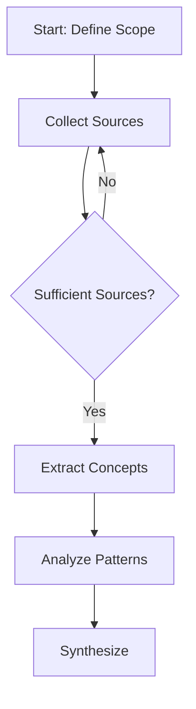

# Academic Research Workbook Template v2 (Enriched)

---
**Metadata (Dublin Core + Spec Extensions)**

```yaml
title: "{{TOPIC_NAME}}: Academic Research Literature Review"
creator: "{{AGENT_NAME}}"
date: "{{ISO_DATE}}"
description: "Comprehensive academic literature review on {{TOPIC_NAME}} following the Academic Research methodology (enriched 9-folder structure)"
subject: ["{{PRIMARY_SUBJECT}}", "{{SECONDARY_SUBJECT}}"]
language: "{{LANGUAGE_CODE}}"
format: "text/markdown"
publisher: "Aleia-Melquisedec Research Repository"
contributor: ["HYPATIA (Research Lead)", "{{ADDITIONAL_CONTRIBUTORS}}"]
spec:issue: "{{SPEC_ISSUE}}"
spec:owner: "{{OWNER_AGENT}}"
keter-doc:version: "2.0.0"
keter-doc:schema: "https://aleia-melquisedec.org/schemas/academic-research/v2"
```

---

## Purpose

This workbook follows the **Academic Research methodology v2** for systematic literature review with enhanced structure. It preserves the proven 5-folder core structure and adds enriched folders for methodology formalization.

**Key Enhancements in v2:**
- ✅ **0-prompts/**: Initial context and research questions (new)
- ✅ **3-steps/**: Formalized methodology steps (new)
- ✅ **4-canvas/**: Visual workflows and diagrams (new)
- ✅ **5-analysis-connection/**: Conceptual bridges between methodologies (new)
- ✅ **tasks/**: DAATH-ZEN atomic task breakdown (new)
- ✅ **6-outputs/**: Enhanced with SPECIFICATION.yaml template (enriched)

**Preserved from v1:**
- ✅ Validated folder structure (1-literature, 2-analysis, 3-atomics, 4-artifacts, 6-outputs)
- ✅ Atomic naming convention (`atomic-XXX-{title}.md`)
- ✅ Dublin Core metadata
- ✅ Agent protocols (HYPATIA → SALOMON → MORPHEUS → ALMA)
- ✅ Validation tools compatibility

---

## Folder Structure

```
academic-research-template-v2/
├── README.md (this file)
├── 0-prompts/              → Initial prompts and research context (NEW)
│   ├── README.md
│   ├── initial-research-prompt.md
│   ├── research-questions.md
│   └── scope.md
├── 1-literature/           → Source collection and documentation (PRESERVED)
│   └── README.md
├── 2-analysis/             → Critical analysis of themes and patterns (PRESERVED)
│   └── README.md
├── 3-atomics/              → Atomic concept extraction (PRESERVED)
│   └── README.md
├── 3-steps/                → Formalized methodology steps (NEW)
│   ├── README.md
│   └── step-{number}-{action}.md
├── 4-artifacts/            → Synthesis and intermediate outputs (PRESERVED)
│   └── README.md
├── 4-canvas/               → Visual models and Mermaid diagrams (NEW)
│   ├── README.md
│   └── workflow-{aspect}.md
├── 5-analysis-connection/  → Conceptual bridges and mappings (NEW)
│   ├── README.md
│   └── mapping-{methodology-a}-to-{methodology-b}.md
├── 6-outputs/              → Final deliverables (ENRICHED)
│   ├── README.md
│   ├── SPECIFICATION.yaml (NEW)
│   ├── ROADMAP.md (NEW)
│   └── final-literature-review.md (PRESERVED)
└── tasks/                  → Atomic task breakdown (NEW)
    ├── README.md
    └── task-{step}.{task}-{action}.md
```

---

## How to Use This Template

### Step 1: Clone Template
```powershell
# From tools/create-workbook.ps1 or manually:
Copy-Item -Recurse "00-define/_templates/academic-research-template-v2" "00-define/0-define-{{TOPIC_SLUG}}/workbooks/wb-{{TOPIC_SLUG}}"
```

### Step 2: Update Metadata
- Replace `{{TOPIC_NAME}}` with your research topic (e.g., "Domain-Driven Design")
- Replace `{{AGENT_NAME}}` with agent identifier (e.g., "HYPATIA")
- Replace `{{ISO_DATE}}` with current date (e.g., "2026-01-11")
- Replace `{{LANGUAGE_CODE}}` with language (e.g., "en", "es")
- Update subjects, contributors, and spec:issue as needed

### Step 3: Follow Enhanced Research Workflow

#### **Phase 0: Context Definition (0-prompts/)** [NEW]
**Duration:** 2-3 hours

Document initial research context:
- **initial-research-prompt.md**: Original research question, motivation, hypothesis
- **research-questions.md**: 5-7 specific research questions with priorities
- **scope.md**: In-scope/out-of-scope boundaries, assumptions, constraints

**Example:**
```markdown
# Initial Research Prompt

## Central Question
How can ontology engineering methodologies provide formal foundation for knowledge management in Triple Persistence architecture?

## Objectives
1. Understand foundational ontology concepts
2. Document methodology steps (METHONTOLOGY, NeOn)
3. Map ontologies to DDD patterns
4. Enable Neo4j knowledge graph integration
```

---

#### **Day 1-2: Literature Collection (1-literature/)**
**Duration:** 12-16 hours

- Document academic sources: books, papers, standards, frameworks
- Create one file per source or category
- Example: `1-literature/iso-25964-1-thesauri.md`, `1-literature/owl-2-primer-w3c.md`
- Include proper citations (APA, IEEE, or Chicago style)

**Quality Targets:**
- ✅ 8-10 sources minimum
- ✅ Primary sources (standards, seminal papers)
- ✅ Recent work (last 5 years)
- ✅ Diverse perspectives

---

#### **Day 3-4: Critical Analysis (2-analysis/)**
**Duration:** 12-16 hours

- Identify recurring themes across sources
- Document patterns, anti-patterns, controversies
- Example: `2-analysis/themes-ontology-engineering.md`, `2-analysis/patterns-reasoning.md`
- Cross-reference sources from 1-literature/

**Quality Targets:**
- ✅ 4-5 themes analyzed
- ✅ Comparative analysis (similarities/differences)
- ✅ Critical evaluation (strengths/weaknesses)

---

#### **Day 5-6: Atomic Extraction (3-atomics/)**
**Duration:** 12-16 hours

- Extract atomic concepts (indivisible knowledge units)
- Naming: `atomic-001-bounded-context.md`, `atomic-002-ubiquitous-language.md`
- Each atomic must include:
  - **Definition**: Clear, concise definition from source
  - **Source**: Full citation with page numbers
  - **Examples**: 2-3 concrete examples (including Aleia-Melquisedec context)
  - **Related**: Links to other atomics

**Quality Targets:**
- ✅ 10-12 atomics minimum
- ✅ Proper naming convention (`atomic-XXX-{title}.md`)
- ✅ Each atomic 150-300 words
- ✅ Cross-references between atomics

---

#### **Phase 1: Methodology Formalization (3-steps/)** [NEW]
**Duration:** 6-8 hours (parallel with Days 5-6)

- Document step-by-step procedures for executing the methodology
- Naming: `step-001-define-scope.md`, `step-002-collect-sources.md`
- Each step includes:
  - **Prerequisites**: Required inputs, knowledge, tools
  - **Procedure**: Detailed sub-tasks with commands/examples
  - **Deliverables**: Expected outputs with locations
  - **Validation**: Success criteria and verification methods

**Example:**
```markdown
---
step_id: "001"
step_name: "Define Research Scope"
order: 1
duration: "2 hours"
prerequisites: ["initial-research-prompt.md"]
deliverables: ["0-prompts/scope.md"]
---

# Step 001: Define Research Scope

## Procedure

### 1. Identify Core Research Questions
- Review initial-research-prompt.md
- Extract 5-7 specific questions
- Prioritize by criticality

### 2. Document Boundaries
- List in-scope topics
- List out-of-scope topics
- Document assumptions
```

---

#### **Phase 2: Visual Modeling (4-canvas/)** [NEW]
**Duration:** 4-6 hours (parallel with Days 5-6)

- Create Mermaid diagrams for workflows, concept maps, step dependencies
- Naming: `workflow-overview.md`, `concept-map.md`, `step-dependencies.md`
- Formats: Mermaid (preferred), PlantUML, PNG/SVG

**Example:**


---

#### **Phase 3: Conceptual Bridges (5-analysis-connection/)** [NEW]
**Duration:** 3-4 hours (after Day 6)

- Map concepts between different methodologies or frameworks
- Example: `mapping-ddd-to-ontology.md`, `matrix-equivalences.md`
- Create equivalence tables showing 1:1, 1:N, or N:M mappings

**Example:**
```markdown
# Mapping: DDD to Ontology Engineering

| DDD Pattern | Ontology Concept | Relationship | Notes |
|-------------|------------------|--------------|-------|
| Bounded Context | Ontology | 1:1 | Both define semantic boundaries |
| Entity | Class | 1:1 | Both have identity |
| Value Object | Datatype Property | 1:N | VOs can map to multiple properties |
| Aggregate | OWL Restriction | N:1 | Aggregates enforce constraints |
```

---

#### **Day 7-8: Synthesis & Specification (4-artifacts/ + 6-outputs/)**
**Duration:** 12-16 hours

- Synthesize findings in `4-artifacts/synthesis-{{TOPIC}}.md`
- Create final literature review in `6-outputs/final-{{TOPIC}}-literature-review.md`
- **[NEW]** Create `6-outputs/SPECIFICATION.yaml` (400-600 lines) with:
  - Metadata (title, version, author, spec:issue)
  - Overview (purpose, scope, audience, domains)
  - Foundation (theoretical basis, key principles)
  - Steps (full specification of each methodology step)
  - Concepts (core, supporting, advanced concepts)
  - Workflows (visual references from 4-canvas/)
  - Validation (criteria, checklists, acceptance tests)

- **[NEW]** Create `6-outputs/ROADMAP.md` with 3-phase execution plan
- Ensure all atomics are cross-referenced

---

#### **Phase 4: Task Breakdown (tasks/)** [NEW]
**Duration:** 4-6 hours (after Day 8)

- Break down `3-steps/` into atomic, executable tasks
- Naming: `task-1.1-define-research-scope.md`, `task-2.1-collect-papers.md`
- Each task follows DAATH-ZEN format:
  - **Rostro**: Agent name
  - **MCPs**: Required MCP servers
  - **Lesson**: Reference to lessons-learned documentation
  - **Estimated**: Time estimate
  - **Priority**: HIGH/MEDIUM/LOW

---

## Validation Checklist

Before completing this workbook, verify:

### Metadata & Structure
- [ ] **README.md**: All metadata fields populated (9 Dublin Core + 2 spec fields)
- [ ] **All 9 folders present**: 0-prompts, 1-literature, 2-analysis, 3-atomics, 3-steps, 4-artifacts, 4-canvas, 5-analysis-connection, 6-outputs, tasks
- [ ] **Folder READMEs**: Each folder has README.md explaining purpose

### Content Quality (PRESERVED from v1)
- [ ] **1-literature/**: At least 8-10 sources documented with proper citations
- [ ] **2-analysis/**: At least 4-5 themes analyzed with cross-references
- [ ] **3-atomics/**: At least 10-12 atomics extracted (proper naming: `atomic-XXX-{title}.md`)
- [ ] **4-artifacts/**: Synthesis document present integrating all findings
- [ ] **6-outputs/final-*.md**: Final literature review with comprehensive references

### New Content (v2)
- [ ] **0-prompts/**: Initial research prompt, research questions (5-7), scope document
- [ ] **3-steps/**: At least 5-7 methodology steps documented with procedures
- [ ] **4-canvas/**: At least 3-5 Mermaid diagrams (workflow, concept map, dependencies)
- [ ] **5-analysis-connection/**: At least 1-2 mapping documents with equivalence tables
- [ ] **6-outputs/SPECIFICATION.yaml**: Complete spec (400-600 lines) with all sections
- [ ] **6-outputs/ROADMAP.md**: 3-phase execution plan with timeline
- [ ] **tasks/**: Atomic task breakdown (5-10 tasks) with DAATH-ZEN format

### Cross-References
- [ ] **Atomics link to sources**: Each atomic references 1-literature/ sources
- [ ] **Atomics link to each other**: Related atomics cross-referenced
- [ ] **Steps reference atomics**: Each step references relevant concepts from 3-atomics/
- [ ] **Canvas references steps**: Diagrams reference 3-steps/ procedures
- [ ] **Tasks reference steps**: Each task references parent step from 3-steps/

### Citations & Quality
- [ ] **All sources properly cited**: APA/IEEE/Chicago style consistent
- [ ] **No orphan files**: Every file referenced from at least one other file
- [ ] **Language consistency**: All content in declared language ({{LANGUAGE_CODE}})

Run validation:
```powershell
python tools/validation/validate-academic-research.py workbooks/wb-{{TOPIC_SLUG}}/
python tools/validation/validate-metadata.py workbooks/wb-{{TOPIC_SLUG}}/README.md
```

---

## Success Criteria

### Core Criteria (PRESERVED from v1)
- ✅ 10+ academic sources documented
- ✅ 5+ themes identified and analyzed
- ✅ 10+ atomics extracted with proper structure
- ✅ Final synthesis integrates all findings
- ✅ All validations pass (0 errors)

### Enhanced Criteria (NEW in v2)
- ✅ Research context fully documented in 0-prompts/
- ✅ Methodology formalized in 3-steps/ (5-7 steps)
- ✅ Visual models created in 4-canvas/ (3-5 diagrams)
- ✅ Conceptual mappings in 5-analysis-connection/ (1-2 documents)
- ✅ SPECIFICATION.yaml complete (400-600 lines)
- ✅ ROADMAP.md execution plan defined
- ✅ Tasks broken down (5-10 atomic tasks)

---

## Agent Protocols

### HYPATIA (Research Lead) [PRESERVED]
- Primary owner of this workbook type
- Responsible for literature collection (Days 1-2, 1-literature/)
- Executes critical analysis (Days 3-4, 2-analysis/)
- Extracts atomics (Days 5-6, 3-atomics/)
- **[NEW]** Populates 0-prompts/ with research context
- **[NEW]** Documents steps in 3-steps/
- **[NEW]** Creates visualizations in 4-canvas/
- Passes atomics to SALOMON for synthesis

### SALOMON (Synthesis) [PRESERVED]
- Receives atomics from HYPATIA
- Creates synthesis document (Day 7, 4-artifacts/)
- Produces final output (Day 8, 6-outputs/final-*.md)
- **[NEW]** Creates SPECIFICATION.yaml in 6-outputs/
- **[NEW]** Creates ROADMAP.md
- **[NEW]** Documents conceptual mappings in 5-analysis-connection/
- Ensures cross-references are complete

### MORPHEUS (Validation) [PRESERVED]
- Validates structure completeness (all 9 folders)
- Checks metadata compliance (Dublin Core + spec fields)
- Verifies atomic naming convention (`atomic-XXX-{title}.md`)
- **[NEW]** Validates 0-prompts/ completeness (3 required files)
- **[NEW]** Validates 3-steps/ structure (step metadata, procedures)
- **[NEW]** Validates 4-canvas/ diagram syntax (Mermaid, PlantUML)
- **[NEW]** Validates SPECIFICATION.yaml schema (all required sections)
- **[NEW]** Validates tasks/ DAATH-ZEN format (Rostro, MCPs, Lesson)
- Generates validation report

### ALMA (Publication) [PRESERVED]
- Publishes approved outputs to `_melquisedec/domain/markdown/`
- Creates Neo4j ingestion scripts from SPECIFICATION.yaml
- Updates knowledge graph
- **[NEW]** Publishes visualizations to domain/graphs/
- **[NEW]** Ingests conceptual mappings to Neo4j relationships

---

## Example Atomics [PRESERVED]

**Good Atomic Naming:**
- ✅ `atomic-001-bounded-context.md`
- ✅ `atomic-002-ubiquitous-language.md`
- ✅ `atomic-010-aggregate-root.md`

**Bad Atomic Naming:**
- ❌ `atomic1.md` (no leading zeros)
- ❌ `concept-bounded-context.md` (wrong prefix)
- ❌ `atomic-001.md` (missing descriptive name)

---

## Migration from v1

If you have an existing v1 workbook, migrate to v2:

1. **Add new folders**:
   ```powershell
   New-Item -ItemType Directory -Path "0-prompts", "3-steps", "4-canvas", "5-analysis-connection", "tasks"
   ```

2. **Copy READMEs** from `academic-research-template-v2/` to each new folder

3. **Populate 0-prompts/**:
   - Create `initial-research-prompt.md` with original research question
   - Create `research-questions.md` with 5-7 specific questions
   - Create `scope.md` with boundaries

4. **Populate 3-steps/**:
   - Extract methodology from 4-artifacts/synthesis-*.md
   - Create `step-{number}-{action}.md` files

5. **Populate 4-canvas/**:
   - Convert existing diagrams to Mermaid
   - Create workflow-overview.md, concept-map.md

6. **Populate 5-analysis-connection/**:
   - If comparing methodologies, create mapping-*.md

7. **Enhance 6-outputs/**:
   - Create SPECIFICATION.yaml from synthesis
   - Create ROADMAP.md from project timeline

8. **Populate tasks/**:
   - Break down steps into atomic tasks
   - Use DAATH-ZEN format

9. **Update README.md** metadata to v2 schema

10. **Validate**:
    ```powershell
    python tools/validation/validate-academic-research.py .
    ```

---

## Related Documents

- [Academic Research Template v1](../academic-research-template/README.md) (Original 5-folder structure)
- [Methodology Workbook Template](../../../../.spec-workflow/_meta/templates/research-methodology-template/methodology-workbook/README.md) (Alternative 7-folder structure)
- [LESSON-000-005: Template Migration Strategy](_melquisedec/lessons/lesson-000-005-template-migration-strategy.md)
- [Daath-Zen Requirements Template](../../manifest/templates-daath-zen/daath-zen-requirements.md)
- [IMRAD Template](../imrad-template/README.md)
- [Validation Tools Documentation](../../../tools/validation/README.md)
- [SPEC-000 Tasks](../../../.spec-workflow/specs/spec-000-investigation-daath-zen/tasks.md)

---

## Changelog

| Version | Date       | Changes                                                                                     |
|---------|------------|---------------------------------------------------------------------------------------------|
| 1.0.0   | 2026-01-10 | Initial template with 5-folder structure (1-literature, 2-analysis, 3-atomics, 4-artifacts, 6-outputs) |
| 2.0.0   | 2026-01-11 | **Enriched template**: Added 0-prompts/, 3-steps/, 4-canvas/, 5-analysis-connection/, tasks/, enhanced 6-outputs/ with SPECIFICATION.yaml |

---

**Template Version**: 2.0.0
**Last Updated**: 2026-01-11
**Maintained By**: MORPHEUS (Template Guardian)
**Migration Status**: ✅ Backward compatible with v1 (see Migration section)
