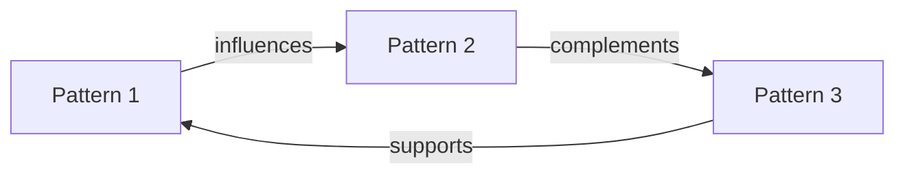

# Results

## Overview

[Summarize the main findings. What patterns emerged from the analysis?]

## Pattern 1: [Pattern Name]

### Description
[What is this pattern? What does it represent?]

### Evidence
- **Source 1**: [Atomic or reference showing this pattern]
- **Source 2**: [Another example]
- **Source 3**: [Additional evidence]

### Frequency
- **Occurrences**: [How often this pattern appeared]
- **Contexts**: [Where it was observed]

### Characteristics
1. [Key characteristic 1]
2. [Key characteristic 2]
3. [Key characteristic 3]

## Pattern 2: [Pattern Name]

### Description
[What is this pattern?]

### Evidence
- **Source 1**: [Evidence]
- **Source 2**: [Evidence]

### Frequency
- **Occurrences**: [Count]
- **Contexts**: [Contexts]

### Characteristics
1. [Key characteristic 1]
2. [Key characteristic 2]

## Pattern 3: [Pattern Name]

### Description
[What is this pattern?]

### Evidence
- **Source 1**: [Evidence]
- **Source 2**: [Evidence]

### Frequency
- **Occurrences**: [Count]

### Characteristics
1. [Key characteristic 1]
2. [Key characteristic 2]

## Relationships Between Patterns

[Describe how patterns interact, support, or contradict each other]

## Key Findings

### Finding 1: [Title]
**Description**: [What was discovered]
**Implications**: [What this means]
**Supporting Evidence**: [References to atomics, literature]

### Finding 2: [Title]
**Description**: [What was discovered]
**Implications**: [What this means]
**Supporting Evidence**: [References]

### Finding 3: [Title]
**Description**: [What was discovered]
**Implications**: [What this means]
**Supporting Evidence**: [References]

## Visualizations

### Concept Map
[Insert Mermaid diagram showing relationships between key concepts]

### Summary Table

| Pattern | Frequency | Key Sources | Main Characteristics |
|---------|-----------|-------------|---------------------|
| Pattern 1 | High | [Sources] | [Characteristics] |
| Pattern 2 | Medium | [Sources] | [Characteristics] |
| Pattern 3 | High | [Sources] | [Characteristics] |

## Unexpected Findings

[Were there any surprising discoveries? Anomalies? Counter-intuitive results?]

---

**Related Sections**:
- Previous: [Methodology](03-methodology.md)
- Next: [Discussion](05-discussion.md)
- References: [07-references.md](07-references.md)
