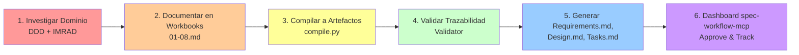

# Domain Knowledge Base

> **Purpose**: Este directorio contiene investigación formal de dominio usando DDD, IMRAD e ISO/IEC 21838 para fundamentar el diseño de artefactos de spec-workflow-mcp.

## 📋 Overview

**Phase 1.5: Research Foundation** introduce investigación sistemática ANTES de implementar templates (Phase 2). El objetivo es comprender QUÉ son los artefactos de spec-workflow-mcp (requirements.md, design.md, tasks.md, producto.md, tech.md, structure.md), qué conceptos de dominio contienen, y cómo poblarlos desde conocimiento generado vs invención.

## 🗂️ Estructura

```
domain/
├── README.md                     # Este archivo
├── workbooks/                    # IMRAD domain research workbooks
│   ├── spec-workflow-artifacts-investigation/
│   │   ├── 01-introduction.md    # Problema, hipótesis, objetivos
│   │   ├── 02-methods.md         # Metodología (DDD Event Storming, AST analysis)
│   │   ├── 03-results.md         # Hallazgos (bounded contexts, schemas)
│   │   ├── 04-analysis.md        # Análisis de patrones
│   │   ├── 05-discussion.md      # Implicaciones, limitaciones
│   │   ├── 06-conclusion.md      # Síntesis, decisiones de diseño
│   │   └── 07-references.md      # Bibliografía (DDD, ISO specs)
│   │
│   └── spec-001-prototype/       # Workbook prototipo para SPEC-001
│       ├── 01-introduction.md    # Problema del sistema de templates
│       ├── 02-methods.md         # DDD + IMRAD + ISO approach
│       ├── 03-results-literature.md  # Literature review
│       ├── 04-results-analysis.md    # Análisis atómico de reqs
│       ├── 05-results-adrs.md        # ADRs con justificación
│       ├── 06-synthesis.md           # Síntesis hacia artefactos
│       ├── 07-discussion.md          # Implicaciones
│       ├── 08-references.md          # Referencias bibliográficas
│       └── compiler/
│           ├── compile.py        # Script que genera requirements.md, design.md, tasks.md
│           ├── templates/        # Jinja2 templates para cada artefacto
│           │   ├── requirements.md.j2
│           │   ├── design.md.j2
│           │   └── tasks.md.j2
│           └── tests/
│               └── test_compiler.py  # Tests del compilador (80%+ coverage)
│
├── models/                       # Domain models (DDD)
│   └── rbm-artifacts-mapping.md  # Mapeo RBM → Artefactos con bounded contexts
│
└── ontologies/                   # Formal ontologies (ISO/IEC 21838)
    └── spec-workflow-ontology.ttl  # OWL/Turtle ontology de spec-workflow concepts
```

## 🎯 Objetivos de Phase 1.5

### 1. Investigación IMRAD de Artefactos (Task 1.5.1)

**Preguntas de Investigación**:
- ¿Qué secciones espera el dashboard en cada artefacto?
- ¿Cuáles son los conceptos de dominio clave?
- ¿Cómo mapean los artefactos a la cadena RBM?
- ¿Cuál es la estrategia para poblarlos desde investigación?

**Entregables**:
- 7 workbooks IMRAD en `workbooks/spec-workflow-artifacts-investigation/`
- Análisis de código del dashboard (AST parsing)
- Diagramas de bounded contexts (C4, Mermaid)

### 2. Mapeo RBM → Artefactos (Task 1.5.2)

**Entregables**:
- Modelo de dominio DDD en `models/rbm-artifacts-mapping.md`
- Bounded contexts: Spec Management, Design, Template
- Matriz: RBM Level × Artefacto × BC × Entity

### 3. Prototipo de Workbook Fundamentado (Task 1.5.3)

**Entregables**:
- Workbook prototipo para SPEC-001 en `workbooks/spec-001-prototype/`
- Script de compilación `compiler/compile.py`
- Templates Jinja2 en `compiler/templates/`
- Artefactos compilados (requirements.md, design.md, tasks.md)

### 4. Ontología ISO/IEC 21838 (Task 1.5.4)

**Entregables**:
- Ontología OWL/Turtle en `ontologies/spec-workflow-ontology.ttl`
- Alineación con BFO (Basic Formal Ontology)
- Validación con reasoner (HermiT o Pellet)

### 5. Actualización de Templates (Task 1.5.5)

**Entregables**:
- Templates actualizados con sección "🔬 Knowledge Sources"
- Validator de trazabilidad epistemológica
- Tests de validación de fuentes

## 📚 Metodologías

### DDD (Domain-Driven Design)

**Bounded Contexts**:
- **Spec Management Context**: Specification, Requirement, UserStory
- **Design Context**: ArchitectureDecisionRecord, Component, DataModel
- **Template Context**: Template, TemplateHierarchy, Placeholder

**Entities, Value Objects, Aggregates**:
- Ver `models/rbm-artifacts-mapping.md` para definiciones completas

### IMRAD (Introduction, Methods, Results, Analysis, Discussion)

**Estructura Estándar**:
1. **Introduction**: Problema, hipótesis, objetivos
2. **Methods**: Metodología aplicada (DDD, AST analysis, Event Storming)
3. **Results**: Hallazgos (bounded contexts, schemas, diagramas)
4. **Analysis**: Análisis de patrones, estrategias de compilación
5. **Discussion**: Implicaciones, limitaciones, trabajo futuro
6. **Conclusion**: Síntesis, decisiones de diseño
7. **References**: Bibliografía formal

### ISO/IEC 21838 (Top-Level Ontology)

**Alignment con BFO**:
```
BFO:Entity
├── BFO:Continuant
│   └── BFO:GenericallyDependentContinuant
│       └── spec-workflow:Artifact
│           ├── spec-workflow:Requirement
│           ├── spec-workflow:DesignDecision
│           └── spec-workflow:Task
└── BFO:Occurrent
    └── BFO:PlannedProcess
        └── spec-workflow:CompilationProcess
```

## 🔄 Workflow: Domain Knowledge → Artifacts



## 📖 Referencias

### DDD Literature
- Evans, Eric. (2003). *Domain-Driven Design: Tackling Complexity in the Heart of Software*.
- Vernon, Vaughn. (2013). *Implementing Domain-Driven Design*.

### ISO Standards
- ISO/IEC 21838-1:2019. *Information technology — Top-level ontologies (TLO) — Part 1: Requirements*.
- ISO/IEC 21838-2:2019. *Information technology — Top-level ontologies (TLO) — Part 2: Basic Formal Ontology (BFO)*.

### IMRAD
- Sollaci, L. B., & Pereira, M. G. (2004). *The introduction, methods, results, and discussion (IMRAD) structure: a fifty-year survey*. Journal of the Medical Library Association, 92(3), 364.

---

**Última actualización**: 2026-01-10
**Versión**: 1.0.0
**Autor**: GitHub Copilot (Claude Sonnet 4.5)
