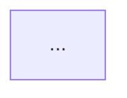

# Results-Based Management (RBM) - Global Affairs Canada Framework

**Tipo de Fuente**: Framework de Gestión Internacional
**Organización**: Global Affairs Canada (GAC) / Treasury Board of Canada Secretariat
**Ámbito**: International Development, Program Management, Performance Measurement
**Año**: Establecido ~1996, refinado 2000-2024
**Fuentes Principales**:
- GAC Results-Based Management Handbook (2016)
- Treasury Board RBM Policy (2000, updated 2016)
- UNDP RBM Handbook (2002)
**Idioma Original**: Inglés / Francés (documentos oficiales bilingües)
**Traducción**: Español (términos clave en inglés)
**Fecha de Acceso**: 2026-01-11
**Workbook**: workbook-product-md/
**Context**: Meta-framework que unifica Product Vision Board, Lean Canvas, SVPG, Arksey

---

## 1. Contexto e Historia de RBM

### 1.1. Origen del Results-Based Management

**Results-Based Management (RBM)** emerge en los 1990s como respuesta a críticas sobre efectividad de programas de desarrollo internacional:

**Problema Pre-RBM** (1960s-1980s):
- Proyectos medían **inputs** ($ gastado) y **activities** (workshops realizados)
- NO medían **outcomes** (cambios logrados en beneficiarios)
- **Accountability gap**: Difícil demostrar si proyectos lograron impacto real

**Reforma RBM** (1990s):
- **Shift**: De medir actividades → medir resultados
- **Accountability**: ¿Qué cambió en la vida de beneficiarios?
- **Evidence-based**: Decisiones basadas en data, no suposiciones

**Adopción Internacional**:
- **1996**: Treasury Board of Canada adopta RBM para todos los departamentos
- **2000**: UNDP (United Nations) publica RBM Handbook
- **2002**: World Bank integra RBM en project cycle
- **2010+**: USAID, EU, DFID (UK), GIZ (Germany) adoptan frameworks similares

### 1.2. Global Affairs Canada (GAC)

**Contexto Institucional**:
- **GAC** (antes CIDA - Canadian International Development Agency)
- Presupuesto: ~$6B CAD anuales (2024)
- Proyectos en 100+ países (desarrollo, humanitarian aid, peace and security)

**Por Qué GAC es Referente en RBM**:
- 25+ años usando RBM consistentemente
- RBM Handbook actualizado regularmente (última versión 2016)
- Training obligatorio para project managers
- Evaluaciones independientes cada 3-5 años

**Diferenciador GAC**:
- **Logic Model** mandatory para todos los proyectos
- **Performance Measurement Framework (PMF)** con indicators baselines/targets
- **Risk-Informed Management** (assumptions explícitas)

---

## 2. Definición y Principios de RBM

### 2.1. Definición Oficial

**Results-Based Management (RBM)**:
> "A management strategy that uses feedback loops to achieve strategic goals. RBM focuses on defining realistic expected results, monitoring progress toward the achievement of expected results, integrating lessons learned into management decisions, and reporting on performance."
> — Treasury Board of Canada Secretariat (2016)

**Componentes Clave**:
1. **Results-focused**: Mide outcomes, no solo outputs
2. **Feedback loops**: Usa data para ajustar estrategia
3. **Learning-oriented**: Integra lessons learned
4. **Accountability**: Reporta progreso transparentemente

### 2.2. Principios Fundamentales

#### Principio 1: Focus on Results, Not Activities

**Shift Conceptual**:
- ❌ **Activity-Based**: "Realizamos 10 workshops"
- ✅ **Results-Based**: "80% de participantes aplican conocimientos en su trabajo"

**Implicación**:
- Métricas deben medir **change** (cambio en beneficiarios), no **effort** (esfuerzo del equipo)

---

#### Principio 2: Results Chain (Causal Logic)

**Logic Model**: Inputs → Activities → Outputs → Outcomes → Impact

**Definiciones**:
- **Inputs**: Recursos invertidos (financieros, humanos, materiales)
- **Activities**: Acciones realizadas (trainings, construction, campaigns)
- **Outputs**: Productos/servicios entregados (# trained, km built, materials distributed)
- **Outcomes**: Cambios en beneficiarios (knowledge, behavior, conditions)
  - **Immediate**: Short-term (1-3 años)
  - **Intermediate**: Medium-term (3-5 años)
  - **Ultimate**: Long-term impact (5-10 años)
- **Impact**: Large-scale societal change (puede tomar décadas)

**Causal Assumptions**:
- IF tenemos Inputs adecuados → THEN podemos realizar Activities
- IF realizamos Activities → THEN producimos Outputs
- IF entregamos Outputs → THEN logramos Outcomes (ASSUMING external factors favorable)

---

#### Principio 3: Performance Measurement

**Indicators** para cada nivel:
- **Output Indicators**: Cuántos productos entregados (quantitative, easy to measure)
- **Outcome Indicators**: Qué cambió en beneficiarios (may require surveys, harder to attribute)

**Baselines + Targets**:
- **Baseline**: Situación antes de proyecto
- **Target**: Situación esperada al final
- **Actual**: Situación medida (compare con target)

**Example**:
```
Outcome: Improved food security for smallholder farmers
Indicator: % households with food insecure days per month
Baseline: 45% (año 0)
Target: 20% (año 3)
Actual: 28% (año 3 medido)
Result: 60% progreso hacia target (mejora pero no completamente)
```

---

#### Principio 4: Risk Management

**Assumptions** explícitas en Logic Model:
- Condiciones externas necesarias para que causalidad funcione
- Si assumption NO se cumple, results chain se rompe

**Example**:
```
Assumption: "Government maintains policy support for smallholder agriculture"
Risk: New government elimina subsidios → farmers can't adopt practices → outcome no logrado
Mitigation: Diversificar beneficiarios, advocacy con policymakers
```

---

#### Principio 5: Learning and Adaptation

**Adaptive Management**:
- Monitorear indicators regularmente (quarterly, annually)
- Si no estamos on-track, ajustar strategy (no solo "work harder")
- Document lessons learned para future projects

**Feedback Loops**:
```
Plan → Implement → Monitor → Evaluate → Learn → Adjust Plan
     ↑___________________________________________________|
```

---

## 3. Results Chain (Logic Model)

### 3.1. Estructura del Logic Model

**Visual Representation**:
```
┌─────────────┐     ┌─────────────┐     ┌─────────────┐
│   INPUTS    │────→│ ACTIVITIES  │────→│   OUTPUTS   │
└─────────────┘     └─────────────┘     └─────────────┘
                                               │
                                               ↓
┌─────────────────────────────────────────────────────┐
│                   OUTCOMES                          │
│  ┌──────────────┐  ┌──────────────┐  ┌──────────┐  │
│  │  IMMEDIATE   │→ │INTERMEDIATE  │→ │ ULTIMATE │  │
│  │  (1-3 years) │  │  (3-5 years) │  │(5-10 yrs)│  │
│  └──────────────┘  └──────────────┘  └──────────┘  │
└─────────────────────────────────────────────────────┘
                          │
                          ↓
                   ┌────────────┐
                   │   IMPACT   │
                   │ (Societal) │
                   └────────────┘
```

### 3.2. Niveles Detallados

#### Level 1: INPUTS (Recursos)

**Definición**: Recursos financieros, humanos, materiales, conocimiento invertidos.

**Tipos**:
- **Financial**: Budget, funding
- **Human**: Staff, consultants, volunteers
- **Material**: Equipment, infrastructure, supplies
- **Knowledge**: Research, expertise, data

**Example (Agricultural Project)**:
- $5M budget (5 años)
- 20 field staff + 5 project managers
- 50 demonstration plots equipados
- Technical manuals + training materials

**Measurement**: Típicamente NO se mide "success" de inputs (es dado), pero se rastrea:
- Budget utilization (% spent)
- Staff turnover
- Equipment functional status

---

#### Level 2: ACTIVITIES (Acciones)

**Definición**: Acciones/tareas realizadas por proyecto usando los inputs.

**Tipos Comunes**:
- **Training/Capacity Building**: Workshops, mentoring, on-the-job training
- **Service Delivery**: Providing healthcare, education, infrastructure
- **Advocacy**: Campaigns, policy dialogue, public awareness
- **Research**: Studies, pilots, evaluations

**Example (Agricultural Project)**:
- Conduct 100 farmer trainings en improved practices
- Establish 50 demonstration plots
- Provide micro-loans a 500 farmers
- Organize 20 farmer field days

**Measurement**:
- Activity completion (% trainings realizados)
- Timeliness (on schedule?)
- Cost per activity

---

#### Level 3: OUTPUTS (Productos/Servicios Entregados)

**Definición**: Productos, servicios, deliverables directos de las activities.

**Características**:
- Bajo control directo del proyecto
- Medibles objetivamente (count, volume)
- Short-term (entregados durante proyecto)

**Example (Agricultural Project)**:
- **Output 1**: 2,000 farmers trained en improved practices
- **Output 2**: 50 demonstration plots established y functioning
- **Output 3**: $500K en micro-loans disbursed a 500 farmers
- **Output 4**: 20 farmer field days conducted con 800 participants

**Indicators**:
- # farmers trained (target: 2,000)
- # demonstration plots functional (target: 50)
- $ loans disbursed (target: $500K)
- # field days conducted (target: 20)

**CRÍTICO**: Outputs NO son resultados finales, son MEDIOS para lograr outcomes.

---

#### Level 4: IMMEDIATE OUTCOMES (Resultados Inmediatos)

**Definición**: Cambios en **knowledge, skills, attitudes** de beneficiarios directos (1-3 años).

**Características**:
- Medibles al final de proyecto (o corto plazo después)
- Atribuibles razonablemente al proyecto
- Necesarios para outcomes superiores

**Example (Agricultural Project)**:
- **Immediate Outcome 1**: Farmers have knowledge of improved practices
  - Indicator: % farmers que pueden demostrar 3+ practices (target: 80%)
- **Immediate Outcome 2**: Farmers adopt improved practices
  - Indicator: % farmers usando 2+ practices en sus plots (target: 70%)
- **Immediate Outcome 3**: Farmers access credit for inputs
  - Indicator: % farmers con loan activo (target: 60%)

**Timeframe**: Típicamente logrados dentro de proyecto lifespan (1-3 años).

---

#### Level 5: INTERMEDIATE OUTCOMES (Resultados Intermedios)

**Definición**: Cambios en **behavior, practices, conditions** de beneficiarios (3-5 años).

**Características**:
- Requieren sustained adoption de immediate outcomes
- Parcialmente atribuibles (otros factores contribuyen)
- Observable 2-5 años después de proyecto start

**Example (Agricultural Project)**:
- **Intermediate Outcome 1**: Increased agricultural productivity
  - Indicator: Average yield increase 30% (target vs baseline)
- **Intermediate Outcome 2**: Improved household income
  - Indicator: Average income increase $500/year (target)
- **Intermediate Outcome 3**: Improved resilience to climate shocks
  - Indicator: % households able to cope with drought without selling assets (target: 60%)

**Timeframe**: 3-5 años (mid-term).

**Challenges**:
- Attribution difícil (otros proyectos, market forces contribuyen)
- Necesita seguimiento post-project

---

#### Level 6: ULTIMATE OUTCOMES (Resultados Finales)

**Definición**: Cambios de **alto nivel** en **wellbeing, status** de población beneficiaria (5-10 años).

**Características**:
- Long-term, broad changes
- Contribución del proyecto (NO atribución directa)
- Requiere otros actores/proyectos también

**Example (Agricultural Project)**:
- **Ultimate Outcome**: Improved food security and nutrition
  - Indicator: % households food secure 12 months/year (target: 80% vs 55% baseline)
  - Indicator: Child malnutrition rate decreased by 15 percentage points

**Timeframe**: 5-10 años (long-term).

**Challenges**:
- Difícil medir (requiere household surveys)
- Attribution imposible (múltiples factores contribuyen)
- Use "contribution story" instead de "caused by"

---

#### Level 7: IMPACT (Impacto Societal)

**Definición**: Cambios sistémicos, societal-level (10+ años, opcional en Logic Models).

**Características**:
- Sectoral or national-level changes
- NO atribuible a un solo proyecto
- Aspirational (guía estrategia, no mide éxito de proyecto individual)

**Example (Agricultural Sector)**:
- **Impact**: Reduced poverty in rural areas
  - National poverty rate decreased from 40% to 25%
- **Impact**: Sustainable agricultural sector
  - 50% of agricultural land under sustainable practices

**Nota GAC**: Impact level es opcional en Logic Models (muchos proyectos se detienen en Ultimate Outcome).

---

### 3.3. Causal Logic y Assumptions

**IF-THEN Statements**:
```
IF we have adequate inputs (budget, staff)
THEN we can conduct activities (trainings)

IF we conduct activities (trainings)
THEN we produce outputs (farmers trained)

IF we produce outputs (farmers trained)
THEN we achieve immediate outcomes (farmers adopt practices)
ASSUMING: Farmers have access to inputs, weather is favorable

IF we achieve immediate outcomes (farmers adopt)
THEN we achieve intermediate outcomes (increased productivity)
ASSUMING: Markets are accessible, prices are stable

IF we achieve intermediate outcomes (increased productivity)
THEN we achieve ultimate outcomes (food security)
ASSUMING: Political stability, no major shocks
```

**Assumptions** son CRÍTICAS:
- Si assumption NO se cumple, causal chain se rompe
- Proyecto debe monitorear assumptions (risk management)
- Si assumption cambia, proyecto adapta strategy

---

## 4. Performance Measurement Framework (PMF)

### 4.1. Estructura del PMF

**PMF** es tabla que acompaña Logic Model con columnas:

| Results Level | Indicator | Baseline | Target | Data Source | Frequency | Responsible |
|--------------|-----------|----------|--------|-------------|-----------|-------------|
| Ultimate Outcome | % households food secure | 55% | 80% | Household survey | Annual | M&E Officer |
| Intermediate Outcome | Average yield (kg/ha) | 1,200 | 1,800 | Farmer records | Annual | Field Officer |
| Immediate Outcome | % farmers adopting practices | 20% | 70% | Field monitoring | Quarterly | Field Officer |
| Output | # farmers trained | 0 | 2,000 | Training records | Monthly | Training Coord |

### 4.2. Tipos de Indicators

#### Output Indicators (Quantitative, Direct)

**Características**:
- Fácil de medir (project records)
- Bajo control del proyecto
- NO sufficient para medir success (outputs ≠ outcomes)

**Examples**:
- # people trained
- # services delivered
- # products distributed
- $ disbursed

---

#### Outcome Indicators (May Be Qualitative, Indirect)

**Tipos**:

1. **Knowledge Indicators** (Immediate Outcome):
   - % participants who can correctly answer knowledge test
   - % participants who report understanding concepts

2. **Behavior Indicators** (Immediate → Intermediate):
   - % farmers using improved practices
   - % households adopting hygiene behaviors
   - % businesses implementing quality standards

3. **Condition Indicators** (Intermediate → Ultimate):
   - Average income level
   - Prevalence of disease
   - Food security index
   - Child malnutrition rate

**Challenges**:
- Harder to measure (require surveys, observations)
- Attribution difficult (external factors)
- May require baseline + endline data collection

---

### 4.3. SMART Indicators

**Framework para buenos indicators** (GAC requirement):

**S - Specific**: Clearly defined, no ambiguity
- ❌ "Improved wellbeing" (vague)
- ✅ "% households with income >$2/day"

**M - Measurable**: Quantifiable con data available
- ❌ "Farmers are happier" (subjective)
- ✅ "% farmers reporting satisfaction >7/10"

**A - Achievable**: Realistic target dado context
- ❌ "Poverty eliminated" (unrealistic para 3-year project)
- ✅ "Poverty rate reduced 10 percentage points"

**R - Relevant**: Aligned con outcome, meaningful change
- ❌ "# workshops conducted" (output, not outcome indicator)
- ✅ "% participants applying knowledge"

**T - Time-bound**: Timeframe specified
- ❌ "Eventually food security improves"
- ✅ "Food security improves by Year 3"

---

### 4.4. Baselines y Targets

#### Baseline

**Definición**: Situación antes de proyecto (Year 0 o Year 1 early).

**Collection Methods**:
- Household surveys
- Administrative data (government statistics)
- Rapid assessment
- Literature review (if no primary data)

**Example**:
```
Outcome: Improved food security
Indicator: % households food insecure
Baseline: 45% (household survey, n=500, Year 0)
```

**Importance**:
- Sin baseline, imposible medir change
- "We trained 2,000 farmers" significa nada sin saber qué cambió

---

#### Target

**Definición**: Resultado esperado al final de proyecto.

**Setting Targets**:
- Basado en evidence (similar projects achieved X%)
- Realistic (no overpromise)
- Ambitious but achievable (stretch goal)

**Example**:
```
Baseline: 45% food insecure
Target: 20% food insecure (by Year 3)
→ 25 percentage point reduction (56% improvement)
```

**Considerations**:
- External factors (drought, conflict) afectan achievability
- Adjust targets si context cambia significativamente

---

### 4.5. Data Collection

**Data Sources** comunes:

1. **Administrative Records**:
   - Project records (trainings, loans disbursed)
   - Government statistics (health, education data)
   - Low cost, but may lack quality

2. **Surveys**:
   - Household surveys (baseline, midline, endline)
   - Beneficiary feedback surveys
   - High cost, but robust data

3. **Monitoring Visits**:
   - Field observations
   - Key informant interviews
   - Moderate cost, qualitative insights

4. **Case Studies**:
   - In-depth stories de change
   - Qualitative, illustrative (not statistically representative)

**Frequency**:
- **Outputs**: Monthly or quarterly (easy to track)
- **Immediate Outcomes**: Quarterly or annually
- **Intermediate/Ultimate Outcomes**: Annually or at endline

---

## 5. Theory of Change

### 5.1. Definición

**Theory of Change (ToC)**:
> "A comprehensive description and illustration of how and why a desired change is expected to happen in a particular context. It maps out causal pathways from activities to outcomes, making assumptions explicit."

**Relación con Logic Model**:
- Logic Model: Visual diagram (boxes + arrows)
- Theory of Change: **Narrative** explicando WHY causal links work

### 5.2. Componentes de ToC

#### 1. Context Analysis

**Pregunta**: ¿Cuál es el problema que queremos resolver?

**Content**:
- Situación actual (baseline conditions)
- Root causes del problema
- Stakeholders (quién afecta y quién es afectado)
- Assumptions sobre context

**Example (Food Insecurity)**:
```
Context: 45% of households en región X experimentan food insecurity.

Root Causes:
- Low agricultural productivity (yield 50% below national average)
- Limited access to credit (only 20% farmers have loans)
- Poor market access (farmers sell at 30% below market price)
- Climate vulnerability (droughts cada 3 años)

Stakeholders:
- Smallholder farmers (beneficiarios directos)
- Government extension services (partners)
- Microfinance institutions (credit providers)
- Agro-input suppliers (private sector)
```

---

#### 2. Results Pathways

**Pregunta**: ¿Cómo lograremos cambio?

**Content**: Narrative de cada link en Logic Model

**Example**:
```
Pathway 1: Training → Knowledge → Adoption → Productivity

IF we conduct farmer trainings en improved practices (Activity)
THEN farmers gain knowledge de techniques (Output + Immediate Outcome)
BECAUSE trainings are practical, hands-on, culturally appropriate

IF farmers gain knowledge
THEN farmers adopt practices en sus plots (Immediate Outcome)
BECAUSE demonstrations show clear benefits, inputs are accessible
ASSUMING: Weather is favorable, no major shocks

IF farmers adopt practices
THEN agricultural productivity increases 30% (Intermediate Outcome)
BECAUSE improved practices are evidence-based (research-proven)
ASSUMING: Markets remain stable, prices don't collapse

IF productivity increases
THEN household income increases $500/year (Intermediate Outcome)
BECAUSE surplus production is sold at markets

IF income increases
THEN food security improves (Ultimate Outcome)
BECAUSE households can afford diverse diets year-round
ASSUMING: Food is available in markets, no price spikes
```

---

#### 3. Assumptions Mapping

**Pregunta**: ¿Qué debe ser cierto para que pathways funcionen?

**Tipos de Assumptions**:

1. **Contextual**: External factors fuera de control del proyecto
   - Political stability
   - Economic conditions
   - Weather/climate

2. **Behavioral**: Stakeholder actions/responses
   - Farmers will attend trainings
   - Government maintains support
   - Markets remain accessible

3. **Technical**: Effectiveness of interventions
   - Training metodología es effective
   - Improved practices work en local context
   - Micro-loans terms are appropriate

**Risk Management**:
- **High likelihood + High impact**: Monitor closely, have mitigation plan
- **Low likelihood + High impact**: Contingency plan
- **High likelihood + Low impact**: Accept risk
- **Low likelihood + Low impact**: Ignore

---

#### 4. Alternative Pathways

**Pregunta**: ¿Hay otras formas de lograr outcomes?

**Consideration**:
- ToC debe reconocer que proyecto NO es única influencia
- Otros proyectos, government programs, market forces contribuyen

**Example**:
```
Alternative Pathway (No Controlado por Proyecto):
- Government subsidizes fertilizer → Farmers access inputs → Productivity increases

Implication:
- Proyecto puede contribute pero not sole cause
- Use "contribution" language, not "attribution"
```

---

### 5.3. Diferencia: Theory of Change vs Logic Model

| Aspecto | Logic Model | Theory of Change |
|---------|------------|------------------|
| **Format** | Visual diagram (boxes + arrows) | Narrative document (5-10 páginas) |
| **Detail** | High-level, concise | Detailed, explanatory |
| **Purpose** | Show WHAT results we expect | Explain WHY/HOW results happen |
| **Assumptions** | Listed separately | Integrated in narrative |
| **Audience** | Managers, donors (quick overview) | Evaluators, researchers (deep understanding) |

**Complementarity**:
- Logic Model: 1-page summary para presentations
- Theory of Change: Full document para evaluations, learning

---

## 6. Risk Management en RBM

### 6.1. Risk-Informed Planning

**Concepto**: Identificar risks to results desde inicio (no esperar a que ocurran).

**Risk Types**:

1. **Contextual Risks**: External factors
   - Political instability, conflict
   - Economic crisis, inflation
   - Natural disasters, climate shocks

2. **Programmatic Risks**: Implementation issues
   - Staff turnover, capacity gaps
   - Partner reliability
   - Technology failures

3. **Reputational Risks**: Image, credibility
   - Fraud, corruption
   - Safeguarding incidents
   - Poor quality delivery

---

### 6.2. Risk Register

**Format**:

| Risk Description | Likelihood | Impact | Mitigation Strategy | Contingency Plan | Owner |
|-----------------|------------|--------|---------------------|------------------|-------|
| Drought reduces crop yields | High | High | Promote drought-resistant varieties | Emergency food assistance | Program Manager |
| Government changes agricultural policy | Medium | Medium | Regular policy dialogue, advocacy | Pivot to alternative crops | Policy Advisor |
| Partner organization loses funding | Low | High | Diversify partnerships | Direct implementation | Partnerships Officer |

**Scoring**:
- **Likelihood**: Low (10%), Medium (30%), High (60%)
- **Impact**: Low (minor delay), Medium (outcomes partially affected), High (outcomes not achieved)

**Overall Risk Score**: Likelihood × Impact

---

### 6.3. Adaptive Management

**Process**:
1. **Monitor** indicators + risk register quarterly
2. **Analyze** trends: On track? Off track?
3. **Decide**: Continue, adjust, or pivot?
4. **Implement** adjustments
5. **Document** lessons learned

**Example Adaptation**:
```
Monitoring Data (Quarter 3):
- Only 40% of farmers attending trainings (target: 70%)
- Reason: Timing conflicts with planting season

Analysis:
- Current schedule NO funciona

Decision:
- Adjust training calendar to off-season months
- Offer evening sessions for flexibility

Implementation:
- Revised schedule, re-invite farmers

Result (Quarter 4):
- Attendance improved to 65%

Lesson Learned:
- Consult farmers on timing BEFORE scheduling trainings
```

---

## 7. RBM en Comparación con Otros Frameworks

### 7.1. RBM vs Product Vision Board (Pichler)

| Aspecto | RBM-GAC | Product Vision Board |
|---------|---------|---------------------|
| **Niveles jerárquicos** | 7 (Inputs → Impact) | 3 (Vision → Target/Needs/Product → Goals) |
| **Timeframe** | 1-10 años (multi-scale) | 2-5 años (strategic) |
| **Causal logic** | ✅ Explicit (Logic Model) | ❌ Implicit |
| **Indicators** | ✅ PMF con baselines/targets | ⚠️ Business Goals (high-level) |
| **Assumptions** | ✅ Explicit, risk management | ❌ No incluye |
| **Aplicación** | Development programs | Product strategy |

**Integración**:
- Vision Board **Vision** = RBM **Ultimate Outcome**
- Vision Board **Business Goals** = RBM **Intermediate Outcomes**
- Vision Board **Product** = RBM **Outputs** (deliverables)
- RBM añade: **Activities** + **Inputs** + **Assumptions** + **PMF**

---

### 7.2. RBM vs Lean Canvas (Maurya)

| Aspecto | RBM-GAC | Lean Canvas |
|---------|---------|-------------|
| **Focus** | Results/outcomes | Business model |
| **Estructura** | 7 niveles jerárquicos | 9 bloques planos |
| **Causal logic** | ✅ Results Chain | ❌ No causal (components relationships) |
| **Metrics** | Outcome indicators | Key Metrics (AARRR) |
| **Revenue/Cost** | ❌ No incluye (out of scope) | ✅ Explicit |
| **Aplicación** | Programs, projects | Startups, businesses |

**Integración**:
- Lean Canvas **UVP** = RBM **Ultimate Outcome** (value delivered)
- Lean Canvas **Solution** = RBM **Outputs** (products/services)
- Lean Canvas **Key Metrics** = RBM **PMF Indicators**
- RBM añade: **Causal chain** (cómo Solution leads to UVP)

---

### 7.3. RBM vs SVPG (Cagan)

| Aspecto | RBM-GAC | SVPG (Inspired) |
|---------|---------|----------------|
| **Focus** | Results measurement | Product discovery + delivery |
| **Objectives** | 7-level Results Chain | 2-level OKR (Objective + Key Results) |
| **Causal logic** | ✅ Logic Model | ⚠️ Implicit (OKRs link objectives → results) |
| **Discovery** | ❌ No process detail | ✅ 4 risks (value, usability, feasibility, viability) |
| **Principles** | ❌ No incluye | ✅ Explicit, prioritized |
| **Aplicación** | Programs, measurement | Product development, teams |

**Integración**:
- SVPG **Objective** = RBM **Intermediate Outcome**
- SVPG **Key Results** = RBM **Outcome Indicators**
- RBM añade: **Ultimate Outcome** (long-term vision) + **Outputs/Activities** (implementation detail)
- SVPG añade: **Discovery process** (how to validate assumptions)

---

### 7.4. RBM vs Scoping Review (Arksey)

| Aspecto | RBM-GAC | Arksey Scoping Review |
|---------|---------|----------------------|
| **Purpose** | Plan + measure program results | Map + synthesize literature |
| **Stages** | 7 levels (Inputs → Impact) | 6 stages (Question → Consultation) |
| **Causal logic** | ✅ Results Chain | ❌ No causal (research process) |
| **Outputs** | PMF, Logic Model, ToC | Literature synthesis, gap analysis |
| **Domain** | Program management | Research methodology |

**Integración**:
- Arksey **Research Question** ≈ RBM **Ultimate Outcome** (what we want to understand/achieve)
- Arksey **Data Charting** ≈ RBM **Monitoring** (systematic data collection)
- Arksey **Reporting** ≈ RBM **Performance Reporting** (synthesize findings)
- RBM añade: **Causal logic** (how activities lead to outcomes)

---

### 7.5. RBM como META-Framework

**Observación**: RBM **CONTIENE** elementos de todos los frameworks:

```
RBM Results Chain INCLUDES:
├─ Vision/Strategy Level
│  ├─ Ultimate Outcome = Product Vision (Pichler)
│  ├─ Ultimate Outcome = UVP (Maurya)
│  └─ Ultimate Outcome = WHO/WHAT/WHY (Cagan)
│
├─ Objectives Level
│  ├─ Intermediate Outcomes = Business Goals (Pichler)
│  ├─ Intermediate Outcomes = Revenue Streams (Maurya)
│  └─ Intermediate Outcomes = Objectives (Cagan OKR)
│
├─ Features Level
│  ├─ Immediate Outcomes = Key Features (Pichler Product)
│  ├─ Immediate Outcomes = Solution (Maurya)
│  └─ Immediate Outcomes = Product Capabilities (Cagan)
│
├─ Deliverables Level
│  ├─ Outputs = Functional Requirements (spec-workflow requirements.md)
│  ├─ Outputs = Deliverables (Scrum Definition of Done)
│  └─ Outputs = Product Increments (Agile)
│
├─ Implementation Level
│  ├─ Activities = User Stories (tasks.md)
│  ├─ Activities = Sprint Backlog
│  └─ Activities = Development Tasks
│
└─ Resources Level
   ├─ Inputs = Budget, Team (NOT in product.md currently)
   └─ Inputs = Dependencies (tech.md partially)
```

**Implicación**: RBM provee **JERARQUÍA COMPLETA** que otros frameworks no tienen.

---

## 8. Aplicación de RBM a Product Management

### 8.1. Mapeo: RBM ↔ spec-workflow-mcp

**Propuesta de Integración**:

| RBM Level | spec-workflow Document | Section | Current Status |
|-----------|----------------------|---------|---------------|
| **Ultimate Outcome** | product.md | Product Purpose + Vision Timeframe | ⚠️ Parcial (falta timeframe) |
| **Intermediate Outcomes** | product.md | Business Objectives | ⚠️ Parcial (falta OKR structure) |
| **Immediate Outcomes** | product.md | Key Features | ✅ Existe |
| **Outputs** | requirements.md | Functional Requirements | ✅ Existe |
| **Activities** | tasks.md | User Stories | ✅ Existe |
| **Tasks** | tasks.md | Sprint Tasks | ✅ Existe |
| **Inputs** | ❌ NO existe | ❌ NO documentado | ❌ GAP |

**Gaps Identificados**:
1. ❌ No hay **Logic Model visual** (causal chain explícita)
2. ❌ No hay **Performance Measurement Framework** (indicators con baselines/targets completos)
3. ❌ No hay **Assumptions** explícitas (risk management)
4. ❌ No hay **Theory of Change** narrative (por qué causalidad funciona)
5. ❌ No hay **Inputs** documentados (budget, resources, dependencies)

---

### 8.2. Example: DAATH-ZEN con RBM

#### Logic Model DAATH-ZEN

```
┌─────────────────────────────────────────────────────────────┐
│ ULTIMATE OUTCOME (2028)                                     │
│ 10M developers create high-quality specs with 100%         │
│ source traceability, reducing spec time 90%                │
└─────────────────────────────────────────────────────────────┘
                          ↑
                          │
        ┌─────────────────┴─────────────────┐
        │                                   │
┌───────────────────────┐     ┌───────────────────────┐
│ INTERMEDIATE OUTCOME 1│     │ INTERMEDIATE OUTCOME 2│
│ (2027)                │     │ (2027)                │
│ Spec creation time    │     │ Knowledge reuse       │
│ reduced from 8h to    │     │ across projects via   │
│ <1h (90% reduction)   │     │ atomic concepts       │
└───────────────────────┘     └───────────────────────┘
        ↑                                ↑
        │                                │
┌───────────────────────┐     ┌───────────────────────┐
│ IMMEDIATE OUTCOME 1   │     │ IMMEDIATE OUTCOME 2   │
│ (2026)                │     │ (2026)                │
│ Developers use        │     │ Developers reuse      │
│ Scoping Review        │     │ Neo4j GraphRAG for    │
│ methodology for specs │     │ concept discovery     │
└───────────────────────┘     └───────────────────────┘
        ↑                                ↑
        │                                │
┌───────────────────────┐     ┌───────────────────────┐
│ OUTPUT 1              │     │ OUTPUT 2              │
│ 5-Workbook templates  │     │ Neo4j concept database│
│ (literatura→analysis  │     │ with 1000+ concepts   │
│ →atomics→compilation) │     │ and CITED_IN relations│
└───────────────────────┘     └───────────────────────┘
        ↑                                ↑
        │                                │
┌───────────────────────┐     ┌───────────────────────┐
│ ACTIVITIES            │     │ ACTIVITIES            │
│ - Create workbook     │     │ - Index literature    │
│   templates           │     │ - Atomize concepts    │
│ - Document Scoping    │     │ - Generate embeddings │
│   Review methodology  │     │ - Ingest to Neo4j     │
│ - Develop validators  │     │ - Build search API    │
└───────────────────────┘     └───────────────────────┘
        ↑                                ↑
        │                                │
┌───────────────────────────────────────────────────────┐
│ INPUTS                                                │
│ - $0 budget (open-source, volunteer effort)          │
│ - 2 developers × 20h/week × 12 months = 2,080h       │
│ - Neo4j Community Edition (free)                     │
│ - Python, Jinja2, Ollama (free/open-source)          │
│ - GitHub repo, documentation                         │
└───────────────────────────────────────────────────────┘
```

#### Performance Measurement Framework DAATH-ZEN

| Level | Indicator | Baseline (2026) | Target | Timeline | Data Source |
|-------|-----------|----------------|--------|----------|-------------|
| **Ultimate Outcome** | # active users globally | 0 | 10M | 2028 | GitHub analytics |
| | % specs with 100% traceability | 0% | 95% | 2028 | Validator logs |
| | Average spec creation time | 8h | <1h | 2028 | User surveys |
| **Intermediate Outcome 1** | Average spec creation time | 8h | <1h | 2027 | Time tracking |
| | % users reporting "significantly faster" | N/A | 80% | 2027 | User surveys |
| **Intermediate Outcome 2** | # concepts in Neo4j database | 50 | 1,000 | 2027 | Database query |
| | % specs reusing ≥3 concepts | 0% | 60% | 2027 | Neo4j analytics |
| **Immediate Outcome 1** | % users understanding Scoping Review | N/A | 70% | 2026 | Knowledge quiz |
| | % specs following workbook structure | 0% | 80% | 2026 | Validator checks |
| **Immediate Outcome 2** | % users using GraphRAG search | N/A | 50% | 2026 | API logs |
| | Average search queries per user/week | 0 | 10 | 2026 | API analytics |
| **Output 1** | # workbook templates created | 0 | 10 | 2026 | GitHub repo |
| | # validators implemented | 0 | 5 | 2026 | Code count |
| **Output 2** | # concepts indexed | 50 | 1,000 | 2026 | Neo4j count |
| | # literature sources documented | 0 | 100 | 2026 | 1-literature/ |

#### Theory of Change DAATH-ZEN

**Context**:
Developers spend 8+ hours creating specifications manually, with frequent gaps in source citations and difficulty reusing knowledge across projects. Current approaches (generic templates, Wikipedia) lack methodology and traceability.

**Results Pathway 1: Scoping Review Methodology**

IF we create 5-workbook templates with Scoping Review methodology (Activity + Output)
THEN developers learn and apply epistemological workflow (Immediate Outcome)
BECAUSE templates provide structure and guidance, validators enforce compliance

IF developers apply Scoping Review methodology (Immediate Outcome)
THEN spec creation time reduces from 8h to <1h (Intermediate Outcome)
BECAUSE systematic approach eliminates manual searching and synthesis
ASSUMING: Developers have access to literature sources, templates are user-friendly

IF spec creation time reduces 90% (Intermediate Outcome)
THEN adoption scales to 10M users globally (Ultimate Outcome)
BECAUSE time savings are compelling, word-of-mouth spreads
ASSUMING: Open-source community contributes, no major competitors emerge

**Results Pathway 2: GraphRAG Knowledge Reuse**

IF we index 1,000+ concepts in Neo4j with CITED_IN relationships (Activity + Output)
THEN developers discover and reuse concepts via semantic search (Immediate Outcome)
BECAUSE GraphRAG provides relevant results, embeddings enable semantic matching

IF developers reuse concepts (Immediate Outcome)
THEN knowledge accumulates across projects, reducing redundant work (Intermediate Outcome)
BECAUSE each spec contributes concepts, database grows, network effects emerge
ASSUMING: Concepts are high-quality, Neo4j scales, community contributes

IF knowledge reuse scales (Intermediate Outcome)
THEN 10M developers create specs with 100% traceability (Ultimate Outcome)
BECAUSE reuse amplifies value, traceability is built-in
ASSUMING: Developers value traceability, no regulatory barriers

**Critical Assumptions**:
1. Developers are motivated by time savings (validated: 8h → <1h is significant)
2. Open-source model attracts contributors (risk: volunteer burnout)
3. Scoping Review methodology is learnable by tech audience (assumption: need training materials)
4. Neo4j Community Edition scales to 10M users (risk: may need commercial license)
5. No major competitor emerges with superior solution (risk: market disruption)

---

### 8.3. Enhancements to product.md Format

**Propuesta**: Añadir secciones RBM a product.md

#### New Section: Results Chain (Logic Model)

```markdown
## Results Chain

### Ultimate Outcome (2026-2028)
[Vision statement with timeframe + quantified target]

### Intermediate Outcomes (2027)
[Business Objectives structured as outcomes, not outputs]

### Immediate Outcomes (2026)
[Key Features as capabilities that deliver outcomes]

### Outputs (Deliverables)
[Link to requirements.md functional requirements]

### Activities (Implementation)
[Link to tasks.md user stories]

### Inputs (Resources)
[Budget, team, infrastructure, dependencies]

### Visual Logic Model

```

#### New Section: Assumptions & Risks

```markdown
## Assumptions & Risks

### Critical Assumptions
| Assumption | Likelihood | Impact if False | Mitigation |
|------------|------------|----------------|------------|
| [Assumption 1] | High | High | [Strategy] |
| [Assumption 2] | Medium | Medium | [Strategy] |

### Risk Register
| Risk | Likelihood | Impact | Mitigation | Contingency |
|------|------------|--------|------------|-------------|
| [Risk 1] | High | High | [Plan] | [Backup] |
```

#### Enhanced Section: Success Metrics → PMF

```markdown
## Performance Measurement Framework

| Results Level | Indicator | Baseline | Target | Data Source | Frequency |
|--------------|-----------|----------|--------|-------------|-----------|
| Ultimate Outcome | [Indicator] | [Baseline] | [Target] | [Source] | Annual |
| Intermediate Outcome | [Indicator] | [Baseline] | [Target] | [Source] | Quarterly |
| Immediate Outcome | [Indicator] | [Baseline] | [Target] | [Source] | Monthly |
| Output | [Indicator] | [Baseline] | [Target] | [Source] | Weekly |
```

---

## 9. Ventajas y Limitaciones de RBM

### 9.1. Ventajas

✅ **Comprehensive**: Cubre strategy → execution (7 niveles)
✅ **Causal Logic**: Explícita (Logic Model visual + Theory of Change narrative)
✅ **Accountability**: Indicators con baselines/targets, reportable
✅ **Learning-Oriented**: Adaptive management, lessons learned integrados
✅ **Risk-Informed**: Assumptions explícitas, mitigation plans
✅ **Proven**: 25+ años de uso en international development, refinado continuamente
✅ **Scalable**: Aplica a proyectos pequeños ($10K) y grandes ($100M+)

### 9.2. Limitaciones

⚠️ **Complexity**: 7 niveles pueden ser overwhelming para proyectos simples
⚠️ **Attribution Challenge**: Outcomes afectados por factores externos, difícil probar causalidad
⚠️ **Data Intensive**: PMF requiere baseline + monitoring data (costoso)
⚠️ **Rigidity**: Logic Model fijo puede limitar adaptation (aunque RBM promueve adaptive management)
⚠️ **Overhead**: Theory of Change, PMF, Risk Register requieren tiempo/effort
⚠️ **Context**: Desarrollado para international development (puede no fit perfectly a tech products)

### 9.3. Cuándo Usar RBM vs Otros Frameworks

**Use RBM cuando**:
- ✅ Proyecto es **complex** (múltiples stakeholders, long-term)
- ✅ Necesitas **accountability** fuerte (donors, board, government)
- ✅ **Outcomes** son críticos (no solo outputs)
- ✅ Tienes **resources** para monitoring (M&E staff, budget)

**Use frameworks más ligeros** (Pichler, Maurya) cuando:
- ⏸ Proyecto es **simple** (1-2 features, corto plazo)
- ⏸ Speed over rigor (startup MVP, time-to-market crítico)
- ⏸ Resources limitados (solo founder, bootstrap)

**Hybrid Approach** (recomendado para spec-workflow-mcp):
- Use RBM **conceptos** (Results Chain, PMF, Assumptions)
- Pero **simplify** implementation (1-page Logic Model, not 50-page ToC)
- Integrate con Pichler/Maurya/Cagan (RBM como backbone, otros como components)

---

## 10. Herramientas y Recursos RBM

### 10.1. Software para Logic Models

**Microsoft Visio / Lucidchart**:
- Diagramming tools (boxes + arrows)
- Templates disponibles para Logic Models

**Mermaid (Markdown)**:
- Code-based diagrams (Git-friendly)
- Example: `graph TD; A[Inputs] --> B[Activities]`

**Theory of Change Online**:
- URL: https://www.theoryofchange.org/toc-online/
- Free web tool para crear Logic Models interactivos

---

### 10.2. Templates GAC

**Global Affairs Canada Resources**:
- RBM Handbook (2016): https://www.international.gc.ca/world-monde/funding-financement/rbm-gar.aspx
- Logic Model Template (Excel)
- PMF Template (Excel)
- Risk Register Template (Excel)

---

### 10.3. Training Resources

**Online Courses**:
- UNDP RBM e-Learning: https://www.undp.org/content/undp/en/home/librarypage/results-based-management.html
- World Bank Open Learning Campus: Results-Based Financing

**Books**:
- "Getting to Outcomes" (Duignan, 2003)
- "Measuring Program Outcomes" (United Way, 1996)

---

## 11. Referencias

### 11.1. Fuentes Principales

- **Global Affairs Canada (2016)**. Results-Based Management Handbook.
  URL: https://www.international.gc.ca/world-monde/funding-financement/rbm-gar.aspx

- **Treasury Board of Canada Secretariat (2016)**. Policy on Results.
  URL: https://www.tbs-sct.canada.ca/pol/doc-eng.aspx?id=31300

- **UNDP (2002)**. Handbook on Monitoring and Evaluating for Results.
  URL: http://web.undp.org/evaluation/handbook/

### 11.2. Frameworks Relacionados

- **Logical Framework Approach (LogFrame)**: Predecessor de RBM (1970s, USAID)
- **Theory of Change**: Complemento narrativo a Logic Model
- **Outcome Mapping**: Focus en behavioral change (IDRC, Canada)

### 11.3. Academic Literature

- McLaughlin, J. A., & Jordan, G. B. (1999). "Logic models: a tool for telling your program's performance story." *Evaluation and Program Planning*, 22(1), 65-72.

- Mayne, J. (2001). "Addressing attribution through contribution analysis: using performance measures sensibly." *Canadian Journal of Program Evaluation*, 16(1), 1-24.

---

## 12. Notas para Atomización (3-atomics/)

**Conceptos clave a extraer**:

1. **concept-rbm-logic-model.json**: 7 niveles (Inputs → Impact), causal chain
2. **concept-rbm-results-chain.json**: IF-THEN statements, assumptions
3. **concept-ultimate-outcome.json**: Long-term impact (5-10 años)
4. **concept-intermediate-outcome.json**: Behavioral/condition changes (3-5 años)
5. **concept-immediate-outcome.json**: Knowledge/skills/attitudes (1-3 años)
6. **concept-outputs.json**: Productos/servicios entregados (vs outcomes)
7. **concept-activities.json**: Acciones realizadas (vs outputs delivered)
8. **concept-inputs.json**: Recursos invertidos (budget, staff, materials)
9. **concept-pmf.json**: Performance Measurement Framework (indicators, baselines, targets)
10. **concept-theory-of-change.json**: Narrative explicando causal pathways
11. **concept-assumptions.json**: Condiciones necesarias para causalidad
12. **concept-contribution-vs-attribution.json**: Difference in causality claims

**Términos en inglés** (mantener en atomic concepts):
- Results-Based Management (RBM)
- Logic Model
- Results Chain
- Ultimate Outcome, Intermediate Outcome, Immediate Outcome
- Outputs, Activities, Inputs
- Performance Measurement Framework (PMF)
- Theory of Change (ToC)
- Assumptions
- Indicators (SMART)
- Baseline, Target
- Contribution vs Attribution

**Relaciones con otros conceptos**:
- RBM Ultimate Outcome ↔ Pichler Vision
- RBM Intermediate Outcomes ↔ Pichler Business Goals
- RBM Immediate Outcomes ↔ Pichler Product (Key Features)
- RBM Outputs ↔ Maurya Solution
- RBM PMF ↔ Maurya Key Metrics (AARRR)
- RBM Intermediate Outcomes ↔ Cagan Objectives (OKR)
- RBM PMF Indicators ↔ Cagan Key Results
- RBM Logic Model ↔ Arksey Scoping Review (ambos systematic frameworks)

---

**Documento completado**: 2026-01-11
**Workbook**: workbook-product-md/
**Próximo paso**: analysis-004 (Integrating RBM with Product Frameworks)
**Status**: ✅ Literatura RBM-GAC documentada (meta-framework que unifica los otros)
**Key Insight**: RBM provee JERARQUÍA COMPLETA (7 niveles) que otros frameworks no tienen, conectando strategy → execution con causal logic explícita
