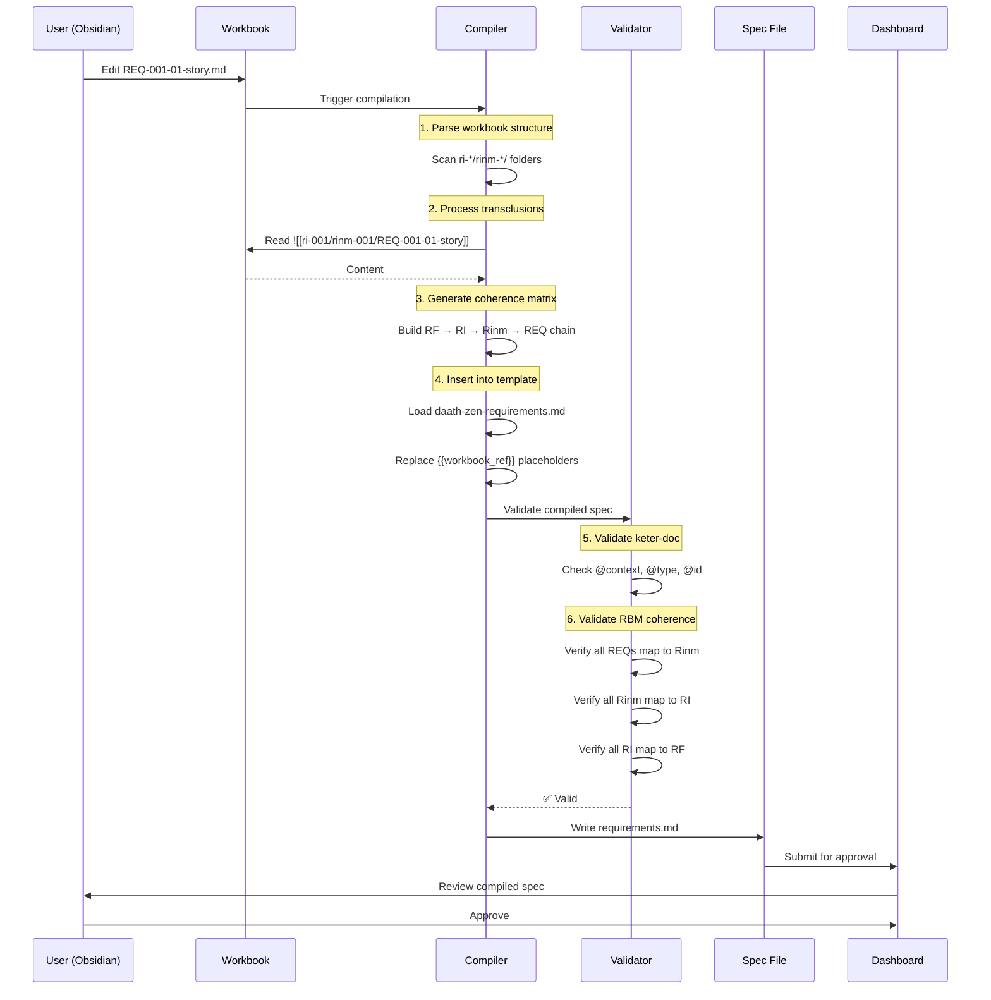

# SPEC-001: Analysis & Best Practices Recommendations

## Metadata

| Campo | Valor |
|-------|-------|
| **Document Type** | Technical Analysis |
| **Date** | 2026-01-10 |
| **Version** | 1.0.0 |
| **Status** | Draft for Review |
| **Author** | GitHub Copilot (Claude Sonnet 4.5) |
| **Purpose** | Guide SPEC-001 requirements writing |

---

## Executive Summary

This document provides **deep analysis** and **best practice recommendations** for writing **SPEC-001: Built Template spec-workflow**. It consolidates findings from chat analysis, theoretical modeling, and architectural decisions.

### Core Understanding
SPEC-001 is a **meta-specification** that defines:
1. How all future specs will be structured
2. Template system with inheritance
3. RBM-workbook integration
4. Keter-doc protocol (JSON-LD)
5. Compilation and validation tools

**Critical Insight**: This is not software development—this is **language design**. We're creating the grammar for expressing research specifications.

---

## 🧠 Deep Learning Analysis

### Understanding Layer 1: The Problem SPEC-001 Solves

#### Current State (Without SPEC-001)
```
spec-workflow-mcp templates (generic)
    ↓
requirements.md (monolithic, duplicated)
design.md (monolithic, duplicated)
tasks.md (monolithic, duplicated)
    ↓
No traceability to RBM
No evolution mechanism
No reusable content
```

**Pain Points**:
- Every spec rewrites user stories from scratch
- Architectural decisions duplicated across specs
- No connection to research methodology (RBM)
- Can't track "why" (causality) behind requirements
- Templates don't improve over time

#### Target State (With SPEC-001)
```
daath-zen-base.md (inherited headers)
    ↓
daath-zen-requirements.md (template + workbook refs)
    ↓ references
wb-rbm-spec/ (modular, evolving workbook)
├── resultado_final.md
├── ri-001/ (features)
│   └── rinm-001/ (products)
│       ├── REQ-001-story.md
│       └── REQ-002-rule.md
    ↓ compile
requirements.md (for spec-workflow-mcp)
    ↓
Triple persistence (MD + Graph + Vector)
```

**Solutions**:
- Templates provide structure, workbooks provide content
- Content reused across specs
- RBM causality tracked in folder hierarchy
- Templates evolve via autopoietic feedback
- Semantic interoperability via JSON-LD

---

### Understanding Layer 2: Architectural Decisions

#### Decision 1: Hybrid Modular-Monolithic Architecture

**Rationale**:
```
Constraint: spec-workflow-mcp expects single-file artifacts
Need: Modular, reusable content
Solution: Compile modular → monolithic
```

**Implementation**:
```python
# compile_spec_from_workbook.py
def compile_requirements(workbook_path, output_path):
    """
    1. Parse workbook RBM structure
    2. Process Obsidian transclusions ![[]]
    3. Generate coherence matrix
    4. Insert into template
    5. Validate against keter-doc protocol
    6. Write monolithic requirements.md
    """
```

**Best Practice**:
- User **never** edits requirements.md directly
- User edits workbook in Obsidian
- AI compiles on demand or file-watch trigger
- Compiled file is **read-only snapshot**

#### Decision 2: RBM as File System Pattern

**Rationale**:
```
Problem: RBM is a "methodology to apply"
Solution: Encode RBM in folder structure
```

**Pattern**:
```
wb-rbm-spec/
├── resultado_final.md              # 1 per spec
├── ri-001-feature-x/               # N intermediate results
│   ├── ri-001.md                   # Feature overview
│   └── rinm-001-product-y/         # M immediate results
│       ├── overview.md
│       ├── REQ-001-01-story.md     # P products
│       ├── REQ-001-02-rule.md
│       └── metrics.yaml
├── ri-002-feature-z/
│   └── rinm-001-product-w/
│       └── REQ-002-01-story.md
```

**Traceability**:
```
Path: wb-rbm-spec/ri-001/rinm-001/REQ-001-01-story.md
Decodes to:
- Intermediate Result: RI-001 (feature-x)
- Immediate Result: Rinm-001 (product-y)
- Product: REQ-001-01 (user story)
```

**Best Practice**:
- Folder name = Result ID + descriptive slug
- File name = Product ID + type
- One file per product (atomic)
- metrics.yaml per immediate result

#### Decision 3: Template Inheritance via config.yaml-ld

**Rationale**:
```
Problem: Common elements (HKM header, Dublin Core) duplicated
Solution: Inheritance hierarchy with overrides
```

**Schema**:
```yaml
# config.yaml-ld
"@context":
  "@vocab": "http://melquisedec.org/template#"

template_hierarchy:
  base:
    name: "daath-zen-base"
    version: "1.0.0"
    sections:
      - name: "hkm_header"
        mandatory: true
        format: "yaml-frontmatter"
      - name: "dublin_core"
        mandatory: true
        format: "yaml-frontmatter"
      - name: "keter_protocol"
        mandatory: true
        format: "json-ld"

  variants:
    requirements:
      extends: "base"
      sections:
        - name: "overview"
          format: "markdown"
        - name: "coherence_matrix"
          format: "mermaid + yaml"
        - name: "user_stories"
          source: "workbook"
          path: "ri-*/rinm-*/REQ-*-story.md"
        - name: "functional_requirements"
          source: "workbook"
          path: "ri-*/rinm-*/REQ-*-functional.md"
```

**Best Practice**:
- All templates extend `base`
- Base contains only universals
- Variants define specific sections
- Source can be `inline`, `workbook`, or `generated`

#### Decision 4: Keter-Doc Protocol (JSON-LD)

**Rationale**:
```
Problem: Documents are isolated, no semantic links
Solution: Every document has JSON-LD context
```

**Schema**:
```yaml
# issue.yaml-ld (example)
"@context":
  "@vocab": "http://melquisedec.org/ontology#"
  dc: "http://purl.org/dc/terms/"
  foaf: "http://xmlns.com/foaf/0.1/"
  schema: "http://schema.org/"

"@type": "ResearchSpecification"
"@id": "urn:melquisedec:spec:001"

dc:title: "Built Template spec-workflow"
dc:created: "2026-01-10T12:50:24Z"
dc:creator:
  "@type": "foaf:Agent"
  foaf:name: "GitHub Copilot"

implementsPrinciple:
  - "@id": "urn:melquisedec:principle:P1"
    dc:title: "Síntesis Metodológica"
  - "@id": "urn:melquisedec:principle:P2"
    dc:title: "Autopoiesis por Diseño"

hasIntermediateResult:
  - "@id": "urn:melquisedec:spec:001:ri:001"
    dc:title: "Template daath-zen-requirements"
  - "@id": "urn:melquisedec:spec:001:ri:002"
    dc:title: "Template daath-zen-design"
```

**Best Practice**:
- Every YAML file starts with `@context`
- Use standard vocabularies (Dublin Core, FOAF, Schema.org)
- Define custom terms in MELQUISEDEC ontology
- URNs follow pattern: `urn:melquisedec:{type}:{id}`

#### Decision 5: Granularity = Immediate Result (Product)

**Rationale**:
```
Too coarse: RI-001 = entire feature (loses traceability)
Too fine: REQ-001-01-a-1 = one line (unmanageable)
Just right: REQ-001-01 = one product (testable, measurable)
```

**Numbering Scheme**:
```
Format: REQ-{RI}-{Rinm}-{Product}

Examples:
REQ-001-01-story     = RI-001, Rinm-01, user story
REQ-001-02-rule      = RI-001, Rinm-02, business rule
REQ-002-01-contract  = RI-002, Rinm-01, interface contract
```

**Best Practice**:
- Each REQ maps to exactly one file
- File contains one product type (story, rule, contract, etc.)
- Metrics defined at Rinm level (aggregates products)
- Testing references REQ-IDs

---

### Understanding Layer 3: Compilation Workflow

#### Step-by-Step Process



#### Compilation Script Structure

```python
# tools/compile_spec_from_workbook.py

import yaml
from pathlib import Path
from typing import Dict, List

def compile_requirements(
    workbook_path: Path,
    template_path: Path,
    output_path: Path,
    config: Dict
) -> None:
    """Main compilation function"""

    # 1. Load config and template
    template = load_template(template_path, config)

    # 2. Parse workbook structure
    rbm_structure = parse_workbook_structure(workbook_path)

    # 3. Build coherence matrix
    coherence_matrix = build_coherence_matrix(rbm_structure)

    # 4. Process transclusions
    content = process_transclusions(template, workbook_path)

    # 5. Generate sections
    sections = {
        'overview': generate_overview(rbm_structure),
        'coherence_matrix': format_coherence_matrix(coherence_matrix),
        'user_stories': collect_products(rbm_structure, '*-story.md'),
        'functional_reqs': collect_products(rbm_structure, '*-functional.md'),
        'metrics': aggregate_metrics(rbm_structure)
    }

    # 6. Compile final document
    compiled = render_template(template, sections)

    # 7. Validate
    validate_keter_doc(compiled)
    validate_rbm_coherence(compiled, rbm_structure)

    # 8. Write output
    output_path.write_text(compiled)

    print(f"✅ Compiled: {output_path}")

def parse_workbook_structure(workbook_path: Path) -> Dict:
    """
    Scans workbook and builds RBM tree:
    {
        'resultado_final': {...},
        'intermediate_results': [
            {
                'id': 'RI-001',
                'immediate_results': [
                    {
                        'id': 'Rinm-001',
                        'products': [
                            {'id': 'REQ-001-01', 'file': 'REQ-001-01-story.md'},
                            {'id': 'REQ-001-02', 'file': 'REQ-001-02-rule.md'}
                        ]
                    }
                ]
            }
        ]
    }
    """
    structure = {
        'resultado_final': {},
        'intermediate_results': []
    }

    # Scan ri-* folders
    for ri_folder in workbook_path.glob('ri-*'):
        ri_id = ri_folder.name.split('-')[1]

        ri = {
            'id': f'RI-{ri_id}',
            'path': ri_folder,
            'immediate_results': []
        }

        # Scan rinm-* folders
        for rinm_folder in ri_folder.glob('rinm-*'):
            rinm_id = rinm_folder.name.split('-')[1]

            rinm = {
                'id': f'Rinm-{rinm_id}',
                'path': rinm_folder,
                'products': []
            }

            # Scan REQ-* files
            for req_file in rinm_folder.glob('REQ-*.md'):
                product_id = req_file.stem

                rinm['products'].append({
                    'id': product_id,
                    'file': req_file,
                    'content': req_file.read_text()
                })

            ri['immediate_results'].append(rinm)

        structure['intermediate_results'].append(ri)

    return structure

def build_coherence_matrix(rbm_structure: Dict) -> Dict:
    """
    Generates coherence matrix showing:
    Resultado Final → RI → Rinm → REQ
    """
    matrix = {
        'final_result': rbm_structure['resultado_final'],
        'chain': []
    }

    for ri in rbm_structure['intermediate_results']:
        for rinm in ri['immediate_results']:
            for product in rinm['products']:
                matrix['chain'].append({
                    'RF': 'RF-001',
                    'RI': ri['id'],
                    'Rinm': rinm['id'],
                    'REQ': product['id']
                })

    return matrix

def process_transclusions(template: str, workbook_path: Path) -> str:
    """
    Processes Obsidian-style transclusions:
    ![[ri-001/rinm-001/REQ-001-01-story]]
    """
    import re

    pattern = r'!\[\[([^\]]+)\]\]'

    def replace_transclusion(match):
        path = match.group(1)
        full_path = workbook_path / f"{path}.md"

        if full_path.exists():
            return full_path.read_text()
        else:
            return f"⚠️ Missing: {path}"

    return re.sub(pattern, replace_transclusion, template)
```

---

## 📋 Best Practices for Writing SPEC-001

### Practice 1: Start with Investigation Phase

**DO**:
```markdown
# SPEC-001 Phase 0: Investigation

## Objective
Understand constraints before designing solution.

## Tasks
1. [ ] Research spec-workflow-mcp format
2. [ ] Design keter-doc protocol
3. [ ] Test Obsidian → Neo4j sync
4. [ ] Benchmark compilation performance
5. [ ] Prototype template inheritance

## Deliverables
- Investigation report
- Technical decisions (ADRs)
- Proof-of-concepts
```

**DON'T**:
```markdown
# SPEC-001 Requirements

REQ-001: Create template for requirements
(without researching what spec-workflow-mcp expects)
```

### Practice 2: Use Workbook for SPEC-001 Itself

**DO**:
```
020-conceive/03-workbooks/wb-rbm-spec-001/
├── resultado_final.md           # Template system operational
├── ri-001-base-template/
│   └── rinm-001-keter-doc/
│       ├── REQ-001-01-json-ld-schema.md
│       ├── REQ-001-02-hkm-header.md
│       └── metrics.yaml
├── ri-002-requirements-template/
│   └── rinm-001-sections/
│       ├── REQ-002-01-overview.md
│       ├── REQ-002-02-coherence-matrix.md
│       └── REQ-002-03-user-stories.md
```

**Rationale**: Practice what you preach—use RBM structure for meta-spec.

### Practice 3: Define Success Criteria Per Product

**DO**:
```markdown
# REQ-001-01: JSON-LD Schema

## Success Criteria
- [ ] Schema validates against JSON-LD 1.1 spec
- [ ] Includes @context with MELQUISEDEC vocabulary
- [ ] All P1-P10 principles representable
- [ ] RDF graph generates without errors
- [ ] Neo4j ingestion succeeds

## Metrics
- Schema validation: PASS/FAIL
- Coverage: 10/10 principles
- Ingestion time: < 100ms
```

**DON'T**:
```markdown
# REQ-001: Create protocol

Create keter-doc protocol.
(no measurable criteria)
```

### Practice 4: Include Migration Strategy

**DO**:
```markdown
# SPEC-001 Design: Migration Strategy

## Current State
- Generic spec-workflow-mcp templates
- No workbooks

## Transition Plan
1. Create daath-zen templates alongside existing
2. Pilot SPEC-002 using new templates
3. Validate compilation works
4. Migrate SPEC-001 itself to use new system
5. Deprecate old templates

## Rollback Plan
If compilation fails:
1. Keep both systems (6 months)
2. Allow specs to choose template system
3. Fix issues without blocking work
```

### Practice 5: Version Everything

**DO**:
```yaml
# config.yaml-ld
"@context":
  "@vocab": "http://melquisedec.org/template#"

version: "1.0.0"
changelog:
  - version: "1.0.0"
    date: "2026-01-10"
    changes:
      - "Initial release"
      - "Base template with HKM header"
      - "Requirements template with RBM"

template_hierarchy:
  base:
    version: "1.0.0"
  variants:
    requirements:
      version: "1.0.0"
      extends_version: "1.0.0"
```

**Rationale**: Templates evolve—track versions for reproducibility.

### Practice 6: Validate Incrementally

**DO**:
```python
# Validation checkpoints

# Checkpoint 1: After parsing
assert rbm_structure['intermediate_results'], "No RIs found"

# Checkpoint 2: After coherence
assert len(coherence_matrix['chain']) > 0, "Empty chain"

# Checkpoint 3: After compilation
assert '@context' in compiled, "Missing keter-doc"

# Checkpoint 4: After Neo4j sync
assert graph.query("MATCH (s:Spec {id: 'spec-001'}) RETURN s"), "Not in graph"
```

**DON'T**:
```python
# One big validation at end
validate_everything(compiled)  # 😱 Hard to debug
```

### Practice 7: Document Template Rationale

**DO**:
```markdown
## Design Decision: Why Hybrid Architecture?

**Context**: spec-workflow-mcp expects single files

**Alternatives Considered**:
1. Monolithic (rejected - duplication)
2. Pure modular (rejected - incompatible)
3. Hybrid with compilation (selected)

**Rationale**:
- Preserves spec-workflow-mcp compatibility
- Enables workbook reuse
- Allows evolution
- Scripts hide complexity

**Trade-offs**:
- Adds compilation step (acceptable)
- Requires file-watcher (automatable)
- Read-only artifacts (actually beneficial)
```

**Rationale**: Future maintainers need to understand WHY decisions were made.

### Practice 8: Create Example Workbook

**DO**:
```
# Include in SPEC-001 deliverables
examples/
└── wb-rbm-example-auth/
    ├── resultado_final.md
    ├── ri-001-login/
    │   └── rinm-001-email-login/
    │       ├── REQ-001-01-story.md
    │       └── REQ-001-02-rule.md
    └── README.md  # ← Explains structure
```

**Rationale**: Examples are worth 1000 words of documentation.

---

## 🎯 Recommended SPEC-001 Structure

### Workbook Structure

```
020-conceive/03-workbooks/wb-rbm-spec-001/
├── resultado_final.md
│   # Title: Operational daath-zen template system
│   # Metrics: 6 templates created, compilation succeeds, validation passes
│
├── ri-001-base-infrastructure/
│   ├── ri-001.md
│   └── rinm-001-keter-doc-protocol/
│       ├── overview.md
│       ├── REQ-001-01-json-ld-schema.md
│       ├── REQ-001-02-hkm-header-format.md
│       ├── REQ-001-03-dublin-core-fields.md
│       └── metrics.yaml
│
├── ri-002-template-system/
│   ├── ri-002.md
│   ├── rinm-001-base-template/
│   │   ├── REQ-002-01-header-structure.md
│   │   ├── REQ-002-02-inheritance-rules.md
│   │   └── metrics.yaml
│   └── rinm-002-variant-templates/
│       ├── REQ-002-03-requirements-sections.md
│       ├── REQ-002-04-design-sections.md
│       ├── REQ-002-05-tasks-sections.md
│       ├── REQ-002-06-steering-product.md
│       ├── REQ-002-07-steering-tech.md
│       ├── REQ-002-08-steering-structure.md
│       └── metrics.yaml
│
├── ri-003-compilation-pipeline/
│   ├── ri-003.md
│   └── rinm-001-compiler-script/
│       ├── REQ-003-01-parse-workbook.md
│       ├── REQ-003-02-process-transclusions.md
│       ├── REQ-003-03-build-coherence-matrix.md
│       ├── REQ-003-04-render-template.md
│       └── metrics.yaml
│
├── ri-004-validation-system/
│   ├── ri-004.md
│   └── rinm-001-validators/
│       ├── REQ-004-01-keter-doc-validator.md
│       ├── REQ-004-02-rbm-coherence-validator.md
│       ├── REQ-004-03-neo4j-sync-validator.md
│       └── metrics.yaml
│
└── ri-005-documentation-examples/
    ├── ri-005.md
    └── rinm-001-guides/
        ├── REQ-005-01-template-usage-guide.md
        ├── REQ-005-02-workbook-creation-guide.md
        ├── REQ-005-03-example-auth-workbook.md
        └── metrics.yaml
```

### Compiled Artifacts

```
.spec-workflow/specs/spec-001/
├── requirements.md       # Compiled from wb-rbm-spec-001
├── design.md             # Compiled from wb-rbm-spec-001
├── tasks.md              # Compiled from wb-rbm-spec-001
└── phase-state/
    └── investigation.yaml
```

---

## 🔬 Investigation Tasks Breakdown

### Task 1: Research spec-workflow-mcp Format

**Objective**: Understand constraints and expectations.

**Subtasks**:
1. Read current templates in spec-workflow-mcp repo
2. Identify mandatory sections
3. Test parser with edge cases
4. Document findings in ADR

**Deliverable**:
- `ADR-001-spec-workflow-mcp-format-constraints.md`

### Task 2: Design Keter-Doc Protocol

**Objective**: Create JSON-LD schema for all documents.

**Subtasks**:
1. Study JSON-LD 1.1 specification
2. Review Dublin Core, FOAF, Schema.org vocabularies
3. Define MELQUISEDEC ontology terms
4. Create `@context` for each document type
5. Validate with RDF tools

**Deliverable**:
- `keter-doc-protocol-v1.0.0.jsonld`
- `ADR-002-keter-doc-design-decisions.md`

### Task 3: Test Obsidian → Neo4j Sync

**Objective**: Validate triple persistence strategy.

**Subtasks**:
1. Create test workbook in Obsidian
2. Write parser: MD → JSON
3. Write ingestion script: JSON → Neo4j
4. Query graph to verify relationships
5. Benchmark performance

**Deliverable**:
- `sync-obsidian-neo4j.py` (proof-of-concept)
- Performance report

### Task 4: Benchmark Compilation

**Objective**: Ensure compilation is fast enough.

**Subtasks**:
1. Create mock workbook (100 products)
2. Implement basic compiler
3. Measure parse time, render time, write time
4. Identify bottlenecks
5. Optimize if needed

**Deliverable**:
- Benchmark report
- Performance targets

### Task 5: Prototype Template Inheritance

**Objective**: Validate config.yaml-ld inheritance works.

**Subtasks**:
1. Create base template
2. Create 2 variants
3. Implement inheritance loader
4. Test override behavior
5. Document pattern

**Deliverable**:
- `daath-zen-base.md` (prototype)
- `daath-zen-requirements.md` (prototype)
- Inheritance loader script

---

## ⚠️ Common Pitfalls to Avoid

### Pitfall 1: Over-Abstracting Too Early

**Problem**: Creating 10 levels of inheritance when 2 would suffice.

**Solution**: Start with base + 6 variants. Add abstraction only when duplicated 3+ times.

### Pitfall 2: Ignoring spec-workflow-mcp Constraints

**Problem**: Beautiful templates that don't work with dashboard.

**Solution**: Test compilation output with actual spec-workflow-mcp immediately.

### Pitfall 3: Manual Compilation

**Problem**: Users forget to compile, submit stale specs.

**Solution**: File watcher auto-compiles on save. Make it impossible to forget.

### Pitfall 4: No Validation Examples

**Problem**: Validator rejects valid specs (false positives).

**Solution**: Create test suite with 10+ valid examples, 10+ invalid examples.

### Pitfall 5: Forgetting Autopoiesis

**Problem**: Templates never improve.

**Solution**: SPEC-001 must include feedback loop design:
- How lessons are captured
- How templates are updated
- How confidence scores propagate

---

## ✅ Definition of Done for SPEC-001

### Requirements Phase
- [ ] Investigation complete (Tasks 1-5)
- [ ] Workbook `wb-rbm-spec-001/` created
- [ ] All REQ-XXX products written
- [ ] Coherence matrix validated
- [ ] Compiled requirements.md submitted
- [ ] Approved via dashboard

### Design Phase
- [ ] Architecture diagrams created
- [ ] ADRs for all major decisions
- [ ] Template inheritance model documented
- [ ] Compilation workflow specified
- [ ] Validation strategy defined
- [ ] Compiled design.md approved

### Tasks Phase
- [ ] Task breakdown complete
- [ ] Dependencies mapped
- [ ] Estimates provided
- [ ] Success criteria per task
- [ ] Compiled tasks.md approved

### Implementation Phase
- [ ] All 6 templates created
- [ ] config.yaml-ld functional
- [ ] Compiler script operational
- [ ] Validators passing
- [ ] Example workbook included
- [ ] Documentation complete
- [ ] SPEC-002 can use new templates

---

## 🚀 Next Steps

### Immediate
1. ✅ Log chat (done)
2. ✅ Extract lessons (done)
3. ⏳ Create `wb-rbm-spec-001/` folder structure
4. ⏳ Start Investigation Task 1

### This Week
1. ⏳ Complete all 5 investigation tasks
2. ⏳ Write ADRs
3. ⏳ Create keter-doc protocol draft
4. ⏳ Prototype base template

### Next Week
1. ⏳ Write SPEC-001 requirements (compile from workbook)
2. ⏳ Submit for approval
3. ⏳ Iterate based on feedback
4. ⏳ Proceed to design phase

---

## 📚 References

- [CHATLOG-2026-01-10_125024-spec-001-strategy.md](../logs/CHATLOG-2026-01-10_125024-spec-001-strategy.md)
- [LESSON-001-spec-template-architecture.md](../lessons/LESSON-001-spec-template-architecture.md)
- [raw-manifiesto-melquisedec.md](../manifest/1-inputs/raw-manifiesto-melquisedec.md)
- [spec-workflow-mcp documentation](https://github.com/pimzino/spec-workflow-mcp)
- [JSON-LD 1.1 Specification](https://www.w3.org/TR/json-ld11/)
- [Dublin Core Metadata Terms](https://www.dublincore.org/specifications/dublin-core/dcmi-terms/)

---

**Analysis By**: GitHub Copilot (Claude Sonnet 4.5)
**Date**: 2026-01-10
**Status**: Ready for SPEC-001 Writing
**Confidence**: 0.90 (High - comprehensive analysis, pending validation)

---

## 💡 Final Recommendation

**Write SPEC-001 in 3 phases**:

1. **Phase 0: Investigation** (3-5 days)
   - Complete Tasks 1-5
   - Create ADRs
   - Build proof-of-concepts

2. **Phase 1: Requirements** (2-3 days)
   - Create workbook structure
   - Write all REQ-XXX products
   - Compile and submit

3. **Phase 2+: Design → Tasks → Implementation**
   - Follow spec-workflow-mcp standard process
   - Use compiled artifacts
   - Validate at each checkpoint

**Critical Success Factor**:
> Don't skip investigation. The quality of SPEC-001 determines the quality of all future specs. Invest the time upfront.

**Remember**:
> "Don't specify features before you specify how to specify."

This is **linguistic architecture**—we're building the language for research specs, not just writing one spec.
